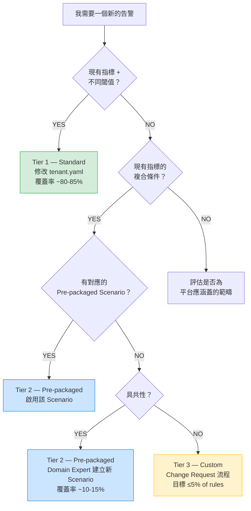
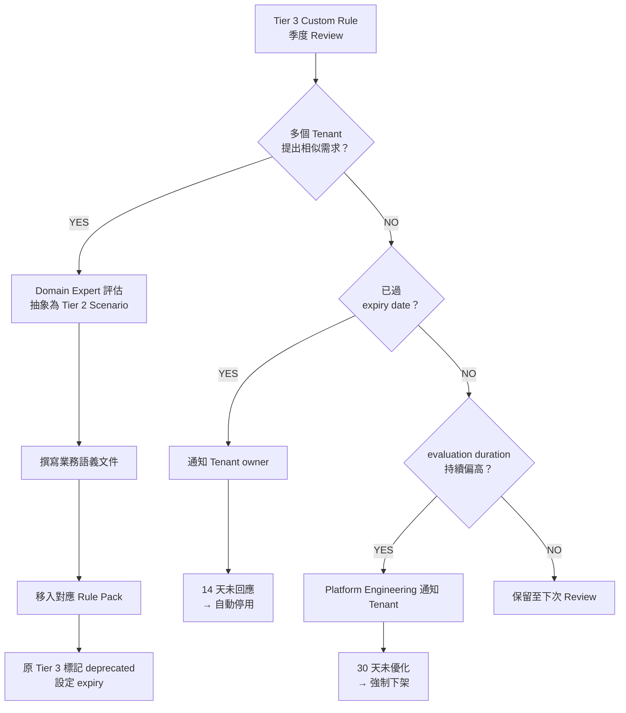

# 多租戶客製化規則治理規範 (Custom Rule Governance Model)

> **受眾**: Platform Engineering、Domain Experts (DBA/Infra)、Tenant Tech Leads
> **版本**: v1.0.0
> **相關文件**: [架構與設計](architecture-and-design.md)、[規則包目錄](../rule-packs/README.md)、[遷移指南](migration-guide.md)

---

## 1. 目的

Dynamic Alerting 平台的核心價值在於 **O(M) 複雜度**：定義 M 種指標類型一次，所有 Tenant 透過 Config 調整閾值，不需要每個 Tenant 維護自己的 PromQL。

然而在企業實務中，部分 Tenant 的告警需求無法單靠閾值差異涵蓋，可能涉及不同的條件組合或業務場景。本規範定義三層治理模型，在保持 O(M) 效能優勢的前提下，提供結構化的客製化路徑。

---

## 2. 三層治理模型



### 2.1 Tier 1 — Standard（Config-Driven 三態控制）

**覆蓋率**: 約 80–85% 的 Tenant 需求

Tenant 透過 `tenant.yaml` 設定閾值，不接觸 PromQL：

```yaml
# 三態控制範例（key 名稱對應 _defaults.yaml 中的指標定義）
mysql_connections: "800"        # Custom: 自訂閾值
mysql_cpu: ""                   # Default: 採用平台預設值 (省略或空字串)
mariadb_replication_lag: "disable" # Disable: 關閉此告警
```

每個指標支援 Warning / Critical 兩層嚴重度（`_critical` suffix），以及維度標籤篩選。

**Rule 複雜度**: O(M)，不隨 Tenant 數成長。

### 2.2 Tier 2 — Pre-packaged Scenarios（預製複合場景）

**覆蓋率**: 約 10–15% 的 Tenant 需求

由 Domain Expert 根據實戰經驗，預先定義具備明確業務語義的複合告警場景。Tenant 不需要撰寫 PromQL，僅決定是否啟用該場景並調整參數。

**現有範例 — `MariaDBSystemBottleneck`**：

```yaml
# 業務語義：連線數與 CPU 同時超標 = 真實負載瓶頸（非 connection leak）
- alert: MariaDBSystemBottleneck
  expr: |
    (
      tenant:mysql_threads_connected:max
      > on(tenant) group_left
      tenant:alert_threshold:connections
    )
    and on(tenant)
    (
      tenant:mysql_cpu_usage:rate5m
      > on(tenant) group_left
      tenant:alert_threshold:cpu
    )
    unless on(tenant)
    (user_state_filter{filter="maintenance"} == 1)
```

**啟停機制**：Tier 2 場景的啟停透過既有三態控制間接實現，不需要額外的開關 key：

- **啟用**：只要場景依賴的各指標閾值均為有效值（Custom 或 Default），場景自動生效。
- **停用某一指標**：將該指標設為 `"disable"`，對應的 recording rule 不產出值，`>` 比較自然為 false，場景不觸發。
- **全域維護模式**：透過 `state_filters.maintenance` 設為 `"true"`，場景中的 `unless ... user_state_filter{filter="maintenance"}` 子句生效，全面靜音。

> **設計考量**：PromQL 不支援動態開關。此機制透過「閾值缺失 → recording rule 無值 → 條件不成立」的傳遞效應實現隱式啟停，避免為每個場景引入額外 config key。

**設計原則**：

- Tier 2 場景由 Domain Expert 定義，不是由 Tenant 自行拼裝。「平台提供精選套餐，Tenant 決定要不要點」，而非「給 Tenant 積木自己拼」。
- 每個場景必須有明確的業務語義文件（回答什麼業務問題、為什麼這個組合有意義）。
- 閾值仍然是 Config-driven，Tenant 可調整數字但不能改變邏輯結構。

**Rule 複雜度**: O(場景數)，不隨 Tenant 數成長。

### 2.3 Tier 3 — True Custom（嚴格治理的客製化區）

**覆蓋率**: 不超過全部 Rule 的 5%

用於 Tier 1 + Tier 2 無法滿足的例外需求。必須經過正式的 Change Request 流程。

**准入條件**：

1. 提交者必須說明為什麼 Tier 1（閾值調整）和 Tier 2（預製場景）無法滿足需求
2. Domain Expert 審查後判斷是否值得抽象為新的 Tier 2 場景
3. 通過 CI deny-list linting（見 §4）
4. 標注 owner label 與 expiry date

**架構隔離**：

Tier 3 規則放置於獨立的 Prometheus Rule Group，可設定較長的 `evaluation_interval`（例如 30s 而非預設 15s）。這確保：

- 如果某條 Custom Rule 的 PromQL 過重導致 evaluation 延遲，影響範圍被隔離在該 group 內
- Tier 1 和 Tier 2 的告警時效性不受 Noisy Neighbor 影響
- 平台團隊可獨立監控 Custom Rule Group 的 evaluation duration

```yaml
# rule-packs/custom/tenant-specific.yaml（此目錄於首個 Tier 3 Rule 提交時建立）
groups:
  - name: custom_tenant_rules
    interval: 30s   # 獨立 evaluation interval
    rules:
      - alert: CustomAlert_db-a_special_tablespace
        expr: |
          custom_tablespace_usage{tenant="db-a", tablespace="SPECIAL_APP"} > 95
        labels:
          tier: "custom"
          owner: "team-db-a"
          expiry: "2026-06-30"
        annotations:
          ticket: "REQ-12345"
          justification: "Tier 2 無對應場景：單一特殊 tablespace 的獨立閾值"
```

**Rule 複雜度**: O(Custom Rule 數)。管理目標是控制在全部 Rule 的 5% 以內。

---

## 3. 權責定義 (RnR)

本平台涉及三種角色。在小型團隊中同一人可能兼任多個角色，重點是職責邊界清楚，不是組織架構。

| | Platform Engineering | Domain Expert | Tenant |
|---|---|---|---|
| **定位** | 基礎設施提供者 + 護欄建立者 | 黃金標準 (Golden Standards) 制定者 | 平台使用者 + 業務系統負責人 |
| **Tier 1** | 保證告警引擎運作 | 定義預設閾值、指標語義 | 自行調整 Warning/Critical 閾值 |
| **Tier 2** | 保證告警引擎運作 | 設計場景、撰寫業務語義文件 | 決定是否啟用場景 |
| **Tier 3** | 效能監控 + 強制下架權 | 審查需求、判斷是否晉升 Tier 2 | You build it, you run it（SLA 不保證） |
| **CI/CD** | 維護 deny-list linting + Rule Pack 結構驗證 | 維護所屬 Rule Pack | — |
| **SLA 範圍** | 告警引擎正常運作（eval、scrape、routing） | Tier 1/2 業務正確性 | Tier 3 告警品質自負 |

> **實務補充**: Tenant 團隊通常不具備撰寫 PromQL 的能力。實際流程中，Tenant 提出需求，Domain Expert 評估後代為撰寫，但 SLA 歸屬仍回到 Tenant — 即「Domain Expert 幫你寫，但告警品質由你負責」。

**責任歸屬速查**：

| 情境 | 責任歸屬 |
|------|---------|
| Prometheus 掛掉，所有告警失效 | Platform Engineering |
| Tier 1 閾值太低導致誤報 | Tenant（閾值由 Tenant 自行設定） |
| Tier 2 場景邏輯設計不當，導致該場景全域漏報 | Domain Expert |
| Tier 3 Custom Rule 語法太重，拖慢 evaluation | Platform Engineering 強制下架 → Tenant 修正後重新提交 |
| Tier 3 Custom Rule 誤報 | Tenant |

---

## 4. CI 護欄：Deny-list Linting

所有提交至 `rule-packs/custom/` 的 Rule 必須通過自動化檢查。

### 4.1 Deny-list 規則

```yaml
# .github/custom-rule-policy.yaml（可選；lint 工具有內建 default policy）
denied_functions:
  - holt_winters           # CPU 密集型函式
  - predict_linear         # 大範圍回溯查詢
  - quantile_over_time     # 高記憶體消耗

denied_patterns:
  - '=~".*"'              # 全通配 regex（效能殺手）
  - 'without(tenant)'     # 破壞 tenant 隔離

required_labels:
  - tenant                 # 所有 Custom Rule 必須帶 tenant label

max_range_duration: 1h     # 禁止 [7d] 等超長 range vector
max_evaluation_interval: 60s  # Custom Rule group interval 上限
```

### 4.2 Linting 工具

```bash
# CI 中執行
python3 scripts/tools/lint_custom_rules.py rule-packs/custom/

# 使用自訂 policy
python3 scripts/tools/lint_custom_rules.py rule-packs/custom/ --policy .github/custom-rule-policy.yaml

# 透過 da-tools 容器執行（不需 clone 專案）
docker run --rm \
  -v $(pwd)/my-custom-rules:/data/rules \
  ghcr.io/vencil/da-tools:1.0.0 \
  lint /data/rules --ci

# 輸出範例
# PASS: custom_tenant_rules.yaml - 2 rules checked
# FAIL: bad_rule.yaml:15 - denied function 'holt_winters' in expr
# FAIL: bad_rule.yaml:22 - missing required label 'tenant'
```

### 4.3 為什麼限制「重量」而非「數量」

固定 Quota（如「每個 Tenant 5 條」）的問題：浪費與不足並存（有的 Tenant 零條、有的第 6 條就卡住）、Rule 爆炸未解決（50 Tenant × 5 = 250 條，每條邏輯不同）、空轉成本（Prometheus 每 15 秒 evaluate 所有 Rule）。

Deny-list 方式限制的是每條 Rule 的「計算重量」，而非 Rule 數量。搭配獨立 Rule Group 隔離和 evaluation duration 監控，能在不設硬上限的情況下防止效能劣化。

---

## 5. 收編與晉升機制 (Assimilation Cycle)

每季進行一次 Custom Rule Review（建議與季度 SLA Review 合併）。



### 健康度指標（規劃中，尚未實作）

建議在 threshold-exporter 中追蹤：

```
# Custom Rule 數量分佈
da_custom_rule_count{tenant="db-a", tier="2"} 3
da_custom_rule_count{tenant="db-a", tier="3"} 1

# Tier 3 佔比超過 5% 時觸發告警
da_custom_rule_ratio_tier3 > 0.05
```

如果特定 Tenant 的 Tier 3 count 持續上升，這是一個信號：可能是 Tier 2 場景設計需要擴充，而非 Tenant 需求過於特殊。

---

## 6. 快速參考

### Tier 對照表

| | Tier 1 (Standard) | Tier 2 (Pre-packaged) | Tier 3 (Custom) |
|---|---|---|---|
| **控制方式** | tenant.yaml 閾值 | 閾值三態間接啟停 + 參數 | 完整 PromQL |
| **撰寫者** | Tenant 自行設定 | Domain Expert 預製 | Domain Expert 代寫 |
| **SLA** | 平台保證 | 平台保證 | 不保證 |
| **Rule 複雜度** | O(M) | O(場景數) | O(Custom 數) |
| **CI 檢查** | 自動（三態驗證） | Rule Pack CI | Deny-list linting |
| **生命週期** | 永久 | 永久 | 帶 expiry date |
