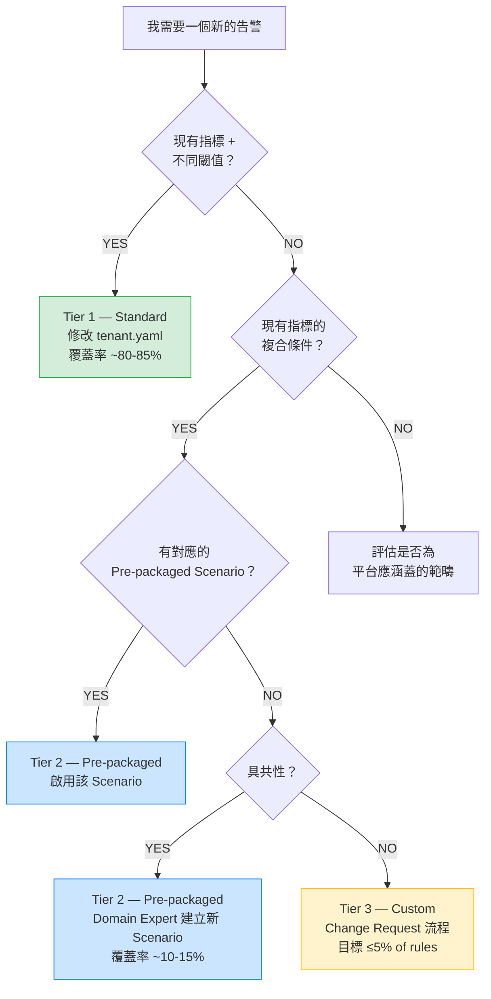
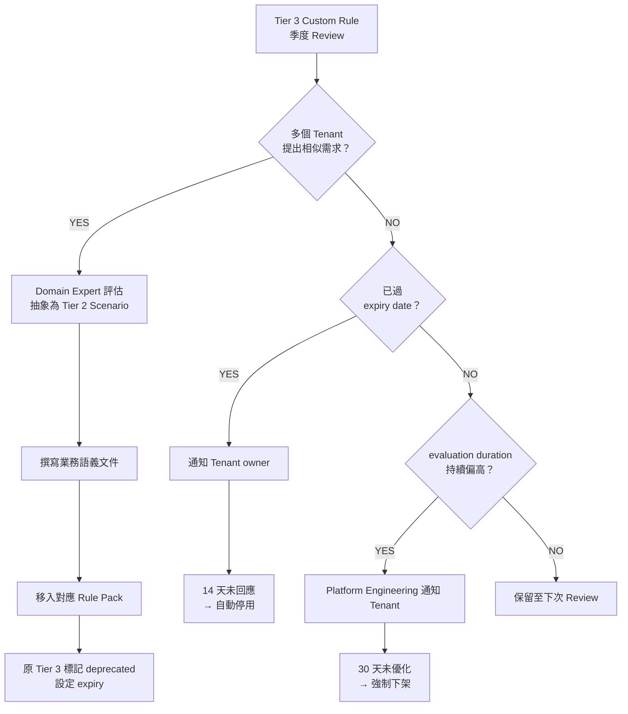

# 多租戶客製化規則治理規範 (Custom Rule Governance Model)

> **Language / 語言：** **中文 (Current)** | [English](./custom-rule-governance.en.md)

> **受眾**: Platform Engineering、Domain Experts (DBA/Infra)、Tenant Tech Leads
> **版本**: 
> **相關文件**: [架構與設計](architecture-and-design.md)、[規則包目錄](rule-packs/README.md)、[遷移指南](migration-guide.md)

---

## 1. 目的

Dynamic Alerting 平台的核心價值在於 **O(M) 複雜度**：定義 M 種指標類型一次，所有 Tenant 透過 Config 調整閾值，不需要每個 Tenant 維護自己的 PromQL。

然而在企業實務中，部分 Tenant 的告警需求無法單靠閾值差異涵蓋，可能涉及不同的條件組合或業務場景。本規範定義三層治理模型，在保持 O(M) 效能優勢的前提下，提供結構化的客製化路徑。

---

## 2. 三層治理模型


```mermaid
flowchart TD
    A["我需要一個新的告警"] --> B{"現有指標 +<br/>不同閾值？"}
    B -- YES --> T1["Tier 1 — Standard<br/>修改 tenant.yaml<br/>覆蓋率 ~80-85%"]
    B -- NO --> C{"現有指標的<br/>複合條件？"}
    C -- YES --> D{"有對應的<br/>Pre-packaged Scenario？"}
    D -- YES --> T2a["Tier 2 — Pre-packaged<br/>啟用該 Scenario"]
    D -- NO --> E{"具共性？"}
    E -- YES --> T2b["Tier 2 — Pre-packaged<br/>Domain Expert 建立新 Scenario<br/>覆蓋率 ~10-15%"]
    E -- NO --> T3["Tier 3 — Custom<br/>Change Request 流程<br/>目標 ≤5% of rules"]
    C -- NO --> F["評估是否為<br/>平台應涵蓋的範疇"]

    style T1 fill:#d4edda,stroke:#28a745
    style T2a fill:#cce5ff,stroke:#007bff
    style T2b fill:#cce5ff,stroke:#007bff
    style T3 fill:#fff3cd,stroke:#ffc107
```

### 2.1 Tier 1 — Standard（Tenant 自助設定）

**覆蓋率**: 約 80–85% 的 Tenant 需求

Tenant 透過 `tenant.yaml` 自助管理以下設定，不接觸 PromQL：

**閾值控制**（三態）：

```yaml
tenants:
  db-a:
    mysql_connections: "800"           # Custom: 自訂閾值
    mysql_cpu: ""                      # Default: 採用平台預設值
    mariadb_replication_lag: "disable"  # Disable: 關閉此告警
    mysql_connections_critical: "1000"  # 多層嚴重度（_critical suffix）
    "redis_queue_length{queue='tasks'}": "500"  # 維度標籤篩選
```

**運營模式控制**：

```yaml
    # Silent Mode — TSDB 有紀錄但不通知（支援 auto-expiry）
    _silent_mode:
      target: "warning"
      expires: "2026-04-01T00:00:00Z"
      reason: "Q1 效能調校期間"

    # Maintenance Mode — 完全不觸發 alert
    _state_maintenance: "enable"       # 或 {target, expires, reason} 結構化格式

    # Severity Dedup — warning + critical 同時存在時只通知 critical
    _severity_dedup: "enable"          # default | "enable" | "disable"
```

**Alert Routing**（自選 receiver + timing）：

```yaml
    _routing:
      receiver:
        type: slack                    # webhook | email | slack | teams | rocketchat | pagerduty
        api_url: "https://hooks.slack.com/services/..."
      group_wait: "30s"                # 5s–5m，平台 guardrails 自動 clamp
      repeat_interval: "4h"            # 1m–72h
      # Per-rule override— 特定 alert 走不同 receiver
      overrides:
        - alertname: "MariaDBReplicationLag"
          receiver:
            type: pagerduty
            service_key: "abc123"
```

> **工具支援**：`da-tools scaffold --tenant <name> --db <types>` 提供互動式引導，產出完整的 tenant.yaml（含 routing、silent mode、severity dedup 選項）。

**Rule 複雜度**: O(M)，不隨 Tenant 數成長。

### 2.2 Tier 2 — Pre-packaged Scenarios（預製複合場景）

**覆蓋率**: 約 10–15% 的 Tenant 需求

由 Domain Expert 預先定義具備明確業務語義的複合告警場景。Tenant 不需要撰寫 PromQL，僅決定是否啟用並調整參數。

**範例 — `MariaDBSystemBottleneck`**（連線數與 CPU 同時超標 = 真實負載瓶頸）：

```yaml
- alert: MariaDBSystemBottleneck
  expr: |
    (
      tenant:mysql_threads_connected:max
      > on(tenant) group_left
      tenant:alert_threshold:mysql_connections
    )
    and on(tenant)
    (
      tenant:mysql_cpu_usage:rate5m
      > on(tenant) group_left
      tenant:alert_threshold:mysql_cpu
    )
    unless on(tenant)
    (user_state_filter{filter="maintenance"} == 1)
```

**啟停機制**：Tier 2 場景的啟停透過既有三態控制間接實現，不需要額外的開關 key：

- **啟用**：只要場景依賴的各指標閾值均為有效值（Custom 或 Default），場景自動生效。
- **停用某一指標**：將該指標設為 `"disable"`，recording rule 不產出值，條件不成立，場景不觸發。
- **全域維護模式**：透過 `_state_maintenance` 設為 `"enable"`，場景中的 `unless` 子句生效。

> **設計考量**：PromQL 不支援動態開關。透過「閾值缺失 → recording rule 無值 → 條件不成立」的傳遞效應實現隱式啟停，避免為每個場景引入額外 config key。

**設計原則**：Tier 2 場景由 Domain Expert 定義，不是由 Tenant 自行拼裝。「平台提供精選套餐，Tenant 決定要不要點」。每個場景必須有明確的業務語義文件（回答什麼業務問題、為什麼這個組合有意義），閾值仍然是 Config-driven。

**Rule 複雜度**: O(場景數)，不隨 Tenant 數成長。

### 2.3 Tier 3 — True Custom（嚴格治理的客製化區）

**覆蓋率**: 不超過全部 Rule 的 5%

用於 Tier 1 + Tier 2 無法滿足的例外需求。必須經過正式的 Change Request 流程。

**准入條件**：

1. 提交者必須說明為什麼 Tier 1（閾值調整）和 Tier 2（預製場景）無法滿足需求
2. Domain Expert 審查後判斷是否值得抽象為新的 Tier 2 場景
3. 通過 CI deny-list linting（見 §4）
4. 標注 owner label 與 expiry date

**架構隔離**：

Tier 3 規則放置於獨立的 Prometheus Rule Group，可設定較長的 `evaluation_interval`（例如 30s 而非預設 15s），確保 Custom Rule 的效能影響被隔離，不影響 Tier 1/2 的告警時效性。

```yaml
# rule-packs/custom/tenant-specific.yaml（此目錄於首個 Tier 3 Rule 提交時建立）
groups:
  - name: custom_tenant_rules
    interval: 30s   # 獨立 evaluation interval
    rules:
      - alert: CustomAlert_db-a_special_tablespace
        expr: |
          custom_tablespace_usage{tenant="db-a", tablespace="SPECIAL_APP"} > 95
        labels:
          tier: "custom"
          owner: "team-db-a"
          expiry: "2026-06-30"
        annotations:
          ticket: "REQ-12345"
          justification: "Tier 2 無對應場景：單一特殊 tablespace 的獨立閾值"
```

**Rule 複雜度**: O(Custom Rule 數)。管理目標是控制在全部 Rule 的 5% 以內。

---

## 3. 權責定義 (RnR)

本平台定義三種職責角色。在小型團隊中同一人可能身兼數職——重點是理解每個動作的責任歸屬，而非要求三個獨立部門。

| | Platform Engineering | Domain Expert | Tenant |
|---|---|---|---|
| **定位** | 基礎設施 + 護欄 | 黃金標準制定者 | 業務系統負責人 |
| **Tier 1** | 保證引擎運作 | 定義預設閾值、指標語義 | 自助設定閾值、routing、silent/maintenance mode |
| **Tier 2** | 保證引擎運作 | 設計場景、撰寫業務語義文件 | 決定是否啟用場景、調整參數 |
| **Tier 3** | 效能監控 + 強制下架權 | 審查需求、判斷晉升 Tier 2 | You build it, you run it（SLA 不保證） |
| **CI/CD** | 維護 deny-list + 結構驗證 | 維護所屬 Rule Pack | — |
| **SLA** | 告警引擎正常運作 | Tier 1/2 業務正確性 | Tier 3 品質自負 |

> **實務補充**: Tenant 通常不具備撰寫 PromQL 的能力。Tier 3 的實際流程是 Tenant 提出需求，Domain Expert 代為撰寫，但 SLA 歸屬回到 Tenant — 即「幫你寫，但品質由你負責」。

**責任歸屬速查**：

| 情境 | 責任歸屬 |
|------|---------|
| Prometheus 掛掉，所有告警失效 | Platform Engineering |
| Tier 1 閾值太低導致誤報 | Tenant（閾值由 Tenant 自行設定） |
| Tier 2 場景邏輯設計不當，導致全域漏報 | Domain Expert |
| Tier 3 Custom Rule 拖慢 evaluation | Platform Engineering 強制下架 → Tenant 修正後重新提交 |
| Tier 3 Custom Rule 誤報 | Tenant |

---

## 4. CI 護欄：Deny-list Linting

所有提交至 `rule-packs/custom/` 的 Rule 必須通過自動化檢查。

### 4.1 Deny-list 規則

```yaml
# .github/custom-rule-policy.yaml（可選；lint 工具有內建 default policy）
denied_functions:
  - holt_winters           # CPU 密集型函式
  - predict_linear         # 大範圍回溯查詢
  - quantile_over_time     # 高記憶體消耗

denied_patterns:
  - '=~".*"'              # 全通配 regex（效能殺手）
  - 'without(tenant)'     # 破壞 tenant 隔離

required_labels:
  - tenant                 # 所有 Custom Rule 必須帶 tenant label

max_range_duration: 1h     # 禁止 [7d] 等超長 range vector
max_evaluation_interval: 60s  # Custom Rule group interval 上限

# 平台 COMPILED pack 的逐檔豁免（v2.10.0）——deny-list 治理對象是租戶手寫
# raw PromQL；compiler 產出的 pack（如 Custom Alerts forecast recipe 的
# predict_linear，成本緩解在編譯期內建）由 file_overrides 取得列管豁免
file_overrides:
  - path: rule-packs/rule-pack-custom-alerts.yaml
    require_generated_marker: true   # 檔頭須帶 GENERATED 標記，否則照常全檢
    policy:
      denied_functions: [holt_winters, quantile_over_time]  # predict_linear 豁免
      max_range_duration: 96h        # forecast lookback = max(2·horizon, 1h)，horizon ≤ 48h
```

> **豁免不是跳過（四層護欄）**：(1) `path` 錨在掃描樹頂層（精確路徑、非
> suffix），巢狀 `rule-packs/*/rule-packs/<file>` 不取得豁免；(2) 須帶
> GENERATED 檔頭，否則 ERROR + 全檢；(3) 只有 `denied_functions` /
> `max_range_duration` 可被放寬（白名單），列其他 key（如清空
> `required_labels`）會被忽略並回報 ERROR；(4) 未覆寫的檢查照跑。CI 另以
> `compile_custom_alerts.py --check` drift gate 防止手寫檔冒充 compiled pack。

### 4.2 Linting 工具

```bash
# CI 中執行
python3 scripts/tools/ops/lint_custom_rules.py rule-packs/custom/

# 使用自訂 policy
python3 scripts/tools/ops/lint_custom_rules.py rule-packs/custom/ --policy .github/custom-rule-policy.yaml

# 透過 da-tools 容器執行（不需 clone 專案）
docker run --rm \
  -v $(pwd)/my-custom-rules:/data/rules \
  ghcr.io/vencil/da-tools:v2.9.0 \
  lint /data/rules --ci

# 輸出範例
# PASS: custom_tenant_rules.yaml - 2 rules checked
# FAIL: bad_rule.yaml:15 - denied function 'holt_winters' in expr
# FAIL: bad_rule.yaml:22 - missing required label 'tenant'
```

Lint 工具同時會對缺少 `expiry` 或 `owner` label 的 Custom Rule 產出 WARN（不阻擋 CI，但提醒補齊）。

> **一站式驗證**：`make validate-config` 或 `validate_config.py --rule-packs rule-packs/` 會自動將 deny-list linting 納入整體驗證報告，與 YAML syntax、schema、route 檢查一併執行。
>
> **變更影響分析**：閾值或配置變更時，可用 `da-tools config-diff --old-dir <base> --new-dir <pr>` 產出 blast radius 報告（每筆變更標記 tighter/looser/added/removed），適合作為 PR review 的輔助決策資訊。詳見 [GitOps 部署指南](integration/gitops-deployment.md)。

### 4.3 為什麼限制「重量」而非「數量」

Deny-list 限制的是每條 Rule 的「計算重量」（禁止高成本函式、限制 range 長度），而非 Rule 數量。搭配獨立 Rule Group 隔離和 evaluation duration 監控，能在不設硬上限的情況下防止效能劣化。

---

## 5. 收編與晉升機制 (Assimilation Cycle)

每季進行一次 Custom Rule Review（建議與季度 SLA Review 合併）。


```mermaid
flowchart TD
    A["Tier 3 Custom Rule<br/>季度 Review"] --> B{"多個 Tenant<br/>提出相似需求？"}
    B -- YES --> C["Domain Expert 評估<br/>抽象為 Tier 2 Scenario"]
    C --> C1["撰寫業務語義文件"]
    C1 --> C2["移入對應 Rule Pack"]
    C2 --> C3["原 Tier 3 標記 deprecated<br/>設定 expiry"]
    B -- NO --> D{"已過<br/>expiry date？"}
    D -- YES --> E["通知 Tenant owner"]
    E --> E1["14 天未回應<br/>→ 自動停用"]
    D -- NO --> F{"evaluation duration<br/>持續偏高？"}
    F -- YES --> G["Platform Engineering 通知 Tenant"]
    G --> G1["30 天未優化<br/>→ 強制下架"]
    F -- NO --> H["保留至下次 Review"]
```

**已實作的平台監控**：Grafana Platform Dashboard 已包含租戶三態狀態（silent/maintenance/severity dedup）、reload 活動追蹤、cardinality 監控面板，可觀察平台整體健康度。`TenantSilentMode` / `TenantSeverityDedupEnabled` sentinel alerts 提供即時狀態可視化。

**規劃中**：Custom Rule 數量分佈追蹤（`da_custom_rule_count{tier="3"}`）、Tier 3 佔比自動告警（目標 ≤5%）。待首批 Tier 3 Rule 上線後啟動。

---

## 6. 快速參考

### Tier 對照表

| | Tier 1 (Standard) | Tier 2 (Pre-packaged) | Tier 3 (Custom) |
|---|---|---|---|
| **控制方式** | tenant.yaml（閾值 + routing + 運營模式） | 閾值三態間接啟停 + 參數 | 完整 PromQL |
| **撰寫者** | Tenant 自行設定 | Domain Expert 預製 | Domain Expert 代寫 |
| **SLA** | 平台保證 | 平台保證 | 不保證 |
| **Rule 複雜度** | O(M) | O(場景數) | O(Custom 數) |
| **CI 檢查** | Schema 驗證 + Route 驗證 | Rule Pack CI | Deny-list linting |
| **生命週期** | 永久 | 永久 | 帶 expiry date |
| **工具** | `scaffold` / `patch_config` | Rule Pack YAML | `lint` / `validate-config` |

## 7. 規則生命週期治理（全 tier 生命週期視圖）

> **給誰**：從既有系統遷入、要評估「一條規則能不能被管一輩子」的 platform / domain 負責人。§1–§6 按**治理層級**組織；本節按**規則的一生**橫切。每階段給：平台保證、⚠️ 已知限制、how-to 連結。

規則在本平台不是單一實體——依 tier（平台 Rule Pack / 租戶閾值 Tier 1 / Tier 3 Custom）不同，生命週期機制不同。下表按「生 → 老 → 病 → 死」橫切：

| 階段 | 平台 Rule Pack | 租戶閾值（Tier 1） | Tier 3 Custom | how-to |
|---|---|---|---|---|
| **生** 訂定 | 平台寫 PromQL pack | `tenant.yaml` 填純數字 | Domain Expert 代寫 + deny-list lint | [Domain Expert 入門](getting-started/for-domain-experts.md) · 本文 §2 |
| **老** 切版（V2） | 改 pack（CI gate） | **version-aware 閾值**：同租戶多版本並存、升版 emergent cutover、動態降級 | 隨 pack 演進 | [Version-Aware 使用攻略](scenarios/version-aware-thresholds.md) · [ADR-024](adr/024-version-aware-threshold-via-dimensional-label.md) |
| **病** 修錯 | 改 pack + promtool | 改數字 + shadow 數值 diff 驗證 | 改 PromQL + lint | [故障排查](troubleshooting.md) · [Shadow Monitoring 切換](scenarios/shadow-monitoring-cutover.md) |
| **死** 退役 | 移除 pack rule（Projected Volume `optional`，零 PR 衝突） | 移除 key → series 消失；未宣告版本的閾值 = 孤兒，由 `version_orphaned` sentinel（7d/30d）偵測 | deprecate + expiry + 14d 未回應自動停用 + 30d 強制下架（見本文 §5） | 本文 §5 · [ADR-024](adr/024-version-aware-threshold-via-dimensional-label.md) |

**⚠️ 誠實的成熟度與限制（遷入評估前必讀）**：

- **切版**：version-aware 閾值目前僅 **kubernetes pilot（container_cpu / memory）**；其餘 pack 寫 `version` key 會被 da-guard 拒（非-k8s 版本對齊列 future）。
- **退役**：租戶閾值 / 版本的退役今天是 **detect-only**（`version_orphaned` sentinel + portal 黃燈 + CLI），**auto-GC PR bot 尚未實作**（需人工清）；只有 Tier 3 custom 有 expiry-based 自動下架（§5）。
- **租戶自訂告警**：6 種參數化 recipe（threshold / rate / ratio / absence / p99_latency / forecast）+ 生命週期（`status: active / deprecated / eol`）**已隨 v2.9.0 落地**（epic #741，[ADR-024 §Custom Alerts](adr/024-version-aware-threshold-via-dimensional-label.md)）。**仍為 future**：Level 2 bounded-DSL / Level 3 raw-PromQL 逃生門、全域 rule-count budget（規劃中）。
- **爆炸半徑**：平台規則靠 O(M) 向量化（一條規則蓋全租戶，改一處影響全部）→ CI promtool gate + shadow 數值 diff 為安全網；per-tenant / version 維度受 Cardinality Guard（per-tenant 500）封頂。

**存取治理**（誰能在各階段改什麼、稽核、break-glass）見 [governance-security.md](governance-security.md)；**Tier 模型與晉升機制**見本文 §2 / §5。

### 7.1 Runtime 對帳邊界（#747）— 偵測-only，不自癒

規則狀態橫跨**三層 source-of-truth**，兩兩會漂移：(1) Git（宣告意圖）→ (2) K8s ConfigMap / projected volume（部署物）→ (3) Prometheus runtime（實際載入的規則）。

- **(1)↔(2) 已有 HARD gate**：configmap↔source 與 operator-manifest drift 於 **PR 期**強制比對（[#711](https://github.com/vencil/Dynamic-Alerting-Integrations/issues/711) / [#714](https://github.com/vencil/Dynamic-Alerting-Integrations/issues/714)）。
- **(1)/(2)↔(3) 是唯一沒蓋到的 runtime 腿**：reload 失敗、projected-volume lag、手改 configmap、孤兒規則殘留——PR 期 gate 全看不到。由 `da-tools runtime-audit`（**唯讀**，查 `/api/v1/rules` 的 rule identity + health）補上，分類 MISSING / UNHEALTHY / ORPHAN（用法見 [CLI Reference](cli-reference.md#runtime-audit)）。

**邊界決策（locked）**：runtime 對帳一律 **偵測 → 報告（exit code / 指標）→ 由人決定**，對齊平台既有 silent-failure 範式（#631 phantom reload / #643 silent parse / #652 cardinality truncation）。

- ⛔ **Reject 自癒 / 常駐 reconciliation Operator**：機器回寫人類平面（GitOps 下 Git 須為唯一且有強制力的真理）+ 常駐器自身成為第 4 個會漂移 / OOM 的 SoT（觀測者悖論遞迴一層）。
- `version_orphaned` sentinel **保留為 visibility 訊號**（非 config SoT、非被 runtime-audit 取代）；runtime-audit 是它的硬比對補強。

**Defer-with-trigger（heavier 持續形態）**：把 runtime-audit 包成 in-cluster 排程 CronJob、或新增 per-layer-pair drift 指標 → 待下列 trigger 才做：(1) 首次「Git 乾淨但叢集殘留 stale / orphan 規則」的 runtime drift incident；(2) 車隊規模使「`--check`-at-PR」不足以保證 runtime 一致。詳見 [#747](https://github.com/vencil/Dynamic-Alerting-Integrations/issues/747)。

## 8. 撰寫實務：以指標值表達的狀態／錯誤代碼（value-form codes）

> **給誰**：要為「指標的**值**本身就是狀態碼／錯誤碼」設告警的 domain expert / tenant。典型案例：MariaDB semi-sync replication 中止的 `mysql_semisync_master_last_errno`，其**值** 1236 代表「binlog 位置遺失」。

平台 recipe 的閾值比對作用在指標的**值**上。值是連續量（CPU%、queue depth）時 `>`/`<` 很自然；但當值是一個**離散代碼**時，會遇到兩種表達形式：

- **label-form**：代碼在標籤裡，值是計數／存在旗標 —— `mysql_errno_total{errno="1236"}`。
- **value-form**：代碼**就是**值 —— `mysql_semisync_master_last_errno` = 1236。

**首選：把代碼變成標籤（value → label，#810 option 1）**

只要做得到，**優先讓代碼以標籤呈現**，再用 `selectors` 精確過濾、`threshold > 0` 觸發：

```yaml
- recipe: threshold
  name: semisync_err_1236
  metric: mysql_errno_total      # 值=該 errno 的出現次數；errno 在標籤
  selectors: {errno: "1236"}
  op: ">"
  window: 5m
  threshold: "0:critical"        # 出現過即觸發
```

為何首選：(1) 基數低且穩定（一條 series，標籤值有限）；(2) **多代碼**可用一條 regex 解決（見下）；(3) 不必為每個代碼開一條 `==` recipe（每條吃一個 shape + cap 額度）。

**何時用 `==`（value-form fallback）**

當你**無法**把指標重塑成 label-form（用現成 exporter、無權改來源）時，用 `threshold` recipe 的 `==`：

```yaml
- recipe: threshold
  name: semisync_errno_1236
  metric: mysql_semisync_master_last_errno   # 值=errno 本身
  op: "=="
  window: 5m
  threshold: "1236:critical"
```

`==` 為 **threshold recipe 限定**（計算型 recipe——rate／ratio／p99／forecast——兩側 validator 一致拒絕：浮點等值脆弱）。語意是 **any-match**：逐 replica 的原始值先比代碼再聚合，**任一**實例等於該碼即觸發，多副本持不同碼不會互相掩蓋。

**決策樹**

1. 能否讓 exporter／relabel 把代碼放進**標籤**？→ 能：用 **label-form**（首選）。
2. 不能、且只比**單一**代碼？→ 用 **`==`**。
3. 不能、但要比**多個**代碼？→ 仍盡量回到 label-form + `selectors_re` regex（見下）；真的回不去才開多條 `==`。

**多個代碼的比對**

label-form 一條 regex 即涵蓋多碼：

```yaml
  selectors_re: {errno: "1236|1032|1156"}
```

value-form 的 `==` 只能比**單一**代碼；多碼需多條 recipe（各吃一個 shape + cap 額度）——這是偏好 label-form 的又一理由。

**重塑不了 exporter 時的退路（SRE-mediated）**

若租戶無權改 exporter，value→label 的重塑可在**抓取階段**用 Prometheus `metric_relabel_configs` 完成。⚠️ 本平台的 scrape 設定由**平台／SRE 持有**（`k8s/03-monitoring/configmap-prometheus.yaml`），**非租戶自助**——租戶面只有 `conf.d/` 閾值。故此退路是「向平台／SRE 申請一條 relabel 規則」，不是租戶能單獨完成的動作。

**Exporter 存活性（通用於所有 value-based 告警，不只 `==`）**

value-form 比對有個共同盲點：**exporter 死掉 → series 消失 → 沒有任何東西觸發 → 看起來健康**。這**不是 `==` 獨有**——`>`／`<` 同樣盲。要補存活性偵測，配一條 `absence` recipe：

```yaml
- recipe: absence
  name: errno_exporter_gone
  metric: mysql_semisync_master_last_errno
  window: 10m
  threshold: "0:critical"
```

但**要不要配，取決於 exporter 的 shape**：

- **連續型（健康時 emit 0）**：series 消失 = exporter 死 → **配 absence** 有意義。
- **稀疏型（只在出錯時 emit）**：缺席 = 正常狀態 → **不要配**，否則健康時反而誤報。

兩個 `absence` 的性質要先知道：(1) **respect maintenance**（維護模式會抑制）；(2) **tenant 聚合**——它偵測的是該租戶**全副本**缺席，**不抓單副本死亡**；要 per-replica 存活性，用 `selectors` 釘穩定實例名（適用 StatefulSet 穩定名，**不適用** Deployment 隨機 pod 名）。

**⚠️ absence 的評估成本（高基數慎用）**

`absence` 的底層是 `count_over_time(<metric><selectors>[<window>])`——每次評估會掃 `<metric>` 在窗內**所有符合 selectors 的 series**。**高基數指標不給 `selectors`** = 掃全部 series → 記憶體／CPU 峰值（在 VictoriaMetrics 等後端尤其明顯）。務必用 `selectors` 限到具體範圍（instance／pod／特定 label），別對裸高基數指標直接下 `absence`。這也是「能用 label-form 就別堆 value-form」的另一面：label-form 的 `selectors` 天生限縮掃描範圍。

**Staleness（值過期）**

exporter 活著、但值是數小時前的 stale 值時，`==` 會對舊代碼觸發。用 recipe 的 `for:` 要求條件**持續**一段時間，過濾瞬時／陳舊讀數。

可執行的安全配對範例見 `rule-packs/recipes/examples/conf.d/shop.yaml`（`semisync_errno_1236` 案例 + `process_status_code` 的 Shape-X 配對）。

---

## 相關資源

| 資源 | 相關性 |
|------|--------|
| ["Multi-Tenant Custom Rule Governance Model"] | ⭐⭐⭐ |
| ["治理、稽核與安全合規"](./governance-security.md) | ⭐⭐ |
