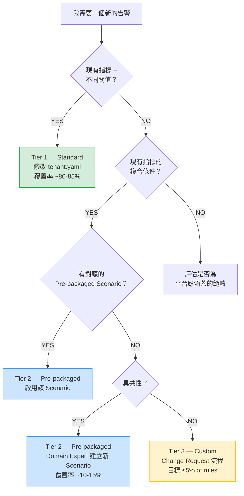
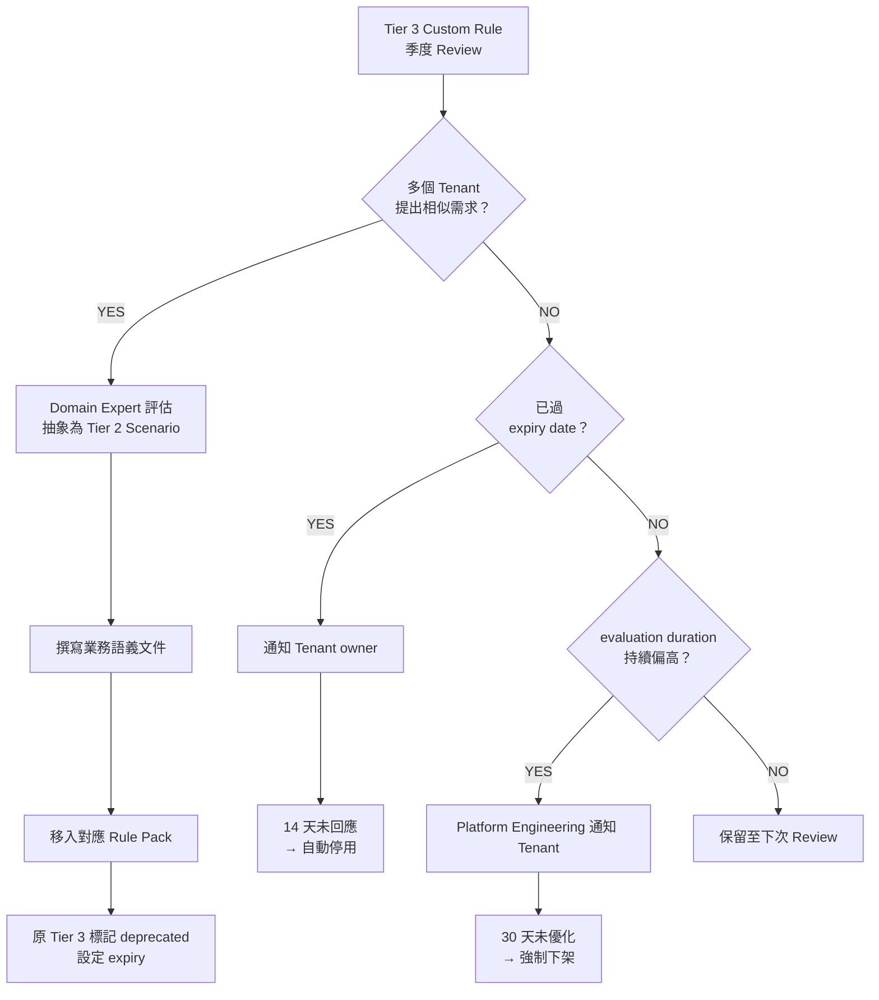

# 多租戶客製化規則治理規範 (Custom Rule Governance Model)

> **受眾**: Platform Engineering、Domain Experts (DBA/Infra)、Tenant Tech Leads
> **版本**: 
> **相關文件**: [架構與設計](architecture-and-design.md)、[規則包目錄](rule-packs/README.md)、[遷移指南](migration-guide.md)

---

## 1. 目的

Dynamic Alerting 平台的核心價值在於 **O(M) 複雜度**：定義 M 種指標類型一次，所有 Tenant 透過 Config 調整閾值，不需要每個 Tenant 維護自己的 PromQL。

然而在企業實務中，部分 Tenant 的告警需求無法單靠閾值差異涵蓋，可能涉及不同的條件組合或業務場景。本規範定義三層治理模型，在保持 O(M) 效能優勢的前提下，提供結構化的客製化路徑。

---

## 2. 三層治理模型


```mermaid
flowchart TD
    A["我需要一個新的告警"] --> B{"現有指標 +<br/>不同閾值？"}
    B -- YES --> T1["Tier 1 — Standard<br/>修改 tenant.yaml<br/>覆蓋率 ~80-85%"]
    B -- NO --> C{"現有指標的<br/>複合條件？"}
    C -- YES --> D{"有對應的<br/>Pre-packaged Scenario？"}
    D -- YES --> T2a["Tier 2 — Pre-packaged<br/>啟用該 Scenario"]
    D -- NO --> E{"具共性？"}
    E -- YES --> T2b["Tier 2 — Pre-packaged<br/>Domain Expert 建立新 Scenario<br/>覆蓋率 ~10-15%"]
    E -- NO --> T3["Tier 3 — Custom<br/>Change Request 流程<br/>目標 ≤5% of rules"]
    C -- NO --> F["評估是否為<br/>平台應涵蓋的範疇"]

    style T1 fill:#d4edda,stroke:#28a745
    style T2a fill:#cce5ff,stroke:#007bff
    style T2b fill:#cce5ff,stroke:#007bff
    style T3 fill:#fff3cd,stroke:#ffc107
```

### 2.1 Tier 1 — Standard（Tenant 自助設定）

**覆蓋率**: 約 80–85% 的 Tenant 需求

Tenant 透過 `tenant.yaml` 自助管理以下設定，不接觸 PromQL：

**閾值控制**（三態）：

```yaml
tenants:
  db-a:
    mysql_connections: "800"           # Custom: 自訂閾值
    mysql_cpu: ""                      # Default: 採用平台預設值
    mariadb_replication_lag: "disable"  # Disable: 關閉此告警
    mysql_connections_critical: "1000"  # 多層嚴重度（_critical suffix）
    "redis_queue_length{queue='tasks'}": "500"  # 維度標籤篩選
```

**運營模式控制**：

```yaml
    # Silent Mode — TSDB 有紀錄但不通知（支援 auto-expiry）
    _silent_mode:
      target: "warning"
      expires: "2026-04-01T00:00:00Z"
      reason: "Q1 效能調校期間"

    # Maintenance Mode — 完全不觸發 alert
    _state_maintenance: "enable"       # 或 {target, expires, reason} 結構化格式

    # Severity Dedup — warning + critical 同時存在時只通知 critical
    _severity_dedup: "enable"          # default | "enable" | "disable"
```

**Alert Routing**（自選 receiver + timing）：

```yaml
    _routing:
      receiver:
        type: slack                    # webhook | email | slack | teams | rocketchat | pagerduty
        api_url: "https://hooks.slack.com/services/..."
      group_wait: "30s"                # 5s–5m，平台 guardrails 自動 clamp
      repeat_interval: "4h"            # 1m–72h
      # Per-rule override— 特定 alert 走不同 receiver
      overrides:
        - alertname: "MariaDBReplicationLag"
          receiver:
            type: pagerduty
            service_key: "abc123"
```

> **工具支援**：`da-tools scaffold --tenant <name> --db <types>` 提供互動式引導，產出完整的 tenant.yaml（含 routing、silent mode、severity dedup 選項）。

**Rule 複雜度**: O(M)，不隨 Tenant 數成長。

### 2.2 Tier 2 — Pre-packaged Scenarios（預製複合場景）

**覆蓋率**: 約 10–15% 的 Tenant 需求

由 Domain Expert 預先定義具備明確業務語義的複合告警場景。Tenant 不需要撰寫 PromQL，僅決定是否啟用並調整參數。

**範例 — `MariaDBSystemBottleneck`**（連線數與 CPU 同時超標 = 真實負載瓶頸）：

```yaml
- alert: MariaDBSystemBottleneck
  expr: |
    (
      tenant:mysql_threads_connected:max
      > on(tenant) group_left
      tenant:alert_threshold:connections
    )
    and on(tenant)
    (
      tenant:mysql_cpu_usage:rate5m
      > on(tenant) group_left
      tenant:alert_threshold:cpu
    )
    unless on(tenant)
    (user_state_filter{filter="maintenance"} == 1)
```

**啟停機制**：Tier 2 場景的啟停透過既有三態控制間接實現，不需要額外的開關 key：

- **啟用**：只要場景依賴的各指標閾值均為有效值（Custom 或 Default），場景自動生效。
- **停用某一指標**：將該指標設為 `"disable"`，recording rule 不產出值，條件不成立，場景不觸發。
- **全域維護模式**：透過 `_state_maintenance` 設為 `"enable"`，場景中的 `unless` 子句生效。

> **設計考量**：PromQL 不支援動態開關。透過「閾值缺失 → recording rule 無值 → 條件不成立」的傳遞效應實現隱式啟停，避免為每個場景引入額外 config key。

**設計原則**：Tier 2 場景由 Domain Expert 定義，不是由 Tenant 自行拼裝。「平台提供精選套餐，Tenant 決定要不要點」。每個場景必須有明確的業務語義文件（回答什麼業務問題、為什麼這個組合有意義），閾值仍然是 Config-driven。

**Rule 複雜度**: O(場景數)，不隨 Tenant 數成長。

### 2.3 Tier 3 — True Custom（嚴格治理的客製化區）

**覆蓋率**: 不超過全部 Rule 的 5%

用於 Tier 1 + Tier 2 無法滿足的例外需求。必須經過正式的 Change Request 流程。

**准入條件**：

1. 提交者必須說明為什麼 Tier 1（閾值調整）和 Tier 2（預製場景）無法滿足需求
2. Domain Expert 審查後判斷是否值得抽象為新的 Tier 2 場景
3. 通過 CI deny-list linting（見 §4）
4. 標注 owner label 與 expiry date

**架構隔離**：

Tier 3 規則放置於獨立的 Prometheus Rule Group，可設定較長的 `evaluation_interval`（例如 30s 而非預設 15s），確保 Custom Rule 的效能影響被隔離，不影響 Tier 1/2 的告警時效性。

```yaml
# rule-packs/custom/tenant-specific.yaml（此目錄於首個 Tier 3 Rule 提交時建立）
groups:
  - name: custom_tenant_rules
    interval: 30s   # 獨立 evaluation interval
    rules:
      - alert: CustomAlert_db-a_special_tablespace
        expr: |
          custom_tablespace_usage{tenant="db-a", tablespace="SPECIAL_APP"} > 95
        labels:
          tier: "custom"
          owner: "team-db-a"
          expiry: "2026-06-30"
        annotations:
          ticket: "REQ-12345"
          justification: "Tier 2 無對應場景：單一特殊 tablespace 的獨立閾值"
```

**Rule 複雜度**: O(Custom Rule 數)。管理目標是控制在全部 Rule 的 5% 以內。

---

## 3. 權責定義 (RnR)

本平台定義三種職責角色。在小型團隊中同一人可能身兼數職——重點是理解每個動作的責任歸屬，而非要求三個獨立部門。

| | Platform Engineering | Domain Expert | Tenant |
|---|---|---|---|
| **定位** | 基礎設施 + 護欄 | 黃金標準制定者 | 業務系統負責人 |
| **Tier 1** | 保證引擎運作 | 定義預設閾值、指標語義 | 自助設定閾值、routing、silent/maintenance mode |
| **Tier 2** | 保證引擎運作 | 設計場景、撰寫業務語義文件 | 決定是否啟用場景、調整參數 |
| **Tier 3** | 效能監控 + 強制下架權 | 審查需求、判斷晉升 Tier 2 | You build it, you run it（SLA 不保證） |
| **CI/CD** | 維護 deny-list + 結構驗證 | 維護所屬 Rule Pack | — |
| **SLA** | 告警引擎正常運作 | Tier 1/2 業務正確性 | Tier 3 品質自負 |

> **實務補充**: Tenant 通常不具備撰寫 PromQL 的能力。Tier 3 的實際流程是 Tenant 提出需求，Domain Expert 代為撰寫，但 SLA 歸屬回到 Tenant — 即「幫你寫，但品質由你負責」。

**責任歸屬速查**：

| 情境 | 責任歸屬 |
|------|---------|
| Prometheus 掛掉，所有告警失效 | Platform Engineering |
| Tier 1 閾值太低導致誤報 | Tenant（閾值由 Tenant 自行設定） |
| Tier 2 場景邏輯設計不當，導致全域漏報 | Domain Expert |
| Tier 3 Custom Rule 拖慢 evaluation | Platform Engineering 強制下架 → Tenant 修正後重新提交 |
| Tier 3 Custom Rule 誤報 | Tenant |

---

## 4. CI 護欄：Deny-list Linting

所有提交至 `rule-packs/custom/` 的 Rule 必須通過自動化檢查。

### 4.1 Deny-list 規則

```yaml
# .github/custom-rule-policy.yaml（可選；lint 工具有內建 default policy）
denied_functions:
  - holt_winters           # CPU 密集型函式
  - predict_linear         # 大範圍回溯查詢
  - quantile_over_time     # 高記憶體消耗

denied_patterns:
  - '=~".*"'              # 全通配 regex（效能殺手）
  - 'without(tenant)'     # 破壞 tenant 隔離

required_labels:
  - tenant                 # 所有 Custom Rule 必須帶 tenant label

max_range_duration: 1h     # 禁止 [7d] 等超長 range vector
max_evaluation_interval: 60s  # Custom Rule group interval 上限
```

### 4.2 Linting 工具

```bash
# CI 中執行
python3 scripts/tools/ops/lint_custom_rules.py rule-packs/custom/

# 使用自訂 policy
python3 scripts/tools/ops/lint_custom_rules.py rule-packs/custom/ --policy .github/custom-rule-policy.yaml

# 透過 da-tools 容器執行（不需 clone 專案）
docker run --rm \
  -v $(pwd)/my-custom-rules:/data/rules \
  ghcr.io/vencil/da-tools:v2.4.0 \
  lint /data/rules --ci

# 輸出範例
# PASS: custom_tenant_rules.yaml - 2 rules checked
# FAIL: bad_rule.yaml:15 - denied function 'holt_winters' in expr
# FAIL: bad_rule.yaml:22 - missing required label 'tenant'
```

Lint 工具同時會對缺少 `expiry` 或 `owner` label 的 Custom Rule 產出 WARN（不阻擋 CI，但提醒補齊）。

> **一站式驗證**：`make validate-config` 或 `validate_config.py --rule-packs rule-packs/` 會自動將 deny-list linting 納入整體驗證報告，與 YAML syntax、schema、route 檢查一併執行。
>
> **變更影響分析**：閾值或配置變更時，可用 `da-tools config-diff --old-dir <base> --new-dir <pr>` 產出 blast radius 報告（每筆變更標記 tighter/looser/added/removed），適合作為 PR review 的輔助決策資訊。詳見 [GitOps 部署指南](gitops-deployment.md)。

### 4.3 為什麼限制「重量」而非「數量」

Deny-list 限制的是每條 Rule 的「計算重量」（禁止高成本函式、限制 range 長度），而非 Rule 數量。搭配獨立 Rule Group 隔離和 evaluation duration 監控，能在不設硬上限的情況下防止效能劣化。

---

## 5. 收編與晉升機制 (Assimilation Cycle)

每季進行一次 Custom Rule Review（建議與季度 SLA Review 合併）。


```mermaid
flowchart TD
    A["Tier 3 Custom Rule<br/>季度 Review"] --> B{"多個 Tenant<br/>提出相似需求？"}
    B -- YES --> C["Domain Expert 評估<br/>抽象為 Tier 2 Scenario"]
    C --> C1["撰寫業務語義文件"]
    C1 --> C2["移入對應 Rule Pack"]
    C2 --> C3["原 Tier 3 標記 deprecated<br/>設定 expiry"]
    B -- NO --> D{"已過<br/>expiry date？"}
    D -- YES --> E["通知 Tenant owner"]
    E --> E1["14 天未回應<br/>→ 自動停用"]
    D -- NO --> F{"evaluation duration<br/>持續偏高？"}
    F -- YES --> G["Platform Engineering 通知 Tenant"]
    G --> G1["30 天未優化<br/>→ 強制下架"]
    F -- NO --> H["保留至下次 Review"]
```

**已實作的平台監控**：Grafana Platform Dashboard 已包含租戶三態狀態（silent/maintenance/severity dedup）、reload 活動追蹤、cardinality 監控面板，可觀察平台整體健康度。`TenantSilentMode` / `TenantSeverityDedupEnabled` sentinel alerts 提供即時狀態可視化。

**規劃中**：Custom Rule 數量分佈追蹤（`da_custom_rule_count{tier="3"}`）、Tier 3 佔比自動告警（目標 ≤5%）。待首批 Tier 3 Rule 上線後啟動。

---

## 6. 快速參考

### Tier 對照表

| | Tier 1 (Standard) | Tier 2 (Pre-packaged) | Tier 3 (Custom) |
|---|---|---|---|
| **控制方式** | tenant.yaml（閾值 + routing + 運營模式） | 閾值三態間接啟停 + 參數 | 完整 PromQL |
| **撰寫者** | Tenant 自行設定 | Domain Expert 預製 | Domain Expert 代寫 |
| **SLA** | 平台保證 | 平台保證 | 不保證 |
| **Rule 複雜度** | O(M) | O(場景數) | O(Custom 數) |
| **CI 檢查** | Schema 驗證 + Route 驗證 | Rule Pack CI | Deny-list linting |
| **生命週期** | 永久 | 永久 | 帶 expiry date |
| **工具** | `scaffold` / `patch_config` | Rule Pack YAML | `lint` / `validate-config` |

## 相關資源

| 資源 | 相關性 |
|------|--------|
| ["Multi-Tenant Custom Rule Governance Model"] | ⭐⭐⭐ |
| ["治理、稽核與安全合規"](./governance-security.md) | ⭐⭐ |
