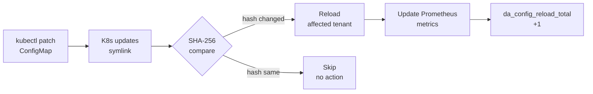
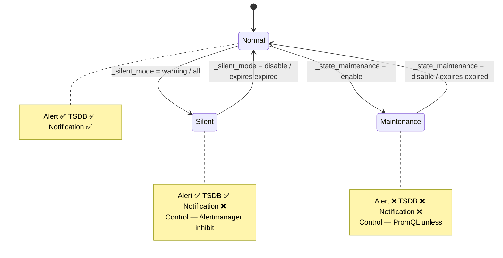
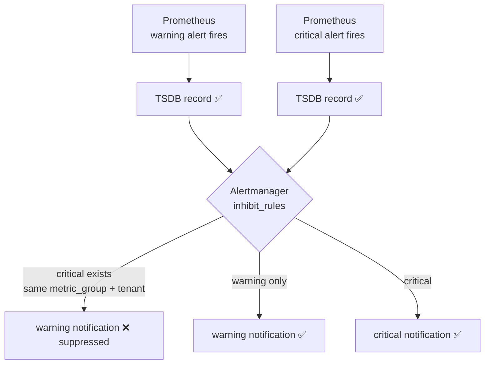

# Config-Driven Architecture Design

> **Language / 語言：** **English (Current)** | [中文](config-driven.md)
>
> ← [Back to Main Document](../architecture-and-design.en.md)

## 2. Core Design: Config-Driven Architecture

### 2.1 Three-State Logic

The platform supports a "three-state" configuration pattern, providing flexible default values, overrides, and disable mechanisms:

| State | Configuration | Prometheus Output | Description |
|-------|---------------|-------------------|-------------|
| **Custom Value** | `metric_key: 42` | ✓ Output custom threshold | Tenant override of default |
| **Omitted (Default)** | Not specified in YAML | ✓ Output platform default | Uses `_defaults.yaml` |
| **Disable** | `metric_key: "disable"` | ✗ No output | Completely disable metric |

**Prometheus output example:**

```
# Custom value (db-a tenant)
user_threshold{tenant="db-a", metric="mariadb_replication_lag", severity="warning"} 10

# Default value (db-b tenant, not overridden)
user_threshold{tenant="db-b", metric="mariadb_replication_lag", severity="warning"} 30

# Disabled (no output)
# (metric not present)
```

### 2.2 Directory Scanner Mode (conf.d/)

**Directory structure:**
```
conf.d/
├── _defaults.yaml         # Platform global defaults (managed by Platform team)
├── db-a.yaml             # Tenant A overrides (managed by db-a team)
├── db-b.yaml             # Tenant B overrides (managed by db-b team)
└── ...
```

**`_defaults.yaml` content (Platform managed):**
```yaml
defaults:
  mysql_connections: 80
  mysql_cpu: 80
  mysql_slave_lag: 30
  container_cpu: 80
  container_memory: 85

state_filters:
  container_crashloop:
    reasons: ["CrashLoopBackOff"]
    severity: "critical"
  maintenance:
    reasons: []
    severity: "info"
    default_state: "disable"
```

**`db-a.yaml` content (Tenant override):**
```yaml
tenants:
  db-a:
    mysql_connections: "70"          # Override default 80
    container_cpu: "70"              # Override default 80
    mysql_slave_lag: "disable"       # No replica, disable
    # mysql_cpu not specified → use default value 80
    # Dimensional labels
    "redis_queue_length{queue='tasks'}": "500"
    "redis_queue_length{queue='events', priority='high'}": "1000:critical"
```

#### Boundary Enforcement Rules

| File Type | Allowed Blocks | Violation Behavior |
|-----------|----------------|-------------------|
| Files with `_` prefix (`_defaults.yaml`) | `defaults`, `state_filters`, `tenants` | — |
| Tenant files (`db-a.yaml`) | Only `tenants` | Other blocks automatically ignored + WARN log |

#### SHA-256 Hot-Reload

Does not rely on file modification time (ModTime), but rather on **SHA-256 content hash**:

```bash
# On each ConfigMap update
$ sha256sum conf.d/_defaults.yaml conf.d/db-a.yaml conf.d/db-b.yaml
abc123... conf.d/_defaults.yaml
def456... conf.d/db-a.yaml
ghi789... conf.d/db-b.yaml

# Kubernetes ConfigMap symlink mounted will rotate
# Old hash → new hash
# threshold-exporter detects change, reloads configuration
```



**Why SHA-256 instead of ModTime?**
- Kubernetes ConfigMap creates a symlink layer, ModTime is unreliable
- Same content = same hash, avoid unnecessary reloads

#### Incremental Reload Internal Mechanism (v2.1.0)

`ConfigManager.IncrementalLoad()` implements four-phase incremental reload to avoid full parsing on every reload:

```
Phase 1: Mtime Guard — Quick Filtering
  ├─ stat() each file for mtime + size
  ├─ If (mtime+size unchanged) AND (file age > 2s) → reuse cached SHA-256
  ├─ Else → read file + compute SHA-256
  └─ Combine all per-file hashes → composite hash
     └─ composite hash == previous → return immediately (zero cost)

Phase 2: Per-File Hash Diff
  ├─ New hash not in old table → ADDED
  ├─ hash value different → CHANGED
  └─ Old hash not in new table → REMOVED

Phase 3: Selective Re-Parse
  ├─ Re-parse only ADDED + CHANGED files (YAML unmarshal)
  ├─ Clear cache for REMOVED files
  └─ Boundary enforcement (tenant files cannot have state_filters, etc.)

Phase 4: Incremental Merge
  ├─ If only tenant files changed (not _defaults/_profiles)
  │   → shallow-copy previous config + patch affected tenants (fast path)
  └─ Else → full merge all partial configs
```

**Atomic Swap**: `RWMutex` protects atomic updates of config/hash/cache. Read side (Prometheus scrape) uses `RLock()`, reload uses `Lock()`, ensuring scrape never reads half-updated state.

**Performance characteristics** (benchmark data see [§11](../benchmarks.en.md#11-under-load-benchmark-mode-100-synthetic-tenants)):

| Scenario | Latency | Code Path |
|----------|---------|-----------|
| 1000 tenants, no change (mtime guard hit) | ~1.5ms | stat-only + hash compare |
| 1000 tenants, 1 file changed | ~6.9ms | scan 6.2ms + re-parse 0.2ms + merge 0.5ms |
| 100 tenants, no change | ~129µs | per-file stat |

**Fallback**: If cache is empty or corrupted, automatically fall back to `fullDirLoad()` (full load).

### 2.3 Tenant-Namespace Mapping

The platform's `tenant` is a **logical identity** determined by two independent sources:

1. **Threshold side**: threshold-exporter derives tenant from the YAML config key (`tenants.db-a`), zero coupling with K8s namespace
2. **Data side**: Prometheus `relabel_configs` injects a `tenant` label into scraped metrics

Both sides must produce an exact match, but **their sources can differ**. This enables three mapping modes:

| Mode | Description | Prometheus relabel Strategy | Use Case |
|------|------------|---------------------------|----------|
| **1:1** (standard) | One Namespace = One Tenant | `source_labels: [__meta_kubernetes_namespace]` → `target_label: tenant` | Most deployments |
| **N:1** | Multiple Namespaces → One Tenant | Multiple namespace metrics relabeled to the same tenant value | Read/write split (`db-a-read` + `db-a-write` → `db-a`) |
| **1:N** | One Namespace → Multiple Tenants | Use Service label/annotation instead of namespace as tenant source | Shared-namespace multi-tenant architecture |

**N:1 relabel example** (multiple namespaces → one tenant):

```yaml
relabel_configs:
  - source_labels: [__meta_kubernetes_namespace]
    action: keep
    regex: "db-a-(read|write)"
  # Unify to db-a
  - source_labels: [__meta_kubernetes_namespace]
    target_label: tenant
    regex: "(db-[^-]+).*"    # Extract first segment as tenant
    replacement: "$1"
```

**1:N relabel example** (one namespace → multiple tenants):

```yaml
relabel_configs:
  - source_labels: [__meta_kubernetes_namespace]
    action: keep
    regex: "shared-db"
  # Read tenant identity from Service annotation
  - source_labels: [__meta_kubernetes_service_annotation_alerting_tenant]
    target_label: tenant
```

**Automation**: `scaffold_tenant.py --namespaces ns1,ns2` auto-generates N:1 relabel_configs snippet and writes a `_namespaces` metadata field in the tenant YAML for tool reference (does not affect metric logic).

**Design principle**: The platform core (threshold-exporter + Rule Packs) is completely namespace-agnostic. Mapping flexibility is entirely provided by Prometheus scrape config — no platform component changes needed. See [BYO Prometheus Integration Guide](../byo-prometheus-integration.en.md).

### 2.4 Multi-tier Severity

Support both `_critical` suffix and `"value:severity"` syntax:

**Method 1: `_critical` suffix (suitable for basic thresholds)**
```yaml
tenants:
  db-a:
    mysql_connections: "100"            # warning threshold
    mysql_connections_critical: "150"   # _critical → auto-generate critical alert
```

**Method 2: `"value:severity"` syntax (suitable for dimensional labels)**
```yaml
tenants:
  redis-prod:
    "redis_queue_length{queue='orders'}": "500:critical"
```

**Prometheus output:**
```
user_threshold{tenant="db-a", component="mysql", metric="connections", severity="warning"} 100
user_threshold{tenant="db-a", component="mysql", metric="connections", severity="critical"} 150
```

#### Auto-Suppression (Severity Dedup via Alertmanager Inhibit)

Severity dedup is handled at the **Alertmanager inhibit layer**, not in PromQL. This design preserves TSDB completeness while avoiding notification duplication.

**Key principle:** Prometheus always records both warning and critical metrics. Alertmanager's `inhibit_rules` suppress only the **notification**, not the alert itself.

**Prometheus alert rules:**

```yaml
- alert: MariaDBHighConnections          # warning
  expr: |
    ( tenant:mysql_threads_connected:max > on(tenant) group_left tenant:alert_threshold:connections )
    unless on(tenant) (user_state_filter{filter="maintenance"} == 1)
  for: 5m
  labels:
    severity: warning
    metric_group: "connections"

- alert: MariaDBHighConnectionsCritical  # critical
  expr: |
    ( tenant:mysql_threads_connected:max > on(tenant) group_left tenant:alert_threshold:connections_critical )
    unless on(tenant) (user_state_filter{filter="maintenance"} == 1)
  for: 5m
  labels:
    severity: critical
    metric_group: "connections"
```

**Alertmanager inhibit rule (per-tenant, auto-generated):**

```yaml
inhibit_rules:
  - source_matchers:
      - severity="critical"
      - metric_group=~".+"
      - tenant="db-a"
    target_matchers:
      - severity="warning"
      - metric_group=~".+"
      - tenant="db-a"
    equal: ["metric_group"]
```

**Result:**
- Connection count ≥ 150 (critical): Both warning and critical alerts fire in Prometheus (TSDB records both). Alertmanager's inhibit rule blocks only the **warning notification**, critical notification sends normally.
- Connection count 100–150 (warning only): Warning alert fires, critical does not. Warning notification sends.
- **TSDB completeness:** All alert firings remain in Prometheus TSDB regardless of notification suppression.

### 2.5 Regex Dimension Thresholds

Since v0.12.0, the config parser supports the `=~` operator, enabling regex-based fine-grained matching on dimension labels. This design allows thresholds to target specific dimension subsets without introducing external data dependencies.

**Configuration syntax:**
```yaml
tenants:
  db-a:
    # Exact match
    "oracle_tablespace_used_percent{tablespace='USERS'}": "85"
    # Regex match: all tablespaces starting with SYS
    "oracle_tablespace_used_percent{tablespace=~'SYS.*'}": "95"
```

**Implementation path:**

1. **Exporter layer**: Config parser detects the `=~` operator and outputs the regex pattern as a `_re` suffixed label
   ```
   user_threshold{tenant="db-a", metric="oracle_tablespace_used_percent",
                  tablespace_re="SYS.*", severity="warning"} 95
   ```
2. **Recording rule layer**: PromQL uses `label_replace` + `=~` for actual matching at query time
3. **Design principle**: The exporter remains a pure config→metric converter; matching logic is entirely handled by Prometheus native vector operations

### 2.6 Scheduled Thresholds

Since v0.12.0, thresholds support time-window scheduling, allowing automatic threshold switching across different time periods. Typical use cases: relaxed thresholds during nighttime maintenance windows, tightened thresholds during peak hours.

**Configuration syntax:**
```yaml
tenants:
  db-a:
    mysql_connections:
      default: "100"
      overrides:
        - window: "22:00-06:00"    # UTC nighttime window (cross-midnight supported)
          value: "200"             # Nighttime batch jobs, relax to 200
        - window: "09:00-18:00"
          value: "80"              # Daytime peak, tighten to 80
```

**Technical implementation:**

- **`ScheduledValue` custom YAML type**: Supports dual-format parsing — scalar strings (backward compatible) and structured `{default, overrides[{window, value}]}`
- **`ResolveAt(now time.Time)`**: Resolves the applicable threshold based on current UTC time, ensuring determinism and testability
- **Time window format**: `HH:MM-HH:MM` (UTC), cross-midnight support (e.g., `22:00-06:00` means 10 PM to 6 AM next day)
- **45 test cases**: Covering boundary conditions — window overlap, cross-midnight, scalar fallback, empty overrides

### 2.7 Three-State Operational Modes

v1.2.0 introduced **Silent Mode**, which together with the existing Maintenance Mode forms a three-state operational model, solving the problem of "users mistaking Maintenance Mode for muting."

**Behavior Matrix**

| Operational State | Semantics | Alert Triggered | TSDB Record | Notification | Control Layer |
|-------------------|-----------|-----------------|-------------|--------------|---|
| Normal | Normal operation | ✅ | ✅ | ✅ | — |
| Silent | Muted | ✅ | ✅ | ❌ | Alertmanager |
| Maintenance | True maintenance | ❌ | ❌ | ❌ | Prometheus (PromQL) |



**Design principle:** Prometheus controls "what should trigger an alert," Alertmanager controls "whether to send notification."

- **Maintenance Mode** (existing): Eliminates alerts at the PromQL layer via `unless on(tenant) (user_state_filter{filter="maintenance"} == 1)`. Alert does not fire, TSDB has no record, no notification.
- **Silent Mode** : Alert fires normally in Prometheus (TSDB records `ALERTS`), but Alertmanager intercepts notifications via `inhibit_rules`.

**Silent Mode Data Flow**

```
tenant YAML: _silent_mode: "warning"
    ↓
threshold-exporter: user_silent_mode{tenant="db-a", target_severity="warning"} 1
    ↓
Prometheus alert rule (rule-pack-operational.yaml):
    TenantSilentWarning{tenant="db-a"} fires
    ↓
Alertmanager inhibit_rules:
    source: alertname="TenantSilentWarning"
    target: severity="warning", equal: ["tenant"]
    ↓
Result: db-a warning alerts fire normally (TSDB record exists), but notifications are intercepted
```

**Tenant Configuration**

```yaml
tenants:
  db-a:
    _silent_mode: "warning"    # Mute warning notifications only
  db-b:
    _silent_mode: "all"        # Mute both warning and critical notifications
  db-c:
    _state_maintenance: "enable"  # True maintenance, alert completely suppressed
  db-d: {}                        # Normal — default behavior
```

Available `_silent_mode` values: `warning`, `critical`, `all`, `disable`. Unset defaults to Normal mode.

**Auto-Expiry :** `_silent_mode` and `_state_maintenance` support structured objects (backward compatible with scalar strings) with `expires` ISO8601 timestamp. The Go engine checks `time.Now().After(expires)` to stop emitting sentinel metrics, automatically restoring alerts to normal. Expiry generates a transient gauge `da_config_event{event="silence_expired"}` with `TenantConfigEvent` alert rule for notification.

```yaml
tenants:
  db-a:
    _silent_mode:
      target: "all"
      expires: "2026-04-01T00:00:00Z"
      reason: "Migration shadow monitoring period"
    _state_maintenance:
      target: "all"
      expires: "2026-04-01T00:00:00Z"
      reason: "Scheduled maintenance window"
```

**Alertmanager inhibit_rules Template**

```yaml
inhibit_rules:
  # Severity Dedup: per-tenant inhibit rules (generated by generate_alertmanager_routes.py)
  # Only tenants with _severity_dedup: "enable" (default) generate rules
  # Tenants with _severity_dedup: "disable" have no corresponding rules → receive both notifications
  - source_matchers:
      - severity="critical"
      - metric_group=~".+"
      - tenant="db-a"
    target_matchers:
      - severity="warning"
      - metric_group=~".+"
      - tenant="db-a"
    equal: ["metric_group"]

  # Silent Mode: suppress warning notifications
  - source_matchers:
      - alertname="TenantSilentWarning"
    target_matchers:
      - severity="warning"
    equal: ["tenant"]

  # Silent Mode: suppress critical notifications
  - source_matchers:
      - alertname="TenantSilentCritical"
    target_matchers:
      - severity="critical"
    equal: ["tenant"]
```

### 2.8 Severity Dedup

v1.2.0 introduced **Severity Dedup** to resolve the issue of "TSDB records for warning being eliminated when critical fires."

**Design change:** Auto-suppression moved from the PromQL layer (`unless critical`) to the Alertmanager layer (`inhibit_rules`). TSDB always records both warning and critical simultaneously; dedup only controls notification behavior.



**Per-Tenant Control Mechanism**

v1.2.0 implements per-tenant inhibit rules for optional configuration:

1. `generate_alertmanager_routes.py` scans all tenant YAML files for `_severity_dedup` setting
2. For each tenant with dedup enabled, generates a dedicated inhibit rule (with `tenant="<name>"` matcher)
3. Tenants with `_severity_dedup: "disable"` generate no rule → receive both notifications
4. Exporter still outputs `user_severity_dedup{tenant, mode}` metric → Prometheus sentinel `TenantSeverityDedupEnabled` for Grafana panels to display each tenant's dedup status

**Behavior Matrix**

| Setting | TSDB warning | TSDB critical | Warning Notification | Critical Notification |
|---------|------------|--------------|---------------------|---------------------|
| `_severity_dedup: "enable"` (default) | ✅ | ✅ | ❌ Intercepted by AM | ✅ |
| `_severity_dedup: "disable"` | ✅ | ✅ | ✅ | ✅ |

**Pairing Mechanism:** The `metric_group` label in alert rules allows Alertmanager to correctly pair warning/critical (since they have different alertnames). For example, `MariaDBHighConnections` and `MariaDBHighConnectionsCritical` share `metric_group: "connections"`. Each per-tenant inhibit rule limits `metric_group=~".+"` to ensure alerts without `metric_group` (like `MariaDBDown`) do not participate in dedup.

**Tenant Configuration**

```yaml
tenants:
  db-a: {}                                # Default enable — warning suppressed
  db-b:
    _severity_dedup: "disable"           # Receive both notifications
```

**Generated Alertmanager Configuration**

```bash
python3 scripts/tools/ops/generate_alertmanager_routes.py --config-dir conf.d/ --dry-run
# Output includes per-tenant inhibit_rules section, merged into Alertmanager config
```

### 2.9 Alert Routing (Config-Driven Routing)

Tenants can manage notification destinations, grouping strategies, and timing controls via the `_routing` section. The platform tool `generate_alertmanager_routes.py` reads all tenant YAML files and generates Alertmanager route + receiver + inhibit_rules YAML fragment.

> supports six receiver types: webhook / email / slack / teams / rocketchat / pagerduty. Receivers are structured objects (`{type, ...fields}`), validated by `generate_alertmanager_routes.py` for required fields and corresponding Alertmanager config generation.

**Schema**

```yaml
tenants:
  db-a:
    _routing:
      receiver:                                         # required — structured object
        type: "webhook"                                 #   type: webhook/email/slack/teams/rocketchat/pagerduty
        url: "https://webhook.db-a.svc/alerts"
      group_by: ["alertname", "severity"]               # optional
      group_wait: "30s"                                  # optional, guardrail 5s–5m
      group_interval: "1m"                               # optional, guardrail 5s–5m
      repeat_interval: "4h"                              # optional, guardrail 1m–72h
      overrides: []                                      # optional, per-rule routing (§2.10)
```

**Timing Guardrails**

The platform enforces strict bounds on timing parameters; values outside limits are clamped and logged as WARN:

| Parameter | Minimum | Maximum | Default |
|-----------|---------|---------|---------|
| `group_wait` | 5s | 5m | 30s |
| `group_interval` | 5s | 5m | 5m |
| `repeat_interval` | 1m | 72h | 4h |

**Interaction with Silent Mode**

Silent Mode naturally bypasses routing: Alertmanager's `inhibit_rules` intercept notifications before route evaluation. Therefore, even if a tenant configures custom routing, silent alerts will not send notifications.

**Tool Chain**

```bash
# Preview mode
python3 scripts/tools/ops/generate_alertmanager_routes.py \
  --config-dir conf.d/ --dry-run

# Generate fragment + CI validation
python3 scripts/tools/ops/generate_alertmanager_routes.py \
  --config-dir conf.d/ -o alertmanager-routes.yaml --validate \
  --policy .github/custom-rule-policy.yaml

# All-in-one merge into Alertmanager ConfigMap + reload
python3 scripts/tools/ops/generate_alertmanager_routes.py \
  --config-dir conf.d/ --apply --yes
```

`--validate` checks YAML validity + webhook domain allowlist (exit 0/1 for CI consumption). `--apply` directly merges fragment into Alertmanager ConfigMap and triggers reload. Output supports six receiver types: webhook, email, slack, teams, rocketchat, pagerduty.

### 2.10 Per-rule Routing Overrides 

Per-rule Routing Overrides allow tenants to route specific alerts or metric groups to different receivers (e.g., DBA-critical alerts to PagerDuty, everything else to Slack).

**YAML example:**

```yaml
tenants:
  db-a:
    _routing:
      receiver:
        type: slack
        api_url: "https://hooks.slack.com/services/..."
      overrides:
        - alertname: "MariaDBReplicationLag"
          receiver:
            type: pagerduty
            service_key: "abc123"
        - metric_group: "redis"
          receiver:
            type: webhook
            url: "https://oncall.example.com/redis"
```

**Design rules:**

- Each override must specify exactly one of `alertname` or `metric_group` (not both)
- Override receivers use the same `build_receiver_config()` validation and domain allowlist checks
- `expand_routing_overrides()` generates sub-routes inserted before the tenant's main route, ensuring Alertmanager matches overrides first
- Timing parameters (`group_wait`, `group_interval`, `repeat_interval`) can be overridden per-rule, subject to the same platform guardrails

### 2.11 Platform Enforced Routing 

Platform Team can configure `_routing_enforced` in `_defaults.yaml` to insert platform routing before all tenant routes (with `continue: true`), enabling dual-channel notifications where "NOC always receives + tenant also receives":

```yaml
# _defaults.yaml — Mode A: unified NOC receiver
_routing_enforced:
  enabled: true
  receiver:
    type: "webhook"
    url: "https://noc.example.com/alerts"
  match:
    severity: "critical"    # Only critical alerts sent to NOC
```

**Per-tenant Enforced Channel :** If the receiver field includes `{{tenant}}`, the system automatically creates independent enforced routes for each tenant, allowing Platform to establish per-tenant notification channels that tenants cannot refuse or override:

```yaml
# _defaults.yaml — Mode B: per-tenant independent channels
_routing_enforced:
  enabled: true
  receiver:
    type: "slack"
    api_url: "https://hooks.slack.com/services/T/B/x"
    channel: "#alerts-{{tenant}}"    # → #alerts-db-a, #alerts-db-b, ...
```

`generate_alertmanager_routes.py` inserts platform route before tenant routes. Mode A generates a single shared route; Mode B generates N per-tenant routes (each with `tenant="<name>"` matcher + `continue: true`). Disabled by default; Platform Team enables as needed. See [BYO Alertmanager Integration Guide §8](../byo-alertmanager-integration.en.md#8-platform-enforced-routing).

### 2.12 Routing Profiles & Domain Policies (ADR-007)

When multiple tenants share the same on-call team and notification policy, the `_routing` block duplicates extensively. ADR-007 introduces a two-layer mechanism to solve this:

**Routing Profiles**: Define named routing configurations in `_routing_profiles.yaml`; tenants reference via `_routing_profile`:

```yaml
# _routing_profiles.yaml
routing_profiles:
  team-sre-apac:
    receiver: slack-sre-apac
    group_by: [tenant, alertname, severity]
    group_wait: 30s
    repeat_interval: 4h

# db-a.yaml — Tenant only needs to reference profile
tenants:
  db-a:
    _routing_profile: team-sre-apac
```

**Domain Policies**: Define business domain compliance constraints in `_domain_policy.yaml` (e.g., financial domain forbids Slack notifications); validated after route generation, not injected into config values.

**Four-layer merge pipeline**:

```
_routing_defaults → routing_profiles[ref] → tenant _routing → _routing_enforced
  global default      team shared template      tenant override    NOC immutable override
                                                        ↓
                                              domain_policies (constraint validation)
```

Later layers override earlier layers; `_routing_enforced` always final override. Domain Policies don't modify values, only validate final result against constraints.

**Debug tool**: `explain_route.py --show-profile-expansion` shows merge result at each layer, pinpoints config source.

See [ADR-007](../adr/007-cross-domain-routing-profiles.en.md) for details.

### 2.13 Performance Architecture: Pre-computed Recording Rule vs Runtime Aggregation

The most common customer question: "Will Prometheus CPU/Memory spike as tenants grow?" The answer is no, because the platform's three-layer Rule Pack design shifts computation cost from "alert evaluation time" to "background pre-computation."

**Traditional approach (Runtime Aggregation) — scans all raw data on every evaluation:**

```yaml
# Every Alert evaluation: Prometheus loads all Pod raw series, runs rate + sum
- alert: TenantCPUHigh
  expr: |
    sum by (namespace) (rate(container_cpu_usage_seconds_total{container!=""}[5m]))
    > on(namespace) group_left()
    tenant_cpu_threshold
```

With N tenants and 10,000 Pods, every 15-second evaluation cycle requires Prometheus to: load 10,000 time series chunks from TSDB → execute `rate()` → execute `sum by (namespace)` → finally perform `>` comparison. Computation is O(pods × tenants), growing linearly with scale.

**This platform's approach (Pre-computed Vector Join) — alert evaluation is pure in-memory comparison:**

```yaml
# Part 2 Recording Rule (runs in background, produces low-cardinality metrics)
- record: tenant:cpu_usage:rate5m
  expr: sum by (tenant) (rate(container_cpu_usage_seconds_total{container!=""}[5m]))

# Part 3 Alert Rule (compares two pre-computed number vectors)
- alert: TenantCPUHigh
  expr: |
    tenant:cpu_usage:rate5m
    > on(tenant) group_left()
    tenant:alert_threshold:cpu_usage
```

Recording Rules aggregate 10,000 raw series into N tenant-level numbers in the background. Alert evaluation only performs an N-vs-N Vector Join in memory. Computation is O(tenants), independent of Pod count.

**Guardrails:**

- **Cardinality Guard**: threshold-exporter enforces a per-tenant 500 metric limit. If misconfiguration occurs, the Go engine truncates output and logs ERROR, preventing TSDB OOM
- **500 is alerting scenarios, not raw metrics**: A single `cpu_warning_threshold: 80` is applied to all Pods under that tenant via Recording Rule Vector Join. 500 represents "500 distinct threshold definitions" — well beyond the SRE best practice of 10-20 core alerts per service

**Verify in your environment:**

Performance depends on your TSDB size, scrape interval, and hardware. Use the built-in tools to assess in your own environment:

```bash
# Forecast cardinality growth trends, predict when limits will be reached
da-tools cardinality-forecast --prometheus http://prometheus:9090 --warn-days 30

# Check per-tenant metric count health
da-tools diagnose <tenant> --config-dir conf.d/
```

> threshold-exporter micro-benchmarks (config reload latency) at [benchmarks.md](../benchmarks.md). Incremental migration guide at [incremental-migration-playbook](../scenarios/incremental-migration-playbook.en.md).

### 2.14 Tenant Management API Architecture (ADR-009)

v2.4.0 introduces tenant-api as the management plane backend for da-portal. The design follows four core principles: Git as source of truth, authentication delegation, shared validation logic, and graceful degradation.

**Commit-on-Write Mechanism:**

tenant-api uses no database. All write operations (PUT / PATCH / DELETE) directly modify YAML files under `conf.d/` and commit with the operator's email as the git commit author. This ensures: (1) the Git repo remains the single source of truth with no Git↔DB sync issues; (2) configuration state at any point in time can be fully reconstructed via `git log`; (3) change audit naturally integrates with GitOps workflows.

Before writing, the API compares the current HEAD against its snapshot: if `conf.d/` was modified by another source (manual push, another operator) since the API read, it returns HTTP 409 requiring a refresh — preventing silent overwrites.

**RBAC Hot-Reload:**

`_rbac.yaml` maps IdP groups to tenant subsets. The API server stores parsed RBAC structures in `sync/atomic.Value` with periodic SHA-256 comparison for lock-free hot-reload — the same pattern used by threshold-exporter's config reload. Handler goroutines read via `atomic.Load()` with zero lock contention.

**Shared Validation Logic:**

tenant-api directly imports `"github.com/vencil/threshold-exporter/pkg/config"`, reusing `ValidateTenantKeys()`, `ResolveAt()`, `ParseConfig()` and other core validation functions. Configurations rejected by the API are identical to those rejected by `da-tools validate-config`, eliminating the historical Go↔Python dual-maintenance schema problem.

**Portal Graceful Degradation:**

da-portal's tenant-manager.jsx probes tenant-api availability on load. When the API is healthy, full CRUD operations are enabled; when unavailable (oauth2-proxy failure, API server restart), it automatically falls back to static JSON read-only mode. The degradation is transparent to users with no manual switching required.

> Full decision context and alternative analysis at [ADR-009: Tenant Manager CRUD API](../adr/009-tenant-manager-crud-api.en.md).

