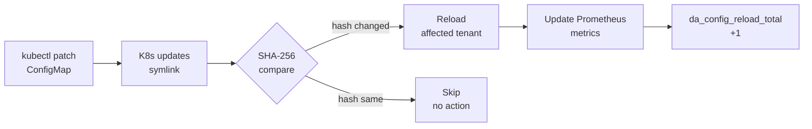
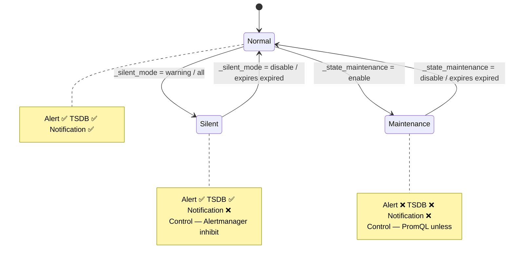
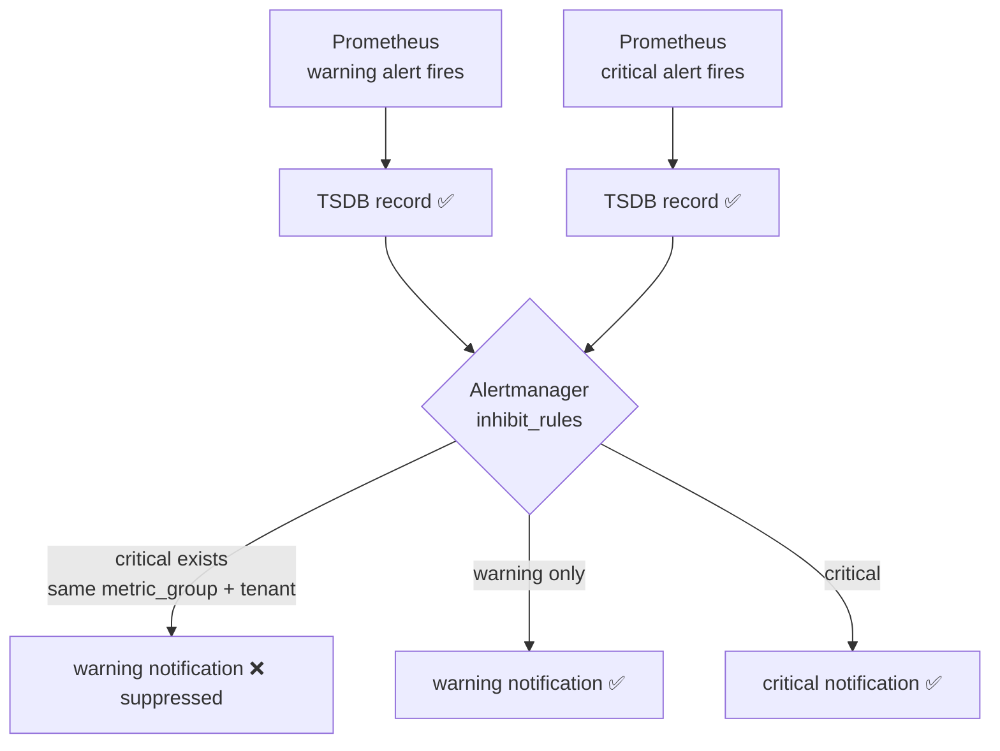

# Config-Driven Architecture Design

> **Language / 語言：** **English (Current)** | [中文](config-driven.md)
>
> ← [Back to Main Document](../architecture-and-design.en.md)

> 📖 **Unfamiliar term?** (tri-state, `group_left`, Dual-Hash, etc.) — check the [Glossary](../glossary.en.md).

## 2. Core Design: Config-Driven Architecture

### 2.1 Three-State Logic

The platform supports a "three-state" configuration pattern, providing flexible default values, overrides, and disable mechanisms:

| State | Configuration | Prometheus Output | Description |
|-------|---------------|-------------------|-------------|
| **Custom Value** | `metric_key: 42` | ✓ Output custom threshold | Tenant override of default |
| **Omitted (Default)** | Not specified in YAML | ✓ Output platform default | Uses the `defaults:` value in `_defaults.yaml` |
| **Disable** | `metric_key: "disable"` | ✗ No output | Completely disable metric |

> ⚠️ **Applicability**: the table above holds only for keys that HAVE a value under `defaults:` in `_defaults.yaml`. A **declared key** listed under `optional_overrides:` (the platform recognises the key name but asserts no value) has nothing to inherit — **omitting it means no value and therefore no series**, not "use the default"; that tier really has only two states: set a value, or stay silent.

**Prometheus output example:**

```
# Custom value (db-a tenant)
user_threshold{tenant="db-a", component="mariadb", metric="replication_lag", severity="warning"} 10

# Default value (db-b tenant, not overridden)
user_threshold{tenant="db-b", component="mariadb", metric="replication_lag", severity="warning"} 30

# Disabled (no output)
# (metric not present)
```

### 2.2 Directory Scanner Mode (conf.d/)

**Directory structure:**
```
conf.d/
├── _defaults.yaml         # Platform global defaults (managed by Platform team)
├── db-a.yaml             # Tenant A overrides (managed by db-a team)
├── db-b.yaml             # Tenant B overrides (managed by db-b team)
└── ...
```

**`_defaults.yaml` content (Platform managed):**
```yaml
defaults:
  mysql_connections: 80
  mysql_threads_running: 30
  mysql_replication_lag: 30
  container_cpu: 80
  container_memory: 85

state_filters:
  container_crashloop:
    reasons: ["CrashLoopBackOff"]
    severity: "critical"
  maintenance:
    reasons: []
    severity: "info"
    default_state: "disable"
```

**`db-a.yaml` content (Tenant override):**
```yaml
tenants:
  db-a:
    mysql_connections: "70"          # Override default 80
    container_cpu: "70"              # Override default 80
    mysql_replication_lag: "disable" # No replica, disable
    # mysql_threads_running not specified → use default value 30
    # Dimensional labels
    "redis_queue_length{queue='tasks'}": "500"
    "redis_queue_length{queue='events', priority='high'}": "1000:critical"
```

#### Boundary Enforcement Rules

| File Type | Allowed Blocks | Violation Behavior |
|-----------|----------------|-------------------|
| Defaults carrier (`_defaults.yaml` / `.yml`, any casing; only the selected one per directory is read) | `defaults`, `state_filters`, `optional_overrides`, `profiles`, `tenants` | Other carriers in the same directory are not read at all + WARN log |
| Other `_`-prefixed files (`_profiles.yaml`, `_defaults-multidb.yaml`, …) | `profiles`, `tenants` | `defaults` / `state_filters` / `optional_overrides` ignored + WARN log (#1676) |
| Tenant files (`db-a.yaml`) | Only `tenants` | Other blocks automatically ignored + WARN log |

**A platform file's `tenants:` block (#1982)**: `tenants:` in a root `_`-prefixed file is the **platform's default for an existing tenant**, not a second copy of the tenant's config:

- **The tenant wins key by key, whatever the file names**: the platform value is applied first and the tenant file's (non-`_` file's) same key overrides it; a key the tenant file does not write keeps the platform value and is never reset to a default. A tenant file named `TX.yaml` or `0tx.yaml` (sorting before `_`) gives the same result as `tx.yaml`. The only exception is a platform-only enforcement mechanism (such as `_routing_enforced`), which does not go through this layer. "Whatever the file names" is about a tenant file versus a platform file only: when several platform files give the same key for the same tenant, the later one in file-name order still wins (unchanged from before).
- **"The same key" means the same threshold, whatever its spelling** ([#2368](https://github.com/vencil/Dynamic-Alerting-Integrations/issues/2368)): a transition-window legacy spelling (such as `mysql_cpu`) and its new spelling (`mysql_threads_running`) are one key — a tenant file writing either spelling overrides every spelling in the platform files, and among platform files the later one still wins; `platform_overlay` always lists the new spelling. When one file carries both spellings, the new spelling still wins inside it. The `effective_config` of `/effective`, `/simulate` and `da-guard effective` lists one key per threshold whose value is a scalar, a list or a schedule ([#2115](https://github.com/vencil/Dynamic-Alerting-Integrations/issues/2115)): the value and the spelling of the layer that wins on `/metrics` (a deeper `_defaults.yaml` beats a shallower one, the tenant side beats the defaults chain, and inside one layer writing both spellings the new spelling wins), with `da-guard effective`'s `key_sources` naming that layer; a schedule a layer writes (`{default: …, overrides: …}`) replaces the value below it whole and is not merged with a lower schedule's windows. Any other mapping (for example `overrides` with no `default`, which `/metrics` does not take as one threshold value) is still merged key by key and keeps each layer's spelling. `merged_hash` deliberately does not follow: it is still the hash of the key-by-key merge, because the exporter decides reloads and their attribution on it and it matches `describe_tenant`; changing it would re-hash every tenant of these shapes with no change on `/metrics`. So for these shapes `effective_config` is no longer what `merged_hash` hashes. da-guard's main report (required fields, cardinality, ...) still judges the key-by-key merge, so its findings do not change. ⚠️ `describe_tenant`'s `effective_config` does not follow yet: it keeps each layer's own spelling (one threshold may show up under two keys) and still merges schedules key by key; the value actually served is the one on `/metrics` (or `da-guard served-values`). To judge an override redundant, da-guard computes the inherited value per threshold instead: each layer is first deduplicated the `/metrics` way (the new spelling wins when one layer writes both), then the layers are stacked (inside the defaults chain too, the deeper `_defaults.yaml` wins whatever the spelling, and a level writing a spelling as null does not count as writing it — the rule subdirectory defaults follow on `/metrics`, [#2414](https://github.com/vencil/Dynamic-Alerting-Integrations/issues/2414); the root `_defaults.yaml` follows it too: a root layer writing "the new spelling as null plus the legacy spelling with a value" serves the legacy value on `/metrics`, [#2418](https://github.com/vencil/Dynamic-Alerting-Integrations/issues/2418)); a threshold the tenant itself writes under both spellings is not judged at all. As far as the two spellings go, the check aims to prefer a missed hint to a deletion that would change `/metrics`. A threshold written as null (under either spelling) is no write at any layer ([#2518](https://github.com/vencil/Dynamic-Alerting-Integrations/issues/2518); `{default: null}` with no window is that null when a tenant file, a root platform file's `tenants:` block, a profile or a subdirectory `_defaults.yaml` writes it (in the root `_defaults.yaml` `defaults:` it makes the file undecodable), and a null inside a schedule with windows is refused at validation time, [#2708](https://github.com/vencil/Dynamic-Alerting-Integrations/issues/2708)): when a tenant file, a root platform file's `tenants:` block or a profile writes one, `/metrics`, `/effective` and da-guard all use the next layer down (the profile, a subdirectory `_defaults.yaml`, or the root default); when the root `_defaults.yaml` writes one, the root does not declare that threshold, so no threshold of 0 is served and no series at all — a subdirectory `_defaults.yaml` value for it is named by `subtree_default_undeliverable`, and a value from the tenant side (the tenant file, a root platform file's `tenants:` block, a profile) is named by `root_default_null_undeclared` and listed under `unserved` by `da-guard served-values`; one (tenant, key) gets only one of the two findings. Dimensional keys (such as `pg_connections{env="prod"}`) are judged against `/metrics` the same way ([#2419](https://github.com/vencil/Dynamic-Alerting-Integrations/issues/2419)): every layer's dimensional key — the root `_defaults.yaml`'s included ([#2031](https://github.com/vencil/Dynamic-Alerting-Integrations/issues/2031)) — serves the labelled series for a tenant that does not write it, so a tenant writing the same value is called redundant. `<key>_critical` keys (either spelling) are different ([#2544](https://github.com/vencil/Dynamic-Alerting-Integrations/issues/2544)): `<key>`'s critical row is served only from the tenant's side, which a subdirectory `_defaults.yaml`, a root platform file's `tenants:` block and a profile fill with their `_critical` keys; the root `_defaults.yaml` does not — it serves its key as a separate `<key>_critical` series (severity=warning), never as `<key>`'s critical row. So a `_critical` key only the root `_defaults.yaml` writes is not an inherited value for the critical row (a tenant deleting the same key falls back to the root value only on that separate series), and a tenant writing the same value is not called redundant; da-guard also reports each `_critical` key of the root `_defaults.yaml` as a `root_defaults_critical_key` warning, except keys starting with `_state_` or `_silent_`, which serve no row of their own. When the root writes a `_critical` key and a tenant also gets the same key, in either spelling, from any source (the tenant file, a subtree `_defaults.yaml`, a root platform `tenants:` entry or a profile) with a value that produces a critical row (it parses as a number, is not `disable`, and `<key>` has a default), that key owns a warning row and a critical row, and `da-guard served-values` exits 2 with no JSON.
- **A dimensional key is one threshold whatever its label order and quoting** ([#2031](https://github.com/vencil/Dynamic-Alerting-Integrations/issues/2031)): `pg_connections{env="prod", r="x"}`, `pg_connections{r="x",env="prod"}` and `pg_connections{env='prod', r='x'}` are one threshold. Every layer (the tenant file, a root platform file's `tenants:` block, a profile, every `_defaults.yaml`) rewrites its keys to the canonical spelling (labels sorted by name, values in double quotes, separated by `, `) before the merge, and the layers then stack by the "same key" rule above: across layers the higher layer wins and `/metrics` serves one series. A dimensional key of the root `_defaults.yaml` takes the same path: for a tenant that does not write it, `/metrics` serves the root's value as the labelled series (it used to be a separate series without that label, its `metric` label the whole key). A key is rewritten only when the parser reads it losslessly: `x{q=~"A,B"}`, which the parser cuts at the comma, is kept as written and never merged with `x{q=~"A"}` (if the two serve one series, da-guard refuses the tree with `metrics_not_gatherable`). When one layer writes a threshold under two spellings, the one already canonical wins, else the smallest text; the other is named `spelling_duplicate` in `not_served` when that layer is the winning one and da-guard refuses it with `value_not_served` (both #1231 names in one layer are named the same way). Every output (`/effective`, `da-guard effective`'s `effective_config` / `key_sources` / `not_served`, `da-guard served-values`, da-guard findings) spells a key as the winning layer wrote it; `merged_hash` is computed over those written spellings too; `describe_tenant` does not follow a tree that writes one threshold under different spellings yet.
- **`_metadata` merges key by key** ([#2370](https://github.com/vencil/Dynamic-Alerting-Integrations/issues/2370)): a platform file's `tenants.<id>._metadata` and the tenant file's `_metadata` merge per key under one rule — when both write a key the tenant file wins, among platform files the later one in filename order wins, and a key only one side writes is kept. A platform file writing `environment` / `domain` / `owner` and a tenant file writing only `db_type` gives all four. The merge goes one level deep: a key's value is replaced whole (`tags: [c]` over `tags: [a, b]` is `[c]`), and a layer that writes `_metadata` as a non-mapping (such as `null`) keeps nothing from the layers below. `/metrics` (`tenant_metadata_info`, `tenant_expected_exporter`, and `da-guard served-values`, which reads it) merges the two layers by this rule, and so do tenant-api's tenant list, search, and write authorization (for the current file and the submitted content), which share one merged result; before, `/metrics` dropped the whole platform block as soon as the tenant file had any `_metadata`, and the list read the tenant file alone. `/effective` and `platform_overlay` still carry no `_metadata`. A platform file the exporter drops as unparseable gives no `_metadata` in tenant-api either. When tenant-api cannot read a root platform file (stat or read failure, or a timeout), the server log gets an ERROR line, and: the list and search treat every row's metadata as unknown — the row carries only the tenant file's own values and is marked `metadata_incomplete: true`, it is visible like a degraded row (only to callers whose RBAC rule does not restrict environment or domain), no search metadata filter (environment / tier / domain / db_type / tag) matches it, and `q` matches its id only; write authorization uses the tenant file's `_metadata` alone. After a read times out (e.g. a FIFO named `_*.yaml`), nothing is read again until that blocked read returns; the next read after it returns picks the platform layer up again.
- **It cannot create a tenant**: a tenant that appears only in platform files, with no tenant file declaring it, is stripped from `/metrics` and from the routing generator, with a WARN naming the file and the tenant id. "The tenant exists" when a non-`_` file at any directory level declares it: the exporter decides from its own full decode of that file; the Python readers from the keys of `tenants:` in the file's **first YAML document**. For a tenant file the exporter rejects (a duplicate key, a tenant body that is not a mapping), the tenant does not exist on the exporter side and its platform values do not reach `/metrics` (unless another file that parses declares it too), and the exporter counts a parse failure for the file (on a cold load, a full rebuild, a hot reload of a tree with a defaults carrier and the flat tree's incremental patch path alike; the incremental patch path used to keep the tenant's last good values, and no longer does since [#1980](https://github.com/vencil/Dynamic-Alerting-Integrations/issues/1980)); the routing plane may still keep the platform's routing values for it (unchanged from before).
- **Nested platform files are not read**: the `tenants:` block of a `_defaults.yaml` (or any `_` file) in a subdirectory is read by no plane; the exporter logs one named WARN (file + tenant ids) and still drops it.
- **The walker plane applies it too** ([#2019](https://github.com/vencil/Dynamic-Alerting-Integrations/issues/2019)): `/effective` (tenant-api), da-guard, `describe_tenant` and the exporter's `merged_hash` merge defaults chain → the root platform files' per-tenant values → the tenant file, key by key with the tenant file winning; the response names the supplying platform files in `platform_overlay` (`[{file, keys}]`, merge order, only keys that take effect — a null on a reserved key that deletes an inherited value included, `_metadata` and a null on a threshold key not — omitted when there are none). Editing only a platform file's `tenants:` block recomputes that tenant's `merged_hash` and is counted in reload attribution. ⚠️ A `/simulate` request carries a defaults chain and no platform files, so this layer is not applied there.

**Profile expansion (`_profile`; [#2117](https://github.com/vencil/Dynamic-Alerting-Integrations/issues/2117))**: the profile a tenant elects with `_profile: <name>` fills in only the keys its own layer (the tenant file plus the platform `tenants:` values above) does not set, with the same result on `/metrics` and on the walker plane (`/effective`, da-guard, `describe_tenant`):

- **Precedence**: tenant file > the root platform files' `tenants:` values > profile > defaults chain (subdirectory `_defaults.yaml` included). `_profile` itself may come from a platform `tenants:` value; the tenant file's wins.
- **Which files**: only the `profiles:` of root `_`-prefixed files (`_profiles.yaml`, `_defaults.yaml` …); a profile named in several files merges key by key in file-name order, the later file winning. A subdirectory platform file's or a tenant file's `profiles:` is read by no plane. An unknown profile name expands nothing.
- **Keys not filled in**: one the tenant's layer already sets in either spelling (including the #1231 old name); one the root defaults carrier declares in `optional_overrides` (except the `_critical` shape).
- **Response**: the walker plane names the keys the profile supplied in `profile_overlay` (`[{profile, file, keys}]`, merge order, omitted when there are none); da-guard's redundant-override check compares against what deleting the key falls back to, so it includes the profile's values.
- ⚠️ `/simulate` expands only the `profiles:` of the request chain's **root (L0)** `_defaults.yaml` — `_profiles.yaml` is not part of the request, so a profile defined only there is not expanded on `/simulate`.
- **`merged_hash` and reload attribution**: the exporter's `merged_hash` includes the values the profile fills in, so a tenant on a profile has a different `merged_hash` than before. Editing only a root platform file's `profiles:` recomputes the tenants that elect a changed profile and is counted in reload attribution (the same bucket as a platform `tenants:` edit: reason `defaults`, scope `global`; `shadowed` when the tenant's layer sets every changed key).

#### SHA-256 Hot-Reload

Does not rely on file modification time (ModTime), but rather on **SHA-256 content hash**:

```bash
# On each ConfigMap update
$ sha256sum conf.d/_defaults.yaml conf.d/db-a.yaml conf.d/db-b.yaml
abc123... conf.d/_defaults.yaml
def456... conf.d/db-a.yaml
ghi789... conf.d/db-b.yaml

# Kubernetes ConfigMap symlink mounted will rotate
# Old hash → new hash
# threshold-exporter detects change, reloads configuration
```


```mermaid
flowchart LR
    A["kubectl patch<br/>ConfigMap"] --> B["K8s updates<br/>symlink"]
    B --> C{"SHA-256<br/>compare"}
    C -->|"hash changed"| D["Reload<br/>affected tenant"]
    C -->|"hash same"| E["Skip<br/>no action"]
    D --> F["Update Prometheus<br/>metrics"]
    F --> G["da_config_reload_total<br/>+1"]
```

**Why SHA-256 instead of ModTime?**
- Kubernetes ConfigMap creates a symlink layer, ModTime is unreliable
- Same content = same hash, avoid unnecessary reloads

#### Incremental Reload Internal Mechanism (v2.1.0)

Incremental reload is implemented by the package-internal `ConfigManager.incrementalLoadFrom()`, in four phases, to avoid full parsing on every reload. Its only entry is the watch loop's `diffAndReload`: it walks the tree once with `scanDirTree` (Phase 1 below), rejects a tenant declared in two files, and hands the scan over only when the tree has **no** `_defaults` carrier at all; a tree with a carrier takes the hierarchical reload (a full flat rebuild every time). The former public entry `IncrementalLoad()` skipped the duplicate-tenant check and was removed in [#1577](https://github.com/vencil/Dynamic-Alerting-Integrations/issues/1577).

```
Phase 1: Mtime Guard — Quick Filtering
  ├─ stat() each file for mtime + size
  ├─ If (mtime+size unchanged) AND (file age > 2s) → reuse cached SHA-256
  ├─ Else → read file + compute SHA-256
  └─ Combine all per-file hashes → composite hash
     └─ composite hash == previous → return immediately (zero cost)

Phase 2: Per-File Hash Diff
  ├─ New hash not in old table → ADDED
  ├─ hash value different → CHANGED
  └─ Old hash not in new table → REMOVED

Phase 3: Selective Re-Parse
  ├─ Re-parse only ADDED + CHANGED files (YAML unmarshal)
  ├─ Clear cache for REMOVED files
  └─ Boundary enforcement (tenant files cannot have state_filters, etc.)

Phase 4: Incremental Merge
  ├─ If only tenant files changed (not _defaults/_profiles)
  │   → shallow-copy previous config + patch affected tenants (fast path)
  └─ Else → full merge all partial configs
```

**A broken tenant file** ([#1980](https://github.com/vencil/Dynamic-Alerting-Integrations/issues/1980)): a CHANGED file that fails to parse (a syntax error, a tenant body of the wrong type) or cannot be read is treated as declaring no tenant — its tenants leave this version (unless another file that parses declares them too), the same result as a full load, a hierarchical reload and a restart. No "last good values" are kept; earlier versions kept them, and kept serving the tenants even after the broken file was deleted ([#2022](https://github.com/vencil/Dynamic-Alerting-Integrations/issues/2022)). Signals: for a file that fails to parse, every scan logs `WARN: skip unparseable file "<path>": <error>` and increments `da_config_parse_failure_total{file_basename}`, and `parse_failed` in `GET /api/v1/config/identity` lists the file; for a file that cannot be read, the log shows `WARN: cannot read <path>: <error>` and `da_config_unreadable_files{reason="read_error"}` is non-zero, and the file is not in `parse_failed`.

**Atomic Swap**: `RWMutex` protects atomic updates of config/hash/cache. Read side (Prometheus scrape) uses `RLock()`, reload uses `Lock()`, ensuring scrape never reads half-updated state.

**Performance characteristics** (benchmark data see [§1 Scale](../benchmarks.en.md#1-scale-how-many-tenants)):

| Scenario | Latency | Code Path |
|----------|---------|-----------|
| 1000 tenants, no change (mtime guard hit) | ~1.5ms | stat-only + hash compare |
| 1000 tenants, 1 file changed | ~6.9ms | scan 6.2ms + re-parse 0.2ms + merge 0.5ms |
| 100 tenants, no change | ~129µs | per-file stat |

**Fallback**: If cache is empty or corrupted, automatically fall back to `fullDirLoad()` (full load).

#### Hierarchical conf.d/ + Inheritance Engine (v2.7.0, ADR-016 / ADR-017)

v2.7.0 upgrades `conf.d/` from a flat layout to a four-level hierarchical directory, introducing `_defaults.yaml` inheritance semantics, dual-hash hot-reload, and 300ms debounce. The flat mode (v2.1.0) remains fully compatible; hierarchical and flat layouts can be mixed freely.

**Four-Level Hierarchy (L0 → L3)**

```
conf.d/
├── _defaults.yaml                         # L0 — platform-wide defaults (Platform Team owned)
├── db-legacy.yaml                         # flat mode (L3 single file, backward compatible)
└── mariadb/                               # L1 — domain group
    ├── _defaults.yaml                     # L1 domain defaults
    ├── prod/                              # L2 — environment cohort
    │   ├── _defaults.yaml                 # L2 environment defaults
    │   ├── db-a.yaml                      # L3 — tenant override (deep merge)
    │   └── db-b.yaml
    └── staging/
        └── db-c.yaml
```

**Inheritance Semantics (deep merge, L0 → L1 → L2 → L3, later overrides earlier)**

| Rule | Behavior | Typical Use |
|------|----------|-------------|
| Scalar / Map deep merge | Same-key deep merge; child overrides parent | Most defaults override cases |
| Array full replace (non-merge) | Child array fully replaces parent (no concat) | `state_filters.reasons` / `_routing.group_by` |
| `null` opts out of inheritance (**per-field**) | Only the four `_routing` fields `group_by` / `group_wait` / `group_interval` / `repeat_interval`: a child `key: null` makes the generated route omit that field. **Not threshold keys** — null does not opt out there and the schema rejects it (indistinguishable from a half-typed line) | Drop an inherited notification cadence; **to disable a threshold use `"disable"`** (#1339) |
| `_` prefix preserved | Meta fields `_silent_mode` / `_state_maintenance` / `_routing` / `_severity_dedup` / `_namespaces` pass through untouched | Tenant lifecycle metadata |

**Dual-Hash Hot-Reload**

v2.7.0 upgrades from a single SHA-256 to dual hashes distinguishing "source change" from "merged change":

| Hash | Input | Purpose |
|------|-------|---------|
| `source_hash` | Raw YAML contents of a single file | Detect actual user write operations |
| `merged_hash` | Post-inheritance + canonical-JSON-normalized merged config | Detect "changes with real impact on this tenant" (filters formatter noise) |

**Merge-noop detection**: If `_defaults.yaml` changes but merged_hash stays identical, the exporter skips reload. v2.8.0 (Issue #61) splits this by effect: comment/whitespace/reorder edits → `da_config_defaults_change_noop_total` (cosmetic); changed keys fully covered by a tenant override → `da_config_defaults_shadowed_total` (shadowed).

**300ms Debounce**

`_defaults.yaml`-level changes typically trigger merged_hash recomputation for every tenant. To avoid repeated full reloads from batch edits (e.g. `kubectl apply` over multiple files), the Go engine aggregates events within a 300ms debounce window:

```
t0    _defaults.yaml written → timer started 300ms
t+50  db-a.yaml written      → timer reset
t+120 db-b.yaml written      → timer reset
t+420 timer fires             → one reload handles all three changes
```

Debounce is tunable via `--scan-debounce=<duration>`; recommended 100ms-500ms under load.

**New Prometheus Metrics (v2.7.0)**

| Metric | Type | Description |
|--------|------|-------------|
| `da_config_scan_duration_seconds` | histogram | Latency distribution of one directory scan + merge (`le={0.001, 0.005, 0.01, 0.05, 0.1, 0.5, 1, 5}`; `10, 30, 60, 120` appended since [#2153](https://github.com/vencil/Dynamic-Alerting-Integrations/issues/2153)) |
| `da_config_reload_trigger_total{reason}` | counter | Reload trigger attribution, `reason ∈ {source, defaults, new_tenant, delete, forced}` |
| `da_config_scan_failures_total{reason}` | counter | **[#2452](https://github.com/vencil/Dynamic-Alerting-Integrations/issues/2452)** — scans that failed on the watch path (the per-tick change check and the debounced reload's own scan; directory mode only). `reason` is a closed set: `duplicate_tenant` (one tenant id declared in two files; in both directory modes, with or without a `_defaults.yaml`), `walk_error` (the config directory is missing or not a directory), `root_unreadable` (the config directory exists but cannot be listed; [#2592](https://github.com/vencil/Dynamic-Alerting-Integrations/issues/2592)) and `empty_tree` (no usable config file is left; #2592); all start at 0. A failed scan applies nothing, `da_config_reload_trigger_total` does not move, `da_config_last_scan_complete_unixtime_seconds` is not updated and `/ready` stays 200 — the exporter keeps serving the last good config; while the failure lasts it rises by one per tick (in both modes the change check rejects it and schedules no reload, whatever `--scan-debounce` is), plus one for each debounced reload that was already scheduled, and had not yet run, when the failure appeared. Alert `ConfigScanFailing`: the config has been unscannable for more than 5 minutes (scans are failing and that gauge is more than 5 minutes old); measured to fire within 10 minutes of the failure appearing for every `--reload-interval` from 30s to 420s; it resolves on the first successful tick after the fix |
| `da_config_unreadable_files{reason}` | gauge | **[#2592](https://github.com/vencil/Dynamic-Alerting-Integrations/issues/2592)** — config files / subdirectories the most recent scan dropped because it could not read them. `reason` is the walker's closed set: `stat_error`, `read_error`, `walk_error` (a directory below the root cannot be listed); all start at 0 and are re-set by every scan that completes; a scan that itself fails (the config directory is missing or not a directory) keeps the previous values, and `ConfigScanFailing` fires for that state. A dropped file is not a scan failure: every other tenant keeps reloading, only the tenants in those files are no longer on `/metrics`. Alert `ConfigFilesUnreadable` (critical): `> 0` for 10 minutes. Critical rather than warning: an unreadable tenant file drops that tenant from `/metrics` entirely, so every threshold alert of it stops; an unlistable subdirectory (`walk_error`) drops every tenant under it at once |
| `da_config_defaults_unusable{reason}` | gauge | **[#2592](https://github.com/vencil/Dynamic-Alerting-Integrations/issues/2592)** — `_defaults.yaml` files (any level) the current config cannot use, `reason ∈ {parse_failure, unreadable}`. Per ADR-017 the whole defaults block is dropped; for the root file every tenant loses the thresholds it inherits. A `_defaults.yaml` inside a subdirectory that cannot be listed (`walk_error`) is not counted here (the scan never sees it); the tenants lost with that directory are covered by `da_config_unreadable_files{reason="walk_error"}` and `ConfigFilesUnreadable` (critical). State-coded: `parse_failure` is re-set on every config commit and `unreadable` by every scan that completes (an unreadable file is not a change-detection input, so adding or removing one triggers no commit), so it holds for as long as the file is unusable and returns to 0 once fixed — `da_config_parse_failure_total` moves only when a reload reads the broken file, so `ConfigDefaultsParseFailure` resolves on its own after about 5 minutes. Alert `ConfigDefaultsUnusable`: `> 0` for 10 minutes |
| `da_config_defaults_change_noop_total` | counter | Count of `_defaults.yaml` changes where merged_hash is unchanged. **v2.8.0 (Issue #61) narrows the semantics to cosmetic-only** (comment / reorder / whitespace) |
| `da_config_defaults_shadowed_total` | counter | **v2.8.0 (Issue #61)** — defaults change blocked by a tenant override (split out from `noop_total`) |
| `da_config_blast_radius_tenants_affected` | histogram | **v2.8.0 (Issue #61)** — per-tick affected-tenants distribution, labels = `reason / scope / effect`, buckets `[1, 5, 25, 100, 500, 1000, 2500, 5000, 10000]` |

**Tenant API `/effective` Endpoint (v2.7.0 delivery)**

```
GET /api/v1/tenants/{id}/effective
→ 200 OK
{
  "tenant_id": "db-a",
  "merged": { /* full L0 + L1 + L2 + L3 merged config */ },
  "source_chain": [
    "conf.d/_defaults.yaml",
    "conf.d/mariadb/_defaults.yaml",
    "conf.d/mariadb/prod/_defaults.yaml",
    "conf.d/mariadb/prod/db-a.yaml"
  ],
  "source_hash": "abc123...",
  "merged_hash": "def456..."
}
```

- `404 ErrTenantNotFound` — tenant does not exist
- `400` — tenant_id validation failure (length, charset)
- A `.inf` / `-.inf` / `.nan` in the tenant YAML is sent in `effective_config` as the string `"Infinity"` / `"-Infinity"` / `"NaN"` (JSON has no such numbers; the spelling is Python `json.dumps`'s), and `/simulate` does the same; `merged_hash` is still computed from the original number and matches `describe_tenant`. ⚠️ So the string `"Infinity"` cannot tell the original float apart from a tenant that wrote that string
- Each request walks conf.d once with the exporter's own walker (`ScanDirTree`, #1677), on the last completed walk as its prior (a file whose mtime has not moved and is past the exporter's mtime guard is not read again; the walk has a timeout and a stuck-walk breaker, so a stuck walk fails reads only, never writes), and hands it to `pkg/config.ResolveEffectiveFromScan`: it reads only the tenant's file, the `_` files at the root and the defaults carriers of each directory from the root down to the tenant's, and answers byte for byte what a cold walk of the whole tree answers (#1977). The merge core is the exporter's too, so a symlinked `--config-dir`, hidden directories and null-body tenants are judged exactly as the exporter judges them. The defaults chain is the same rule too (#1674): `_defaults.yaml` / `.yml` in any casing is a carrier, but **each directory reads exactly one** — a `.yaml` spelling beats a `.yml` one; among case variants of one extension, `.yaml` takes the last in walk order and `.yml` the first — and a directory with more than one carrier is WARNed about by both the exporter and `describe_tenant`, the others being read by no plane (the root `Defaults` on `/metrics` also come from the root's one carrier only). Whether a tenant exists is the same verdict too (#1957): the walker and `/metrics` use one full parse, so a file whose tenant body has the wrong shape (e.g. a scalar) declares no tenant — the tenant is absent from `/metrics` and returns 404 from `/effective`

**Debug / Migration CLI (da-tools)**
**Debug CLI (da-tools)**

```bash
# View a tenant's merged config + merged_hash after inheritance (drift audit / rollback verification)
da-tools tenant-verify db-a --conf-d conf.d/

# Snapshot all tenants' pre-base state for post-rollback diff
da-tools tenant-verify --all --json
```

**ADR References**

- [ADR-016: `conf.d/` hierarchical directory + mixed-mode migration](../adr/016-conf-d-directory-hierarchy-mixed-mode.en.md)
- [ADR-017: `_defaults.yaml` inheritance + dual-hash hot-reload](../adr/017-defaults-yaml-inheritance-dual-hash.en.md)

### 2.3 Tenant-Namespace Mapping

The platform's `tenant` is a **logical identity** determined by two independent sources:

1. **Threshold side**: threshold-exporter derives tenant from the YAML config key (`tenants.db-a`), zero coupling with K8s namespace
2. **Data side**: Prometheus `relabel_configs` injects a `tenant` label into scraped metrics

Both sides must produce an exact match, but **their sources can differ**. This enables three mapping modes:

| Mode | Description | Prometheus relabel Strategy | Use Case |
|------|------------|---------------------------|----------|
| **1:1** (standard) | One Namespace = One Tenant | `source_labels: [__meta_kubernetes_namespace]` → `target_label: tenant` | Most deployments |
| **N:1** | Multiple Namespaces → One Tenant | Multiple namespace metrics relabeled to the same tenant value | Read/write split (`db-a-read` + `db-a-write` → `db-a`) |
| **1:N** | One Namespace → Multiple Tenants | Use Service label/annotation instead of namespace as tenant source | Shared-namespace multi-tenant architecture |

**N:1 relabel example** (multiple namespaces → one tenant):

```yaml
relabel_configs:
  - source_labels: [__meta_kubernetes_namespace]
    action: keep
    regex: "db-a-(read|write)"
  # Unify to db-a
  - source_labels: [__meta_kubernetes_namespace]
    target_label: tenant
    regex: "(db-[^-]+).*"    # Extract first segment as tenant
    replacement: "$1"
```

**1:N relabel example** (one namespace → multiple tenants):

```yaml
relabel_configs:
  - source_labels: [__meta_kubernetes_namespace]
    action: keep
    regex: "shared-db"
  # Read tenant identity from Service annotation
  - source_labels: [__meta_kubernetes_service_annotation_alerting_tenant]
    target_label: tenant
```

**Automation**: `scaffold_tenant.py --namespaces ns1,ns2` auto-generates N:1 relabel_configs snippet and writes a `_namespaces` metadata field in the tenant YAML for tool reference (does not affect metric logic).

**Design principle**: The platform core (threshold-exporter + Rule Packs) is completely namespace-agnostic. Mapping flexibility is entirely provided by Prometheus scrape config — no platform component changes needed. See [BYO Prometheus Integration Guide](../integration/byo-prometheus-integration.en.md).

### 2.4 Multi-tier Severity

Support both `_critical` suffix and `"value:severity"` syntax:

**Method 1: `_critical` suffix (suitable for basic thresholds)**
```yaml
tenants:
  db-a:
    mysql_connections: "100"            # warning threshold
    mysql_connections_critical: "150"   # _critical → auto-generate critical alert
```

**Method 2: `"value:severity"` syntax (suitable for dimensional labels)**
```yaml
tenants:
  redis-prod:
    "redis_queue_length{queue='orders'}": "500:critical"
```

**Prometheus output:**
```
user_threshold{tenant="db-a", component="mysql", metric="connections", severity="warning"} 100
user_threshold{tenant="db-a", component="mysql", metric="connections", severity="critical"} 150
```

#### Auto-Suppression (Severity Dedup via Alertmanager Inhibit)

Severity dedup is handled at the **Alertmanager inhibit layer**, not in PromQL. This design preserves TSDB completeness while avoiding notification duplication.

**Key principle:** Prometheus always records both warning and critical metrics. Alertmanager's `inhibit_rules` suppress only the **notification**, not the alert itself.

**Prometheus alert rules:**

```yaml
- alert: MariaDBHighConnections          # warning
  expr: |
    ( tenant:mysql_threads_connected:max > on(tenant) group_left tenant:alert_threshold:mysql_connections )
    unless on(tenant) (user_state_filter{filter="maintenance"} == 1)
  for: 5m
  labels:
    severity: warning
    metric_group: "connections"

- alert: MariaDBHighConnectionsCritical  # critical
  expr: |
    ( tenant:mysql_threads_connected:max > on(tenant) group_left tenant:alert_threshold:mysql_connections_critical )
    unless on(tenant) (user_state_filter{filter="maintenance"} == 1)
  for: 5m
  labels:
    severity: critical
    metric_group: "connections"
```

**Alertmanager inhibit rule (per-tenant, auto-generated):**

```yaml
inhibit_rules:
  - source_matchers:
      - severity="critical"
      - metric_group=~".+"
      - tenant="db-a"
    target_matchers:
      - severity="warning"
      - metric_group=~".+"
      - tenant="db-a"
    equal: ["metric_group"]
```

**Result:**
- Connection count ≥ 150 (critical): Both warning and critical alerts fire in Prometheus (TSDB records both). Alertmanager's inhibit rule blocks only the **warning notification**, critical notification sends normally.
- Connection count 100–150 (warning only): Warning alert fires, critical does not. Warning notification sends.
- **TSDB completeness:** All alert firings remain in Prometheus TSDB regardless of notification suppression.

### 2.5 Regex Dimension Thresholds

Since v0.12.0, the config parser supports the `=~` operator, enabling regex-based fine-grained matching on dimension labels. This design allows thresholds to target specific dimension subsets without introducing external data dependencies.

**Configuration syntax:**
```yaml
tenants:
  db-a:
    # Exact match
    "oracle_tablespace_used_percent{tablespace='USERS'}": "85"
    # Regex match: all tablespaces starting with SYS
    "oracle_tablespace_used_percent{tablespace=~'SYS.*'}": "95"
```

**Implementation path:**

1. **Exporter layer**: Config parser detects the `=~` operator and outputs the regex pattern as a `_re` suffixed label
   ```
   user_threshold{tenant="db-a", component="oracle", metric="tablespace_used_percent",
                  tablespace_re="SYS.*", severity="warning"} 95
   ```
2. **Recording rule layer**: PromQL uses `label_replace` + `=~` for actual matching at query time
3. **Design principle**: The exporter remains a pure config→metric converter; matching logic is entirely handled by Prometheus native vector operations

### 2.6 Scheduled Thresholds

Since v0.12.0, thresholds support time-window scheduling, allowing automatic threshold switching across different time periods. Typical use cases: relaxed thresholds during nighttime maintenance windows, tightened thresholds during peak hours.

**Configuration syntax:**
```yaml
tenants:
  db-a:
    mysql_connections:
      default: "100"
      overrides:
        - window: "22:00-06:00"    # UTC nighttime window (cross-midnight supported)
          value: "200"             # Nighttime batch jobs, relax to 200
        - window: "09:00-18:00"
          value: "80"              # Daytime peak, tighten to 80
```

**Technical implementation:**

- **`ScheduledValue` custom YAML type**: Supports dual-format parsing — scalar strings (backward compatible) and structured `{default, overrides[{window, value}]}`
- **`ResolveAt(now time.Time)`**: Resolves the applicable threshold based on current UTC time, ensuring determinism and testability
- **Time window format**: `HH:MM-HH:MM` (UTC), cross-midnight support (e.g., `22:00-06:00` means 10 PM to 6 AM next day); a window that starts where it ends (e.g. `05:00-05:00`) covers no minute and is invalid, like a malformed or missing `window:`: the exporter WARNs and the window never applies, the load names it with `da_config_values_not_served{reason="window_invalid"}` and one WARN line, and da-guard refuses it with a `value_not_served` error ([#2065](https://github.com/vencil/Dynamic-Alerting-Integrations/issues/2065))
- **Test cases**: Covering boundary conditions — window overlap, cross-midnight, scalar fallback, empty overrides

### 2.7 Three-State Operational Modes

v1.2.0 introduced **Silent Mode**, which together with the existing Maintenance Mode forms a three-state operational model, solving the problem of "users mistaking Maintenance Mode for muting."

**Behavior Matrix**

| Operational State | Semantics | Alert Triggered | TSDB Record | Notification | Control Layer |
|-------------------|-----------|-----------------|-------------|--------------|---|
| Normal | Normal operation | ✅ | ✅ | ✅ | — |
| Silent | Muted | ✅ | ✅ | ❌ | Alertmanager |
| Maintenance | True maintenance | ❌ | ❌ | ❌ | Prometheus (PromQL) |


```mermaid
stateDiagram-v2
    [*] --> Normal
    Normal --> Silent : _silent_mode = warning / all
    Normal --> Maintenance : _state_maintenance = enable
    Silent --> Normal : _silent_mode = disable / expires expired
    Maintenance --> Normal : _state_maintenance = disable / expires expired

    note right of Normal
        Alert ✅ TSDB ✅ Notification ✅
    end note
    note right of Silent
        Alert ✅ TSDB ✅ Notification ❌
        Control — Alertmanager inhibit
    end note
    note right of Maintenance
        Alert ❌ TSDB ❌ Notification ❌
        Control — PromQL unless
    end note
```

**Design principle:** Prometheus controls "what should trigger an alert," Alertmanager controls "whether to send notification."

- **Maintenance Mode** (existing): Eliminates alerts at the PromQL layer via `unless on(tenant) (user_state_filter{filter="maintenance"} == 1)`. Alert does not fire, TSDB has no record, no notification.
- **Silent Mode** : Alert fires normally in Prometheus (TSDB records `ALERTS`), but Alertmanager intercepts notifications via `inhibit_rules`.

**Silent Mode Data Flow**

```
tenant YAML: _silent_mode: "warning"
    ↓
threshold-exporter: user_silent_mode{tenant="db-a", target_severity="warning"} 1
    ↓
Prometheus alert rule (rule-pack-operational.yaml):
    TenantSilentWarning{tenant="db-a"} fires
    ↓
Alertmanager inhibit_rules:
    source: alertname="TenantSilentWarning"
    target: severity="warning", equal: ["tenant"]
    ↓
Result: db-a warning alerts fire normally (TSDB record exists), but notifications are intercepted
```

**Tenant Configuration**

```yaml
tenants:
  db-a:
    _silent_mode: "warning"    # Mute warning notifications only
  db-b:
    _silent_mode: "all"        # Mute both warning and critical notifications
  db-c:
    _state_maintenance: "enable"  # True maintenance, alert completely suppressed
  db-d: {}                        # Normal — default behavior
```

Available `_silent_mode` values: `warning`, `critical`, `all`, `disable`. Unset defaults to Normal mode.

**Auto-Expiry :** `_silent_mode` and `_state_maintenance` support structured objects (backward compatible with scalar strings) with an `expires` RFC3339 timestamp (e.g. `"2099-04-01T00:00:00Z"`; if the exporter cannot parse it, it logs a WARN and **ignores the whole setting** — nothing is silenced, maintenance does not take effect, alerts keep notifying; [#2000](https://github.com/vencil/Dynamic-Alerting-Integrations/issues/2000)). The Go engine checks `time.Now().After(expires)` to stop emitting sentinel metrics, automatically restoring alerts to normal. Expiry generates a transient gauge `da_config_event{event="silence_expired"}` with `TenantConfigEvent` alert rule for notification.

```yaml
tenants:
  db-a:
    _silent_mode:
      target: "all"
      expires: "2099-12-31T23:59:59Z"
    _state_maintenance:
      target: "enable"   # state filters take enable/disable;
                         # "all" belongs to _silent_mode
      expires: "2099-12-31T23:59:59Z"
      reason: "Scheduled maintenance window"
```

**Alertmanager inhibit_rules Template**

```yaml
inhibit_rules:
  # Severity Dedup: per-tenant inhibit rules (generated by generate_alertmanager_routes.py)
  # Only tenants with _severity_dedup: "enable" (default) generate rules
  # Tenants with _severity_dedup: "disable" have no corresponding rules → receive both notifications
  - source_matchers:
      - severity="critical"
      - metric_group=~".+"
      - tenant="db-a"
    target_matchers:
      - severity="warning"
      - metric_group=~".+"
      - tenant="db-a"
    equal: ["metric_group"]

  # Silent Mode: suppress warning notifications
  - source_matchers:
      - alertname="TenantSilentWarning"
    target_matchers:
      - severity="warning"
    equal: ["tenant"]

  # Silent Mode: suppress critical notifications
  - source_matchers:
      - alertname="TenantSilentCritical"
    target_matchers:
      - severity="critical"
    equal: ["tenant"]

  # Infra-outage → SLO burn notification-storm suppression (opt-in pattern, NOT
  # shipped by default; ADR-031 guardrail 3). During a global infra incident the
  # per-tenant SLO burn alerts are symptoms — use the infra alert as the source
  # to suppress their notification fan-out. Measurement is unaffected: inhibit
  # only blocks notifications; recording rules and ALERTS evaluation continue,
  # so error-budget burn stays fully recorded in the TSDB.
  - source_matchers:
      - alertname="MassExporterOutage"   # substitute your environment's infra-outage alert/sentinel
    target_matchers:
      - slo_burn="true"                  # discriminator label emitted by the slo_burn_rate recipe
    # deliberately NO equal: a global infra incident suppresses burn notifications for ALL tenants
```

> **Why the infra-outage suppression is not shipped by default**: whether SLO pages should go quiet during an infra incident is an **organizational decision** — some teams want them firing regardless (an SLO is the user's perspective; users keep suffering until the infra is fixed), others treat them as duplicate noise. The platform's stance is to document the pattern and structurally provide the `slo_burn="true"` discriminator label ([ADR-031](../adr/031-slo-burn-rate-recipe.md) guardrail 3), leaving the mounting to the operator per organizational policy. The source alert need not be a sentinel — any alert with "global infra incident" semantics (such as `MassExporterOutage`) works as the source.
>
> ⚠️ **Interaction with the inhibit-semantics gate**: the two gated AM configs in this repo (try-local and the k8s configmap) are enforced by `tests/alertmanager-inhibit` to have **every inhibit rule tenant-scoped** (`tenant` in `equal:`, or both sides pinning the same tenant literal). This pattern is deliberately global, and its source is a platform-level alert **without a `tenant` label** — `equal: ["tenant"]` would never hold (Alertmanager's equal semantics: source lacks the label while the target has it), and same-tenant pins on both sides are impossible — so it is **structurally inexpressible in tenant-scoped form**. Use it as-is in your own Alertmanager deployment; mounting it into this repo's gated configs first requires an explicit (audited) exemption in that gate — which is precisely the "not shipped by default, mount only after an organizational decision" stance, mechanically enforced.

### 2.8 Severity Dedup

v1.2.0 introduced **Severity Dedup** to resolve the issue of "TSDB records for warning being eliminated when critical fires."

**Design change:** Auto-suppression moved from the PromQL layer (`unless critical`) to the Alertmanager layer (`inhibit_rules`). TSDB always records both warning and critical simultaneously; dedup only controls notification behavior.


```mermaid
flowchart TD
    A["Prometheus<br/>warning alert fires"] --> B["TSDB record ✅"]
    C["Prometheus<br/>critical alert fires"] --> D["TSDB record ✅"]
    B --> E{"Alertmanager<br/>inhibit_rules"}
    D --> E
    E -->|"critical exists<br/>same metric_group + tenant"| F["warning notification ❌ suppressed"]
    E -->|"warning only"| G["warning notification ✅"]
    E -->|"critical"| H["critical notification ✅"]
```

**Per-Tenant Control Mechanism**

v1.2.0 implements per-tenant inhibit rules for optional configuration:

1. `generate_alertmanager_routes.py` scans all tenant YAML files for `_severity_dedup` setting
2. For each tenant with dedup enabled, generates a dedicated inhibit rule (with `tenant="<name>"` matcher)
3. Tenants with `_severity_dedup: "disable"` generate no rule → receive both notifications
4. Exporter still outputs `user_severity_dedup{tenant, mode}` metric → Prometheus sentinel `TenantSeverityDedupEnabled` for Grafana panels to display each tenant's dedup status

**Behavior Matrix**

| Setting | TSDB warning | TSDB critical | Warning Notification | Critical Notification |
|---------|------------|--------------|---------------------|---------------------|
| `_severity_dedup: "enable"` (default) | ✅ | ✅ | ❌ Intercepted by AM | ✅ |
| `_severity_dedup: "disable"` | ✅ | ✅ | ✅ | ✅ |

**Pairing Mechanism:** The `metric_group` label in alert rules allows Alertmanager to correctly pair warning/critical (since they have different alertnames). For example, `MariaDBHighConnections` and `MariaDBHighConnectionsCritical` share `metric_group: "connections"`. Each per-tenant inhibit rule limits `metric_group=~".+"`, so alerts without a `metric_group` label do not participate in dedup. (The liveness-tier alerts `MariaDBDown`/`MariaDBClusterDown`/`MariaDBNoPrimary` carry `metric_group: liveness` as of [#875](https://github.com/vencil/Dynamic-Alerting-Integrations/issues/875), so the critical cluster-survival alert auto-inhibits the same tenant's warning instance alert.)

**Tenant Configuration**

```yaml
tenants:
  db-a: {}                                # Default enable — warning suppressed
  db-b:
    _severity_dedup: "disable"           # Receive both notifications
```

**Generated Alertmanager Configuration**

```bash
python3 scripts/tools/ops/generate_alertmanager_routes.py --config-dir conf.d/ --dry-run
# Output includes per-tenant inhibit_rules section, merged into Alertmanager config
```

### 2.9 Alert Routing (Config-Driven Routing)

Tenants can manage notification destinations, grouping strategies, and timing controls via the `_routing` section. The platform tool `generate_alertmanager_routes.py` reads all tenant YAML files and generates Alertmanager route + receiver + inhibit_rules YAML fragment.

> supports six receiver types: webhook / email / slack / teams / rocketchat / pagerduty. Receivers are structured objects (`{type, ...fields}`), validated by `generate_alertmanager_routes.py` for required fields and corresponding Alertmanager config generation.

**Schema**

```yaml
tenants:
  db-a:
    _routing:
      receiver:                                         # required — structured object
        type: "webhook"                                 #   type: webhook/email/slack/teams/rocketchat/pagerduty
        url: "https://webhook.db-a.svc/alerts"
      group_by: ["alertname", "severity"]               # optional
      group_wait: "30s"                                  # optional, guardrail 5s–5m
      group_interval: "1m"                               # optional, guardrail 5s–5m
      repeat_interval: "4h"                              # optional, guardrail 1m–72h
      overrides: []                                      # optional, per-rule routing (§2.10)
```

**Timing Guardrails**

The platform enforces strict bounds on timing parameters; values outside limits are clamped and logged as WARN:

| Parameter | Minimum | Maximum | Default |
|-----------|---------|---------|---------|
| `group_wait` | 5s | 5m | 30s |
| `group_interval` | 5s | 5m | 5m |
| `repeat_interval` | 1m | 72h | 4h |

Durations are written the way Alertmanager reads them (`definitions.duration` of `tenant-config.schema.json`): whole numbers with units, largest unit first, each unit at most once (`y`, `w`, `d`, `h`, `m`, `s`, `ms`), or a bare `0` — `1h30m`, `90m` and `1d` all work. A spelling Alertmanager refuses (`1.5h`, `30m1h`, `1ns`) is replaced by the platform default with a WARN, and `generate-routes --validate` and `validate-config` exit 1; the exporter ignores the value ([#2490](https://github.com/vencil/Dynamic-Alerting-Integrations/issues/2490)).

**Interaction with Silent Mode**

Silent Mode naturally bypasses routing: Alertmanager's `inhibit_rules` intercept notifications before route evaluation. Therefore, even if a tenant configures custom routing, silent alerts will not send notifications.

**Tool Chain**

```bash
# Preview mode
python3 scripts/tools/ops/generate_alertmanager_routes.py \
  --config-dir conf.d/ --dry-run

# CI validation (--validate writes nothing; with -o it is refused, exit 2)
python3 scripts/tools/ops/generate_alertmanager_routes.py \
  --config-dir conf.d/ --validate \
  --policy .github/custom-rule-policy.yaml

# Generate fragment
python3 scripts/tools/ops/generate_alertmanager_routes.py \
  --config-dir conf.d/ -o alertmanager-routes.yaml \
  --policy .github/custom-rule-policy.yaml

# All-in-one merge into Alertmanager ConfigMap + reload
python3 scripts/tools/ops/generate_alertmanager_routes.py \
  --config-dir conf.d/ --apply --yes
```

`--validate` checks YAML validity + webhook domain allowlist (exit 0/1 for CI consumption); with `--strict`, domain-policy (ADR-007) violations escalate from WARN to ERROR and fail the run (CI runs `--validate --strict`). `--apply` directly merges fragment into Alertmanager ConfigMap and triggers reload. Output supports six receiver types: webhook, email, slack, teams, rocketchat, pagerduty.

### 2.10 Per-rule Routing Overrides 

Per-rule Routing Overrides allow tenants to route specific alerts or metric groups to different receivers (e.g., DBA-critical alerts to PagerDuty, everything else to Slack).

**YAML example:**

```yaml
tenants:
  db-a:
    _routing:
      receiver:
        type: slack
        api_url: "https://hooks.slack.com/services/..."
      overrides:
        - alertname: "MariaDBReplicationLag"
          receiver:
            type: pagerduty
            service_key: "abc123"
        - metric_group: "redis"
          receiver:
            type: webhook
            url: "https://oncall.example.com/redis"
```

**Design rules:**

- Each override must specify exactly one of `alertname` or `metric_group` (not both)
- Override receivers use the same `build_receiver_config()` validation and domain allowlist checks
- `expand_routing_overrides()` generates sub-routes nested under the tenant's main route as its `routes` (in `overrides` order, first match wins); only alerts that match no override use the main route's receiver. The `tenant="<id>"` matcher lives on the main route only; each sub-route carries just its own `alertname` / `metric_group` matcher
- Timing parameters (`group_wait`, `group_interval`, `repeat_interval`) and `group_by` can be overridden per-rule, subject to the same platform guardrails; **values an override leaves out are inherited from the tenant's main route** (an Alertmanager child route inherits from its parent). Before [#2252](https://github.com/vencil/Dynamic-Alerting-Integrations/issues/2252) overrides were siblings of the main route and inherited unset values from the root (e.g. 12h) instead

### 2.11 Platform Enforced Routing 

Platform Team can configure `_routing_enforced` in `_defaults.yaml` to insert platform routing before all tenant routes (with `continue: true`), enabling dual-channel notifications where "NOC always receives + tenant also receives":

```yaml
# _defaults.yaml — Mode A: unified NOC receiver
_routing_enforced:
  enabled: true
  receiver:
    type: "webhook"
    url: "https://noc.example.com/alerts"
  match:
    - 'severity="critical"'  # Only critical alerts sent to NOC (a list of Alertmanager matcher strings)
```

⚠️ `enabled` must be a YAML boolean (`true` / `false`). A string such as `n`, `y` or `'yes'` (PyYAML reads an unquoted `n` / `y` as a string) does **not** enable NOC routing and is treated as a configuration error: `generate-routes --validate` and `validate-config` exit 1, and render mode prints a WARN and renders without the NOC route ([#2164](https://github.com/vencil/Dynamic-Alerting-Integrations/issues/2164)). The shape of the rest of `_routing_enforced` is checked by `platform-defaults.schema.json`, which reuses the tenant schema's definition.

**Per-tenant Enforced Channel :** If the receiver field includes `{{tenant}}`, the system automatically creates independent enforced routes for each tenant, allowing Platform to establish per-tenant notification channels that tenants cannot refuse or override:

```yaml
# _defaults.yaml — Mode B: per-tenant independent channels
_routing_enforced:
  enabled: true
  receiver:
    type: "slack"
    api_url: "https://hooks.slack.com/services/T/B/x"
    channel: "#alerts-{{tenant}}"    # → #alerts-db-a, #alerts-db-b, ...
```

`generate_alertmanager_routes.py` inserts platform route before tenant routes. Mode A generates a single shared route; Mode B generates N per-tenant routes (each with `tenant="<name>"` matcher + `continue: true`). Disabled by default; Platform Team enables as needed. See [BYO Alertmanager Integration Guide §8](../integration/byo-alertmanager-integration.en.md#8-platform-enforced-routing).

### 2.12 Routing Profiles & Domain Policies (ADR-007)

When multiple tenants share the same on-call team and notification policy, the `_routing` block duplicates extensively. ADR-007 introduces a two-layer mechanism to solve this:

**Routing Profiles**: Define named routing configurations in `_routing_profiles.yaml`; tenants reference via `_routing_profile`:

```yaml
# _routing_profiles.yaml
routing_profiles:
  team-sre-apac:
    receiver: slack-sre-apac
    group_by: [tenant, alertname, severity]
    group_wait: 30s
    repeat_interval: 4h

# db-a.yaml — Tenant only needs to reference profile
tenants:
  db-a:
    _routing_profile: team-sre-apac
```

**Domain Policies**: Define business domain compliance constraints in `_domain_policy.yaml` (e.g., financial domain forbids Slack notifications); validated after route generation, not injected into config values. Receiver-type constraints are enforced with one semantics in three places: the generator's `--validate --strict`, da-guard (CI / pre-commit) and tenant-api writes (403); all three judge the merged routing (including `routes` a profile brings), with `forbidden_receiver_types` and `allowed_receiver_types` judged separately ([#2280](https://github.com/vencil/Dynamic-Alerting-Integrations/issues/2280)). `require_critical_escalation` runs in the same three places with the same criterion; a destination that still catches some critical alerts before PagerDuty is only a warning ([#2325](https://github.com/vencil/Dynamic-Alerting-Integrations/issues/2325)).

**When the policy file cannot be used ([#2486](https://github.com/vencil/Dynamic-Alerting-Integrations/issues/2486) Q7-2, [#2730](https://github.com/vencil/Dynamic-Alerting-Integrations/issues/2730))**: the three readers take the generator's reading of one `_domain_policy.yaml` as the reference — da-guard aims to read exactly what the generator reads, tenant-api the same or it refuses the whole file; the exceptions are the directives below (da-guard stricter than the generator) and the known gaps listed at the end of this paragraph (more lenient). A file the generator drops whole (a second YAML document, a top-level `tenants:` that is not a mapping, a `!!merge`-tagged node where a value goes) is `domain_policy_unusable` in da-guard and refused by tenant-api; `tenants` items are read as their source text; the non-specific tag `!` is read as PyYAML reads it (`! "true"` is a boolean, `! "<<"` a merge key). A value PyYAML has no constructor for or cannot construct (`=`, `! "*"`, `!custom x`, `!!int x`, a root `!!merge`) where it is built, a receiver-type entry included, and a `require_critical_escalation` PyYAML refuses (`!!bool maybe`, `!!null {}`) make the generator drop the whole file, and da-guard and tenant-api treat it as unusable too; an escalation value that reads but is not a boolean (`"true"`, `1`) only leaves that constraint off, in all three. A non-string `allowed_receiver_types` entry (`!!null webhook`) allows no type. A receiver-type entry that is a collection (a mapping, a list, a `!!set`) is skipped by the generator and da-guard while the other entries still apply (an `allowed` list still restricts); `--strict` and da-guard name the entry, and tenant-api refuses the whole file ([#2758](https://github.com/vencil/Dynamic-Alerting-Integrations/issues/2758)). A null domain key (`~:`) names no domain. A known exception is directives: a policy file with `%YAML 1.2` (a 1.x other than 1.1) or an unknown directive is read by the generator, but is `domain_policy_unusable` in da-guard (stricter than the generator — a known gap tracked in [#2759](https://github.com/vencil/Dynamic-Alerting-Integrations/issues/2759)) and refused whole by tenant-api; so is a built `!!omap` / `!!pairs` whose item holds a `tenants` sequence or is itself `!!merge`-tagged, which the generator reads, and so is an anchored mapping the generator first built as a mapping (rewriting its `<<` and `=` in place) and then met as an omap/pairs item through an alias (stricter than the generator, also #2759). Whitespace is read by the generator's rules: a TAB may appear only inside quotes, comments and block scalars, so a file the generator drops for `key:<TAB>value`, a TAB at a line's end, `---<TAB>`, `%YAML<TAB>1.1` or `%YAML 1.1#c` is `domain_policy_unusable` in da-guard and refused by tenant-api (the vendored yaml.v3's `SpacesOnly` switch, turned on only to read a policy file; the exporter's own config files still accept a TAB as a separator). A file that is not UTF-8 (UTF-16 with a byte order mark included) is unusable: the generator opens it as UTF-8. Known gaps where da-guard and tenant-api are still more lenient than the generator and may read a policy it does not ([#2759](https://github.com/vencil/Dynamic-Alerting-Integrations/issues/2759)): very deeply nested files, a plain scalar ending in a colon inside a flow collection, `!!set`, and `!!omap` / `!!pairs` as a key. A file tenant-api refuses or cannot read (a directory, a dangling symlink, no permission) keeps serving its own last good content; with none, direct-mode writes the policy judges (`PUT /tenants/{id}`, tenant / group batch ops that touch routing) answer 503 `POLICY_UNAVAILABLE` instead of going through as if there were no policy. `/ready` stays 200; `tenant_api_policy_available` and the `TenantApiPolicyUnavailable` alert report the state, and `--policy-unavailable-open` is the escape hatch. A missing file is still a legal "no policy".

**CI division of labour ([#2315](https://github.com/vencil/Dynamic-Alerting-Integrations/issues/2315))**: routing in **tenant files** (not `_`-prefixed) is gated by the generator, `generate_alertmanager_routes.py --validate --strict --policy` — the required check in `validate.yaml` runs it once over `components/threshold-exporter/config/conf.d/` and once over `try-local/seed/conf.d/`. da-guard (`guard-defaults-impact.yml`) **triggers only when a `_`-prefixed platform file changes**; a PR touching only tenant files never runs it, so do not treat it as the tenant-routing gate. A tenant id written in two tenant files (at any depth) is refused by the generator with rc 1 in every mode, naming every file — the same whole-tree rejection as the exporter and da-guard; a `_` platform file's `tenants.<id>` is an overlay, not a second declaration. The generator and validate-config's `tenant_uniqueness` share one definition of a duplicate; the rare shapes the exporter cannot decode count as declarations in both. ⚠️ The generator reads a flat conf.d only: tenant files in subdirectories take part in the duplicate check alone, and their routing is not validated (see [#2326](https://github.com/vencil/Dynamic-Alerting-Integrations/issues/2326)).

**Four-layer merge pipeline**:

```
_routing_defaults → routing_profiles[ref] → tenant _routing → _routing_enforced
  global default      team shared template      tenant override    NOC immutable override
                                                        ↓
                                              domain_policies (constraint validation)
```

Later layers override earlier layers; `_routing_enforced` always final override. Domain Policies don't modify values, only validate final result against constraints.

**Debug tool**: `explain_route.py --show-profile-expansion` shows merge result at each layer, pinpoints config source.

See [ADR-007](../adr/007-cross-domain-routing-profiles.en.md) for details.

### 2.13 Performance Architecture: Pre-computed Recording Rule vs Runtime Aggregation

The most common customer question: "Will Prometheus CPU/Memory spike as tenants grow?" The answer is no, because the platform's three-layer Rule Pack design shifts computation cost from "alert evaluation time" to "background pre-computation."

**Traditional approach (Runtime Aggregation) — scans all raw data on every evaluation:**

```yaml
# Every Alert evaluation: Prometheus loads all Pod raw series, runs rate + sum
- alert: TenantCPUHigh
  expr: |
    sum by (namespace) (rate(container_cpu_usage_seconds_total{container!=""}[5m]))
    > on(namespace) group_left()
    tenant_cpu_threshold
```

With N tenants and 10,000 Pods, every 15-second evaluation cycle requires Prometheus to: load 10,000 time series chunks from TSDB → execute `rate()` → execute `sum by (namespace)` → finally perform `>` comparison. Computation is O(pods × tenants), growing linearly with scale.

**This platform's approach (Pre-computed Vector Join) — alert evaluation is pure in-memory comparison:**

```yaml
# Part 2 Recording Rule (runs in background, produces low-cardinality metrics)
- record: tenant:cpu_usage:rate5m
  expr: sum by (tenant) (rate(container_cpu_usage_seconds_total{container!=""}[5m]))

# Part 3 Alert Rule (compares two pre-computed number vectors)
- alert: TenantCPUHigh
  expr: |
    tenant:cpu_usage:rate5m
    > on(tenant) group_left()
    tenant:alert_threshold:cpu_usage
```

Recording Rules aggregate 10,000 raw series into N tenant-level numbers in the background. Alert evaluation only performs an N-vs-N Vector Join in memory. Computation is O(tenants), independent of Pod count.

**Guardrails:**

- **Cardinality Guard**: threshold-exporter enforces a per-tenant 500 metric limit. If misconfiguration occurs, the Go engine truncates output and logs ERROR, preventing TSDB OOM
- **500 is alerting scenarios, not raw metrics**: A single `cpu_warning_threshold: 80` is applied to all Pods under that tenant via Recording Rule Vector Join. 500 represents "500 distinct threshold definitions" — well beyond the SRE best practice of 10-20 core alerts per service

**Verify in your environment:**

Performance depends on your TSDB size, scrape interval, and hardware. Use the built-in tools to assess in your own environment:

```bash
# Forecast cardinality growth trends, predict when limits will be reached
da-tools cardinality-forecast --prometheus http://prometheus:9090 --warn-days 30

# Check per-tenant metric count health
da-tools diagnose <tenant> --config-dir conf.d/
```

> threshold-exporter config reload baseline (1000-tenant cold 112 ms / steady reload 1.30 ms) at [benchmarks.en.md §1 Scale](../benchmarks.en.md#1-scale-how-many-tenants); full `Resolve_*` engineering-reference series at [Benchmark Playbook §Engineering Reference Benchmarks](../internal/benchmark-playbook.md#engineering-reference-benchmarks). Incremental migration guide at [incremental-migration-playbook](../scenarios/incremental-migration-playbook.en.md).

### 2.14 Tenant Management API Architecture (ADR-009)

v2.4.0 introduces tenant-api as the management plane backend for da-portal. The design follows four core principles: Git as source of truth, authentication delegation, shared validation logic, and graceful degradation.

**Commit-on-Write Mechanism:**

tenant-api uses no database. All write operations (PUT / PATCH / DELETE) directly modify YAML files under `conf.d/` and commit with the operator's email as the git commit author. This ensures: (1) the Git repo remains the single source of truth with no Git↔DB sync issues; (2) configuration state at any point in time can be fully reconstructed via `git log`; (3) change audit naturally integrates with GitOps workflows.

Before writing, the API compares the current HEAD against its snapshot: if `conf.d/` was modified by another source (manual push, another operator) since the API read, it returns HTTP 409 requiring a refresh — preventing silent overwrites.

**RBAC Hot-Reload:**

`_rbac.yaml` maps IdP groups to tenant subsets. The API server stores parsed RBAC structures in `sync/atomic.Value` with periodic SHA-256 comparison for lock-free hot-reload — the same pattern used by threshold-exporter's config reload. Handler goroutines read via `atomic.Load()` with zero lock contention.

**Shared Validation Logic:**

tenant-api directly imports `"github.com/vencil/threshold-exporter/pkg/config"`, reusing `ValidateTenantKeys()`, `ResolveAt()`, `ParseConfigFile()` and other core validation functions, so key validation shares its source with the exporter. What the API and `da-tools validate-config` (Python) reject is **not** the same set, though: the API has write-only refusals (for example, adding another tenant's section to a tenant file), and `validate-config` has its own routing and policy checks.

**Portal Graceful Degradation:**

da-portal's tenant-manager.jsx probes tenant-api availability on load. When the API is healthy, full CRUD operations are enabled; when unavailable (oauth2-proxy failure, API server restart), it automatically falls back to static JSON read-only mode. The degradation is transparent to users with no manual switching required.

> Full decision context and alternative analysis at [ADR-009: Tenant Manager CRUD API](../adr/009-tenant-manager-crud-api.en.md).


### 2.15 Custom Alerts (Tenant-Authored, ADR-024 Capability B)

Every tier (platform / domain / tenant) can author custom alerts from platform-authored **parameterized recipes** — **never writing PromQL** (the declarative bedrock holds). Fill in a `_custom_alerts` block on a tenant, or on a `_defaults.yaml` at any level; the declaration level determines scope (a tenant-leaf recipe applies only to that tenant; a domain/platform `_defaults.yaml` recipe covers the whole subtree and tenants cannot override it).

Five core recipes: `threshold` (gauge crossing) / `rate` (counter rate) / `ratio` (ratio of two counters, division-by-zero safe) / `absence` (missing metric, self-scoped) / `p99_latency` (histogram quantile). Label filtering uses the safe `selectors` (`=`) / `selectors_re` (`=~`) maps, assembled by the compiler (key validation + value escaping) — PromQL injection is structurally impossible.

**Vectorized compilation (preserves O(M))**: the compiler groups all declarations by shape signature `(recipe, metric, op, window, quantile, denominator, selectors)` and emits **one** `app_metric > on(tenant) group_left(...) user_threshold{...}` rule **per shape** — rule count = shape count, **not** tenant count (the same O(M) guarantee rule packs hold, [benchmarks.en.md §2](../benchmarks.en.md)). The alertname is the static shape slug; one rule is shared across tenants. Severity is tenant-decided; each shape emits only the declared severity branches. `mode` (page/silent) is a per-tenant routing class that is **not** part of the shape signature (so it never forks the rule — O(M) holds); instead it rides the data plane via `group_left(name, mode)` into an alert label, so two tenants on the same shape with different modes still route independently (silent→null / page→pager). The version graceful-join reuses the existing version-aware mechanism (absent label falls back to `default`).

**Phasing**: S1+S2 ships the **compiler + recipe library + schema + tests** (`make custom-alerts-compile`). **S3a** adds the data plane: threshold-exporter parses tenant `_custom_alerts` and emits `user_threshold{component="custom", metric, recipe_id, name, mode}` (label form A; malformed declarations fail loud → `da_custom_alert_parse_errors` gauge). **S3b shipped (v2.9.0)**: the committed pack is deployed (`k8s/03-monitoring/configmap-rules-custom-alerts.yaml`) + platform/domain `_defaults.yaml` inheritance emission, and custom alerts can fire in prod; the repo's #731 closed-label contract structurally couples "committed pack" with "exporter emission", so the pack was committed only once the exporter emits (avoiding a rule that cannot fire shipping to prod). See the recipe library at [`rule-packs/recipes/`](https://github.com/vencil/Dynamic-Alerting-Integrations/tree/main/rule-packs/recipes); full design in [ADR-024 §Custom Alerts](../adr/024-version-aware-threshold-via-dimensional-label.en.md).
