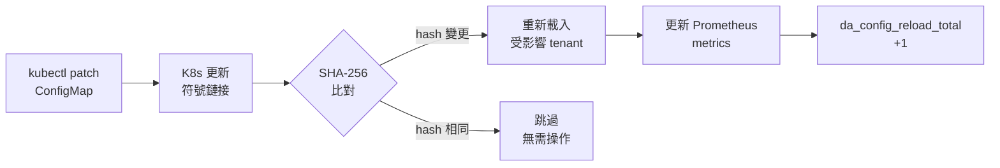
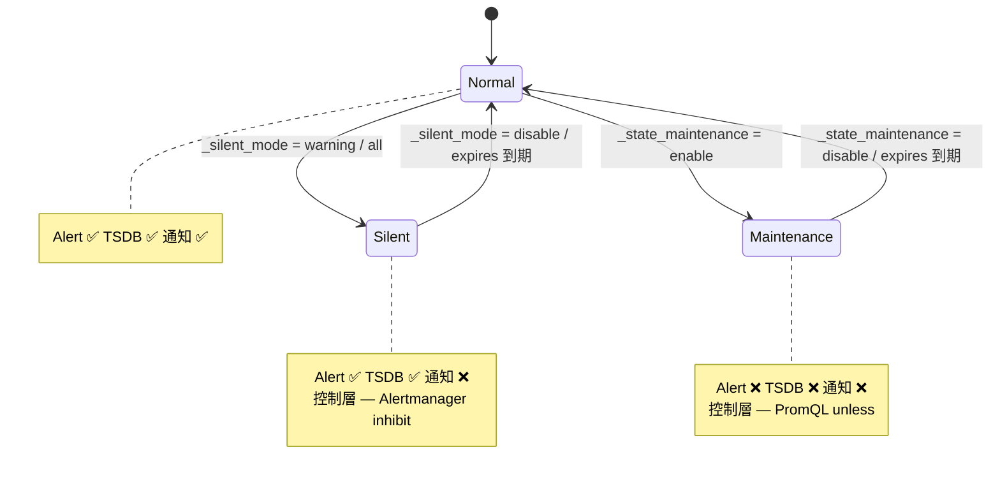
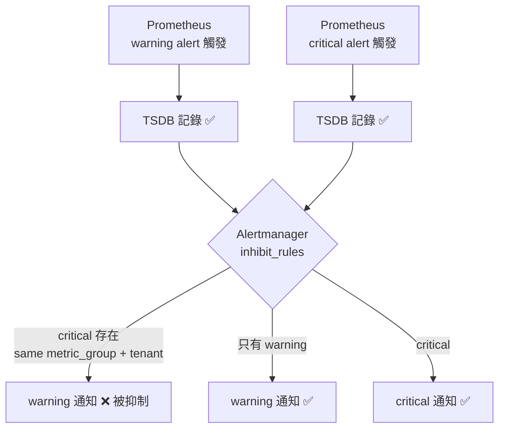

# Config-Driven 架構設計

<!-- Language switcher is provided by mkdocs-static-i18n header. -->

> ← [返回主文件](../architecture-and-design.md)

## 2. 核心設計：Config-Driven 架構

### 2.1 三態邏輯 (Three-State Logic)

平台支援「三態」配置模式，提供靈活的預設值、覆蓋和禁用機制：

| 狀態 | 配置方式 | Prometheus 輸出 | 說明 |
|------|---------|-----------------|------|
| **Custom Value** | `metric_key: 42` | ✓ 輸出自訂閾值 | 租戶覆蓋預設值 |
| **Omitted (Default)** | 未在 YAML 中指定 | ✓ 輸出平台預設值 | 使用 `_defaults.yaml` |
| **Disable** | `metric_key: "disable"` | ✗ 不輸出 | 完全禁用該指標 |

**Prometheus 輸出示例：**

```
# Custom value (db-a 租戶)
user_threshold{tenant="db-a", metric="mariadb_replication_lag", severity="warning"} 10

# Default value (db-b 租戶，未覆蓋)
user_threshold{tenant="db-b", metric="mariadb_replication_lag", severity="warning"} 30

# Disabled (無輸出)
# (metric not present)
```

### 2.2 Directory Scanner 模式 (conf.d/)

**層次結構：**
```
conf.d/
├── _defaults.yaml         # Platform 全局預設值（Platform 團隊管理）
├── db-a.yaml             # 租戶 A 覆蓋（db-a 團隊管理）
├── db-b.yaml             # 租戶 B 覆蓋（db-b 團隊管理）
└── ...
```

**`_defaults.yaml` 內容（Platform 管理）：**
```yaml
defaults:
  mysql_connections: 80
  mysql_cpu: 80
  container_cpu: 80
  container_memory: 85

state_filters:
  container_crashloop:
    reasons: ["CrashLoopBackOff"]
    severity: "critical"
  maintenance:
    reasons: []
    severity: "info"
    default_state: "disable"
```

**`db-a.yaml` 內容（租戶覆蓋）：**
```yaml
tenants:
  db-a:
    mysql_connections: "70"          # 覆蓋預設值 80
    container_cpu: "70"              # 覆蓋預設值 80
    mysql_slave_lag: "disable"       # 無 replica，停用
    # mysql_cpu 未指定 → 使用預設值 80
    # 維度標籤
    "redis_queue_length{queue='tasks'}": "500"
    "redis_queue_length{queue='events', priority='high'}": "1000:critical"
```

#### 邊界強制規則 (Boundary Enforcement)

| 檔案類型 | 允許的區塊 | 違規行為 |
|----------|-----------|---------|
| `_` 前綴檔 (`_defaults.yaml`) | `defaults`, `state_filters`, `tenants` | — |
| 租戶檔 (`db-a.yaml`) | 僅 `tenants` | 其他區塊自動忽略 + WARN log |

#### SHA-256 熱重新加載 (Hot-Reload)

不依賴檔案修改時間 (ModTime)，而是基於 **SHA-256 內容雜湊**：

```bash
# 每次 ConfigMap 更新時
$ sha256sum conf.d/_defaults.yaml conf.d/db-a.yaml conf.d/db-b.yaml
abc123... conf.d/_defaults.yaml
def456... conf.d/db-a.yaml
ghi789... conf.d/db-b.yaml

# Prometheus 掛載的 ConfigMap 符號鏈接會旋轉
# 舊的雜湊值 → 新的雜湊值
# threshold-exporter 偵測到變化，重新載入配置
```



**為什麼 SHA-256 而不是 ModTime？**
- Kubernetes ConfigMap 會建立符號鏈接層，ModTime 不可靠
- 內容相同 = 雜湊相同，避免不必要的重新加載

#### Incremental Reload Internal Mechanism (v2.1.0)

`ConfigManager.IncrementalLoad()` 實現四階段增量重載，避免每次 reload 都全量解析：

```
Phase 1: Mtime Guard — 快速篩選
  ├─ 每檔 stat() 取 mtime + size
  ├─ 若 (mtime + size 不變) 且 (檔齡 > 2s) → 複用快取 SHA-256
  ├─ 否則 → 讀檔 + 計算 SHA-256
  └─ 組合所有 per-file hash → composite hash
     └─ composite hash == 前次 → 直接 RETURN（零成本）

Phase 2: Per-File Hash Diff
  ├─ 新 hash 不在舊表 → ADDED
  ├─ hash 值不同 → CHANGED
  └─ 舊 hash 不在新表 → REMOVED

Phase 3: Selective Re-Parse
  ├─ 僅重新解析 ADDED + CHANGED 檔案（YAML unmarshal）
  ├─ REMOVED 檔案的快取清除
  └─ Boundary enforcement（租戶檔不允許 state_filters 等）

Phase 4: Incremental Merge
  ├─ 若僅 tenant 檔變更（非 _defaults / _profiles）
  │   → shallow-copy 前次 config + patch 受影響 tenant（快速路徑）
  └─ 否則 → 全量 merge 所有 partial configs
```

**Atomic Swap**：`RWMutex` 保護 config / hash / cache 的原子更新。讀端（Prometheus scrape）用 `RLock()`，reload 用 `Lock()`，確保 scrape 期間不會讀到半更新的狀態。

**效能特性**（benchmark 數據見 [§12](../benchmarks.md#12-incremental-hot-reload-效能)）：

| 場景 | 延遲 | 程式路徑 |
|------|------|---------|
| 1000 tenant，無變更（mtime guard 命中） | ~1.5ms | stat-only + hash 比對 |
| 1000 tenant，1 檔變更 | ~6.9ms | scan 6.2ms + re-parse 0.2ms + merge 0.5ms |
| 100 tenant，無變更 | ~129µs | per-file stat |

**Fallback**：若快取為空或損壞，自動退回 `fullDirLoad()`（全量載入）。

### 2.3 Tenant-Namespace 映射模式 (Tenant-Namespace Mapping)

平台的 `tenant` 是**邏輯身分**，由兩個獨立來源決定：

1. **閾值側**：threshold-exporter 從 YAML config key（`tenants.db-a`）取得 tenant，與 K8s namespace 零耦合
2. **資料側**：Prometheus `relabel_configs` 將抓取到的指標注入 `tenant` 標籤

兩側的 `tenant` 值必須精確匹配，但**來源可以不同**。這使得以下三種映射模式都可行：

| 映射模式 | 說明 | Prometheus relabel 策略 | 適用場景 |
|---------|------|------------------------|---------|
| **1:1**（標準） | 一個 Namespace = 一個 Tenant | `source_labels: [__meta_kubernetes_namespace]` → `target_label: tenant` | 大多數部署 |
| **N:1** | 多個 Namespace 視為同一 Tenant | 多個 namespace 的指標 relabel 到同一個 tenant 值 | 讀寫分離（`db-a-read` + `db-a-write` → `db-a`） |
| **1:N** | 一個 Namespace 內多個 Tenant | 以 Service label/annotation 而非 namespace 作為 tenant 來源 | 共享 namespace 的多租戶架構 |

**N:1 relabel 範例**（多 namespace → 一個 tenant）：

```yaml
relabel_configs:
  - source_labels: [__meta_kubernetes_namespace]
    action: keep
    regex: "db-a-(read|write)"
  # 統一映射為 db-a
  - source_labels: [__meta_kubernetes_namespace]
    target_label: tenant
    regex: "(db-[^-]+).*"    # 擷取第一段作為 tenant
    replacement: "$1"
```

**1:N relabel 範例**（一個 namespace → 多個 tenant）：

```yaml
relabel_configs:
  - source_labels: [__meta_kubernetes_namespace]
    action: keep
    regex: "shared-db"
  # 從 Service annotation 讀取 tenant 身分
  - source_labels: [__meta_kubernetes_service_annotation_alerting_tenant]
    target_label: tenant
```

**自動化工具**：`scaffold_tenant.py --namespaces ns1,ns2` 可自動產出 N:1 relabel_configs snippet，並在 tenant YAML 中寫入 `_namespaces` 元資料欄位供工具參考（不影響 metric 邏輯）。

**自動化工具（ADR-006）**：`discover_instance_mappings.py` 可自動偵測 Prometheus 中的實例拓撲，`generate_tenant_mapping_rules.py` 從 `_instance_mapping.yaml` 產生 1:N 映射所需的 Recording Rules。詳見 [ADR-006](../adr/006-tenant-mapping-topologies.md)。

**設計原則**：平台核心（threshold-exporter + Rule Packs）完全不感知 namespace 結構。映射彈性完全由 Prometheus scrape config 和 Recording Rules 提供，無需修改平台任何元件。詳見 [BYO Prometheus 整合指南](../byo-prometheus-integration.md)。

### 2.4 多層嚴重度 (Multi-tier Severity)

支援 `_critical` 後綴與 `"value:severity"` 兩種語法：

**方式一：`_critical` 後綴（適用於基本閾值）**
```yaml
tenants:
  db-a:
    mysql_connections: "100"            # warning 閾值
    mysql_connections_critical: "150"   # _critical → 自動產生 critical alert
```

**方式二：`"value:severity"` 語法（適用於維度標籤）**
```yaml
tenants:
  redis-prod:
    "redis_queue_length{queue='orders'}": "500:critical"
```

**Prometheus 輸出：**
```
user_threshold{tenant="db-a", component="mysql", metric="connections", severity="warning"} 100
user_threshold{tenant="db-a", component="mysql", metric="connections", severity="critical"} 150
```

#### 自動抑制 (Auto-Suppression) — Severity Dedup

v1.2.0 起，Severity Dedup 從 PromQL 層移至 **Alertmanager inhibit 層**（詳見 §2.8）。Alert Rule 不再使用 `unless critical` 邏輯，warning 和 critical 均在 Prometheus 中獨立觸發，TSDB 保有完整紀錄。通知去重由 Alertmanager per-tenant inhibit rule 控制。

```yaml
# Warning 和 Critical 獨立觸發，TSDB 完整保留
- alert: MariaDBHighConnections          # warning
  expr: |
    ( tenant:mysql_threads_connected:max > on(tenant) group_left tenant:alert_threshold:connections )
    unless on(tenant) (user_state_filter{filter="maintenance"} == 1)
  labels:
    severity: warning
    metric_group: connections
- alert: MariaDBHighConnectionsCritical  # critical
  expr: |
    ( tenant:mysql_threads_connected:max > on(tenant) group_left tenant:alert_threshold:connections_critical )
    unless on(tenant) (user_state_filter{filter="maintenance"} == 1)
  labels:
    severity: critical
    metric_group: connections
```

**結果：** 連線數 ≥ 150 時，warning 和 critical 均觸發（TSDB 完整），但 Alertmanager inhibit rule 攔截 warning 通知，只送出 critical 通知。

### 2.5 Regex 維度閾值 (Regex Dimension Thresholds)

v0.12.0 起，Config parser 支援 `=~` 運算子，允許以 regex 模式精細匹配維度標籤。此設計在不引入外部資料依賴的前提下，讓閾值配置可針對特定維度子集生效。

**配置語法：**
```yaml
tenants:
  db-a:
    # 精確匹配
    "oracle_tablespace_used_percent{tablespace='USERS'}": "85"
    # Regex 匹配：所有 SYS 開頭的 tablespace
    "oracle_tablespace_used_percent{tablespace=~'SYS.*'}": "95"
```

**實現路徑：**

1. **Exporter 層**：Config parser 偵測 `=~` 運算子，將 regex pattern 作為 `_re` 後綴 label 輸出
   ```
   user_threshold{tenant="db-a", metric="oracle_tablespace_used_percent",
                  tablespace_re="SYS.*", severity="warning"} 95
   ```
2. **Recording Rule 層**：PromQL 使用 `label_replace` + `=~` 在查詢時完成實際匹配
3. **設計原則**：Exporter 保持為純 config→metric 轉換器，匹配邏輯完全由 Prometheus 原生向量運算執行

### 2.6 排程式閾值 (Scheduled Thresholds)

v0.12.0 起，閾值支援時間窗口排程，允許在不同時段自動切換不同閾值。典型場景：夜間維護窗口放寬閾值、尖峰時段收緊閾值。

> **時區注意事項：** 所有時間窗口 (`window`) 與 recurring maintenance 的 cron 表達式均使用 **UTC 時區**。配置時請將本地時間轉換為 UTC。例如 UTC+8 的 06:00-14:00 在此應寫為 `"22:00-06:00"`。

**配置語法：**
```yaml
tenants:
  db-a:
    mysql_connections:
      default: "100"
      overrides:
        - window: "22:00-06:00"    # UTC 夜間窗口（支援跨午夜）
          value: "200"             # 夜間批次作業，放寬到 200
        - window: "09:00-18:00"
          value: "80"              # 日間高峰，收緊到 80
```

**技術實現：**

- **`ScheduledValue` 自訂 YAML 型別**：支援雙格式解析——純量字串（向後相容）和結構化 `{default, overrides[{window, value}]}`
- **`ResolveAt(now time.Time)`**：根據當前 UTC 時間解析應使用的閾值，確保確定性與可測試性
- **時間窗口格式**：`HH:MM-HH:MM` (UTC)，支援跨午夜（如 `22:00-06:00` 表示晚上十點到隔天早上六點）
- **45 個測試案例**：覆蓋邊界條件——窗口重疊、跨午夜、純量退化、空 overrides

### 2.7 三態運營模式 (Operational Modes)

v1.2.0 新增 **Silent Mode**，與既有的 Maintenance Mode 形成三態運營模式，解決「使用者把 Maintenance Mode 當靜音用」的問題。

**行為矩陣**

| 運營狀態 | 語義 | Alert 觸發 | TSDB 紀錄 | 通知 | 控制層 |
|---------|------|-----------|----------|------|--------|
| Normal | 正常運行 | ✅ | ✅ | ✅ | — |
| Silent | 靜音 | ✅ | ✅ | ❌ | Alertmanager |
| Maintenance | 真正維護 | ❌ | ❌ | ❌ | Prometheus (PromQL) |



**設計原則**：Prometheus 管「什麼該 alert」，Alertmanager 管「要不要通知」。

- **Maintenance Mode**（既有）：在 PromQL 層透過 `unless on(tenant) (user_state_filter{filter="maintenance"} == 1)` 消滅 alert。Alert 不觸發，TSDB 無紀錄，無通知。
- **Silent Mode**：Alert 在 Prometheus 正常觸發（TSDB 有 `ALERTS` 紀錄），但 Alertmanager 透過 `inhibit_rules` 攔截通知。

**Silent Mode 資料流**

```
tenant YAML: _silent_mode: "warning"
    ↓
threshold-exporter: user_silent_mode{tenant="db-a", target_severity="warning"} 1
    ↓
Prometheus alert rule (rule-pack-operational.yaml):
    TenantSilentWarning{tenant="db-a"} fires
    ↓
Alertmanager inhibit_rules:
    source: alertname="TenantSilentWarning"
    target: severity="warning", equal: ["tenant"]
    ↓
結果: db-a 的 warning alert 照常觸發（TSDB 有紀錄），但通知被攔截
```

**Tenant 配置**

```yaml
tenants:
  db-a:
    _silent_mode: "warning"    # 只靜音 warning 通知
  db-b:
    _silent_mode: "all"        # 靜音 warning + critical 通知
  db-c:
    _state_maintenance: "enable"  # 真正維護，完全不觸發 alert
  db-d: {}                        # Normal — 預設行為
```

可用的 `_silent_mode` 值：`warning`、`critical`、`all`、`disable`。未設定等同 Normal。

**自動失效 **：`_silent_mode` 和 `_state_maintenance` 支援結構化物件（向後相容純量字串），帶 `expires` ISO8601 時戳。Go 引擎 `time.Now().After(expires)` 過期即停止 emit sentinel metric，alert 自動恢復正常。失效時產出瞬時 gauge `da_config_event{event="silence_expired"}` 搭配 `TenantConfigEvent` alert rule 通知。

```yaml
tenants:
  db-a:
    _silent_mode:
      target: "all"
      expires: "2026-04-01T00:00:00Z"
      reason: "Migration shadow monitoring period"
    _state_maintenance:
      target: "all"
      expires: "2026-04-01T00:00:00Z"
      reason: "Scheduled maintenance window"
```

**Alertmanager inhibit_rules 範本**

```yaml
inhibit_rules:
  # Severity Dedup: per-tenant inhibit rules (由 generate_alertmanager_routes.py 產出)
  # 僅 _severity_dedup: "enable" (預設) 的 tenant 會產出規則
  # _severity_dedup: "disable" 的 tenant 不會有對應規則 → 兩種通知都收到
  - source_matchers:
      - severity="critical"
      - metric_group=~".+"
      - tenant="db-a"
    target_matchers:
      - severity="warning"
      - metric_group=~".+"
      - tenant="db-a"
    equal: ["metric_group"]

  # Silent Mode: 壓制 warning 通知
  - source_matchers:
      - alertname="TenantSilentWarning"
    target_matchers:
      - severity="warning"
    equal: ["tenant"]

  # Silent Mode: 壓制 critical 通知
  - source_matchers:
      - alertname="TenantSilentCritical"
    target_matchers:
      - severity="critical"
    equal: ["tenant"]
```

### 2.8 Severity Dedup（嚴重度去重）

v1.2.0 新增 **Severity Dedup**，解決「critical 觸發時 warning 的 TSDB 紀錄被消滅」的問題。

**設計變更**：Auto-Suppression 從 PromQL 層（`unless critical`）移至 Alertmanager 層（`inhibit_rules`）。TSDB 永遠同時記錄 warning 和 critical，dedup 只控制通知行為。



**Per-Tenant 控制機制**

v1.2.0 採用 per-tenant inhibit rules 實現可選化：

1. `generate_alertmanager_routes.py` 掃描所有 tenant YAML 的 `_severity_dedup` 設定
2. 對每個 dedup enabled 的 tenant 產出一條專屬 inhibit rule（帶 `tenant="<name>"` matcher）
3. `_severity_dedup: "disable"` 的 tenant 不產出 rule → 兩種通知都收到
4. Exporter 仍輸出 `user_severity_dedup{tenant, mode}` metric → Prometheus sentinel `TenantSeverityDedupEnabled` 供 Grafana 面板顯示各 tenant dedup 狀態

**行為矩陣**

| 設定 | TSDB warning | TSDB critical | Warning 通知 | Critical 通知 |
|------|-------------|--------------|-------------|--------------|
| `_severity_dedup: "enable"`（預設） | ✅ | ✅ | ❌ 被 AM 攔截 | ✅ |
| `_severity_dedup: "disable"` | ✅ | ✅ | ✅ | ✅ |

**配對機制**：Alert rule 的 `metric_group` label 讓 Alertmanager 正確配對 warning/critical（因為兩者 alertname 不同）。例如 `MariaDBHighConnections` 和 `MariaDBHighConnectionsCritical` 共享 `metric_group: "connections"`。每條 per-tenant inhibit rule 限定 `metric_group=~".+"` 確保無 `metric_group` 的 alert（如 `MariaDBDown`）不會參與 dedup。

**Tenant 配置**

```yaml
tenants:
  db-a: {}                                # 預設 enable — warning 被壓制
  db-b:
    _severity_dedup: "disable"           # 兩種通知都收到
```

**產出 Alertmanager 設定**

```bash
python3 scripts/tools/ops/generate_alertmanager_routes.py --config-dir conf.d/ --dry-run
# 輸出包含 per-tenant inhibit_rules section，合併至 Alertmanager config
```

### 2.9 Alert Routing 客製化 (Config-Driven Routing)

Tenant 可透過 `_routing` section 自主管理通知目的地、分群策略與時序控制。平台工具 `generate_alertmanager_routes.py` 讀取所有 tenant YAML，產出 Alertmanager route + receiver + inhibit_rules YAML fragment。

> 支援 webhook / email / slack / teams / rocketchat / pagerduty 六種 receiver type。Receiver 為結構化物件（`{type, ...fields}`），由 `generate_alertmanager_routes.py` 驗證必要欄位並產出對應 Alertmanager config。

**Schema**

```yaml
tenants:
  db-a:
    _routing:
      receiver:                                         # required — 結構化物件
        type: "webhook"                                 #   type: webhook/email/slack/teams/rocketchat/pagerduty
        url: "https://webhook.db-a.svc/alerts"
      group_by: ["alertname", "severity"]               # optional
      group_wait: "30s"                                  # optional, guardrail 5s–5m
      group_interval: "1m"                               # optional, guardrail 5s–5m
      repeat_interval: "4h"                              # optional, guardrail 1m–72h
      overrides: []                                      # optional, per-rule routing (§2.10)
```

**Timing Guardrails**

平台對時序參數設定硬性上下界，超限值自動 clamp 並發出 WARN log：

| 參數 | 最小值 | 最大值 | 預設值 |
|------|--------|--------|--------|
| `group_wait` | 5s | 5m | 30s |
| `group_interval` | 5s | 5m | 5m |
| `repeat_interval` | 1m | 72h | 4h |

**與 Silent Mode 的交互**

Silent Mode 天然 bypass routing：Alertmanager 的 inhibit_rules 在 route evaluation 之前攔截通知。因此即使 tenant 配置了自訂 routing，silent 的 alert 仍不會送出通知。

**工具鏈**

```bash
# 預覽模式
python3 scripts/tools/ops/generate_alertmanager_routes.py \
  --config-dir conf.d/ --dry-run

# 產出 fragment + CI 驗證
python3 scripts/tools/ops/generate_alertmanager_routes.py \
  --config-dir conf.d/ -o alertmanager-routes.yaml --validate \
  --policy .github/custom-rule-policy.yaml

# 一站式合併至 Alertmanager ConfigMap + reload
python3 scripts/tools/ops/generate_alertmanager_routes.py \
  --config-dir conf.d/ --apply --yes
```

`--validate` 檢查 YAML 合法性 + webhook domain allowlist（exit 0/1，供 CI 消費）。`--apply` 直接合併 fragment 至 Alertmanager ConfigMap 並觸發 reload。產出支援 webhook、email、slack、teams、rocketchat、pagerduty 六種 receiver type。

### 2.10 Per-rule Routing Overrides

v1.8.0 新增 **Per-rule Routing Overrides** 功能，允許 tenant 針對特定 alert 或 metric group 指定不同的 receiver（例如：DBA 特定 alert 走 PagerDuty，其餘走 Slack）。

**YAML 設定範例：**

```yaml
tenants:
  db-a:
    _routing:
      receiver:
        type: slack
        api_url: "https://hooks.slack.com/services/..."
      overrides:
        - alertname: "MariaDBReplicationLag"
          receiver:
            type: pagerduty
            service_key: "abc123"
        - metric_group: "redis"
          receiver:
            type: webhook
            url: "https://oncall.example.com/redis"
```

**設計規則：**

- 每個 override 必須指定 `alertname` 或 `metric_group`（二擇一，不可同時設定）
- override receiver 走同一個 `build_receiver_config()` 驗證 + domain allowlist 檢查
- `expand_routing_overrides()` 產出的子路由插入在 tenant 主路由之前，確保 Alertmanager 優先匹配 override
- Timing parameters（`group_wait`、`group_interval`、`repeat_interval`）可在 override 層級覆寫，同樣受平台 guardrails 約束

### 2.11 Platform Enforced Routing

Platform Team 可在 `_defaults.yaml` 設定 `_routing_enforced`，在所有 tenant route 之前插入平台路由（帶 `continue: true`），實現「NOC 必收 + tenant 也收」雙軌通知：

```yaml
# _defaults.yaml — 模式 A：統一 NOC 接收
_routing_enforced:
  enabled: true
  receiver:
    type: "webhook"
    url: "https://noc.example.com/alerts"
  match:
    severity: "critical"    # 僅 critical 送 NOC
```

**Per-tenant Enforced Channel：** 若 receiver 欄位包含 `{{tenant}}`，系統自動為每個 tenant 建立獨立的 enforced route，讓 Platform 可 by-tenant 建立各自的通知通道，tenant 無法拒絕也無法覆寫：

```yaml
# _defaults.yaml — 模式 B：per-tenant 獨立通道
_routing_enforced:
  enabled: true
  receiver:
    type: "slack"
    api_url: "https://hooks.slack.com/services/T/B/x"
    channel: "#alerts-{{tenant}}"    # → #alerts-db-a, #alerts-db-b, ...
```

`generate_alertmanager_routes.py` 在 tenant route 之前插入 platform route。模式 A 產生單一共用 route，模式 B 產生 N 個 per-tenant route（各帶 `tenant="<name>"` matcher + `continue: true`）。預設不啟用，Platform Team 按需開啟。詳見 [BYO Alertmanager 整合指南 §8](../byo-alertmanager-integration.md#8-platform-enforced-routing)。

### 2.12 Routing Profiles 與 Domain Policies（ADR-007）

當多個租戶共享相同的 on-call 團隊和通知策略時，`_routing` 區塊會大量重複。ADR-007 引入兩層機制解決此問題：

**Routing Profiles**：在 `_routing_profiles.yaml` 中定義命名路由配置，租戶透過 `_routing_profile` 引用：

```yaml
# _routing_profiles.yaml
routing_profiles:
  team-sre-apac:
    receiver: slack-sre-apac
    group_by: [tenant, alertname, severity]
    group_wait: 30s
    repeat_interval: 4h

# db-a.yaml — 租戶只需引用 profile
tenants:
  db-a:
    _routing_profile: team-sre-apac
```

**Domain Policies**：在 `_domain_policy.yaml` 中定義業務域的合規約束（如金融域禁止 Slack 通知），在路由產生後驗證，不注入配置值。

**四層合併流水線**：

```
_routing_defaults → routing_profiles[ref] → tenant _routing → _routing_enforced
     全域預設          團隊共享模板          租戶覆寫          NOC 不可變覆蓋
                                                    ↓
                                          domain_policies（驗證約束）
```

後者覆蓋前者，`_routing_enforced` 永遠最終覆蓋。Domain Policies 不修改值，僅驗證最終結果是否符合約束。

**偵錯工具**：`explain_route.py --show-profile-expansion` 可顯示每一層合併的結果，定位配置來源。

詳見 [ADR-007](../adr/007-cross-domain-routing-profiles.md)。

---

> 💡 **互動工具**
>
> **Routing 與 Receiver 配置**助手：
>
> - [Config Diff](https://vencil.github.io/Dynamic-Alerting-Integrations/assets/jsx-loader.html?component=../interactive/tools/config-diff.jsx) — 比較租戶路由與接收器配置的變更
> - [Alert Simulator](https://vencil.github.io/Dynamic-Alerting-Integrations/assets/jsx-loader.html?component=../interactive/tools/alert-simulator.jsx) — 模擬警報流經路由、分組與重複間隔的行為
> - [Architecture Quiz](https://vencil.github.io/Dynamic-Alerting-Integrations/assets/jsx-loader.html?component=../interactive/tools/architecture-quiz.jsx) — 通過互動測驗找出最適合你的架構模式
>
> 更多工具見 [Interactive Tools Hub](https://vencil.github.io/Dynamic-Alerting-Integrations/)

### 2.13 效能架構：Pre-computed Recording Rule vs Runtime Aggregation

客戶最常見的問題：「隨著 tenant 增加，Prometheus CPU/Memory 是否會暴增？」答案是不會，因為本平台的三層 Rule Pack 設計將運算成本從「告警評估時」移到「背景預算時」。

**傳統做法（Runtime Aggregation）— 每次評估都掃全量原始資料：**

```yaml
# 每次 Alert 評估：Prometheus 必須載入所有 Pod 的 raw time series，執行 rate + sum
- alert: TenantCPUHigh
  expr: |
    sum by (namespace) (rate(container_cpu_usage_seconds_total{container!=""}[5m]))
    > on(namespace) group_left()
    tenant_cpu_threshold
```

當有 N 個 tenant、底下有 10,000 個 Pod 時，每 15 秒評估一次，Prometheus 必須：從 TSDB 載入 10,000 條序列過去 5 分鐘的 chunks → 執行 `rate()` → 執行 `sum by (namespace)` → 最後才做 `>` 比對。運算量 O(pods × tenants)，隨規模線性增長。

**本平台做法（Pre-computed Vector Join）— 告警評估只做記憶體內數字比對：**

```yaml
# Part 2 Recording Rule（背景穩定執行，產出低基數指標）
- record: tenant:cpu_usage:rate5m
  expr: sum by (tenant) (rate(container_cpu_usage_seconds_total{container!=""}[5m]))

# Part 3 Alert Rule（只比較兩組已預算好的數字向量）
- alert: TenantCPUHigh
  expr: |
    tenant:cpu_usage:rate5m
    > on(tenant) group_left()
    tenant:alert_threshold:cpu_usage
```

Recording Rule 在背景將 10,000 條 raw series 聚合成 N 個 tenant 級數字。Alert 評估時，Prometheus 只做 N 個數字 vs N 個數字的 Vector Join。運算量 O(tenants)，與 Pod 數量無關。

**防護機制：**

- **Cardinality Guard**：threshold-exporter 的 per-tenant 500 指標上限。即使配置異常，Go 引擎也會主動截斷輸出並記錄 ERROR，防止 TSDB 被撐爆
- **500 是告警情境數，不是 raw metric 數**：一個 `cpu_warning_threshold: 80` 經由 Recording Rule 的 Vector Join 會自動套用到該 tenant 下所有 Pod。500 代表的是「500 種不同的告警閾值定義」，以 SRE 最佳實踐而言（核心告警 10-20 條），這個上限足以容納大量歷史包袱和特殊場景

**在你的環境中驗證：**

效能與你的 TSDB 大小、scrape interval、硬體規格高度相關。我們不提供合成 benchmark 數據，而是提供工具讓你在自己的環境中評估：

```bash
# 評估當前基數增長趨勢，預測何時觸頂
da-tools cardinality-forecast --prometheus http://prometheus:9090 --warn-days 30

# 查看每個 tenant 的指標數量是否健康
da-tools diagnose <tenant> --config-dir conf.d/
```

> threshold-exporter 層面的 micro-benchmark（config reload 延遲）見 [benchmarks.md](../benchmarks.md)。漸進式遷移指南見 [incremental-migration-playbook](../scenarios/incremental-migration-playbook.md)。

### 2.14 Tenant Management API Architecture (ADR-009)
