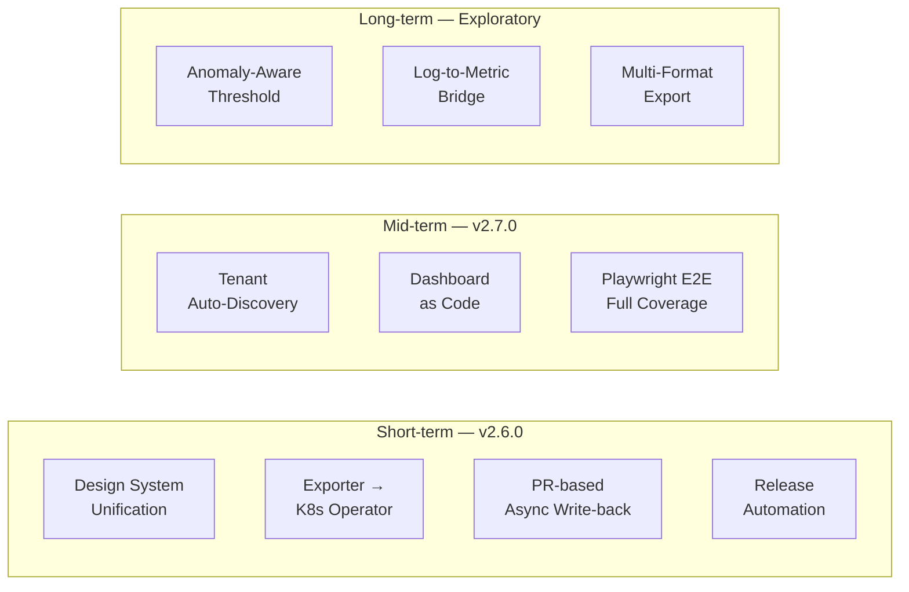

# Future Roadmap

> **Language / 語言：** **English (Current)** | [中文](roadmap-future.md)
>
> ← [Back to Main Document](../architecture-and-design.en.md)

## Future Roadmap

DX tooling improvements are tracked in [dx-tooling-backlog.md](../internal/dx-tooling-backlog.md).

The following are core feature directions planned from the current v2.5.0 perspective.

---

### Short-term: v2.6.0

#### Design System Unification

v2.5.0 accumulated three parallel CSS systems (CSS variables / Tailwind / inline styles), which is the root cause of all accessibility issues. v2.6.0 Phase .a0 will establish `design-tokens.css` as the SSOT, unifying color, spacing, and typography tokens, and introducing `[data-theme="dark"]` attribute switching for Light/Dark/System tri-state support. Playwright axe-core automated WCAG detection will be integrated in the same phase.

#### threshold-exporter Evolution to K8s Operator

v2.3.0's `detectConfigSource()` three-mode detection and Operator-Native toolchain laid the groundwork. The goal is having threshold-exporter watch a custom `DynamicAlertTenant` CRD, replacing the ConfigMap + Directory Scanner pattern. Requires Operator SDK, RBAC design, CRD versioning, and reconciliation loop. The existing config-dir mode remains as a permanent fallback. v2.6.0 will first build a CRD → ConfigMap bridge and migration tooling (`migrate-to-operator`).

#### PR-based Async Write-back (ADR-011)

Extend tenant-api's write model from "synchronous mutex + local git commit" to "asynchronous PR submission". Changes go through a PR review flow before merging, suited for enterprise environments with change management requirements. Requires decisions on PR status tracking (pending/merged/conflicted), GitHub PAT management, multi-PR merge conflict strategy, and eventual consistency semantics while PRs are unmerged.

#### Release Automation

Automate the four-line version tags (platform/exporter/tools/portal) and GitHub Release creation. Watch tag pushes to auto-trigger Release Notes generation (from CHANGELOG sections) and OCI image build/push. v2.3.0's stable CI matrix provides the foundation.

---

### Mid-term: v2.7.0

#### Tenant Auto-Discovery

For Kubernetes-native environments, auto-register tenants based on namespace labels (e.g., `dynamic-alerting.io/tenant: "true"`). Recommended sidecar pattern: an independent sidecar periodically scans namespace labels, generates tenant YAML into config-dir, loaded by the existing Directory Scanner. Explicit configurations in config-dir always take precedence over auto-discovered results. `discover_instance_mappings.py` can serve as the topology detection component inside the sidecar.

#### Grafana Dashboard as Code

`scaffold_tenant.py --grafana` auto-generates per-tenant dashboard JSON. Leverages `platform-data.json`'s existing Rule Pack / metric / tenant metadata to generate corresponding panels. Combined with Grafana provisioning or API for automated deployment.

#### Playwright E2E Full Coverage

v2.5.0 established the foundation (5 specs / 38 cases, mock API). v2.7.0 expands to smoke tests for all 39 JSX tools, plus real backend integration tests (once v2.6.0's async API stabilizes). axe-core automated accessibility detection will be established earlier in v2.6.0 Phase .a0.

---

### Long-term: Exploratory

#### Anomaly-Aware Dynamic Threshold

Support `_threshold_mode: adaptive` in threshold-exporter, combining Prometheus sliding window statistics (e.g., `quantile_over_time`) to dynamically adjust threshold bounds. Tenant YAML defines a baseline strategy (e.g., `p95 + 2σ`), exporter produces `user_threshold_dynamic` metric. A recording rule selects `max(user_threshold, user_threshold_dynamic)` as the final threshold — static thresholds as a safety floor, dynamic thresholds for seasonal fluctuations. `threshold_recommend.py` has reusable percentile computation logic.

**Risk**: Exporter directly querying Prometheus introduces circular dependency. Alternative: place computation in recording rules (pure PromQL), exporter only outputs strategy parameters.

#### Log-to-Metric Bridge

This platform's design boundary is the Prometheus metrics layer — it does not directly process logs. The recommended ecosystem approach: `Application Log → grok_exporter / mtail → Prometheus metric → Platform threshold management`. If demand materializes, a `log_bridge_check.py` tool can validate grok_exporter configuration alignment with Rule Packs.

#### Multi-Format Export

Export platform configuration in other monitoring systems' native formats: `da-tools export --format datadog` (Datadog Monitor JSON), `--format terraform` (Terraform HCL for AWS CloudWatch Alarms). Positions the platform as an "alert policy abstraction layer". Prerequisite: metric name mapping table between `metric-dictionary.yaml` and each system.
