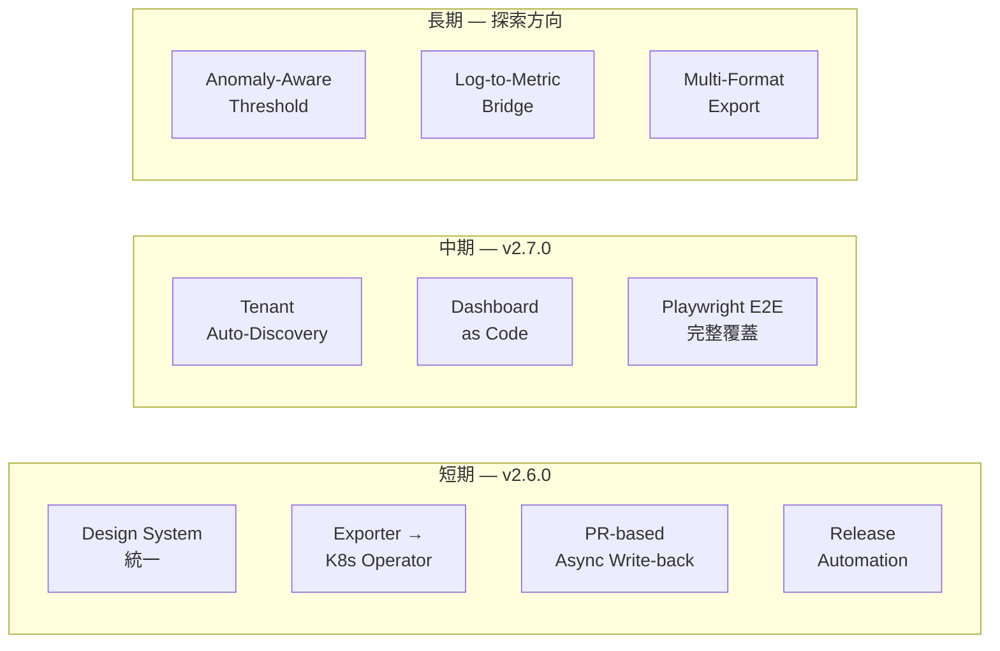

# 未來擴展路線

> **Language / 語言：** | **中文（當前）** | [English](roadmap-future.en.md)
>
> ← [返回主文件](../architecture-and-design.md)

## 未來擴展路線 (Future Roadmap)

DX 工具改善追蹤見 [dx-tooling-backlog.md](../internal/dx-tooling-backlog.md)。

以下為 v2.5.0 完成後，從現階段視角規劃的核心功能方向。

---

### Short-Term: v2.6.0

#### Design System 統一

v2.5.0 累積了三套平行 CSS 系統（CSS variables / Tailwind / inline styles），是所有無障礙問題的根源。v2.6.0 Phase .a0 將建立 `design-tokens.css` 作為 SSOT，統一 color、spacing、typography token，並引入 `[data-theme="dark"]` 屬性切換支援 Light/Dark/System 三態。同步整合 Playwright axe-core 自動化 WCAG 偵測。

#### threshold-exporter 演化為 K8s Operator

v2.3.0 的 `detectConfigSource()` 三態偵測和 Operator-Native 工具鏈已奠基。目標是讓 threshold-exporter 監聽自定義 `DynamicAlertTenant` CRD，取代 ConfigMap + Directory Scanner 模式。需 Operator SDK、RBAC 設計、CRD versioning、reconciliation loop。現有 config-dir 模式作為 fallback 永遠保留。v2.6.0 先建立 CRD → ConfigMap bridge 和遷移工具（`migrate-to-operator`）。

#### PR-based Async Write-back (ADR-011)

將 tenant-api 的寫入模型從「同步 mutex + 本地 git commit」擴展為「非同步 PR 提交」。允許變更經由 PR 流程審核後才合併，適合 enterprise 環境的 change management 需求。需定調 PR 狀態追蹤（pending/merged/conflicted）、GitHub PAT 管理、多 PR 合併衝突策略、API 在 PR 未合併時的 eventual consistency 語義。

#### Release Automation

四線版號（platform/exporter/tools/portal）的 tag + GitHub Release 自動化。監聽 tag push 自動觸發 Release Notes 產生（基於 CHANGELOG section）和 OCI image build/push。v2.3.0 CI matrix 已穩定，為自動化提供基礎。

---

### Mid-Term: v2.7.0

#### Tenant Auto-Discovery

對 Kubernetes-native 環境，根據 namespace label（如 `dynamic-alerting.io/tenant: "true"`）自動註冊。推薦 sidecar 模式：獨立 sidecar 定期掃描 namespace label，產生 tenant YAML 寫入 config-dir，由既有 Directory Scanner 機制載入。config-dir 中的明確配置永遠優先於 auto-discovery 結果。`discover_instance_mappings.py` 可作為 sidecar 內的拓撲偵測元件。

#### Grafana Dashboard as Code

`scaffold_tenant.py --grafana` 自動產生 per-tenant dashboard JSON。利用 `platform-data.json` 已有的 Rule Pack / metric / tenant metadata 資訊，產生對應的 panel。搭配 Grafana provisioning 或 API 自動部署。

#### Playwright E2E 完整覆蓋

v2.5.0 已建立基礎（5 spec / 38 cases，mock API）。v2.7.0 擴展至全部 39 支 JSX 工具的 smoke test，並加入真實 backend integration test（搭配 v2.6.0 的 async API 穩定後）。axe-core 無障礙自動偵測在 v2.6.0 Phase .a0 先行建立。

---

### 長期：探索方向

#### Anomaly-Aware Dynamic Threshold

讓 threshold-exporter 支援 `_threshold_mode: adaptive` 配置，結合 Prometheus 的滑動窗口統計（如 `quantile_over_time`），動態調整閾值上下界。tenant YAML 定義基線策略（如 `p95 + 2σ`），exporter 產出 `user_threshold_dynamic` metric。Recording rule 選擇 `max(user_threshold, user_threshold_dynamic)` 作為最終閾值——靜態閾值作為安全下限（floor），動態閾值處理季節性波動。`threshold_recommend.py` 已有分位數計算邏輯可復用。

**風險**：exporter 直接查詢 Prometheus 引入循環依賴。替代方案是將計算邏輯放在 recording rule 層（純 PromQL），exporter 僅輸出策略參數。

#### Log-to-Metric Bridge

本平台的設計邊界是 Prometheus metrics 層，不直接處理日誌。推薦的生態系解法：`Application Log → grok_exporter / mtail → Prometheus metric → 本平台閾值管理`。若需求明確，可提供 `log_bridge_check.py` 驗證 grok_exporter 配置與 Rule Pack 的對接完整性。

#### Multi-Format Export

將平台配置匯出為其他監控系統的原生格式：`da-tools export --format datadog`（Datadog Monitor JSON）、`--format terraform`（Terraform HCL for AWS CloudWatch Alarms）。讓平台成為「告警策略的抽象層」。前提：完成 metric-dictionary.yaml 與各系統的 metric 名稱對照表。
