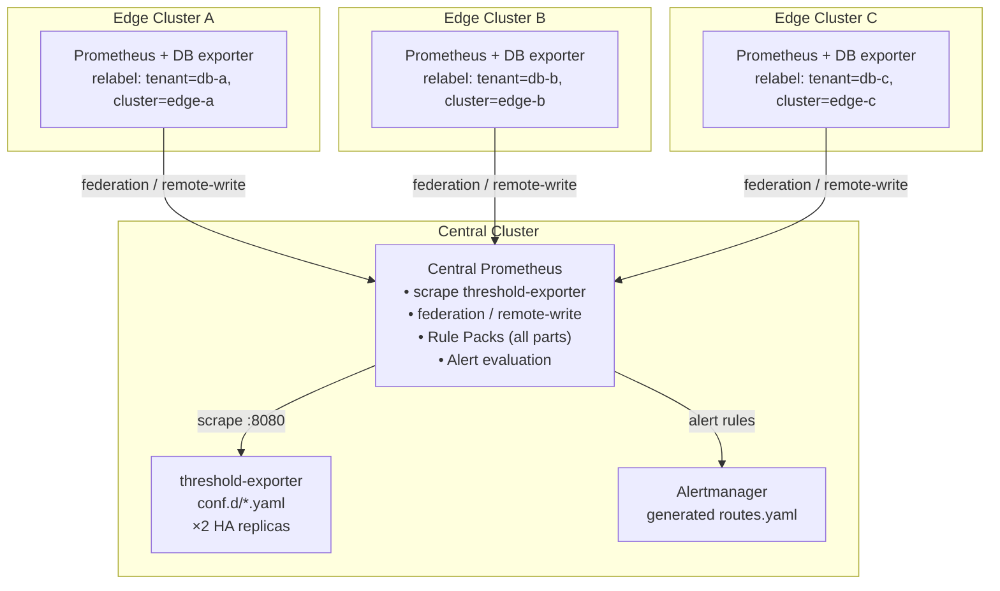

# Federation Integration Guide

> **Language / 語言：** **English (Current)** | [中文](federation-integration.md)

> **v2.0.0-preview.3** — Scenario A architecture blueprint: central threshold-exporter + multi-edge Prometheus scrape

## 1. Overview

This document describes the deployment architecture of the Dynamic Alerting platform in multi-cluster environments. The core principle is **centralized threshold management with edge-local metrics collection**, implemented through Prometheus federation or remote-write to achieve unified global alerting.

### 1.1 Applicable Scenarios

Scenario A (scope of this document) applies to the following conditions:

- Multiple Kubernetes clusters (edge/branch/regional), each running databases and business workloads
- Need for unified alert threshold management and notification routing
- Central SRE/NOC team responsible for global monitoring
- Each edge cluster already has or will deploy Prometheus + DB exporter

Not applicable: single-cluster deployments (refer directly to main README), Scenario B Rule Pack stratification (see §6).

### 1.2 Architecture Choice: Scenario A vs Scenario B

| Aspect | Scenario A (Central Evaluation) | Scenario B (Edge Evaluation) |
|--------|--------------------------------|------------------------------|
| threshold-exporter Location | Central cluster | Each edge cluster |
| Rule Pack Evaluation Location | Central Prometheus | Edge Prometheus |
| Data Transfer | federation / remote-write raw metrics | federation / remote-write recording rule results |
| Latency | Affected by scrape interval × 2 | Near real-time |
| Complexity | Low (single-point deployment) | High (Rule Packs need partitioning) |
| Suitable Scale | < 20 edge clusters | 20+ edge clusters or high-latency cross-region |

This document focuses on Scenario A. Scenario B's Rule Pack stratification design will proceed after Scenario A stabilizes and customer requirements become clear (see `architecture-and-design.md` §11.2).

## 2. Architecture Diagram



## 3. Edge Cluster Configuration

### 3.1 external_labels

Each edge Prometheus must configure `external_labels` to distinguish the source cluster:

```yaml
# prometheus.yml (edge cluster)
global:
  scrape_interval: 15s
  external_labels:
    cluster: "edge-asia-1"     # Unique cluster identifier
    environment: "production"   # Optional: environment label
```

### 3.2 Tenant relabel

Edge Prometheus is responsible for adding the `tenant` label to DB exporter metrics. Two common patterns:

**Pattern 1: 1:1 Namespace-Tenant Mapping**

```yaml
scrape_configs:
  - job_name: "tenant-exporters"
    kubernetes_sd_configs:
      - role: endpoints
        namespaces:
          names: ["db-a"]
    relabel_configs:
      - source_labels: [__meta_kubernetes_namespace]
        target_label: tenant
```

**Pattern 2: Pod Label Mapping**

```yaml
scrape_configs:
  - job_name: "tenant-exporters"
    kubernetes_sd_configs:
      - role: pod
    relabel_configs:
      - source_labels: [__meta_kubernetes_pod_label_tenant]
        target_label: tenant
      - source_labels: [tenant]
        regex: ""
        action: drop   # Drop pods without tenant label
```

### 3.3 Applicable Exporters

Edge clusters only need to deploy the corresponding exporter; threshold-exporter is not needed:

| Type | Exporter | Key Metric Prefix |
|------|----------|-------------------|
| PostgreSQL | postgres_exporter | `pg_*` |
| MariaDB/MySQL | mysqld_exporter | `mysql_*` |
| Redis | redis_exporter | `redis_*` |
| MongoDB | mongodb_exporter | `mongodb_*` |
| Oracle | oracledb_exporter | `oracledb_*` |
| DB2 | db2_exporter | `db2_*` |
| ClickHouse | clickhouse_exporter | `ClickHouse*` |
| Kafka | kafka_exporter | `kafka_*` |
| RabbitMQ | rabbitmq_exporter | `rabbitmq_*` |

### 3.4 N:1 Namespace-Tenant Mapping

When multiple namespaces within an edge cluster correspond to the same tenant, use the scaffold tool to auto-generate relabel snippets:

```bash
# Auto-generate Prometheus relabel_configs snippet
python3 scripts/tools/ops/scaffold_tenant.py \
  --tenant db-a --db postgresql --namespaces ns-prod,ns-staging
```

The generated YAML includes the `_namespaces` metadata field and corresponding `relabel_configs` snippet, which can be directly pasted into the edge Prometheus scrape_configs. See `architecture-and-design.md` §2.3 for details.

## 4. Central Cluster Configuration

### 4.1 Option One: Prometheus Federation

Suitable for scenarios with fewer edge clusters (< 10) and where scrape interval double-latency is acceptable.

```yaml
# prometheus.yml (central cluster)
scrape_configs:
  # 1. Scrape local threshold-exporter (HA ×2)
  - job_name: "threshold-exporter"
    static_configs:
      - targets: ["threshold-exporter:8080"]

  # 2. Federate from edge clusters
  - job_name: "federation-edge-asia-1"
    honor_labels: true
    metrics_path: "/federate"
    params:
      "match[]":
        # Only pull tenant-labeled metrics (DB exporters)
        - '{tenant!=""}'
    static_configs:
      - targets: ["prometheus-edge-asia-1.example.com:9090"]
        labels:
          federated_from: "edge-asia-1"
    scrape_interval: 30s
    scrape_timeout: 25s

  - job_name: "federation-edge-europe-1"
    honor_labels: true
    metrics_path: "/federate"
    params:
      "match[]":
        - '{tenant!=""}'
    static_configs:
      - targets: ["prometheus-edge-europe-1.example.com:9090"]
        labels:
          federated_from: "edge-europe-1"
    scrape_interval: 30s
    scrape_timeout: 25s
```

Important notes:

- `honor_labels: true` ensures that edge `tenant` and `cluster` labels are preserved
- `match[]` uses `{tenant!=""}` to restrict pulling only metrics with tenant label, avoiding pulling edge infrastructure metrics
- `scrape_interval` is recommended to be 30s, working with the edge 15s interval to ensure data consistency
- Federation endpoint does not support TLS client cert by default; cross-internet deployments require additional VPN or reverse proxy setup

### 4.2 Option Two: Remote Write

Suitable for scenarios with many edge clusters (10+), needing real-time push, or unstable edge networks.

**Edge Prometheus configuration:**

```yaml
# prometheus.yml (edge cluster)
remote_write:
  - url: "https://central-prometheus.example.com/api/v1/write"
    write_relabel_configs:
      # Only push tenant-labeled metrics
      - source_labels: [tenant]
        regex: ".+"
        action: keep
    queue_config:
      max_samples_per_send: 5000
      batch_send_deadline: 5s
      min_backoff: 30ms
      max_backoff: 5s
    tls_config:
      cert_file: /etc/certs/client.crt
      key_file: /etc/certs/client.key
```

**Central Prometheus configuration:**

```yaml
# Central Prometheus must enable remote-write receiver
# prometheus.yml
# Add to startup parameters: --web.enable-remote-write-receiver
```

### 4.3 threshold-exporter Configuration

The central cluster's threshold-exporter manages thresholds for all edge tenants:

```yaml
# conf.d/_defaults.yaml (central)
defaults:
  pg_connections: 80
  pg_replication_lag: 30
  mysql_connections: 80
  mysql_cpu: 80

# conf.d/db-a.yaml (edge-asia-1 tenant)
tenants:
  db-a:
    pg_connections: "70"
    pg_connections_critical: "90"
    _routing:
      receiver:
        type: "webhook"
        url: "https://noc.example.com/asia/alerts"

# conf.d/db-b.yaml (edge-europe-1 tenant)
tenants:
  db-b:
    mysql_connections: "60"
    _routing:
      receiver:
        type: "email"
        to: ["dba-europe@example.com"]
        smarthost: "smtp.example.com:587"
```

### 4.4 Rule Pack Deployment

The central Prometheus mounts all Rule Packs (same as single-cluster deployment). Recording rules are evaluated on the central cluster against raw metrics from federated/remote-write sources:

```
Edge mysql_global_status_threads_connected{tenant="db-a"}
    → federation/remote-write →
Central recording rule: tenant:mysql_threads_connected:max = max by(tenant) (...)
Central alert rule: MariaDBHighConnections (matches against tenant:alert_threshold:connections)
    → Alertmanager → notifies according to db-a's _routing
```

## 5. Prometheus Helm Integration Guide

If using Helm to manage Prometheus (such as kube-prometheus-stack), the following are recommended values configurations. This section describes customer-managed Prometheus Helm chart configuration, not the threshold-exporter chart itself.

### 5.1 externalLabels Injection

```yaml
# values.yaml (kube-prometheus-stack or similar chart)
prometheus:
  prometheusSpec:
    externalLabels:
      cluster: "central-prod"
      region: "us-east-1"
```

### 5.2 Federation Scrape Injection

```yaml
# values.yaml
prometheus:
  prometheusSpec:
    additionalScrapeConfigs:
      - job_name: "federation-edge-1"
        honor_labels: true
        metrics_path: "/federate"
        params:
          "match[]":
            - '{tenant!=""}'
        static_configs:
          - targets: ["edge-1.example.com:9090"]
```

If using K8s ConfigMap to manage Prometheus directly, add the above `external_labels` and `scrape_configs` sections directly to the `prometheus.yml` ConfigMap (refer to examples in §4.1).

## 6. Verification Checklist

After deployment, verify in the following order:

### 6.1 Edge Clusters

```bash
# Confirm external_labels are in effect
curl -s edge-prometheus:9090/api/v1/status/config | jq '.data.yaml' | grep external_labels

# Confirm tenant label exists
curl -s edge-prometheus:9090/api/v1/query?query=pg_up | jq '.data.result[].metric.tenant'

# Confirm federate endpoint is accessible (federation approach)
curl -s "edge-prometheus:9090/federate?match[]={tenant!=%22%22}" | head -5
```

### 6.2 Central Cluster

```bash
# Confirm edge metrics are received
curl -s central-prometheus:9090/api/v1/query?query=count(pg_up) | jq '.data.result'

# Confirm recording rules produce output
curl -s central-prometheus:9090/api/v1/query?query=tenant:pg_connection_usage:ratio

# Confirm threshold-exporter metrics are normal
curl -s central-prometheus:9090/api/v1/query?query=user_threshold | jq '.data.result | length'

# Confirm alert rules are loaded
curl -s central-prometheus:9090/api/v1/rules | jq '.data.groups[].name'

# Use validate-config for one-stop validation
python3 scripts/tools/ops/validate_config.py \
  --config-dir components/threshold-exporter/config/conf.d/ \
  --policy .github/custom-rule-policy.yaml \
  --rule-packs rule-packs/ \
  --version-check
```

### 6.3 End-to-End Testing

```bash
# Use check_alert.py to confirm cross-cluster tenant alert status
python3 scripts/tools/ops/check_alert.py MariaDBHighConnections db-a \
  --prometheus http://central-prometheus:9090

# Use diagnose.py to confirm tenant health
python3 scripts/tools/ops/diagnose.py db-b \
  --prometheus http://central-prometheus:9090
```

## 7. Performance Considerations

### 7.1 Federation Latency

Federation's scrape interval is superimposed on the edge's scrape interval. In the worst case, the latency from metric generation to alert firing is:

```
Edge scrape (15s) + federation scrape (30s) + recording rule eval (15s) + alert for duration (30s)
= worst case ~90s
```

For scenarios requiring sub-second response times, consider using remote-write instead (latency ~5-10s).

### 7.2 Cardinality Management

The central Prometheus accumulates metrics from all edge clusters. Each new edge cluster adds cardinality linearly.

Mitigation measures:

- Edge `write_relabel_configs` pushes only `{tenant!=""}` metrics
- Federation `match[]` restricts pulling scope
- threshold-exporter `max_metrics_per_tenant` limits metrics per tenant 
- Monitor `prometheus_tsdb_head_series` to track cardinality trends

### 7.3 High Availability

- threshold-exporter ×2 HA replicas (deduplication with `max by(tenant)` is built-in)
- Central Prometheus recommended to use Thanos/Cortex/VictoriaMetrics for HA + long-term storage
- Alertmanager dual instances + gossip clustering

## 8. Scenario B Outlook

Scenario B (edge evaluation) requires partitioning Rule Packs into two layers:

| Layer | Location | Content |
|-------|----------|---------|
| Part 1 | Edge Prometheus | Data Normalization (recording rules) |
| Part 2 + 3 | Central Prometheus | Threshold Normalization + Alert Rules |

After edge Prometheus runs Part 1, it pushes only recording rule results (such as `tenant:mysql_threads_connected:max`) through federation/remote-write, significantly reducing cross-cluster data volume. The central cluster, upon receiving normalized metrics, performs comparison against threshold-exporter thresholds and generates alerts.

This architecture requires Rule Pack YAML to support partitioning markers (such as `placement: edge | central`) and packaging tools. Development will proceed after Scenario A stabilizes and customer requirements become clear; see `architecture-and-design.md` §11.2 for details.

## Related Resources

| Resource | Relevance |
|----------|-----------|
| ["Federation Integration Guide"](./federation-integration.md) | ★★★ |
| ["Scenario: Multi-Cluster Federation Architecture — Central Thresholds + Edge Metrics"](scenarios/multi-cluster-federation.en.md) | ★★★ |
