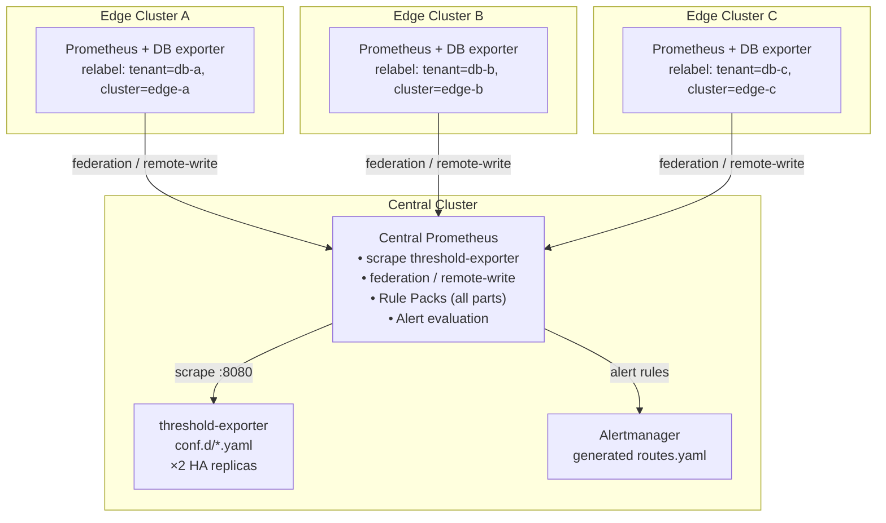
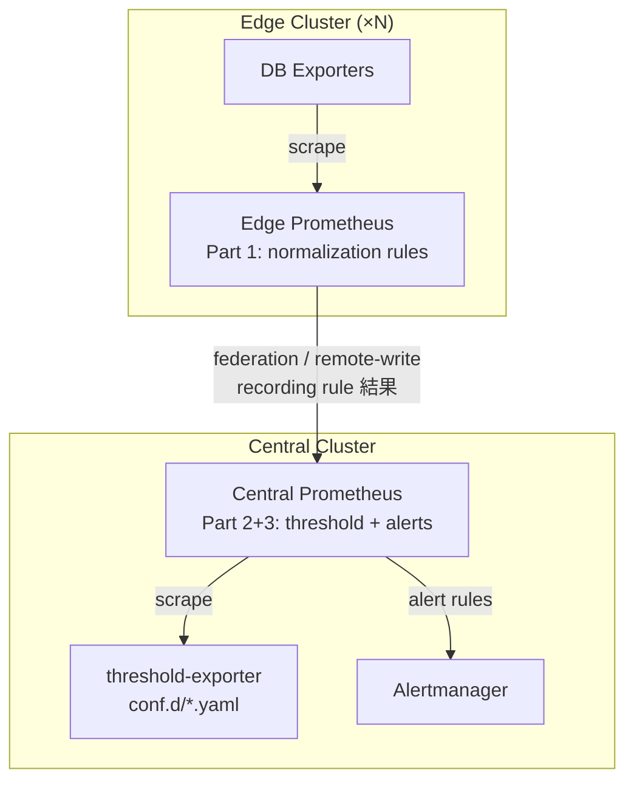

# Federation Integration Guide

> **v2.6.0** — 多叢集聯邦部署指南：中央評估與邊緣評估兩種架構

## 1. 概覽

本文件描述 Dynamic Alerting 平台在多叢集（multi-cluster）環境中的部署架構。核心原則是 **中央集中閾值管理，邊緣各自收集指標**，透過 Prometheus federation 或 remote-write 實現全域統一告警。

快速部署步驟見 [場景快速指引](scenarios/multi-cluster-federation.md)。

### 1.1 適用場景

本文件適用於以下條件：

- 多個 Kubernetes 叢集（邊緣/分支/區域），各自運行資料庫與業務負載
- 需要統一的告警閾值管理和通知路由
- 中央 SRE/NOC 團隊負責全域監控
- 各邊緣叢集已有或將部署 Prometheus + DB exporter

不適用的場景：單叢集部署（直接參考主 README）。

### 1.2 架構選擇：中央評估 vs 邊緣評估

| 面向 | 中央評估 | 邊緣評估 |
|------|---------|---------|
| threshold-exporter 位置 | 中央叢集 | 各邊緣叢集 |
| Rule Pack 評估位置 | 中央 Prometheus | 邊緣 Prometheus |
| 資料傳輸 | federation / remote-write 原始指標 | federation / remote-write recording rule 結果 |
| 延遲 | 受 scrape interval × 2 影響 | 接近即時 |
| 複雜度 | 低（單點部署） | 高（Rule Pack 需拆分） |
| 適合規模 | < 20 邊緣叢集 | 20+ 邊緣叢集或跨區高延遲 |

§2–§7 描述中央評估架構，§8 描述邊緣評估（Rule Pack 分層）架構。

## 2. 架構圖



## 3. 邊緣叢集配置

### 3.1 external_labels

每個邊緣 Prometheus 必須設定 `external_labels` 以區分來源叢集：

```yaml
# prometheus.yml (edge cluster)
global:
  scrape_interval: 15s
  external_labels:
    cluster: "edge-asia-1"     # 唯一叢集識別
    environment: "production"   # 選填：環境標籤
```

### 3.2 Tenant relabel

邊緣 Prometheus 負責將 DB exporter 指標打上 `tenant` 標籤。兩種常見模式：

**模式 1：1:1 Namespace-Tenant 映射**

```yaml
scrape_configs:
  - job_name: "tenant-exporters"
    kubernetes_sd_configs:
      - role: endpoints
        namespaces:
          names: ["db-a"]
    relabel_configs:
      - source_labels: [__meta_kubernetes_namespace]
        target_label: tenant
```

**模式 2：Pod Label 映射**

```yaml
scrape_configs:
  - job_name: "tenant-exporters"
    kubernetes_sd_configs:
      - role: pod
    relabel_configs:
      - source_labels: [__meta_kubernetes_pod_label_tenant]
        target_label: tenant
      - source_labels: [tenant]
        regex: ""
        action: drop   # 丟棄沒有 tenant label 的 pod
```

### 3.3 適用的 Exporter

邊緣叢集只需部署對應的 exporter，不需要 threshold-exporter：

| 類型 | Exporter | 關鍵指標前綴 |
|------|----------|-------------|
| PostgreSQL | postgres_exporter | `pg_*` |
| MariaDB/MySQL | mysqld_exporter | `mysql_*` |
| Redis | redis_exporter | `redis_*` |
| MongoDB | mongodb_exporter | `mongodb_*` |
| Oracle | oracledb_exporter | `oracledb_*` |
| DB2 | db2_exporter | `db2_*` |
| ClickHouse | clickhouse_exporter | `ClickHouse*` |
| Kafka | kafka_exporter | `kafka_*` |
| RabbitMQ | rabbitmq_exporter | `rabbitmq_*` |

### 3.4 N:1 Namespace-Tenant 映射

當一個邊緣叢集內多個 namespace 對應同一個 tenant 時，可使用 scaffold 工具自動產出 relabel 片段：

```bash
# 自動產出 Prometheus relabel_configs snippet
python3 scripts/tools/ops/scaffold_tenant.py \
  --tenant db-a --db postgresql --namespaces ns-prod,ns-staging
```

產出的 YAML 包含 `_namespaces` 元資料欄位和對應的 `relabel_configs` snippet，直接貼入邊緣 Prometheus 的 scrape_configs 即可。詳見 `architecture-and-design.md` §2.3。

## 4. 中央叢集配置

### 4.1 Option One: Prometheus Federation

適用於邊緣叢集數量較少（< 10）且 scrape interval 可接受雙倍延遲的場景。

```yaml
# prometheus.yml (central cluster)
scrape_configs:
  # 1. Scrape local threshold-exporter (HA ×2)
  - job_name: "threshold-exporter"
    static_configs:
      - targets: ["threshold-exporter:8080"]

  # 2. Federate from edge clusters
  - job_name: "federation-edge-asia-1"
    honor_labels: true
    metrics_path: "/federate"
    params:
      "match[]":
        # Only pull tenant-labeled metrics (DB exporters)
        - '{tenant!=""}'
    static_configs:
      - targets: ["prometheus-edge-asia-1.example.com:9090"]
        labels:
          federated_from: "edge-asia-1"
    scrape_interval: 30s
    scrape_timeout: 25s

  - job_name: "federation-edge-europe-1"
    honor_labels: true
    metrics_path: "/federate"
    params:
      "match[]":
        - '{tenant!=""}'
    static_configs:
      - targets: ["prometheus-edge-europe-1.example.com:9090"]
        labels:
          federated_from: "edge-europe-1"
    scrape_interval: 30s
    scrape_timeout: 25s
```

注意事項：

- `honor_labels: true` 確保邊緣的 `tenant`, `cluster` 標籤被保留
- `match[]` 使用 `{tenant!=""}` 限縮只拉取有 tenant 標籤的指標，避免拉回邊緣的基礎設施指標
- `scrape_interval` 建議設 30s，配合邊緣 15s 的 interval 確保資料一致性
- Federation 端點不支援 TLS client cert by default，跨公網需額外設置 VPN 或 reverse proxy

### 4.2 方案二：Remote Write

適用於邊緣叢集數量較多（10+）、需要即時推送或邊緣網路不穩定的場景。

**邊緣 Prometheus 設定：**

```yaml
# prometheus.yml (edge cluster)
remote_write:
  - url: "https://central-prometheus.example.com/api/v1/write"
    write_relabel_configs:
      # Only push tenant-labeled metrics
      - source_labels: [tenant]
        regex: ".+"
        action: keep
    queue_config:
      max_samples_per_send: 5000
      batch_send_deadline: 5s
      min_backoff: 30ms
      max_backoff: 5s
    tls_config:
      cert_file: /etc/certs/client.crt
      key_file: /etc/certs/client.key
```

**中央 Prometheus 設定：**

```yaml
# 中央 Prometheus 需啟用 remote-write receiver
# prometheus.yml
# 啟動參數加上: --web.enable-remote-write-receiver
```

### 4.3 threshold-exporter 設定

中央叢集的 threshold-exporter 管理所有邊緣租戶的閾值：

```yaml
# conf.d/_defaults.yaml (central)
defaults:
  pg_connections: 80
  pg_replication_lag: 30
  mysql_connections: 80
  mysql_cpu: 80

# conf.d/db-a.yaml (edge-asia-1 tenant)
tenants:
  db-a:
    pg_connections: "70"
    pg_connections_critical: "90"
    _routing:
      receiver:
        type: "webhook"
        url: "https://noc.example.com/asia/alerts"

# conf.d/db-b.yaml (edge-europe-1 tenant)
tenants:
  db-b:
    mysql_connections: "60"
    _routing:
      receiver:
        type: "email"
        to: ["dba-europe@example.com"]
        smarthost: "smtp.example.com:587"
```

### 4.4 Rule Pack 部署

中央 Prometheus 掛載所有 Rule Pack（與單叢集部署相同）。Recording rule 在中央評估 federated/remote-write 過來的原始指標：

```
邊緣 mysql_global_status_threads_connected{tenant="db-a"}
    → federation/remote-write →
中央 recording rule: tenant:mysql_threads_connected:max = max by(tenant) (...)
中央 alert rule: MariaDBHighConnections (比對 tenant:alert_threshold:connections)
    → Alertmanager → 依據 db-a 的 _routing 通知
```

## 5. Prometheus Helm Integration Guide

若使用 Helm 管理 Prometheus（如 kube-prometheus-stack），以下為推薦的 values 設定。本節描述的是顧客自帶的 Prometheus Helm chart 配置，非 threshold-exporter chart 本身。

### 5.1 externalLabels 注入

```yaml
# values.yaml (kube-prometheus-stack 或同類 chart)
prometheus:
  prometheusSpec:
    externalLabels:
      cluster: "central-prod"
      region: "us-east-1"
```

### 5.2 Federation Scrape 注入

```yaml
# values.yaml
prometheus:
  prometheusSpec:
    additionalScrapeConfigs:
      - job_name: "federation-edge-1"
        honor_labels: true
        metrics_path: "/federate"
        params:
          "match[]":
            - '{tenant!=""}'
        static_configs:
          - targets: ["edge-1.example.com:9090"]
```

若使用 K8s ConfigMap 直接管理 Prometheus，將上述 `external_labels` 和 `scrape_configs` 段落直接加入 `prometheus.yml` ConfigMap 即可（參考 §4.1 範例）。

## 6. 驗證 Checklist

部署後依序驗證：

### 6.1 邊緣叢集

```bash
# 確認 external_labels 生效
curl -s edge-prometheus:9090/api/v1/status/config | jq '.data.yaml' | grep external_labels

# 確認 tenant label 存在
curl -s edge-prometheus:9090/api/v1/query?query=pg_up | jq '.data.result[].metric.tenant'

# 確認 federate 端點可訪問 (federation 方案)
curl -s "edge-prometheus:9090/federate?match[]={tenant!=%22%22}" | head -5
```

### 6.2 中央叢集

```bash
# 確認收到邊緣指標
curl -s central-prometheus:9090/api/v1/query?query=count(pg_up) | jq '.data.result'

# 確認 recording rule 有產出
curl -s central-prometheus:9090/api/v1/query?query=tenant:pg_connection_usage:ratio

# 確認 threshold-exporter 指標正常
curl -s central-prometheus:9090/api/v1/query?query=user_threshold | jq '.data.result | length'

# 確認 alert rules 有載入
curl -s central-prometheus:9090/api/v1/rules | jq '.data.groups[].name'

# 使用 validate-config 一站式驗證
python3 scripts/tools/ops/validate_config.py \
  --config-dir components/threshold-exporter/config/conf.d/ \
  --policy .github/custom-rule-policy.yaml \
  --rule-packs rule-packs/ \
  --version-check
```

### 6.3 端對端測試

```bash
# 使用 check_alert.py 確認跨叢集租戶的 alert 狀態
python3 scripts/tools/ops/check_alert.py MariaDBHighConnections db-a \
  --prometheus http://central-prometheus:9090

# 使用 diagnose.py 確認租戶健康
python3 scripts/tools/ops/diagnose.py db-b \
  --prometheus http://central-prometheus:9090
```

## 7. 效能考量

### 7.1 Federation 延遲

Federation 的 scrape interval 疊加在邊緣的 scrape interval 之上。最壞情況下，從指標產生到告警觸發的延遲：

```
邊緣 scrape (15s) + federation scrape (30s) + recording rule eval (15s) + alert for 持續 (30s)
= 最壞 ~90s
```

對於需要秒級回應的場景，建議改用 remote-write（延遲約 5-10s）。

### 7.2 Cardinality 管理

中央 Prometheus 會累積所有邊緣叢集的指標。每新增一個邊緣叢集，cardinality 成線性增長。

緩解措施：
- 邊緣 `write_relabel_configs` 只推送 `{tenant!=""}` 指標
- Federation `match[]` 限縮拉取範圍
- threshold-exporter `max_metrics_per_tenant` 限制每租戶指標數
- 監控 `prometheus_tsdb_head_series` 追蹤 cardinality 趨勢

### 7.3 高可用

- threshold-exporter ×2 HA replicas（`max by(tenant)` 防 HA 翻倍已內建）
- 中央 Prometheus 建議使用 Thanos/Cortex/VictoriaMetrics 做 HA + 長期儲存
- Alertmanager 雙實例 + gossip clustering

## 8. 邊緣評估：Rule Pack 分層 (v2.3.0)

邊緣評估架構將 Rule Pack 拆成兩層，讓邊緣叢集在本地完成資料正規化，中央叢集只負責閾值比對和告警。適用於 20+ 邊緣叢集或跨區高延遲環境。

### 8.1 分層架構

| 層級 | 部署位置 | 內容 | Rule Pack 部分 |
|------|---------|------|---------------|
| Edge | 邊緣 Prometheus | Data Normalization（recording rules） | Part 1: `*-normalization` groups |
| Central | 中央 Prometheus | Threshold Normalization + Alert Rules | Part 2+3: `*-threshold-normalization` + `*-alerts` groups |

邊緣 Prometheus 運行 Part 1 後，透過 federation/remote-write 只推送 recording rule 結果（如 `tenant:mysql_threads_connected:max`），大幅降低跨叢集資料量。中央在接收到 normalized 指標後，搭配 threshold-exporter 的閾值做比對和告警。



### 8.2 Using da-tools rule-pack-split

`da-tools rule-pack-split` 自動將 Rule Pack 目錄拆為 edge 和 central 兩組 YAML：

```bash
# 基本拆分
da-tools rule-pack-split --rule-packs-dir rule-packs/ --output-dir split-output/

# 產出 Operator CRD 格式
da-tools rule-pack-split --rule-packs-dir rule-packs/ --output-dir split-output/ \
    --operator --namespace monitoring

# GitOps 模式（排序鍵、確定性輸出）
da-tools rule-pack-split --rule-packs-dir rule-packs/ --gitops

# 試跑 + JSON 報告
da-tools rule-pack-split --rule-packs-dir rule-packs/ --dry-run --json
```

輸出結構：

```
split-output/
├── edge-rules/
│   ├── rule-pack-mariadb.yaml      # Part 1: mariadb-normalization group
│   ├── rule-pack-redis.yaml        # Part 1: redis-normalization group
│   └── ...
├── central-rules/
│   ├── rule-pack-mariadb.yaml      # Part 2+3: threshold-normalization + alerts groups
│   ├── rule-pack-redis.yaml
│   └── ...
└── validation-report.json          # 交叉驗證報告
```

### 8.3 分層驗證

拆分後須驗證中央 Part 2 引用的 metric 名稱都存在於邊緣 Part 1 的 recording output 中。工具內建驗證邏輯，也可搭配 `da-tools federation-check` 做端對端測試：

```bash
# 拆分時自動驗證（不通過則 exit code 1）
da-tools rule-pack-split --rule-packs-dir rule-packs/ --output-dir split-output/

# 部署後端對端驗證
da-tools federation-check e2e \
    --prometheus http://central:9090 \
    --edge-urls http://edge-1:9090,http://edge-2:9090
```

### 8.4 部署步驟

1. **拆分**：`da-tools rule-pack-split` 產出 edge/central YAML
2. **邊緣部署**：將 `edge-rules/*.yaml` 部署到各邊緣叢集的 Prometheus（ConfigMap 或 PrometheusRule CRD）
3. **Federation/Remote-Write**：確保邊緣 recording rule 結果可被中央叢集接收
4. **中央部署**：將 `central-rules/*.yaml` 部署到中央 Prometheus，搭配 threshold-exporter
5. **驗證**：`da-tools federation-check e2e` 確認端對端告警流程

### 8.5 從中央評估遷移到邊緣評估

中央評估架構可無痛升級到邊緣評估架構：

1. 中央叢集原有的完整 Rule Pack 替換為 `central-rules/` 內容（Part 2+3）
2. 邊緣叢集新增 `edge-rules/` 內容（Part 1）
3. 確認 federation/remote-write 傳輸的指標從原始指標轉為 recording rule 結果
4. 逐叢集切換，過程中兩種架構可並存（不同邊緣叢集各自選擇）

## 相關資源

| 資源 | 相關性 |
|------|--------|
| ["Federation Integration Guide"] | ⭐⭐⭐ |
| ["場景：多叢集聯邦架構 — 中央閾值 + 邊緣指標"](scenarios/multi-cluster-federation.md) | ⭐⭐⭐ |
