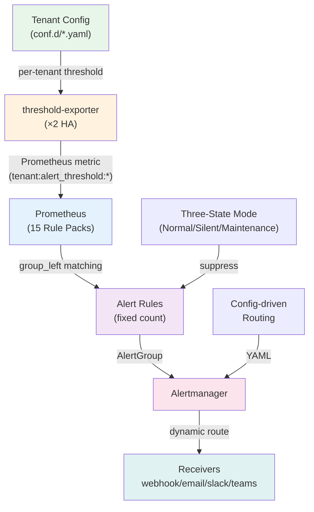

# Dynamic Alerting Platform

<!-- This is the MkDocs site homepage (EN). For the GitHub repo README, see ../README.en.md -->

<!-- Language switcher is provided by mkdocs-static-i18n header. -->

Config-driven multi-tenant alerting for Prometheus. Rule count stays fixed at O(M) regardless of tenant count — tenants write YAML, not PromQL.

> **100 tenants: 5,000 hand-written rules → 237 fixed rules.** New tenant onboarding in minutes, changes take effect in seconds.

---

## Quick Start by Role

<div class="grid cards" markdown>

- **:material-rocket: Platform Engineers**

    Deploy & operate the platform. [**Get Started →**](getting-started/for-platform-engineers.md)

    HA architecture, Helm integration, Prometheus/Alertmanager routing.

- **:material-database: Domain Experts**

    Define monitoring standards. [**Get Started →**](getting-started/for-domain-experts.md)

    Rule packs, baseline discovery, custom governance.

- **:material-account-multiple: Tenants**

    Onboard & configure thresholds. [**Get Started →**](getting-started/for-tenants.md)

    `da-tools scaffold`, YAML config, zero PromQL.

</div>

Not sure which role? Try the [Getting Started Wizard](https://vencil.github.io/Dynamic-Alerting-Integrations/assets/jsx-loader.html?component=../getting-started/wizard.jsx).

---

## How It Works

=== "Traditional (❌)"

    ```yaml
    # Each tenant = separate rule — 100 tenants × 50 rules = 5,000 expressions
    - alert: MySQLHighConnections_db-a
      expr: mysql_global_status_threads_connected{namespace="db-a"} > 100
    - alert: MySQLHighConnections_db-b
      expr: mysql_global_status_threads_connected{namespace="db-b"} > 80
    # ... repeat for every tenant
    ```

=== "Dynamic Alerting (✅)"

    ```yaml
    # 1 rule covers all tenants via group_left matching
    - alert: MariaDBHighConnections
      expr: |
        tenant:mysql_threads_connected:max
        > on(tenant) group_left
        tenant:alert_threshold:connections

    # Tenants declare thresholds only (YAML, no PromQL):
    tenants:
      db-a: { mysql_connections: "100" }
      db-b: { mysql_connections: "80" }
    ```

---

## Architecture



For detailed architecture, see [Architecture & Design](architecture-and-design.md). For performance data, see [Benchmarks](benchmarks.md).

---

## Key Metrics

| Metric | Traditional (100 tenants) | Dynamic Alerting |
|--------|--------------------------|-----------------|
| Rule count | 5,000+ (grows linearly) | 237 (fixed, O(M)) |
| New tenant onboarding | 1–3 days | < 5 minutes |
| Prometheus memory | ~600MB+ | ~154MB |
| Rule evaluation time | Grows linearly | 60ms (2 or 102 tenants) |
| Tenant knowledge required | PromQL + Alertmanager config | YAML threshold values |

---

## Platform Capabilities

**Rule Engine:** O(M) complexity via `group_left` · 15 Rule Pack Projected Volumes · Severity Dedup via Alertmanager Inhibit ([ADR-001](adr/001-severity-dedup-via-inhibit.md))

**Tenant Management:** Tri-state mode (Normal/Silent/Maintenance) · Four-layer routing merge ([ADR-007](adr/007-cross-domain-routing-profiles.md)) · Scheduled thresholds & maintenance windows · Schema validation · Cardinality Guard

**Toolchain:** `da-tools` CLI (scaffold → migrate → validate → cutover → diagnose) · [CLI Reference](cli-reference.md) · [Cheat Sheet](cheat-sheet.md)

**Deployment Tiers:** Tier 1 (Git-Native / GitOps) or Tier 2 (Portal + API with RBAC). See [root README](https://github.com/vencil/Dynamic-Alerting-Integrations/blob/main/README.en.md#deployment-tiers) for comparison.

---

## Documentation Map

| Document | For | Topic |
|----------|-----|-------|
| [Architecture & Design](architecture-and-design.md) | Platform Engineers | Core design, HA, Rule Packs |
| [Migration Guide](migration-guide.md) | DevOps, Tenants | Onboarding flow, AST engine |
| [Governance & Security](governance-security.md) | Compliance, Leads | Three-layer governance, audit |
| [Benchmarks](benchmarks.md) | Platform Engineers | Performance data & methodology |
| Integration guides | Platform Engineers | [BYO Prometheus](byo-prometheus-integration.md) · [BYO Alertmanager](byo-alertmanager-integration.md) · [Federation](federation-integration.md) · [GitOps](gitops-deployment.md) · [VCS](vcs-integration-guide.md) |
| [Rule Packs](rule-packs/README.md) | All | 15 packs + [Alert Reference](rule-packs/ALERT-REFERENCE.md) |
| [Scenarios](scenarios/) | All | 9 hands-on scenarios |
| [Troubleshooting](troubleshooting.md) | All | Common issues & solutions |

Full doc map: [doc-map.md](internal/doc-map.md) · Tool map: [tool-map.md](internal/tool-map.md)
