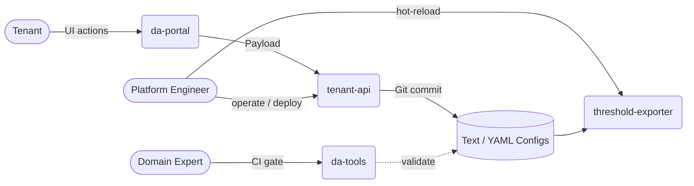

# Dynamic Alerting Platform

> **Language / 語言：** **English (Current)** | [中文](./index.md)

<!-- This is the MkDocs site homepage (EN). For the GitHub repo README, see ../README.en.md -->

<!-- Language switcher is provided by mkdocs-static-i18n header. -->

Config-driven multi-tenant alerting for Prometheus. Rule count stays fixed at O(M) regardless of tenant count — tenants write YAML, not PromQL.

> **100 tenants: 5,000 hand-written rules → 237 fixed rules.** New tenant onboarding in minutes, changes take effect in seconds.

---

## Try It Locally (No Kubernetes)

One command spins up the whole platform on your laptop — watch a real alert fire in ~1 minute. `⏱️ <1 min · 🟢 Docker only`. Full walkthrough: [`try-local/`](https://github.com/vencil/Dynamic-Alerting-Integrations/blob/main/try-local/README.md).

> **Collaboration loop:** Tenants raise changes via `da-portal` → Platform Engineers land them safely as Git / plain text → Domain Experts guard the monitoring budget (cardinality) with `da-tools` in CI.

Which one to try? **Tenant → da-portal** · **Platform Engineer → tenant-api + threshold-exporter** · **Domain Expert → da-tools**

---

## Quick Start by Role

- **:material-rocket: Platform Engineers**

    Deploy & operate the platform. [**Get Started →**](getting-started/for-platform-engineers.en.md)

    HA architecture, Helm integration, Prometheus/Alertmanager routing.

- **:material-database: Domain Experts**

    Define monitoring standards. [**Get Started →**](getting-started/for-domain-experts.en.md)

    Rule packs, baseline discovery, custom governance.

- **:material-account-multiple: Tenants**

    Onboard & configure thresholds. [**Get Started →**](getting-started/for-tenants.en.md)

    `da-tools scaffold`, YAML config, zero PromQL.

Not sure which role? Try the [Getting Started Wizard](https://vencil.github.io/Dynamic-Alerting-Integrations/assets/jsx-loader.html?component=../getting-started/wizard.jsx).

---

## Why It's Different

The traditional approach needs one rule set per tenant (100 tenants × 50 rules = 5,000 expressions). This platform uses Prometheus `group_left` vector matching, so **a single rule covers every tenant and the rule count stays fixed regardless of tenant count** — tenants declare YAML thresholds only, zero PromQL.

- **How it works & before/after comparison** → [Architecture & Design](architecture-and-design.en.md)
- **Performance data** (rule evaluation flat at 60ms regardless of tenant count, memory profile) → [Benchmarks](benchmarks.en.md)
- **Full metrics table, platform capabilities & design decisions (ADRs)** → [Architecture & Design](architecture-and-design.en.md) · [GitHub README](https://github.com/vencil/Dynamic-Alerting-Integrations/blob/main/README.en.md#platform-capabilities)

---

## Documentation Map

| Document | For | Topic |
|----------|-----|-------|
| [Architecture & Design](architecture-and-design.en.md) | Platform Engineers | Core design, HA, Rule Packs |
| [Migration Guide](migration-guide.en.md) | DevOps, Tenants | Onboarding flow, AST engine |
| [Governance & Security](governance-security.en.md) | Compliance, Leads | Three-layer governance, audit |
| [Benchmarks](benchmarks.en.md) | Platform Engineers | Performance data & methodology |
| Integration guides | Platform Engineers | [BYO Prometheus](integration/byo-prometheus-integration.en.md) · [BYO Alertmanager](integration/byo-alertmanager-integration.en.md) · [Federation](integration/federation-integration.en.md) · [GitOps](integration/gitops-deployment.en.md) · [VCS](vcs-integration-guide.md) |
| [Rule Packs](rule-packs/README.md) | All | 16 packs + [Alert Reference](rule-packs/ALERT-REFERENCE.md) |
| [Scenarios](scenarios/) | All | 9 hands-on scenarios |
| [Troubleshooting](troubleshooting.en.md) | All | Common issues & solutions |

Full doc map: [doc-map.md](internal/doc-map.en.md) · Tool map: [tool-map.md](internal/tool-map.en.md)
