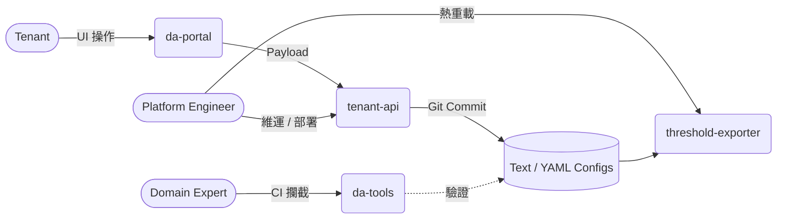

# Dynamic Alerting Platform

> **Language / 語言：** **中文 (Current)** | [English](./index.en.md)

<!-- 這是 MkDocs 站台首頁。GitHub repo README 見 ../README.md -->

<!-- Language switcher is provided by mkdocs-static-i18n header. -->

Config-driven 多租戶告警平台，基於 Prometheus `group_left` 向量匹配。規則數量固定為 O(M)，不隨租戶數增長——租戶只寫 YAML，不碰 PromQL。

> **100 租戶：5,000 條手寫規則 → 237 條固定規則。** 新租戶分鐘級導入，變更秒級生效。

---

## 一鍵試用（不需 Kubernetes）

一行指令把整套平台跑在筆電上，~1 分鐘看到真實告警紅燈 —— `⏱️ <1 min · 🟢 只需 Docker`。完整 walkthrough：[`try-local/`](https://github.com/vencil/Dynamic-Alerting-Integrations/blob/main/try-local/README.md)。

> **協作閉環**：Tenant 透過 `da-portal` 發起變更 → Platform Engineer 以 Git / 純文字安全落地 → Domain Expert 用 `da-tools` 在 CI 守監控預算（cardinality budget）。

想試哪個？**Tenant → da-portal** · **Platform Engineer → tenant-api + threshold-exporter** · **Domain Expert → da-tools**

---

## 按角色快速入門

- **:material-rocket: Platform Engineer**

    部署與運維平台。[**開始 →**](getting-started/for-platform-engineers.md)

    HA 架構、Helm 整合、Prometheus/Alertmanager 路由。

- **:material-database: Domain Expert**

    定義監控標準。[**開始 →**](getting-started/for-domain-experts.md)

    Rule Pack、基線探索、客製化治理。

- **:material-account-multiple: Tenant**

    導入並配置閾值。[**開始 →**](getting-started/for-tenants.md)

    `da-tools scaffold`、YAML 配置、零 PromQL。

不確定角色？試試 [Getting Started Wizard](https://vencil.github.io/Dynamic-Alerting-Integrations/assets/jsx-loader.html?component=../getting-started/wizard.jsx)。

---

## 為什麼不一樣

傳統做法每個租戶一套規則（100 租戶 × 50 規則 = 5,000 條表達式）；本平台以 Prometheus `group_left` 向量匹配，**單一規則覆蓋所有租戶、規則數固定不隨租戶數增長**，租戶只宣告 YAML 閾值、零 PromQL。

- **運作原理與 before/after 對比** → [架構與設計](architecture-and-design.md)
- **效能數據**（規則評估 60ms 不隨租戶數變、記憶體 profile）→ [基準測試](benchmarks.md)
- **完整核心指標表、平台能力與設計決策（ADR）** → [架構與設計](architecture-and-design.md) · [GitHub README](https://github.com/vencil/Dynamic-Alerting-Integrations/blob/main/README.md#平台能力)

---

## 文件導覽

| 文件 | 適用角色 | 主題 |
|------|---------|------|
| [架構與設計](architecture-and-design.md) | Platform Engineer | 核心設計、HA、Rule Pack |
| [遷移指南](migration-guide.md) | DevOps, Tenant | 導入流程、AST 引擎 |
| [治理與安全](governance-security.md) | 合規、主管 | 三層治理模型、審計 |
| [基準測試](benchmarks.md) | Platform Engineer | 效能數據與方法論 |
| 告警最佳實務系列 | SRE, Domain Expert, Tenant | [設計入門](alerting-design-fundamentals.md)（該對什麼告警） · [動作與冪等](alerting-best-practices.md)（響了之後的動作及格嗎） |
| 整合指南 | Platform Engineer | [BYO Prometheus](integration/byo-prometheus-integration.md) · [BYO Alertmanager](integration/byo-alertmanager-integration.md) · [Federation](integration/federation-integration.md) · [GitOps](integration/gitops-deployment.md) · [VCS](vcs-integration-guide.md) |
| [Rule Packs](rule-packs/README.md) | All | 16 個規則包 + [Alert 速查](rule-packs/ALERT-REFERENCE.md) |
| [場景指南](scenarios/) | All | 9 個實戰場景 |
| [疑難排解](troubleshooting.md) | All | 常見問題與解法 |

完整文件對照表：[doc-map.md](internal/doc-map.md) · 工具表：[tool-map.md](internal/tool-map.md)
