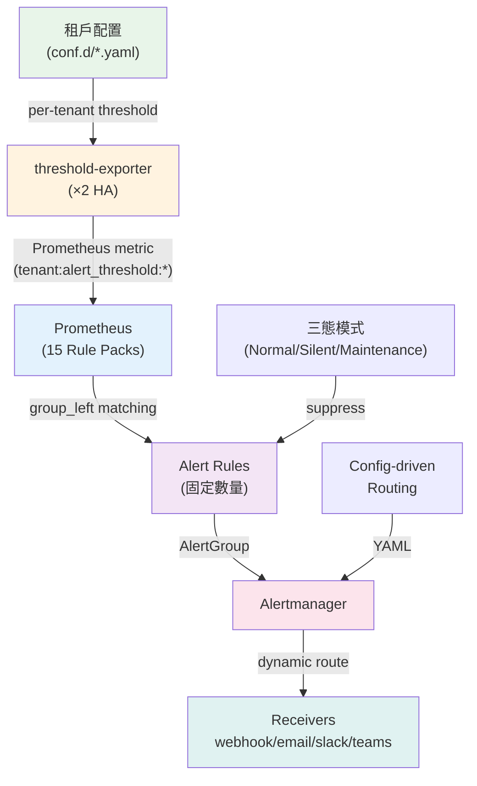

# Dynamic Alerting Platform

> **Language / 語言：** **中文 (Current)** | [English](./index.en.md)

<!-- 這是 MkDocs 站台首頁。GitHub repo README 見 ../README.md -->

<!-- Language switcher is provided by mkdocs-static-i18n header. -->

Config-driven 多租戶告警平台，基於 Prometheus `group_left` 向量匹配。規則數量固定為 O(M)，不隨租戶數增長——租戶只寫 YAML，不碰 PromQL。

> **100 租戶：5,000 條手寫規則 → 237 條固定規則。** 新租戶分鐘級導入，變更秒級生效。

---

## 按角色快速入門

<div class="grid cards" markdown>

- **:material-rocket: Platform Engineer**

    部署與運維平台。[**開始 →**](getting-started/for-platform-engineers.md)

    HA 架構、Helm 整合、Prometheus/Alertmanager 路由。

- **:material-database: Domain Expert**

    定義監控標準。[**開始 →**](getting-started/for-domain-experts.md)

    Rule Pack、基線探索、客製化治理。

- **:material-account-multiple: Tenant**

    導入並配置閾值。[**開始 →**](getting-started/for-tenants.md)

    `da-tools scaffold`、YAML 配置、零 PromQL。

</div>

不確定角色？試試 [Getting Started Wizard](https://vencil.github.io/Dynamic-Alerting-Integrations/assets/jsx-loader.html?component=../getting-started/wizard.jsx)。

---

## 運作原理

=== "傳統做法 (❌)"

    ```yaml
    # 每個租戶 = 獨立規則 — 100 租戶 × 50 規則 = 5,000 條表達式
    - alert: MySQLHighConnections_db-a
      expr: mysql_global_status_threads_connected{namespace="db-a"} > 100
    - alert: MySQLHighConnections_db-b
      expr: mysql_global_status_threads_connected{namespace="db-b"} > 80
    # ... 每個租戶重複一次
    ```

=== "Dynamic Alerting (✅)"

    ```yaml
    # 1 條規則透過 group_left 匹配覆蓋所有租戶
    - alert: MariaDBHighConnections
      expr: |
        tenant:mysql_threads_connected:max
        > on(tenant) group_left
        tenant:alert_threshold:connections

    # 租戶只需宣告閾值（YAML，零 PromQL）：
    tenants:
      db-a: { mysql_connections: "100" }
      db-b: { mysql_connections: "80" }
    ```

---

## 架構總覽



詳細架構見 [架構與設計](architecture-and-design.md)。效能數據見 [基準測試](benchmarks.md)。

---

## 核心指標

| 指標 | 傳統方案（100 租戶） | Dynamic Alerting |
|------|---------------------|-----------------|
| 規則數量 | 5,000+（隨租戶線性增長） | 237（固定，O(M)） |
| 新租戶導入 | 1–3 天 | < 5 分鐘 |
| Prometheus 記憶體 | ~600MB+ | ~154MB |
| 規則評估時間 | 隨租戶線性增長 | 60ms（2 或 102 租戶皆同） |
| 租戶所需知識 | PromQL + Alertmanager 配置 | YAML 閾值設定 |

---

## 平台能力

**規則引擎：** O(M) 複雜度（`group_left` 向量匹配）· 15 個 Rule Pack Projected Volume 獨立部署 · Severity Dedup via Alertmanager Inhibit（[ADR-001](adr/001-severity-dedup-via-inhibit.md)）

**租戶管理：** 三態模式（Normal/Silent/Maintenance）· 四層路由合併（[ADR-007](adr/007-cross-domain-routing-profiles.md)）· 排程式閾值與維護窗口 · Schema Validation · Cardinality Guard

**工具鏈：** `da-tools` CLI（scaffold → migrate → validate → cutover → diagnose）· [CLI 參考](cli-reference.md) · [速查表](cheat-sheet.md)

**部署層級：** Tier 1（Git-Native / GitOps）或 Tier 2（Portal + API，含 RBAC）。對比詳見 [README](https://github.com/vencil/Dynamic-Alerting-Integrations/blob/main/README.md#部署層級)。

---

## 文件導覽

| 文件 | 適用角色 | 主題 |
|------|---------|------|
| [架構與設計](architecture-and-design.md) | Platform Engineer | 核心設計、HA、Rule Pack |
| [遷移指南](migration-guide.md) | DevOps, Tenant | 導入流程、AST 引擎 |
| [治理與安全](governance-security.md) | 合規、主管 | 三層治理模型、審計 |
| [基準測試](benchmarks.md) | Platform Engineer | 效能數據與方法論 |
| 整合指南 | Platform Engineer | [BYO Prometheus](integration/byo-prometheus-integration.md) · [BYO Alertmanager](integration/byo-alertmanager-integration.md) · [Federation](integration/federation-integration.md) · [GitOps](integration/gitops-deployment.md) · [VCS](vcs-integration-guide.md) |
| [Rule Packs](rule-packs/README.md) | All | 15 個規則包 + [Alert 速查](rule-packs/ALERT-REFERENCE.md) |
| [場景指南](scenarios/) | All | 9 個實戰場景 |
| [疑難排解](troubleshooting.md) | All | 常見問題與解法 |

完整文件對照表：[doc-map.md](internal/doc-map.md) · 工具表：[tool-map.md](internal/tool-map.md)
