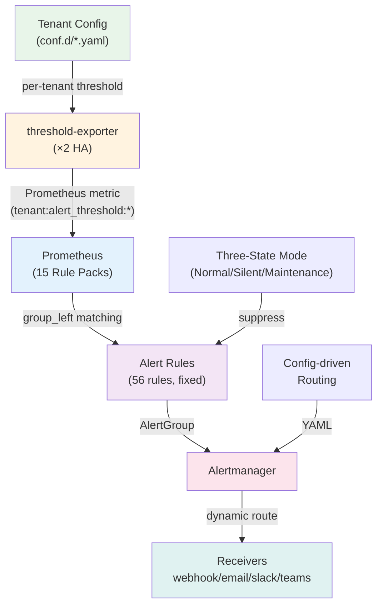

# Dynamic Alerting Platform

> **Language / 語言：** | **中文（當前）**

## Overview

**Enterprise-grade Multi-Tenant Dynamic Alerting Platform** — A config-driven, zero-PromQL threshold platform for Kubernetes with 15 pre-loaded rule packs, AST migration engine, end-to-end automation, three-state operations mode, and security guardrails.

### Key Highlights

- **Zero PromQL for Tenants**: YAML-only configuration, no complex query language
- **High Performance**: O(N×M) → O(M) complexity via `group_left` vector matching
- **15 Rule Packs**: Pre-built monitoring for MariaDB, PostgreSQL, Redis, Kafka, K8s, and more
- **Full Migration Automation**: Onboard → Scaffold → Shadow → Cutover → Health Report
- **Config-driven Routing**: Dynamic Alertmanager routes, receivers, and inhibitions
- **Three-State Operations**: Normal / Silent / Maintenance modes with auto-expiry
- **Security First**: SSRF policy, schema validation, cardinality guards
- **HA Deployment**: Multi-tenant, multi-namespace support with hot-reload

---

## Problems Solved

### Rule Explosion & Performance Bottleneck

**❌ Traditional Pain Points:**
- 100 tenants × 50 rules = 5,000 independent PromQL evaluations (every 15s)
- Prometheus CPU spikes, rule evaluation latency impacts SLA
- Each new tenant causes linear rule growth

**✅ Our Solution:**
- Dynamic thresholding with `group_left` vector matching
- Platform maintains **fixed M rules**, evaluates all tenant thresholds in **one pass**
- Complexity: O(N×M) → O(M)

=== "Traditional (❌)"

    ```yaml
    # Each tenant = separate rule
    - alert: MySQLHighConnections_db-a
      expr: mysql_global_status_threads_connected{namespace="db-a"} > 100
    - alert: MySQLHighConnections_db-b
      expr: mysql_global_status_threads_connected{namespace="db-b"} > 80
    # ... repeat for every tenant
    ```

=== "Dynamic (✅)"

    ```yaml
    # 1 rule covers all tenants
    - alert: MariaDBHighConnections
      expr: |
        tenant:mysql_threads_connected:max
        > on(tenant) group_left
        tenant:alert_threshold:connections
    ```

**Tenant Configuration (Zero PromQL):**

```yaml
# conf.d/db-a.yaml
tenants:
  db-a:
    mysql_connections: "100"
  db-b:
    mysql_connections: "80"
```

### Tenant Onboarding Friction

**❌ Traditional Pain Points:**
- Tenants must learn PromQL (`rate`, `sum by`, `group_left`)
- Single label typo = silent failure, no alert triggering
- Onboarding tool ecosystem scattered across repo
- Typical onboarding: 1-2 days with platform team assistance

**✅ Our Solution:**
- **Zero PromQL**: Tenants write YAML only (`mysql_connections: "80"`)
- **da-tools container**: All tooling encapsulated, `docker pull` ready to use
- **Interactive scaffold**: `da-tools scaffold` generates configuration interactively
- **Automated migration**: `da-tools migrate` converts legacy rules with auto-aggregation detection

```bash
# No clone needed — direct usage
docker run --rm -it ghcr.io/vencil/da-tools:v2.0.0 scaffold \
  --tenant my-app --db mariadb,redis
```

### Platform Maintenance & Deployment Complexity

**❌ Traditional Pain Points:**
- All rules in one giant ConfigMap = merge conflicts
- Emergency threshold adjustment: 2-4 hours to deploy
- Manual chart path + image tag alignment
- No hot-reload — every change requires Prometheus restart

**✅ Our Solution:**
- **15 independent Rule Pack ConfigMaps** mounted via Projected Volume
- **SHA-256 hot-reload** — no Prometheus restart
- **Directory mode** (`conf.d/`) per-tenant YAML files
- **OCI Helm chart** — single command deployment

```bash
# One-line deployment — no repo clone needed
helm install threshold-exporter \
  oci://ghcr.io/vencil/charts/threshold-exporter:2.0.0 \
  -n monitoring --create-namespace \
  -f values-override.yaml
```

### Alert Fatigue

**❌ Traditional Pain Points:**
- Maintenance window = alert storm (dozens of duplicate alerts)
- Non-critical Redis queue alert wakes up on-call at 3 AM
- Warning + Critical for same issue = two notifications
- Result: on-call mutes channel → real P0 gets buried

**✅ Our Solution:**
- **Maintenance Mode** (`_state_maintenance: enable`)
- **Scheduled Maintenance Windows** (cron + duration → auto-silence)
- **Multi-tier Severity** with **Auto-Suppression** (Critical mutes Warning)
- **Dimension-level Thresholds** (e.g., `redis_queue_length{queue="email"}: 1000`)
- **Scheduled Thresholds** (auto-adjust for business hours vs. night)

### Governance & Audit Trail

**❌ Traditional Pain Points:**
- Who changed what threshold? No audit trail
- No separation of concerns — anyone can modify global rules
- Hand-slip = impact all tenants

**✅ Our Solution:**
- **Per-tenant YAML in Git** = native audit trail
- **Three-Layer Governance**: Platform Defaults → Domain Standards → Tenant Customization
- **RBAC via Git permissions**
- **CI linting** ensures compliance

### Legacy Rule Migration Risk

**❌ Traditional Pain Points:**
- Hundreds of hand-written PromQL rules can't auto-convert
- Manual migration takes weeks, error-prone
- Big-bang cutover risk = monitoring blind spot

**✅ Our Solution:**
- **AST Migration Engine** (`promql-parser` Rust PyO3 bindings)
- **Shadow Monitoring**: Parallel validation (≤5% tolerance)
- **Triage Mode**: CSV classification for each rule
- **Zero-risk incremental cutover**

### Dimension-Level Control

**❌ Traditional Pain Points:**
- Oracle DBA needs 85% for `USERS` tablespace, 95% for `SYSTEM`
- N dimensions = N rules → rule explosion again

**✅ Our Solution:**
- **Regex Dimension Thresholds**: Support `=~` operator in YAML
- Exporter outputs `_re` label suffix for regex pattern matching
- Recording rules complete matching in PromQL — **tenants still write zero PromQL**

```yaml
# Tenant config (no PromQL needed)
tenants:
  dba-oracle:
    tablespace_usage_pct:
      - condition: 'tablespace=~"SYS.*"'
        threshold: "95"
      - condition: 'tablespace=~"USR.*"'
        threshold: "85"
```

---

## Enterprise Value Proposition

| Value | Solves | Mechanism | Verification |
|-------|--------|-----------|--------------|
| **End-to-End Migration Automation** | Legacy rules → weeks of analysis, risky cutover | Onboard → Scaffold → Shadow → Auto-Convergence → Health Report | `da-tools validate --auto-detect-convergence` |
| **Change Confidence Guarantee** | Unknown blast radius, PR review is manual | `--diff` preview + 7-day backtesting with risk scoring | `da-tools patch-config --diff db-a mysql_connections 50` |
| **Alert Fatigue → Zero** | Maintenance alerts + duplicate notifications | Auto-Suppression + Maintenance Mode + Scheduled Silence + Scheduled Thresholds | `make demo-full` < 5 min verification |
| **Low Adoption Cost** | Tenants learn PromQL (days), manual version sync | OCI Helm (one-line), `da-tools` container (20+ CLI tools) | `docker run ghcr.io/vencil/da-tools:v2.0.0 scaffold` |
| **Governance & Compliance** | No audit trail, no RBAC | Per-tenant YAML in Git + CI linting + three-layer model | Git history = audit log |
| **Performance at Scale** | 200+ tenants → Prometheus overload | Dynamic thresholding O(M), Projected Volume 15 packs | Benchmark: 56 rules, ~20ms/cycle vs. 5,600 rules @ 800ms+ |

---

## Quick Start by Role

<div class="grid cards" markdown>

- **:material-rocket: Platform Engineers**

    Deploy & operate the platform. [**Get Started →**](getting-started/for-platform-engineers.md)

    Learn HA architecture, Helm integration, Prometheus/Alertmanager routing.

- **:material-database: Domain Experts**

    Define monitoring standards. [**Get Started →**](getting-started/for-domain-experts.md)

    Create rule packs, baseline discovery, custom governance.

- **:material-account-multiple: Tenants**

    Onboard & configure thresholds. [**Get Started →**](getting-started/for-tenants.md)

    Use `da-tools scaffold`, manage YAML, zero PromQL.

</div>

---

## Architecture at a Glance



---

## Key Components

### threshold-exporter

- **Port**: 8080
- **Mode**: Config-driven YAML input → Prometheus metrics output
- **Features**: Multi-tenant support, hot-reload (SHA-256), three-state mode
- **Deployment**: Helm OCI chart, 2× HA pods

### Prometheus Rules

- **15 Rule Packs**: MariaDB, PostgreSQL, Redis, Kafka, K8s, JVM, Nginx, MongoDB, Elasticsearch, Oracle, DB2, ClickHouse, RabbitMQ, Operational, Custom
- **Optional Carve-out**: Unused rule packs have near-zero cost (Projected Volume)
- **Recording Rules**: Auto-generate per-tenant threshold metrics
- **Alerting Rules**: Fixed set (56) matched against all tenant thresholds

### Alertmanager

- **Dynamic Configuration**: Generated from tenant YAML
- **Config Reload Sidecar**: Automatic hot-reload on ConfigMap change
- **Multi-tenant Routing**: Per-tenant channels + platform enforced NOC routing
- **Inhibit Rules**: Deduplication, auto-suppression for multi-tier severity

### da-tools

- **20+ CLI Tools**: scaffold, migrate, diagnose, backtest, onboard, etc.
- **Distribution**: OCI container (`ghcr.io/vencil/da-tools:v2.0.0`)
- **No Local Setup**: `docker pull` → ready to use

---

## Documentation Map

| Document | For | Learn |
|----------|-----|-------|
| [Architecture & Design](architecture-and-design.md) | Platform Engineers, SREs | System design, HA, roadmap |
| [Migration Guide](migration-guide.md) | DevOps, Tenants | Step-by-step onboarding |
| [Governance & Security](governance-security.md) | Platform Leads, Compliance | Three-layer governance, audit |
| [Performance Benchmarks](benchmarks.md) | Platform Engineers | Idle, scaling, routing, reload |
| [BYO Prometheus](byo-prometheus-integration.md) | Platform Engineers | Minimal integration for existing Prometheus |
| [BYO Alertmanager](byo-alertmanager-integration.md) | Platform Engineers | Alertmanager integration guide |
| [GitOps Deployment](gitops-deployment.md) | DevOps | ArgoCD/Flux + RBAC patterns |
| [Rule Packs Reference](rule-packs/README.md) | All | 15 rule packs + optional carve-out |
| [Alert Reference](rule-packs/ALERT-REFERENCE.md) | Tenants, SREs | 96 alerts + remediation guide |
| [Troubleshooting](troubleshooting.md) | All | Common issues & solutions |

---

## Platform Comparison

| Feature | Traditional | Dynamic Alerting |
|---------|------------|------------------|
| **Rules per 100 tenants** | 5,600+ (5,000 user + 600 base) | 56 (fixed) |
| **PromQL for Tenants** | Required | Zero — YAML only |
| **Rule Eval Time** | ~800ms+ (linear) | ~20ms (fixed) |
| **Deployment** | Clone repo + manual chart sync | OCI Helm one-line |
| **Onboarding Time** | 1-2 days | <1 hour (scaffold + docs) |
| **Threshold Changes** | 2-4 hours (PR → review → deploy) | 5 min (patch → hot-reload) |
| **Audit Trail** | Slack history | Git commits + RBAC |
| **Governance** | Informal | Three-layer model |
| **Migration Risk** | High (big-bang) | Low (shadow + validation) |

---

## Getting Help

- **Issues & Questions**: [GitHub Issues](https://github.com/vencil/Dynamic-Alerting-Integrations/issues)
- **Discussions**: [GitHub Discussions](https://github.com/vencil/Dynamic-Alerting-Integrations/discussions)
- **Documentation**: [Full Site Map](#documentation-map) above
- **Playbooks**: See `docs/internal/` for operational procedures

---

## License

Apache License 2.0 — See [LICENSE](../LICENSE) in the repository.

## 相關資源

| 資源 | 相關性 |
|------|--------|
| ["文件導覽"](index.md) | ⭐⭐ |
