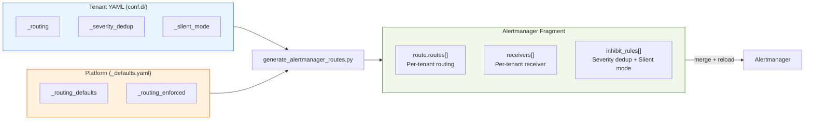

# BYO Alertmanager Integration Guide

> **Language / 語言：** **English (Current)** | [中文](byo-alertmanager-integration.md)
>
> **Version**: 
> **Audience**: Platform Engineers, SREs
> **Prerequisites**: [BYO Prometheus Integration Guide](byo-prometheus-integration.en.md)

---

## 1. Overview

The four root causes of alert fatigue and their corresponding solutions:

| Root Cause | Solution | Mechanism | Config Source |
|------|------|------|----------|
| False positive storms during backup/maintenance | **Silent Mode** | Sentinel alert → inhibit_rules block notifications (TSDB preserves records) | `_silent_mode` |
| Scheduled maintenance forgotten to disable | **Maintenance Mode** | Complete alert suppression at PromQL layer (supports `expires` auto-expiry) | `_state_maintenance` |
| Warning + Critical duplicate alerts | **Severity Dedup** | Per-tenant inhibit_rules (`metric_group` pairing) | `_severity_dedup` |
| Notification destination hardcoded centrally | **Alert Routing** | Per-tenant route + receiver (6 types) | `_routing` |

Both Silent Mode and Maintenance Mode support structured object configuration, including `expires` (ISO 8601) auto-expiry and `reason` field to prevent "set and forget".

All Alertmanager configuration fragments are automatically generated from tenant YAML by `generate_alertmanager_routes.py`:



---

## 2. Integration Steps

### Step 1: Enable Alertmanager Lifecycle API

Add the `--web.enable-lifecycle` flag to the Alertmanager deployment:

```yaml
args:
  - "--config.file=/etc/alertmanager/alertmanager.yml"
  - "--storage.path=/alertmanager"
  - "--web.enable-lifecycle"
```

Verify:

```bash
kubectl port-forward svc/alertmanager 9093:9093 -n monitoring &
curl -sf http://localhost:9093/-/ready && echo "OK"
```

### Step 2: Ensure Prometheus is Connected to Alertmanager

```yaml
# prometheus.yml
alerting:
  alertmanagers:
    - static_configs:
        - targets:
            - "alertmanager.monitoring.svc.cluster.local:9093"
```

### Step 3: Configure Tenant Routing Config

Define the `_routing` section in tenant YAML :

```yaml
# conf.d/db-a.yaml
tenants:
  db-a:
    mysql_connections: "70"
    _routing:
      receiver:
        type: "webhook"
        url: "https://webhook.example.com/alerts"
      group_by: ["alertname", "severity"]
      group_wait: "30s"
      repeat_interval: "4h"
```

### Step 4: Generate Alertmanager Fragment

```bash
# Generate fragment
da-tools generate-routes --config-dir conf.d/ -o alertmanager-routes.yaml

# Verify output
da-tools generate-routes --config-dir conf.d/ --validate

# Validate + webhook domain allowlist check
da-tools generate-routes --config-dir conf.d/ --validate --policy .github/custom-rule-policy.yaml
```

Generated output includes:
- `route.routes[]`: Per-tenant routing (with `tenant="<name>"` matcher + timing guardrails)
- `receivers[]`: Per-tenant receiver (webhook/email/slack/teams/rocketchat/pagerduty)
- `inhibit_rules[]`: Per-tenant severity dedup rules

### Step 5: Merge into Alertmanager ConfigMap

Merge the generated fragment into the Alertmanager main configuration. **Choose one of two modes based on your deployment flow:**

**Mode A: `--apply` (Runtime direct operation, v1.4.0)**

```bash
# One-shot automatic merge + apply + reload
da-tools generate-routes --config-dir conf.d/ --apply --yes
```

Best for: Initial deployment testing, P0 emergency fixes, non-GitOps environments.

**Mode B: `--output-configmap` (GitOps PR flow, v1.10.0)**

```bash
# Generate complete ConfigMap YAML (with global + default route/receiver + tenant routes)
da-tools generate-routes --config-dir conf.d/ --output-configmap -o deploy/alertmanager-configmap.yaml

# With custom base configuration
da-tools generate-routes --config-dir conf.d/ --output-configmap \
  --base-config conf.d/base-alertmanager.yaml -o deploy/alertmanager-configmap.yaml

# File into Git → PR review → merge → ArgoCD/Flux auto sync
git add deploy/alertmanager-configmap.yaml && git commit -m "update AM routes"
```

Best for: Formal GitOps workflow. The generated ConfigMap YAML is in complete `kubectl apply` format, no manual merge needed. When `--base-config` is not provided, built-in defaults are used (`resolve_timeout: 5m`, `group_by: [alertname, tenant]`, default receiver).

**Mode Comparison:**

| | `--apply` | `--output-configmap` |
|---|-----------|---------------------|
| Operation | Direct K8s ConfigMap modification | Output YAML file |
| Workflow | CLI manual operation / emergency fix | Git PR → review → GitOps sync |
| Requires K8s connection | Yes (kubectl context) | No (pure file output) |
| Alertmanager reload | `--apply` triggers automatically | Triggered by sidecar/webhook after GitOps sync |
| Auditability | No Git record | Complete Git history |

> **Note**: `--apply` and `--output-configmap` are mutually exclusive and cannot be used simultaneously.

### Step 6: Reload Alertmanager

```bash
# HTTP reload (requires Step 1's --web.enable-lifecycle)
curl -X POST http://localhost:9093/-/reload

# Verify reload success
curl -sf http://localhost:9093/-/ready && echo "Alertmanager ready"
```

---

## 3. generate_alertmanager_routes.py Tool

### Features

Reads all tenant YAML from `conf.d/`, scans `_routing` and `_severity_dedup` settings, generates valid Alertmanager YAML fragment.

### Modes

| Flag | Description |
|------|------|
| `--dry-run` | Output to stdout, no file write |
| `-o FILE` | Write to specified file |
| `--validate` | Validate configuration legality (exit 0/1, suitable for CI) |
| `--policy FILE` | Load `allowed_domains` for webhook URL compliance check |
| `--apply [--yes]` | Auto merge into Alertmanager ConfigMap + reload (`--yes` skips confirmation) |
| `--output-configmap` | Output complete ConfigMap YAML (mutually exclusive with `--apply`), suitable for GitOps PR flow  |
| `--base-config FILE` | With `--output-configmap`, load base Alertmanager config (global / default receiver, etc.) |

### Timing Guardrails

Platform-enforced timing ranges, automatically clamped when exceeded:

| Parameter | Minimum | Maximum | Default |
|------|--------|--------|--------|
| `group_wait` | 5s | 5m | 30s |
| `group_interval` | 5s | 5m | 5m |
| `repeat_interval` | 1m | 72h | 4h |

---

## 4. Dynamic Reload

### Mechanism

v1.3.0 implements HTTP reload via Alertmanager's native `--web.enable-lifecycle` flag:

```bash
# After ConfigMap update
curl -X POST http://alertmanager:9093/-/reload
```

### Automation Options

| Solution | Description | Use Case |
|------|------|----------|
| **HTTP reload** | `curl -X POST /-/reload`  | Minimal intrusion, suitable for self-managed Alertmanager |
| **ConfigMap Watcher Sidecar** | Similar to `prometheus-config-reloader` | Fully automatic, suitable for production |
| **CI Pipeline Integration** | GitOps: `generate-routes --validate` + apply + reload | Suitable for GitOps workflow |
| **GitOps ConfigMap Output** | `generate-routes --output-configmap` outputs complete ConfigMap YAML into Git PR flow | v1.10.0+, replaces `--apply` direct manipulation |
| **Alertmanager Operator** | `kube-prometheus-stack`'s AlertmanagerConfig CRD | Suitable for environments already using Operator |

---

## 5. Receiver Types

v1.4.0 supports six receiver types. Webhook example:

```yaml
_routing:
  receiver:
    type: "webhook"
    url: "https://webhook.example.com/alerts"
    send_resolved: true  # optional: send resolved alerts
```

Quick reference for other five receiver types:

| Type | Required Fields | Example |
|------|-----------------|---------|
| **Email** | `to`, `smarthost`, `from` | `to: ["team@example.com"]`, `smarthost: "smtp.example.com:587"`, `from: "alertmanager@example.com"` |
| **Slack** | `api_url`, `channel` | `api_url: "https://hooks.slack.com/..."`, `channel: "#alerts"` |
| **Microsoft Teams** | `webhook_url` | `webhook_url: "https://outlook.office.com/webhook/..."` |
| **Rocket.Chat** | `url`, `channel`, `username` | `url: "https://chat.example.com/hooks/xxx/yyy"` |
| **PagerDuty** | `service_key`, `severity`, `client` | `service_key: "key-123"`, `severity: "critical"` |

All types support `send_resolved: true` (default false) to control if resolved alerts are sent.

### Message Templates (Go Template)

Slack, Teams, and Email `title` / `text` / `html` fields support Alertmanager Go template syntax. Slack example:

```yaml
_routing:
  receiver:
    type: "slack"
    api_url: "https://hooks.slack.com/services/..."
    channel: "#db-alerts"
    title: '{{ .Status | toUpper }}: {{ .CommonLabels.alertname }}'
    text: >-
      *Tenant*: {{ .CommonLabels.tenant }}
      *Severity*: {{ .CommonLabels.severity }}
      {{ range .Alerts }}
        - {{ .Annotations.summary }}
      {{ end }}
```

Email and Teams use the same Go template syntax, only field names differ:
- Email: `html` field (HTML format)
- Teams: `text` field (Markdown format)

**Available variables:** `.CommonLabels.alertname`, `.CommonLabels.tenant`, `.CommonLabels.severity`, `.CommonAnnotations.summary`, `.CommonAnnotations.description`, `.Status`, `.Alerts` (supports `{{ range }}` loop). See [Alertmanager official docs](https://prometheus.io/docs/alerting/latest/notifications/)

---

## 6. Verification Checklist

### Tool Verification

```bash
# 1. Generate fragment (dry-run preview)
da-tools generate-routes --config-dir /data/conf.d --dry-run

# 2. Validate configuration legality
da-tools generate-routes --config-dir /data/conf.d --validate

# 3. Check Alertmanager status
curl -sf http://localhost:9093/-/ready

# 4. View current alert status
curl -sf http://localhost:9093/api/v2/alerts | python3 -m json.tool
```

> **Automated verification**: `da-tools byo-check alertmanager` runs all the above Alertmanager verification items in one command.

### Functional Verification

--8<-- "docs/includes/verify-checklist.en.md"

**Alertmanager Integration Specific:**

- [ ] `generate-routes --validate` exits with code 0
- [ ] Alertmanager loads merged configuration without errors
- [ ] Silent/Maintenance `expires` auto-recover after expiry
- [ ] Severity Dedup enabled tenant's warning is suppressed when critical fires
- [ ] Custom routing tenant's alert reaches specified receiver
- [ ] Per-rule override alert reaches specified override receiver

---

## 7. Per-Rule Routing Overrides 

In advanced scenarios, certain specific alerts may need different routing strategies. The `_routing.overrides[]` in tenant YAML supports per-alertname or per-metric_group custom receiver specification:

### Configuration Example

```yaml
# conf.d/db-a.yaml
tenants:
  db-a:
    mysql_connections: "70"
    _routing:
      receiver:
        type: "slack"
        api_url: "https://hooks.slack.com/services/../default"
        channel: "#db-alerts"

      # Routing overrides for specific alerts
      overrides:
        - alertname: "MariaDBHighConnections"
          receiver:
            type: "pagerduty"
            service_key: "urgency-key-123"

        - metric_group: "replication"
          receiver:
            type: "email"
            to: ["dba-team@example.com"]
```

### Priority

1. **Exact alertname match** — If `alertname` is specified, that alert uses the override receiver with priority
2. **Metric group match** — If `metric_group` is specified, alerts in that group use the override receiver
3. **Tenant default** — Without overrides, use tenant default receiver

`generate_alertmanager_routes.py` automatically expands overrides into Alertmanager's nested subroutes, ensuring priority is correctly applied.

---

## 8. Platform Enforced Routing 

Platform Team can configure enforced routing in `_defaults.yaml` to ensure NOC receives all tenant alerts (dual-track notification alongside tenant custom routing):

**Mode A: Unified NOC Reception**

```yaml
# conf.d/_defaults.yaml
_routing_enforced:
  enabled: true
  receiver:
    type: "webhook"
    url: "https://noc.example.com/alerts"
  match:
    severity: "critical"
```

**Mode B: Per-tenant Independent Channel **

When the receiver field contains `{{tenant}}` placeholder, the system automatically creates an independent enforced route for each tenant. Platform can use this to establish tenant-specific notification channels that tenants cannot reject or override:

```yaml
# conf.d/_defaults.yaml
_routing_enforced:
  enabled: true
  receiver:
    type: "slack"
    api_url: "https://hooks.slack.com/services/T/B/x"
    channel: "#alerts-{{tenant}}"    # → #alerts-db-a, #alerts-db-b, ...
```

Mode A creates a single shared platform route; Mode B creates N per-tenant routes (each with `tenant="<name>"` matcher + `continue: true`). Disabled by default.

---

## 9. One-Shot Configuration Validation

v1.7.0 introduces `validate_config.py`, which validates YAML syntax, schema, routes, policy, custom rules, and version consistency in one check:

```bash
# One-shot validation
da-tools validate-config --config-dir conf.d/

# CI pipeline with JSON output + policy check
da-tools validate-config --config-dir conf.d/ --policy .github/custom-rule-policy.yaml --json
```

Recommended to run `validate-config` before `generate-routes --apply` to ensure configuration is complete and correct.

---

## 10. Scheduled Maintenance Windows (Advanced)

If tenant configuration includes `_state_maintenance.recurring[]` (cron + duration), `maintenance_scheduler.py` can automatically create Alertmanager silences via CronJob. This tool calls the Alertmanager `/api/v2/silences` API, so BYO environments must ensure:

- The CronJob Pod can reach the Alertmanager API endpoint (default `http://alertmanager:9093`)
- Alertmanager has API v2 enabled (enabled by default, no additional configuration needed)

```bash
# Invoked periodically by CronJob
da-tools maintenance-scheduler --config-dir conf.d/ --alertmanager http://alertmanager:9093
```

The tool has built-in idempotency checks (no duplicate silence creation) and auto-extension (if existing silence expires before window ends, automatically extends). See [Shadow Monitoring SOP §8](../shadow-monitoring-sop.en.md) for maintenance window operation details.

---

## Alertmanager Operator Path

> Using Prometheus Operator's AlertmanagerConfig CRD? See the [Prometheus Operator Integration Guide](prometheus-operator-integration.en.md) for AlertmanagerConfig v1beta1 generation, validation, and migration guidance.

## Related Resources

| Resource | Relevance |
|----------|-----------|
| ["BYO Alertmanager 整合指南"](./byo-alertmanager-integration.md) | ⭐⭐⭐ |
| ["Bring Your Own Prometheus (BYOP) — Existing Monitoring Infrastructure Integration Guide"] | ⭐⭐⭐ |
| ["Threshold Exporter API Reference"](../api/README.en.md) | ⭐⭐ |
| ["Performance Analysis & Benchmarks"] | ⭐⭐ |
| ["da-tools CLI Reference"] | ⭐⭐ |
| ["Grafana Dashboard Guide"] | ⭐⭐ |
| ["Advanced Scenarios & Test Coverage"](../internal/test-coverage-matrix.md) | ⭐⭐ |
| ["Shadow Monitoring SRE SOP"] | ⭐⭐ |
