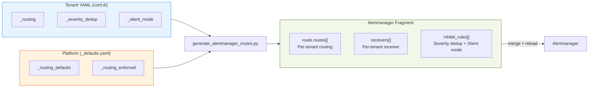

# BYO Alertmanager Integration Guide

> **Language / 語言：** **English (Current)** | [中文](byo-alertmanager-integration.md)
>
> **Version**: 
> **Audience**: Platform Engineers, SREs
> **Prerequisites**: [BYO Prometheus Integration Guide](byo-prometheus-integration.en.md)

---

## 1. Overview

The four root causes of alert fatigue and their corresponding solutions:

| Root Cause | Solution | Mechanism | Config Source |
|------|------|------|----------|
| False positive storms during backup/maintenance | **Silent Mode** | Sentinel alert → inhibit_rules block notifications (TSDB preserves records) | `_silent_mode` |
| Scheduled maintenance forgotten to disable | **Maintenance Mode** | Complete alert suppression at PromQL layer (supports `expires` auto-expiry) | `_state_maintenance` |
| Warning + Critical duplicate alerts | **Severity Dedup** | Per-tenant inhibit_rules (`metric_group` pairing) | `_severity_dedup` |
| Notification destination hardcoded centrally | **Alert Routing** | Per-tenant route + receiver (6 types) | `_routing` |

Both Silent Mode and Maintenance Mode support structured object configuration, including `expires` (ISO 8601) auto-expiry and `reason` field to prevent "set and forget".

> The table above is the **quick-reference view for the BYO integration context**. For the full alerting best practices (what to alert on → notification → action-layer idempotency), see the series: [Alert Design Fundamentals](../alerting-design-fundamentals.en.md) · [Beyond Actionable](../alerting-best-practices.en.md).

All Alertmanager configuration fragments are automatically generated from tenant YAML by `generate_alertmanager_routes.py`:


```mermaid
graph LR
    subgraph TY["Tenant YAML (conf.d/)"]
        R["_routing"]
        S["_severity_dedup"]
        SM["_silent_mode"]
    end

    subgraph PL["Platform (_defaults.yaml)"]
        RD["_routing_defaults"]
        RE["_routing_enforced"]
    end

    GEN["generate_alertmanager_routes.py"]

    TY --> GEN
    PL --> GEN

    subgraph AM["Alertmanager Fragment"]
        RT["route.routes[]<br/>Per-tenant routing"]
        RC["receivers[]<br/>Per-tenant receiver"]
        IR["inhibit_rules[]<br/>Severity dedup + Silent mode"]
    end

    GEN --> AM

    AM -->|"merge + reload"| ALM["Alertmanager"]

    style TY fill:#e8f4fd,stroke:#1a73e8
    style PL fill:#fff3e0,stroke:#e65100
    style AM fill:#f1f8e9,stroke:#33691e
```

---

## 2. Integration Steps

### Step 1: Confirm the Alertmanager Reload Endpoint Is Reachable

**No flag is required.** Alertmanager's `/-/reload` is enabled unconditionally (POST;
GET returns 405) — there is no switch for it.

```yaml
args:
  - "--config.file=/etc/alertmanager/alertmanager.yml"
  - "--storage.path=/alertmanager"
```

> ⛔ **Do NOT add `--web.enable-lifecycle`** (an earlier revision of this page said to;
> corrected in #1243). That flag belongs to **Prometheus**; Alertmanager does not have
> it, and v0.33.1 exits immediately with
> `alertmanager: error: unknown long flag '--web.enable-lifecycle'` — adding it means
> Alertmanager never starts.
>
> ⚠️ The flip side: because `/-/reload` cannot be turned off and carries **no
> authentication**, use a NetworkPolicy to keep **other pods** off port 9093, or front
> it with an auth proxy. ⛔ Mind where a NetworkPolicy actually applies: the sidecar
> talks to Alertmanager over loopback inside the same pod (shared network namespace),
> so that traffic never passes a NetworkPolicy — it governs pod-to-pod traffic and
> cannot admit "only this one container in this pod".
>
> ⚠️ The other half of the same misconception: **Alertmanager has no `/-/quit`
> either** (v0.33.1 returns 404 and keeps running) — that is also a Prometheus
> endpoint. `/-/reload` is the only thing exposed on this side.

Verify:

```bash
kubectl port-forward svc/alertmanager 9093:9093 -n monitoring &
curl -sf http://localhost:9093/-/ready && echo "ready OK"
# What this step actually has to prove is the reload path — a green /-/ready does
# not mean /-/reload is reachable:
curl -sf -X POST http://localhost:9093/-/reload && echo "reload OK"
```

### Step 2: Ensure Prometheus is Connected to Alertmanager

```yaml
# prometheus.yml
alerting:
  alertmanagers:
    - static_configs:
        - targets:
            - "alertmanager.monitoring.svc.cluster.local:9093"
```

### Step 3: Configure Tenant Routing Config

Define the `_routing` section in tenant YAML :

```yaml
# conf.d/db-a.yaml
tenants:
  db-a:
    mysql_connections: "70"
    _routing:
      receiver:
        type: "webhook"
        url: "https://webhook.example.com/alerts"
      group_by: ["alertname", "severity"]
      group_wait: "30s"
      repeat_interval: "4h"
```

### Step 4: Generate Alertmanager Fragment

```bash
# Generate fragment
da-tools generate-routes --config-dir conf.d/ -o alertmanager-routes.yaml

# Verify output
da-tools generate-routes --config-dir conf.d/ --validate

# Validate + webhook domain allowlist check
da-tools generate-routes --config-dir conf.d/ --validate --policy .github/custom-rule-policy.yaml
```

Generated output includes:
- `route.routes[]`: Per-tenant routing (with `tenant="<name>"` matcher + timing guardrails)
- `receivers[]`: Per-tenant receiver (webhook/email/slack/teams/rocketchat/pagerduty)
- `inhibit_rules[]`: Per-tenant severity dedup rules

### Step 5: Merge into Alertmanager ConfigMap

Merge the generated fragment into the Alertmanager main configuration. **Choose one of two modes based on your deployment flow:**

**Mode A: `--apply` (Runtime direct operation, v1.4.0)**

```bash
# One-shot automatic merge + apply + reload
da-tools generate-routes --config-dir conf.d/ --apply --yes
```

Best for: Initial deployment testing, P0 emergency fixes, non-GitOps environments.

**Mode B: `--output-configmap` (GitOps PR flow, v1.10.0)**

```bash
# Generate complete ConfigMap YAML (with global + default route/receiver + tenant routes)
da-tools generate-routes --config-dir conf.d/ --output-configmap -o deploy/alertmanager-configmap.yaml

# With custom base configuration
da-tools generate-routes --config-dir conf.d/ --output-configmap \
  --base-config conf.d/base-alertmanager.yaml -o deploy/alertmanager-configmap.yaml

# File into Git → PR review → merge → ArgoCD/Flux auto sync
git add deploy/alertmanager-configmap.yaml && git commit -m "update AM routes"
```

Best for: Formal GitOps workflow. The generated ConfigMap YAML is in complete `kubectl apply` format, no manual merge needed. When `--base-config` is not provided, built-in defaults are used (`resolve_timeout: 5m`, `group_by: [alertname, tenant]`, default receiver).

**Mode Comparison:**

| | `--apply` | `--output-configmap` |
|---|-----------|---------------------|
| Operation | Direct K8s ConfigMap modification | Output YAML file |
| Workflow | CLI manual operation / emergency fix | Git PR → review → GitOps sync |
| Requires K8s connection | Yes (kubectl context) | No (pure file output) |
| Alertmanager reload | `--apply` triggers automatically | Triggered by sidecar/webhook after GitOps sync |
| Auditability | No Git record | Complete Git history |

> **Note**: `--apply` and `--output-configmap` are mutually exclusive and cannot be used simultaneously.

### Step 6: Reload Alertmanager

```bash
# HTTP reload (Alertmanager exposes this endpoint unconditionally — no flag needed)
curl -X POST http://localhost:9093/-/reload

# Verify reload success
curl -sf http://localhost:9093/-/ready && echo "Alertmanager ready"
```

---

## 3. generate_alertmanager_routes.py Tool

### Features

Reads all tenant YAML from `conf.d/`, scans `_routing` and `_severity_dedup` settings, generates valid Alertmanager YAML fragment.

### Modes

| Flag | Description |
|------|------|
| `--dry-run` | Output to stdout, no file write |
| `-o FILE` | Write to specified file |
| `--validate` | Validate configuration legality (exit 0/1, suitable for CI) |
| `--policy FILE` | Load `allowed_domains` for webhook URL compliance check |
| `--apply [--yes]` | Auto merge into Alertmanager ConfigMap + reload (`--yes` skips confirmation) |
| `--output-configmap` | Output complete ConfigMap YAML (mutually exclusive with `--apply`), suitable for GitOps PR flow  |
| `--base-config FILE` | With `--output-configmap`, load base Alertmanager config (global / default receiver, etc.) |

### Timing Guardrails

Platform-enforced timing ranges, automatically clamped when exceeded:

| Parameter | Minimum | Maximum | Default |
|------|--------|--------|--------|
| `group_wait` | 5s | 5m | 30s |
| `group_interval` | 5s | 5m | 5m |
| `repeat_interval` | 1m | 72h | 4h |

---

## 4. Dynamic Reload

### Mechanism

HTTP reload works through Alertmanager's native, always-on `/-/reload` endpoint (no flag):

```bash
# After ConfigMap update
curl -X POST http://alertmanager:9093/-/reload
```

### Automation Options

| Solution | Description | Use Case |
|------|------|----------|
| **HTTP reload** | `curl -X POST /-/reload`  | Minimal intrusion, suitable for self-managed Alertmanager |
| **ConfigMap Watcher Sidecar** | Similar to `prometheus-config-reloader` | Fully automatic, suitable for production |
| **CI Pipeline Integration** | GitOps: `generate-routes --validate` + apply + reload | Suitable for GitOps workflow |
| **GitOps ConfigMap Output** | `generate-routes --output-configmap` outputs complete ConfigMap YAML into Git PR flow | v1.10.0+, replaces `--apply` direct manipulation |
| **Alertmanager Operator** | `kube-prometheus-stack`'s AlertmanagerConfig CRD | Suitable for environments already using Operator |

---

## 5. Receiver Types

v1.4.0 supports six receiver types. Webhook example:

```yaml
_routing:
  receiver:
    type: "webhook"
    url: "https://webhook.example.com/alerts"
    send_resolved: true  # optional: send resolved alerts
```

Quick reference for other five receiver types:

| Type | Required Fields | Example |
|------|-----------------|---------|
| **Email** | `to`, `smarthost`, `from` | `to: ["team@example.com"]`, `smarthost: "smtp.example.com:587"`, `from: "alertmanager@example.com"` |
| **Slack** | `api_url`, `channel` | `api_url: "https://hooks.slack.com/..."`, `channel: "#alerts"` |
| **Microsoft Teams** | `webhook_url` | `webhook_url: "https://outlook.office.com/webhook/..."` |
| **Rocket.Chat** | `url`, `channel`, `username` | `url: "https://chat.example.com/hooks/xxx/yyy"` |
| **PagerDuty** | `service_key`, `severity`, `client` | `service_key: "key-123"`, `severity: "critical"` |

All types support `send_resolved: true` (default false) to control if resolved alerts are sent.

### Message Templates (Go Template)

Slack, Teams, and Email `title` / `text` / `html` fields support Alertmanager Go template syntax. Slack example:

```yaml
_routing:
  receiver:
    type: "slack"
    api_url: "https://hooks.slack.com/services/..."
    channel: "#db-alerts"
    title: '{{ .Status | toUpper }}: {{ .CommonLabels.alertname }}'
    text: >-
      *Tenant*: {{ .CommonLabels.tenant }}
      *Severity*: {{ .CommonLabels.severity }}
      {{ range .Alerts }}
        - {{ .Annotations.summary }}
      {{ end }}
```

Email and Teams use the same Go template syntax, only field names differ:
- Email: `html` field (HTML format)
- Teams: `text` field (Markdown format)

**Available variables:** `.CommonLabels.alertname`, `.CommonLabels.tenant`, `.CommonLabels.severity`, `.CommonAnnotations.summary`, `.CommonAnnotations.description`, `.Status`, `.Alerts` (supports `{{ range }}` loop). See [Alertmanager official docs](https://prometheus.io/docs/alerting/latest/notifications/)

---

## 6. Verification Checklist

### Tool Verification

```bash
# 1. Generate fragment (dry-run preview)
da-tools generate-routes --config-dir /data/conf.d --dry-run

# 2. Validate configuration legality
da-tools generate-routes --config-dir /data/conf.d --validate

# 3. Check Alertmanager status
curl -sf http://localhost:9093/-/ready

# 4. View current alert status
curl -sf http://localhost:9093/api/v2/alerts | python3 -m json.tool
```

> **Automated verification**: `da-tools byo-check alertmanager` runs all the above Alertmanager verification items in one command.

### Functional Verification

--8<-- "docs/includes/verify-checklist.en.md"

**Alertmanager Integration Specific:**

- [ ] `generate-routes --validate` exits with code 0
- [ ] Alertmanager loads merged configuration without errors
- [ ] Silent/Maintenance `expires` auto-recover after expiry
- [ ] Severity Dedup enabled tenant's warning is suppressed when critical fires
- [ ] Custom routing tenant's alert reaches specified receiver
- [ ] Per-rule override alert reaches specified override receiver

---

## 7. Per-Rule Routing Overrides 

In advanced scenarios, certain specific alerts may need different routing strategies. The `_routing.overrides[]` in tenant YAML supports per-alertname or per-metric_group custom receiver specification:

### Configuration Example

```yaml
# conf.d/db-a.yaml
tenants:
  db-a:
    mysql_connections: "70"
    _routing:
      receiver:
        type: "slack"
        api_url: "https://hooks.slack.com/services/../default"
        channel: "#db-alerts"

      # Routing overrides for specific alerts
      overrides:
        - alertname: "MariaDBHighConnections"
          receiver:
            type: "pagerduty"
            service_key: "urgency-key-123"

        - metric_group: "replication"
          receiver:
            type: "email"
            to: ["dba-team@example.com"]
```

### Priority

1. **Exact alertname match** — If `alertname` is specified, that alert uses the override receiver with priority
2. **Metric group match** — If `metric_group` is specified, alerts in that group use the override receiver
3. **Tenant default** — Without overrides, use tenant default receiver

`generate_alertmanager_routes.py` automatically expands overrides into Alertmanager's nested subroutes, ensuring priority is correctly applied.

---

## 8. Platform Enforced Routing 

Platform Team can configure enforced routing in `_defaults.yaml` to ensure NOC receives all tenant alerts (dual-track notification alongside tenant custom routing):

**Mode A: Unified NOC Reception**

```yaml
# conf.d/_defaults.yaml
_routing_enforced:
  enabled: true
  receiver:
    type: "webhook"
    url: "https://noc.example.com/alerts"
  match:
    - 'severity="critical"'     # ⚠️ must be a LIST of matcher strings
```

> ⚠️ **`match` only accepts a list of matcher strings.** Written as a map (`match:` / `  severity: "critical"`) it is **silently discarded** by the `isinstance(match, list)` check in `_grar_routes.py::_build_single_enforced_route` — the generated route then carries **no matchers at all**, and since an enforced route always sets `continue: true`, the result is a **match-all firehose**: every alert from every tenant (including severity=info and other tenants') is dual-delivered to that receiver. Use the commented block in [`conf.d/_defaults.yaml`](https://github.com/vencil/Dynamic-Alerting-Integrations/blob/main/components/threshold-exporter/config/conf.d/_defaults.yaml) as the template.

**Mode B: Per-tenant Independent Channel **

When the receiver field contains `{{tenant}}` placeholder, the system automatically creates an independent enforced route for each tenant. Platform can use this to establish tenant-specific notification channels that tenants cannot reject or override:

```yaml
# conf.d/_defaults.yaml
_routing_enforced:
  enabled: true
  receiver:
    type: "slack"
    api_url: "https://hooks.slack.com/services/T/B/x"
    channel: "#alerts-{{tenant}}"    # → #alerts-db-a, #alerts-db-b, ...
```

Mode A creates a single shared platform route; Mode B creates N per-tenant routes (each with `tenant="<name>"` matcher + `continue: true`). Disabled by default.

> Both modes above are about **tenant** alerts. The platform's **own** self-monitoring alerts (health of Prometheus / Alertmanager / exporter / tenant-api / the federation pipeline) have no tenant to hang off, so they are selected differently — see [§11 Delivering Platform Self-Monitoring Alerts](#11-delivering-platform-self-monitoring-alerts).

---

## 9. One-Shot Configuration Validation

v1.7.0 introduces `validate_config.py`, which validates YAML syntax, schema, routes, policy, custom rules, and version consistency in one check:

```bash
# One-shot validation
da-tools validate-config --config-dir conf.d/

# CI pipeline with JSON output + policy check
da-tools validate-config --config-dir conf.d/ --policy .github/custom-rule-policy.yaml --json
```

Recommended to run `validate-config` before `generate-routes --apply` to ensure configuration is complete and correct.

---

## 10. Scheduled Maintenance Windows (Advanced)

If tenant configuration includes `_state_maintenance.recurring[]` (cron + duration), `maintenance_scheduler.py` can automatically create Alertmanager silences via CronJob. This tool calls the Alertmanager `/api/v2/silences` API, so BYO environments must ensure:

- The CronJob Pod can reach the Alertmanager API endpoint (default `http://alertmanager:9093`)
- Alertmanager has API v2 enabled (enabled by default, no additional configuration needed)

```bash
# Invoked periodically by CronJob
da-tools maintenance-scheduler --config-dir conf.d/ --alertmanager http://alertmanager:9093
```

The tool has built-in idempotency checks (no duplicate silence creation) and auto-extension (if existing silence expires before window ends, automatically extends). See [Shadow Monitoring SOP §8](../shadow-monitoring-sop.en.md) for maintenance window operation details.

---

## 11. Delivering Platform Self-Monitoring Alerts

The platform ships a self-monitoring rule pack of its own (`k8s/03-monitoring/configmap-rules-platform.yaml`, 41 rules) watching the health of Prometheus / Alertmanager / threshold-exporter / tenant-api / the federation and projection pipelines. **Out of the box they notify nobody**: `Watchdog` rides the index-0 heartbeat route described in [Alerting-Plane Self-Liveness](alerting-plane-self-liveness.en.md), and the other 40 land in the root `default` receiver, which has no notifier. That is a deliberate shipping posture (we do not pre-wire alerts to a destination we do not know), **not a dead end** — this section explains how to wire them.

The mechanism is the same `_routing_enforced` from §8; only the matcher differs.

### Primary selector: `alert_source="platform"` (a positive assertion)

Platform alerts have **no tenant to route them by**, so the platform gives them a positive discriminator label instead: all 40 alerts except `Watchdog` carry `alert_source: platform`.

```yaml
# conf.d/_defaults.yaml
_routing_enforced:
  enabled: true
  receiver:
    type: "webhook"
    url: "https://noc.example.com/platform-alerts"
  match:
    - 'alert_source="platform"'
  group_by: ["alertname"]     # platform alerts have no tenant; the root [alertname,tenant] grouping is meaningless for them
  group_wait: "30s"
  repeat_interval: "4h"
```

This is a **positive** assertion: it selects only what is explicitly labelled, so the intent is unambiguous and nothing is picked up by accident. `alert_source` is a **reserved** value — no other rule tree may use it, and `Watchdog` must NOT carry it (it has its own dedicated route; a second discriminator could pull the heartbeat into a second delivery path). Both directions are enforced mechanically by `tests/ops/test_generate_routes_orchestration.py::TestPlatformAlertSourceContract`.

### Fallback: `tenant=""` (⚠️ a negative assertion, with a known trap — and **incomplete**)

**37** of the 40 carry no `tenant` label at all, so `tenant=""` catches those 37. **The other 3 it cannot reach** (all of them `severity: warning`):

| Alert | Where its `tenant` comes from |
|---|---|
| `TenantMetricsOverLimit` | rule-level `labels.tenant` (and from the expr result set as well) |
| `FederationRejectionRateAnomaly` | a **runtime** label produced by the expr's `sum by (tenant)` |
| `FederationGatewayBackendErrors` | a **runtime** label produced by the expr's `sum by (tenant)` |

⚠️ The last two are easy to miscount: their rule-level `labels:` block does **not** mention `tenant` — the label only materialises at fire time from the aggregation dimension. Reading only the rule file's `labels:` will tell you they have no tenant.

So `tenant=""` is an **incomplete** fallback: it does catch a future rule that forgets `alert_source` *provided that rule's result set has no tenant*, but it reaches **no** per-tenant-aggregated platform alert — and the federation-side alerts are exactly that shape. Its other cost is that it also catches any unrelated alert that happens to have no tenant. **The positive `alert_source="platform"` is the only 40/40 selector**; treat `tenant=""` as an optional second net, not a substitute.

⚠️ **There is a trap here that bites in the opposite direction, so remember it**: Alertmanager's documented semantics are that **a label that is not present is equivalent to an empty label value**. Therefore:

| Written as | What it actually matches |
|---|---|
| `tenant=""` | alerts with no `tenant` label (37 of the 40 platform alerts) ✅ what the fallback wants |
| `tenant=~".*"` | **every alert, all 40 platform ones included** ⚠️ `.*` matches the empty value |
| `tenant!=""` / `tenant=~"\S+"` | any alert that carries a tenant — ⚠️ **including the 3 platform alerts above**, so this is *not* "tenant alerts only" |
| `tenant!=""` plus `alert_source=""` | genuinely "tenant alerts only" ✅ the two matchers are ANDed |

In other words, writing "all tenant alerts" as a casual `tenant=~".*"` will **sweep platform alerts into the tenant channel**. This is a long-standing Alertmanager trap ([alertmanager#2102](https://github.com/prometheus/alertmanager/issues/2102)). Switching to `tenant!=""` only fixes half of it — it still picks up the 3 per-tenant-aggregated platform alerts; expressing "tenant alerts only" cleanly requires **an additional `alert_source=""`**. The platform's own shipped silent-mode `inhibit_rules` use exactly that combination (`tenant=~".+"` plus `alert_source=""`) and can be used as a template.

### ⛔ Honest limitation: one enforced route, and `match` is AND

Four things must be understood up front, or you will form the wrong expectation:

1. **`_routing_enforced` produces exactly ONE route** (Mode A).
2. **Multiple matchers inside `match` are ANDed**, not ORed.
3. Therefore **a single enforced route cannot express "all criticals" OR "all platform alerts"** — you must **pick one**:
   - Pick `alert_source="platform"` → all 40 platform self-monitoring alerts are delivered; tenant criticals go through each tenant's own `_routing` (and not to the NOC).
   - Pick `severity="critical"` → the NOC gets every tenant critical, but platform self-monitoring coverage is only **18 of 40** (18 critical, 20 warning, 2 info); the remaining 22 stay silent.

   ⚠️ Do not try to work around this by hand-adding a second route to the base ConfigMap: `route.routes` is **replaced wholesale** on regeneration (`assemble_configmap`), so a hand-added route disappears at the next regen.

4. **Mode B (`{{tenant}}` expansion) is the wrong tool for platform alerts — and it fails in two opposite directions**: each per-tenant enforced route hard-codes a `tenant="<name>"` matcher (`scripts/tools/ops/_grar_routes.py`).
   - **Never delivered (37/40)**: the 37 alerts with no `tenant` label at all can never match any per-tenant route.
   - **⚠️ Over-delivered (3/40)**: `TenantMetricsOverLimit` / `FederationRejectionRateAnomaly` / `FederationGatewayBackendErrors` **do** match — they carry `tenant` (the latter two from their expr's `sum by (tenant)`, so it exists only at fire time). The platform's own failure alerts are therefore delivered into that tenant's channel, and because the enforced route is `continue: true` they go on to hit the tenant's main route as well — **delivered twice**. `FederationGatewayBackendErrors` in particular documents itself as a platform fault rather than a tenant rejection, so the tenant is the wrong recipient.

   **Use Mode A for platform alerts.** If tenant requirements force Mode B on you, understand that those 3 leak into tenant channels; add an `alert_source=""` condition ahead of the per-tenant receiver to block them (the same exclusion the platform uses on its silent-mode inhibits).

### Noise characteristics once it is wired (read before wiring)

Platform alerts **bypass most of the platform's own noise reduction**, because those mechanisms are all keyed on `tenant` / `metric_group`:

- **Severity dedup does not apply**: the shipped dedup `inhibit_rules` require `metric_group=~".+"` and `tenant="<name>"` on both sides, while **zero** platform alerts carry `metric_group` (and 37 carry no `tenant` either). The immunity comes from the **former**: since not one platform alert has a `metric_group`, even the 3 that do carry a tenant are never deduped. Concretely: `ThresholdExporterDown` (warning) and `ThresholdExporterAbsent` (critical) will **both** notify during a full outage instead of collapsing into one.
- **Silent mode does not apply (for a different reason than the line above)**: the `TenantSilentWarning` / `TenantSilentCritical` inhibit targets are `severity=<...>` + `tenant=~".+"` — which the 3 tenant-bearing platform warnings **did** satisfy, so a tenant flipping `_silent_mode` once could mute the platform's own failure alerts. This release adds `alert_source=""` to those two `target_matchers` (meaning: only alerts that carry **no** platform marker), so platform alerts are now immune. ⚠️ Do not conflate the two reasons: **dedup is immune because `metric_group` was never there**, **silent mode is immune because this release added an exclusion**.
  The same hole has a **second face**, fixed in this release too: the Alertmanager silences `maintenance-scheduler` creates from a tenant's `_state_maintenance.recurring` carried only a `tenant="<name>"` matcher, so a tenant maintenance window muted those same 3 platform alerts. They now carry `alert_source=""` as well (`scripts/tools/ops/maintenance_scheduler.py`, both write paths sharing one builder). ⚠️ Read the two faces together: **inhibit and silence are different mechanisms** — fixing only one just changes the hole's shape. Pre-existing single-matcher silences are unaffected: the idempotency lookup keys on `(tenant, comment)` and scans for the `tenant` matcher by name rather than comparing the whole set.
- **`absent()`-shaped alerts fire continuously when a component is not deployed**: `ThresholdExporterAbsent`, `TenantExporterJobAbsent`, `FederationRevocationReconcileStale` and `FederationAuditPipelineSilent` — **four** of them — are "shout when the thing is gone" by design (the last two are federation-side, so they are necessarily lit when federation is not enabled), so in a demo or partial deployment they stay lit. Confirm those components are actually deployed before wiring the channel, or day one is steady noise.
  > `MassExporterOutage` is **not** in that list: its expr ends with `unless on() absent(up{job="tenant-exporters"})`, deliberately suppressing itself when the whole job is gone and leaving that scenario to `TenantExporterJobAbsent` alone. It is precisely a "stays quiet when the component is not deployed" rule.
- **⛔ The one you are guaranteed to get on day one: `AlertmanagerWebhookNotificationsFailing`**: the shipped `secret-watchdog-heartbeat.yaml` is a placeholder (`REPLACE_WITH_EXTERNAL_DEAD_MANS_SWITCH_URL`), and the Watchdog route's `repeat_interval` is 3m ⇒ Alertmanager attempts a webhook that must fail every 3 minutes ⇒ that rule (`increase(...[10m]) > 0`, `for: 15m`) is **permanently firing in any environment that has not configured an external DMS**. This is not "possible" noise; it is the first alert you will get, within 15 minutes of wiring the channel. Complete [Self-Liveness step ①](alerting-plane-self-liveness.en.md) and populate the Secret first.
  ⚠️ **A misdiagnosis trap comes with it**: `alertmanager_notifications_failed_total` has **no per-receiver label** (only `integration` / `reason`), so a failure of the NOC webhook you just added feeds the **same counter**. Two consequences: (a) the alert text points you at the watchdog Secret while the actual breakage is the NOC webhook; (b) the "your webhook is broken" alert is itself routed to that broken webhook. Distinguishing them requires Alertmanager's own log / `amtool`, not this metric.

Recommended approach: wire it to a **low-priority destination** first (a dedicated Slack channel, a non-paging webhook), watch for a week, and only move it to a channel that wakes people up once the noise has settled.

### ⚠️ Upgrade note: this label change disturbs already-running alert state

Adding a rule-level label to 40 rules changes their label sets, which has two **one-off** observable side effects (**only in environments that have already wired platform alerts to a notifier**; with the shipped default of `_routing_enforced` disabled, nobody is listening and nothing is felt):

1. **Alertmanager fingerprints change**: Alertmanager computes an alert's fingerprint from its label set, so a changed label set is a *different alert*. An operator with delivery wired will see the old fingerprint emit a **spurious resolved** after `resolve_timeout` elapses, and the new fingerprint **page again**.
2. **Prometheus `for:` timers reset**: on a rules reload, Prometheus matches existing pending/firing state by rule name + labels; what does not match is treated as a new rule and **restarts its timer from zero**. Rules with `for: 15m` therefore have a detection gap of up to **15 minutes** — if an incident happens to be burning while you apply this release, no new firing notification will be produced during that window.

Apply during a maintenance window, or at least outside a known incident.

> Related: [Alerting-Plane Self-Liveness (Operator Guide)](alerting-plane-self-liveness.en.md) (`Watchdog` and the external dead-man's-switch) · [ADR-025](../adr/025-alerting-plane-self-liveness.en.md) (design decision) · [Troubleshooting](../troubleshooting.en.md#platform-alerts-never-reach-anyone)

---

## Alertmanager Operator Path

> Using Prometheus Operator's AlertmanagerConfig CRD? See the [Prometheus Operator Integration Guide](prometheus-operator-integration.en.md) for AlertmanagerConfig v1beta1 generation, validation, and migration guidance.

## Related Resources

| Resource | Relevance |
|----------|-----------|
| ["BYO Alertmanager 整合指南"](./byo-alertmanager-integration.md) | ⭐⭐⭐ |
| ["Bring Your Own Prometheus (BYOP) — Existing Monitoring Infrastructure Integration Guide"] | ⭐⭐⭐ |
| ["Threshold Exporter API Reference"](../api/README.en.md) | ⭐⭐ |
| ["Performance Analysis & Benchmarks"] | ⭐⭐ |
| ["da-tools CLI Reference"] | ⭐⭐ |
| ["Grafana Dashboard Guide"] | ⭐⭐ |
| ["Verified Scenarios"](../scenarios/verified-scenarios.en.md) | ⭐⭐ |
| ["Shadow Monitoring SRE SOP"] | ⭐⭐ |
