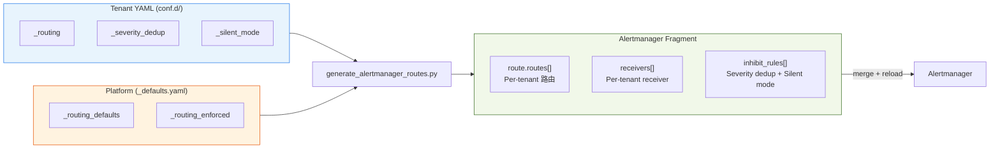

# BYO Alertmanager 整合指南

> **Language / 語言：** **中文 (Current)** | [English](./byo-alertmanager-integration.en.md)

> **版本**：v2.9.0
> **受眾**：Platform Engineers、SREs
> **前置文件**：[BYO Prometheus 整合指南](byo-prometheus-integration.md)

---

## 1. 概述

告警疲勞的四大根因與對應解法：

| 根因 | 解法 | 機制 | 配置來源 |
|------|------|------|----------|
| 備份/維護期間假陽性風暴 | **Silent Mode** | Sentinel alert → inhibit_rules 攔截通知（TSDB 有紀錄） | `_silent_mode` |
| 計畫性維護忘記關閉 | **Maintenance Mode** | PromQL 層完全不觸發（可設 `expires` 自動失效） | `_state_maintenance` |
| Warning + Critical 重複告警 | **Severity Dedup** | Per-tenant inhibit_rules（`metric_group` 配對） | `_severity_dedup` |
| 通知目的地寫死在中央 | **Alert Routing** | Per-tenant route + receiver（6 種 type） | `_routing` |

Silent Mode 和 Maintenance Mode 均支援結構化物件設定，含 `expires`（ISO 8601）自動失效和 `reason` 欄位，防止「設了忘記關」。

> 上表是 **BYO 整合情境的速查視角**。完整的告警最佳實務（該對什麼告警 → 通知 → 動作層冪等）見系列文章：[告警設計入門](../alerting-design-fundamentals.md) · [Actionable 之後](../alerting-best-practices.md)。

所有 Alertmanager 配置 fragment 由 `generate_alertmanager_routes.py` 從 tenant YAML 自動產出：



---

## 2. 整合步驟

### Step 1: 確認 Alertmanager 的 Reload 端點可達

**不需要任何 flag。** Alertmanager 的 `/-/reload` 是**無條件啟用**的（POST；GET 回 405），沒有開關。

```yaml
args:
  - "--config.file=/etc/alertmanager/alertmanager.yml"
  - "--storage.path=/alertmanager"
```

> ⛔ **不要加 `--web.enable-lifecycle`**（本文舊版曾這樣寫，#1243 更正）。那是 **Prometheus** 的
> flag，Alertmanager 沒有；v0.33.1 實測會直接
> `alertmanager: error: unknown long flag '--web.enable-lifecycle'` 退出——加了它，
> Alertmanager 根本起不來。
>
> ⚠️ 反過來說，`/-/reload` 既然關不掉且**無認證**，就必須用 NetworkPolicy 擋掉**叢集內
> 其他 Pod** 對 9093 的存取，或用 auth proxy 擋在前面。⛔ 注意 NetworkPolicy 的作用點：
> 同 Pod 內的 sidecar 走 loopback、共用同一個 network namespace，那段流量不經
> NetworkPolicy——它保護的是 pod-to-pod，做不到「只放行本 Pod 內某個容器」。
>
> ⚠️ 同一個誤解的另一半：**Alertmanager 也沒有 `/-/quit`**（v0.33.1 實測回 404、行程續活），
> 那同樣是 Prometheus 的端點。Alertmanager 這側真正暴露的只有 `/-/reload`。

驗證：

```bash
kubectl port-forward svc/alertmanager 9093:9093 -n monitoring &
curl -sf http://localhost:9093/-/ready && echo "ready OK"
# 本步驟真正要證的是 reload 通路——/-/ready 綠不代表 /-/reload 打得通：
curl -sf -X POST http://localhost:9093/-/reload && echo "reload OK"
```

### Step 2: Ensure Prometheus is Connected to Alertmanager

```yaml
# prometheus.yml
alerting:
  alertmanagers:
    - static_configs:
        - targets:
            - "alertmanager.monitoring.svc.cluster.local:9093"
```

### Step 3: Configure Tenant Routing Config (設定 Tenant Routing)

在 tenant YAML 中定義 `_routing` section：

```yaml
# conf.d/db-a.yaml
tenants:
  db-a:
    mysql_connections: "70"
    _routing:
      receiver:
        type: "webhook"
        url: "https://webhook.example.com/alerts"
      group_by: ["alertname", "severity"]
      group_wait: "30s"
      repeat_interval: "4h"
```

### Step 4: Generate Alertmanager Fragment

```bash
# 產出 fragment
da-tools generate-routes --config-dir conf.d/ -o alertmanager-routes.yaml

# 驗證產出
da-tools generate-routes --config-dir conf.d/ --validate

# 驗證 + webhook domain allowlist 檢查
da-tools generate-routes --config-dir conf.d/ --validate --policy .github/custom-rule-policy.yaml
```

產出內容包含：
- `route.routes[]`: Per-tenant 路由（含 `tenant="<name>"` matcher + timing guardrails）
- `receivers[]`: Per-tenant receiver（webhook/email/slack/teams/rocketchat/pagerduty）
- `inhibit_rules[]`: Per-tenant severity dedup rules

### Step 5: Merge into Alertmanager ConfigMap

將產出的 fragment 合併至 Alertmanager 主配置。**兩種模式根據部署流程選擇：**

**模式 A：`--apply`（Runtime 直接操作，v1.4.0）**

```bash
# 一站式自動合併 + apply + reload
da-tools generate-routes --config-dir conf.d/ --apply --yes
```

適合：初次部署測試、P0 緊急修復、不走 GitOps 的環境。

**模式 B：`--output-configmap`（GitOps PR flow，v1.10.0）**

```bash
# 產出完整 ConfigMap YAML（含 global + default route/receiver + tenant routes）
da-tools generate-routes --config-dir conf.d/ --output-configmap -o deploy/alertmanager-configmap.yaml

# 搭配自訂基礎配置
da-tools generate-routes --config-dir conf.d/ --output-configmap \
  --base-config conf.d/base-alertmanager.yaml -o deploy/alertmanager-configmap.yaml

# 檔案進 Git → PR review → merge → ArgoCD/Flux 自動 sync
git add deploy/alertmanager-configmap.yaml && git commit -m "update AM routes"
```

適合：正式 GitOps 流程。產出的 ConfigMap YAML 是完整可 `kubectl apply` 的格式，無需手動合併。不提供 `--base-config` 時使用內建預設值（`resolve_timeout: 5m`、`group_by: [alertname, tenant]`、default receiver）。

⚠️ **v2.10.0 起「提供了但用不了」不再等於「沒提供」（BREAKING，[#1616](https://github.com/vencil/Dynamic-Alerting-Integrations/issues/1616)）**：上面範例的 `--base-config` 是相對路徑。舊行為是——路徑打錯、指到目錄、檔案是空的或只有註解，都**結束碼 0 並靜默改用內建預設值**，產出的 ConfigMap 與完全不提供這個旗標**逐位元組相同**；你的 `global:`（SMTP smarthost、Slack webhook）就這樣被換掉並被 ArgoCD/Flux sync 進叢集。新行為是**結束碼 2 並指名這個旗標**。⛔ 正確的處置是修路徑，不是拿掉 `--base-config`——拿掉的結果與舊的錯誤行為相同。另外 `--base-config` 只有 `--output-configmap` 會讀它（`--validate` 會在組裝 ConfigMap 之前就返回），用在其他模式現在也是結束碼 2 而不是被靜默忽略。

**模式比較：**

| | `--apply` | `--output-configmap` |
|---|-----------|---------------------|
| 操作方式 | 直接修改 K8s ConfigMap | 產出 YAML 檔案 |
| 適用流程 | CLI 手動操作 / 緊急修復 | Git PR → review → GitOps sync |
| 是否需要 K8s 連線 | 是（kubectl context） | 否（純文件產出） |
| Alertmanager reload | `--apply` 自動觸發 | GitOps sync 後由 sidecar/webhook 觸發 |
| 可審計性 | 無 Git 紀錄 | 完整 Git history |

> **注意**：`--apply` 與 `--output-configmap` 互斥，不能同時使用。

### Step 6: Reload Alertmanager

```bash
# HTTP reload（Alertmanager 無條件提供此端點，不需 flag）
curl -X POST http://localhost:9093/-/reload

# 驗證 reload 成功
curl -sf http://localhost:9093/-/ready && echo "Alertmanager ready"
```

---

## 3. generate_alertmanager_routes.py Tool

### 功能

讀取 `conf.d/` 所有 tenant YAML，掃描 `_routing` 和 `_severity_dedup` 設定，產出合法的 Alertmanager YAML fragment。

### 模式

| Flag | 說明 |
|------|------|
| `--dry-run` | 輸出至 stdout，不寫入檔案 |
| `-o FILE` | 寫入指定檔案 |
| `--validate` | 驗證配置合法性（exit 0/1，適合 CI） |
| `--policy FILE` | 載入 `allowed_domains` 做 webhook URL 合規檢查 |
| `--apply [--yes]` | 自動合併至 Alertmanager ConfigMap + reload（`--yes` 跳過確認） |
| `--output-configmap` | 產出完整 ConfigMap YAML（與 `--apply` 互斥），適合 GitOps PR flow |
| `--base-config FILE` | 搭配 `--output-configmap`，載入基礎 Alertmanager 配置（global / default receiver 等） |

### Timing Guardrails

平台強制的 timing 範圍，超限自動 clamp：

| 參數 | 最小值 | 最大值 | 預設值 |
|------|--------|--------|--------|
| `group_wait` | 5s | 5m | 30s |
| `group_interval` | 5s | 5m | 5m |
| `repeat_interval` | 1m | 72h | 4h |

---

## 4. 動態 Reload

### 機制

透過 Alertmanager 原生、無條件啟用的 `/-/reload` 端點實現 HTTP reload（不需 flag）：

```bash
# 更新 ConfigMap 後
curl -X POST http://alertmanager:9093/-/reload
```

### 自動化選項

| 方案 | 說明 | 適用場景 |
|------|------|----------|
| **HTTP reload** | `curl -X POST /-/reload` | 最小侵入，適合自管 Alertmanager |
| **ConfigMap Watcher Sidecar** | 類似 `prometheus-config-reloader` | 全自動，適合生產環境 |
| **CI Pipeline 整合** | GitOps: `generate-routes --validate` + apply + reload | 適合 GitOps 工作流 |
| **GitOps ConfigMap 產出** | `generate-routes --output-configmap` 產出完整 ConfigMap YAML 進 Git PR flow | v1.10.0+，取代 `--apply` 直操作 |
| **Alertmanager Operator** | `kube-prometheus-stack` 的 AlertmanagerConfig CRD | 適合已使用 Operator 的環境 |

---

## 5. Receiver 類型

v1.4.0 支援六種 receiver 類型。以 Webhook 為例：

```yaml
_routing:
  receiver:
    type: "webhook"
    url: "https://webhook.example.com/alerts"
    send_resolved: true  # optional: send resolved alerts
```

其他五種 receiver 類型快速參考：

| 類型 | 必填欄位 | 範例 |
|------|---------|------|
| **Email** | `to`, `smarthost`, `from` | `to: ["team@example.com"]`, `smarthost: "smtp.example.com:587"`, `from: "alertmanager@example.com"` |
| **Slack** | `api_url`, `channel` | `api_url: "https://hooks.slack.com/..."`, `channel: "#alerts"` |
| **Microsoft Teams** | `webhook_url` | `webhook_url: "https://outlook.office.com/webhook/..."` |
| **Rocket.Chat** | `url`, `channel`, `username` | `url: "https://chat.example.com/hooks/xxx/yyy"` |
| **PagerDuty** | `service_key`, `severity`, `client` | `service_key: "key-123"`, `severity: "critical"` |

所有類型均支援 `send_resolved: true`（預設 false），控制 alert 解除時是否發送通知。

### 訊息模板（Go Template）

Slack、Teams、Email 的 `title` / `text` / `html` 欄位支援 Alertmanager Go template 語法。以 Slack 為例：

```yaml
_routing:
  receiver:
    type: "slack"
    api_url: "https://hooks.slack.com/services/..."
    channel: "#db-alerts"
    title: '{{ .Status | toUpper }}: {{ .CommonLabels.alertname }}'
    text: >-
      *Tenant*: {{ .CommonLabels.tenant }}
      *Severity*: {{ .CommonLabels.severity }}
      {{ range .Alerts }}
        - {{ .Annotations.summary }}
      {{ end }}
```

Email 和 Teams 使用相同的 Go template 語法，僅欄位名稱不同：
- Email：`html` 欄位（HTML 格式）
- Teams：`text` 欄位（Markdown 格式）

**可用變數：** `.CommonLabels.alertname`, `.CommonLabels.tenant`, `.CommonLabels.severity`, `.CommonAnnotations.summary`, `.CommonAnnotations.description`, `.Status`, `.Alerts`（支援 `{{ range }}` 迴圈）。詳見 [Alertmanager 官方範本](https://prometheus.io/docs/alerting/latest/notifications/)

---

## 6. 驗證 Checklist

### 工具驗證

```bash
# 1. 產出 fragment（dry-run 預覽）
da-tools generate-routes --config-dir /data/conf.d --dry-run

# 2. 驗證配置合法性
da-tools generate-routes --config-dir /data/conf.d --validate

# 3. 檢查 Alertmanager 狀態
curl -sf http://localhost:9093/-/ready

# 4. 查看當前 alert 狀態
curl -sf http://localhost:9093/api/v2/alerts | python3 -m json.tool
```

> **自動化驗證**：`da-tools byo-check alertmanager` 可一鍵執行上述所有 Alertmanager 驗證項目。
>
> 其中 `alertmanager_inhibit_semantics` 檢查會分析你的 `inhibit_rules` 的**抑制語意**（非只是語法——`amtool check-config` 對語意錯誤全綠）：對每條規則，若 `equal:` 列的 label 在 source／target matcher 都未被 presence-gate（如 `metric_group=~".+"`），且該規則的 source 告警**實際不帶**該 label，就會告警。這正是 [#1132](https://github.com/vencil/Dynamic-Alerting-Integrations/pull/1132) 的坑：Alertmanager 把「兩側皆缺該 label」視為相等，會讓抑制規則失效並**靜默吃掉**不相干的通知。此檢查以你 Alertmanager 當下的**實際告警 label** 佐證，故最好在有代表性告警觸發時執行；查無佐證時只給 advisory 提示、不影響 exit code。修法：讓 source 帶該 label、從 `equal:` 移除、或在兩側 matcher 加 `<label>=~".+"` 閘門。

### 功能驗證

--8<-- "docs/includes/verify-checklist.md"

**Alertmanager 整合專項：**

- [ ] `generate-routes --validate` exit code 0
- [ ] Alertmanager 載入合併後的配置無錯誤
- [ ] Silent/Maintenance 的 `expires` 到期後自動恢復
- [ ] Severity Dedup enabled tenant 的 warning 在 critical 觸發時被抑制
- [ ] Custom routing tenant 的 alert 送達指定 receiver
- [ ] Per-rule override 的 alert 送達指定的 override receiver

---

## 7. Per-Rule Routing Overrides

在進階場景中，某些特定警報可能需要不同的路由策略。Tenant YAML 的 `_routing.overrides[]` 支援 per-alertname 或 per-metric_group 指定自訂 receiver：

### 配置範例

```yaml
# conf.d/db-a.yaml
tenants:
  db-a:
    mysql_connections: "70"
    _routing:
      receiver:
        type: "slack"
        api_url: "https://hooks.slack.com/services/../default"
        channel: "#db-alerts"

      # 特定警報的路由覆寫
      overrides:
        - alertname: "MariaDBHighConnections"
          receiver:
            type: "pagerduty"
            service_key: "urgency-key-123"

        - metric_group: "replication"
          receiver:
            type: "email"
            to: ["dba-team@example.com"]
            smarthost: "smtp.example.com:587"
            from: "alerting@example.com"
```

### 優先級

1. **Exact alertname match** — 若指定 `alertname`，該警報優先使用 override receiver
2. **Metric group match** — 若指定 `metric_group`，該群組內警報使用 override receiver
3. **Tenant default** — 無 override 時，使用租戶預設 receiver

`generate_alertmanager_routes.py` 自動展開 overrides 為 Alertmanager 的嵌套 subroute，確保優先級正確套用。

---

## 8. Platform Enforced Routing

Platform Team 可在 `_defaults.yaml` 設定強制路由，確保 NOC 必收所有 tenant 的告警（與 tenant 自訂路由並行，雙軌通知）：

**模式 A：統一 NOC 接收**

```yaml
# conf.d/_defaults.yaml
_routing_enforced:
  enabled: true
  receiver:
    type: "webhook"
    url: "https://noc.example.com/alerts"
  match:
    - 'severity="critical"'     # ⚠️ 必須是 matcher 字串的 list
```

> ⚠️ **`match` 只接受 list-of-matcher-strings**。寫成 map 形式（`match:` / `  severity: "critical"`）會被 `_grar_routes.py::_build_single_enforced_route` 的 `isinstance(match, list)` 判斷**靜默丟棄**——產生的 route 因此**沒有任何 matcher**，加上 enforced route 固定帶 `continue: true`，結果是一條 **match-all 消防水管**：所有租戶的所有告警（含 severity=info 與其他租戶的）全被雙送進該 receiver。範本見 [`conf.d/_defaults.yaml`](https://github.com/vencil/Dynamic-Alerting-Integrations/blob/main/components/threshold-exporter/config/conf.d/_defaults.yaml) 的註解區塊。

**模式 B：Per-tenant 獨立通道**

當 receiver 欄位包含 `{{tenant}}` 佔位符，系統自動為每個 tenant 建立獨立的 enforced route。Platform 可藉此為各 tenant 建立專屬通知通道，tenant 無法拒絕也無法覆寫：

```yaml
# conf.d/_defaults.yaml
_routing_enforced:
  enabled: true
  receiver:
    type: "slack"
    api_url: "https://hooks.slack.com/services/T/B/x"
    channel: "#alerts-{{tenant}}"    # → #alerts-db-a, #alerts-db-b, ...
```

模式 A 產生單一共用 platform route；模式 B 產生 N 個 per-tenant route（各帶 `tenant="<name>"` matcher + `continue: true`）。預設不啟用。

> 上面兩個模式談的是**租戶**告警。平台**自己**的自監控告警（Prometheus / Alertmanager / exporter / tenant-api / 聯邦管線的健康）沒有 tenant 可依附，選法不同——見 [§11 平台自監控告警的投遞](#11-平台自監控告警的投遞)。

---

## 9. 一站式配置驗證

v1.7.0 新增 `validate_config.py`，一次檢查 YAML syntax、schema、routes、policy、custom rules、版號一致性：

```bash
# 一站式驗證
da-tools validate-config --config-dir conf.d/

# CI pipeline 使用 JSON 輸出 + policy 檢查
da-tools validate-config --config-dir conf.d/ --policy .github/custom-rule-policy.yaml --json
```

建議在 `generate-routes --apply` 前先執行 `validate-config`，確保配置完整正確。

---

## 10. 排程式維護窗口（進階）

若租戶配置了 `_state_maintenance.recurring[]`（cron + duration），可透過 `maintenance_scheduler.py` 以 CronJob 方式自動建立 Alertmanager silence。此工具呼叫 Alertmanager `/api/v2/silences` API，因此 BYO 環境需確保：

- CronJob 所在 Pod 可連線至 Alertmanager API endpoint（預設 `http://alertmanager:9093`）
- Alertmanager 已啟用 API v2（預設開啟，無需額外設定）

```bash
# 由 CronJob 定期呼叫
da-tools maintenance-scheduler --config-dir conf.d/ --alertmanager http://alertmanager:9093
```

工具內建冪等檢查（不重複建立相同 silence）與自動延展（既有 silence 到期早於視窗結束時自動 extend）。詳見 [Shadow Monitoring SOP §8](../shadow-monitoring-sop.md) 中的維護窗口操作說明。

---

## 11. 平台自監控告警的投遞

平台自己也有一份自監控 rule pack（`k8s/03-monitoring/configmap-rules-platform.yaml`，41 條），監看 Prometheus / Alertmanager / threshold-exporter / tenant-api / 聯邦與投影管線的健康。**出貨預設它們不通知任何人**：`Watchdog` 走 [自我存活性](alerting-plane-self-liveness.md)的 index-0 心跳專線，其餘 40 條落在 root 的 `default` receiver（無 notifier）。這是刻意的出貨姿態（不預設把告警送到我們不知道的地方），**不是無解**——本節說明怎麼接上。

接的機制就是 §8 的 `_routing_enforced`，差別只在 matcher 該寫什麼。

### 主要選法：`alert_source="platform"`（正向斷言）

平台告警**沒有 tenant 可依附**，所以平台給了它們一個正向 discriminator label：除 `Watchdog` 外的 40 條全部帶 `alert_source: platform`。

```yaml
# conf.d/_defaults.yaml
_routing_enforced:
  enabled: true
  receiver:
    type: "webhook"
    url: "https://noc.example.com/platform-alerts"
  match:
    - 'alert_source="platform"'
  group_by: ["alertname"]     # 平台告警無 tenant，用 root 的 [alertname,tenant] 分組沒有意義
  group_wait: "30s"
  repeat_interval: "4h"
```

這是**正向**斷言：只選有標的，語意明確、不會誤收。`alert_source` 是**保留值**——非平台規則樹不得使用，且 `Watchdog` 必須不帶（它有自己的專線，多一個 discriminator 會讓心跳被拉進第二條投遞路徑）。兩個方向都由 `tests/ops/test_generate_routes_orchestration.py::TestPlatformAlertSourceContract` 機械保證。

### 兜底：`tenant=""`（⚠️ 負向斷言，有已知陷阱且**不完整**）

40 條裡有 **37 條**完全沒有 `tenant` label，所以 `tenant=""` 接得住那 37 條。**剩下 3 條接不到**（全部 `severity: warning`）：

| 告警 | `tenant` 從哪來 |
|---|---|
| `TenantMetricsOverLimit` | rule-level `labels.tenant`（也來自 expr 結果集） |
| `FederationRejectionRateAnomaly` | expr `sum by (tenant)` 產生的 **runtime** label |
| `FederationGatewayBackendErrors` | expr `sum by (tenant)` 產生的 **runtime** label |

⚠️ 後兩條特別容易漏判：它們的 rule-level `labels:` 裡**沒有** `tenant`，只在告警實際觸發時由 expr 的聚合維度帶出來——只讀規則檔的 `labels:` 會誤以為它們無 tenant。

因此 `tenant=""` 是一個**不完整的兜底**：它確實能接住「未來漏打 `alert_source`、且結果集無 tenant」的新規則，但**接不到**任何 per-tenant 聚合形狀的平台告警——而聯邦面的告警正是這個形狀。代價還包括：它同時接住任何其他碰巧沒有 tenant 的告警。**正向的 `alert_source="platform"` 才是 40/40 的完整選法**，`tenant=""` 只適合當作額外的第二層網。

⚠️ **這裡有個反過來咬人的坑，務必記住**：Alertmanager 的官方語意是「**label 不存在 == label 值為空字串**」。因此：

| 寫法 | 實際會匹配到 |
|---|---|
| `tenant=""` | 無 `tenant` label 的告警（40 條平台告警裡的 37 條）✅ 這是兜底想要的 |
| `tenant=~".*"` | **所有告警，含全部 40 條平台告警** ⚠️ `.*` 匹配空值 |
| `tenant!=""` / `tenant=~"\S+"` | 任何帶 tenant 的告警——⚠️ **包含上表那 3 條平台告警**，不等於「只要租戶告警」 |
| `tenant!=""` ＋ `alert_source=""` | 真正的「只要租戶告警」✅ 兩個 matcher 是 AND |

也就是說，想寫「所有租戶的告警」而順手寫成 `tenant=~".*"`，會**把平台告警一起吃進租戶通道**。這是 Alertmanager 的長期已知陷阱（[alertmanager#2102](https://github.com/prometheus/alertmanager/issues/2102)）。而換成 `tenant!=""` 只解決一半——它仍會撈到那 3 條 per-tenant 聚合的平台告警；要乾淨地表達「只要租戶告警」必須**再加一個 `alert_source=""`**。平台自己出貨的 silent-mode `inhibit_rules` 就是這個組合（`tenant=~".+"` ＋ `alert_source=""`），可以當範本。

### ⛔ 誠實限制：一條 enforced route，`match` 內是 AND

四點必須先知道，否則會做出錯誤預期：

1. **`_routing_enforced` 只產生「一條」route**（模式 A）。
2. **`match` 陣列內的多個 matcher 是 AND**，不是 OR。
3. 因此**無法用一條 enforced route 同時表達「所有 critical」OR「所有平台告警」**——這兩個需求要**二選一**：
   - 選 `alert_source="platform"` → 平台自監控 40/40 收到；租戶的 critical 走各租戶自己的 `_routing`（不進 NOC）。
   - 選 `severity="critical"` → NOC 收到所有租戶 critical，但平台自監控只涵蓋 **18/40**（18 critical、20 warning、2 info），其餘 22 條仍然靜默。

   ⚠️ 不要試圖「手動在 base ConfigMap 再加一條 route」繞過：重新產生設定時 `route.routes` 是**整段 REPLACE**（`assemble_configmap`），手加的 route 會在下一次 regen 消失。

4. **模式 B（`{{tenant}}` 展開）不能拿來收平台告警——而且它的失敗方式有兩種、方向相反**：per-tenant enforced route 硬帶 `tenant="<name>"` matcher（`scripts/tools/ops/_grar_routes.py`）。
   - **收不到（37/40）**：完全沒有 `tenant` label 的那 37 條永遠匹配不到任何 per-tenant route。
   - **⚠️ 收太多（3/40）**：`TenantMetricsOverLimit` / `FederationRejectionRateAnomaly` / `FederationGatewayBackendErrors` **會**匹配到——它們帶 `tenant`（後兩者來自 expr 的 `sum by (tenant)`，只在開火時存在）。於是**平台自己的故障告警被送進該租戶的通道**，而 enforced route 是 `continue: true`，它還會繼續落到該租戶的主 route，**投遞兩次**。其中 `FederationGatewayBackendErrors` 的規則註解明說那是平台的錯、不是租戶的錯——送給租戶是錯的收件人。

   **要收平台告警只能用模式 A。** 若你因為租戶告警的需求而必須用模式 B，請理解那 3 條會外溢到租戶通道；要擋掉就在 per-tenant receiver 前加 `alert_source=""` 條件（與平台自己在 silent-mode inhibit 上用的排除條件同型）。

### 接上之後的噪音特性（先看再接）

平台告警**繞過了平台大部分的降噪機制**，因為那些機制都以 `tenant` / `metric_group` 為 key：

- **Severity dedup 不生效**：出貨的 dedup `inhibit_rules` 兩側都要求 `metric_group=~".+"` 且 `tenant="<name>"`，而平台告警**零條有 `metric_group`**（37 條連 `tenant` 也沒有）。免疫的成因是**前者**——`metric_group` 一條都沒有，所以連帶 tenant 的那 3 條也不會被 dedup 掉。實例：`ThresholdExporterDown`（warning）與 `ThresholdExporterAbsent`（critical）在全滅時會**雙發**，不會像租戶告警那樣被壓成一則。
- **Silent mode 不生效（成因與上一條不同）**：`TenantSilentWarning` / `TenantSilentCritical` 的 inhibit target 是 `severity=<...>` + `tenant=~".+"`——上面那 3 條帶 tenant 的平台 warning **原本落在 target 內**，租戶只要開一次 `_silent_mode` 就能把平台自己的故障告警消音。本版已在這兩條 inhibit 的 `target_matchers` 加上 `alert_source=""`（語意：只針對**沒有**平台標記的租戶告警），平台告警因此免疫。⚠️ 兩條的免疫來源不同，別混記：**dedup 是「本來就沒有 `metric_group`」**，**silent mode 是「本版加了排除條件」**。
  同一個缺口有**第二個面**，本版一併修掉：`maintenance-scheduler` 依租戶的 `_state_maintenance.recurring` 建立的 Alertmanager silence，matcher 原本只有 `tenant="<name>"`，租戶開維護窗口一樣會把那 3 條平台告警靜音。現已同樣帶上 `alert_source=""`（`scripts/tools/ops/maintenance_scheduler.py`，兩個寫入點共用同一個 builder）。⚠️ 兩個面必須一起看：**inhibit 與 silence 是不同機制**，只修一個，洞只是換個形狀。舊有的單 matcher silence 不受影響——冪等查找是以 `(tenant, comment)` 為鍵、按名掃 `tenant` matcher，不比對整組。
- **`absent()` 型告警在元件未部署時常態 firing**：`ThresholdExporterAbsent`、`TenantExporterJobAbsent`、`FederationRevocationReconcileStale`、`FederationAuditPipelineSilent` **四條**是設計上的「東西不見了就叫」（最後兩條屬聯邦面，未啟用聯邦時必然亮燈），在 demo / 部分部署的環境會持續亮燈。接上通道前先確認這些元件都真的部署了，否則第一天就會收到穩定噪音。
  > `MassExporterOutage` **不在此列**：它的 expr 尾端是 `unless on() absent(up{job="tenant-exporters"})`，整個 job 不存在時**刻意抑制自己**，把「exporter 面整片消失」這個情境單獨留給 `TenantExporterJobAbsent` 承接。它恰恰是「元件未部署時**不**叫」的那一類。
- **⛔ 第一天必然收到的一則：`AlertmanagerWebhookNotificationsFailing`**：出貨的 `secret-watchdog-heartbeat.yaml` 是 placeholder（`REPLACE_WITH_EXTERNAL_DEAD_MANS_SWITCH_URL`），而 Watchdog route 的 `repeat_interval` 是 3m ⇒ Alertmanager 每 3 分鐘送出一次必失敗的 webhook ⇒ 該規則（`increase(...[10m]) > 0`、`for: 15m`）在**未設定外部 DMS 的環境會永久 firing**。這不是「可能」的噪音，是接上通道後 15 分鐘內**一定**會拿到的第一則。先做完[自我存活性指南①](alerting-plane-self-liveness.md)填好 Secret，再接通道。
  ⚠️ **順帶一個誤診陷阱**：`alertmanager_notifications_failed_total` **沒有 per-receiver label**（只有 `integration` / `reason`），所以你新加的 NOC webhook 若失敗，餵的是**同一個 counter**。後果有二：(a) 告警文字會指著 watchdog secret 叫你去查，實際壞的是 NOC webhook；(b)「webhook 壞了」這則告警本身會被路由到那個壞掉的 webhook。判別方式只能看 Alertmanager 自己的 log／`amtool` 而非這個指標。

建議做法：先用一個**低優先級的通道**（如專屬 Slack channel、不 page 的 webhook）接一週觀察，確認噪音收斂後再接到會叫醒人的通道。

### ⚠️ 升級註記：本次的 label 變更會擾動已在跑的告警狀態

40 條規則新增了一個 rule-level label，這會改變它們的 label set，因而有兩個**一次性**的可觀察副作用（**只影響已經把平台告警接上通知的環境**；出貨預設 `_routing_enforced` 關閉、無人接收，則感受不到）：

1. **Alertmanager fingerprint 改變**：Alertmanager 以 label set 算 alert fingerprint，label set 一變就是「新的一則告警」。已接好投遞的 operator 會看到舊 fingerprint 走完 `resolve_timeout` 後發出一輪**假 resolved**，新 fingerprint 再**重新 page** 一次。
2. **Prometheus `for:` 計時器重置**：reload 規則時，Prometheus 以「rule name + labels」配對既有的 pending/firing 狀態，配不上就當成新規則**從零重新計時**。`for: 15m` 的規則因此有最長 **15 分鐘**的偵測空窗——套用本版時如果正好有事故在燒，那段時間不會有新的 firing 通知。

建議在維護窗口套用，或至少避開已知的事故處理期間。

> 相關：[告警平面自我存活性（Operator 指南）](alerting-plane-self-liveness.md)（`Watchdog` 與外部 dead-man's-switch）· [ADR-025](../adr/025-alerting-plane-self-liveness.md)（設計決策）· [故障排查](../troubleshooting.md#平台告警沒有收到通知)

---

## Alertmanager Operator Path

> 使用 Prometheus Operator 的 AlertmanagerConfig CRD？請參閱 [Prometheus Operator 整合手冊](prometheus-operator-integration.md)，包含 AlertmanagerConfig v1beta1 產出、驗證與遷移指引。

## 相關資源

| 資源 | 相關性 |
|------|--------|
| ["BYO Alertmanager Integration Guide"] | ⭐⭐⭐ |
| ["Bring Your Own Prometheus (BYOP) — 現有監控架構整合指南"](./byo-prometheus-integration.md) | ⭐⭐⭐ |
| ["Threshold Exporter API Reference"](../api/README.md) | ⭐⭐ |
| ["性能基準 (Performance Benchmarks)"](../benchmarks.md) | ⭐⭐ |
| ["da-tools CLI Reference"](../cli-reference.md) | ⭐⭐ |
| ["Grafana Dashboard 導覽"](../grafana-dashboards.md) | ⭐⭐ |
| ["驗證場景與平台行為"](../scenarios/verified-scenarios.md) | ⭐⭐ |
| ["Shadow Monitoring SRE SOP"](../shadow-monitoring-sop.md) | ⭐⭐ |
