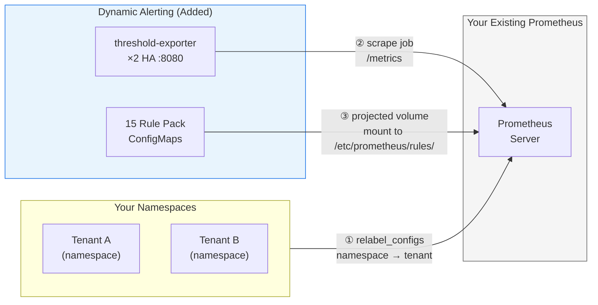

# Bring Your Own Prometheus (BYOP) — Existing Monitoring Infrastructure Integration Guide

> **Audience**: Platform Engineers, SREs
> **Prerequisite Reading**: [Architecture and Design](../architecture-and-design.md) §1–§3 (Vector matching and Projected Volume principles)
> **Version**: 

> **Language / 語言:** **English (Current)** | [中文](byo-prometheus-integration.md)

---

## Overview

This platform adopts a **non-invasive** design philosophy. If your organization already operates a self-managed Prometheus, Thanos, or VictoriaMetrics cluster, **you do not need to replace it**—your existing scrape configs, recording rules, and dashboards are fully preserved. No team retraining or operational workflow overhaul is required.

Simply complete the following **3 minimal integration steps** (approximately 12 minutes total), and your existing monitoring infrastructure will be ready to enable the dynamic threshold alerting engine:

| Step | Action | Estimated Time |
|------|--------|----------------|
| 1 | Inject `tenant` label | ~5 minutes |
| 2 | Scrape `threshold-exporter` | ~2 minutes |
| 3 | Mount Rule Pack ConfigMaps | ~5 minutes |

After integration, your Prometheus will gain: 1 relabel config, 1 scrape job, and 15 Rule Pack ConfigMaps (selectively mounted). **All existing scrape jobs, recording rules, and alerting rules remain completely unaffected.**



---

## Prerequisite: Why Is the `tenant` Label Required?

The platform's core mechanism relies on `group_left` vector matching to compare **real-time tenant metrics** with **dynamic thresholds** emitted by `threshold-exporter`:

```promql
# Simplified example: trigger alert when actual connections exceed the tenant's custom threshold
tenant:mysql_threads_connected:max
  > on(tenant) group_left()
tenant:alert_threshold:connections
```

This requires both sides of the metrics to carry the **same `tenant` label**. The `user_threshold` metrics emitted by `threshold-exporter` inherently carry the `tenant` label, and Recording Rules normalize it into the `tenant:alert_threshold:*` series. However, metrics from your database exporters (such as mysqld_exporter, redis_exporter) **do not carry the `tenant` label by default**. If the `tenant` labels don't match, `group_left` silently returns an empty vector—no error message, no warning, and all alerts fail to fire. This is the hardest-to-diagnose failure mode: everything appears normal until alerting is actually needed.

---

## Step 1: Inject the `tenant` Label

### Objective

Ensure that your existing Prometheus-scraped database metrics all carry the `tenant` label, enabling them to be matched with `threshold-exporter`'s threshold vectors.

### Method: Using K8s Service Discovery's relabel_configs

In your existing `scrape_configs` (specifically the jobs scraping database exporters), add the following `relabel_configs`:

**Option A — Use Namespace as tenant name** (Recommended for 1:1 tenant-to-namespace architecture)

```yaml
scrape_configs:
  - job_name: "tenant-db-exporters"
    scrape_interval: 10s
    kubernetes_sd_configs:
      - role: service
    relabel_configs:
      # Keep only Services with the scrape annotation
      - source_labels: [__meta_kubernetes_service_annotation_prometheus_io_scrape]
        action: keep
        regex: "true"
      # Keep only tenant namespaces (adjust regex to match your naming pattern)
      - source_labels: [__meta_kubernetes_namespace]
        action: keep
        regex: "db-.+"                    # ← Adjust to your tenant namespace naming pattern
      # ⭐ Core: Inject namespace name as tenant label
      - source_labels: [__meta_kubernetes_namespace]
        target_label: tenant
      # Use the port specified in the Service annotation
      - source_labels: [__address__, __meta_kubernetes_service_annotation_prometheus_io_port]
        action: replace
        target_label: __address__
        regex: ([^:]+)(?::\d+)?;(\d+)
        replacement: $1:$2
```

**Option B — Use custom Label as tenant name** (For architectures where multiple tenants share a namespace)

```yaml
relabel_configs:
  # Read tenant name from the Service's K8s label
  - source_labels: [__meta_kubernetes_service_label_tenant]
    target_label: tenant
```

> **⚠️ Important**: The value of the `tenant` label must exactly match the tenant name in the `threshold-exporter` ConfigMap (e.g., `db-a`, `db-b`). Use the names generated by `scaffold_tenant.py` as the baseline.

### Verification

```bash
# Confirm metrics carry the tenant label
curl -s 'http://<your-prometheus>:9090/api/v1/query?query=up{tenant!=""}' \
  | jq '.data.result[] | {tenant: .metric.tenant, instance: .metric.instance}'
```

**✅ Success Criteria**: Each tenant's metrics carry the correct `tenant` label value. If no results, check target discovery and relabel_configs.

### Advanced: Flexible Tenant-Namespace Mapping

Option A assumes 1:1 (one namespace = one tenant). The platform also supports other mapping patterns:

- **N:1 (multiple Namespaces → one Tenant)**: For example, `db-a-read` and `db-a-write` unified as `db-a`. Use regex to extract the tenant prefix:
  ```yaml
  - source_labels: [__meta_kubernetes_namespace]
    target_label: tenant
    regex: "(db-[^-]+).*"
    replacement: "$1"
  ```

- **1:N (one Namespace → multiple Tenants)**: For shared namespace scenarios, use Option B with Service labels/annotations to distinguish tenants.

**Key Constraint**: Regardless of mapping strategy, the `tenant` label value must exactly match the tenant key in the `threshold-exporter` ConfigMap. See [Design Document §2.3](../design/config-driven.en.md#23-tenant-namespace-mapping) and [ADR-006](../adr/006-tenant-mapping-topologies.en.md) for details.

---

## Step 2: Scrape threshold-exporter

### Objective

Enable your Prometheus to know where to read dynamic threshold metrics (the `user_threshold` series).

### Configuration

Add a new scrape job to your `prometheus.yml`:

```yaml
scrape_configs:
  # ... your existing jobs ...

  # ⭐ Dynamic threshold engine
  - job_name: "dynamic-thresholds"
    scrape_interval: 15s
    # Method 1: Static configuration (simplest)
    static_configs:
      - targets: ["threshold-exporter.monitoring.svc.cluster.local:8080"]
    # Method 2: K8s Service Discovery (auto-discovery, recommended for production)
    # kubernetes_sd_configs:
    #   - role: service
    #     namespaces:
    #       names: ["monitoring"]
    # relabel_configs:
    #   - source_labels: [__meta_kubernetes_service_name]
    #     action: keep
    #     regex: "threshold-exporter"
    #   - source_labels: [__meta_kubernetes_service_annotation_prometheus_io_port]
    #     action: replace
    #     target_label: __address__
    #     source_labels: [__address__, __meta_kubernetes_service_annotation_prometheus_io_port]
    #     regex: ([^:]+)(?::\d+)?;(\d+)
    #     replacement: $1:$2
```

> **Tip**: `threshold-exporter` is deployed as HA ×2 replicas with Service-level load balancing. Both replicas emit identical metrics (based on the same ConfigMap), so Prometheus obtains the complete threshold set from either Pod.

### Verification

```bash
# Confirm target status is UP and threshold metrics are queryable
curl -s 'http://<your-prometheus>:9090/api/v1/query?query=up{job="dynamic-thresholds"}' \
  | jq '.data.result[] | {instance: .metric.instance, up: .value[1]}'

curl -s 'http://<your-prometheus>:9090/api/v1/query?query=user_threshold{metric="connections"}' \
  | jq '.data.result[] | {tenant: .metric.tenant, value: .value[1]}'
```

**✅ Success Criteria**: The `dynamic-thresholds` job status is `up`, and `user_threshold` metrics are queryable.

---

## Step 3: Mount Rule Pack ConfigMaps

### Objective

Load pre-written Recording Rules + Alert Rules into your Prometheus to enable dynamic threshold matching.

### Available Rule Packs

| ConfigMap Name | Contents | Rules |
|---|---|---|
| `prometheus-rules-mariadb` | `mariadb-recording.yml`, `mariadb-alert.yml` | 11R + 8A |
| `prometheus-rules-postgresql` | `postgresql-recording.yml`, `postgresql-alert.yml` | 11R + 8A |
| `prometheus-rules-kubernetes` | `kubernetes-recording.yml`, `kubernetes-alert.yml` | 7R + 4A |
| `prometheus-rules-redis` | `redis-recording.yml`, `redis-alert.yml` | 11R + 6A |
| `prometheus-rules-mongodb` | `mongodb-recording.yml`, `mongodb-alert.yml` | 10R + 6A |
| `prometheus-rules-elasticsearch` | `elasticsearch-recording.yml`, `elasticsearch-alert.yml` | 11R + 7A |
| `prometheus-rules-oracle` | `oracle-recording.yml`, `oracle-alert.yml` | 11R + 7A |
| `prometheus-rules-db2` | `db2-recording.yml`, `db2-alert.yml` | 12R + 7A |
| `prometheus-rules-clickhouse` | `clickhouse-recording.yml`, `clickhouse-alert.yml` | 12R + 7A |
| `prometheus-rules-kafka` | `kafka-recording.yml`, `kafka-alert.yml` | 11R + 10A |
| `prometheus-rules-rabbitmq` | `rabbitmq-recording.yml`, `rabbitmq-alert.yml` | 11R + 10A |
| `prometheus-rules-operational` | `operational-alert.yml` | 0R + 2A |
| `prometheus-rules-platform` | `platform-alert.yml` | 0R + 4A |

> **You only need to mount rule packs relevant to your environment.** For example, if you only use MariaDB and Redis, mount only those two. Unmounted rule packs incur near-zero evaluation cost even if mounted (no matching metrics), but selective mounting keeps configurations clear.

### Configuration: Direct ConfigMap Mounting

Mount rule pack ConfigMaps to your Prometheus Pod and declare the read paths in the configuration.

**Step 3a — Modify Prometheus Deployment/StatefulSet**

Add a Projected Volume (or individual Volumes) to your Prometheus's `volumes` section:

```yaml
# Projected Volume (recommended: consolidates all rule packs into a single mount point)
volumes:
  - name: dynamic-alert-rules
    projected:
      sources:
        - configMap:
            name: prometheus-rules-mariadb
            optional: true                     # ← Do not prevent Prometheus startup if rule pack is missing
            items:
              - key: mariadb-recording.yml
                path: mariadb-recording.yml
              - key: mariadb-alert.yml
                path: mariadb-alert.yml
        - configMap:
            name: prometheus-rules-redis
            optional: true
            items:
              - key: redis-recording.yml
                path: redis-recording.yml
              - key: redis-alert.yml
                path: redis-alert.yml
        # ... Add other rule packs as needed (kubernetes, mongodb, elasticsearch, platform)
```

Add to the Prometheus container's `volumeMounts`:

```yaml
volumeMounts:
  - name: dynamic-alert-rules
    mountPath: /etc/prometheus/rules/dynamic-alerts
    readOnly: true
```

**Step 3b — Modify prometheus.yml**

Declare the new rules directory in `rule_files`:

```yaml
rule_files:
  - "/etc/prometheus/rules/*.yml"                    # Your existing rules (do not touch)
  - "/etc/prometheus/rules/dynamic-alerts/*.yml"     # ⭐ Added: Dynamic threshold rule packs
```

**Step 3c — Trigger Prometheus Reload**

```bash
# Method 1: Via lifecycle API (requires --web.enable-lifecycle)
curl -X POST http://<your-prometheus>:9090/-/reload

# Method 2: Send SIGHUP
kill -HUP $(pidof prometheus)
```

### Verification

```bash
# Confirm rules are loaded and no evaluation errors
curl -s 'http://<your-prometheus>:9090/api/v1/rules' \
  | jq '[.data.groups[].rules[] | select(.lastError != "")] | length'
# Expected: 0 (no errors)
```

**✅ Success Criteria**: All rule groups are loaded, no evaluation errors, and recording rules produce normalized metrics correctly.

---

## End-to-End Verification Checklist

After completing the three steps above, use the automated verification tool for one-command end-to-end checking:

```bash
# Automated verification (recommended)
da-tools byo-check prometheus --prometheus http://<your-prometheus>:9090

# JSON output (for CI)
da-tools byo-check prometheus --prometheus http://<your-prometheus>:9090 --json
```

The tool automatically checks: tenant label injection → threshold-exporter scrape → user_threshold metrics → Rule Pack loading → recording rules output → vector matching. Displays `PASS` when all items pass.

> **Manual verification**: If you need step-by-step manual confirmation, the core verification is the vector matching test:
> ```bash
> curl -s 'http://<prometheus>:9090/api/v1/query?query=tenant%3Amysql_threads_connected%3Amax%20-%20on(tenant)%20tenant%3Aalert_threshold%3Aconnections' \
>   | jq '.data.result[] | {tenant: .metric.tenant, diff: .value[1]}'
> # Empty result → tenant label mismatch, go back and check Step 1
> ```

---

## Quick Verification with da-tools CLI

Beyond the `byo-check` automated verification above, `da-tools` provides additional diagnostic tools:

```bash
export PROM=http://prometheus.monitoring.svc.cluster.local:9090

# Check specific alert status
da-tools check-alert MariaDBHighConnections db-a

# Observe existing metrics, get threshold recommendations
da-tools baseline --tenant db-a --duration 300

# Tenant health check (exporter status + operational mode)
da-tools diagnose db-a

# One-stop config validation (YAML + schema + routes + custom rules)
da-tools validate-config --config-dir /data/conf.d
```

> **Tip**: `da-tools` doesn't require cloning the entire project, just `docker pull ghcr.io/vencil/da-tools:v2.7.0` is enough.

---

## Advanced: Integration with Thanos / VictoriaMetrics

The platform's rule packs are based purely on standard PromQL, making them fully compatible with Thanos and VictoriaMetrics:

**Thanos**: Rule packs can be loaded into Thanos Ruler. Ensure Thanos Querier can query both tenant metrics and `threshold-exporter` metrics (both StoreAPIs must be registered).

**VictoriaMetrics**: Use vmalert to load rule packs. Threshold metrics are scraped via VMAgent's `scrape_configs` (configuration method identical to native Prometheus).

---

## Prometheus Operator Integration

> Using Prometheus Operator (kube-prometheus-stack)? See the [Prometheus Operator Integration Guide](prometheus-operator-integration.en.md) for complete CRD generation tools, validation procedures, and GitOps integration guidance.

---

## FAQ

**Q: After integration, do I need to restart Prometheus?**
A: No. If you enable `--web.enable-lifecycle`, `curl -X POST /-/reload` performs a hot reload. ConfigMap changes are also automatically synced to Pod mount paths by Kubelet (typically 1–2 minute delay).

**Q: Can I mount only some rule packs?**
A: Yes. All rule packs use `optional: true`; you only need to add the ones you need. Unmounted rule packs have no impact on Prometheus.

**Q: Will my existing alerting rules conflict?**
A: No. Dynamic threshold rule packs use independent metric namespaces (`user_threshold`, `user_state_filter`, `tenant:*` recording rules) and won't conflict with your existing rules. However, we recommend running both in parallel during the Shadow Monitoring phase (see [Shadow Monitoring SOP](../shadow-monitoring-sop.md)) before switching.

**Q: Does threshold-exporter need to be deployed in my cluster?**
A: Yes. `threshold-exporter` must access tenant ConfigMaps, so it must be deployed in the same cluster's `monitoring` namespace. It is a lightweight Go binary deployed as HA ×2 replicas with extremely low resource consumption (< 50MB RSS).

**Q: What if I use a multi-cluster Thanos architecture?**
A: `threshold-exporter` is deployed in the data cluster (near tenant ConfigMaps). Thanos Sidecar automatically uploads threshold metrics to the Object Store. Rule packs are loaded into Thanos Ruler, which performs cross-cluster vector matching via Thanos Querier.

## Related Resources

| Resource | Relevance |
|----------|-----------|
| ["Bring Your Own Prometheus (BYOP) — 現有監控架構整合指南"](./byo-prometheus-integration.md) | ⭐⭐⭐ |
| ["BYO Alertmanager Integration Guide"] | ⭐⭐⭐ |
| ["Threshold Exporter API Reference"](../api/README.en.md) | ⭐⭐ |
| ["Performance Analysis & Benchmarks"] | ⭐⭐ |
| ["da-tools CLI Reference"] | ⭐⭐ |
| ["Grafana Dashboard Guide"] | ⭐⭐ |
| ["Advanced Scenarios & Test Coverage"](../internal/test-coverage-matrix.md) | ⭐⭐ |
| ["Shadow Monitoring SRE SOP"] | ⭐⭐ |
