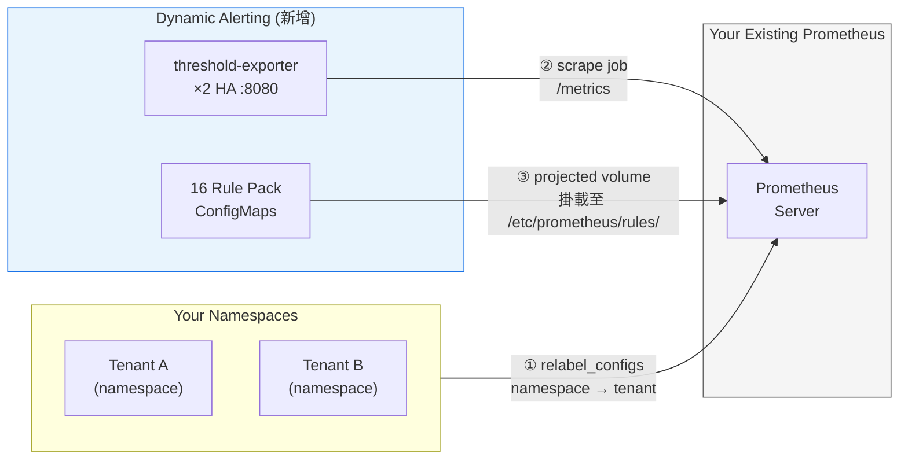

# Bring Your Own Prometheus (BYOP) — 現有監控架構整合指南

> **Language / 語言：** **中文 (Current)** | [English](./byo-prometheus-integration.en.md)

> **受眾**：Platform Engineers、SREs
> **前置閱讀**：[架構與設計](../architecture-and-design.md) §1–§3（向量匹配與 Projected Volume 原理）
> **版本**：v2.6.0

---

## 概述

本平台採用**非侵入式 (Non-invasive)** 設計。如果你的組織已經擁有自建的 Prometheus、Thanos 或 VictoriaMetrics 叢集，**你不需要替換它**——現有的 scrape config、recording rule、dashboard 完全保留，不需要重訓練團隊或重建運維流程。

只要完成以下 **3 個最小整合步驟**（合計約 12 分鐘），你的現有監控基礎設施就能啟用動態閾值警報引擎：

| 步驟 | 動作 | 耗時估計 |
|------|------|----------|
| 1 | 注入 `tenant` 標籤 | ~5 分鐘 |
| 2 | 抓取 `threshold-exporter` | ~2 分鐘 |
| 3 | 掛載黃金規則包 (Rule Packs) | ~5 分鐘 |

整合後，你的 Prometheus 會新增：1 個 relabel 設定、1 個 scrape job、以及 16 個 Rule Pack ConfigMap（可選擇性掛載）。**現有的 scrape job、recording rule、alerting rule 完全不受影響。**



---

## 前提：為什麼需要 `tenant` 標籤？

本平台的核心機制是透過 `group_left` 向量匹配，將**租戶的即時指標**與 `threshold-exporter` 吐出的**動態閾值**進行比對：

```promql
# 簡化範例：當實際連線數超過該租戶的自訂閾值時觸發
tenant:mysql_threads_connected:max
  > on(tenant) group_left()
tenant:alert_threshold:mysql_connections
```

這要求兩邊的指標**都必須帶有相同的 `tenant` 標籤**。`threshold-exporter` 吐出的 `user_threshold` 指標天生自帶 `tenant`，Recording Rule 也會將其歸一化為 `tenant:alert_threshold:*` 系列。但你的資料庫 exporter（如 mysqld_exporter、redis_exporter）吐出的指標**預設沒有 `tenant`**。如果 `tenant` 標籤不匹配，`group_left` 會靜默返回空向量——沒有錯誤訊息、沒有警告，所有警報都不會觸發。這是最難診斷的故障模式：一切看似正常，直到真正需要告警時才發現。

---

## 步驟 1：注入 `tenant` 標籤

### 目標

讓你現有 Prometheus 抓取的資料庫指標都帶上 `tenant` 標籤，使其能與 `threshold-exporter` 的閾值向量配對。

### 方法：利用 K8s Service Discovery 的 relabel_configs

在你現有的 `scrape_configs` 中（抓取資料庫 exporter 的那些 job），加入以下 `relabel_configs`：

**方案 A — 以 Namespace 作為 tenant 名稱**（推薦，適用於一個 tenant 一個 namespace 的架構）

```yaml
scrape_configs:
  - job_name: "tenant-db-exporters"
    scrape_interval: 10s
    kubernetes_sd_configs:
      - role: service
    relabel_configs:
      # 只保留帶有 scrape 標記的 Service
      - source_labels: [__meta_kubernetes_service_annotation_prometheus_io_scrape]
        action: keep
        regex: "true"
      # 只保留 tenant namespace（依你的命名規則調整 regex）
      - source_labels: [__meta_kubernetes_namespace]
        action: keep
        regex: "db-.+"                    # ← 調整為你的 tenant namespace 命名模式
      # ★ 核心：將 namespace 名稱注入為 tenant 標籤
      - source_labels: [__meta_kubernetes_namespace]
        target_label: tenant
      # 使用 Service annotation 指定的 port
      - source_labels: [__address__, __meta_kubernetes_service_annotation_prometheus_io_port]
        action: replace
        target_label: __address__
        regex: ([^:]+)(?::\d+)?;(\d+)
        replacement: $1:$2
```

**方案 B — 以自訂 Label 作為 tenant 名稱**（適用於多個 tenant 共用 namespace 的架構）

```yaml
relabel_configs:
  # 從 Service 的 K8s label 讀取 tenant 名稱
  - source_labels: [__meta_kubernetes_service_label_tenant]
    target_label: tenant
```

> **⚠️ 重要**：`tenant` 標籤的值必須與 `threshold-exporter` ConfigMap 中的 tenant 名稱完全一致（例如 `db-a`、`db-b`）。請用 `scaffold_tenant.py` 產生的名稱作為基準。

### 驗證

```bash
# 確認指標帶有 tenant 標籤
curl -s 'http://<your-prometheus>:9090/api/v1/query?query=up{tenant!=""}' \
  | jq '.data.result[] | {tenant: .metric.tenant, instance: .metric.instance}'
```

**✅ 通過條件**：每個 tenant 的指標都帶有正確的 `tenant` 標籤值。若無結果，檢查 target 發現與 relabel_configs。

### 進階：彈性 Tenant-Namespace 映射

上述方案 A 假設 1:1（一個 namespace = 一個 tenant）。平台也支援其他映射模式：

- **N:1（多 Namespace → 一個 Tenant）**：例如 `db-a-read` 和 `db-a-write` 統一為 `db-a`。使用 regex 擷取 tenant 前綴：
  ```yaml
  - source_labels: [__meta_kubernetes_namespace]
    target_label: tenant
    regex: "(db-[^-]+).*"
    replacement: "$1"
  ```

- **1:N（一個 Namespace → 多個 Tenant）**：共享 namespace 場景，使用方案 B 的 Service label/annotation 區分 tenant。

**關鍵約束**：無論映射方式如何，`tenant` 標籤值必須與 `threshold-exporter` ConfigMap 中的 tenant key 精確匹配。詳見[設計文件 §2.3](../design/config-driven.md#23-tenant-namespace-映射模式-tenant-namespace-mapping)。

---

## 步驟 2：抓取 threshold-exporter

### 目標

讓你的 Prometheus 知道去哪裡讀取動態閾值指標（`user_threshold` 系列）。

### 設定

在你的 `prometheus.yml` 中新增一個 scrape job：

```yaml
scrape_configs:
  # ... 你現有的 jobs ...

  # ★ 動態閾值引擎
  - job_name: "dynamic-thresholds"
    scrape_interval: 15s
    # 方式一：靜態配置（最簡單）
    static_configs:
      - targets: ["threshold-exporter.monitoring.svc.cluster.local:8080"]
    # 方式二：K8s Service Discovery（自動發現，推薦生產環境）
    # kubernetes_sd_configs:
    #   - role: service
    #     namespaces:
    #       names: ["monitoring"]
    # relabel_configs:
    #   - source_labels: [__meta_kubernetes_service_name]
    #     action: keep
    #     regex: "threshold-exporter"
    #   - source_labels: [__meta_kubernetes_service_annotation_prometheus_io_port]
    #     action: replace
    #     target_label: __address__
    #     source_labels: [__address__, __meta_kubernetes_service_annotation_prometheus_io_port]
    #     regex: ([^:]+)(?::\d+)?;(\d+)
    #     replacement: $1:$2
```

> **提示**：`threshold-exporter` 以 HA ×2 副本部署，Service 會自動負載均衡。兩個副本吐出的指標內容完全一致（基於相同 ConfigMap），Prometheus 不論抓到哪個 Pod 都能取得完整的閾值集合。

### 驗證

```bash
# 確認 target 狀態為 UP 且閾值指標可查詢
curl -s 'http://<your-prometheus>:9090/api/v1/query?query=up{job="dynamic-thresholds"}' \
  | jq '.data.result[] | {instance: .metric.instance, up: .value[1]}'

curl -s 'http://<your-prometheus>:9090/api/v1/query?query=user_threshold{component="mysql", metric="connections"}' \
  | jq '.data.result[] | {tenant: .metric.tenant, value: .value[1]}'
```

**✅ 通過條件**：`dynamic-thresholds` job 狀態為 `up`，且 `user_threshold` 指標可正常查詢。

---

## 步驟 3：掛載黃金規則包 (Rule Packs)

### 目標

將預寫好的 Recording Rule + Alert Rule 載入你的 Prometheus，實現動態閾值比對。

### 可用的規則包

| ConfigMap 名稱 | 內容 | 規則數 |
|----------------|------|--------|
| `prometheus-rules-mariadb` | `mariadb-recording.yml`, `mariadb-alert.yml` | 11R + 8A |
| `prometheus-rules-postgresql` | `postgresql-recording.yml`, `postgresql-alert.yml` | 11R + 8A |
| `prometheus-rules-kubernetes` | `kubernetes-recording.yml`, `kubernetes-alert.yml` | 7R + 4A |
| `prometheus-rules-redis` | `redis-recording.yml`, `redis-alert.yml` | 11R + 6A |
| `prometheus-rules-mongodb` | `mongodb-recording.yml`, `mongodb-alert.yml` | 10R + 6A |
| `prometheus-rules-elasticsearch` | `elasticsearch-recording.yml`, `elasticsearch-alert.yml` | 11R + 7A |
| `prometheus-rules-oracle` | `oracle-recording.yml`, `oracle-alert.yml` | 11R + 7A |
| `prometheus-rules-db2` | `db2-recording.yml`, `db2-alert.yml` | 12R + 7A |
| `prometheus-rules-clickhouse` | `clickhouse-recording.yml`, `clickhouse-alert.yml` | 12R + 7A |
| `prometheus-rules-kafka` | `kafka-recording.yml`, `kafka-alert.yml` | 11R + 10A |
| `prometheus-rules-rabbitmq` | `rabbitmq-recording.yml`, `rabbitmq-alert.yml` | 11R + 10A |
| `prometheus-rules-operational` | `operational-alert.yml` | 0R + 2A |
| `prometheus-rules-platform` | `platform-alert.yml` | 0R + 4A |

> **你只需掛載與你環境相關的規則包。** 例如只用 MariaDB 和 Redis，就只掛這兩個。未使用的規則包即使掛載，因無對應 metric，evaluation 成本近乎零——但選擇性掛載可保持配置清晰。

### Configuration: Direct ConfigMap Mounting

將規則包 ConfigMap 掛載到 Prometheus Pod，並在設定中宣告讀取路徑。

**Step 3a — 修改 Prometheus Deployment/StatefulSet**

在你的 Prometheus 的 `volumes` 區段加入 Projected Volume（或個別 Volume）：

```yaml
# Projected Volume（推薦：所有規則包合併到單一掛載點）
volumes:
  - name: dynamic-alert-rules
    projected:
      sources:
        - configMap:
            name: prometheus-rules-mariadb
            optional: true                     # ← 規則包不存在時不影響 Prometheus 啟動
            items:
              - key: mariadb-recording.yml
                path: mariadb-recording.yml
              - key: mariadb-alert.yml
                path: mariadb-alert.yml
        - configMap:
            name: prometheus-rules-redis
            optional: true
            items:
              - key: redis-recording.yml
                path: redis-recording.yml
              - key: redis-alert.yml
                path: redis-alert.yml
        # ... 依需求加入其他規則包（kubernetes, mongodb, elasticsearch, platform）
```

在 Prometheus container 的 `volumeMounts` 加入：

```yaml
volumeMounts:
  - name: dynamic-alert-rules
    mountPath: /etc/prometheus/rules/dynamic-alerts
    readOnly: true
```

**Step 3b — 修改 prometheus.yml**

在 `rule_files` 中宣告新的規則目錄：

```yaml
rule_files:
  - "/etc/prometheus/rules/*.yml"                    # 你現有的規則（不要動）
  - "/etc/prometheus/rules/dynamic-alerts/*.yml"     # ★ 新增：動態閾值規則包
```

**Step 3c — 觸發 Prometheus 重新載入**

```bash
# 方法一：透過 lifecycle API（需啟用 --web.enable-lifecycle）
curl -X POST http://<your-prometheus>:9090/-/reload

# 方法二：送 SIGHUP
kill -HUP $(pidof prometheus)
```

### 驗證

```bash
# 確認規則已載入且無評估錯誤
curl -s 'http://<your-prometheus>:9090/api/v1/rules' \
  | jq '[.data.groups[].rules[] | select(.lastError != "")] | length'
# 預期：0（無錯誤）
```

**✅ 通過條件**：規則群組全部載入、無評估錯誤、recording rule 正常產出歸一化指標。

---

## 端到端驗證 Checklist

完成上述三個步驟後，使用自動化驗證工具一鍵執行端到端檢查：

```bash
# 自動化驗證（推薦）
da-tools byo-check prometheus --prometheus http://<your-prometheus>:9090

# JSON 輸出（適合 CI）
da-tools byo-check prometheus --prometheus http://<your-prometheus>:9090 --json
```

工具自動檢查：tenant 標籤注入 → threshold-exporter scrape → user_threshold metrics → Rule Pack 載入 → recording rules 輸出 → 向量匹配。所有項目均通過後顯示 `PASS`。

> **手動驗證**：若需逐步手動確認，核心驗證為向量匹配測試：
> ```bash
> curl -s 'http://<prometheus>:9090/api/v1/query?query=tenant%3Amysql_threads_connected%3Amax%20-%20on(tenant)%20tenant%3Aalert_threshold%3Aconnections' \
>   | jq '.data.result[] | {tenant: .metric.tenant, diff: .value[1]}'
> # 結果為空 → tenant 標籤不匹配，回頭檢查步驟 1
> ```

---

## Quick Verification with da-tools CLI

除了上述 `byo-check` 自動化驗證外，`da-tools` 提供更多診斷工具：

```bash
export PROM=http://prometheus.monitoring.svc.cluster.local:9090

# 確認特定 alert 的狀態
da-tools check-alert MariaDBHighConnections db-a

# 觀測現有指標，取得閾值建議
da-tools baseline --tenant db-a --duration 300

# 租戶健康檢查（exporter 狀態 + 運營模式）
da-tools diagnose db-a

# 一站式配置驗證（YAML + schema + routes + custom rules）
da-tools validate-config --config-dir /data/conf.d
```

> **提示**：`da-tools` 不需要 clone 整個專案，只需 `docker pull ghcr.io/vencil/da-tools:v2.9.0` 即可使用。

---

## 進階：磁碟填滿告警（Disk-Fill Recipes，需 CSI）

讓租戶自助宣告「磁碟快滿」告警——對 PVC 的 `kubelet_volume_stats_*` 指標跑 forecast（預測幾小時後填滿）或 ratio（使用率超標）recipe。這是**可選**能力，且有一個**硬前提**——請先讀完前提再決定是否啟用。

### 前提：叢集需有實作 NodeGetVolumeStats 的 CSI driver

`kubelet_volume_stats_*` 由 kubelet 透過 CSI 的 `NodeGetVolumeStats` 取得——**沒有，就完全沒有這組指標**，磁碟 recipe 會編譯成功但在叢集裡**永遠不會觸發**（fail-silent）。

- ❌ kind 預設的 `local-path`（hostPath）**不**實作 → 零 volume-stats。
- ✅ 雲商 CSI（EBS / PD / Azure Disk…）或 `csi-driver-host-path` 等有實作 → 正常吐指標。
- **如何確認**：查你的 Prometheus，若 `kubelet_volume_stats_available_bytes` 查不到**任何** series，代表你的儲存後端沒有 kubelet MetricsProvider。若想在配置 scrape 前就確認叢集能力，可參考內部 spike [`test/disk-stats-spike/`](https://github.com/vencil/Dynamic-Alerting-Integrations/tree/main/test/disk-stats-spike)（部署一個 PVC + pod、直接驗 kubelet 是否吐 volume-stats）。

> **為何只支援 1:1 tenant 歸屬**（disk / PVC / node 等基礎設施指標不支援 N:1）：見 [ADR-006 租戶映射拓撲](../adr/006-tenant-mapping-topologies.md)。

### 步驟 A：抓取 kubelet volume-stats 並注入 `tenant`

volume-stats 原生帶 `namespace` 與 `persistentvolumeclaim`，但**不帶 `tenant`**。新增一個抓 kubelet 主 `/metrics` 端點的 scrape job，並用 `metric_relabel_configs` 把 `namespace` 改寫為 `tenant`（1:1，效果同步驟 1；但 kubelet 指標的 `namespace` 是**原生 metric label**，故這裡用 `metric_relabel_configs` 而非步驟 1 的 `relabel_configs`）：

```yaml
scrape_configs:
  # ★ kubelet volume-stats（per-PVC 磁碟容量）— 需 CSI NodeGetVolumeStats
  - job_name: "kubelet-volume-stats"
    scheme: https
    tls_config:
      ca_file: /var/run/secrets/kubernetes.io/serviceaccount/ca.crt
      insecure_skip_verify: true
    bearer_token_file: /var/run/secrets/kubernetes.io/serviceaccount/token
    kubernetes_sd_configs:
      - role: node
    relabel_configs:
      # 經 apiserver node-proxy 抓 kubelet /metrics（避開直連 kubelet 的 TLS 問題）
      - target_label: __address__
        replacement: kubernetes.default.svc:443
      - source_labels: [__meta_kubernetes_node_name]
        regex: (.+)
        target_label: __metrics_path__
        replacement: /api/v1/nodes/${1}/proxy/metrics
    metric_relabel_configs:
      # 只留 tenant namespace 的 volume-stats（與步驟 1 同慣例）
      - source_labels: [namespace]
        action: keep
        regex: "db-.+"                     # ← 改成你叢集的 tenant namespace 命名模式！
      - source_labels: [__name__]
        action: keep
        regex: "kubelet_volume_stats_.*"
      # ★ 核心：1:1 把 namespace 注入為 tenant（與步驟 1 的 relabel 同效）
      - source_labels: [namespace]
        target_label: tenant
```

> 平台自帶的 reference 部署已含這個 job；完整可運行版本見 [`k8s/03-monitoring/configmap-prometheus.yaml`](https://github.com/vencil/Dynamic-Alerting-Integrations/blob/main/k8s/03-monitoring/configmap-prometheus.yaml) 的 `kubelet-volume-stats`。此 job 需 `nodes/proxy` RBAC（與既有的 kubelet-cadvisor job 相同）。非 CSI 叢集套了也**無害**——`metric_relabel_configs` 的 keep 會 drop 到 0 series。

### 步驟 B：租戶宣告磁碟 recipe

在租戶 conf.d 的 `_custom_alerts` 宣告（forecast ratio 模式，預測 PVC 在 horizon 內填滿）：

```yaml
tenants:
  db-a:
    _custom_alerts:
      - recipe: forecast
        name: disk_will_fill
        metric: kubelet_volume_stats_available_bytes
        capacity_metric: kubelet_volume_stats_capacity_bytes
        op: "<"
        horizon: 4h                        # 預測未來 4 小時
        threshold: "0.15:warning"          # 可用比例將跌破 15%
        for: 30m                           # 預測需持續 30m（濾掉瞬時斜率翻轉）
        group_by: [persistentvolumeclaim]  # 逐 PVC 評估（小卷快滿不被大空卷掩蓋）
```

完整範例（threshold / rate / ratio / p99 / absence / `==` 等所有 recipe）見 [`recipes/examples/conf.d/shop.yaml`](https://github.com/vencil/Dynamic-Alerting-Integrations/blob/main/rule-packs/recipes/examples/conf.d/shop.yaml)；recipe 語法、各模式語義與安全採用指引（含 dead-exporter 盲點）見 [Custom Rule Governance](../custom-rule-governance.md)。改完跑 `make custom-alerts-compile` 重編規則包。

### 步驟 C：驗證

```bash
da-tools byo-check prometheus --prometheus http://<your-prometheus>:9090
```

`byo-check` 的磁碟 recipe 步驟會檢查：**宣告了磁碟 recipe 且有 Running pod 的租戶，是否真的收到 tenant-attributed volume-stats**。未到貨時會明確報出「CSI / scrape job / relabel」三項待查方向。

**✅ 通過條件**：磁碟 recipe 步驟為 `pass`（尚未有租戶宣告磁碟 recipe 時為 `skip`）。

### 出問題時：`CustomRecipeDiskInert` 告警

即使略過上面的 byo-check，平台仍有 runtime 安全網：當租戶**宣告了磁碟 recipe、有 Running pod、但歸屬後的 volume-stats 缺席**時，`CustomRecipeDiskInert` 會觸發，並依序提示三個最常見原因：

1. 工作負載未掛載持久化磁碟（最常見；例如 Pod 為純無狀態服務、PVC 卡在 `Pending`、或 StatefulSet 漏寫 `volumeClaimTemplates`）→ 查該租戶的部署架構；
2. 缺 kubelet volume-stats scrape job 或 `namespace→tenant` relabel（步驟 A 漏做）；
3. CSI 未實作 NodeGetVolumeStats（前提不滿足）。

> **能力界線（誠實）**：volume-stats 反映租戶視角的**邏輯**配額。底層 thin-provisioning 的實體爆盤（`volume_stats` 仍顯示有空間、實際 I/O 已凍結）不在此告警範圍內，應由平台 SRE 以 `node_filesystem_*` / CSI controller 指標（基礎設施視角）防禦。

---

## 進階：磁碟 IOPS / 吞吐告警（Per-Container Disk I/O Recipes）

讓租戶對「磁碟 I/O 暴衝」設告警——抓 runaway query、backup storm 等異常 I/O。用 `rate` recipe 跑 `container_fs_*`（reads/writes 的 ops 或 bytes）。

> **⚠ 先讀懂界線（誠實）**：這個信號**比容量（disk-fill）弱、且有環境依賴**，請先確認它對你的環境有效再依賴：
> - **per-CONTAINER，非 per-PVC**：`container_fs_*` 來自 cAdvisor 的 cgroup blkio，**對不到特定 PVC**（[cAdvisor #3588](https://github.com/google/cadvisor/issues/3588)）。多 PVC 的 Pod 切不開，只能看容器總和。
> - **網路儲存看不到**：cgroup blkio 只記 block-layer I/O。**NFS / EFS / Azure Files 等網路儲存走 network stack、繞過 blkio → `container_fs` 永遠是 0**（[cAdvisor #1702](https://github.com/google/cadvisor/issues/1702)）。這類環境**無法**用此告警（byo-check 會明說）。
> - **不是 saturation**：raw IOPS/吞吐 ≠「磁碟飽和」（那是 node 級 %util / latency，屬平台 SRE，租戶側拆不出來）。把它當**相對於 baseline 的異常**信號用（`da-tools baseline` 取建議閾值），別當絕對 SLA。

### 步驟 A：抓取 container_fs 並注入 `tenant`

平台 reference 的 `kubelet-cadvisor` job 已把 `container_fs_{reads,writes}_total` + `_bytes_total` 納入 keep、加上 `namespace→tenant` relabel、並 drop `container=""`/`"POD"`（防 pod-root 重複計）——完整版本見 [`k8s/03-monitoring/configmap-prometheus.yaml`](https://github.com/vencil/Dynamic-Alerting-Integrations/blob/main/k8s/03-monitoring/configmap-prometheus.yaml) 的 `kubelet-cadvisor` job。BYO 自建 Prometheus 請比照（緊 keep + relabel + container drop；別用寬 `container_fs_.*`，device label 會炸 cardinality）。同一 keep 也需含 `container_cpu_cfs_throttled_periods_total` + `container_cpu_cfs_periods_total`（CFS 掐頸告警 `PodContainerCPUThrottled` 的資料來源；僅設 cpu limit 的容器會發出，cardinality 為 cpu-usage 序列的子集，#944）。

### 步驟 B：租戶宣告 IOPS recipe

```yaml
tenants:
  db-a:
    _custom_alerts:
      - recipe: rate
        name: disk_write_iops_high
        metric: container_fs_writes_total      # ops/秒；要看吞吐改 _bytes_total
        op: ">"
        window: 5m
        threshold: "500:warning"               # ★ 用 da-tools baseline 取值，別憑空填
        selectors:
          container: "mariadb"                 # ★ 強烈建議 pin 到 DB 容器（避開 sidecar 噪音）
```

> recipe 聚合到 tenant 層（`sum by(tenant, …) (rate(...))`）、收掉 device/pod；`selectors.container` pin 到你的 DB 容器，只看它的 I/O。

### 步驟 C：Fidelity Gate（上線前必做）

container_fs 對你的環境**是否真的看得到** I/O，只有實證能答。上線此告警**前**：

```bash
# 1) 跑代表性負載（你的真實 workload，或 sysbench/pgbench）
# 2) 期間用 byo-check 確認 container_fs 跟著動：
da-tools byo-check prometheus --prometheus http://<your-prometheus>:9090
#   step5_disk_iops_recipe_prereq:
#     pass → container_fs 對宣告租戶有到貨 = 信號 high-fidelity，可安心啟用
#     fail → 沒到貨（沒 scrape、或儲存 blkio-bypass）→ 此環境不能用，別依賴
```

**✅ 通過條件**：`byo-check` 的 `step5` 為 `pass`，且負載期間 `rate(container_fs_reads_total{tenant="<you>"}[5m])` 或 `..._writes_total` **任一**有非零合理值（讀多寫少的 workload 看 reads 即可——與 gate 的 reads-OR-writes 一致）。**fail / 兩者全 0 就誠實別開**——一個量不到東西的 I/O 告警，比沒有更危險。

> **基礎設施變更後重跑**：cgroup 版本（v1→v2 遷移）或 storage driver 換掉時，底層 blkio 統計機制會改變——重跑這道 fidelity gate 即自動重新驗證 container_fs 在新環境仍 high-fidelity，無需信任任何靜態假設。

### 出問題時：byo-check step5 報 fail

依序查：(1) `container_fs_*` 是否在 cadvisor scrape keep 內、且有 `namespace→tenant` relabel（步驟 A）；(2) 你的儲存是否走網路（NFS/EFS）而**繞過 cgroup blkio**——這類 container_fs 結構上就是 0，請改由平台 SRE 用 node 級 `node_disk_*` 監控；(3) 租戶 workload 是否真的有在寫磁碟（負載期間 baseline 應為非零）。

> **node 級 saturation 屬平台 SRE**：真正的「磁碟飽和」（%util、await/latency）是 node/device 級、無法 per-tenant 拆解，由平台 SRE 用 `node_disk_*` 監控——不在此租戶 recipe 範圍（同 disk-fill 的 thin-provisioning 界線）。

---

## 進階：與 Thanos / VictoriaMetrics 整合

本平台的規則包純粹基於標準 PromQL，因此與 Thanos 和 VictoriaMetrics 完全相容：

**Thanos**：規則包可載入 Thanos Ruler。確保 Thanos Querier 能同時查詢到 tenant 指標和 `threshold-exporter` 指標（兩個 StoreAPI 都要註冊）。

**VictoriaMetrics**：使用 vmalert 載入規則包。閾值指標透過 VMAgent 的 `scrape_configs` 抓取（設定方式與原生 Prometheus 相同）。

---

## Prometheus Operator Integration

> 使用 Prometheus Operator (kube-prometheus-stack)？請參閱 [Prometheus Operator 整合手冊](prometheus-operator-integration.md)，包含完整的 CRD 產出工具、驗證流程與 GitOps 整合指引。

---

## 常見問題

**Q: 整合後，我需要重啟 Prometheus 嗎？**
A: 不需要。如果你啟用了 `--web.enable-lifecycle`，`curl -X POST /-/reload` 即可熱載入。ConfigMap 的變更也會由 Kubelet 自動同步到 Pod 的掛載路徑（通常延遲 1–2 分鐘）。

**Q: 我可以只掛載部分規則包嗎？**
A: 可以。所有規則包使用 `optional: true`，你只需加入你需要的。未掛載的規則包不會影響 Prometheus。

**Q: 我現有的 alerting rule 會衝突嗎？**
A: 不會。動態閾值規則包使用獨立的指標命名空間（`user_threshold`、`user_state_filter`、`tenant:*` recording rules），不會與你現有的規則衝突。但建議在 Shadow Monitoring 階段（參考 [Shadow Monitoring SOP](../shadow-monitoring-sop.md)）雙軌並行一段時間再切換。

**Q: threshold-exporter 需要部署在我的叢集裡嗎？**
A: 是的。`threshold-exporter` 需要存取 tenant ConfigMap，因此必須部署在同一叢集的 `monitoring` namespace。它是一個輕量的 Go binary，HA ×2 副本，資源消耗極低（< 50MB RSS）。

**Q: 如果我用的是 Thanos 多叢集架構怎麼辦？**
A: `threshold-exporter` 部署在資料叢集內（靠近 tenant ConfigMap）。Thanos Sidecar 會自動將閾值指標上傳到 Object Store。規則包載入到 Thanos Ruler，它會透過 Thanos Querier 進行跨叢集的向量匹配。

## 相關資源

| 資源 | 相關性 |
|------|--------|
| ["Bring Your Own Prometheus (BYOP) — Existing Monitoring Infrastructure Integration Guide"] | ⭐⭐⭐ |
| ["BYO Alertmanager 整合指南"](./byo-alertmanager-integration.md) | ⭐⭐⭐ |
| ["Threshold Exporter API Reference"](../api/README.md) | ⭐⭐ |
| ["性能基準 (Performance Benchmarks)"](../benchmarks.md) | ⭐⭐ |
| ["da-tools CLI Reference"](../cli-reference.md) | ⭐⭐ |
| ["Grafana Dashboard 導覽"](../grafana-dashboards.md) | ⭐⭐ |
| ["驗證場景與平台行為"](../scenarios/verified-scenarios.md) | ⭐⭐ |
| ["Shadow Monitoring SRE SOP"](../shadow-monitoring-sop.md) | ⭐⭐ |
