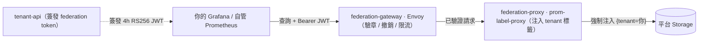

# Tenant Federation Integration Guide

> 租戶把**屬於自己**的 metrics 子集，從平台拉回租戶側自管的 Prometheus / VictoriaMetrics / Grafana。
> 本文件是租戶 onboarding 的操作指南；架構決策與取捨見 [ADR-020](../adr/020-tenant-federation.md)。

## 1. 概覽

### 1.1 這是什麼

Tenant federation 讓一個租戶用短效 token，向平台的 federation gateway 拉取**它自己** tenant 的 metrics，整合進租戶側既有的：

- 長期保存（租戶側合規 retention 需求超過平台預設）
- 既有 Grafana dashboard / oncall workflow
- 自管告警 evaluation（不依賴平台 Alertmanager）

平台**不自寫** federation endpoint —— 用既有開源 proxy（`prom-label-proxy`）強制把 `{tenant="<你>"}` 注入每一個查詢。跨租戶隔離 100% 來自這個 label 注入。

### 1.2 與平台內部 federation（ADR-004）的區別

本文件**不是** [`federation-integration.md`](federation-integration.md)（ADR-004）。兩者方向相反、信任邊界不同：

| | ADR-004 平台內部 federation | **ADR-020 tenant federation（本文件）** |
|---|---|---|
| 資料流向 | 邊緣叢集 → 平台中央（inbound）| 平台 → 租戶側（outbound）|
| 場景 | 平台聚合自己 N 個叢集 | 客戶把自己的資料拉出平台邊界 |
| 信任邊界 | 同組織內部 | 跨組織（cross-org）|
| 隔離需求 | 較寬鬆 | 嚴格 —— multi-tenant + audit |

資料離開平台控制邊界後可能被租戶再轉、再存，所以 tenant federation 的隔離與稽核要求更嚴。

## 2. 架構：請求怎麼走



你的請求穿過三層，每層做一件事：

| 層 | 元件 | 對你的請求做什麼 |
|---|---|---|
| Gateway | Envoy | 驗 RS256 簽章、查撤銷集、per-token / per-IP 限流 |
| Proxy | prom-label-proxy | 強制把 `{tenant="<你>"}` 注入每個 selector —— 你只查得到自己的資料 |
| Storage | Prometheus / VictoriaMetrics | 執行查詢，受查詢資源上限保護 |

三層任一層擋下，請求就回對應的錯誤碼（見 §6）。

## 3. Onboarding：取得 federation token

### 3.1 簽發

federation token 由 **tenant-api** 簽發 —— 對目標租戶具 **admin** 權限者才能簽（資料域外持出，門檻高於一般 config write）：

```sh
curl -X POST "$TENANT_API/api/v1/federation/tokens" \
  -H "Content-Type: application/json" \
  -d '{"tenant_id": "<你的 tenant>", "description": "grafana-prod"}'
```

回傳含簽好的 JWT（compact 字串）與其 `token_id`。token：

- **RS256 簽章**，claim 帶 `tenant_id`（proxy 注入 label 用）、`token_id`（gateway 限流 key）、`iss=tenant-api`、`aud=tenant-federation`。
- **TTL 預設 4h**（平台可調）。**無 sliding refresh** —— 過期前自行重新簽發。
- 每租戶最多 **16 個**有效 token（超出回 `409`）；每分鐘簽發有上限（超出回 `429`）。

### 3.2 列出 / 撤銷

```sh
# 列出本租戶當前的 token（只回 metadata，不回 JWT 本身）
curl "$TENANT_API/api/v1/federation/tokens?tenant_id=<你的 tenant>"

# 撤銷
curl -X DELETE "$TENANT_API/api/v1/federation/tokens/<token_id>"
```

撤銷是**最終一致**的 —— 見 §7.1。

## 4. 設定你的 Prometheus / Grafana 拉取

平台會給你一個 **federation gateway URL**（記為 `$FED_GW`）。token 一律放 `Authorization: Bearer <jwt>` header —— **不要**放 URL query string（gateway 只認 header，URL 帶 token 一律拒絕、且會落進 log）。

### 4.1 Prometheus federation（持續拉取）

租戶側 Prometheus 用一個 `scrape_config` 持續聯邦平台的 `/federate`：

```yaml
# 租戶側 prometheus.yml
scrape_configs:
  - job_name: platform-federation
    metrics_path: /federate
    scheme: https
    honor_labels: true
    # 防爆量：單次 federate scrape 的 sample 上限（見 §7.2）
    sample_limit: 100000
    params:
      'match[]':
        - '{__name__=~"http_requests_total|node_cpu_seconds_total"}'
    authorization:
      type: Bearer
      credentials: '<federation JWT>'
    static_configs:
      - targets: ['<FED_GW host:port>']
```

### 4.2 Grafana data source（儀表板查詢）

在租戶側 Grafana 新增一個 Prometheus data source：

- **URL**：`$FED_GW`
- **Custom HTTP Header**：`Authorization` = `Bearer <federation JWT>`

之後 dashboard 的 `/api/v1/query` / `/query_range` 都會走 gateway。

### 4.3 支援的 read API

`prom-label-proxy` 只能對**文字查詢 API** 強制注入 tenant label，所以 gateway 只放行這些：

| 可用 | `/api/v1/query`、`/api/v1/query_range`、`/api/v1/series`、`/api/v1/labels`、`/api/v1/label/<name>/values`、`/federate` |
|---|---|
| **不支援** | Prometheus `remote_read`（`/api/v1/read`）—— 它的 Snappy-framed protobuf body 無法被 label-scope，gateway 直接回 `403`。請改用 `/api/v1/query[_range]` 或 `/federate` |

## 5. 你能拉什麼：2-tier policy

可 federate 的 metric 由兩層政策決定：

```
Platform whitelist（平台 maintainer 策展）
        ↓ 取交集
Tenant subset（你自選的子集，經 API 自助管理）
```

- **Platform whitelist**（`_federation_policy.yaml`）：平台決定「哪些 metric 開放給 federation」的目錄。
- **Tenant subset**（`conf.d/_federation/<你>.yaml`）：你從 whitelist 中挑自己要的子集，經 `PUT /api/v1/tenants/{id}/federation` 自助管理（需該租戶 admin）。

範例 subset：

```yaml
# conf.d/_federation/<你的 tenant>.yaml
metrics:
  - http_requests_total
  - node_cpu_seconds_total
  - process_open_fds
```

> **重要 —— whitelist 是治理機制，不是查詢期安全邊界。** 跨租戶隔離 100% 來自 proxy 的 `{tenant="<你>"}` 注入：你查 whitelist 以外的 metric，proxy 一樣只回你自己 tenant 的資料（查你自己的 custom metric 因此是 feature）。whitelist 決定 UI catalogue 與策展，**不在查詢路徑硬擋**。

要新增 whitelist 外的 metric，聯絡平台團隊 —— 平台會跑 admission validator 確認該 metric 真的帶 `tenant` label（否則 federate 後對所有租戶都是空集）。

## 6. 配額與限制：你會撞到的回應碼

| 碼 | 意義 | 怎麼辦 |
|---|---|---|
| `429` | 撞到 per-token 速率上限 | 退避重試。gateway 回 `x-ratelimit-{limit,remaining,reset}` header，照 `reset` 退避。預設 per-token 上限偏保守（chart 預設 15 req/min，平台可調 15–60）—— 一個 token 不要同時餵多個高頻 dashboard；必要時多簽幾個 token 分流 |
| `422` | 查詢觸發 storage 的查詢資源上限（`--query.max-samples`）| 你的查詢掃了太多 series / sample。縮小時間範圍、加細 label selector、或分段查詢（見 §7.2）|
| `413` | 請求 body 超過 1 MiB | PromQL 選擇器太長。拆成多個較小的查詢 |
| `403` | token 已撤銷 / 已過期、或打到 `remote_read` | 重新簽發 token；remote_read 改用 query API |
| `401` | 簽章 / `iss` / `aud` 驗證失敗 | token 壞了或不是這個平台簽的 —— 重新簽發 |

per-token 與 per-tenant 雙層限流是**軟性**上限（per-gateway-instance）。真正的硬上限是 storage 層的查詢資源 cap。

## 7. Day-2 行為（務必理解）

### 7.1 撤銷是最終一致的（~1–2 分鐘）

`DELETE` 一個 token 後，**不是即時生效**。撤銷 id 寫進平台的撤銷集，再經 kubelet projected-volume 同步（~1 分鐘）+ gateway 30s 重讀閘 —— 合計**最長約 1–2 分鐘**舊 token 仍可能通過。

這是**最終一致（eventual consistency）**，分散式系統的標準取捨（平台放棄 server-side revocation list，對價是 gateway 限流 + 4h TTL），非缺陷。若你的合規流程要求「撤銷即時生效」，請知悉這個窗口。

### 7.2 斷線後不要「報復性 catch-up 查詢」

租戶側 Prometheus / Grafana 斷線一段時間後，常見的陷阱是「想一次補齊」—— 發一個超大時間範圍的 `query_range` 把缺口填回來。這會：

1. 掃過大量 series × sample → 撞 storage 的 `--query.max-samples` → `422`。
2. 若你的工具對 `422` 無腦重試 → retry loop 永遠卡死，never recovers。

**正確做法**：

- **`/federate` scrape**：在租戶側 scrape job 設 `sample_limit`（見 §4.1）—— 單次 federate 的攝入量有上限，一次抓爆不會發生。federation scrape 是時間點快照，漏掉的 scrape 就是資料缺口，**不會也不該自動 backfill**。
- **要補歷史資料**：**手動分段（chunking）** —— 不要一個 `query_range` 拉 30 天，改成逐日 / 逐小時多次查詢，每段都遠在 `--query.max-samples` 之下。
- 對 `422` / `429` 一律**退避**重試，不要 tight loop。

## 8. 驗證 / Troubleshooting

| 症狀 | 可能原因 |
|---|---|
| 查詢回 200 但 result 為空 | 該 metric 在平台 data-layer 沒帶 `tenant` label（federate 後即空集）—— 聯絡平台團隊；或該 metric 不在你的時間範圍內有資料 |
| 全部請求 `401` | token 過期 / 壞了 / 不是本平台簽的 —— 重新簽發 |
| 撤銷後舊 token 仍可用 | 正常 —— 最終一致，等 ~1–2 分鐘（§7.1）|
| `query_range` 一直 `422` | catch-up 查詢撞 storage cap —— 分段查詢（§7.2）|
| Grafana "Save & Test" 行為異常 | 確認 data source URL 是 `$FED_GW`、且 `Authorization: Bearer` header 已設 |

驗證 onboarding 成功：

```sh
curl -H "Authorization: Bearer <jwt>" \
  "$FED_GW/api/v1/query?query=process_open_fds"
# 預期 200，且 result 內每個 series 的 tenant label 都是你自己
```

## 相關資源

| 資源 | 相關性 |
|------|--------|
| [ADR-020 — Tenant Federation](../adr/020-tenant-federation.md) | ⭐⭐⭐ 架構決策與取捨 |
| `helm/federation-gateway` chart README | ⭐⭐ 平台端 gateway 部署 |
| `helm/federation-proxy` chart README | ⭐⭐ 平台端 proxy 部署 |
| [Federation Integration Guide (ADR-004)](federation-integration.md) | ⭐ 平台內部多叢集 federation（方向相反，勿混淆）|
