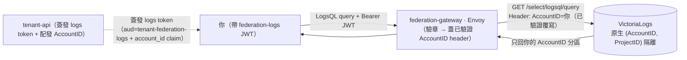

# Tenant Log Query Integration Guide

> 租戶在**平台上就地查詢**屬於**自己**的營運 log（query-in-place，不拉回租戶側）。
>
> 本指南是 [Tenant Federation 整合指南](tenant-federation.md)（metrics 拉回）的**姊妹件**：
> 那篇讓你把 metrics **拉回**自有 infra（pull-back）；這篇讓你在平台上**就地查**自己的
> log（query-in-place）。資料流向與隔離原語不同，但**授權平面複用同一套 federation-gateway**。
>
> **EN mirror**：依平台語言政策（中文為主 SSOT、不執行 ZH→EN 遷移），本指南為 ZH-only
> （同 [ADR-021](../adr/021-tenant-log-query-federation.md) §語言、姊妹件 `tenant-federation.md`）。

## 0. 這版你能查什麼（先設定預期）

MVP（Phase 1）只開放 **(b) 平台營運 log**——「平台**關於你這個租戶**」的營運可觀測性：
你的 federation 查詢行為、告警 eval、federation audit 等。**不是**你 workload 的應用 log
（那是 (a)，列 [Phase 2 defer-with-trigger](../adr/021-tenant-log-query-federation.md)）。

- ✅ **可查**：你自己的 `federation_audit` 列（你查了什麼、結果碼、延遲…），且**已淨化**
  （看不到平台基礎設施拓樸、看不到他租戶）。
- ⛔ **查不到**：他租戶的任何 log（硬隔離）、平台基礎設施欄位（拓樸 / 後端 IP）、你 workload
  的應用 log（Phase 2）。
- 詳細策展邊界見 §5（2-tier 可見度）。

## 1. 概覽：隔離怎麼來的

平台**只負責授權平面**——身分解析 + query path 強制隔離 + 可見度策展。跨租戶隔離 **100%**
來自 **VictoriaLogs 原生 `(AccountID, ProjectID)` 租戶模型**：每個租戶有一個穩定的數值
`AccountID`，你的查詢只會回你自己 `AccountID` 分區的資料。

平台**不自寫** log query endpoint、**不自寫** LogsQL filter——gateway 從你**已驗證**的 token
注入 `AccountID` header，VictoriaLogs 原生只回該分區（連 metadata 類 endpoint 如
`field_values` 也受同一 `AccountID` 約束，查不到別人的 field/stream 值）。



> **與 metrics federation 的關鍵差異**：metrics 端用 `prom-label-proxy` 注入
> `{tenant="你"}` label；log 端用 VictoriaLogs 原生 `AccountID` **header**。能力以
> **audience** 切（見 §3）——你的 metrics token 打不到 log endpoint，反之亦然。

## 2. 平台側 onboarding 配發紀律（給平台工程師）

> 本節是**平台工程師 onboarding 一個租戶做 log query 時**的紀律，租戶端操作者可略過直接看 §3。

讓一個租戶能查 log，平台側要做兩步配發，且兩步都有 **security-critical** 紀律：

### 2.1 AccountID 配發（tenant-api，單調、永不回收）

租戶的 `account_id`（uint32）由 tenant-api 從 **Git 帳號 registry**（`_account_registry.yaml`）
**單調發號**（`next_account_id` high-water mark，從 1000 起；0 = 平台 default，1–999 系統保留）。

- **冪等**：同租戶必得同號（重跑不洗號）。
- ⛔ **永不回收**：退租**不**釋放 id——退租後把同號配給新租戶、舊 log 還在 retention 窗內
  → 新租戶讀得到前租戶殘留 log = **跨租戶洩漏**。registry 是 monotonic tombstone（發過的
  號永不重發；連 `git revert` 計數器也擋不回——allocator 讀 git 歷史最大值當下限）。
- **配發方式**：onboarding 時 tenant-api 自動配（首次簽 logs token 即配）；或對既有租戶批次
  補配 `POST /api/v1/federation/accounts/backfill`（admin-only、冪等）。

### 2.2 把配發投影進 `tenantProjections`（GitOps，對照 registry）

租戶能**查**到 log 的前提是 Vector 已把它的 `federation_audit` 列**淨化投影**進它的
`AccountID` 分區。這要在 `helm/vector/values.yaml` 的 `tenantProjections` 加一筆：

```yaml
# helm/vector/values.yaml
tenantProjections:
  - tenantId: "<租戶 id>"      # 必須與 federation JWT 的 tenant_id claim 逐字相同
    accountId: 1000            # 從 _account_registry.yaml 抄這個租戶的 account_id
```

> ⛔ **配發紀律（一筆寫錯 = 跨租戶洩漏，PR review 必對照）**：
> - `accountId` **從 `_account_registry.yaml` 抄**（該 registry 是 SSOT）——**不要**自己編號、
>   **永不**重用退租號。重複 `accountId` 會把兩租戶混進同一分區（render-time `{{ fail }}` 會擋
>   重複，但仍以 registry 為準）。
> - `tenantId` **必須**與 federation-gateway audit JSON 的 `.tenant_id`（即 JWT `tenant_id` claim）
>   **逐字相同**——對不上的列拿不到投影（fail-closed 落 `0:0`，不會誤落他租戶，但該租戶會查到空）。
> - 這是 **registry-desync 的流程防線**（平台側精準偵測列為後續強化，故配發紀律是第一道防線）：投影是 registry 的 reviewed、
>   GitOps 版控**投影**，靠 PR review 對照 registry 把關（Phase 1 為 static-N 手抄；Phase 2 (a)
>   會 from-registry 自動產生）。

詳細運作（fan-out 雙寫、淨化、Layer-1 護欄、`vector test` 自證）見
[平台日誌彙整 runbook §8](../internal/platform-log-aggregation-runbook.md)。

## 3. 取得 logs token（租戶端）

federation token 由 **tenant-api** 簽發，對目標租戶具 **admin** 權限者才能簽（資料域外持出，
門檻高於一般 config write）。**查 log 要用 `capability=logs` 的 token**：

```sh
curl -X POST "$TENANT_API/api/v1/federation/tokens" \
  -H "Content-Type: application/json" \
  -d '{"tenant_id": "<你的 tenant>", "capability": "logs", "description": "log-query"}'
```

回傳含簽好的 JWT 與其 `token_id`。logs token 與 metrics token 的關鍵差別：

| | metrics token（拉 metrics）| **logs token（查 log，本指南）** |
|---|---|---|
| `capability` | `metrics`（預設，可省略）| **`logs`** |
| `aud`（audience）| `tenant-federation` | **`tenant-federation-logs`** |
| 內嵌 claim | `tenant_id` / `token_id` | `tenant_id` / `token_id` + **`account_id`（數值）** |
| 能打的 endpoint | metrics query API | VictoriaLogs LogsQL query/metadata API |

> ⛔ **能力以 audience 強制隔離**：logs token 的 audience 是 `tenant-federation-logs`，
> gateway 的 `jwt_authn` **原生**強制——拿 **metrics token（`aud=tenant-federation`）打 log
> endpoint 會直接 `403`**（audience 不符，連 Lua 都進不到），反之亦然。這是最小權限：一把 token 不能跨平面重放。

token 的 TTL / 列出 / 撤銷 / 自動換發、每租戶 16 把上限等，與 metrics token **完全相同**——
見 [Tenant Federation 指南 §3](tenant-federation.md)（同一套 token 機制，只是 `capability` 與
`aud` 不同）。

## 4. 怎麼查：gateway endpoint

平台給你一個 **federation gateway URL**（記為 `$FED_GW`，log query 用的 gateway 跑在
`victorialogs` mode）。token 一律放 `Authorization: Bearer <jwt>` header——**不要**放 URL
query string（gateway 只認 header）。

```sh
# 查你自己最近的 federation_audit log（LogsQL）
curl -H "Authorization: Bearer <logs-jwt>" \
  "$FED_GW/select/logsql/query" \
  --data-urlencode 'query=log_type:federation_audit' \
  --data-urlencode 'limit=100'
```

回 `200` + 你自己 `AccountID` 分區裡、已淨化的 `federation_audit` 列 = 成功。**剛 onboard
查到空結果是正常的**——見 §6。

### 4.1 可用的 endpoint（default-deny 白名單）

gateway 採 **default-deny 白名單**——只放行 VictoriaLogs 的 LogsQL **query / metadata** endpoint，
其餘（含寫入面 `/insert/*`、跨租戶列舉、長連線 `/tail`、任何未知/未來 endpoint）一律 `403`：

| 可用 | `/select/logsql/query`、`/hits`、`/facets`、`/stats_query`、`/stats_query_range`、`/streams`、`/stream_ids`、`/stream_field_names`、`/stream_field_values`、`/field_names`、`/field_values` |
|---|---|
| **不支援** | `/select/logsql/tail`（live 長連線——繞過查詢時限、佔並發槽；audit 查詢不需即時 tail）、任何 `/insert/*` 寫入、任何未列出的 endpoint → `403` |

> metadata endpoint（`field_values` / `stream_field_values` 等）**同樣只回你自己 AccountID**
> 的值——查不到別人的 field/stream，metadata leak 由原生租戶模型自動擋掉。

## 5. 你能看到什麼：2-tier 可見度

可見範圍由兩層策展決定（**治理機制，不是查詢期安全邊界**——硬隔離已由 AccountID 分區 +
ingest-time 淨化擔保）：

```
Tier-1 platform whitelist（平台 maintainer 策展）：哪些 stream class 可投影給租戶
            ↓ 只有 federation_audit 且帶有效 tenant_id 的列
Tier-2 tenant-visible field subset：該列被淨化後只保留的安全欄位
            ↓ 寫進你的 AccountID 分區
VictoriaLogs (AccountID, ProjectID)：強制隔離
```

- **你看得到**：`log_type=federation_audit` 的列，且只含淨化後的**自己**請求欄位——
  `tenant_id` / `status` / `method` / `path` / `query`（你的 LogsQL）/ `token_id` /
  `duration_ms` / `response_flags` / `timestamp`，外加跨分區 join 用的 `log_event_id`。
- **你看不到**（即使在自己分區）：平台基礎設施拓樸（後端 IP `upstream`、`pod_name` /
  `pod_node` / `node_name`、`k8s_namespace` 命名）——這些在寫進你的分區**前**就被結構性
  移除（fail-closed allowlist，不是事後過濾）；以及平台 ops-only stream（`gateway_operational`
  / `suspicious_audit` / 平台查詢成本 log / JWT-fail 列）——永遠 platform-only，不投影。

完整 tier-1 / tier-2 策展對照（含 enforced SSOT）見
[2-Tier 日誌可見度 Catalogue](../internal/log-visibility-2tier-catalogue.md)。

> **值班報修 tip**：你的淨化截圖裡有個 `log_event_id`（time-sortable UUIDv7）。報修時附上它，平台
> 值班可用它跨分區 join 回平台完整副本拿到 node / 後端等你看不到的資訊——淨化不會拖長排查。

## 6. Day-2 行為（務必理解）

### 6.1 剛 onboard、查到空結果是正常的（empty 非 error）

剛配發完、你還沒有任何 federation 查詢活動時，查 log 會回 **`200` + 空結果**——這是**預期行為，
不是錯誤**。租戶分區**只有 Day 0（投影上線）起的歷史**——這是新功能，**沒有歷史 backfill**。
產生一兩筆活動（例如跑一次你自己的 metrics federation 查詢、或等告警 eval）後再查就有資料了。

> 同 metrics federation 的 cold-start 精神（[Tenant Federation 指南 §8](tenant-federation.md)
> 「查詢回 200 但 result 為空」）。空結果**不要**無腦重試或當故障報修。

### 6.2 撤銷是最終一致的；查詢資源有上限

- **撤銷延遲**：`DELETE` 一個 token 後不是即時生效（最終一致，~1–2 分鐘窗）——同 metrics
  token（[§7.1](tenant-federation.md)）。
- **查詢資源上限**：log 查詢受 VictoriaLogs Layer-1 護欄保護——主要是**時間範圍上限**
  （`-search.maxQueryTimeRange`，例如 7d）+ 單查詢執行時限。⚠️ **log 沒有 metrics 的
  sample cap**，請務必**帶時間過濾 + `limit`**；無時間過濾 / 過寬範圍的查詢會被擋。並發查詢
  也有上限（RAM 保護）。

## 7. 回應碼速查

| 碼 | 意義 | 怎麼辦 |
|---|---|---|
| `401` | 簽章 / `iss` 驗證失敗、token 缺失或壞了/不是本平台簽的（**注意：audience 不符不是 401，見下 403**）| 確認 token 完整且為本平台簽發；重新簽（§3）|
| `403` | **最常見：拿 metrics token（`aud=tenant-federation`）打 log endpoint**——audience 不符，Envoy `jwt_authn` 原生回 `403 "Audiences in Jwt are not allowed"`；或 token 已撤銷/過期；或缺/壞 `account_id` claim（Lua fail-closed）；或打到**非白名單** endpoint（`/tail`、`/insert/*`、未知 path）| 用 `capability=logs`（`aud=tenant-federation-logs`）重新簽（§3）；改用白名單內的 query/metadata endpoint（§4.1）|
| `200` + 空 result | 你還沒有 log 活動（cold-start）、或時間範圍內無資料 | 正常——產生活動後再查（§6.1），勿無腦重試 |
| `429` | 撞 per-token / per-tenant 速率上限 | 退避重試；可多簽 token 分流（同 metrics）|
| `413` | 請求 body 超過 1 MiB | LogsQL query 太長，拆小 |

## 8. Troubleshooting

| 症狀 | 可能原因 |
|---|---|
| 全部請求 `403`（body 含 `Audiences in Jwt are not allowed`）| 多半是**用錯 token**——log query 要 `capability=logs`（`aud=tenant-federation-logs`）的 token，不是 metrics token；重新簽（§3）|
| 查詢回 `200` 但 result 一直空 | cold-start（你還沒 federation 活動，§6.1）；或時間範圍內無資料；或平台側**還沒**把你配進 `tenantProjections`（§2.2）——聯絡平台團隊確認你的投影已上線 |
| 打某 endpoint 一律 `403` | 該 endpoint 不在白名單（`/tail`、`/insert/*`、未知 path）——改用 §4.1 列出的 query/metadata endpoint |
| 看不到某些欄位（node / 後端 IP）| **設計如此**——tier-2 淨化把基礎設施拓樸結構性移除（§5）；報修請附 `log_event_id` 讓平台值班 join 回完整副本 |

## 相關資源

| 資源 | 相關性 |
|------|--------|
| [ADR-021 — Tenant Log Query Federation](../adr/021-tenant-log-query-federation.md) | ⭐⭐⭐ 架構決策與取捨 |
| [Tenant Federation 整合指南](tenant-federation.md) | ⭐⭐⭐ 姊妹件（metrics 拉回；token 機制同源）|
| [2-Tier 日誌可見度 Catalogue](../internal/log-visibility-2tier-catalogue.md) | ⭐⭐ 你看得到哪些 stream / field 的完整策展對照 |
| [平台日誌彙整 runbook §8](../internal/platform-log-aggregation-runbook.md) | ⭐⭐ 平台端 (b) 投影運作（給平台工程師）|
| `helm/federation-gateway` chart README | ⭐ 平台端 gateway `victorialogs` mode 部署 |
