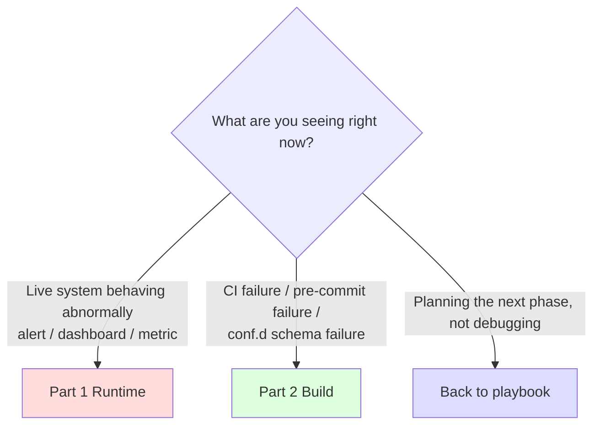

# Troubleshooting Checklist

> **When to use this**: (1) on-call at 3 AM, seeing alert / dashboard anomalies, needing diagnosis within 5 minutes; (2) CI / `conf.d` build failure, figuring out what broke. **Not for**: feature design discussion, phase planning — go back to the corresponding phase narrative in [multi-system migration playbook](../scenarios/multi-system-migration-playbook.en.md).
>
> **Page structure**: Part 1 = Runtime (live system anomalies) / Part 2 = Build (CI- and conf.d-side failures). **Fully separated** — different reader contexts, different mental contexts.

---

## 0. Pick the right Part in 5 seconds



**Best usage**: `Ctrl-F` the exact symptom string you're seeing (try both Chinese and English). The `H3` titles in this doc are deliberately written as "what a user would type into a search box" rather than "architectural component names".

---

## Part 1 — Runtime (live system anomalies)

### 1.1 Metric not appearing in VM

#### 1.1.1 vmagent target DOWN, scrape exporter fails

**Symptom**:
- vmagent target page shows an exporter as `DOWN`
- vmagent log contains `context deadline exceeded` or `connection refused`
- VM `/api/v1/query` returns empty for the exporter's metrics

**Quick diagnosis (run in order)**:

```bash
# 1. Is the exporter pod itself alive?
kubectl get pod -n <exporter-ns> -l app=threshold-exporter
# expected: STATUS=Running, READY=1/1

# 2. Does the exporter's /metrics respond from inside the pod (curl localhost)?
kubectl exec -n <exporter-ns> <exporter-pod> -- curl -sS localhost:8080/metrics | head -5
# expected: a Prometheus exposition opening like "# HELP user_threshold ..."

# 3. Can the vmagent pod reach the exporter from its network position?
kubectl exec -n <vmagent-ns> <vmagent-pod> -- \
    curl -sS --max-time 5 http://<exporter-svc>.<exporter-ns>.svc:8080/metrics | head -5
# expected: same as above / failure = NetworkPolicy / Service / DNS issue
```

**Most likely cause**: **NetworkPolicy ingress not opened** — the exporter pod's NetworkPolicy only allows its own namespace in; it hasn't opened port 8080 from the vmagent namespace.

**Fix**:

```yaml
# Add an ingress rule to the exporter NS's NetworkPolicy
spec:
  ingress:
    - from:
        - namespaceSelector:
            matchLabels:
              kubernetes.io/metadata.name: <vmagent-ns>
      ports:
        - port: 8080
          protocol: TCP
```

**If not this**:
- (a) Service selector wrong → `kubectl describe svc <exporter-svc>` and check whether endpoints have the pod IP
- (b) DNS resolution failing (rare) → from inside vmagent pod, `nslookup <exporter-svc>.<ns>.svc`
- (c) Exporter listening on `127.0.0.1` instead of `0.0.0.0` → `kubectl exec ... -- ss -tlnp`

**Cross-ref**: playbook §12 Phase 1 catalog row "NetworkPolicy blocks vmagent/Prom from scraping the exporter"

---

#### 1.1.2 vmagent scrapes OK but VM doesn't ingest (remote_write stuck)

**Symptom**:
- vmagent target page shows all targets `UP`, scrape works
- But `/api/v1/query` on the VM side can't find the metric, or it's frozen at a timestamp from minutes/hours ago
- vmagent log contains `dropping data block` / `cannot send block` / `connection reset`
- Customer ops says "dashboard shows old data, looks like the metrics are frozen"

**Quick diagnosis**:

```bash
# 1. vmagent side: is buffer accumulating (the critical indicator)?
kubectl exec <vmagent-pod> -- wget -qO- localhost:8429/metrics | \
    grep -E '^vmagent_remotewrite_(pending_data_bytes|requests_total|errors_total|conn)'
# expected if broken:
#   vmagent_remotewrite_pending_data_bytes sustained > 0 and growing
#   vmagent_remotewrite_errors_total increasing
#   vmagent_remotewrite_conn{...} lower than expected

# 2. VM ingest side: actual incoming row rate
kubectl exec <vminsert-pod> -- wget -qO- localhost:8480/metrics | \
    grep -E '^vm_rows_inserted_total|^vm_http_request_errors_total'
# expected if broken: rows_inserted rate drops; errors_total 5xx rises

# 3. Timestamp diff between the two sides (data lag)
PROM_LATEST=$(kubectl exec <prom-pod> -- wget -qO- \
    'localhost:9090/api/v1/query?query=time()-max(timestamp(up))' | jq '.data.result[0].value[1]')
VM_LATEST=$(kubectl exec <vmselect-pod> -- wget -qO- \
    'localhost:8481/select/0/prometheus/api/v1/query?query=time()-max(timestamp(up))' | jq '.data.result[0].value[1]')
echo "Prom lag: ${PROM_LATEST}s, VM lag: ${VM_LATEST}s"
# expected if broken: VM lag is much higher than Prom (hundreds of seconds to hours)
```

**Most likely cause**: **vminsert capacity exhausted** — vmagent pushes data to vminsert, which writes to vmstorage slowly or fails (disk full, replication factor not satisfied, network partition). vminsert returns 5xx; vmagent's disk buffer accumulates.

**Second most likely**: **NetworkPolicy path change** — a NetworkPolicy / service-mesh rule suddenly blocked port 8480 between vmagent and vminsert (the TCP connection appears open but vminsert refuses from its end).

**Fix (branch by root cause)**:

```bash
# Branch A: vminsert capacity issue
# Check vmstorage disk
kubectl exec <vmstorage-pod> -- df -h /vmstorage
# If > 95% → follow §1.4.3 disk red-zone handling (PVC expand)
# If disk OK but vminsert still 5xx → check vmstorage replication factor
kubectl get statefulset vmstorage -o jsonpath='{.spec.replicas}'
# If replicas < replicationFactor setting → vminsert rejects (waiting for quorum)

# Branch B: network path issue
# curl vminsert directly from the vmagent pod
kubectl exec <vmagent-pod> -- \
    curl -sS --max-time 5 http://<vminsert-svc>.<vm-ns>.svc:8480/insert/0/prometheus/api/v1/import/prometheus -d '' -i
# expected: HTTP 200 / 204; if connection refused / timeout = NetworkPolicy issue
# Check NetworkPolicy
kubectl get networkpolicy -n <vm-ns>

# Branch C: vmagent persistent buffer full, buffer itself causes an OOM loop
# Check vmagent persistent buffer usage (path depends on -remoteWrite.tmpDataPath)
kubectl exec <vmagent-pod> -- df -h /vmagent-data
kubectl exec <vmagent-pod> -- du -sh /vmagent-data/remotewrite/*

# ☢️ Fatal misconception: simply restarting vmagent / deleting the pod won't fix this
# vmagent's persistent buffer is "persistent" (PVC-backed); a new pod after restart mounts the same PVC
# Sees the buffer still full → loads tens of GBs of backlog into memory on startup → OOMKilled again → infinite loop
# Head-of-line blocking: latest metrics can never get through until the buffer is cleared

# ✅ Correct "accept data loss to force unblock" procedure (three steps, strict order)

# Step 1: close the inflow valve (stop vmagent writes)
kubectl scale deployment vmagent -n <vmagent-ns> --replicas=0
kubectl wait --for=delete pod -l app=vmagent -n <vmagent-ns> --timeout=60s

# Step 2: physically delete the buffered backlog inside the PVC
# Method A: use a debug pod mounting the same PVC to run rm
kubectl run vmagent-buffer-cleanup --rm -it --restart=Never \
    --image=busybox \
    --overrides='{"spec":{"containers":[{"name":"cleanup","image":"busybox","command":["sh"],"stdin":true,"tty":true,"volumeMounts":[{"mountPath":"/vmagent-data","name":"data"}]}],"volumes":[{"name":"data","persistentVolumeClaim":{"claimName":"<vmagent-pvc-name>"}}]}}' \
    -- sh
# Inside the debug pod:
# rm -rf /vmagent-data/remotewrite/*
# exit

# Method B: if the PVC is on the original pod, scale up to replica=1 but with entrypoint changed to sleep
# Not recommended — easy to race with vmagent startup; Method A is cleaner

# Step 3: bump resources + scale up
kubectl set resources deployment vmagent -n <vmagent-ns> \
    --limits=memory=2Gi,cpu=2 --requests=memory=1Gi,cpu=500m
# Also expand the PVC (to avoid recurrence)
kubectl edit pvc <vmagent-pvc> -n <vmagent-ns>   # modify spec.resources.requests.storage
kubectl scale deployment vmagent -n <vmagent-ns> --replicas=1
kubectl wait --for=condition=ready pod -l app=vmagent -n <vmagent-ns> --timeout=120s

# Verify: once vmagent is back up, pending_data_bytes should start at 0 and not spike immediately
kubectl exec <new-vmagent-pod> -- wget -qO- localhost:8429/metrics | \
    grep '^vmagent_remotewrite_pending_data_bytes'
```

**Post-fix verification**:

```bash
# Wait 5-10 minutes
# 1. pending_data_bytes should fall back to ~0
# 2. VM-side vm_rows_inserted_total rate returns to normal baseline
# 3. Timestamp diff between the two sides should be < 1 minute
```

**If not this**:
- (a) There's an ingress controller / load balancer between vmagent and vminsert whose idle timeout kills long-lived connections → vmagent must retry, but if retry failure rate > 50% the buffer piles up. Set the LB idle timeout > 60s
- (b) vminsert rejects specific metrics (e.g. has a `-relabelConfig` drop) → check vminsert startup parameters
- (c) Clock skew: vmagent and vminsert pod clocks differ by > scrape interval → vminsert treats samples as out-of-order and rejects. Verify NTP / chrony

**Cross-ref**:
- §1.4.1 vmagent OOMKilled (buffer accumulation → OOM is the downstream extension of this)
- §1.4.2 Prom OOM / vminsert 503 (the Option 2 path version of the same issue)
- §1.4.3 VM disk full (vminsert 5xx's most common root cause)
- playbook §12 Phase 1: vmagent `pending_data_bytes` sustained > 0

---

### 1.2 Alerts don't fire (rule evaluator side)

#### 1.2.1 Rule evaluator hasn't reloaded (rules changed but behaviour unchanged)

**Symptom**:
- git commit is merged, `conf.d` should have changed, but alert behaviour is still the old version
- Customer ops asks "I changed it, why is it the same?"

**Quick diagnosis**:

```bash
# 1. Has the ConfigMap / mounted file actually reached the pod?
kubectl exec -n <prom-ns> <prom-pod> -- cat /etc/prometheus/rules/<file>.yaml | head -20

# 2. Has the evaluator actually reloaded?
kubectl exec -n <prom-ns> <prom-pod> -- \
    wget -qO- localhost:9090/api/v1/status/config | head -5
# Or for vmalert
kubectl exec -n <vmalert-ns> <vmalert-pod> -- \
    wget -qO- localhost:8080/api/v1/status/config | head -5

# 3. Timestamp of last reload (Prom-specific)
kubectl exec -n <prom-ns> <prom-pod> -- \
    wget -qO- localhost:9090/api/v1/status/runtimeinfo | grep -i reload
```

**Most likely cause**: **GitOps reconcile stuck** — commit is merged but ArgoCD / Flux is in backoff or the webhook didn't trigger sync; the pod is still mounting the old ConfigMap generation.

**Fix**:

```bash
# ArgoCD: force sync
argocd app sync <app-name>

# Flux: force reconcile
flux reconcile kustomization <name> --with-source

# If ConfigMap is updated but the pod hasn't re-mounted (projected volume timing)
kubectl rollout restart deployment <prom-deploy> -n <prom-ns>
# Or for StatefulSet
kubectl rollout restart statefulset <prom-sts> -n <prom-ns>
```

**If not this**:
- (a) Prometheus Operator still reconciling PrometheusRule CRD → `kubectl describe prometheusrule <name>` and check events
- (b) Reload endpoint itself failing (PromQL syntax error in new rule) → Prom keeps the old config; log contains `reloading config failed`. Fix the syntax and re-commit
- (c) In HA Prom, only one of two replicas reloads → see §1.5.1

**Cross-ref**: playbook §12 Phase 2 catalog row "New rules don't fire (shadow alert volume = 0)"

---

#### 1.2.2 Shadow label not removed (still routed to /dev/null after cutover)

**Symptom**:
- Phase 3 cutover executed (the `migration_status: shadow` label has been removed from a tenant's rules in the rule config)
- That tenant still doesn't receive alerts at the production receiver (dashboard shows alerts firing but the receiver is silent)

**Quick diagnosis**:

```bash
# 1. Rule side: does that rule's alert label still carry shadow?
kubectl exec -n <prom-ns> <prom-pod> -- \
    wget -qO- 'localhost:9090/api/v1/rules?type=alert' | \
    jq '.data.groups[].rules[] | select(.name | contains("<rule-name>")) | .labels'
# expected: no migration_status: shadow

# 2. AM side: do alert payloads still carry the shadow label?
kubectl exec -n <am-ns> <am-pod> -- \
    wget -qO- 'localhost:9093/api/v2/alerts?filter=alertname=<name>' | \
    jq '.[].labels'
# expected: no migration_status: shadow
```

**Most likely cause**: **rule config was changed correctly but the evaluator hasn't reloaded** (follow on to §1.2.1).

**Second most likely cause**: **wrong place was changed** — the matcher was modified in AM config instead of removing the label from the rule. Phase 3's correct mechanism is to change the rule, not AM.

**Fix**:

```bash
# Confirm the change is on the rule side: grep conf.d for that tenant's rules
grep -rn "migration_status:" conf.d/<domain>/<region>/<tenant>.yaml
# expected: no results (already stripped)

# AM config should not have been touched
diff <(kubectl get cm am-config -o yaml) <previous-am-config>
# expected: no diff
```

**If not this**:
- AM `null` receiver is still catching shadow → but the rule label is already stripped, so in theory the shadow matcher shouldn't match. Unless there's a fall-through bug in routing order → see §1.3.1

**Cross-ref**: playbook §6 Phase 3 narrative "Common mistake: thinking you need to modify AM config" + playbook §12 Phase 3: Canary tenant really fires alert

---

### 1.3 Alerts fire but route incorrectly

#### 1.3.1 AM matcher order wrong (shadow alerts leak to production)

**Symptom**:
- Customer ops paged at night during the shadow period (shouldn't receive shadow alerts)
- Alert payload carries `migration_status="shadow"` label but was delivered to PagerDuty / Slack production channel

**Quick diagnosis**:

```bash
# 1. View AM's actual routing (amtool)
amtool config routes --config.file=/etc/alertmanager/alertmanager.yml show
# expected tree: shadow matcher should be the first child, not at the end

# 2. Simulate a shadow alert and trace its routing
amtool config routes test --config.file=/etc/alertmanager/alertmanager.yml \
    migration_status=shadow severity=critical alertname=TestAlert
# expected: receiver = "null"
```

**Most likely cause**: **shadow matcher is at the end of `route.routes` instead of the beginning** — a preceding catch-all route (e.g. `severity=critical`) intercepts first.

**Fix**: move the shadow matcher to the first entry under `routes`:

```yaml
route:
  receiver: default-receiver
  routes:
    - matchers: [migration_status="shadow"]   # ← must be first
      receiver: "null"
      continue: false                          # ← do not fall through
    - matchers: [severity="critical"]
      receiver: pagerduty
    # ... others
```

**If not this**:
- (a) `continue: true` accidentally lets the alert fall through → change to `continue: false`
- (b) Subtle matcher syntax differences between AM v0.27 and v0.32 → use `==`, not `=~`, unless you actually need regex
- (c) `null` receiver configuration missing (receiver name typo) → AM log contains `receiver "null" not found`

**Cross-ref**: playbook §12 Phase 2 catalog row "Shadow alerts leak to the production receiver"

---

#### 1.3.2 Silencer mismatch (disablement drift / double-fire alert storm)

**Symptom**:
- After cutover (Phase 3 full rollout or a Rule Pack v1→v2 upgrade), some alert class is **fired by both v1 and v2 rules simultaneously**
- AM dashboard shows the same alertname firing many times in a short window
- Customer ops asks "we clearly silenced `MySQLDown`, why is it still firing?"
- In severe cases, dozens of alerts all fire within 5–10 minutes (alert storm)

**Quick diagnosis**:

```bash
# 1. See currently active silencers
kubectl exec -n <am-ns> <am-pod> -- \
    wget -qO- 'localhost:9093/api/v2/silences?filter=state=active' | \
    jq '.[] | {id, matchers: .matchers, comment}'
# expected: see that the v1-alertname silencer is still active

# 2. See currently firing alert labels
kubectl exec -n <am-ns> <am-pod> -- \
    wget -qO- 'localhost:9093/api/v2/alerts?filter=state=active' | \
    jq '.[] | {labels: .labels, status: .status.state}' | head -40
# expected: see the v2 alertname (different name) but semantically same alert firing

# 3. Diff v1 vs v2 alertnames (from git)
git diff main..HEAD -- conf.d/ | grep -E "^[+-].*alertname"
# Or compare against the Rule Pack changelog
cat rule-packs/<pack>/CHANGELOG.md | head -30
```

**Most likely cause**: **v1 silencer matchers use `alertname=MySQLDown` while v2 renamed it to `DatabaseDown_MySQL`** — the silencer's matcher no longer matches any alert, alerts fire directly to the production receiver. At the same time, v1 rules are still evaluating (during the cutover dual-rule period) → both fire = double storm.

**Fix (two stages)**:

```bash
# Immediate triage: add a new silencer for the v2 alertname
amtool silence add \
    --alertmanager.url=http://<am>:9093 \
    --duration=2h \
    --comment="cutover disablement drift, v2 rename" \
    alertname=DatabaseDown_MySQL

# Then systematic: reconcile silencers against the v2 alertname set
# ✅ da-tools silencer-drift-check shipped (2026-05-12, issue #405 Category B)
# Offline-first design: the tool does NOT connect to AM directly (avoids
# VPN/Ingress/Auth boundary pitfalls); it consumes a JSON file pulled
# down by amtool. Standard flow:

# Step 1: in a permissioned environment (bastion / kubectl exec / after port-forward), grab the silencers
amtool silence query -o json --alertmanager.url=http://<am>:9093 > active_silences.json

# Step 2: compare locally / in CI (no AM connection needed) — one-liner
da-tools silencer-drift-check --silences-file active_silences.json --rule-source rule-packs/

# Includes full matcher semantics (isEqual / isRegex four-combinations;
# checks not just alertname= but also severity=, team=, and any other
# label-value drift). CI gate: add --ci to exit 1 on orphans.
# Machine-readable: add --json for structured output.

# Manual fallback (airgapped / tool unavailable) — alertname-only,
# misses multi-matcher silences:
grep -hE '^\s+- alert:' conf.d/**/*.yaml | awk '{print $3}' | sort -u > /tmp/v2-alertnames.txt
jq -r '.[].matchers[] | select(.name == "alertname") | .value' active_silences.json | sort -u > /tmp/silenced-alertnames.txt
comm -23 /tmp/silenced-alertnames.txt /tmp/v2-alertnames.txt
```

**If not this**:
- (a) Silencer has actually expired → customer is misremembering, not drift. Verify `endsAt` is still in the future
- (b) Silencer matchers use regex but were written wrong (`alertname=~"MySQL.*"` while v2 changed to `Database`) → fix the regex
- (c) v1 rule wasn't pruned (it's not a rename problem; v1 and v2 coexist as dual rules) → after cutover the v1 rule should be removed from `conf.d`; if it's still there, `git revert` or delete it

**Cross-ref**:
- playbook §6 Phase 3 narrative "Disablement drift"
- playbook §12 Phase 3: AM silencer mismatches v2 alertname
- [staged-adoption-guide §7.3](../scenarios/staged-adoption-guide.en.md) — disablement drift mechanism in detail (Rule Pack upgrades use the same mechanism; cutover is the first application)

---

### 1.4 Performance / OOM / disk

#### 1.4.1 vmagent OOMKilled

**Symptom**:
- vmagent pod restart count is rising
- `kubectl describe pod` events contain `OOMKilled`
- VM ingest shows gaps

**Quick diagnosis**:

```bash
# 1. Confirm OOM
kubectl describe pod <vmagent-pod> -n <vmagent-ns> | grep -A2 "Last State"
# expected: Reason: OOMKilled

# 2. View current memory limit and actual usage
kubectl top pod <vmagent-pod> -n <vmagent-ns>
kubectl get pod <vmagent-pod> -n <vmagent-ns> -o jsonpath='{.spec.containers[0].resources.limits.memory}'

# 3. View series count (is it really that big?)
kubectl exec -n <vmagent-ns> <vmagent-pod> -- \
    wget -qO- 'localhost:8429/metrics' | grep -E '^vmagent_remotewrite_(samples|conn)' | head
```

**Most likely cause**: **default 64Mi memory limit isn't enough for 100k+ series**.

**Fix**:

```yaml
# vmagent helm values
resources:
  limits:
    memory: 1Gi   # bump from 64Mi to 1Gi
  requests:
    memory: 512Mi

# Also throttle remote_write block size (avoid huge single payloads)
extraArgs:
  remoteWrite.maxBlockSize: "8MB"   # default 32MB
```

**If not this**:
- (a) Cardinality bursts (label combination explosion) → check series count, add vmagent relabel to drop unneeded labels
- (b) `remote_write` target slow → buffer accumulates leading to OOM → see §1.4.2 for the Prom-side equivalent, or §1.4.5 for slow VM ingest

**Cross-ref**: playbook §12 Phase 1 catalog row "vmagent OOMKilled in initial dual-write"

---

#### 1.4.2 Prom OOMKilled / vminsert 5xx spike (Option 2 `queue_config` missing)

**Symptom**:
- After adding `remote_write` to VM and reloading, Prom is OOMKilled within 30 seconds
- vminsert simultaneously receives lots of HTTP 503s; new metrics can't be written
- Customer thinks "VM capacity problem"; actually it's client-side queue tuning

**Quick diagnosis**:

```bash
# 1. Prom remote_write metrics
kubectl exec <prom-pod> -- wget -qO- localhost:9090/metrics | \
    grep -E 'prometheus_remote_storage_(shards|samples_in_total|pending|queue_length)'
# expected if broken: shards = 200 (default), pending continually rising

# 2. vminsert 5xx rate
kubectl exec <vminsert-pod> -- wget -qO- localhost:8480/metrics | \
    grep -E 'vm_http_request_errors_total{path="/insert'

# 3. Check whether prometheus.yml contains queue_config
kubectl get cm prometheus-config -o yaml | grep -A10 'remote_write:'
# expected: there should be a queue_config block; absence is the culprit
```

**Most likely cause**: **the `remote_write` block omits `queue_config`** — the default `max_shards: 200` is a landmine on a large Prom.

**Fix**:

```yaml
remote_write:
  - url: "http://vminsert.vm.svc:8480/insert/0/prometheus"
    queue_config:
      max_samples_per_send: 10000
      max_shards: 30                # default 200 is too high
      capacity: 25000
```

```bash
# Apply with a Prom reload
kubectl exec <prom-pod> -- wget -qO- --post-data='' localhost:9090/-/reload
```

**If not this**:
- (a) vminsert is actually under-provisioned (even with `queue_config` it overloads) → HPA / scale up vminsert
- (b) Prom itself has too many series + adding `remote_write` is double pressure → split out a vmagent and use Option 1 instead (see playbook §4)

**Cross-ref**: playbook §12 Phase 1 catalog row "Option 2: Prom remote_write reload OOM or takes down vminsert" + playbook §4 Option 2 narrative

---

#### 1.4.3 VM disk about to fill / already full

**Symptom**:
- VM disk usage > 80% (warn) or > 95% (critical)
- vmsingle / vmstorage log contains `error: not enough free space`
- New metric writes fail; `vm_rows_received_total` no longer increases
- vminsert starts returning 5xx
- In severe cases: VM crashes and restarts; index corruption needs repair

**Quick diagnosis**:

```bash
# 1. Current disk usage
kubectl exec -n <vm-ns> <vmsingle-pod> -- df -h /vm-data
# Or for vmcluster, check vmstorage
kubectl exec -n <vm-ns> <vmstorage-pod> -- df -h /vmstorage

# 2. Growth over the last 24h
kubectl exec <vm-pod> -- wget -qO- 'localhost:8428/metrics' | \
    grep -E '^vm_data_size_bytes'
# Compare against the metric 24h ago, calculate GB/day

# 3. Identify the disk-consuming culprit metric (high cardinality / high churn)
kubectl exec <vm-pod> -- wget -qO- \
    'localhost:8428/api/v1/labels' | jq '.data | length'
# Total label count

kubectl exec <vm-pod> -- wget -qO- \
    'localhost:8428/api/v1/series?match[]={__name__=~".+"}&limit=1000000' | \
    jq '.data | group_by(.__name__) | map({metric: .[0].__name__, series_count: length}) | sort_by(-.series_count) | .[0:20]'
# List the top 20 metrics by series count

# 4. Confirm retention setting
kubectl get statefulset <vm-sts> -o yaml | grep -A2 retentionPeriod
```

**Most likely cause**: **severely underestimated cardinality** — customer claimed 10k tenant labels but multi-region label combinations actually reach 100k+. Second most common: nobody monitored cardinality doubling during dual-write.

**Fix path (urgency-ordered; getting the order wrong causes self-immolation)**:

> ⚠️ **Critical LSM self-immolation trap**: VictoriaMetrics is an LSM-tree; background merge **must write the merged new block before deleting the old block** (write amplification). When disk > 95%, triggering a merge (including reload with shrunken retention) will consume the remaining space within seconds, raise `no space left on device`, crash, and corrupt the index. **Disk usage is the only factor deciding the order of operations** — not "urgency".

##### Disk > 95% (red zone) — only expansion is safe

```bash
# The only safe option: PVC expand (requires StorageClass with allowVolumeExpansion)
kubectl edit pvc <vm-pvc>
# Modify spec.resources.requests.storage by ~30% (e.g. 1Ti → 1.5Ti)
# Wait ~1-5 minutes for PV expansion (cloud-provider side)
kubectl get pvc <vm-pvc> -o jsonpath='{.status.capacity.storage}'
# expected: see the new value
```

**If the StorageClass doesn't support expansion or quota is blocked, last resort (destructive)**:

```bash
# ☢️ Dangerous — manually delete old partitions; permanently loses data from that period
# Only use when "PVC expand is confirmed impossible + crash is imminent"

# 1. exec into the vmsingle / vmstorage pod
kubectl exec -it <vm-pod> -- sh

# 2. List partitions (VM partitions by month by default, named "YYYY_MM")
ls -la /vm-data/data/small/  # or /vmstorage/data/small/ for vmcluster
# expected: 2024_01/ 2024_02/ ...

# 3. Find the oldest partition (avoid the current month)
# 4. ☢️ Confirm the data is truly no longer needed (compliance / audit / cold-storage backup complete)
rm -rf /vm-data/data/small/2024_01

# 5. VM auto-detects the partition's removal and frees disk inodes
# 6. Restart vmsingle to confirm schema consistency
```

**Why retention shrink is wrong in the red zone**:
- Retention shrink triggers a merge to process partition pruning → the merge needs scratch space >= the partition size
- VM partitions by **month** by default (`-retentionPeriod=30d` doesn't delete today's data immediately; it only drops whole expired months)
- Red-zone disk = no buffer for merge → immediate ENOSPC

##### Disk 80–95% (orange zone) — retention shrink is safe

```bash
# Now there's buffer for merge to write new blocks; retention shrink is reasonable
# vmsingle restart args
# -retentionPeriod=30d → -retentionPeriod=14d
kubectl edit statefulset <vmsingle-sts>
# Modify spec.template.spec.containers[0].args

# Restart triggers background merge to free space (tens of minutes to hours depending on partition size)
# During the period disk usage will briefly **rise** before falling (merge write-amplification is normal)
```

##### Disk < 80% (green zone) — structural treatment

```yaml
# Identify high-cardinality labels and drop them (vmagent side)
relabel_configs:
  - action: labeldrop
    regex: pod_template_hash|controller-revision-hash|<other noise>

# Drop whole noisy metrics
  - action: drop
    source_labels: [__name__]
    regex: container_(network|fs)_.+_total
```

**If not this**:
- (a) Disk already 100%, VM crashed and won't start → follow [VM official disaster recovery](https://docs.victoriametrics.com/Single-server-VictoriaMetrics.html#data-recovery); emergency mode: point `-storageDataPath` at a new empty disk and bring VM up; slowly import old data with `vmctl`
- (b) Cardinality explosion is from a **single bad metric** (template metric label not set) → vmagent drop on that metric is immediately effective; but you **still need to expand disk first** to run merge
- (c) Disk growth rate doesn't match metric ingest (abnormal growth) → possibly failed background merge or index rebuild; grep VM logs for `merge` / `index` keywords

**Cross-ref**:
- playbook §12 Phase 1: VM disk full
- playbook §4 disk budget formula (Phase 1 narrative)
- [VM Capacity Calculator](https://docs.victoriametrics.com/Single-server-VictoriaMetrics.html#capacity-planning)

#### 1.4.4 Cardinality explosion

**Symptom**:
- `vm_cardinality_limit_rows_dropped_total` starts to have non-zero values (VM ingest starts rejecting)
- `prometheus_tsdb_head_series` rockets in a short window (5–10× spike on the hour scale)
- VM disk growth rate changes step-function-like (a precursor / consequence of §1.4.3)
- AM receives platform alerts like `cardinality limit exceeded`

**Quick diagnosis**:

```bash
# 1. Confirm the spike is real (not a measurement artefact)
kubectl exec <prom-pod> -- wget -qO- \
    'localhost:9090/api/v1/query?query=prometheus_tsdb_head_series'
# Compare against the metric 24h ago; normal growth rate should be < 5%/day

# 2. Has VM already started dropping?
kubectl exec <vm-pod> -- wget -qO- \
    'localhost:8428/api/v1/query?query=vm_cardinality_limit_rows_dropped_total'
# Non-zero = ingest is being rejected; new metrics are being lost

# 3. Identify the exploding metric (top-20 by series count)
kubectl exec <vm-pod> -- wget -qO- \
    'localhost:8428/api/v1/series?match[]={__name__=~".+"}&limit=10000000' | \
    jq '.data | group_by(.__name__) | map({metric: .[0].__name__, n: length}) | sort_by(-.n) | .[0:20]'

# 4. For a given exploding metric, identify the culprit label
# Example: mysql_query_count exploding
kubectl exec <vm-pod> -- wget -qO- \
    'localhost:8428/api/v1/series?match[]=mysql_query_count&limit=100000' | \
    jq '.data[] | keys[]' | sort | uniq -c | sort -rn | head
# See which label appears far more than the series count → that label has high value diversity
```

**Most likely cause**: **a newly-deployed service stuffs high-cardinality labels into a metric** — `request_id` / `trace_id` / `user_id` / dynamically-generated paths / `pod_template_hash` / `controller-revision-hash` and the like.

**Fix (consider in this order; reversing the order causes self-immolation)**:

> ☢️ **`labeldrop` fatal trap**: the intuitive response is "drop the high-cardinality label" with `action: labeldrop`. **This is almost always wrong** — dropping the label **collapses originally-distinct series into a single series**; VM/Prom sees the same metric+label-set with multiple datapoints and reports **`Duplicate sample for timestamp`** write failures, or worse: datasets silently overwrite each other and no-one notices.

**Correct priority order**:

```yaml
# Priority 1: drop the entire metric (safest)
# Confirm the metric is truly unnecessary, or can be derived from another
relabel_configs:
  - action: drop
    source_labels: [__name__]
    regex: 'noisy_metric_name|debug_request_count'
```

```yaml
# Priority 2: drop specific label values of a high-cardinality metric (keep the metric, narrow scope)
# Example: keep mysql_query_count but only for a specific db_name set
  - action: drop
    source_labels: [__name__, db_name]
    regex: 'mysql_query_count;ad_hoc_db_.*'
```

```yaml
# Priority 3: labeldrop — must be 100% certain the label
#   (a) is not part of the metric's logical primary key
#   (b) is not the key of any by(...) / on(...) / group_left(...) in PromQL rules or Grafana panels
#   (c) has no downstream join dependency
# Only then:
  - action: labeldrop
    regex: pod_template_hash|controller-revision-hash
# These two are accepted K8s noise labels — not part of business PromQL
```

**Where to apply the fix**:

```bash
# vmagent side (Option 1 dual-write): modify vmagent ConfigMap relabel
kubectl edit cm vmagent-config -n <vmagent-ns>
kubectl rollout restart deployment vmagent -n <vmagent-ns>

# Prom side (Option 2 / direct scrape): modify prometheus.yml relabel
kubectl rollout restart statefulset prometheus -n <prom-ns>
```

**Verification**:

```bash
# After 5-10 minutes re-run steps 1-4 and confirm:
# - prometheus_tsdb_head_series growth rate returns to < 5%/day
# - vm_cardinality_limit_rows_dropped_total no longer increases
# - top-20 list is no longer dominated by noise metrics
```

**If not this**:
- (a) Spike isn't in a new metric but in an old metric's label → service started stuffing high-cardinality values into an old metric; trace to source service and fix
- (b) Spike happens across multiple metrics simultaneously → usually an upstream shared library upgrade hides a landmine (e.g. OpenTelemetry SDK auto-instrumentation)
- (c) Dropped but series count doesn't decrease → drop only blocks new series; old series remain within retention; they'll drop when retention expires or you shrink retention (remember to read §1.4.3 disk zone)

**Cross-ref**:
- §1.4.3 VM disk full (cardinality spike is its most common cause)
- playbook §4 Phase 1 narrative "Cardinality budget watch"
- [VM cardinality official doc](https://docs.victoriametrics.com/FAQ.html#what-is-an-active-time-series)

---

### 1.5 Cutover / rollback anomalies

#### 1.5.1 HA Prom reload race (two replicas out of sync; AM dedup fails → double page)

**Symptom**:
- HA Prom (replica-0 / replica-1) behaves inconsistently after cutover / config change
- The same alertname is **received twice in quick succession** (not duplicates — two distinct alert objects)
- AM `/api/v2/alerts` shows **two records** for the alert, with labels mostly identical but differing in **one** label (typically `migration_status` / `replica`-like)
- On-call engineer paged twice; mistakes it for a real incident and escalates

**Why this is worse than "rules didn't reload"** (important pre-context):

> ⚠️ **AM dedup mechanism fundamentally requires "label-set equality"** — one replica carrying `migration_status: shadow` while the other doesn't makes AM treat them as **two entirely different alerts**; dedup doesn't happen. Result:
>
> - Alerts with the shadow label → into the `/dev/null` receiver
> - **Alerts without the shadow label → into the production receiver, paged at night**
>
> Customer ops sees the page as entirely reasonable — they won't suspect a cutover artifact. During the incident the customer only sees "AM sent a production page"; no-one inspects the alert payload's label set across N+1 dimensions. Before fixing this kind of issue you must first **make customer ops understand this is not a production incident; don't touch production**.

**Quick diagnosis**:

```bash
# 1. Confirm the two replicas are actually out of sync
for pod in prometheus-k8s-0 prometheus-k8s-1; do
    ts=$(kubectl exec -n <prom-ns> $pod -- \
        wget -qO- localhost:9090/api/v1/status/runtimeinfo | \
        jq -r '.data.lastConfigTime // empty')
    rev=$(kubectl exec -n <prom-ns> $pod -- \
        wget -qO- localhost:9090/api/v1/status/config | \
        jq -r '.data.yaml' | sha256sum | cut -c1-12)
    echo "$pod: lastConfigTime=$ts configHash=$rev"
done
# expected: both pods' lastConfigTime and configHash should match; mismatch = race confirmed

# 2. Confirm AM received alerts contain unexpected labels
kubectl exec -n <am-ns> <am-pod> -- \
    wget -qO- 'localhost:9093/api/v2/alerts?filter=alertname=<name>' | \
    jq '.[] | .labels'
# expected for cutover-in-progress: two alert records, labels differ by 1 (migration_status / replica)

# 3. Check whether SIGHUP actually failed (look for reload errors in logs)
kubectl logs -n <prom-ns> prometheus-k8s-1 --tail=200 | \
    grep -iE 'reload|sighup|config'
# expected if broken: "reloading config failed: ..." or no reload entry at all
```

**Most likely cause**: **replica-1's SIGHUP failed or was silently swallowed** — possibly the OOM edge, PromQL evaluation stuck, or ConfigMap projection delay (mount still on old generation).

**Fix (escalating severity, gentle to brute-force)**:

##### Stage A — gentle: manually reload the lagging replica

```bash
# Hit the reload endpoint directly on the lagging replica
kubectl exec -n <prom-ns> prometheus-k8s-1 -- \
    wget -qO- --post-data='' localhost:9090/-/reload
# expected: 200 OK; re-run diagnosis step 1 after 5 seconds; both pod hashes should match
```

##### Stage B — moderate: force ConfigMap re-projection

```bash
# If Stage A fails (reload itself times out / errors), the ConfigMap mount may not have refreshed
# Prometheus Operator's reconcile of PrometheusRule CRD sometimes needs nudging
kubectl annotate prometheusrule <rule-name> reload-nonce="$(date +%s)" --overwrite
# Or for a raw ConfigMap
kubectl get cm prometheus-config -o yaml | \
    kubectl apply -f -   # re-apply to trigger mount refresh
```

##### Stage C — brute force: delete the pod and let StatefulSet bring it back

```bash
# ⚠️ When Stages A/B both fail, the replica's internal state may be corrupt (ticker queue / TSDB lock stuck)
# SIGHUP doesn't work against corrupt state; the whole pod must be restarted
# StatefulSet will pull it back automatically; the new pod reads new config from ConfigMap
kubectl delete pod prometheus-k8s-1 -n <prom-ns>

# Wait ~30 seconds for the new pod ready
kubectl wait --for=condition=ready pod prometheus-k8s-1 -n <prom-ns> --timeout=120s

# Re-run diagnosis step 1 to confirm both pod hashes are in sync
```

**Why SIGHUP isn't omnipotent**: Prometheus reload runs on an internal goroutine scheduler; if the evaluator is stuck on an expensive PromQL, or TSDB compaction holds a lock without releasing, or the process has entered a `SIGKILL waiting` pseudo-state, the SIGHUP signal goes into the processing queue but is never serviced. **At that point only process-level restart works**.

**Post-fix AM-side cleanup**:

```bash
# AM may have accumulated two alert records (one will naturally resolve; the other is the truth)
# Don't rush to silence — let the natural evaluation cycle correct it
# 5-10 minutes later AM should have only a single alert object
kubectl exec <am-pod> -- wget -qO- 'localhost:9093/api/v2/alerts?filter=alertname=<name>' | \
    jq '.[].labels'
# expected: 1 record
```

**If not this**:
- (a) Both replicas reload successfully but are still out of sync → possibly multiple PrometheusRule CRD versions / different `external_labels` / different sharding; check Prometheus Operator settings
- (b) Recurring (fix once, breaks again) → replica-1 has resource constraints (memory limit too low, PVC slow IO); change resource limits or storage class
- (c) The whole reload system is stuck (neither replica reloads) → Prometheus Operator itself is stuck; `kubectl rollout restart deployment prometheus-operator`

**Cross-ref**:
- playbook §12 Phase 3: Rule reload race
- §13 walkthrough Phase 3 "during full cutover, one of HA Prom's two pods SIGHUP fails" (real case)
- §1.2.1 (single-replica reload not taking effect — a different scenario from this one)

#### 1.5.2 Dashboard suddenly No-Data (datasource UID drift)

**Symptom**:
- After Phase 4 (or after rebuilding a Grafana datasource), a dashboard panel shows all `No data`
- Customer ops / capacity team / SRE says "my dashboard is broken"
- Panel configuration looks normal but query result is empty

**Quick diagnosis**:

```bash
# 1. View the dashboard panel's datasource UID
# Via Grafana API or dashboard JSON
curl -sH "Authorization: Bearer $GRAFANA_TOKEN" \
    https://grafana.example.com/api/dashboards/uid/<dash-uid> | \
    jq '.dashboard.panels[] | {title, datasource}'

# 2. List Grafana's currently known datasource UIDs
curl -sH "Authorization: Bearer $GRAFANA_TOKEN" \
    https://grafana.example.com/api/datasources | \
    jq '.[] | {uid, name, type}'

# 3. grep the dashboard JSON for hardcoded UIDs (references outside panel-level)
curl -sH "Authorization: Bearer $GRAFANA_TOKEN" \
    https://grafana.example.com/api/dashboards/uid/<dash-uid> | \
    jq '.dashboard' | grep -E '"uid"|"datasource"'
# expected: find strings referencing the old UID outside panel-level
```

**Most likely cause**: **dashboard JSON has hardcoded UIDs in template variables / annotations / derived fields**; bulk migration tools only changed panel-level datasources, missing these corners; or the audit script only grep'd the `legacy-prom` URL and missed UID strings.

**Fix in two stages**:

##### Stage 1 (immediate triage): the grace-period old Prom fallback

```bash
# If old Prom is still in the grace period (read-only but alive)
# → dashboards auto-fallback; don't touch — first confirm the old datasource is still queryable
curl -sH "Authorization: Bearer $GRAFANA_TOKEN" \
    -X POST https://grafana.example.com/api/datasources/uid/<legacy-prom-uid>/health
# expected: {"status": "OK"} → dashboards remain operational; safe to defer
```

##### Stage 2 (root fix): confirm dashboard deployment mechanism before choosing the tool

> ⚠️ **GitOps reconcile-fight warning**: in K8s environments, dashboards typically load dynamically from `ConfigMap` via **Grafana sidecar (kube-prometheus-stack)**; or **ArgoCD / Flux manage the Grafana CRD directly**. If you use Grafana API `POST /api/dashboards/db` to force-overwrite, **3–5 minutes later** GitOps reconcile will sync the old JSON from Git/ConfigMap back over the top, the dashboard breaks again, and on-call falls into a "fix → break → fix" infinite loop.

**First, grep the deployment mechanism**:

```bash
# 1. Check whether dashboards are ConfigMap-provisioned
kubectl get cm -n <grafana-ns> -l grafana_dashboard=1 -o name | head
# Results = sidecar provisioning; must modify the source, not the API

# 2. Or check ArgoCD Application
kubectl get application -A | grep -i grafana
# Results = ArgoCD-managed; must modify the Git repo

# 3. Or via Grafana API check dashboard origin
curl -sH "Authorization: Bearer $GRAFANA_TOKEN" \
    https://grafana.example.com/api/dashboards/uid/<dash-uid> | \
    jq '.meta | {provisioned, provisionedExternalId, isFolder, slug}'
# .provisioned = true → deployed by sidecar / file provisioner; API can't change it
```

**Path A — Provisioned dashboard (GitOps / sidecar)**: must modify the source

```bash
# 1. Clone the Git repo
git clone <dashboard-repo> && cd <repo>

# 2. Modify dashboard JSON; full-text grep replace the UID
find . -name "*.json" -exec sed -i 's/"<old-uid>"/"<new-uid>"/g' {} \;
# Note: sed -i differs between macOS and some filesystems; for cross-platform use ripgrep + python

# 3. PR + merge
git add . && git commit -m "fix: migrate dashboard datasource UID old→new"
git push origin <branch>
# 4. Wait for ArgoCD / sidecar reconcile (usually < 5 minutes)
```

**Path B — UI-created dashboard or emergency triage**: API overwrite

```bash
# Only applicable to dashboards with .meta.provisioned == false
# Or in scenarios where the customer explicitly accepts "GitOps will overwrite in N minutes; this is temporary triage"

curl -sH "Authorization: Bearer $GRAFANA_TOKEN" \
    https://grafana.example.com/api/dashboards/uid/<dash-uid> | \
    jq '.dashboard | walk(if type == "object" and .uid == "<old-uid>" then .uid = "<new-uid>" else . end)' | \
    jq '{dashboard: ., overwrite: true, message: "datasource UID migration"}' | \
    curl -sH "Authorization: Bearer $GRAFANA_TOKEN" \
        -H "Content-Type: application/json" \
        -X POST -d @- \
        https://grafana.example.com/api/dashboards/db
```

**Post-fix audit**: across the whole Git repo (Path A) or whole Grafana instance (Path B), run `grep -rE '"uid":\s*"<old-uid>"'` and confirm zero hits.

**Key warnings**:

- **Don't run Path A's PR + sync during CAB freeze** — batch-modifying 30+ dashboards won't pass enterprise change review. The grace-period old Prom is the natural defence; rely on it until freeze ends
- **Don't rely on Grafana UI bulk migrate** — it typically only modifies panel-level datasources; hardcoded UIDs in dashboard JSON corners get missed
- **If after Path B the dashboard reverts to the old UID** = the deployment mechanism is actually provisioned; switch to Path A

**If not this**:
- (a) Datasource is present but query still fails → check the datasource connection (health endpoint), whether the auth header changed
- (b) Panel uses a template variable but the variable query references the old datasource → reconfigure variable panel independently
- (c) Grafana provisioning (YAML deployment) vs UI modification conflict → provisioning overwrites UI changes; modify the provisioning YAML for the change to be permanent

**Cross-ref**:
- playbook §6 Phase 3 narrative "Grafana datasource switch"
- playbook §12 Phase 4: dashboards turn red after old Prom shuts down
- §13 walkthrough Phase 4 "Grace Period saves everyone"

---

### 1.6 Data inconsistency

#### 1.6.1 Dual-write metric drift > 5% (Phase 1 Gate 1 fail)

**Symptom**:
- Phase 1 Gate 1 invariant "VM and Prom metric count ±5%" fails
- VM-side metric count is more / less than Prom by > 5% for a sustained week
- Customer ops says "why does the staging dashboard's numbers differ so much from prod?"

**Quick diagnosis**:

> ⚠️ **Don't use `count(up)` to compute drift** — `up` counts the number of **scrape targets**, not series. If Prom and vmagent each scrape 100 targets, `count(up)` = 100 on both, drift = 0%. But if a vmagent relabel drops 50k `staging_only_*` series from one target, `count(up)` is completely blind to that 50k gap. Drift detection must query **actual series count or ingest rate**.

```bash
# 1. Use the storage-side actual series count (most accurate)
PROM_SERIES=$(kubectl exec <prom-pod> -- wget -qO- \
    'localhost:9090/api/v1/query?query=prometheus_tsdb_head_series' | \
    jq '.data.result[0].value[1] | tonumber')
# VM side: vmsingle uses vm_cache_entries; vmstorage uses vmstorage_cache_entries
VM_SERIES=$(kubectl exec <vmsingle-pod> -- wget -qO- \
    'localhost:8428/api/v1/query?query=vm_cache_entries{type="storage/hour_metric_ids"}' | \
    jq '.data.result[0].value[1] | tonumber')
echo "Prom: $PROM_SERIES, VM: $VM_SERIES, drift: $(awk "BEGIN{printf \"%.2f%%\", ($VM_SERIES-$PROM_SERIES)/$PROM_SERIES*100}")"

# 2. Alternative: compare ingest rate (post-relabel sample rate, reflects actual inflow)
# Prom side
kubectl exec <prom-pod> -- wget -qO- \
    'localhost:9090/api/v1/query?query=sum(rate(scrape_samples_post_metric_relabeling[5m]))'
# vmagent side
kubectl exec <vmagent-pod> -- wget -qO- \
    'localhost:8429/api/v1/query?query=sum(rate(vmagent_remotewrite_samples_sent_total[5m]))'
# Difference > 5% = drift; more sensitive to short-period spikes / drops

# 3. Identify which metrics differ in count between VM and Prom (series-level diff)
diff <(kubectl exec <prom-pod> -- wget -qO- 'localhost:9090/api/v1/label/__name__/values' | jq -r '.data[]' | sort) \
     <(kubectl exec <vmselect-pod> -- wget -qO- 'localhost:8481/select/0/prometheus/api/v1/label/__name__/values' | jq -r '.data[]' | sort) | \
    head -50
# List metric names existing only on one side (typically Prom has more — vmagent dropped them)

# 4. Compare vmagent vs Prom scrape / relabel config
kubectl get cm vmagent-config -o yaml | grep -A3 'relabel'
kubectl get cm prometheus-config -o yaml | grep -A3 'relabel'
# Find the diff
```

**Why step 1 uses two different queries**:
- Prom side: `prometheus_tsdb_head_series` is Prom's internal metric, reading storage head TS count directly — zero error
- VM side: `vm_cache_entries{type="storage/hour_metric_ids"}` is VM internal, reading the hour-level metric ID cache — approximates active series count (≥ real series count, but the ratio for drift computation remains accurate)
- Both bypass the `count(up)` target-counting trap

**Most likely cause**: **vmagent relabel and Prom relabel out of sync** — customer's Prom side has a `__tmp_metric_name` relabel rule dropping staging-only metrics; the vmagent scrape config missed it. VM has 5–8% more metrics than Prom → drift fail.

**Fix**:

```yaml
# Add the corresponding relabel to the vmagent scrape config
scrape_configs:
  - job_name: ...
    relabel_configs:
      # Sync the Prom-side __tmp_metric_name drop rule
      - source_labels: [__name__]
        regex: 'staging_only_.+'
        action: drop
      # ... other relabel rules consistent with Prom
```

```bash
# Apply
kubectl rollout restart deployment vmagent -n <vmagent-ns>
# Wait ~10 minutes for metric churn, then re-run Gate 1 check
```

**If not this**:
- (a) VM has **less** than Prom (negative drift) → vmagent can't reach some target; check the vmagent target page for completeness and Service / NetworkPolicy
- (b) Drift fluctuates on the ±5% edge (5–7%) → scrape intervals misaligned (Prom 15s / vmagent 30s) causing sample timing offset; change to the same interval
- (c) Drift is from normal retention difference during dual-write (Prom has GC'd some old data, VM still has it) → limit query windows to match before comparing

**Cross-ref**:
- playbook §12 Phase 1: dual-write metric drift > 5%
- playbook §10 Gate 1 invariant design
- playbook §4 Option 1 vs Option 2 narrative (Option 1 has its own vmagent scrape config; relabel alignment is a must-check)

#### 1.6.2 SLO dashboard misjudges "monitoring is broken" after cutover

**Symptom**:
- After Phase 3 cutover, the customer's SLO dashboard shows anomalies (red / SLO compliance suddenly drops or rises)
- Customer SRE / business stakeholders frantically page the platform team "is monitoring broken?"
- Actual metrics are normal; **only the SLO calculation logic is disrupted**

**Quick diagnosis**:

```bash
# 1. View what metric the SLO dashboard uses as input
# Pull the dashboard JSON via Grafana API
curl -sH "Authorization: Bearer $GRAFANA_TOKEN" \
    https://grafana.example.com/api/dashboards/uid/<slo-dash-uid> | \
    jq '.dashboard.panels[].targets[]?.expr' | head -10
# expected if broken: see alert_count / ALERTS{} / count(ALERTS{...}) etc.

# 2. Compare alert volume before vs after cutover
# Use Prom range query: 1 week ago vs now
ALERTS_BEFORE=$(kubectl exec <prom-pod> -- wget -qO- \
    'localhost:9090/api/v1/query?query=count(ALERTS{severity="critical"})&time='$(date -d '7 days ago' +%s))
ALERTS_NOW=$(kubectl exec <prom-pod> -- wget -qO- \
    'localhost:9090/api/v1/query?query=count(ALERTS{severity="critical"})')
# expected if cutover happened: NOW is typically significantly lower than BEFORE (intentional reduction)

# 3. Confirm real SLI is still normal
# Example: an SLI like "99.9% requests < 500ms" should directly query the latency metric, not via alert
# If the SLI metric is normal → SLO dashboard logic is the bug, not a service issue
```

**Most likely cause**: **SLO dashboard uses `count(ALERTS{...})` or `alert_count{...}` as the SLI proxy** — after cutover, alert volume drops from 50 → 5 (intentional reduction, as §7 Phase 2 narrative predicted); the dashboard interprets this as "service got better" (SLO maxes out) or "monitoring is broken" (if the dashboard logic is inverted, SLO crashes). **SLI and alert volume are different things** — alerts are "notifications"; SLI is "service quality".

**Fix (don't silence the dashboard — change the logic)**:

```promql
# Counter-example: SLO using alert count (bad)
slo_critical_alerts_per_hour: count(ALERTS{severity="critical", alertstate="firing"})
# After cutover the alert volume changes → SLO swings → loses service-quality signal meaning

# Good example: SLO queries real SLI metric directly (good)
# Example 1: HTTP latency SLI (using histogram_quantile)
slo_p99_latency: histogram_quantile(0.99, rate(http_request_duration_seconds_bucket[5m]))

# Example 2: HTTP error rate SLI
slo_error_rate: sum(rate(http_requests_total{status=~"5.."}[5m]))
                / sum(rate(http_requests_total[5m]))

# Example 3: availability SLI (look at service health directly, not alert)
slo_availability: avg_over_time(up{job="my-service"}[1h])
```

**Why alert count is the wrong SLI proxy** (important principle, universal recommendation):

- Alerts are the **outcome of detection logic**: rule design, threshold tuning, time windows all change count
- SLI is the **measurement of service quality**: should be independent of the monitoring system's evolution
- Cutover / Rule Pack upgrade / threshold tuning all change alert count, but the service itself may not have changed at all
- Using alert count as SLI = mixing the noise of monitoring evolution into the SLO signal

**Fix application flow**:

```bash
# 1. Identify all SLO dashboards using alert / ALERTS{} as input
grep -rE 'ALERTS\{|alert_count' grafana-dashboards/

# 2. For each dashboard, rewrite the SLO query to read the SLI metric directly
# 3. Customer-side review + rollout (through CAB via GitOps; not API hot-patch; see §1.5.2)
```

**If not this**:
- (a) SLO dashboard using alert count is by design (e.g. "critical alert MTBF" — meta-monitoring) → that shouldn't be called SLO; it's an alert noise metric. Keep it but **rename**
- (b) The SLI metric itself is affected during cutover (e.g. metric label change / metric rename) → real metric-pipeline issue; see §1.6.1 dual-write drift
- (c) SLO definition is too vague to be expressed except via alert reverse-derivation → align with business on naming an SLI; no shortcut

**Cross-ref**:
- playbook §12 Phase 3: customer SLO calculation misjudges due to alert-volume drop
- §13 walkthrough Phase 3 "SLO misjudgement" (real case: 50→5 critical alerts; customer SRE spends 3 days fixing SLO logic)
- [Google SRE Workbook §3 — Implementing SLOs](https://sre.google/workbook/implementing-slos/) (SLI design principles)

---

## Part 2 — Build (CI / conf.d / lint failures, **before deploy**)

### 2.1 Tier A static audit fails

#### 2.1.1 PromQL syntax error (da-parser fails)

**Symptom**:
- `da-tools onboard --analyze` exits with status != 0
- Report contains non-empty `syntax_errors[]`

**Quick diagnosis**:

```bash
# 1. See which files fail and the specific lines
da-parser --strict-promql --report rules.yaml
# expected output: each failing file:line + parser message

# 2. Reproduce parsing of that expr
echo 'YOUR_EXPR_HERE' | promtool query parse
# Or for metricsql
echo 'YOUR_EXPR_HERE' | metricsql parse
```

**Most likely cause**: **hand-written PromQL uses vmalert-only functions but the source is labelled prometheus** — e.g. `histogram_quantile_bucket` is metricsql-only; promtool parsing fails.

**Fix paths**:

| Situation | Treatment |
|---|---|
| Customer wants continued support for vanilla Prom + VM | Rewrite expr as standard PromQL (use `histogram_quantile`) |
| Customer decides VM-exclusive | Mark `dialect: metricsql` in da-parser; skip strict promql check |
| Rule should be deprecated anyway | Remove from `conf.d`; Tier A passes |

**If not this**:
- (a) typo (extra / missing parenthesis) → promtool message will point it out
- (b) Non-existent function name → confirm PromQL version (recording rule vs alerting rule support differs)

**Cross-ref**: playbook §12 Phase 0 catalog row "Tier A blocked on PromQL syntax error" + [cli-reference §C-8 MetricsQL-as-Superset](../cli-reference.en.md)

---

#### 2.1.2 Hardcoded tenant id (dev-rule #2 violation / Tier A hard gate fail)

**Symptom**:
- `da-tools onboard --analyze` exits with status != 0
- Report contains non-empty `tenant_id_violations[]`
- CI fails in `da-guard` schema stage

**Quick diagnosis**:

```bash
# 1. View the violation list
da-tools onboard --analyze --output /tmp/state.json --markdown-summary | tee /tmp/summary.md
jq '.discovery.tier_a_static.tenant_id_violations[]' /tmp/state.json
# expected output: each record contains file:line + offending PromQL snippet

# 2. Directly grep conf.d / rules for tenant id literals
grep -rnE 'instance\s*=\s*"[a-z0-9-]+"' conf.d/ rules/
grep -rnE 'tenant\s*=\s*"[a-z0-9-]+"' conf.d/ rules/
# Exclude legitimate template / schema entries
```

**Most likely cause**: **emergency hotfix left `instance="db-prod-1"`-style PromQL behind; original author left, rationale lost** — Tier A catches every instance.

**Fix (by situation)**:

```yaml
# Situation A: should be tenant-agnostic (90% case)
# Switch to label selector pattern
# Before:
- expr: 'mysql_up{instance="db-prod-1"} == 0'
# After:
- expr: 'mysql_up == 0'
  labels:
    tenant: '{{ $labels.tenant }}'

# Situation B: rule really should only fire for a specific tenant (rare; needs review)
# Use the conf.d structure to place it in that tenant's subdirectory; don't hardcode in PromQL
# conf.d/<domain>/<region>/<tenant>.yaml:
- expr: 'mysql_up == 0'
  for: 5m
# The file's directory context implies tenant scope; PromQL doesn't need hardcoding

# Situation C: rule should be deprecated (hotfix is no longer needed)
# Remove from conf.d; Tier A naturally passes
```

**Post-fix verification**:

```bash
# Re-run Tier A
da-tools onboard --analyze --output /tmp/state.json
jq '.discovery.tier_a_static.tenant_id_violations | length' /tmp/state.json
# expected: 0
```

**If not this**:
- (a) Violation is a **legitimate staging tenant id** (e.g. `staging-default`) → add to da-tools allowlist; but should be the minority
- (b) Rule uses a dynamic pattern (`instance=~"db-prod-.*"`) but da-tools still reports violation → tool false positive; open issue with platform team
- (c) Violation is in alert annotation, not expr → acceptable (annotations are for humans and don't participate in routing)

**Cross-ref**:
- playbook §12 Phase 0: Tier A catches hardcoded tenant IDs
- [`docs/internal/dev-rules.md`](../internal/dev-rules.md) #2 Tenant-Agnostic
- playbook §3 Phase 0 narrative "Common Phase 0 surprises"

#### 2.1.3 Orphan rule (rule fires but AM has no matching route / receiver)

**Symptom**:
- `da-tools onboard --analyze` report's `orphan_rules[]` is non-empty
- Tier A reports an average of 5–15 orphans per 100 rules
- Customer ops says "this alert — why have we never received it?" (usually an old PagerDuty token from an ex-employee / a dissolved Slack channel / a non-existent webhook URL)

**Quick diagnosis**:

```bash
# 1. View the orphan list
da-tools onboard --analyze --output /tmp/state.json
jq '.discovery.tier_a_static.orphan_rules[]' /tmp/state.json
# expected output: each record contains {name, file, reason}

# 2. For each orphan, look up which receiver it should target
# Use the alert's labels (severity / domain / tenant) against AM's routing tree
amtool config routes test --config.file=alertmanager.yml \
    severity=critical alertname=<orphan-rule-name> tenant=<tenant>
# expected for orphan: lands on the default fallback receiver or the catch-all at the routing tree's tail

# 3. Going further: check whether that receiver actually works (is the webhook URL reachable? is the token still valid?)
amtool alert add alertname=test_orphan severity=critical \
    --alertmanager.url=http://<am>:9093
# Observe whether the receiver actually receives it (PagerDuty incident? Slack message? email?)
```

**Most likely cause**: **rules were committed but the corresponding receiver is no longer in AM config or has died** (5-year accumulation). Three typical shapes:

1. **AM config missing the corresponding route**: rule fires and lands on the fallback default-receiver, **the notification may arrive at some channel nobody watches** (e.g. `#alerts-archive`)
2. **Receiver still in AM but target is dead**: webhook is an ex-employee's personal PagerDuty token, Slack channel has been archived, email distribution list has been dissolved
3. **Cross-cluster leftover**: a rule that should only be in staging but not prod was migrated along with everything else (migration history wasn't pruned)

**Fix (branch by shape)**:

```bash
# Shape 1: AM missing route → add routing
# Add the corresponding matcher to AM config
route:
  routes:
    - matchers: [domain="<orphan-rule-domain>"]
      receiver: <appropriate-receiver>
# AM reload; re-run da-tools to confirm the orphan list shrinks

# Shape 2: receiver dead → fix the receiver or reassign
# Case A: PagerDuty token expired → get a new token; update the AM secret
kubectl get secret am-pagerduty-token -o yaml
# Modify secret + AM reload

# Case B: Slack channel archived → change webhook URL or channel
# Case C: email DL dissolved → change receiver or re-assign ownership before enabling

# Shape 3: rule itself should be pruned → remove from conf.d / rules.yaml
git rm conf.d/<domain>/<region>/<deprecated-rule>.yaml
# Follow normal PR flow; da-tools confirms orphan list shrinks
```

**Local validation** (avoid the push-CI-fail loop):

```bash
# After fixing any shape, re-run Tier A locally
da-tools onboard --analyze --output /tmp/state-after.json
jq '.discovery.tier_a_static.orphan_rules | length' /tmp/state-after.json
# expected: 0 (or at least less than before)

# Compare before/after diff
diff <(jq -r '.discovery.tier_a_static.orphan_rules[].name' /tmp/state.json | sort) \
     <(jq -r '.discovery.tier_a_static.orphan_rules[].name' /tmp/state-after.json | sort)
```

**If not this**:
- (a) Orphan list is heavily concentrated in one domain → the domain owner has left / team disbanded; the whole domain's rules need ownership re-assignment or full deprecation
- (b) `da-tools onboard --analyze` reports orphan but amtool routing test shows a route → there's a gap between da-tools logic and AM matcher evaluation; open issue with platform team
- (c) Orphan rule is currently firing and the customer ops isn't sure whether to prune or fix → **don't prune!** First add a temporary route to a temporary channel (e.g. platform team audit channel); observe for 1 week to confirm whether the alert is actually needed

**Cross-ref**:
- playbook §12 Phase 0: Tier A surfaces 100+ orphan rules
- playbook §3 Phase 0 narrative "Common Phase 0 surprises" (orphan is the most common customer surprise)
- §2.2 da-guard 4-layer (the Schema layer also catches receiver-mismatch-like orphans)

---

### 2.2 da-guard 4-layer failure

**Symptom**:
- CI `da-guard` job fails
- PR can't merge; developer is stuck in a push-wait-fail loop

**First: clear this locally before pushing**

> 💡 **Waiting 5 minutes on CI to fail, modifying one line and waiting 5 more minutes** is da-guard's biggest productivity killer. The **first recommendation** of this section: run local validation before pushing any `conf.d` change.

```bash
# Via the da-tools CLI (recommended)
da-tools guard --conf-d conf.d/ --report

# Or the unified dev-container entry (within vibe)
make dc-run CMD="da-tools guard --conf-d conf.d/ --report"

# Or Docker (no dev-container environment)
docker run --rm -v "$(pwd):/work" -w /work \
    ghcr.io/vencil/da-tools:latest guard --conf-d conf.d/ --report
# expected: 4-layer PASS / FAIL report, equivalent to CI
```

`make dc-run` in the vibe dev environment is aligned with CI behaviour; local green = CI green (unless the image cache lags far behind main HEAD).

---

#### 2.2.1 Schema-layer failure

**Symptom**: report contains `Schema validation failed: <field>` or `unknown field` / `required field missing`

**Quick diagnosis**:

```bash
# See specifically which file, which field
da-tools guard --conf-d conf.d/ --layer schema --verbose
# expected: file path + JSON path + schema rule violated
```

**Most likely causes**:
- Field-name typo (`severitiy` instead of `severity`)
- v2.7→v2.8 schema upgrade introduced new required fields; old yaml wasn't updated
- Copied from another conf but missed a section

**Fix**:

```bash
# View current schema definition
da-tools schema show --version current
# Compare and modify the yaml — add field / fix spelling

# Re-run the layer
da-tools guard --conf-d conf.d/ --layer schema
```

#### 2.2.2 Routing-layer failure

**Symptom**: `Domain X has no matching tenant` or `Tenant Y has no domain anchor`

**Most likely cause**: added a tenant yaml but didn't define the domain in `_defaults.yaml` or an upper-level directory; or a domain rename wasn't synced to the tenant side.

**Fix**:

```bash
# List the routing graph
da-tools guard --conf-d conf.d/ --layer routing --show-graph
# Find isolated nodes; add the corresponding domain entry or tenant assignment
```

#### 2.2.3 Cardinality-layer failure

**Symptom**: `Cardinality budget exceeded for <pack>: estimated N, budget M`

**Most likely cause**: a new rule expanded a label dimension (e.g. adding `region` label across 5 regions); budget wasn't synced.

**Fix (one of two)**:

```bash
# Option A: actual cardinality is reasonable → raise the budget
# In _defaults.yaml or the pack's _meta.yaml, add:
cardinality_budget: <new_M>

# Option B: cardinality is unreasonable → shrink the rule scope
# Example: change region from a label to a group_by
```

#### 2.2.4 Redundant Override-layer failure

**Symptom**: `Tenant <name> redefines field already set by Profile-as-Directory-Default`

**Most likely cause**: tenant yaml has a value identical to the upper-level `_defaults.yaml` — adds no override value, just noise.

**Fix**:

```bash
# View which overrides are redundant
da-tools guard --conf-d conf.d/ --layer redundant --show-diffs
# Remove fields from the tenant yaml that match the default
# Profile-as-Directory-Default will inherit automatically
```

**If 4-layer all pass but CI still fails**:
- (a) Image / version drift → CI uses newer da-tools image; local is older → `docker pull ghcr.io/vencil/da-tools:latest` or `make dc-up` to refresh
- (b) CI runs lints beyond the 4-layer check (e.g. `pre-commit` hooks defined in repo-root `.pre-commit-config.yaml`) → run `pre-commit run --all-files` locally too
- (c) Conflict with merged main, local branch not rebased → `git rebase origin/main` and re-run

**Cross-ref**:
- [`docs/internal/dev-rules.md`](../internal/dev-rules.md) #4 Doc-as-Code (schema changes must sync across multiple places)
- [Migration Toolkit Installation](../migration-toolkit-installation.en.md) — da-tools installation
- [ADR-019 Profile-as-Directory-Default](../adr/019-profile-as-directory-default.en.md) — redundant-override mechanism

### 2.3 Migration state inconsistency (per-cluster state files out of sync)

**Symptom**:
- `da-tools` command fails on a cluster: `schema mismatch: state file declares schema_version 1.0 but tool expects 1.1`
- GitOps repo's `.da/state/` directory has persistent git merge conflicts
- Number of clusters listed in `manifest.json` doesn't match the number of state files
- Customer ops says "the two clusters' phases look contradictory"

**Quick diagnosis**:

```bash
# 1. List all state files + schema version
for f in .da/state/*.json; do
    cluster=$(basename "$f" .json)
    schema=$(jq -r '.schema_version' "$f")
    phase=$(jq -r '.current_state.phase' "$f")
    echo "$cluster: schema=$schema phase=$phase"
done
# expected: all clusters' schema_version match; phase can differ (X-Y matrix is legal)

# 2. Cross-check manifest vs actual files
jq -r '.states[] | .cluster + " -> " + .path' .da/manifest.json | sort > /tmp/manifest-claimed.txt
ls -1 .da/state/*.json | sed 's|.da/state/||; s|\.json||' | sort > /tmp/actual-files.txt
diff /tmp/manifest-claimed.txt /tmp/actual-files.txt
# expected: no diff; diff = manifest and filesystem are drifting

# 3. Check for leftover git conflict markers
grep -lE '^<<<<<<< |^>>>>>>> |^=======' .da/state/*.json .da/manifest.json
# expected: no results; results = unresolved conflict
```

**Most likely cause**: **when multiple clusters progress through different phases in parallel, automation writes cause git merge conflicts** — the customer's staging cluster is in Phase 4 while prod is in Phase 2; automation writes their respective state files; using a single-file `.da/migration-state.json` makes conflict hell inevitable. Per-cluster split is the default posture but the manifest is still shared state and can still collide.

**Second most likely**: **schema-version upgrade wasn't batch-migrated** — `da-tools` upgrades v2.8 → v2.9 and introduces `schema_version: 1.1` with new fields; new clusters write 1.1 while old clusters still have 1.0; da-tools errors when handling mixed versions.

**Third most likely**: **manual editing caused manifest drift** — a customer SRE manually added a cluster but forgot to update `manifest.json`; or pruned a cluster but the manifest still lists it.

**Fix (branch by shape)**:

```bash
# Shape 1: leftover Git merge conflict
# Resolve via the "trust the latest automation write" principle (state is derived data)
git status .da/
git checkout --theirs .da/state/*.json .da/manifest.json   # take the latest automation-written version
# Or for that cluster re-run da-tools to regenerate
da-tools onboard --analyze --cluster-name <cluster> \
    --output .da/state/<cluster>.json
# Re-commit
```

> ✅ **2026-05-11 update — tool shipped** ([issue #405](https://github.com/vencil/Dynamic-Alerting-Integrations/issues/405) Category A done). Schema migration + manifest rebuild are unified as one declarative command:
>
> ```bash
> # Single-command detect + repair (covers Shape 2 + Shape 3)
> da-tools state-reconcile --state-dir .da/state/
>
> # CI gate: dry-run mode; exit 1 when changes are needed
> da-tools state-reconcile --ci --dry-run
>
> # Automation-friendly JSON output
> da-tools state-reconcile --json
> ```
>
> Tool behaviour: (1) scan `.da/state/*.json`, (2) validate `schema_version` against the current version (future 1.1 / 1.2 bumps walk the migration chain registered in `MIGRATIONS`), (3) rebuild `.da/manifest.json` from the filesystem (manifest = derived view, state files = source of truth). After adding a cluster or bumping schema, run once and the directory is consistent.
>
> **The manual jq flow below is retained** as a backup for "tool unavailable / emergency" situations (airgapped environments, no Python runtime, or when a custom transformation is needed).

```bash
# Shape 2: schema_version drift (manual workaround, used when tool unavailable)
for f in .da/state/*.json; do
    CURRENT=$(jq -r '.schema_version' "$f")
    if [ "$CURRENT" = "1.0" ]; then
        # The specific field-diffs for schema 1.0 → 1.1 (see schema CHANGELOG)
        # Example: 1.1 adds the gate_log[] field
        jq '.schema_version = "1.1" | .gate_log = (.gate_log // [])' "$f" > "$f.tmp" && mv "$f.tmp" "$f"
    fi
done
git add .da/state/
git commit -m "chore: migrate all cluster state to schema 1.1"
```

```bash
# Shape 3: manifest drift (manual workaround, used when tool unavailable)
# Rebuild manifest from the actual state-file filesystem
jq -n --arg version "1.0" '{schema_version: $version, states: []}' > /tmp/manifest.json
for f in .da/state/*.json; do
    cluster=$(basename "$f" .json)
    jq --arg c "$cluster" --arg p "$f" \
        '.states += [{cluster: $c, path: $p}]' \
        /tmp/manifest.json > /tmp/manifest.json.tmp && mv /tmp/manifest.json.tmp /tmp/manifest.json
done
mv /tmp/manifest.json .da/manifest.json
# Or add a single cluster manually:
jq '.states += [{"cluster": "new-cluster", "path": ".da/state/new-cluster.json"}]' \
    .da/manifest.json > .da/manifest.json.new
mv .da/manifest.json.new .da/manifest.json
```

**Prevention / structural fix**:

> 📝 **Design note**: single-file → per-cluster split is a one-time operation; **not planned as a CLI command** (tracked: [issue #405](https://github.com/vencil/Dynamic-Alerting-Integrations/issues/405) — option (c) inline jq is the canonical approach). The jq recipe below is the formally recommended treatment, not a temporary workaround.

```bash
# If customer is still using single-file .da/migration-state.json → immediately convert to per-cluster split
# (playbook §schema recommended default; avoids subsequent GitOps merge conflict)
mkdir -p .da/state/
jq -c '.scope.clusters[]' .da/migration-state.json | while read -r cluster_obj; do
    CLUSTER=$(echo "$cluster_obj" | jq -r '.name')
    # For each cluster, extract its fields from the original state and form a single-cluster state file
    jq --arg c "$CLUSTER" \
        '{schema_version, generated_at, generated_by, discovery, current_state, scope: {clusters: [.scope.clusters[] | select(.name == $c)], tenants_total, rule_packs_targeted, metric_split_planned}, gate_log}' \
        .da/migration-state.json > ".da/state/${CLUSTER}.json"
done
# After splitting, commit and archive the old single file
git add .da/state/
git rm .da/migration-state.json
git commit -m "chore: split migration state to per-cluster files"
```

**If not this**:
- (a) Conflicts recur (resolved then collide again) → automation doesn't `git pull --rebase` or retry on push; modify automation to add `git pull --rebase` + exponential backoff retry (see [migration-state.md §Storage Layout](../schemas/migration-state.md))
- (b) Schema version looks consistent but da-tools still fails → may be a nested field-name change without bumping schema_version (da-tools bug; open issue)
- (c) Manifest drift is because a cluster has truly been decommissioned → follow the proper process: first archive the state file to `archive/<cluster>-<date>.json`, remove from manifest, commit + tag

**Cross-ref**:
- [`docs/schemas/migration-state.md`](../schemas/migration-state.md) — full schema definition + per-cluster split design rationale (**ZH only**)
- playbook §3 Phase 0 narrative "Why dual-output format" + "Per-cluster split"
- §13 walkthrough Phase 0 "`migration-state.json` per-cluster split committed into the customer's GitOps repo"

---

## 3. Cross-references

| Topic | Document |
|---|---|
| Multi-system migration playbook (5-Phase / Gate / Rollback) | [`scenarios/multi-system-migration-playbook.md`](../scenarios/multi-system-migration-playbook.en.md) |
| §12 Failure Mode Catalog (the source catalog for this checklist) | [§12](../scenarios/multi-system-migration-playbook.en.md#12-failure-mode-catalog-cross-phase-summary) |
| Staged Adoption Lifecycle (`custom_` → golden promotion) | [`scenarios/staged-adoption-guide.md`](../scenarios/staged-adoption-guide.en.md) |
| Shadow monitoring SOP | [`shadow-monitoring-sop.md`](../shadow-monitoring-sop.en.md) |
| BYO Prometheus integration | [`integration/byo-prometheus-integration.md`](byo-prometheus-integration.en.md) |
| BYO Alertmanager integration | [`integration/byo-alertmanager-integration.md`](byo-alertmanager-integration.en.md) |
| VictoriaMetrics integration | [`integration/victoriametrics-integration.md`](victoriametrics-integration.en.md) |
| ADR-019 Profile-as-Directory-Default | [`adr/019-profile-as-directory-default.md`](../adr/019-profile-as-directory-default.en.md) |

---

## 4. Writing conventions (for future PR contributors)

### 4.1 Entry template

Each entry must contain:

1. **Symptom**: the literal phenomena the reader sees (write them so they can be found with Ctrl-F)
2. **Quick diagnosis**: 1–3 bash commands (in order); each with an "expected output" description
3. **Most likely cause**: a single root cause (90% case)
4. **Fix**: concrete and executable (YAML diff / kubectl command / reload, etc.)
5. **If not this**: 1–2 alternative causes + the corresponding triage
6. **Cross-ref**: back to playbook / ADR / integration doc

**Banned**:

- Pure narrative description (→ goes to the playbook)
- A diagnostic command without "expected output" (the reader pastes and has no idea what the result should look like)
- "Depends on the situation" hand-waving (either be specific or remove it)

### 4.2 Runbook PR review SOP — "will-this-actually-deploy-at-3am"

> **This SOP is a mandatory review gate for runbook-class PRs (including this checklist's future batches and any future runbook).**

Reviewing a runbook vs reviewing a narrative doc are two distinct cognitive tasks; they must be done in **two separate rounds**:

| Review dimension | What to catch | What not to catch |
|---|---|---|
| **Narrative review** (general doc review) | Prose fluency, structural soundness, teaching arc clarity, cross-ref completeness | Runtime side effects, production-scale behaviour, whether commands actually run |
| **Deploy-readiness review** (mandatory for runbooks) | Whether each command at production scale **will self-immolate**, side effects, order matters | Prose elegance, tone |

Both must pass before merging a runbook-class PR.

#### Deploy-readiness review checklist

For each command, each YAML diff in every entry, ask yourself:

- [ ] **Order matters?** Would running steps in the wrong order cause worse consequences? (Example: disk > 95% retention shrink triggers LSM merge → ENOSPC self-immolation)
- [ ] **GitOps reconcile?** If the operation writes K8s API into cluster state, will the GitOps controller revert it minutes later? (Example: Grafana API write vs ConfigMap provisioning)
- [ ] **Push vs Pull?** Is the data-flow direction the command assumes correct? (Example: threshold-exporter is pull-based; the failure mode shouldn't be written as "remoteWrite retry log")
- [ ] **Aggregation primary key?** Does the label operation collapse different series into one? (Example: `labeldrop` of a high-cardinality label → `Duplicate sample for timestamp`)
- [ ] **Right diagnostic metric?** Does the query metric actually reflect what you want to catch? (Example: `count(up)` counts targets, not series)
- [ ] **Resource magnitude correct?** Is the formula unit `bytes/datapoint` or `bytes/series/day`? Off by 700× (example: disk budget formula)
- [ ] **"Will the signal be silently swallowed by state"?** When SIGHUP / reload is ineffective against corrupt state, does the runbook provide a brute-force fallback? (Example: `kubectl delete pod` to force restart)
- [ ] **CAB / freeze / change window?** Does the fix step require pushing code? Can enterprise customers run it during a freeze? Does the runbook provide a freeze-friendly alternative path?
- [ ] **Runnable locally?** Build-class issues (Part 2) — are local validation commands provided? Or are developers blindly modifying things in CI?

#### Why this SOP is necessary (verified)

This checklist's evolution offers **5 independent confirmations**:

| PR | Bug missed even after narrative review | How it was caught |
|---|---|---|
| #393 → #396 | Dual-write Option 1 direction wrong (Push→Prom breaks `up` metric) | Deploy-readiness adversarial review |
| #393 → #396 | NetworkPolicy failure mode written in the wrong direction (exporter is pull, not push) | Same as above |
| #393 → #396 | Disk budget formula unit wrong by 1000× | Same as above |
| #396 follow-up | Option 2 missing `queue_config` → OOM / 503 on reload | Same as above |
| #399 | LSM disk fix order self-immolates + Grafana API fights GitOps + `count(up)` measures wrong thing | Same as above |

Same pattern every time: narrative review passes; deploy-readiness review then catches it.

**Conclusion**: a runbook PR reviewer must **proactively put on the SRE hat and re-run everything** — don't assume "the prose looks reasonable = the command will run reasonably".

#### Specific advice for reviewers

When reviewing a runbook PR:

1. **Read for narrative** (round 1): treat it as a general doc review; catch structure and prose
2. **Read for deploy** (round 2, mandatory): go through the checklist above one item at a time. Skip any "I feel it's probably OK" shortcut — explicitly mark ✓ or open a review comment.
3. **Mental simulation**: for each fix step, imagine "if the customer's at 3 AM with disk at 99%, cluster is GitOps-managed, and right in the middle of Q4 freeze — what happens when this command runs?"
4. **Adversarial pattern matching**: forcibly pair the entry's fix with each of this SOP's 9 checklist items; any unpaired point deserves scrutiny

Failing any single deploy-readiness dimension = changes-requested.

#### 4.2.1 Self-review is necessary but not sufficient (important meta-lesson)

PR #401 provided a humbling data point: the author went through the 9-item checklist for self-review and declared all entries pass, but an external adversarial reviewer still caught one missed: §1.1.2 branch C's statement "restarting vmagent loses the buffer" violates vmagent persistent buffer's physical nature (PVC-backed; still there after restart). Running the original command would trap on-call in an infinite OOM loop.

**Why self-review misses even with a checklist**:

- **Checklist item 7 "Signal-eaten-by-state"** should have hit this entry (persistent state swallows the "I want to discard the buffer" signal), but the author marked it N/A in self-review because the author defaulted to the incorrect mental model "restart = reset"
- **Author mental-model bias** directly contaminates self-review judgment — the same blind spot can't audit itself
- The 9-item checklist is a tool for **structuring the blind-spot space**, but the checklist itself depends on the user's semantic understanding of each item. Misunderstand the item, and the checklist can't save you.

**Conclusions**:

- Self-review is **necessary** — without it, even surface bugs slip through; PRs should not present reviewers with obvious mistakes
- Self-review is **not sufficient** — adversarial review by a different mental model is irreplaceable
- The 9-item checklist's value is "forcing the author to enumerate every check point", not "guaranteeing every point is judged correctly"

**Implementation advice**:
- For entries involving **physical state** (PVC / disk / persistent buffer / GitOps reconcile target), self-review marking "Signal-eaten-by-state" as N/A is forbidden — require a sentence explaining "why doesn't this situation apply"
- Reviewers, for any entry marked N/A, must specifically verify in round 2 whether the N/A is justified
