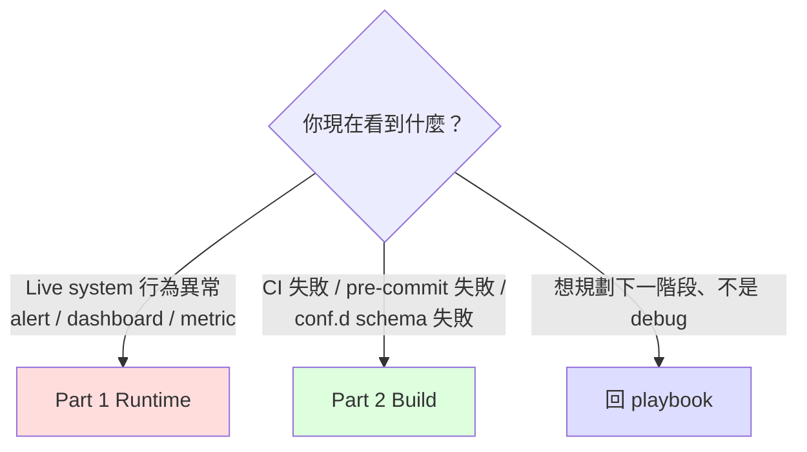

# Troubleshooting Checklist

> **使用情境**：(1) 凌晨 on-call 看到 alert / dashboard 異常需要 5 分鐘內定位；(2) CI / conf.d build failure 需要查為什麼壞掉。**不是**：feature design 討論、phase 規劃 —— 那些回 [multi-system migration playbook](../scenarios/multi-system-migration-playbook.md) 對應 phase narrative。
>
> **頁面結構**：Part 1 = Runtime（live system 異常）/ Part 2 = Build（CI 與 conf.d 端的失敗）。**完全切開** —— 不同情境讀者、不同 mental context。

---

## 0. 5 秒選對 Part



**最佳使用方式**：`Ctrl-F` 你看到的精準 symptom 字串（中英文都試）。本文件的 `H3` 標題刻意寫成「使用者會打進搜尋框的字」而非「架構元件名」。

---

## Part 1 — Runtime（live system 異常）

### 1.1 Metric 不出現在 VM

#### 1.1.1 vmagent target DOWN，scrape exporter 失敗

**Symptom**：
- vmagent target page 顯示某 exporter `DOWN`
- vmagent log 含 `context deadline exceeded` 或 `connection refused`
- VM `/api/v1/query` 查 exporter metric 為空

**Quick diagnosis（依序跑）**：

```bash
# 1. exporter pod 自己活著嗎？
kubectl get pod -n <exporter-ns> -l app=threshold-exporter
# expected: STATUS=Running, READY=1/1

# 2. exporter /metrics 自己回得了嗎？（在 exporter pod 內 curl localhost）
kubectl exec -n <exporter-ns> <exporter-pod> -- curl -sS localhost:8080/metrics | head -5
# expected: # HELP user_threshold ... 之類的 prometheus exposition 開頭

# 3. vmagent pod 從自己網路位置抓得到 exporter 嗎？
kubectl exec -n <vmagent-ns> <vmagent-pod> -- \
    curl -sS --max-time 5 http://<exporter-svc>.<exporter-ns>.svc:8080/metrics | head -5
# expected: 同上 / 失敗 = NetworkPolicy / Service / DNS 問題
```

**最常見原因**：**NetworkPolicy ingress 沒開**——exporter pod 的 NetworkPolicy 只允許自家 namespace 進來、沒開來自 vmagent namespace 的 8080 port。

**Fix**：

```yaml
# exporter NS 的 NetworkPolicy 加 ingress rule
spec:
  ingress:
    - from:
        - namespaceSelector:
            matchLabels:
              kubernetes.io/metadata.name: <vmagent-ns>
      ports:
        - port: 8080
          protocol: TCP
```

**If not this**：
- (a) Service selector 不對 → `kubectl describe svc <exporter-svc>` 看 endpoints 有無 pod IP
- (b) DNS 解析失敗（少見）→ vmagent pod 內 `nslookup <exporter-svc>.<ns>.svc`
- (c) exporter 監聽 `127.0.0.1` 而非 `0.0.0.0` → `kubectl exec ... -- ss -tlnp`

**Cross-ref**：playbook §12 Phase 1 catalog row「NetworkPolicy 阻擋 vmagent/Prom scrape exporter」

---

#### 1.1.2 vmagent 抓到但 VM 沒 ingest（待補）

> 待補（follow-up PR）：vmagent `vmagent_remotewrite_pending_data_bytes` 持續 > 0 / VM `vm_rows_ingested_total` 不增 / vminsert 5xx rate

---

### 1.2 Alert 沒 fire（規則 evaluator 端）

#### 1.2.1 Rule evaluator 沒 reload（規則改了但行為不變）

**Symptom**：
- git commit 已 merge、conf.d 應該變了，但 alert 行為仍是舊的
- 客戶 ops 看到「為什麼我改了還是一樣？」

**Quick diagnosis**：

```bash
# 1. ConfigMap / mounted file 是否到 pod 了？
kubectl exec -n <prom-ns> <prom-pod> -- cat /etc/prometheus/rules/<file>.yaml | head -20

# 2. evaluator 是否真的 reload 過了？
kubectl exec -n <prom-ns> <prom-pod> -- \
    wget -qO- localhost:9090/api/v1/status/config | head -5
# 或對 vmalert
kubectl exec -n <vmalert-ns> <vmalert-pod> -- \
    wget -qO- localhost:8080/api/v1/status/config | head -5

# 3. last reload 的 timestamp（Prom 專用）
kubectl exec -n <prom-ns> <prom-pod> -- \
    wget -qO- localhost:9090/api/v1/status/runtimeinfo | grep -i reload
```

**最常見原因**：**GitOps reconcile 卡住**——commit 已 merge 但 ArgoCD / Flux 仍在 backoff 或 webhook 沒觸發 sync；ConfigMap 的舊 generation 還在 pod。

**Fix**：

```bash
# ArgoCD: 強制 sync
argocd app sync <app-name>

# Flux: 強制 reconcile
flux reconcile kustomization <name> --with-source

# 如果 ConfigMap 已新但 pod 沒重 mount（projected volume timing）
kubectl rollout restart deployment <prom-deploy> -n <prom-ns>
# 或對 StatefulSet
kubectl rollout restart statefulset <prom-sts> -n <prom-ns>
```

**If not this**：
- (a) Prometheus Operator 仍在 reconcile PrometheusRule CRD → `kubectl describe prometheusrule <name>` 看 events
- (b) reload endpoint 自己 fail（PromQL syntax error 在新規則裡）→ Prom 會保留舊 config，log 含 `reloading config failed`。修 syntax 重 commit
- (c) HA Prom 兩個 replica 中只有一個 reload 成功 → 見 §1.5.1

**Cross-ref**：playbook §12 Phase 2 catalog row「新規則沒 fire (shadow alert volume = 0)」

---

#### 1.2.2 Shadow label 漏拔（cutover 後仍導去 /dev/null）

**Symptom**：
- Phase 3 cutover 已執行（rule 配置檔已移除某 tenant 的 `migration_status: shadow` label）
- 該 tenant 仍沒收到 production receiver 的 alert（dashboard 顯示 alert 仍 fire 但 receiver 沒響）

**Quick diagnosis**：

```bash
# 1. rule 端：那條規則的 alert label 還帶 shadow 嗎？
kubectl exec -n <prom-ns> <prom-pod> -- \
    wget -qO- 'localhost:9090/api/v1/rules?type=alert' | \
    jq '.data.groups[].rules[] | select(.name | contains("<rule-name>")) | .labels'
# expected: 沒有 migration_status: shadow

# 2. AM 端：alert payload 仍帶 shadow label 嗎？
kubectl exec -n <am-ns> <am-pod> -- \
    wget -qO- 'localhost:9093/api/v2/alerts?filter=alertname=<name>' | \
    jq '.[].labels'
# expected: 沒有 migration_status: shadow
```

**最常見原因**：**rule 配置檔改對了但 evaluator 沒 reload**（接 §1.2.1）。

**第二常見原因**：**改錯地方了** —— 在 AM config 改 matcher 而不是在 rule label。Phase 3 的正確機制是改 rule，不是改 AM。

**Fix**：

```bash
# 確認是 rule 端改：grep conf.d 那個 tenant 的 rules
grep -rn "migration_status:" conf.d/<domain>/<region>/<tenant>.yaml
# expected: 沒結果（已拔掉）

# AM config 完全不該動
diff <(kubectl get cm am-config -o yaml) <previous-am-config>
# expected: 無 diff
```

**If not this**：
- AM `null` receiver 還在 catch shadow → 但 rule label 已拔，理論上不該 match shadow matcher。除非 routing 順序有 fall-through bug → 見 §1.3.1

**Cross-ref**：playbook §6 Phase 3 narrative「常見錯誤：以為要改 AM config」+ playbook §12 Phase 3 catalog row 1

---

### 1.3 Alert fire 但路由錯

#### 1.3.1 AM matcher 順序錯（shadow alert 漏到 production）

**Symptom**：
- shadow 期間客戶 ops 半夜被 paged（不該收到 shadow alert）
- alert payload 帶 `migration_status="shadow"` label 卻送到了 PagerDuty / Slack production channel

**Quick diagnosis**：

```bash
# 1. 看 AM 實際 routing（amtool）
amtool config routes --config.file=/etc/alertmanager/alertmanager.yml show
# expected tree: shadow matcher 是第一個 child，不是末段

# 2. 模擬 shadow alert 看 routing 走到哪
amtool config routes test --config.file=/etc/alertmanager/alertmanager.yml \
    migration_status=shadow severity=critical alertname=TestAlert
# expected: receiver = "null"
```

**最常見原因**：**shadow matcher 在 `route.routes` 末段而非開頭**，前面有 `severity=critical` 之類的全 catch route 先截走。

**Fix**：把 shadow matcher 移到 `routes` 第一個 entry：

```yaml
route:
  receiver: default-receiver
  routes:
    - matchers: [migration_status="shadow"]   # ← 必須是第一個
      receiver: "null"
      continue: false                          # ← 不再 fall-through
    - matchers: [severity="critical"]
      receiver: pagerduty
    # ... 其他
```

**If not this**：
- (a) `continue: true` 寫錯讓 alert fall-through → 改 `continue: false`
- (b) AM v0.27 vs v0.32 matcher 語法差異 → 用 `==` 不是 `=~` 除非真要 regex
- (c) `null` receiver 配置漏（receiver name 拼錯）→ AM log 含 `receiver "null" not found`

**Cross-ref**：playbook §12 Phase 2 catalog row「Shadow alert 漏到 production receiver」

---

#### 1.3.2 Silencer mismatch（disablement drift / double-fire alert storm）

**Symptom**：
- Cutover 後（Phase 3 全量階段或 Rule Pack v1→v2 升版）某類 alert **同時被 v1 和 v2 規則觸發**
- AM dashboard 看到同 alertname 短時間內大量 fire
- 客戶 ops 反應「我們明明 silenced 了 MySQLDown，為什麼還在叫？」
- 嚴重時數十條 alert 在 5-10 分鐘內全 fire（alert storm）

**Quick diagnosis**：

```bash
# 1. 看現在有哪些 active silencer
kubectl exec -n <am-ns> <am-pod> -- \
    wget -qO- 'localhost:9093/api/v2/silences?filter=state=active' | \
    jq '.[] | {id, matchers: .matchers, comment}'
# expected: 看到 v1 alertname 的 silencer 仍 active

# 2. 看現在 firing 的 alert label
kubectl exec -n <am-ns> <am-pod> -- \
    wget -qO- 'localhost:9093/api/v2/alerts?filter=state=active' | \
    jq '.[] | {labels: .labels, status: .status.state}' | head -40
# expected: 看到 v2 alertname (不同) 但語意上相同的 alert 在 fire

# 3. 比對 v1 與 v2 alertname diff（從 git）
git diff main..HEAD -- conf.d/ | grep -E "^[+-].*alertname"
# 或對照 Rule Pack changelog
cat rule-packs/<pack>/CHANGELOG.md | head -30
```

**最常見原因**：**v1 silencer matchers 用 `alertname=MySQLDown`，v2 改名為 `DatabaseDown_MySQL`** — silencer 的 matcher 不再 match 任何 alert，alert 直接 fire 到 production receiver。同時 v1 規則仍在 evaluate（cutover 期 dual-rule 期間）→ 兩條都 fire = double storm。

**Fix（兩階段）**：

```bash
# 立即止血：對 v2 alertname 加新 silencer
amtool silence add \
    --alertmanager.url=http://<am>:9093 \
    --duration=2h \
    --comment="cutover disablement drift, v2 rename" \
    alertname=DatabaseDown_MySQL

# 之後 systematic：跑 silencer 與 v2 alertname 的 reconcile
da-tools silencer-drift-check \
    --am-url http://<am>:9093 \
    --rule-source conf.d/ \
    --rule-pack-version v2.0.0
# 工具會列出 「silencer matchers vs v2 alertname」mismatch list、產生 patch suggestion
```

**If not this**：
- (a) silencer 確實已過期 → 客戶記憶錯，不是 drift。確認 `endsAt` 還是未來
- (b) silencer matchers 用 regex 但寫錯（`alertname=~"MySQL.*"` 而 v2 改 `Database`）→ 需修 regex
- (c) v1 規則沒拔（不是改名問題、是 dual-rule 並存）→ cutover 後該 v1 規則應已從 conf.d 移除；若仍在則 git revert 或拔 rule

**Cross-ref**：
- playbook §6 Phase 3 narrative「Disablement drift」
- playbook §12 Phase 3 catalog row 4
- [staged-adoption-guide §7.3](../scenarios/staged-adoption-guide.md) — disablement drift 機制詳解（Rule Pack 升版時也是同一套，cutover 是首次套用）

---

### 1.4 性能 / OOM / disk

#### 1.4.1 vmagent OOMKilled

**Symptom**：
- vmagent pod restart count 飆升
- `kubectl describe pod` events 含 `OOMKilled`
- VM ingest 出現空白時段

**Quick diagnosis**：

```bash
# 1. 確認 OOM
kubectl describe pod <vmagent-pod> -n <vmagent-ns> | grep -A2 "Last State"
# expected: Reason: OOMKilled

# 2. 看當前 memory limit 與 actual usage
kubectl top pod <vmagent-pod> -n <vmagent-ns>
kubectl get pod <vmagent-pod> -n <vmagent-ns> -o jsonpath='{.spec.containers[0].resources.limits.memory}'

# 3. 看 series count（是不是真的太大）
kubectl exec -n <vmagent-ns> <vmagent-pod> -- \
    wget -qO- 'localhost:8429/metrics' | grep -E '^vmagent_remotewrite_(samples|conn)' | head
```

**最常見原因**：**memory limit 預設 64Mi 對 100k+ series 不夠**。

**Fix**：

```yaml
# vmagent helm values
resources:
  limits:
    memory: 1Gi   # 從 64Mi bump 到 1Gi
  requests:
    memory: 512Mi

# 加上 throttle remote_write block size（避免一次太大）
extraArgs:
  remoteWrite.maxBlockSize: "8MB"   # 預設 32MB
```

**If not this**：
- (a) cardinality bursts（label 組合爆炸）→ 看 series count，加 vmagent relabel drop 不需要的 label
- (b) remote_write target 慢 → buffer 累積導致 OOM → 見 §1.4.2 對應的 Prom 端問題、或 §1.4.5 VM ingest 慢

**Cross-ref**：playbook §12 Phase 1 catalog row「vmagent OOMKilled in 初次 dual-write」

---

#### 1.4.2 Prom OOMKilled / vminsert 5xx spike（Option 2 queue_config 缺）

**Symptom**：
- 加 `remote_write` 給 VM 後 reload，30 秒內 Prom OOMKilled
- 同時 vminsert 收到大量 HTTP 503，新進 metric 寫不進
- 客戶以為「VM 容量問題」實際是 client 端 queue tuning

**Quick diagnosis**：

```bash
# 1. Prom remote_write metrics
kubectl exec <prom-pod> -- wget -qO- localhost:9090/metrics | \
    grep -E 'prometheus_remote_storage_(shards|samples_in_total|pending|queue_length)'
# expected if broken: shards = 200 (預設), pending 持續飆升

# 2. vminsert 5xx rate
kubectl exec <vminsert-pod> -- wget -qO- localhost:8480/metrics | \
    grep -E 'vm_http_request_errors_total{path="/insert' 

# 3. 看 prometheus.yml 是否含 queue_config
kubectl get cm prometheus-config -o yaml | grep -A10 'remote_write:'
# expected: 該有 queue_config block；沒有就是元兇
```

**最常見原因**：**`remote_write` block 省略 `queue_config`**，預設 `max_shards: 200` 對大 Prom 是地雷。

**Fix**：

```yaml
remote_write:
  - url: "http://vminsert.vm.svc:8480/insert/0/prometheus"
    queue_config:
      max_samples_per_send: 10000
      max_shards: 30                # 預設 200 太高
      capacity: 25000
```

```bash
# Prom reload 套用
kubectl exec <prom-pod> -- wget -qO- --post-data='' localhost:9090/-/reload
```

**If not this**：
- (a) 真的是 vminsert 容量不足（有 queue_config 仍打爆）→ vminsert HPA / scale up
- (b) Prom 本身 series count 過大 + 加 remote_write 雙重壓力 → 拆 vmagent 走 Option 1 比較適合（詳見 playbook §4）

**Cross-ref**：playbook §12 Phase 1 catalog row「Option 2: Prom remote_write reload 後 OOM 或打趴 vminsert」+ playbook §4 Option 2 narrative

---

#### 1.4.3 VM disk 即將撐爆 / 已撐爆

**Symptom**：
- VM disk usage > 80%（warn）或 > 95%（critical）
- vmsingle / vmstorage log 含 `error: not enough free space`
- 新 metric 寫入失敗、`vm_rows_received_total` 不再增長
- vminsert 開始回 5xx
- 嚴重時 VM crash 重啟、index 損壞需 repair

**Quick diagnosis**：

```bash
# 1. 當前 disk usage
kubectl exec -n <vm-ns> <vmsingle-pod> -- df -h /vm-data
# 或對 vmcluster 看 vmstorage
kubectl exec -n <vm-ns> <vmstorage-pod> -- df -h /vmstorage

# 2. 增速看最近 24h
kubectl exec <vm-pod> -- wget -qO- 'localhost:8428/metrics' | \
    grep -E '^vm_data_size_bytes'
# 與 24h 前 metric 比，算 GB/day

# 3. 找出佔 disk 的兇手 metric（high cardinality / high churn）
kubectl exec <vm-pod> -- wget -qO- \
    'localhost:8428/api/v1/labels' | jq '.data | length'
# 看 label 總數

kubectl exec <vm-pod> -- wget -qO- \
    'localhost:8428/api/v1/series?match[]={__name__=~".+"}&limit=1000000' | \
    jq '.data | group_by(.__name__) | map({metric: .[0].__name__, series_count: length}) | sort_by(-.series_count) | .[0:20]'
# 列出前 20 大 series count metric

# 4. 確認 retention 設定
kubectl get statefulset <vm-sts> -o yaml | grep -A2 retentionPeriod
```

**最常見原因**：**cardinality 估算嚴重失誤**——客戶宣稱 10k tenant labels 實際因 multi-region label combination 達 100k+。次常見：dual-write 期間 doubling 撞 cardinality 上限沒人盯。

**Fix 路徑（依緊急程度，順序錯會自爆）**：

> ⚠️ **極重要的 LSM 自爆陷阱**：VictoriaMetrics 是 LSM-tree 結構，background merge **需要先寫入合併後的新 block，才會刪除舊 block**（write amplification）。Disk > 95% 時若觸發 merge（包括縮 retention 重啟），VM 會在幾秒內把剩餘空間吃光、報 `no space left on device` 直接 crash、index 損壞。**Disk usage 是決定處置順序的唯一因素**，不是「緊急程度」。

##### Disk > 95%（紅區）— 只有擴容是安全的

```bash
# 唯一安全選項：PVC expand（需 StorageClass 支援 allowVolumeExpansion）
kubectl edit pvc <vm-pvc>
# 改 spec.resources.requests.storage 加 ~30%（例 1Ti → 1.5Ti）
# 等 ~1-5 分鐘 PV 擴容完成（雲廠商側操作）
kubectl get pvc <vm-pvc> -o jsonpath='{.status.capacity.storage}'
# expected: 看到新值
```

**若 StorageClass 不支援 expand 或 quota 卡住，最後手段（破壞性）**：

```bash
# ☢️ 危險操作 — 手動刪舊 partition，會永久失去那段時間的資料
# 僅在「已確認 PVC expand 完全不可行 + crash 在即」時使用

# 1. exec 進 vmsingle / vmstorage pod
kubectl exec -it <vm-pod> -- sh

# 2. 列 partition（VM 預設按月分區，"YYYY_MM" 命名）
ls -la /vm-data/data/small/  # 或 /vmstorage/data/small/ for vmcluster
# expected: 2024_01/ 2024_02/ ...

# 3. 找最舊的 partition（避開當前月）
# 4. ☢️ 確認真的不再需要該段資料（compliance / audit / cold-storage backup 已完成）
rm -rf /vm-data/data/small/2024_01

# 5. VM 自動偵測 partition 移除、釋放 disk inode
# 6. 重啟 vmsingle 確認 schema 一致
```

**為什麼縮 retention 在紅區是錯的**：
- Retention shrink 觸發 merge 處理 partition pruning → merge 需要 >= 該 partition 大小的暫存空間
- VM 預設按**月**分 partition（`-retentionPeriod=30d` 不會立刻刪今天的資料、只會刪整個過期月）
- Disk 已紅區 = 沒有 buffer 給 merge 跑 → 立即 ENOSPC

##### Disk 80-95%（橙區）— retention shrink 安全

```bash
# 此時還有 buffer 讓 merge 寫新 block，retention shrink 是合理選項
# vmsingle 重啟參數
# -retentionPeriod=30d → -retentionPeriod=14d
kubectl edit statefulset <vmsingle-sts>
# 改 spec.template.spec.containers[0].args

# 重啟觸發 background merge 釋放（依 partition 大小，數十分鐘到數小時）
# 期間 disk usage 會先**短暫上升**再下降（merge write amplification 正常現象）
```

##### Disk < 80%（綠區）— 結構性處理

```yaml
# 找出 high-cardinality label 並 drop（vmagent 端）
relabel_configs:
  - action: labeldrop
    regex: pod_template_hash|controller-revision-hash|<其他 noise>

# 整段 drop noisy metric
  - action: drop
    source_labels: [__name__]
    regex: container_(network|fs)_.+_total
```

**If not this**：
- (a) disk 已 100%、VM crash 起不來 → 走 [VM 官方 disaster recovery](https://docs.victoriametrics.com/Single-server-VictoriaMetrics.html#data-recovery)；emergency 模式：`-storageDataPath` 指到新空盤啟 VM、舊 data 用 `vmctl` 慢慢匯入
- (b) cardinality 暴漲是 **single bad metric** 引入（template metric label 沒 set）→ vmagent drop 該 metric 立竿見影；但**仍須先擴容 disk**才能跑 merge
- (c) disk 增速跟 metric ingest 不匹配（增速異常）→ 可能是 background merge 失敗、index 重建，VM log 找 `merge` / `index` keyword

**Cross-ref**：
- playbook §12 Phase 1 catalog row 2「VM disk 撐爆」
- playbook §4 disk budget formula（Phase 1 narrative）
- [VM Capacity Calculator](https://docs.victoriametrics.com/Single-server-VictoriaMetrics.html#capacity-planning)

#### 1.4.4 Cardinality 暴漲（待補）

> 待補：`vm_cardinality_limit_rows_dropped_total` 開始有值、prometheus_tsdb_head_series 飆升、找出 high-cardinality label 並 relabel drop

---

### 1.5 Cutover/rollback 異常

#### 1.5.1 HA Prom reload race（兩 replica 不同步，待補）

> 待補：HA pair 的一個 replica SIGHUP 失敗、5 分鐘內 alert payload 一半帶 shadow 一半不帶、AM dedup 失敗。手動 SIGHUP 失敗的那 replica。

#### 1.5.2 Dashboard 突然 No-Data（datasource UID drift）

**Symptom**：
- Phase 4 後（或 Grafana datasource 重建後）某 dashboard panel 全 `No data`
- 客戶 ops / capacity team / SRE 反應「我的 dashboard 壞了」
- panel 配置看起來正常但 query 結果空

**Quick diagnosis**：

```bash
# 1. 看 dashboard panel 用的 datasource UID
# 透過 Grafana API 或 dashboard JSON
curl -sH "Authorization: Bearer $GRAFANA_TOKEN" \
    https://grafana.example.com/api/dashboards/uid/<dash-uid> | \
    jq '.dashboard.panels[] | {title, datasource}'

# 2. 列當前 Grafana 已知的 datasource UID
curl -sH "Authorization: Bearer $GRAFANA_TOKEN" \
    https://grafana.example.com/api/datasources | \
    jq '.[] | {uid, name, type}'

# 3. grep dashboard JSON 找 hardcoded UID（panel-level 之外的引用）
curl -sH "Authorization: Bearer $GRAFANA_TOKEN" \
    https://grafana.example.com/api/dashboards/uid/<dash-uid> | \
    jq '.dashboard' | grep -E '"uid"|"datasource"'
# expected: 找到 panel level 之外仍 reference 舊 UID 的字串
```

**最常見原因**：**dashboard JSON 含 hardcoded UID 在 template variable / annotation / derived field**，bulk migration tool 只改了 panel-level datasource，這些角落沒被 migrate；或 audit script 只 grep `legacy-prom` URL 漏抓 UID 字串。

**Fix 兩階段**：

##### 階段 1（立即止血）：grace period 舊 Prom 自動 fallback

```bash
# 如果舊 Prom 仍在 grace period（read-only 但活著）
# → dashboard 自動 fallback 不需動，先確認舊 datasource 仍可 query
curl -sH "Authorization: Bearer $GRAFANA_TOKEN" \
    -X POST https://grafana.example.com/api/datasources/uid/<legacy-prom-uid>/health
# expected: {"status": "OK"} → dashboard 仍可運作、安心 defer
```

##### 階段 2（根除）：先確認 dashboard 部署機制再選工具

> ⚠️ **GitOps 校正回歸警告**：在 K8s 環境 dashboard 通常透過 **Grafana sidecar (kube-prometheus-stack)** 從 `ConfigMap` 動態載入；或 **ArgoCD / Flux 直接管 Grafana CRD**。如果用 Grafana API `POST /api/dashboards/db` 強制覆寫，**3-5 分鐘後** GitOps reconcile 會把 Git/ConfigMap 內舊 JSON sync 蓋回來、dashboard 又壞掉、on-call 陷入「修了又壞」無限輪迴。

**先 grep 部署機制**：

```bash
# 1. 檢查 dashboard 是否由 ConfigMap provisioning
kubectl get cm -n <grafana-ns> -l grafana_dashboard=1 -o name | head
# 有結果 = sidecar provisioning，必須改 source 不是改 API

# 2. 或檢查 ArgoCD Application
kubectl get application -A | grep -i grafana
# 有 result = ArgoCD 管，必須改 Git repo

# 3. 或用 Grafana API 看 dashboard origin
curl -sH "Authorization: Bearer $GRAFANA_TOKEN" \
    https://grafana.example.com/api/dashboards/uid/<dash-uid> | \
    jq '.meta | {provisioned, provisionedExternalId, isFolder, slug}'
# .provisioned = true → 由 sidecar / file provisioner 部署，API 改不了
```

**Path A — Provisioned dashboard（GitOps / sidecar）**：必須改 source

```bash
# 1. clone Git repo
git clone <dashboard-repo> && cd <repo>

# 2. 改 dashboard JSON，全文 grep 改 UID
find . -name "*.json" -exec sed -i 's/"<old-uid>"/"<new-uid>"/g' {} \;
# 注意 sed -i 在 macOS / 部分檔案系統有差異，跨平台用 ripgrep + python 更穩

# 3. PR + merge
git add . && git commit -m "fix: migrate dashboard datasource UID old→new"
git push origin <branch>
# 4. 等 ArgoCD / sidecar reconcile（通常 < 5 分鐘）
```

**Path B — UI-created dashboard 或緊急臨時止血**：API overwrite

```bash
# 僅適用 .meta.provisioned == false 的 dashboard
# 或客戶確認接受 "GitOps 會在 N 分鐘後蓋回，這是臨時止血" 的場景

curl -sH "Authorization: Bearer $GRAFANA_TOKEN" \
    https://grafana.example.com/api/dashboards/uid/<dash-uid> | \
    jq '.dashboard | walk(if type == "object" and .uid == "<old-uid>" then .uid = "<new-uid>" else . end)' | \
    jq '{dashboard: ., overwrite: true, message: "datasource UID migration"}' | \
    curl -sH "Authorization: Bearer $GRAFANA_TOKEN" \
        -H "Content-Type: application/json" \
        -X POST -d @- \
        https://grafana.example.com/api/dashboards/db
```

**改完 audit**：跨整個 Git repo（Path A）或整個 Grafana instance（Path B）跑 `grep -rE '"uid":\s*"<old-uid>"'`，確保歸 0。

**重點警告**：

- **不要在 CAB freeze 期跑 Path A 的 PR + sync**——批次改 30+ dashboard 過不了 enterprise change review。grace period 的舊 Prom 是天然防禦，先靠它撐到 freeze 結束
- **不要靠 Grafana UI bulk migrate**——它通常只改 panel-level datasource，hardcoded UID 在 JSON 內角落漏抓
- **Path B 後若發現 dashboard 又變回舊 UID** = 部署機制其實是 provisioned，要改走 Path A

**If not this**：
- (a) datasource 還在但 query 仍 fail → 檢查 datasource 連線（健康檢查 endpoint）、auth header 是否變動
- (b) panel 用 template variable 但 variable query 自己 reference 舊 datasource → 變數面板獨立 reconfigure
- (c) Grafana provisioning（YAML 部署）vs UI 改動衝突 → provisioning 會覆蓋 UI 修改、改 provisioning YAML 才永久

**Cross-ref**：
- playbook §6 Phase 3 narrative「Grafana Datasource 切換」
- playbook §12 Phase 4 catalog row 1「舊 Prom 關閉後某 Grafana dashboard 全紅」
- §13 walkthrough Phase 4「Grace Period 救了所有人」

---

### 1.6 資料不一致

#### 1.6.1 Dual-write metric drift > 5%（Phase 1 Gate 1 fail）

**Symptom**：
- Phase 1 Gate 1 invariant 「VM 與 Prom 同 metric 數量 ±5%」 fail
- VM 側 metric count 比 Prom 多 / 少 > 5% 持續一週
- 客戶 ops 反應「為什麼 staging dashboard 比 prod 數字差這麼多」

**Quick diagnosis**：

> ⚠️ **不要用 `count(up)` 算 drift**——`up` 計的是 **scrape target 數**，不是 series 數。Prom 與 vmagent 各自抓 100 個 target，`count(up)` 都會 = 100、drift = 0%。但若 vmagent relabel 把某 target 的 50k 個 `staging_only_*` series drop 掉，這 50k 落差 `count(up)` 完全看不到。Drift detection 必須查**真正的 series count 或 ingest rate**。

```bash
# 1. 用 storage 端的真實 series count（最準）
PROM_SERIES=$(kubectl exec <prom-pod> -- wget -qO- \
    'localhost:9090/api/v1/query?query=prometheus_tsdb_head_series' | \
    jq '.data.result[0].value[1] | tonumber')
# VM 端：vmsingle 看 vm_cache_entries，vmstorage 看 vmstorage_cache_entries
VM_SERIES=$(kubectl exec <vmsingle-pod> -- wget -qO- \
    'localhost:8428/api/v1/query?query=vm_cache_entries{type="storage/hour_metric_ids"}' | \
    jq '.data.result[0].value[1] | tonumber')
echo "Prom: $PROM_SERIES, VM: $VM_SERIES, drift: $(awk "BEGIN{printf \"%.2f%%\", ($VM_SERIES-$PROM_SERIES)/$PROM_SERIES*100}")"

# 2. 替代：比對 ingest rate（post-relabel sample rate，反映真實流入量）
# Prom 端
kubectl exec <prom-pod> -- wget -qO- \
    'localhost:9090/api/v1/query?query=sum(rate(scrape_samples_post_metric_relabeling[5m]))'
# vmagent 端
kubectl exec <vmagent-pod> -- wget -qO- \
    'localhost:8429/api/v1/query?query=sum(rate(vmagent_remotewrite_samples_sent_total[5m]))'
# 兩者差 > 5% = drift；對短週期飆升 / 掉點更敏感

# 3. 找出哪些 metric 在 VM 多 / 少（series-level diff）
diff <(kubectl exec <prom-pod> -- wget -qO- 'localhost:9090/api/v1/label/__name__/values' | jq -r '.data[]' | sort) \
     <(kubectl exec <vmselect-pod> -- wget -qO- 'localhost:8481/select/0/prometheus/api/v1/label/__name__/values' | jq -r '.data[]' | sort) | \
    head -50
# 列舉只在某一側存在的 metric name（typically Prom 有 vmagent drop 的）

# 4. 比對 vmagent 與 Prom 的 scrape / relabel config
kubectl get cm vmagent-config -o yaml | grep -A3 'relabel'
kubectl get cm prometheus-config -o yaml | grep -A3 'relabel'
# 找差異
```

**為什麼 step 1 用兩個不同 query**：
- Prom 端：`prometheus_tsdb_head_series` 是 Prom 內部 metric、直接讀 storage head TS count、零誤差
- VM 端：`vm_cache_entries{type="storage/hour_metric_ids"}` 是 VM 內部、讀 hour-level metric ID cache、近似於 active series count（>= 真實 series count，但 ratio 用來算 drift 仍精確）
- 兩者都繞過 `count(up)` target-counting trap

**最常見原因**：**vmagent relabel 與 Prom relabel 不同步**——客戶 Prom 端有一條 `__tmp_metric_name` 拋棄 staging-only metric 的 relabel rule，vmagent scrape config 抄漏了。VM 比 Prom 多 5-8% metric → drift fail。

**Fix**：

```yaml
# vmagent scrape config 補上對應 relabel
scrape_configs:
  - job_name: ...
    relabel_configs:
      # 同步 Prom 端那條 __tmp_metric_name drop rule
      - source_labels: [__name__]
        regex: 'staging_only_.+'
        action: drop
      # ... 其他與 Prom 一致的 relabel
```

```bash
# 套用
kubectl rollout restart deployment vmagent -n <vmagent-ns>
# 等 ~10 分鐘 metric churn 後重跑 Gate 1 check
```

**If not this**：
- (a) VM **少**於 Prom（負 drift）→ vmagent 抓不到某 target；查 vmagent target page 是否完整、Service / NetworkPolicy 是否齊
- (b) drift 在 ±5% 邊緣抖動（5-7%）→ scrape interval 不對齊（Prom 15s / vmagent 30s）造成 sample timing 落差；改成同 interval
- (c) drift 來自 dual-write 期間正常的 retention 差異（Prom 已 GC 部分舊 data, VM 仍保留）→ 限定 query window 一致再比

**Cross-ref**：
- playbook §12 Phase 1 catalog row 5「dual-write metric drift > 5%」
- playbook §10 Gate 1 invariant 設計
- playbook §4 Option 1 vs Option 2 narrative（Option 1 有 vmagent 自己的 scrape config，relabel 對齊是必檢項）

#### 1.6.2 SLO dashboard 在 cutover 後誤判（待補）

> 待補：客戶 SLO 用 `alert_count` 為 input，cutover 後 critical alert 從 50 降到 5，SLO dashboard 誤判「監控壞了」。改 SLO 邏輯改用 SLI 直接 query 而非 alert count。

---

## Part 2 — Build（CI / conf.d / lint failures，**deploy 之前**）

### 2.1 Tier A 靜態 audit 失敗

#### 2.1.1 PromQL syntax error（da-parser 失敗）

**Symptom**：
- `da-tools onboard --analyze` 結束 status != 0
- 報告含 `syntax_errors[]` 非空

**Quick diagnosis**：

```bash
# 1. 看哪些檔案 fail + 具體 line
da-parser --strict-promql --report rules.yaml
# expected output: 每個 fail 的 file:line + parser message

# 2. 重現該 expr 的解析
echo 'YOUR_EXPR_HERE' | promtool query parse
# 或對 metricsql
echo 'YOUR_EXPR_HERE' | metricsql parse
```

**最常見原因**：**手寫 PromQL 用了 vmalert-only 函數但 source 標 prometheus**——例如 `histogram_quantile_bucket` 是 metricsql 獨有，promtool 解析會 fail。

**Fix 路徑**：

| 情境 | 處理 |
|---|---|
| 客戶要持續支援 vanilla Prom + VM | 改寫 expr 為 standard PromQL（用 `histogram_quantile`） |
| 客戶決定獨佔 VM | 在 da-parser 標 `dialect: metricsql`，跳過 strict promql check |
| 規則本來就該 deprecate | 從 conf.d 拿掉、Tier A 就 pass |

**If not this**：
- (a) typo（多 / 少括號）→ promtool 訊息會直接指出
- (b) 不存在的 function name → 確認 PromQL 版本（recording rule 與 alerting rule 支援不同）

**Cross-ref**：playbook §12 Phase 0 catalog row「Tier A 卡在 PromQL syntax error」+ [cli-reference §C-8 MetricsQL-as-Superset](../cli-reference.md)

---

#### 2.1.2 Hardcoded tenant id（dev-rule #2 違反 / Tier A hard gate fail）

**Symptom**：
- `da-tools onboard --analyze` 結束 status != 0
- 報告含 `tenant_id_violations[]` 非空
- CI 在 `da-guard` schema 階段 fail

**Quick diagnosis**：

```bash
# 1. 看 violation 列表
da-tools onboard --analyze --output /tmp/state.json --markdown-summary | tee /tmp/summary.md
jq '.discovery.tier_a_static.tenant_id_violations[]' /tmp/state.json
# expected output: 每筆含 file:line + offending PromQL snippet

# 2. 直接 grep conf.d / rules 找 tenant id literal
grep -rnE 'instance\s*=\s*"[a-z0-9-]+"' conf.d/ rules/
grep -rnE 'tenant\s*=\s*"[a-z0-9-]+"' conf.d/ rules/
# 排除合法的 template / schema 條目
```

**最常見原因**：**急救 hotfix 留下 `instance="db-prod-1"` 之類的 PromQL，原作者離職、rationale 失傳**——Tier A 直接抓出每處。

**Fix（依情境）**：

```yaml
# 情境 A：原本就該 tenant-agnostic（90% case）
# 改用 label selector pattern
# Before:
- expr: 'mysql_up{instance="db-prod-1"} == 0'
# After:
- expr: 'mysql_up == 0'
  labels:
    tenant: '{{ $labels.tenant }}'

# 情境 B：規則確實只該 fire 對特定 tenant（少見、需審視）
# 用 conf.d 結構放在該 tenant 子目錄、PromQL 不寫死
# conf.d/<domain>/<region>/<tenant>.yaml:
- expr: 'mysql_up == 0'
  for: 5m
# 該檔案的 directory context 已隱含 tenant scope，PromQL 不需 hardcode

# 情境 C：規則該 deprecate（hotfix 早不需要了）
# 從 conf.d 拿掉、Tier A 自然 pass
```

**Fix 完驗證**：

```bash
# 重跑 Tier A
da-tools onboard --analyze --output /tmp/state.json
jq '.discovery.tier_a_static.tenant_id_violations | length' /tmp/state.json
# expected: 0
```

**If not this**：
- (a) violation 是 **legitimate 的 staging tenant id**（如 `staging-default`）→ 加進 da-tools allowlist；但這應該是少數
- (b) 規則使用 dynamic pattern（`instance=~"db-prod-.*"`）但 da-tools 仍報 violation → 工具 false positive，開 issue 給 platform team
- (c) violation 在 alert annotation 而非 expr → 可接受（annotation 是給 humans 看的不參與 routing）

**Cross-ref**：
- playbook §12 Phase 0 catalog row 3「Tier A 抓到 hardcoded tenant id」
- [`docs/internal/dev-rules.md`](../internal/dev-rules.md) #2 Tenant-Agnostic
- playbook §3 Phase 0 narrative「客戶 Phase 0 通常的 surprise」

#### 2.1.3 Orphan rule（無對應 receiver，待補）

> 待補：rule fire 但 AM 沒對應 route、或 receiver 已從 AM config 移除；多 rules 5+ 年累積遺跡。

---

### 2.2 da-guard 4-layer 失敗（待補）

> 待補：4-layer = Schema / Routing / Cardinality / Redundant override。常見場景：
> - Schema：欄位拼錯、required 欄位缺
> - Routing：domain 沒對應到任何 tenant
> - Cardinality：cardinality budget 超限
> - Redundant override：tenant 設定與 Profile-as-Directory-Default 重複

### 2.3 Migration state inconsistency（待補）

> 待補：per-cluster `.da/state/<cluster>.json` 之間 schema_version drift / manifest 與 state 檔不一致 / 兩個 state 檔同時被 automation 寫造成 git merge conflict。

---

## 3. Cross-references

| 主題 | 文件 |
|---|---|
| Multi-system migration playbook（5-Phase / Gate / Rollback）| [`scenarios/multi-system-migration-playbook.md`](../scenarios/multi-system-migration-playbook.md) |
| §12 Failure Mode Catalog（本 checklist 的源頭 catalog）| [§12](../scenarios/multi-system-migration-playbook.md#12-failure-mode-catalogcross-phase-summary) |
| Staged Adoption Lifecycle（custom_ → golden 升級）| [`scenarios/staged-adoption-guide.md`](../scenarios/staged-adoption-guide.md) |
| Shadow monitoring SOP | [`shadow-monitoring-sop.md`](../shadow-monitoring-sop.md) |
| BYO Prometheus integration | [`integration/byo-prometheus-integration.md`](byo-prometheus-integration.md) |
| BYO Alertmanager integration | [`integration/byo-alertmanager-integration.md`](byo-alertmanager-integration.md) |
| VictoriaMetrics integration | [`integration/victoriametrics-integration.md`](victoriametrics-integration.md) |
| ADR-019 Profile-as-Directory-Default | [`adr/019-profile-as-directory-default.md`](../adr/019-profile-as-directory-default.md) |

---

## 4. 撰寫慣例（給後續 PR 補完用）

每個 entry 必須含：

1. **Symptom**：reader 會看到的字面現象（盡量寫成 Ctrl-F 搜得到的字）
2. **Quick diagnosis**：1-3 個 bash 命令（依序），每個有「expected output」描述
3. **最常見原因**：單一 root cause（90% case）
4. **Fix**：具體可執行（YAML diff / kubectl 命令 / 重 reload 等）
5. **If not this**：1-2 個 alternative cause + 對應排查
6. **Cross-ref**：回 playbook / ADR / integration doc

**禁止**：
- 純 narrative description（→ playbook）
- 沒有 expected output 的 diagnostic command（讀者 paste 完不知道結果該長怎樣）
- 「視情況而定」這類 hand-wave（要嘛具體要嘛拿掉）

---

## 5. Outline status

| 段 | 狀態 |
|---|---|
| §0-2 frame + decision tree | ✅ ready |
| Part 1 §1.1.1 Exporter scrape down | ✅ ship（PR #398） |
| Part 1 §1.2.1 Rule reload 沒生效 | ✅ ship（PR #398） |
| Part 1 §1.2.2 Shadow label 漏拔 | ✅ ship（PR #398） |
| Part 1 §1.3.1 AM matcher 順序錯 | ✅ ship（PR #398） |
| Part 1 §1.4.1 vmagent OOM | ✅ ship（PR #398） |
| Part 1 §1.4.2 Prom OOM / vminsert 503 | ✅ ship（PR #398） |
| Part 2 §2.1.1 PromQL syntax error | ✅ ship（PR #398） |
| Part 1 §1.3.2 Disablement drift | ✅ ship（**本 PR**） |
| Part 1 §1.4.3 VM disk 撐爆 | ✅ ship（**本 PR**） |
| Part 1 §1.5.2 Dashboard No-Data (UID drift) | ✅ ship（**本 PR**） |
| Part 1 §1.6.1 Dual-write metric drift | ✅ ship（**本 PR**） |
| Part 2 §2.1.2 Hardcoded tenant id | ✅ ship（**本 PR**） |
| Part 1 §1.1.2 vmagent 抓到但 VM 沒 ingest | 🟡 placeholder |
| Part 1 §1.4.4 Cardinality 暴漲 | 🟡 placeholder |
| Part 1 §1.5.1 HA Prom reload race | 🟡 placeholder |
| Part 1 §1.6.2 SLO dashboard 誤判 | 🟡 placeholder |
| Part 2 §2.1.3 Orphan rule | 🟡 placeholder |
| Part 2 §2.2 da-guard 4-layer 失敗 | 🟡 placeholder |
| Part 2 §2.3 Migration state inconsistency | 🟡 placeholder |
| §4 撰寫慣例 | ✅ ready |

**進度**：12/19 entries 已 ship（63%）。剩 7 個 placeholder。下一波 PR 候選優先級：§1.5.1 HA reload race（cutover 必踩）→ §1.4.4 cardinality（Phase 1 高頻）→ §2.2 da-guard（CI 高頻）。
