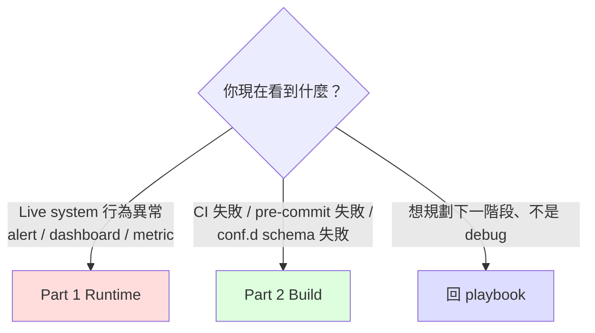

# Troubleshooting Checklist

> **使用情境**：(1) 凌晨 on-call 看到 alert / dashboard 異常需要 5 分鐘內定位；(2) CI / conf.d build failure 需要查為什麼壞掉。**不是**：feature design 討論、phase 規劃 —— 那些回 [multi-system migration playbook](../scenarios/multi-system-migration-playbook.md) 對應 phase narrative。
>
> **頁面結構**：Part 1 = Runtime（live system 異常）/ Part 2 = Build（CI 與 conf.d 端的失敗）。**完全切開** —— 不同情境讀者、不同 mental context。

---

## 0. 5 秒選對 Part



**最佳使用方式**：`Ctrl-F` 你看到的精準 symptom 字串（中英文都試）。本文件的 `H3` 標題刻意寫成「使用者會打進搜尋框的字」而非「架構元件名」。

---

## Part 1 — Runtime（live system 異常）

### 1.1 Metric 不出現在 VM

#### 1.1.1 vmagent target DOWN，scrape exporter 失敗

**Symptom**：
- vmagent target page 顯示某 exporter `DOWN`
- vmagent log 含 `context deadline exceeded` 或 `connection refused`
- VM `/api/v1/query` 查 exporter metric 為空

**Quick diagnosis（依序跑）**：

```bash
# 1. exporter pod 自己活著嗎？
kubectl get pod -n <exporter-ns> -l app=threshold-exporter
# expected: STATUS=Running, READY=1/1

# 2. exporter /metrics 自己回得了嗎？（在 exporter pod 內 curl localhost）
kubectl exec -n <exporter-ns> <exporter-pod> -- curl -sS localhost:8080/metrics | head -5
# expected: # HELP user_threshold ... 之類的 prometheus exposition 開頭

# 3. vmagent pod 從自己網路位置抓得到 exporter 嗎？
kubectl exec -n <vmagent-ns> <vmagent-pod> -- \
    curl -sS --max-time 5 http://<exporter-svc>.<exporter-ns>.svc:8080/metrics | head -5
# expected: 同上 / 失敗 = NetworkPolicy / Service / DNS 問題
```

**最常見原因**：**NetworkPolicy ingress 沒開**——exporter pod 的 NetworkPolicy 只允許自家 namespace 進來、沒開來自 vmagent namespace 的 8080 port。

**Fix**：

```yaml
# exporter NS 的 NetworkPolicy 加 ingress rule
spec:
  ingress:
    - from:
        - namespaceSelector:
            matchLabels:
              kubernetes.io/metadata.name: <vmagent-ns>
      ports:
        - port: 8080
          protocol: TCP
```

**If not this**：
- (a) Service selector 不對 → `kubectl describe svc <exporter-svc>` 看 endpoints 有無 pod IP
- (b) DNS 解析失敗（少見）→ vmagent pod 內 `nslookup <exporter-svc>.<ns>.svc`
- (c) exporter 監聽 `127.0.0.1` 而非 `0.0.0.0` → `kubectl exec ... -- ss -tlnp`

**Cross-ref**：playbook §12 Phase 1 catalog row「NetworkPolicy 阻擋 vmagent/Prom scrape exporter」

---

#### 1.1.2 vmagent 抓到但 VM 沒 ingest（待補）

> 待補（follow-up PR）：vmagent `vmagent_remotewrite_pending_data_bytes` 持續 > 0 / VM `vm_rows_ingested_total` 不增 / vminsert 5xx rate

---

### 1.2 Alert 沒 fire（規則 evaluator 端）

#### 1.2.1 Rule evaluator 沒 reload（規則改了但行為不變）

**Symptom**：
- git commit 已 merge、conf.d 應該變了，但 alert 行為仍是舊的
- 客戶 ops 看到「為什麼我改了還是一樣？」

**Quick diagnosis**：

```bash
# 1. ConfigMap / mounted file 是否到 pod 了？
kubectl exec -n <prom-ns> <prom-pod> -- cat /etc/prometheus/rules/<file>.yaml | head -20

# 2. evaluator 是否真的 reload 過了？
kubectl exec -n <prom-ns> <prom-pod> -- \
    wget -qO- localhost:9090/api/v1/status/config | head -5
# 或對 vmalert
kubectl exec -n <vmalert-ns> <vmalert-pod> -- \
    wget -qO- localhost:8080/api/v1/status/config | head -5

# 3. last reload 的 timestamp（Prom 專用）
kubectl exec -n <prom-ns> <prom-pod> -- \
    wget -qO- localhost:9090/api/v1/status/runtimeinfo | grep -i reload
```

**最常見原因**：**GitOps reconcile 卡住**——commit 已 merge 但 ArgoCD / Flux 仍在 backoff 或 webhook 沒觸發 sync；ConfigMap 的舊 generation 還在 pod。

**Fix**：

```bash
# ArgoCD: 強制 sync
argocd app sync <app-name>

# Flux: 強制 reconcile
flux reconcile kustomization <name> --with-source

# 如果 ConfigMap 已新但 pod 沒重 mount（projected volume timing）
kubectl rollout restart deployment <prom-deploy> -n <prom-ns>
# 或對 StatefulSet
kubectl rollout restart statefulset <prom-sts> -n <prom-ns>
```

**If not this**：
- (a) Prometheus Operator 仍在 reconcile PrometheusRule CRD → `kubectl describe prometheusrule <name>` 看 events
- (b) reload endpoint 自己 fail（PromQL syntax error 在新規則裡）→ Prom 會保留舊 config，log 含 `reloading config failed`。修 syntax 重 commit
- (c) HA Prom 兩個 replica 中只有一個 reload 成功 → 見 §1.5.1

**Cross-ref**：playbook §12 Phase 2 catalog row「新規則沒 fire (shadow alert volume = 0)」

---

#### 1.2.2 Shadow label 漏拔（cutover 後仍導去 /dev/null）

**Symptom**：
- Phase 3 cutover 已執行（rule 配置檔已移除某 tenant 的 `migration_status: shadow` label）
- 該 tenant 仍沒收到 production receiver 的 alert（dashboard 顯示 alert 仍 fire 但 receiver 沒響）

**Quick diagnosis**：

```bash
# 1. rule 端：那條規則的 alert label 還帶 shadow 嗎？
kubectl exec -n <prom-ns> <prom-pod> -- \
    wget -qO- 'localhost:9090/api/v1/rules?type=alert' | \
    jq '.data.groups[].rules[] | select(.name | contains("<rule-name>")) | .labels'
# expected: 沒有 migration_status: shadow

# 2. AM 端：alert payload 仍帶 shadow label 嗎？
kubectl exec -n <am-ns> <am-pod> -- \
    wget -qO- 'localhost:9093/api/v2/alerts?filter=alertname=<name>' | \
    jq '.[].labels'
# expected: 沒有 migration_status: shadow
```

**最常見原因**：**rule 配置檔改對了但 evaluator 沒 reload**（接 §1.2.1）。

**第二常見原因**：**改錯地方了** —— 在 AM config 改 matcher 而不是在 rule label。Phase 3 的正確機制是改 rule，不是改 AM。

**Fix**：

```bash
# 確認是 rule 端改：grep conf.d 那個 tenant 的 rules
grep -rn "migration_status:" conf.d/<domain>/<region>/<tenant>.yaml
# expected: 沒結果（已拔掉）

# AM config 完全不該動
diff <(kubectl get cm am-config -o yaml) <previous-am-config>
# expected: 無 diff
```

**If not this**：
- AM `null` receiver 還在 catch shadow → 但 rule label 已拔，理論上不該 match shadow matcher。除非 routing 順序有 fall-through bug → 見 §1.3.1

**Cross-ref**：playbook §6 Phase 3 narrative「常見錯誤：以為要改 AM config」+ playbook §12 Phase 3 catalog row 1

---

### 1.3 Alert fire 但路由錯

#### 1.3.1 AM matcher 順序錯（shadow alert 漏到 production）

**Symptom**：
- shadow 期間客戶 ops 半夜被 paged（不該收到 shadow alert）
- alert payload 帶 `migration_status="shadow"` label 卻送到了 PagerDuty / Slack production channel

**Quick diagnosis**：

```bash
# 1. 看 AM 實際 routing（amtool）
amtool config routes --config.file=/etc/alertmanager/alertmanager.yml show
# expected tree: shadow matcher 是第一個 child，不是末段

# 2. 模擬 shadow alert 看 routing 走到哪
amtool config routes test --config.file=/etc/alertmanager/alertmanager.yml \
    migration_status=shadow severity=critical alertname=TestAlert
# expected: receiver = "null"
```

**最常見原因**：**shadow matcher 在 `route.routes` 末段而非開頭**，前面有 `severity=critical` 之類的全 catch route 先截走。

**Fix**：把 shadow matcher 移到 `routes` 第一個 entry：

```yaml
route:
  receiver: default-receiver
  routes:
    - matchers: [migration_status="shadow"]   # ← 必須是第一個
      receiver: "null"
      continue: false                          # ← 不再 fall-through
    - matchers: [severity="critical"]
      receiver: pagerduty
    # ... 其他
```

**If not this**：
- (a) `continue: true` 寫錯讓 alert fall-through → 改 `continue: false`
- (b) AM v0.27 vs v0.32 matcher 語法差異 → 用 `==` 不是 `=~` 除非真要 regex
- (c) `null` receiver 配置漏（receiver name 拼錯）→ AM log 含 `receiver "null" not found`

**Cross-ref**：playbook §12 Phase 2 catalog row「Shadow alert 漏到 production receiver」

---

#### 1.3.2 Silencer mismatch（disablement drift，待補）

> 待補（follow-up PR）：v1 silencer alertname 與 v2 不對齊、cutover 後 double-firing storm。詳見 [staged-adoption-guide §7.3](../scenarios/staged-adoption-guide.md)。

---

### 1.4 性能 / OOM / disk

#### 1.4.1 vmagent OOMKilled

**Symptom**：
- vmagent pod restart count 飆升
- `kubectl describe pod` events 含 `OOMKilled`
- VM ingest 出現空白時段

**Quick diagnosis**：

```bash
# 1. 確認 OOM
kubectl describe pod <vmagent-pod> -n <vmagent-ns> | grep -A2 "Last State"
# expected: Reason: OOMKilled

# 2. 看當前 memory limit 與 actual usage
kubectl top pod <vmagent-pod> -n <vmagent-ns>
kubectl get pod <vmagent-pod> -n <vmagent-ns> -o jsonpath='{.spec.containers[0].resources.limits.memory}'

# 3. 看 series count（是不是真的太大）
kubectl exec -n <vmagent-ns> <vmagent-pod> -- \
    wget -qO- 'localhost:8429/metrics' | grep -E '^vmagent_remotewrite_(samples|conn)' | head
```

**最常見原因**：**memory limit 預設 64Mi 對 100k+ series 不夠**。

**Fix**：

```yaml
# vmagent helm values
resources:
  limits:
    memory: 1Gi   # 從 64Mi bump 到 1Gi
  requests:
    memory: 512Mi

# 加上 throttle remote_write block size（避免一次太大）
extraArgs:
  remoteWrite.maxBlockSize: "8MB"   # 預設 32MB
```

**If not this**：
- (a) cardinality bursts（label 組合爆炸）→ 看 series count，加 vmagent relabel drop 不需要的 label
- (b) remote_write target 慢 → buffer 累積導致 OOM → 見 §1.4.2 對應的 Prom 端問題、或 §1.4.5 VM ingest 慢

**Cross-ref**：playbook §12 Phase 1 catalog row「vmagent OOMKilled in 初次 dual-write」

---

#### 1.4.2 Prom OOMKilled / vminsert 5xx spike（Option 2 queue_config 缺）

**Symptom**：
- 加 `remote_write` 給 VM 後 reload，30 秒內 Prom OOMKilled
- 同時 vminsert 收到大量 HTTP 503，新進 metric 寫不進
- 客戶以為「VM 容量問題」實際是 client 端 queue tuning

**Quick diagnosis**：

```bash
# 1. Prom remote_write metrics
kubectl exec <prom-pod> -- wget -qO- localhost:9090/metrics | \
    grep -E 'prometheus_remote_storage_(shards|samples_in_total|pending|queue_length)'
# expected if broken: shards = 200 (預設), pending 持續飆升

# 2. vminsert 5xx rate
kubectl exec <vminsert-pod> -- wget -qO- localhost:8480/metrics | \
    grep -E 'vm_http_request_errors_total{path="/insert' 

# 3. 看 prometheus.yml 是否含 queue_config
kubectl get cm prometheus-config -o yaml | grep -A10 'remote_write:'
# expected: 該有 queue_config block；沒有就是元兇
```

**最常見原因**：**`remote_write` block 省略 `queue_config`**，預設 `max_shards: 200` 對大 Prom 是地雷。

**Fix**：

```yaml
remote_write:
  - url: "http://vminsert.vm.svc:8480/insert/0/prometheus"
    queue_config:
      max_samples_per_send: 10000
      max_shards: 30                # 預設 200 太高
      capacity: 25000
```

```bash
# Prom reload 套用
kubectl exec <prom-pod> -- wget -qO- --post-data='' localhost:9090/-/reload
```

**If not this**：
- (a) 真的是 vminsert 容量不足（有 queue_config 仍打爆）→ vminsert HPA / scale up
- (b) Prom 本身 series count 過大 + 加 remote_write 雙重壓力 → 拆 vmagent 走 Option 1 比較適合（詳見 playbook §4）

**Cross-ref**：playbook §12 Phase 1 catalog row「Option 2: Prom remote_write reload 後 OOM 或打趴 vminsert」+ playbook §4 Option 2 narrative

---

#### 1.4.3 VM disk 撐爆（待補）

> 待補：`vm_data_size_bytes` 增速過快、disk 即將 full、緊急上 hourly snapshot 撤 retention 還是加 disk

#### 1.4.4 Cardinality 暴漲（待補）

> 待補：`vm_cardinality_limit_rows_dropped_total` 開始有值、prometheus_tsdb_head_series 飆升、找出 high-cardinality label 並 relabel drop

---

### 1.5 Cutover/rollback 異常

#### 1.5.1 HA Prom reload race（兩 replica 不同步，待補）

> 待補：HA pair 的一個 replica SIGHUP 失敗、5 分鐘內 alert payload 一半帶 shadow 一半不帶、AM dedup 失敗。手動 SIGHUP 失敗的那 replica。

#### 1.5.2 Dashboard 突然空白（datasource UID drift，待補）

> 待補：Phase 4 Step 4 後 dashboard No-Data、root cause = hardcoded UID 在 dashboard JSON。緊急切回 read-only Prom（如果還在 grace period）。

---

### 1.6 資料不一致

#### 1.6.1 dual-write metric drift > 5%（待補）

> 待補：Prom 與 VM 同 metric 數量差 > 5%、Phase 1 Gate 1 fail。比對 vmagent / Prom 兩邊 relabel rule。

#### 1.6.2 SLO dashboard 在 cutover 後誤判（待補）

> 待補：客戶 SLO 用 `alert_count` 為 input，cutover 後 critical alert 從 50 降到 5，SLO dashboard 誤判「監控壞了」。改 SLO 邏輯改用 SLI 直接 query 而非 alert count。

---

## Part 2 — Build（CI / conf.d / lint failures，**deploy 之前**）

### 2.1 Tier A 靜態 audit 失敗

#### 2.1.1 PromQL syntax error（da-parser 失敗）

**Symptom**：
- `da-tools onboard --analyze` 結束 status != 0
- 報告含 `syntax_errors[]` 非空

**Quick diagnosis**：

```bash
# 1. 看哪些檔案 fail + 具體 line
da-parser --strict-promql --report rules.yaml
# expected output: 每個 fail 的 file:line + parser message

# 2. 重現該 expr 的解析
echo 'YOUR_EXPR_HERE' | promtool query parse
# 或對 metricsql
echo 'YOUR_EXPR_HERE' | metricsql parse
```

**最常見原因**：**手寫 PromQL 用了 vmalert-only 函數但 source 標 prometheus**——例如 `histogram_quantile_bucket` 是 metricsql 獨有，promtool 解析會 fail。

**Fix 路徑**：

| 情境 | 處理 |
|---|---|
| 客戶要持續支援 vanilla Prom + VM | 改寫 expr 為 standard PromQL（用 `histogram_quantile`） |
| 客戶決定獨佔 VM | 在 da-parser 標 `dialect: metricsql`，跳過 strict promql check |
| 規則本來就該 deprecate | 從 conf.d 拿掉、Tier A 就 pass |

**If not this**：
- (a) typo（多 / 少括號）→ promtool 訊息會直接指出
- (b) 不存在的 function name → 確認 PromQL 版本（recording rule 與 alerting rule 支援不同）

**Cross-ref**：playbook §12 Phase 0 catalog row「Tier A 卡在 PromQL syntax error」+ [cli-reference §C-8 MetricsQL-as-Superset](../cli-reference.md)

---

#### 2.1.2 Hardcoded tenant id（dev-rule #2 違反，待補）

> 待補：`instance="db-prod-1"` 之類的 PromQL hardcode tenant id；da-tools 標出每處；改 `instance=~"$tenant_pattern"` 或用 label selector。

#### 2.1.3 Orphan rule（無對應 receiver，待補）

> 待補：rule fire 但 AM 沒對應 route、或 receiver 已從 AM config 移除；多 rules 5+ 年累積遺跡。

---

### 2.2 da-guard 4-layer 失敗（待補）

> 待補：4-layer = Schema / Routing / Cardinality / Redundant override。常見場景：
> - Schema：欄位拼錯、required 欄位缺
> - Routing：domain 沒對應到任何 tenant
> - Cardinality：cardinality budget 超限
> - Redundant override：tenant 設定與 Profile-as-Directory-Default 重複

### 2.3 Migration state inconsistency（待補）

> 待補：per-cluster `.da/state/<cluster>.json` 之間 schema_version drift / manifest 與 state 檔不一致 / 兩個 state 檔同時被 automation 寫造成 git merge conflict。

---

## 3. Cross-references

| 主題 | 文件 |
|---|---|
| Multi-system migration playbook（5-Phase / Gate / Rollback）| [`scenarios/multi-system-migration-playbook.md`](../scenarios/multi-system-migration-playbook.md) |
| §12 Failure Mode Catalog（本 checklist 的源頭 catalog）| [§12](../scenarios/multi-system-migration-playbook.md#12-failure-mode-catalogcross-phase-summary) |
| Staged Adoption Lifecycle（custom_ → golden 升級）| [`scenarios/staged-adoption-guide.md`](../scenarios/staged-adoption-guide.md) |
| Shadow monitoring SOP | [`shadow-monitoring-sop.md`](../shadow-monitoring-sop.md) |
| BYO Prometheus integration | [`integration/byo-prometheus-integration.md`](byo-prometheus-integration.md) |
| BYO Alertmanager integration | [`integration/byo-alertmanager-integration.md`](byo-alertmanager-integration.md) |
| VictoriaMetrics integration | [`integration/victoriametrics-integration.md`](victoriametrics-integration.md) |
| ADR-019 Profile-as-Directory-Default | [`adr/019-profile-as-directory-default.md`](../adr/019-profile-as-directory-default.md) |

---

## 4. 撰寫慣例（給後續 PR 補完用）

每個 entry 必須含：

1. **Symptom**：reader 會看到的字面現象（盡量寫成 Ctrl-F 搜得到的字）
2. **Quick diagnosis**：1-3 個 bash 命令（依序），每個有「expected output」描述
3. **最常見原因**：單一 root cause（90% case）
4. **Fix**：具體可執行（YAML diff / kubectl 命令 / 重 reload 等）
5. **If not this**：1-2 個 alternative cause + 對應排查
6. **Cross-ref**：回 playbook / ADR / integration doc

**禁止**：
- 純 narrative description（→ playbook）
- 沒有 expected output 的 diagnostic command（讀者 paste 完不知道結果該長怎樣）
- 「視情況而定」這類 hand-wave（要嘛具體要嘛拿掉）

---

## 5. Outline status

| 段 | 狀態 |
|---|---|
| §0-2 frame + decision tree | ✅ ready |
| Part 1 §1.1.1 Exporter scrape down | ✅ 內文 ship（**本 PR**） |
| Part 1 §1.2.1 Rule reload 沒生效 | ✅ 內文 ship（**本 PR**） |
| Part 1 §1.2.2 Shadow label 漏拔 | ✅ 內文 ship（**本 PR**） |
| Part 1 §1.3.1 AM matcher 順序錯 | ✅ 內文 ship（**本 PR**） |
| Part 1 §1.4.1 vmagent OOM | ✅ 內文 ship（**本 PR**） |
| Part 1 §1.4.2 Prom OOM / vminsert 503 | ✅ 內文 ship（**本 PR**） |
| Part 2 §2.1.1 PromQL syntax error | ✅ 內文 ship（**本 PR**） |
| Part 1 其他子節（1.1.2 / 1.3.2 / 1.4.3-4 / 1.5.* / 1.6.*）| 🟡 placeholder + 後續 PR |
| Part 2 其他子節（2.1.2-3 / 2.2 / 2.3）| 🟡 placeholder + 後續 PR |
| §4 撰寫慣例 + §5 status | ✅ ready |

**下一步**：本 PR 提供**結構 + 7 個最高優先 entries**（覆蓋 playbook §12 catalog 中佔比最大的 symptom）。後續 PR 補進剩餘 placeholder（依 production incident 出現頻率排序）。
