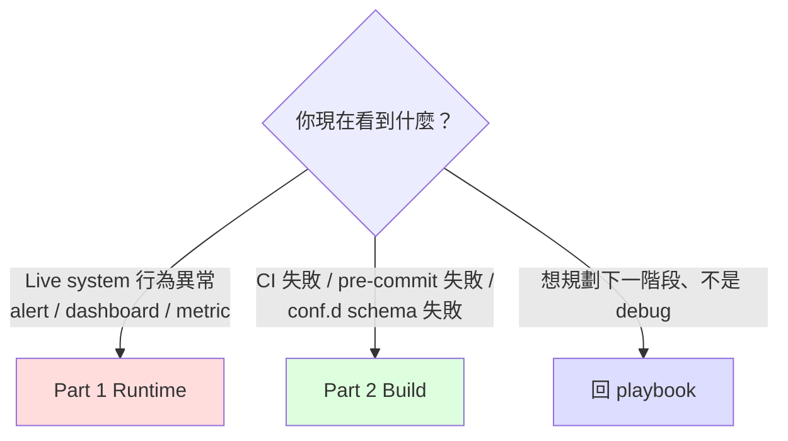

# Troubleshooting Checklist

> **使用情境**：(1) 凌晨 on-call 看到 alert / dashboard 異常需要 5 分鐘內定位；(2) CI / conf.d build failure 需要查為什麼壞掉。**不是**：feature design 討論、phase 規劃 —— 那些回 [multi-system migration playbook](../scenarios/multi-system-migration-playbook.md) 對應 phase narrative。
>
> **頁面結構**：Part 1 = Runtime（live system 異常）/ Part 2 = Build（CI 與 conf.d 端的失敗）。**完全切開** —— 不同情境讀者、不同 mental context。

---

## 0. 5 秒選對 Part



**最佳使用方式**：`Ctrl-F` 你看到的精準 symptom 字串（中英文都試）。本文件的 `H3` 標題刻意寫成「使用者會打進搜尋框的字」而非「架構元件名」。

---

## Part 1 — Runtime（live system 異常）

### 1.1 Metric 不出現在 VM

#### 1.1.1 vmagent target DOWN，scrape exporter 失敗

**Symptom**：
- vmagent target page 顯示某 exporter `DOWN`
- vmagent log 含 `context deadline exceeded` 或 `connection refused`
- VM `/api/v1/query` 查 exporter metric 為空

**Quick diagnosis（依序跑）**：

```bash
# 1. exporter pod 自己活著嗎？
kubectl get pod -n <exporter-ns> -l app=threshold-exporter
# expected: STATUS=Running, READY=1/1

# 2. exporter /metrics 自己回得了嗎？（在 exporter pod 內 curl localhost）
kubectl exec -n <exporter-ns> <exporter-pod> -- curl -sS localhost:8080/metrics | head -5
# expected: # HELP user_threshold ... 之類的 prometheus exposition 開頭

# 3. vmagent pod 從自己網路位置抓得到 exporter 嗎？
kubectl exec -n <vmagent-ns> <vmagent-pod> -- \
    curl -sS --max-time 5 http://<exporter-svc>.<exporter-ns>.svc:8080/metrics | head -5
# expected: 同上 / 失敗 = NetworkPolicy / Service / DNS 問題
```

**最常見原因**：**NetworkPolicy ingress 沒開**——exporter pod 的 NetworkPolicy 只允許自家 namespace 進來、沒開來自 vmagent namespace 的 8080 port。

**Fix**：

```yaml
# exporter NS 的 NetworkPolicy 加 ingress rule
spec:
  ingress:
    - from:
        - namespaceSelector:
            matchLabels:
              kubernetes.io/metadata.name: <vmagent-ns>
      ports:
        - port: 8080
          protocol: TCP
```

**If not this**：
- (a) Service selector 不對 → `kubectl describe svc <exporter-svc>` 看 endpoints 有無 pod IP
- (b) DNS 解析失敗（少見）→ vmagent pod 內 `nslookup <exporter-svc>.<ns>.svc`
- (c) exporter 監聽 `127.0.0.1` 而非 `0.0.0.0` → `kubectl exec ... -- ss -tlnp`

**Cross-ref**：playbook §12 Phase 1 catalog row「NetworkPolicy 阻擋 vmagent/Prom scrape exporter」

---

#### 1.1.2 vmagent scrape 成功但 VM 端沒 ingest（remote_write 卡住）

**Symptom**：
- vmagent target page 顯示所有 target `UP`，scrape 正常
- 但 VM 端 `/api/v1/query` 查不到對應 metric、或 metric 凍結在數十分鐘前的時間點
- vmagent log 含 `dropping data block` / `cannot send block` / `connection reset`
- 客戶 ops 反應「dashboard 顯示舊數據、看起來像 metric 凍結」

**Quick diagnosis**：

```bash
# 1. vmagent 端：buffer 是否在累積（最關鍵指標）
kubectl exec <vmagent-pod> -- wget -qO- localhost:8429/metrics | \
    grep -E '^vmagent_remotewrite_(pending_data_bytes|requests_total|errors_total|conn)'
# expected if broken:
#   vmagent_remotewrite_pending_data_bytes 持續 > 0 且增長
#   vmagent_remotewrite_errors_total 增加
#   vmagent_remotewrite_conn{...} 比預期低

# 2. VM ingest 端：實際進來的 row rate
kubectl exec <vminsert-pod> -- wget -qO- localhost:8480/metrics | \
    grep -E '^vm_rows_inserted_total|^vm_http_request_errors_total'
# expected if broken: rows_inserted rate 突降；errors_total 5xx 增加

# 3. 兩邊 timestamp diff（資料延遲量）
PROM_LATEST=$(kubectl exec <prom-pod> -- wget -qO- \
    'localhost:9090/api/v1/query?query=time()-max(timestamp(up))' | jq '.data.result[0].value[1]')
VM_LATEST=$(kubectl exec <vmselect-pod> -- wget -qO- \
    'localhost:8481/select/0/prometheus/api/v1/query?query=time()-max(timestamp(up))' | jq '.data.result[0].value[1]')
echo "Prom 延遲: ${PROM_LATEST}s, VM 延遲: ${VM_LATEST}s"
# expected if broken: VM 延遲遠高於 Prom（數百秒到數小時）
```

**最常見原因**：**vminsert 端容量不足**——vmagent 把資料推給 vminsert，vminsert 寫入 vmstorage 慢/失敗（disk 滿、replication factor 不滿足、network partition），vminsert 開始回 5xx，vmagent disk buffer 累積。

**第二常見**：**network policy 路徑變動**——vmagent → vminsert 之間突然加了 NetworkPolicy / Service mesh 規則卡 8480 port（看起來 connection 通但 vminsert 視角拒收）。

**Fix（依根因分支）**：

```bash
# 分支 A：vminsert 端容量問題
# 看 vmstorage disk
kubectl exec <vmstorage-pod> -- df -h /vmstorage
# 若 > 95% → 走 §1.4.3 disk 紅區處理（PVC expand）
# 若 disk 正常但 vminsert 仍 5xx → 看 vmstorage replication factor
kubectl get statefulset vmstorage -o jsonpath='{.spec.replicas}'
# 若 replicas < replicationFactor 設定 → vminsert 拒收（waiting for quorum）

# 分支 B：network 路徑問題
# 從 vmagent pod 直接 curl vminsert
kubectl exec <vmagent-pod> -- \
    curl -sS --max-time 5 http://<vminsert-svc>.<vm-ns>.svc:8480/insert/0/prometheus/api/v1/import/prometheus -d '' -i
# expected: HTTP 200 / 204；若 connection refused / timeout = NetworkPolicy 問題
# 看 NetworkPolicy
kubectl get networkpolicy -n <vm-ns>

# 分支 C：vmagent persistent buffer 已滿、buffer 自身造成 OOM 輪迴
# 看 vmagent persistent buffer usage（路徑依 -remoteWrite.tmpDataPath 設定）
kubectl exec <vmagent-pod> -- df -h /vmagent-data
kubectl exec <vmagent-pod> -- du -sh /vmagent-data/remotewrite/*

# ☢️ 致命誤區：直接重啟 vmagent / 砍 pod 不會解決問題
# vmagent persistent buffer 是「持久化」（落在 PVC），pod 重啟後新 pod 掛同一 PVC
# 看到 buffer 仍滿 → 啟動時把幾十 GB 積壓全部載入記憶體 → 再次 OOMKilled → 無限輪迴
# Head-of-line blocking：buffer 沒清前最新 metric 永遠 evict 不出來

# ✅ 正確的「接受資料丟失強行疏通」流程（三步、順序不可錯）：

# 步驟 1：先把進水閥關掉（停止 vmagent 寫入）
kubectl scale deployment vmagent -n <vmagent-ns> --replicas=0
kubectl wait --for=delete pod -l app=vmagent -n <vmagent-ns> --timeout=60s

# 步驟 2：物理刪除 PVC 內積壓的 buffer
# 方法 A：用 debug pod 掛同 PVC 執行 rm
kubectl run vmagent-buffer-cleanup --rm -it --restart=Never \
    --image=busybox \
    --overrides='{"spec":{"containers":[{"name":"cleanup","image":"busybox","command":["sh"],"stdin":true,"tty":true,"volumeMounts":[{"mountPath":"/vmagent-data","name":"data"}]}],"volumes":[{"name":"data","persistentVolumeClaim":{"claimName":"<vmagent-pvc-name>"}}]}}' \
    -- sh
# 進入 debug pod 後：
# rm -rf /vmagent-data/remotewrite/*
# exit

# 方法 B：若 PVC 在原 pod，先 scale up replica=1 但 entrypoint 改成 sleep
# 不推薦——容易踩到 vmagent 啟動 race；用方法 A 更乾淨

# 步驟 3：bump 資源 + scale up
kubectl set resources deployment vmagent -n <vmagent-ns> \
    --limits=memory=2Gi,cpu=2 --requests=memory=1Gi,cpu=500m
# 同時擴 PVC（防再爆）
kubectl edit pvc <vmagent-pvc> -n <vmagent-ns>   # 改 spec.resources.requests.storage
kubectl scale deployment vmagent -n <vmagent-ns> --replicas=1
kubectl wait --for=condition=ready pod -l app=vmagent -n <vmagent-ns> --timeout=120s

# 驗證：vmagent 起來後 pending_data_bytes 應從 0 開始正常累積、不會立即飆升
kubectl exec <new-vmagent-pod> -- wget -qO- localhost:8429/metrics | \
    grep '^vmagent_remotewrite_pending_data_bytes'
```

**Fix 後驗證**：

```bash
# 等 5-10 分鐘
# 1. pending_data_bytes 應降回 ~0
# 2. VM 端 vm_rows_inserted_total rate 回到正常水位
# 3. timestamp diff 兩邊應 < 1 分鐘
```

**If not this**：
- (a) vmagent 與 vminsert 之間有 ingress controller / load balancer，後者 idle timeout 把 long-lived connection 砍掉 → vmagent 必須能 retry，但若 retry 失敗率 > 50% 就會堆 buffer。改 LB idle timeout > 60s
- (b) vminsert 拒收特定 metric（如有 `-relabelConfig` drop）→ 看 vminsert 啟動參數
- (c) clock skew：vmagent 與 vminsert pod 系統時鐘差 > scrape interval → vminsert 視為 out-of-order sample 拒收。確認 NTP / chrony

**Cross-ref**：
- §1.4.1 vmagent OOMKilled（buffer 累積到 OOM 是這節的下游延伸）
- §1.4.2 Prom OOM / vminsert 503（Option 2 路徑的同類問題）
- §1.4.3 VM disk 撐爆（vminsert 5xx 最常見根因）
- playbook §12 Phase 1: vmagent `pending_data_bytes` 長期 > 0

---

### 1.2 Alert 沒 fire（規則 evaluator 端）

#### 1.2.1 Rule evaluator 沒 reload（規則改了但行為不變）

**Symptom**：
- git commit 已 merge、conf.d 應該變了，但 alert 行為仍是舊的
- 客戶 ops 看到「為什麼我改了還是一樣？」

**Quick diagnosis**：

```bash
# 1. ConfigMap / mounted file 是否到 pod 了？
kubectl exec -n <prom-ns> <prom-pod> -- cat /etc/prometheus/rules/<file>.yaml | head -20

# 2. evaluator 是否真的 reload 過了？
kubectl exec -n <prom-ns> <prom-pod> -- \
    wget -qO- localhost:9090/api/v1/status/config | head -5
# 或對 vmalert
kubectl exec -n <vmalert-ns> <vmalert-pod> -- \
    wget -qO- localhost:8080/api/v1/status/config | head -5

# 3. last reload 的 timestamp（Prom 專用）
kubectl exec -n <prom-ns> <prom-pod> -- \
    wget -qO- localhost:9090/api/v1/status/runtimeinfo | grep -i reload
```

**最常見原因**：**GitOps reconcile 卡住**——commit 已 merge 但 ArgoCD / Flux 仍在 backoff 或 webhook 沒觸發 sync；ConfigMap 的舊 generation 還在 pod。

**Fix**：

```bash
# ArgoCD: 強制 sync
argocd app sync <app-name>

# Flux: 強制 reconcile
flux reconcile kustomization <name> --with-source

# 如果 ConfigMap 已新但 pod 沒重 mount（projected volume timing）
kubectl rollout restart deployment <prom-deploy> -n <prom-ns>
# 或對 StatefulSet
kubectl rollout restart statefulset <prom-sts> -n <prom-ns>
```

**If not this**：
- (a) Prometheus Operator 仍在 reconcile PrometheusRule CRD → `kubectl describe prometheusrule <name>` 看 events
- (b) reload endpoint 自己 fail（PromQL syntax error 在新規則裡）→ Prom 會保留舊 config，log 含 `reloading config failed`。修 syntax 重 commit
- (c) HA Prom 兩個 replica 中只有一個 reload 成功 → 見 §1.5.1

**Cross-ref**：playbook §12 Phase 2 catalog row「新規則沒 fire (shadow alert volume = 0)」

---

#### 1.2.2 Shadow label 漏拔（cutover 後仍導去 /dev/null）

**Symptom**：
- Phase 3 cutover 已執行（rule 配置檔已移除某 tenant 的 `migration_status: shadow` label）
- 該 tenant 仍沒收到 production receiver 的 alert（dashboard 顯示 alert 仍 fire 但 receiver 沒響）

**Quick diagnosis**：

```bash
# 1. rule 端：那條規則的 alert label 還帶 shadow 嗎？
kubectl exec -n <prom-ns> <prom-pod> -- \
    wget -qO- 'localhost:9090/api/v1/rules?type=alert' | \
    jq '.data.groups[].rules[] | select(.name | contains("<rule-name>")) | .labels'
# expected: 沒有 migration_status: shadow

# 2. AM 端：alert payload 仍帶 shadow label 嗎？
kubectl exec -n <am-ns> <am-pod> -- \
    wget -qO- 'localhost:9093/api/v2/alerts?filter=alertname=<name>' | \
    jq '.[].labels'
# expected: 沒有 migration_status: shadow
```

**最常見原因**：**rule 配置檔改對了但 evaluator 沒 reload**（接 §1.2.1）。

**第二常見原因**：**改錯地方了** —— 在 AM config 改 matcher 而不是在 rule label。Phase 3 的正確機制是改 rule，不是改 AM。

**Fix**：

```bash
# 確認是 rule 端改：grep conf.d 那個 tenant 的 rules
grep -rn "migration_status:" conf.d/<domain>/<region>/<tenant>.yaml
# expected: 沒結果（已拔掉）

# AM config 完全不該動
diff <(kubectl get cm am-config -o yaml) <previous-am-config>
# expected: 無 diff
```

**If not this**：
- AM `null` receiver 還在 catch shadow → 但 rule label 已拔，理論上不該 match shadow matcher。除非 routing 順序有 fall-through bug → 見 §1.3.1

**Cross-ref**：playbook §6 Phase 3 narrative「常見錯誤：以為要改 AM config」+ playbook §12 Phase 3: Canary tenant 真的 fire alert

---

### 1.3 Alert fire 但路由錯

#### 1.3.1 AM matcher 順序錯（shadow alert 漏到 production）

**Symptom**：
- shadow 期間客戶 ops 半夜被 paged（不該收到 shadow alert）
- alert payload 帶 `migration_status="shadow"` label 卻送到了 PagerDuty / Slack production channel

**Quick diagnosis**：

```bash
# 1. 看 AM 實際 routing（amtool）
amtool config routes --config.file=/etc/alertmanager/alertmanager.yml show
# expected tree: shadow matcher 是第一個 child，不是末段

# 2. 模擬 shadow alert 看 routing 走到哪
amtool config routes test --config.file=/etc/alertmanager/alertmanager.yml \
    migration_status=shadow severity=critical alertname=TestAlert
# expected: receiver = "null"
```

**最常見原因**：**shadow matcher 在 `route.routes` 末段而非開頭**，前面有 `severity=critical` 之類的全 catch route 先截走。

**Fix**：把 shadow matcher 移到 `routes` 第一個 entry：

```yaml
route:
  receiver: default-receiver
  routes:
    - matchers: [migration_status="shadow"]   # ← 必須是第一個
      receiver: "null"
      continue: false                          # ← 不再 fall-through
    - matchers: [severity="critical"]
      receiver: pagerduty
    # ... 其他
```

**If not this**：
- (a) `continue: true` 寫錯讓 alert fall-through → 改 `continue: false`
- (b) AM v0.27 vs v0.32 matcher 語法差異 → 用 `==` 不是 `=~` 除非真要 regex
- (c) `null` receiver 配置漏（receiver name 拼錯）→ AM log 含 `receiver "null" not found`

**Cross-ref**：playbook §12 Phase 2 catalog row「Shadow alert 漏到 production receiver」

---

#### 1.3.2 Silencer mismatch（disablement drift / double-fire alert storm）

**Symptom**：
- Cutover 後（Phase 3 全量階段或 Rule Pack v1→v2 升版）某類 alert **同時被 v1 和 v2 規則觸發**
- AM dashboard 看到同 alertname 短時間內大量 fire
- 客戶 ops 反應「我們明明 silenced 了 MySQLDown，為什麼還在叫？」
- 嚴重時數十條 alert 在 5-10 分鐘內全 fire（alert storm）

**Quick diagnosis**：

```bash
# 1. 看現在有哪些 active silencer
kubectl exec -n <am-ns> <am-pod> -- \
    wget -qO- 'localhost:9093/api/v2/silences?filter=state=active' | \
    jq '.[] | {id, matchers: .matchers, comment}'
# expected: 看到 v1 alertname 的 silencer 仍 active

# 2. 看現在 firing 的 alert label
kubectl exec -n <am-ns> <am-pod> -- \
    wget -qO- 'localhost:9093/api/v2/alerts?filter=state=active' | \
    jq '.[] | {labels: .labels, status: .status.state}' | head -40
# expected: 看到 v2 alertname (不同) 但語意上相同的 alert 在 fire

# 3. 比對 v1 與 v2 alertname diff（從 git）
git diff main..HEAD -- conf.d/ | grep -E "^[+-].*alertname"
# 或對照 Rule Pack changelog
cat rule-packs/<pack>/CHANGELOG.md | head -30
```

**最常見原因**：**v1 silencer matchers 用 `alertname=MySQLDown`，v2 改名為 `DatabaseDown_MySQL`** — silencer 的 matcher 不再 match 任何 alert，alert 直接 fire 到 production receiver。同時 v1 規則仍在 evaluate（cutover 期 dual-rule 期間）→ 兩條都 fire = double storm。

**Fix（兩階段）**：

```bash
# 立即止血：對 v2 alertname 加新 silencer
amtool silence add \
    --alertmanager.url=http://<am>:9093 \
    --duration=2h \
    --comment="cutover disablement drift, v2 rename" \
    alertname=DatabaseDown_MySQL

# 之後 systematic：跑 silencer 與 v2 alertname 的 reconcile
# ✅ da-tools silencer-drift-check 已 ship（2026-05-12，issue #405 Category B）
# Offline-first 設計：工具不直接連 AM（避免 VPN/Ingress/Auth 邊界踩雷），
# 吃 amtool 抓下來的 JSON 檔案。標準流程：

# Step 1：在有權限的環境（bastion / kubectl exec / port-forward 後）抓 silencer
amtool silence query -o json --alertmanager.url=http://<am>:9093 > active_silences.json

# Step 2：local / CI 端比對（不需要 AM 連線）—— 一行命令
da-tools silencer-drift-check --silences-file active_silences.json --rule-source rule-packs/

# 含完整 matcher 邏輯（isEqual / isRegex 4 combinations，不只 alertname=
# 還含 severity=、team= 等 label-value 漂移）。CI gate：加 --ci 偵測到 orphan
# exit 1。Machine-readable：加 --json。

# 手動 fallback（airgapped / 工具不可用時）—— 只比 alertname=、不處理多 matcher：
grep -hE '^\s+- alert:' conf.d/**/*.yaml | awk '{print $3}' | sort -u > /tmp/v2-alertnames.txt
jq -r '.[].matchers[] | select(.name == "alertname") | .value' active_silences.json | sort -u > /tmp/silenced-alertnames.txt
# Drift = silencer 還在用但 v2 conf.d 已沒有的 alertname
comm -23 /tmp/silenced-alertnames.txt /tmp/v2-alertnames.txt
```

**If not this**：
- (a) silencer 確實已過期 → 客戶記憶錯，不是 drift。確認 `endsAt` 還是未來
- (b) silencer matchers 用 regex 但寫錯（`alertname=~"MySQL.*"` 而 v2 改 `Database`）→ 需修 regex
- (c) v1 規則沒拔（不是改名問題、是 dual-rule 並存）→ cutover 後該 v1 規則應已從 conf.d 移除；若仍在則 git revert 或拔 rule

**Cross-ref**：
- playbook §6 Phase 3 narrative「Disablement drift」
- playbook §12 Phase 3: AM silencer 對 v1 alertname mismatch v2
- [staged-adoption-guide §7.3](../scenarios/staged-adoption-guide.md) — disablement drift 機制詳解（Rule Pack 升版時也是同一套，cutover 是首次套用）

---

### 1.4 性能 / OOM / disk

#### 1.4.1 vmagent OOMKilled

**Symptom**：
- vmagent pod restart count 飆升
- `kubectl describe pod` events 含 `OOMKilled`
- VM ingest 出現空白時段

**Quick diagnosis**：

```bash
# 1. 確認 OOM
kubectl describe pod <vmagent-pod> -n <vmagent-ns> | grep -A2 "Last State"
# expected: Reason: OOMKilled

# 2. 看當前 memory limit 與 actual usage
kubectl top pod <vmagent-pod> -n <vmagent-ns>
kubectl get pod <vmagent-pod> -n <vmagent-ns> -o jsonpath='{.spec.containers[0].resources.limits.memory}'

# 3. 看 series count（是不是真的太大）
kubectl exec -n <vmagent-ns> <vmagent-pod> -- \
    wget -qO- 'localhost:8429/metrics' | grep -E '^vmagent_remotewrite_(samples|conn)' | head
```

**最常見原因**：**memory limit 預設 64Mi 對 100k+ series 不夠**。

**Fix**：

```yaml
# vmagent helm values
resources:
  limits:
    memory: 1Gi   # 從 64Mi bump 到 1Gi
  requests:
    memory: 512Mi

# 加上 throttle remote_write block size（避免一次太大）
extraArgs:
  remoteWrite.maxBlockSize: "8MB"   # 預設 32MB
```

**If not this**：
- (a) cardinality bursts（label 組合爆炸）→ 看 series count，加 vmagent relabel drop 不需要的 label
- (b) remote_write target 慢 → buffer 累積導致 OOM → 見 §1.4.2 對應的 Prom 端問題、或 §1.4.5 VM ingest 慢

**Cross-ref**：playbook §12 Phase 1 catalog row「vmagent OOMKilled in 初次 dual-write」

---

#### 1.4.2 Prom OOMKilled / vminsert 5xx spike（Option 2 queue_config 缺）

**Symptom**：
- 加 `remote_write` 給 VM 後 reload，30 秒內 Prom OOMKilled
- 同時 vminsert 收到大量 HTTP 503，新進 metric 寫不進
- 客戶以為「VM 容量問題」實際是 client 端 queue tuning

**Quick diagnosis**：

```bash
# 1. Prom remote_write metrics
kubectl exec <prom-pod> -- wget -qO- localhost:9090/metrics | \
    grep -E 'prometheus_remote_storage_(shards|samples_in_total|pending|queue_length)'
# expected if broken: shards = 200 (預設), pending 持續飆升

# 2. vminsert 5xx rate
kubectl exec <vminsert-pod> -- wget -qO- localhost:8480/metrics | \
    grep -E 'vm_http_request_errors_total{path="/insert' 

# 3. 看 prometheus.yml 是否含 queue_config
kubectl get cm prometheus-config -o yaml | grep -A10 'remote_write:'
# expected: 該有 queue_config block；沒有就是元兇
```

**最常見原因**：**`remote_write` block 省略 `queue_config`**，預設 `max_shards: 200` 對大 Prom 是地雷。

**Fix**：

```yaml
remote_write:
  - url: "http://vminsert.vm.svc:8480/insert/0/prometheus"
    queue_config:
      max_samples_per_send: 10000
      max_shards: 30                # 預設 200 太高
      capacity: 25000
```

```bash
# Prom reload 套用
kubectl exec <prom-pod> -- wget -qO- --post-data='' localhost:9090/-/reload
```

**If not this**：
- (a) 真的是 vminsert 容量不足（有 queue_config 仍打爆）→ vminsert HPA / scale up
- (b) Prom 本身 series count 過大 + 加 remote_write 雙重壓力 → 拆 vmagent 走 Option 1 比較適合（詳見 playbook §4）

**Cross-ref**：playbook §12 Phase 1 catalog row「Option 2: Prom remote_write reload 後 OOM 或打趴 vminsert」+ playbook §4 Option 2 narrative

---

#### 1.4.3 VM disk 即將撐爆 / 已撐爆

**Symptom**：
- VM disk usage > 80%（warn）或 > 95%（critical）
- vmsingle / vmstorage log 含 `error: not enough free space`
- 新 metric 寫入失敗、`vm_rows_received_total` 不再增長
- vminsert 開始回 5xx
- 嚴重時 VM crash 重啟、index 損壞需 repair

**Quick diagnosis**：

```bash
# 1. 當前 disk usage
kubectl exec -n <vm-ns> <vmsingle-pod> -- df -h /vm-data
# 或對 vmcluster 看 vmstorage
kubectl exec -n <vm-ns> <vmstorage-pod> -- df -h /vmstorage

# 2. 增速看最近 24h
kubectl exec <vm-pod> -- wget -qO- 'localhost:8428/metrics' | \
    grep -E '^vm_data_size_bytes'
# 與 24h 前 metric 比，算 GB/day

# 3. 找出佔 disk 的兇手 metric（high cardinality / high churn）
kubectl exec <vm-pod> -- wget -qO- \
    'localhost:8428/api/v1/labels' | jq '.data | length'
# 看 label 總數

kubectl exec <vm-pod> -- wget -qO- \
    'localhost:8428/api/v1/series?match[]={__name__=~".+"}&limit=1000000' | \
    jq '.data | group_by(.__name__) | map({metric: .[0].__name__, series_count: length}) | sort_by(-.series_count) | .[0:20]'
# 列出前 20 大 series count metric

# 4. 確認 retention 設定
kubectl get statefulset <vm-sts> -o yaml | grep -A2 retentionPeriod
```

**最常見原因**：**cardinality 估算嚴重失誤**——客戶宣稱 10k tenant labels 實際因 multi-region label combination 達 100k+。次常見：dual-write 期間 doubling 撞 cardinality 上限沒人盯。

**Fix 路徑（依緊急程度，順序錯會自爆）**：

> ⚠️ **極重要的 LSM 自爆陷阱**：VictoriaMetrics 是 LSM-tree 結構，background merge **需要先寫入合併後的新 block，才會刪除舊 block**（write amplification）。Disk > 95% 時若觸發 merge（包括縮 retention 重啟），VM 會在幾秒內把剩餘空間吃光、報 `no space left on device` 直接 crash、index 損壞。**Disk usage 是決定處置順序的唯一因素**，不是「緊急程度」。

##### Disk > 95%（紅區）— 只有擴容是安全的

```bash
# 唯一安全選項：PVC expand（需 StorageClass 支援 allowVolumeExpansion）
kubectl edit pvc <vm-pvc>
# 改 spec.resources.requests.storage 加 ~30%（例 1Ti → 1.5Ti）
# 等 ~1-5 分鐘 PV 擴容完成（雲廠商側操作）
kubectl get pvc <vm-pvc> -o jsonpath='{.status.capacity.storage}'
# expected: 看到新值
```

**若 StorageClass 不支援 expand 或 quota 卡住，最後手段（破壞性）**：

```bash
# ☢️ 危險操作 — 手動刪舊 partition，會永久失去那段時間的資料
# 僅在「已確認 PVC expand 完全不可行 + crash 在即」時使用

# 1. exec 進 vmsingle / vmstorage pod
kubectl exec -it <vm-pod> -- sh

# 2. 列 partition（VM 預設按月分區，"YYYY_MM" 命名）
ls -la /vm-data/data/small/  # 或 /vmstorage/data/small/ for vmcluster
# expected: 2024_01/ 2024_02/ ...

# 3. 找最舊的 partition（避開當前月）
# 4. ☢️ 確認真的不再需要該段資料（compliance / audit / cold-storage backup 已完成）
rm -rf /vm-data/data/small/2024_01

# 5. VM 自動偵測 partition 移除、釋放 disk inode
# 6. 重啟 vmsingle 確認 schema 一致
```

**為什麼縮 retention 在紅區是錯的**：
- Retention shrink 觸發 merge 處理 partition pruning → merge 需要 >= 該 partition 大小的暫存空間
- VM 預設按**月**分 partition（`-retentionPeriod=30d` 不會立刻刪今天的資料、只會刪整個過期月）
- Disk 已紅區 = 沒有 buffer 給 merge 跑 → 立即 ENOSPC

##### Disk 80-95%（橙區）— retention shrink 安全

```bash
# 此時還有 buffer 讓 merge 寫新 block，retention shrink 是合理選項
# vmsingle 重啟參數
# -retentionPeriod=30d → -retentionPeriod=14d
kubectl edit statefulset <vmsingle-sts>
# 改 spec.template.spec.containers[0].args

# 重啟觸發 background merge 釋放（依 partition 大小，數十分鐘到數小時）
# 期間 disk usage 會先**短暫上升**再下降（merge write amplification 正常現象）
```

##### Disk < 80%（綠區）— 結構性處理

```yaml
# 找出 high-cardinality label 並 drop（vmagent 端）
relabel_configs:
  - action: labeldrop
    regex: pod_template_hash|controller-revision-hash|<其他 noise>

# 整段 drop noisy metric
  - action: drop
    source_labels: [__name__]
    regex: container_(network|fs)_.+_total
```

**If not this**：
- (a) disk 已 100%、VM crash 起不來 → 走 [VM 官方 disaster recovery](https://docs.victoriametrics.com/Single-server-VictoriaMetrics.html#data-recovery)；emergency 模式：`-storageDataPath` 指到新空盤啟 VM、舊 data 用 `vmctl` 慢慢匯入
- (b) cardinality 暴漲是 **single bad metric** 引入（template metric label 沒 set）→ vmagent drop 該 metric 立竿見影；但**仍須先擴容 disk**才能跑 merge
- (c) disk 增速跟 metric ingest 不匹配（增速異常）→ 可能是 background merge 失敗、index 重建，VM log 找 `merge` / `index` keyword

**Cross-ref**：
- playbook §12 Phase 1: VM disk 撐爆
- playbook §4 disk budget formula（Phase 1 narrative）
- [VM Capacity Calculator](https://docs.victoriametrics.com/Single-server-VictoriaMetrics.html#capacity-planning)

#### 1.4.4 Cardinality 暴漲

**Symptom**：
- `vm_cardinality_limit_rows_dropped_total` 開始有非零值（VM ingest 開始拒收）
- `prometheus_tsdb_head_series` 在短時間內飆升（小時級 5-10x 暴漲）
- VM disk 增速跳水式變化（與 §1.4.3 互為前因 / 後果）
- AM 收到 `cardinality limit exceeded` 之類的 platform alert

**Quick diagnosis**：

```bash
# 1. 確認暴漲是真的（不是測量誤差）
kubectl exec <prom-pod> -- wget -qO- \
    'localhost:9090/api/v1/query?query=prometheus_tsdb_head_series'
# 與 24h 前 metric 比對；正常增長率應 < 5%/day

# 2. VM 端是否已開始 drop
kubectl exec <vm-pod> -- wget -qO- \
    'localhost:8428/api/v1/query?query=vm_cardinality_limit_rows_dropped_total'
# 非零 = ingest 已被拒收；新 metric 正在丟失

# 3. 找出爆量的 metric（top-20 by series count）
kubectl exec <vm-pod> -- wget -qO- \
    'localhost:8428/api/v1/series?match[]={__name__=~".+"}&limit=10000000' | \
    jq '.data | group_by(.__name__) | map({metric: .[0].__name__, n: length}) | sort_by(-.n) | .[0:20]'

# 4. 對某個爆量 metric 找出哪個 label 是兇手
# 例：mysql_query_count 爆量
kubectl exec <vm-pod> -- wget -qO- \
    'localhost:8428/api/v1/series?match[]=mysql_query_count&limit=100000' | \
    jq '.data[] | keys[]' | sort | uniq -c | sort -rn | head
# 看哪個 label 出現次數遠大於 series count → 該 label 值多樣性高
```

**最常見原因**：**新 deploy 的 service 在 metric 內塞了高基數 label**——`request_id` / `trace_id` / `user_id` / 動態生成的 path / `pod_template_hash` / `controller-revision-hash` 等。

**Fix（請按此順序考慮，反過來會自爆）**：

> ☢️ **`labeldrop` 致命陷阱**：直覺反應是「拔掉 high-cardinality label」用 `action: labeldrop`。**這幾乎永遠是錯的**——拔掉 label 後**多個原本不同的 series 會被 collapse 成同一個 series**，VM/Prom 看到同一個 metric+label-set 多個 datapoint 會報 **`Duplicate sample for timestamp`**、寫入失敗、或更糟：dataset 被互相覆蓋、數值錯亂沒人發現。

**正確的優先順序**：

```yaml
# 優先 1：drop 整個 metric（最安全）
# 確認該 metric 真的不需要、或可從另外的 metric 推導出來
relabel_configs:
  - action: drop
    source_labels: [__name__]
    regex: 'noisy_metric_name|debug_request_count'
```

```yaml
# 優先 2：drop 高基數 metric 的特定 label 值（保留 metric、限制範圍）
# 例：保留 mysql_query_count 但只對特定 db_name 集合保留
  - action: drop
    source_labels: [__name__, db_name]
    regex: 'mysql_query_count;ad_hoc_db_.*'
```

```yaml
# 優先 3：labeldrop —— 必須 100% 確定該 label
#   (a) 不是 metric 邏輯主鍵的一部分
#   (b) 不是 PromQL 規則 / Grafana panel 任何 by(...) / on(...) / group_left(...) 的 key
#   (c) 沒有任何下游 join 依賴
# 然後才能用：
  - action: labeldrop
    regex: pod_template_hash|controller-revision-hash
# 這兩個是公認的 K8s 雜訊 label、不參與業務 PromQL
```

**Fix 的施做位置**：

```bash
# vmagent 端（Option 1 dual-write）：改 vmagent ConfigMap relabel
kubectl edit cm vmagent-config -n <vmagent-ns>
kubectl rollout restart deployment vmagent -n <vmagent-ns>

# Prom 端（Option 2 / 直接 scrape）：改 prometheus.yml relabel
kubectl rollout restart statefulset prometheus -n <prom-ns>
```

**驗證**：

```bash
# 5-10 分鐘後重跑 step 1 - step 4，確認:
# - prometheus_tsdb_head_series 增長率回到 < 5%/day
# - vm_cardinality_limit_rows_dropped_total 不再增加
# - top-20 列表不再被噪音 metric 佔滿
```

**If not this**：
- (a) 暴漲不在新 metric 而在舊 metric 的某 label → service 開始把高基數值塞進老 metric；溯源到 source service 修
- (b) 暴漲跨多個 metric 同步發生 → 通常是上游某共用 library 升級埋雷（如 OpenTelemetry SDK auto-instrumentation）
- (c) 已 drop 但 series count 不下降 → drop 只阻擋新 series 進來，老 series 還在 retention 內；等 retention 到期才會掉、或縮 retention（記得讀 §1.4.3 disk zone）

**Cross-ref**：
- §1.4.3 VM disk 撐爆（cardinality 暴漲是它最常見的前因）
- playbook §4 Phase 1 narrative「Cardinality budget watch」
- [VM cardinality 官方 doc](https://docs.victoriametrics.com/FAQ.html#what-is-an-active-time-series)

---

### 1.5 Cutover/rollback 異常

#### 1.5.1 HA Prom reload race（兩 replica 不同步、AM dedup 失效雙重 page）

**Symptom**：
- HA Prom (replica-0 / replica-1) 在 cutover / config 變動後行為不一致
- 同 alertname 在短時間內**收到兩次通知**（not 重複，是兩個不同 alert 物件）
- AM `/api/v2/alerts` 看到 alert 物件**有兩筆**，labels 大致相同但**差一個 label**（典型是 `migration_status` / `replica` 之類）
- on-call 工程師被 page 兩次、誤以為是真的 incident 而升級

**為什麼這比「規則沒 reload」更糟**（重要前理解）：

> ⚠️ **AM dedup 機制本質上是「label-set 全等才 dedup」**——兩個 replica 一個帶 `migration_status: shadow`、一個不帶，AM 視為**兩個完全不同的 alert**，dedup 不會發生。結果：
>
> - 帶 shadow label 的 alert → 進 `/dev/null` receiver
> - **不帶 shadow label 的 alert → 進 production receiver、半夜 page**
>
> 客戶 ops 看到 page 完全合理、不會懷疑是 cutover artifact。事故時客戶只看到「AM 發了 production page」沒人會查 alert payload 裡 label set 的 N+1 個維度。修這類問題前必須先**讓客戶 ops 理解這不是 production incident，不要動 production**。

**Quick diagnosis**：

```bash
# 1. 確認兩 replica 是否真的不同步
for pod in prometheus-k8s-0 prometheus-k8s-1; do
    ts=$(kubectl exec -n <prom-ns> $pod -- \
        wget -qO- localhost:9090/api/v1/status/runtimeinfo | \
        jq -r '.data.lastConfigTime // empty')
    rev=$(kubectl exec -n <prom-ns> $pod -- \
        wget -qO- localhost:9090/api/v1/status/config | \
        jq -r '.data.yaml' | sha256sum | cut -c1-12)
    echo "$pod: lastConfigTime=$ts configHash=$rev"
done
# expected: 兩 pod 的 lastConfigTime 與 configHash 都應一致；不一致 = race confirmed

# 2. 確認 AM 收到的 alert 是否含 unexpected label
kubectl exec -n <am-ns> <am-pod> -- \
    wget -qO- 'localhost:9093/api/v2/alerts?filter=alertname=<name>' | \
    jq '.[] | .labels'
# expected for cutover-in-progress: 兩筆 alert，labels 差 1 個（migration_status / replica）

# 3. 看 SIGHUP 是否真的失敗（log 找 reload error）
kubectl logs -n <prom-ns> prometheus-k8s-1 --tail=200 | \
    grep -iE 'reload|sighup|config'
# expected if broken: "reloading config failed: ..." 或無 reload 紀錄
```

**最常見原因**：**replica-1 的 SIGHUP 失敗或 silently 沒處理**——可能是 OOM 邊緣、PromQL evaluation 卡住、或 ConfigMap projection 延遲（mount 還是舊 generation）。

**Fix（依嚴重度分階段，先溫和後暴力）**：

##### 階段 A — 溫和：手動 reload 落後的 replica

```bash
# 對落後的 replica 直接打 reload endpoint
kubectl exec -n <prom-ns> prometheus-k8s-1 -- \
    wget -qO- --post-data='' localhost:9090/-/reload
# expected: 200 OK，5 秒後重跑 diagnosis step 1，兩 pod hash 應相同
```

##### 階段 B — 中等：強制 ConfigMap re-projection

```bash
# 如果階段 A 失敗（reload 自己 timeout / 報錯），可能是 ConfigMap mount 沒 refresh
# Prometheus Operator 對 PrometheusRule CRD 的 reconcile 有時要 nudge
kubectl annotate prometheusrule <rule-name> reload-nonce="$(date +%s)" --overwrite
# 或對 raw ConfigMap
kubectl get cm prometheus-config -o yaml | \
    kubectl apply -f -   # re-apply 觸發 mount refresh
```

##### 階段 C — 暴力：直接刪 pod 讓 StatefulSet 重新拉

```bash
# ⚠️ 階段 A/B 都失敗時，replica 內部狀態可能已 corrupt（ticker queue / TSDB lock 卡死）
# SIGHUP 對 corrupt 狀態無效，必須整個 pod 重起
# StatefulSet 會自動把它拉回來、新 pod 從 ConfigMap 讀新 config
kubectl delete pod prometheus-k8s-1 -n <prom-ns>

# 等 ~30 秒新 pod ready
kubectl wait --for=condition=ready pod prometheus-k8s-1 -n <prom-ns> --timeout=120s

# 重跑 diagnosis step 1 確認兩 pod hash 同步
```

**為什麼 SIGHUP 不是萬能**：Prometheus reload 走 internal goroutine 排程，如果 evaluator 卡在某條 expensive PromQL、或 TSDB compaction 拿了 lock 沒釋放、或 process 已進入 `SIGKILL waiting` pseudo-state，SIGHUP 訊號會被丟進處理 queue 但永遠不被處理。**這時只有 process 級別重啟有效**。

**Fix 後的 AM 端清理**：

```bash
# AM 內可能已累積兩筆 alert（一筆會自然 resolve、另一筆是真正的 truth）
# 不要急著 silence——讓自然 evaluation cycle 修正
# 5-10 分鐘後 AM 應只剩單一 alert 物件
kubectl exec <am-pod> -- wget -qO- 'localhost:9093/api/v2/alerts?filter=alertname=<name>' | \
    jq '.[].labels'
# expected: 1 筆物件
```

**If not this**：
- (a) 兩 replica 都 reload 成功但仍不同步 → 可能是 PrometheusRule CRD 多版本 / external_labels 不同 / 不同 sharding；查 Prometheus Operator 設定
- (b) 反覆出現（修一次又壞）→ replica-1 有資源約束（memory limit 太低、PVC slow IO）；改 resource limits 或 storage class
- (c) 整個 reload 系統都卡（兩 replica 都不 reload）→ Prometheus Operator 自己卡住；`kubectl rollout restart deployment prometheus-operator`

**Cross-ref**：
- playbook §12 Phase 3: Rule reload race
- §13 walkthrough Phase 3「全量切換期 HA Prom 兩 pod 中一個 SIGHUP 失敗」（真實案例）
- §1.2.1（單 replica reload 沒生效，與本節不同情境）

#### 1.5.2 Dashboard 突然 No-Data（datasource UID drift）

**Symptom**：
- Phase 4 後（或 Grafana datasource 重建後）某 dashboard panel 全 `No data`
- 客戶 ops / capacity team / SRE 反應「我的 dashboard 壞了」
- panel 配置看起來正常但 query 結果空

**Quick diagnosis**：

```bash
# 1. 看 dashboard panel 用的 datasource UID
# 透過 Grafana API 或 dashboard JSON
curl -sH "Authorization: Bearer $GRAFANA_TOKEN" \
    https://grafana.example.com/api/dashboards/uid/<dash-uid> | \
    jq '.dashboard.panels[] | {title, datasource}'

# 2. 列當前 Grafana 已知的 datasource UID
curl -sH "Authorization: Bearer $GRAFANA_TOKEN" \
    https://grafana.example.com/api/datasources | \
    jq '.[] | {uid, name, type}'

# 3. grep dashboard JSON 找 hardcoded UID（panel-level 之外的引用）
curl -sH "Authorization: Bearer $GRAFANA_TOKEN" \
    https://grafana.example.com/api/dashboards/uid/<dash-uid> | \
    jq '.dashboard' | grep -E '"uid"|"datasource"'
# expected: 找到 panel level 之外仍 reference 舊 UID 的字串
```

**最常見原因**：**dashboard JSON 含 hardcoded UID 在 template variable / annotation / derived field**，bulk migration tool 只改了 panel-level datasource，這些角落沒被 migrate；或 audit script 只 grep `legacy-prom` URL 漏抓 UID 字串。

**Fix 兩階段**：

##### 階段 1（立即止血）：grace period 舊 Prom 自動 fallback

```bash
# 如果舊 Prom 仍在 grace period（read-only 但活著）
# → dashboard 自動 fallback 不需動，先確認舊 datasource 仍可 query
curl -sH "Authorization: Bearer $GRAFANA_TOKEN" \
    -X POST https://grafana.example.com/api/datasources/uid/<legacy-prom-uid>/health
# expected: {"status": "OK"} → dashboard 仍可運作、安心 defer
```

##### 階段 2（根除）：先確認 dashboard 部署機制再選工具

> ⚠️ **GitOps 校正回歸警告**：在 K8s 環境 dashboard 通常透過 **Grafana sidecar (kube-prometheus-stack)** 從 `ConfigMap` 動態載入；或 **ArgoCD / Flux 直接管 Grafana CRD**。如果用 Grafana API `POST /api/dashboards/db` 強制覆寫，**3-5 分鐘後** GitOps reconcile 會把 Git/ConfigMap 內舊 JSON sync 蓋回來、dashboard 又壞掉、on-call 陷入「修了又壞」無限輪迴。

**先 grep 部署機制**：

```bash
# 1. 檢查 dashboard 是否由 ConfigMap provisioning
kubectl get cm -n <grafana-ns> -l grafana_dashboard=1 -o name | head
# 有結果 = sidecar provisioning，必須改 source 不是改 API

# 2. 或檢查 ArgoCD Application
kubectl get application -A | grep -i grafana
# 有 result = ArgoCD 管，必須改 Git repo

# 3. 或用 Grafana API 看 dashboard origin
curl -sH "Authorization: Bearer $GRAFANA_TOKEN" \
    https://grafana.example.com/api/dashboards/uid/<dash-uid> | \
    jq '.meta | {provisioned, provisionedExternalId, isFolder, slug}'
# .provisioned = true → 由 sidecar / file provisioner 部署，API 改不了
```

**Path A — Provisioned dashboard（GitOps / sidecar）**：必須改 source

```bash
# 1. clone Git repo
git clone <dashboard-repo> && cd <repo>

# 2. 改 dashboard JSON，全文 grep 改 UID
find . -name "*.json" -exec sed -i 's/"<old-uid>"/"<new-uid>"/g' {} \;
# 注意 sed -i 在 macOS / 部分檔案系統有差異，跨平台用 ripgrep + python 更穩

# 3. PR + merge
git add . && git commit -m "fix: migrate dashboard datasource UID old→new"
git push origin <branch>
# 4. 等 ArgoCD / sidecar reconcile（通常 < 5 分鐘）
```

**Path B — UI-created dashboard 或緊急臨時止血**：API overwrite

```bash
# 僅適用 .meta.provisioned == false 的 dashboard
# 或客戶確認接受 "GitOps 會在 N 分鐘後蓋回，這是臨時止血" 的場景

curl -sH "Authorization: Bearer $GRAFANA_TOKEN" \
    https://grafana.example.com/api/dashboards/uid/<dash-uid> | \
    jq '.dashboard | walk(if type == "object" and .uid == "<old-uid>" then .uid = "<new-uid>" else . end)' | \
    jq '{dashboard: ., overwrite: true, message: "datasource UID migration"}' | \
    curl -sH "Authorization: Bearer $GRAFANA_TOKEN" \
        -H "Content-Type: application/json" \
        -X POST -d @- \
        https://grafana.example.com/api/dashboards/db
```

**改完 audit**：跨整個 Git repo（Path A）或整個 Grafana instance（Path B）跑 `grep -rE '"uid":\s*"<old-uid>"'`，確保歸 0。

**重點警告**：

- **不要在 CAB freeze 期跑 Path A 的 PR + sync**——批次改 30+ dashboard 過不了 enterprise change review。grace period 的舊 Prom 是天然防禦，先靠它撐到 freeze 結束
- **不要靠 Grafana UI bulk migrate**——它通常只改 panel-level datasource，hardcoded UID 在 JSON 內角落漏抓
- **Path B 後若發現 dashboard 又變回舊 UID** = 部署機制其實是 provisioned，要改走 Path A

**If not this**：
- (a) datasource 還在但 query 仍 fail → 檢查 datasource 連線（健康檢查 endpoint）、auth header 是否變動
- (b) panel 用 template variable 但 variable query 自己 reference 舊 datasource → 變數面板獨立 reconfigure
- (c) Grafana provisioning（YAML 部署）vs UI 改動衝突 → provisioning 會覆蓋 UI 修改、改 provisioning YAML 才永久

**Cross-ref**：
- playbook §6 Phase 3 narrative「Grafana Datasource 切換」
- playbook §12 Phase 4: 舊 Prom 關閉後某 Grafana dashboard 全紅
- §13 walkthrough Phase 4「Grace Period 救了所有人」

---

### 1.6 資料不一致

#### 1.6.1 Dual-write metric drift > 5%（Phase 1 Gate 1 fail）

**Symptom**：
- Phase 1 Gate 1 invariant 「VM 與 Prom 同 metric 數量 ±5%」 fail
- VM 側 metric count 比 Prom 多 / 少 > 5% 持續一週
- 客戶 ops 反應「為什麼 staging dashboard 比 prod 數字差這麼多」

**Quick diagnosis**：

> ⚠️ **不要用 `count(up)` 算 drift**——`up` 計的是 **scrape target 數**，不是 series 數。Prom 與 vmagent 各自抓 100 個 target，`count(up)` 都會 = 100、drift = 0%。但若 vmagent relabel 把某 target 的 50k 個 `staging_only_*` series drop 掉，這 50k 落差 `count(up)` 完全看不到。Drift detection 必須查**真正的 series count 或 ingest rate**。

```bash
# 1. 用 storage 端的真實 series count（最準）
PROM_SERIES=$(kubectl exec <prom-pod> -- wget -qO- \
    'localhost:9090/api/v1/query?query=prometheus_tsdb_head_series' | \
    jq '.data.result[0].value[1] | tonumber')
# VM 端：vmsingle 看 vm_cache_entries，vmstorage 看 vmstorage_cache_entries
VM_SERIES=$(kubectl exec <vmsingle-pod> -- wget -qO- \
    'localhost:8428/api/v1/query?query=vm_cache_entries{type="storage/hour_metric_ids"}' | \
    jq '.data.result[0].value[1] | tonumber')
echo "Prom: $PROM_SERIES, VM: $VM_SERIES, drift: $(awk "BEGIN{printf \"%.2f%%\", ($VM_SERIES-$PROM_SERIES)/$PROM_SERIES*100}")"

# 2. 替代：比對 ingest rate（post-relabel sample rate，反映真實流入量）
# Prom 端
kubectl exec <prom-pod> -- wget -qO- \
    'localhost:9090/api/v1/query?query=sum(rate(scrape_samples_post_metric_relabeling[5m]))'
# vmagent 端
kubectl exec <vmagent-pod> -- wget -qO- \
    'localhost:8429/api/v1/query?query=sum(rate(vmagent_remotewrite_samples_sent_total[5m]))'
# 兩者差 > 5% = drift；對短週期飆升 / 掉點更敏感

# 3. 找出哪些 metric 在 VM 多 / 少（series-level diff）
diff <(kubectl exec <prom-pod> -- wget -qO- 'localhost:9090/api/v1/label/__name__/values' | jq -r '.data[]' | sort) \
     <(kubectl exec <vmselect-pod> -- wget -qO- 'localhost:8481/select/0/prometheus/api/v1/label/__name__/values' | jq -r '.data[]' | sort) | \
    head -50
# 列舉只在某一側存在的 metric name（typically Prom 有 vmagent drop 的）

# 4. 比對 vmagent 與 Prom 的 scrape / relabel config
kubectl get cm vmagent-config -o yaml | grep -A3 'relabel'
kubectl get cm prometheus-config -o yaml | grep -A3 'relabel'
# 找差異
```

**為什麼 step 1 用兩個不同 query**：
- Prom 端：`prometheus_tsdb_head_series` 是 Prom 內部 metric、直接讀 storage head TS count、零誤差
- VM 端：`vm_cache_entries{type="storage/hour_metric_ids"}` 是 VM 內部、讀 hour-level metric ID cache、近似於 active series count（>= 真實 series count，但 ratio 用來算 drift 仍精確）
- 兩者都繞過 `count(up)` target-counting trap

**最常見原因**：**vmagent relabel 與 Prom relabel 不同步**——客戶 Prom 端有一條 `__tmp_metric_name` 拋棄 staging-only metric 的 relabel rule，vmagent scrape config 抄漏了。VM 比 Prom 多 5-8% metric → drift fail。

**Fix**：

```yaml
# vmagent scrape config 補上對應 relabel
scrape_configs:
  - job_name: ...
    relabel_configs:
      # 同步 Prom 端那條 __tmp_metric_name drop rule
      - source_labels: [__name__]
        regex: 'staging_only_.+'
        action: drop
      # ... 其他與 Prom 一致的 relabel
```

```bash
# 套用
kubectl rollout restart deployment vmagent -n <vmagent-ns>
# 等 ~10 分鐘 metric churn 後重跑 Gate 1 check
```

**If not this**：
- (a) VM **少**於 Prom（負 drift）→ vmagent 抓不到某 target；查 vmagent target page 是否完整、Service / NetworkPolicy 是否齊
- (b) drift 在 ±5% 邊緣抖動（5-7%）→ scrape interval 不對齊（Prom 15s / vmagent 30s）造成 sample timing 落差；改成同 interval
- (c) drift 來自 dual-write 期間正常的 retention 差異（Prom 已 GC 部分舊 data, VM 仍保留）→ 限定 query window 一致再比

**Cross-ref**：
- playbook §12 Phase 1: dual-write metric drift > 5%
- playbook §10 Gate 1 invariant 設計
- playbook §4 Option 1 vs Option 2 narrative（Option 1 有 vmagent 自己的 scrape config，relabel 對齊是必檢項）

#### 1.6.2 SLO dashboard 在 cutover 後誤判「監控壞了」

**Symptom**：
- Phase 3 cutover 後客戶 SLO dashboard 顯示異常（紅色 / SLO 達成率突跳水或突拉滿）
- 客戶 SRE / 業務 stakeholder 焦急 page 平台 team「監控是不是壞了」
- 實際 metric 都正常，**只是 SLO 計算邏輯被打亂**

**Quick diagnosis**：

```bash
# 1. 看 SLO dashboard 用什麼 metric 當 input
# 透過 Grafana API 抓 dashboard JSON
curl -sH "Authorization: Bearer $GRAFANA_TOKEN" \
    https://grafana.example.com/api/dashboards/uid/<slo-dash-uid> | \
    jq '.dashboard.panels[].targets[]?.expr' | head -10
# expected if broken: 看到 alert_count / ALERTS{} / count(ALERTS{...}) 之類

# 2. 比對 cutover 前後的 alert volume
# 用 Prom range query 看一週前 vs 現在
ALERTS_BEFORE=$(kubectl exec <prom-pod> -- wget -qO- \
    'localhost:9090/api/v1/query?query=count(ALERTS{severity="critical"})&time='$(date -d '7 days ago' +%s))
ALERTS_NOW=$(kubectl exec <prom-pod> -- wget -qO- \
    'localhost:9090/api/v1/query?query=count(ALERTS{severity="critical"})')
# expected if cutover happened: NOW 通常比 BEFORE 顯著低（intentional reduction）

# 3. 確認 SLO 真實 SLI 是否仍正常
# 例：「99.9% requests < 500ms」這類 SLI 應直接 query latency metric，不該繞 alert
# 若 SLI metric 本身正常 → SLO dashboard 邏輯是病灶，不是 service 問題
```

**最常見原因**：**SLO dashboard 用 `count(ALERTS{...})` 或 `alert_count{...}` 當 SLI 的 proxy**——cutover 後 alert volume 從 50→5（intentional reduction，§7 Phase 2 narrative 已預期），dashboard 把這當「service 變好了」（SLO 拉滿）或「監控壞了」（dashboard 邏輯反過來算的話 SLO 跳水）。**SLI 與 alert volume 是兩回事**——alert 是「通知」、SLI 是「服務品質」。

**Fix（不要 silence dashboard、改邏輯）**：

```promql
# 反例：SLO 用 alert count（壞）
slo_critical_alerts_per_hour: count(ALERTS{severity="critical", alertstate="firing"})
# cutover 後 alert volume 變動 → SLO 跳動 → 失去 service-quality signal 意義

# 正例：SLO 直接 query 真實 SLI metric（好）
# 例 1：HTTP latency SLI（用 histogram_quantile）
slo_p99_latency: histogram_quantile(0.99, rate(http_request_duration_seconds_bucket[5m]))

# 例 2：HTTP error rate SLI
slo_error_rate: sum(rate(http_requests_total{status=~"5.."}[5m]))
                / sum(rate(http_requests_total[5m]))

# 例 3：availability SLI（直接看 service health 而非 alert）
slo_availability: avg_over_time(up{job="my-service"}[1h])
```

**為什麼 alert count 是錯的 SLI proxy**（重要原則，universal recommendation）：

- Alert 是 **outcome of detection logic**：規則設計、threshold 調校、time window 都會改 count
- SLI 是 **measurement of service quality**：應該獨立於監控系統的演化
- Cutover / Rule Pack 升版 / threshold 調整都會改 alert count，但 service 本身可能完全沒變
- 用 alert count 當 SLI = 把監控演化的 noise 混進 SLO signal

**Fix 套用流程**：

```bash
# 1. 識別所有用 alert / ALERTS{} 為 input 的 SLO dashboard
grep -rE 'ALERTS\{|alert_count' grafana-dashboards/

# 2. 對每個 dashboard 重寫 SLO query 直接讀 SLI metric
# 3. 客戶端 review + roll out（過 CAB 走 GitOps，不是 API hot-patch；參考 §1.5.2）
```

**If not this**：
- (a) SLO dashboard 用 alert count 是 design intent（如「critical alert MTBF」這類元監控）→ 那不該叫 SLO，叫 alert noise metric。可保留但**改名**
- (b) SLI metric 本身在 cutover 期受影響（如改 metric label / metric rename）→ 真正的 metric pipeline 問題，往 §1.6.1 dual-write drift 看
- (c) SLO 定義模糊到只能用 alert 反推 → 與業務溝通正名 SLI；無捷徑

**Cross-ref**：
- playbook §12 Phase 3: 客戶 SLO calculation 因 alert volume 突降而誤判
- §13 walkthrough Phase 3「SLO 誤判」（真實案例：50→5 critical alert 客戶 SRE 花 3 天改 SLO 邏輯）
- [Google SRE Workbook §3 — Implementing SLOs](https://sre.google/workbook/implementing-slos/)（SLI 設計原則）

---

## Part 2 — Build（CI / conf.d / lint failures，**deploy 之前**）

### 2.1 Tier A 靜態 audit 失敗

#### 2.1.1 PromQL syntax error（da-parser 失敗）

**Symptom**：
- `da-tools onboard --analyze` 結束 status != 0
- 報告含 `syntax_errors[]` 非空

**Quick diagnosis**：

```bash
# 1. 看哪些檔案 fail + 具體 line
da-parser --strict-promql --report rules.yaml
# expected output: 每個 fail 的 file:line + parser message

# 2. 重現該 expr 的解析
echo 'YOUR_EXPR_HERE' | promtool query parse
# 或對 metricsql
echo 'YOUR_EXPR_HERE' | metricsql parse
```

**最常見原因**：**手寫 PromQL 用了 vmalert-only 函數但 source 標 prometheus**——例如 `histogram_quantile_bucket` 是 metricsql 獨有，promtool 解析會 fail。

**Fix 路徑**：

| 情境 | 處理 |
|---|---|
| 客戶要持續支援 vanilla Prom + VM | 改寫 expr 為 standard PromQL（用 `histogram_quantile`） |
| 客戶決定獨佔 VM | 在 da-parser 標 `dialect: metricsql`，跳過 strict promql check |
| 規則本來就該 deprecate | 從 conf.d 拿掉、Tier A 就 pass |

**If not this**：
- (a) typo（多 / 少括號）→ promtool 訊息會直接指出
- (b) 不存在的 function name → 確認 PromQL 版本（recording rule 與 alerting rule 支援不同）

**Cross-ref**：playbook §12 Phase 0 catalog row「Tier A 卡在 PromQL syntax error」+ [cli-reference §MetricsQL-as-Superset PromRule parser](../cli-reference.md)

---

#### 2.1.2 Hardcoded tenant id（dev-rule #2 違反 / Tier A hard gate fail）

**Symptom**：
- `da-tools onboard --analyze` 結束 status != 0
- 報告含 `tenant_id_violations[]` 非空
- CI 在 `da-guard` schema 階段 fail

**Quick diagnosis**：

```bash
# 1. 看 violation 列表
da-tools onboard --analyze --output /tmp/state.json --markdown-summary | tee /tmp/summary.md
jq '.discovery.tier_a_static.tenant_id_violations[]' /tmp/state.json
# expected output: 每筆含 file:line + offending PromQL snippet

# 2. 直接 grep conf.d / rules 找 tenant id literal
grep -rnE 'instance\s*=\s*"[a-z0-9-]+"' conf.d/ rules/
grep -rnE 'tenant\s*=\s*"[a-z0-9-]+"' conf.d/ rules/
# 排除合法的 template / schema 條目
```

**最常見原因**：**急救 hotfix 留下 `instance="db-prod-1"` 之類的 PromQL，原作者離職、rationale 失傳**——Tier A 直接抓出每處。

**Fix（依情境）**：

```yaml
# 情境 A：原本就該 tenant-agnostic（90% case）
# 改用 label selector pattern
# Before:
- expr: 'mysql_up{instance="db-prod-1"} == 0'
# After:
- expr: 'mysql_up == 0'
  labels:
    tenant: '{{ $labels.tenant }}'

# 情境 B：規則確實只該 fire 對特定 tenant（少見、需審視）
# 用 conf.d 結構放在該 tenant 子目錄、PromQL 不寫死
# conf.d/<domain>/<region>/<tenant>.yaml:
- expr: 'mysql_up == 0'
  for: 5m
# 該檔案的 directory context 已隱含 tenant scope，PromQL 不需 hardcode

# 情境 C：規則該 deprecate（hotfix 早不需要了）
# 從 conf.d 拿掉、Tier A 自然 pass
```

**Fix 完驗證**：

```bash
# 重跑 Tier A
da-tools onboard --analyze --output /tmp/state.json
jq '.discovery.tier_a_static.tenant_id_violations | length' /tmp/state.json
# expected: 0
```

**If not this**：
- (a) violation 是 **legitimate 的 staging tenant id**（如 `staging-default`）→ 加進 da-tools allowlist；但這應該是少數
- (b) 規則使用 dynamic pattern（`instance=~"db-prod-.*"`）但 da-tools 仍報 violation → 工具 false positive，開 issue 給 platform team
- (c) violation 在 alert annotation 而非 expr → 可接受（annotation 是給 humans 看的不參與 routing）

**Cross-ref**：
- playbook §12 Phase 0: Tier A 抓到 hardcoded tenant id
- [`docs/internal/dev-rules.md`](../internal/dev-rules.md) #2 Tenant-Agnostic
- playbook §3 Phase 0 narrative「客戶 Phase 0 通常的 surprise」

#### 2.1.3 Orphan rule（rule fire 但 AM 端無對應 route / receiver）

**Symptom**：
- `da-tools onboard --analyze` 報告 `orphan_rules[]` 非空
- Tier A 報出每 100 條規則平均 5-15 條 orphan
- 客戶 ops 反應「我們這條 alert 怎麼從沒收過？」（往往是離職員工的舊 PagerDuty token / 解散的 Slack channel / 不存在的 webhook URL）

**Quick diagnosis**：

```bash
# 1. 看 orphan 列表
da-tools onboard --analyze --output /tmp/state.json
jq '.discovery.tier_a_static.orphan_rules[]' /tmp/state.json
# expected output: 每筆含 {name, file, reason}

# 2. 對每條 orphan 反查它應該指向哪個 receiver
# 拿 alert 的 labels（severity / domain / tenant）對照 AM routing tree
amtool config routes test --config.file=alertmanager.yml \
    severity=critical alertname=<orphan-rule-name> tenant=<tenant>
# expected for orphan: 走到 default fallback receiver 或 routing tree 末端的 catch-all

# 3. 進一步：看該 receiver 是否真的工作（webhook URL 仍可達？token 仍有效？）
amtool alert add alertname=test_orphan severity=critical \
    --alertmanager.url=http://<am>:9093
# 觀察該 receiver 是否真的收到（PagerDuty incident? Slack message? email?）
```

**最常見原因**：**規則被 commit 但對應 receiver 已不在 AM config 或失效**（5 年累積遺跡）。三種典型形狀：

1. **AM config 缺對應 route**：規則 fire 走到 fallback default-receiver，**通知 may 抵達某個沒人盯的 channel**（如 `#alerts-archive`）
2. **Receiver 還在 AM 但目標失效**：webhook 是離職員工的個人 PagerDuty token、Slack channel 已 archive、email distribution list 已解散
3. **跨 cluster 遺跡**：某條規則只該在 staging 而不該在 prod，但被一同遷移過來（migration history 沒 prune）

**Fix（依形狀分支）**：

```bash
# 形狀 1：AM 缺 route → 補 routing
# 在 AM config 加對應 matcher
route:
  routes:
    - matchers: [domain="<orphan-rule-domain>"]
      receiver: <appropriate-receiver>
# AM reload，重跑 da-tools 驗證 orphan 列表縮短

# 形狀 2：Receiver 失效 → 修 receiver 或重新指派
# 案例 A：PagerDuty token 過期 → 取得新 token、更新 AM secret
kubectl get secret am-pagerduty-token -o yaml
# 改 secret + AM reload

# 案例 B：Slack channel archive → 改 webhook URL 或改 channel
# 案例 C：email DL 解散 → 改 receiver 或改 ownership 後再啟用

# 形狀 3：規則本身該 prune → 從 conf.d / rules.yaml 拿掉
git rm conf.d/<domain>/<region>/<deprecated-rule>.yaml
# 走正常 PR 流程；da-tools 驗證 orphan 列表清掉
```

**Local 驗證**（避免 push CI fail 循環）：

```bash
# 修完任一形狀後，local 重跑 Tier A
da-tools onboard --analyze --output /tmp/state-after.json
jq '.discovery.tier_a_static.orphan_rules | length' /tmp/state-after.json
# expected: 0（或至少比修前少）

# 比對前後 diff
diff <(jq -r '.discovery.tier_a_static.orphan_rules[].name' /tmp/state.json | sort) \
     <(jq -r '.discovery.tier_a_static.orphan_rules[].name' /tmp/state-after.json | sort)
```

**If not this**：
- (a) Orphan 列表大量集中在某 domain → domain owner 已離職 / team 解散，整個 domain 規則需要 ownership re-assignment 或整段 deprecate
- (b) `da-tools onboard --analyze` 報 orphan 但 amtool routing test 顯示有 route → da-tools 邏輯與 AM matcher 評估有 gap，開 issue 給 platform team
- (c) Orphan 規則正在 fire 但客戶 ops 不確定該 prune 還是修 → **不要 prune**！先補 route 到一個臨時 channel（如 platform team 的 audit channel）觀察 1 週、確認 alert 是否真的需要

**Cross-ref**：
- playbook §12 Phase 0: Tier A 撈到 100+ orphan rules
- playbook §3 Phase 0 narrative「Phase 0 通常的 surprise」（orphan 是最常見的客戶 surprise）
- §2.2 da-guard 4-layer（Schema 層也會抓 receiver mismatch 之類的 orphan）

---

### 2.2 da-guard 4-layer 失敗

**Symptom**：
- CI `da-guard` job fail
- PR 等不到 merge、開發者陷入 push-wait-fail 循環

**先：在 push 之前 local 跑掉這輪**

> 💡 **CI 端等 5 分鐘 fail、改一行 commit 再等 5 分鐘**是 da-guard 最大的 productivity 殺手。本節**第一條建議**：所有 conf.d 變動 push 之前，跑 local validation。

```bash
# 透過 da-tools CLI（推薦）
da-tools guard --conf-d conf.d/ --report

# 或 dev container 統一入口（vibe 內）
make dc-run CMD="da-tools guard --conf-d conf.d/ --report"

# 或 Docker（無 dev container 環境）
docker run --rm -v "$(pwd):/work" -w /work \
    ghcr.io/vencil/da-tools:latest guard --conf-d conf.d/ --report
# expected: 4 layer 各自 PASS / FAIL 報告，與 CI 等價
```

`make dc-run` 在 vibe 開發環境已對齊 CI 行為；本地綠 = CI 綠（除非 image cache 與 main HEAD 落差大）。

---

#### 2.2.1 Schema 層失敗

**Symptom**：報告含 `Schema validation failed: <field>` 或 `unknown field` / `required field missing`

**Quick diagnosis**：

```bash
# 看具體哪個檔、哪個欄位
da-tools guard --conf-d conf.d/ --layer schema --verbose
# expected: file path + JSON path + schema rule 違反
```

**最常見原因**：
- 欄位名 typo（`severitiy` 而非 `severity`）
- v2.7→v2.8 schema 升版引入新 required 欄位、舊 yaml 沒補
- 直接從另一份 conf 抄但漏抄一段

**Fix**：

```bash
# 看當前 schema 定義
da-tools schema show --version current
# 對照修 yaml，補欄位 / 改拼字

# 重跑 layer
da-tools guard --conf-d conf.d/ --layer schema
```

#### 2.2.2 Routing 層失敗

**Symptom**：`Domain X has no matching tenant` 或 `Tenant Y has no domain anchor`

**最常見原因**：新增 tenant yaml 但沒在 `_defaults.yaml` 或上層 directory 定義 domain；或 domain rename 沒同步 tenant 端。

**Fix**：

```bash
# 列出 routing 圖
da-tools guard --conf-d conf.d/ --layer routing --show-graph
# 找出孤立節點，補對應 domain entry 或 tenant assignment
```

#### 2.2.3 Cardinality 層失敗

**Symptom**：`Cardinality budget exceeded for <pack>: estimated N, budget M`

**最常見原因**：新加 rule 拓展 label dimension（如 alert 加上 `region` label 跨 5 region 部署）；budget 沒同步調。

**Fix（兩擇一）**：

```bash
# 選項 A：實際 cardinality 合理 → 提 budget
# 在 _defaults.yaml 或 pack 的 _meta.yaml 加：
cardinality_budget: <new_M>

# 選項 B：cardinality 不合理 → 縮 rule scope
# 例：把 region 改成 group_by 而非 alert label
```

#### 2.2.4 Redundant Override 層失敗

**Symptom**：`Tenant <name> redefines field already set by Profile-as-Directory-Default`

**最常見原因**：tenant yaml 寫了與上層 `_defaults.yaml` 完全相同的值——沒帶來 override 價值反而是噪音。

**Fix**：

```bash
# 看哪些 redundant override
da-tools guard --conf-d conf.d/ --layer redundant --show-diffs
# 從 tenant yaml 移除與 default 相同的欄位
# Profile-as-Directory-Default 會自動繼承
```

**If 4-layer 都 pass 但 CI 仍 fail**：
- (a) image / version drift → CI 用較新 da-tools image，local 落後 → `docker pull ghcr.io/vencil/da-tools:latest` 或 `make dc-up` 重拉
- (b) CI 還跑了 4-layer 之外的 lint（如 `pre-commit` hooks 定義在 repo-root `.pre-commit-config.yaml`）→ local 也跑 `pre-commit run --all-files`
- (c) Conflict 與 main 已 merge 但 local branch 沒 rebase → `git rebase origin/main` 重跑

**Cross-ref**：
- [`docs/internal/dev-rules.md`](../internal/dev-rules.md) #4 Doc-as-Code（schema 變動須同步多個地方）
- [Migration Toolkit Installation](../migration-toolkit-installation.md) — da-tools 安裝
- [ADR-018 Profile-as-Directory-Default](../adr/018-profile-as-directory-default.md) — Redundant override 機制

### 2.3 Migration state inconsistency（per-cluster state 檔不同步）

**Symptom**：
- `da-tools` 命令對某 cluster 跑 fail：`schema mismatch: state file declares schema_version 1.0 but tool expects 1.1`
- GitOps repo 的 `.da/state/` 目錄出現持續性 git merge conflict
- `manifest.json` 列舉的 cluster 數與實際 state 檔數不一致
- 客戶 ops 反應「兩個 cluster 的 phase 看起來矛盾」

**Quick diagnosis**：

```bash
# 1. 列舉所有 state 檔 + schema version
for f in .da/state/*.json; do
    cluster=$(basename "$f" .json)
    schema=$(jq -r '.schema_version' "$f")
    phase=$(jq -r '.current_state.phase' "$f")
    echo "$cluster: schema=$schema phase=$phase"
done
# expected: 所有 cluster schema_version 一致；phase 可不同（X-Y matrix 合法）

# 2. manifest 與實際檔案 cross-check
jq -r '.states[] | .cluster + " -> " + .path' .da/manifest.json | sort > /tmp/manifest-claimed.txt
ls -1 .da/state/*.json | sed 's|.da/state/||; s|\.json||' | sort > /tmp/actual-files.txt
diff /tmp/manifest-claimed.txt /tmp/actual-files.txt
# expected: 無 diff；有 diff = manifest 與檔案系統 drift

# 3. 看是否有 git conflict 殘留 marker
grep -lE '^<<<<<<< |^>>>>>>> |^=======' .da/state/*.json .da/manifest.json
# expected: 無結果；有結果 = unresolved conflict
```

**最常見原因**：**多個 cluster 並行推進不同 phase 時 automation 寫入造成 git merge conflict**——客戶 staging cluster 跑 Phase 4 同時 prod cluster 跑 Phase 2，automation 對應寫各自 state 檔，若用單檔 `.da/migration-state.json` 必然 conflict 地獄；per-cluster split 是預設姿勢但 manifest 仍是 shared state，仍可能撞。

**第二常見**：**schema 版本升級沒 batch migrate**——`da-tools` 升 v2.8 → v2.9 引入 `schema_version: 1.1` 新欄位，新 cluster 寫 1.1 / 舊 cluster 仍 1.0，da-tools 處理混合版本時報錯。

**第三常見**：**手動編輯造成 manifest drift**——某客戶 SRE 手動加 cluster 但忘了 update `manifest.json`；或反過來 prune cluster 但 manifest 仍列。

**Fix（依形狀分支）**：

```bash
# 形狀 1：Git merge conflict 殘留
# 解 conflict 走「以 automation 最新寫入為準」原則（state 是 derived data）
git status .da/
git checkout --theirs .da/state/*.json .da/manifest.json   # 取最新自動寫入版
# 或對該 cluster 重跑 da-tools 重新生成
da-tools onboard --analyze --cluster-name <cluster> \
    --output .da/state/<cluster>.json
# 重新 commit
```

> ✅ **2026-05-11 update — 工具已 ship**（[issue #405](https://github.com/vencil/Dynamic-Alerting-Integrations/issues/405) Category A 完成）。schema migration + manifest 重建統一為單一聲明式命令：
>
> ```bash
> # 一行偵測 + 修復（形狀 2 + 形狀 3 統一）
> da-tools state-reconcile --state-dir .da/state/
>
> # CI gate：dry-run 模式，發現需改動時 exit 1
> da-tools state-reconcile --ci --dry-run
>
> # 自動化讀取 JSON
> da-tools state-reconcile --json
> ```
>
> 工具行為：(1) 掃 `.da/state/*.json` (2) 驗 schema_version 對齊現行版本（未來引入 1.1 / 1.2 時走註冊在 `MIGRATIONS` 內的遷移函式）(3) 從檔案系統重建 `.da/manifest.json`（manifest 是 derived view，state 檔是 source of truth）。新增 cluster 後跑一次即同步 manifest；schema bump 後跑一次自動 migrate。
>
> **下面的手動 jq 流程保留** 作為「工具不可用 / 緊急救援」備援（airgapped 環境、無 Python runtime、或要客製化 transformation 時）。

```bash
# 形狀 2：schema_version drift（手動 workaround，工具不可用時用）
for f in .da/state/*.json; do
    CURRENT=$(jq -r '.schema_version' "$f")
    if [ "$CURRENT" = "1.0" ]; then
        # 對應 schema 1.0 → 1.1 的具體欄位差異（參考 schema CHANGELOG）
        # 範例：1.1 新增 gate_log[] 欄位
        jq '.schema_version = "1.1" | .gate_log = (.gate_log // [])' "$f" > "$f.tmp" && mv "$f.tmp" "$f"
    fi
done
git add .da/state/
git commit -m "chore: migrate all cluster state to schema 1.1"
```

```bash
# 形狀 3：manifest drift（手動 workaround，工具不可用時用）
# 從實際 state 檔案系統重建 manifest
jq -n --arg version "1.0" '{schema_version: $version, states: []}' > /tmp/manifest.json
for f in .da/state/*.json; do
    cluster=$(basename "$f" .json)
    jq --arg c "$cluster" --arg p "$f" \
        '.states += [{cluster: $c, path: $p}]' \
        /tmp/manifest.json > /tmp/manifest.json.tmp && mv /tmp/manifest.json.tmp /tmp/manifest.json
done
mv /tmp/manifest.json .da/manifest.json
# 或人工加單一 cluster：
jq '.states += [{"cluster": "new-cluster", "path": ".da/state/new-cluster.json"}]' \
    .da/manifest.json > .da/manifest.json.new
mv .da/manifest.json.new .da/manifest.json
```

**預防 / 結構性 Fix**：

> 📝 **設計筆記**：single-file → per-cluster split 是一次性操作，**不打算做成 CLI 命令**（追蹤：[issue #405](https://github.com/vencil/Dynamic-Alerting-Integrations/issues/405) — option (c) inline jq 設為 canonical）。以下 jq recipe 是正式建議的處置方式，不是臨時 workaround。

```bash
# 若客戶仍在用單檔 .da/migration-state.json → 立刻轉 per-cluster split
# （playbook §schema 推薦預設、避免後續 GitOps merge conflict）
mkdir -p .da/state/
jq -c '.scope.clusters[]' .da/migration-state.json | while read -r cluster_obj; do
    CLUSTER=$(echo "$cluster_obj" | jq -r '.name')
    # 對應 cluster 從原 state 抽出對應欄位，組單 cluster state file
    jq --arg c "$CLUSTER" \
        '{schema_version, generated_at, generated_by, discovery, current_state, scope: {clusters: [.scope.clusters[] | select(.name == $c)], tenants_total, rule_packs_targeted, metric_split_planned}, gate_log}' \
        .da/migration-state.json > ".da/state/${CLUSTER}.json"
done
# 拆完 commit、archive 舊單檔
git add .da/state/
git rm .da/migration-state.json
git commit -m "chore: split migration state to per-cluster files"
```

**If not this**：
- (a) Conflict 反覆出現（解了又撞）→ automation 對 git push 沒 retry / rebase；改 automation 加 `git pull --rebase` + exponential backoff retry（詳見 [migration-state.md §Storage Layout](../schemas/migration-state.md)）
- (b) Schema version 看起來都一致但 da-tools 仍 fail → 可能是 schema 內 nested 欄位名變動但 schema_version 沒 bump（da-tools 自身 bug，開 issue）
- (c) Manifest drift 是因為 cluster 真的被 decommission → 走正規流程：先 archive state 檔到 `archive/<cluster>-<date>.json`，從 manifest 移除，commit + tag

**Cross-ref**：
- [`docs/schemas/migration-state.md`](../schemas/migration-state.md) — schema 完整定義 + per-cluster split 設計理由
- playbook §3 Phase 0 narrative「Output dual format」+「Per-cluster split」
- §13 walkthrough Phase 0「`migration-state.json` per-cluster split commit 進客戶 GitOps repo」

---

## 3. Cross-references

| 主題 | 文件 |
|---|---|
| Multi-system migration playbook（5-Phase / Gate / Rollback）| [`scenarios/multi-system-migration-playbook.md`](../scenarios/multi-system-migration-playbook.md) |
| §12 Failure Mode Catalog（本 checklist 的源頭 catalog）| [§12](../scenarios/multi-system-migration-playbook.md#12-failure-mode-catalogcross-phase-summary) |
| Staged Adoption Lifecycle（custom_ → golden 升級）| [`scenarios/staged-adoption-guide.md`](../scenarios/staged-adoption-guide.md) |
| Shadow monitoring SOP | [`shadow-monitoring-sop.md`](../shadow-monitoring-sop.md) |
| BYO Prometheus integration | [`integration/byo-prometheus-integration.md`](byo-prometheus-integration.md) |
| BYO Alertmanager integration | [`integration/byo-alertmanager-integration.md`](byo-alertmanager-integration.md) |
| VictoriaMetrics integration | [`integration/victoriametrics-integration.md`](victoriametrics-integration.md) |
| ADR-018 Profile-as-Directory-Default | [`adr/018-profile-as-directory-default.md`](../adr/018-profile-as-directory-default.md) |

---

## 4. 撰寫慣例（給後續 PR 補完用）

### 4.1 Entry template

每個 entry 必須含：

1. **Symptom**：reader 會看到的字面現象（盡量寫成 Ctrl-F 搜得到的字）
2. **Quick diagnosis**：1-3 個 bash 命令（依序），每個有「expected output」描述
3. **最常見原因**：單一 root cause（90% case）
4. **Fix**：具體可執行（YAML diff / kubectl 命令 / 重 reload 等）
5. **If not this**：1-2 個 alternative cause + 對應排查
6. **Cross-ref**：回 playbook / ADR / integration doc

**禁止**：

- 純 narrative description（→ playbook）
- 沒有 expected output 的 diagnostic command（讀者 paste 完不知道結果該長怎樣）
- 「視情況而定」這類 hand-wave（要嘛具體要嘛拿掉）

### 4.2 Runbook PR review SOP — 「will-this-actually-deploy-at-3am」

> **本 SOP 是 runbook 類 PR（含本 checklist 所有後續 batch、未來其他 runbook）的必經 review 關卡。**

Runbook 與 narrative doc 的 review 是兩個獨立的認知任務、必須**分開做兩輪**：

| Review 維度 | 抓什麼 | 不抓什麼 |
|---|---|---|
| **Narrative review**（一般 doc review）| 文字流暢、結構合理、teaching arc 清楚、cross-ref 齊全 | runtime 副作用、production scale 行為、命令是否真能跑 |
| **Deploy-readiness review**（runbook 必跑）| 每條命令在 production scale 跑下去**會不會自爆**、副作用、order matters | 文字優雅、語氣 |

兩者都過才能 merge runbook 類 PR。

#### Deploy-readiness review checklist

對每個 entry 的每條命令、每段 YAML diff，問自己：

- [ ] **Order matters？** 步驟順序錯了會造成更糟的後果嗎？（例：disk > 95% 縮 retention 觸發 LSM merge → ENOSPC self-immolation）
- [ ] **GitOps reconcile？** 若操作走 K8s API 寫進 cluster state，GitOps controller 幾分鐘後會不會 revert？（例：Grafana API write vs ConfigMap provisioning）
- [ ] **Push vs Pull？** 命令假設的資料流方向對嗎？（例：threshold-exporter 是 pull-based，failure mode 不該寫成「remoteWrite retry log」）
- [ ] **Aggregation primary key？** 動 label 的操作會不會 collapse 不同 series 成同一個？（例：`labeldrop` 高基數 label → `Duplicate sample for timestamp`）
- [ ] **Right diagnostic metric？** query 的 metric 真的反映你想抓的東西嗎？（例：`count(up)` 算的是 target 數，不是 series 數）
- [ ] **資源量級對嗎？** 公式單位是 `bytes/datapoint` 還是 `bytes/series/day`？差 700×（例：disk budget 公式）
- [ ] **「signal 會不會被沉默吞掉」？** SIGHUP / reload 對 corrupt 狀態無效時，runbook 有提供 brute-force fallback 嗎？（例：`kubectl delete pod` 強制重起）
- [ ] **CAB / freeze / change window？** 修復步驟需要 push code 嗎？enterprise 客戶 freeze 期能跑嗎？runbook 有提供 freeze-friendly 替代路徑嗎？
- [ ] **Local 端能跑嗎？** Build-class 問題（Part 2）有給 local validation 命令嗎？或者讓開發者在 CI 端盲改？

#### 為什麼這個 SOP 必要（已驗證）

本 checklist 的演化過程提供了 **5 個獨立 confirmation**：

| PR | Narrative review 過後仍漏的 bug | 抓回方式 |
|---|---|---|
| #393 → #396 | dual-write Option 1 方向錯（Push→Prom 破壞 `up` metric） | Deploy-readiness adversarial review |
| #393 → #396 | NetworkPolicy failure mode 寫錯方向（exporter 是 pull、不是 push）| 同上 |
| #393 → #396 | disk budget 公式單位錯 1000× | 同上 |
| #396 follow-up | Option 2 漏 `queue_config` → reload 時 OOM / 503 | 同上 |
| #399 | LSM disk fix 順序自爆 + Grafana API 戰 GitOps + `count(up)` 量錯 series | 同上 |

每次都是同一個 pattern：narrative review 過了、deploy-readiness review 才抓到。

**結論**：runbook PR 的 reviewer 必須**主動戴上 SRE 帽子重跑一遍**——不要假設「文章看起來合理 = 命令跑下去也合理」。

#### 給 reviewer 的具體建議

審 runbook PR 時：

1. **Read for narrative**（第一輪）：先當一般 doc review，抓結構與文字
2. **Read for deploy**（第二輪，必跑）：對著上面 checklist 一條條過。Skip 任何「我覺得應該 OK」的 shortcut——明確標 ✓ 或開 review comment。
3. **Mental simulation**：對每個 fix step，想像「如果客戶在凌晨 2 點 disk 已 99%、cluster 又是 GitOps 管的、剛好撞 Q4 freeze——這條命令跑下去會發生什麼？」
4. **Adversarial pattern matching**：把 entry 的 fix 與本 SOP 的 9 個 checklist item 強制配對；任何沒對到的點都該被質疑

審完任何一個 deploy-readiness 維度沒過，就是 changes-requested。

#### 4.2.1 Self-review 是必要不充分（important meta-lesson）

PR #401 提供了一個 humbling data point：作者按 9-item checklist 逐項 self-review、宣稱所有 entries pass，但外部 adversarial reviewer 仍抓到一條漏網之魚——§1.1.2 分支 C 的「重啟 vmagent 會 lose buffer」陳述違反 vmagent persistent buffer 的物理特性（落盤 PVC、重啟後仍在），照原命令跑只會陷入 OOM 輪迴。

**為什麼 self-review 即使按 checklist 也會漏**：

- **Checklist item 7「Signal-eaten-by-state」** 在這條 entry 應命中（持久化 state 吞掉「我想丟掉 buffer」這個訊號），但作者 self-review 時標 N/A，因為作者預設「重啟 = 重置」這個錯誤心智模型
- **作者的 mental model 偏差**會直接傳染到 self-review 的判斷——同一個盲點審不到自己
- 9-item checklist 是**把盲點空間結構化**的工具，但 checklist 本身仰賴使用者對每一項的實際語意理解；理解偏了，checklist 也救不了

**結論**：

- Self-review **必要**——不做的話連表面 bug 都會漏，PR 不該交給 reviewer 看 obvious 的東西
- Self-review **不充分**——adversarial review by 不同 mental model 的 reviewer 永遠不可省略
- 9-item checklist 的價值在「迫使作者列出所有應檢點」，不在「保證每點都被正確判斷」

**實作建議**：
- 對 **physical state** 涉及（PVC / disk / persistent buffer / GitOps reconcile target）的 entry，self-review 標「Signal-eaten-by-state」絕不應 N/A——強制寫一句說明「為什麼此情境不適用」
- Reviewer 對任何標 N/A 的 entry，第二輪應 specifically 驗證 N/A 是否合理
