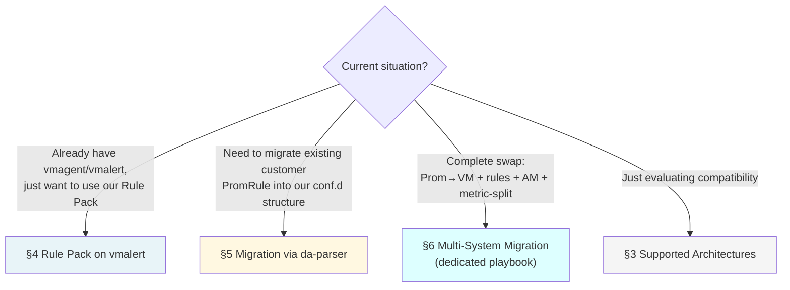

# VictoriaMetrics Integration Guide

> This document is the **centralized entry point** — consolidating VM-related content scattered across [`cli-reference.md`](../cli-reference.en.md), [`byo-prometheus-integration.md`](byo-prometheus-integration.en.md), [`scenarios/multi-system-migration-playbook.md`](../scenarios/multi-system-migration-playbook.md) (**ZH only — [#409](https://github.com/vencil/Dynamic-Alerting-Integrations/issues/409)**), and [`design/roadmap-future.md`](../design/roadmap-future.md) into a single clear path. **Does not duplicate existing doc content**; provides navigation + VM-specific gotchas + alignment with the anti-vendor-lock-in commitment.

---

## 1. Which type of VM customer are you? (Decision Tree)



**Most common paths**: B (rule migration) and C (multi-system). A is "I already have a VM stack, just want your Rule Pack" — relatively rare but simple.

---

## 2. Why this document exists

VictoriaMetrics is a real customer-timeline requirement (landing in v2.8.0). But VM integration information has historically been scattered across 6+ files, forcing customers to stitch things together during onboarding. This document is the **index** — it doesn't duplicate content; every section links back to its source-of-truth doc.

---

## 3. Supported Architectures

Our official support boundaries for the VM ecosystem:

| Component | Our mapping | Support level | Detail |
|---|---|---|---|
| **vmagent** | Scrape source; customer-managed | ✅ Full | Same as vanilla Prom — the threshold-exporter `/metrics` endpoint can be read by any scraper |
| **vmsingle / vmcluster (vmstorage + vmselect + vminsert)** | Metric storage backend; threshold-exporter `remote_write` target | ✅ Full | This platform **does not replace** your VM; non-invasive integration (the design principle in [`byo-prometheus-integration.md`](byo-prometheus-integration.en.md) §1 applies equally to VM) |
| **vmalert** | Rule evaluator; can load our Rule Pack | ✅ Full | This platform's Rule Pack is pure standard PromQL; vmalert evaluates it directly (see [`byo-prometheus-integration.md`](byo-prometheus-integration.en.md)). **⚠️ Range-function cold-start semantics diverge from Prometheus — see §3.1 below.** |
| **vmauth** | Auth proxy; multi-tenant isolation front line | ⚠️ Documentation thin | The tenant-federation ADR ([issue #380](https://github.com/vencil/Dynamic-Alerting-Integrations/issues/380)) will use vmauth for forced label injection; current federation scope is primarily platform-internal |
| **MetricsQL extensions** | Non-portable function detection | ✅ Full | `da-parser` `vm_only_functions.yaml` allowlist + freshness CI gate (details in [`cli-reference.md`](../cli-reference.en.md) §MetricsQL-as-Superset PromRule parser) |

### 3.1 MetricsQL known limitation: range-fn cold-start

"vmalert evaluates it directly" holds at **steady state**. But MetricsQL **intentionally does not extrapolate** range functions (`rate` / `increase` / `changes` / `delta` …) at a series' **cold-start** — when the evaluation window still extends *before* the series' first sample — using the actual data span instead, so it diverges from Prometheus. Triggers = the first window after a **new series / exporter or kube-state-metrics restart / counter reset / a scrape gap longer than the window**; at steady state (warm series) both engines agree.

- **Bidirectional**: an alert gated on `rate(X) > threshold` **over-fires** at cold-start (VM's rate reads high and crosses the threshold first); an alert gated on `changes(X[w]) == 0` **fires late / misses** (VM counts the series birth as one change).
- **Worked example**: `TenantHAReplicasDegraded` (rule-pack-kubernetes) fires **~10 minutes late** after a new series is born (steady-state is fine).
- **Soak reconciliation expectation (cross-engine migration packs)**: for `rate() > threshold`-shaped alerts (e.g. `OracleHighWaitTime`, `DB2HighDeadlockRate`) the **first fire on VM leads Prometheus** at cold-start — magnitude ≈ window × (threshold ÷ steady rate), bounded by one window length (5m for these two); a traffic spike on a **warm series shows no such difference** (both engines read the same fully-covered window). Seeing VM fire first with Prometheus following one-to-a-few minutes later during dual-run soak is an **expected engine-math difference, not a false positive** — cite this section in reconciliation. The firing fixtures (`rule-pack-oracle_test.yaml` / `rule-pack-db2_test.yaml`) deliberately assert at a fully-covered window (9m) to verify steady-state parity — this does **not** mask the first-fire gap; it is explained here and governed by the deviation catalog.
- **Governance (codified)**: every accepted divergence is catalogued in [`vm_deviation_catalog.yaml`](https://github.com/vencil/Dynamic-Alerting-Integrations/blob/main/tests/rulepacks/vm_deviation_catalog.yaml) and enforced by [`test_vm_alert_parity.py`](https://github.com/vencil/Dynamic-Alerting-Integrations/blob/main/tests/rulepacks/test_vm_alert_parity.py) (runs every rule-pack fixture through the `vmalert-tool` MetricsQL engine) — **an uncatalogued new divergence fails CI**.
- VM's official stance: MetricsQL is a PromQL superset but **deliberately does not target 100% compatibility**; this is a design difference, not a bug.

### 3.2 Storage-layer staleness / scrape-gap timing (characterized via `vmalert -replay`)

§3.1 is the rule **evaluator** (engine-math) layer; a separate **storage-layer** divergence is *when a series is considered "gone" after a real gap* — MetricsQL derives it **dynamically from the sample interval** (~1–2 scrape intervals, so it is **coupled to the sampling frequency**), Prometheus uses a fixed 5m lookback. This axis governs (a) when a firing value-alert **resolves** after a gap and (b) when an `absent()`-style sentinel **fires** after a gap; neither `vmalert-tool unittest` (§3.1's gate A) nor the dense-fixture anchor can model it (both use dense fixed series, deliberately avoiding this axis).

- **TC2 Staleness (value-alert resolve + `absent()` fire)**: a metric stops reporting. VM resolves the value-alert and fires `absent()` **~1–2 scrape intervals** after the last sample; Prometheus holds ~5m. → `absent()`-based sentinels (e.g. the [ADR-025](../adr/025-alerting-plane-self-liveness.en.md) watchdog) fire earlier on VM than on Prometheus, so a soak dual-run looks "noisier".
  - ⚠️ **The lead is coupled to the scrape interval, not a fixed value**: measured VM `absent()` first-fire (after a last sample at +300s) is **15s→+330, 30s→+345, 60s→+375** — the denser the sampling, the earlier VM fires vs Prometheus. The Prometheus side (3.x, left-open lookback window) flips exactly 5m after the last sample (measured ~+600s); it is **~240–270s earlier at a 30s interval**, but a customer's actual lead **varies dynamically** with their sampling frequency — do **not** state a fixed "4 minutes earlier" to customers.
  - ✅ **Mitigation (for customers who find it noisy)**: to **exactly replicate Prometheus's 5m cross-gap tolerance** on VM, rewrite `absent(X)` as **`absent_over_time(X[5m])`** — measured to fire at ~+600s on VM (= the Prometheus timing); only the **alert syntax** changes, no engine change and no need to tolerate the noise. This is VM's recommended idiom; the bench pins the behavior with a control assertion (`ProbeAbsentOT`).
- **TC1 Threshold+Gap (`for:`-gated value alert across a missed scrape)**: a value stays above threshold but a few scrapes are missed. VM's series goes stale → the `for:` timer **resets** → late fire (measured ~+480s); Prometheus carries the last value 5m across the gap → `for:` keeps accumulating → fires ~+180s. → **VM ~300s later (under-fires)**: a `for:`-gated alert across a gap triggers later on VM.
- **Not a parity problem**: the two engines' staleness across a gap **differs by design**; forcing alignment is the wrong bar. This characterization exists to be the **machine-readable explanation for soak dual-run reconciliation** — during a dual-run VM will fire/resolve staleness-driven alerts minutes off from Prometheus, and this measures by how much and in which direction.
- **Governance (codified)**: [`test_vm_replay_staleness.py`](https://github.com/vencil/Dynamic-Alerting-Integrations/blob/main/tests/rulepacks/test_vm_replay_staleness.py) uses materialization parity (one logical history → vmsingle import + promtool fixture generated together) to **pin** the VM timing above and diff it against promtool (the Prometheus 5m reference); it is **on-demand** (skip-if-no-VM, `VM_REPLAY_REQUIRE=1` to force), not per-PR. A drift in VM's staleness timing (e.g. an engine version bump) fails it. Infrastructure and how to run: [`backend-compat-baseline.md`](../internal/backend-compat-baseline.md).
- **Scope boundary**: `rate()` / `increase()` cold-start is **engine-math** (§3.1) and is **identical** on `vmalert-tool` and real vmsingle (measured 3.333 vs Prometheus 1.667, storage-path invariant), already covered by gate A — the replay bench does not duplicate it.

---

## 4. Rule Pack on vmalert (simple scenario)

If the customer just wants to use our Rule Pack without replacing their existing VM stack:

```bash
# vmalert configuration example
vmalert \
  -datasource.url=http://vmstorage:8481/select/0/prometheus \
  -notifier.url=http://alertmanager:9093 \
  -remoteWrite.url=http://vminsert:8480/insert/0/prometheus \
  -rule=https://raw.githubusercontent.com/vencil/Dynamic-Alerting-Integrations/main/rule-packs/...
```

Key points:
- Our Rule Pack is pure standard PromQL → vmalert needs no compatibility layer
- The threshold metric `user_threshold{...}` is emitted by our threshold-exporter → vmagent scrapes it into VM
- **`-remoteWrite.url` is mandatory**: omit it and vmalert will still fire alerts to AM, but the `ALERTS{}` / `ALERTS_FOR_STATE{}` time-series data **will not be written back to VM Storage**. Consequences: (1) Grafana cannot render alert-state panels; (2) the future `multi-system-migration-playbook.md` Phase 0 Tier B "run `ALERTS{}` live snapshot against Prom/VM" mechanism will have no data to read and will silently fail.
- **da-parser is not needed** — da-parser is for *inbound* customer rule conversion, not outbound

Details: [`byo-prometheus-integration.md` §Advanced: Integration with Thanos / VictoriaMetrics](byo-prometheus-integration.en.md).

---

## 5. Migration via da-parser (rule migration)

Migrating a customer's **existing PromRule corpus** into our `conf.d/` structure:

### 5.1 Toolchain

```
customer PromRule YAML
    ↓ da-parser import
ParsedRule JSON (with dialect / vm_only / prom_portable annotations)
    ↓ Profile Builder (library)
Cluster + Profile-as-Directory-Default
    ↓ da-batchpr apply
Hierarchy-aware Batch PRs
    ↓ da-guard
Dangling Defaults Guard 4-layer check
    ↓
conf.d/ tree (GitOps merge)
```

### 5.2 MetricsQL handling and anti-vendor-lock-in

- **Dialect detection**: `da-parser import` tags each rule as `prom` / `metricsql` / `ambiguous`
- **`prom_portable: bool` flag**: identifies the subset that "also runs on vanilla Prom"
- **`vm_only_functions.yaml` allowlist**: lists MetricsQL-exclusive functions (e.g., `histogram_quantile_bucket`, `increase_prometheus`), aligned with the [VM `metricsql` package](https://docs.victoriametrics.com/MetricsQL/)
- **CI freshness gate**: `vm_only_functions_freshness_test.go` automatically detects new functions when MetricsQL upgrades, avoiding silent misses

Detailed CLI + JSON ParseResult schema: [`cli-reference.md` §MetricsQL-as-Superset PromRule parser](../cli-reference.en.md) (L2320-2397).

### 5.3 Anti-vendor-lock-in commitment

When `da-parser import --fail-on-non-portable` runs fully green against a corpus → that corpus **also** evaluates on vanilla Prometheus. The customer is not locked into VM by us.

---

## 6. Multi-System Migration (VM + rules + AM swapped together)

If the customer's situation is a "**complete swap**" — replacing storage backend (Prom→VM) **plus** the rule layer **plus** AM routing **plus** enabling `_defaults.yaml` metric-split — this is beyond the scope of this guide:

→ Follow the 5-Phase model in [`scenarios/multi-system-migration-playbook.md`](../scenarios/multi-system-migration-playbook.md) (**ZH only — [#409](https://github.com/vencil/Dynamic-Alerting-Integrations/issues/409)**).

That playbook assumes "mature multi-system ops" and covers Phase 0 three-tier discovery, the Plan A vs Plan B Git layout trade-off, the 5 Gate invariants, and the three-tier rollback reversibility boundary. **The decision tree at the playbook's start re-routes once more** — you'll be directed to the appropriate section.

---

## 7. Known gaps / Future work

| Item | Current state | Roadmap |
|---|---|---|
| **MetricsQL → PromQL auto-conversion tool** | Does not exist | Currently only dialect detection + portability tagging; conversion is manual. Will be evaluated for v2.9 backlog if customers request it |
| **vmauth-based tenant federation** | Design phase | See [issue #380](https://github.com/vencil/Dynamic-Alerting-Integrations/issues/380) (v2.9 epic) — ADR uses vmauth + label-enforced rewriting + 4h TTL token |
| **vmalert-specific shadow monitoring** | The `migration_status: shadow` label mechanism in [`shadow-monitoring-sop.md`](../shadow-monitoring-sop.en.md) is sufficient | vmalert also supports `migration_status` matchers → no VM-specific documentation needed |
| **VM-optimized rule pack variants** | Does not exist | Our Rule Pack is pure PromQL; in theory a new pack could be opened for MetricsQL performance optimization (e.g. `histogram_quantile_bucket`); no customer signal currently |
| **Storage-layer staleness/gap timing parity** | ✅ Characterized (on-demand replay bench) | `vmalert -replay` runs synthetic gap histories against a real vmsingle, pinning VM's staleness timing and diffing against promtool (see §3.2 / [`test_vm_replay_staleness.py`](https://github.com/vencil/Dynamic-Alerting-Integrations/blob/main/tests/rulepacks/test_vm_replay_staleness.py)). Remaining: promote→required pending ≥2 weeks of soak with zero unexplained divergence OR the first VM-backend customer cutover ([#947](https://github.com/vencil/Dynamic-Alerting-Integrations/issues/947)) |

---

## 8. Cross-references

| Topic | Document |
|---|---|
| **Design philosophy**: non-invasive, Rule Pack pure PromQL | [`byo-prometheus-integration.md` §1](byo-prometheus-integration.en.md) |
| **vmalert load Rule Pack**: implementation details | [`byo-prometheus-integration.md` §Advanced](byo-prometheus-integration.en.md) |
| **da-parser MetricsQL handling**: CLI + JSON spec | [`cli-reference.md` §MetricsQL-as-Superset](../cli-reference.en.md) |
| **Multi-system migration** (Prom→VM + rules + AM simultaneously) | [`multi-system-migration-playbook.md`](../scenarios/multi-system-migration-playbook.md) (**ZH only — [#409](https://github.com/vencil/Dynamic-Alerting-Integrations/issues/409)**) |
| **Federation design** (platform-internal multi-cluster) | [`federation-integration.md`](federation-integration.en.md) |
| **Tenant federation** (pulling metrics back to the customer side) | [issue #380](https://github.com/vencil/Dynamic-Alerting-Integrations/issues/380) (v2.9 epic) |
| **MetricsQL spec** | [VictoriaMetrics official documentation](https://docs.victoriametrics.com/MetricsQL/) |

---

## 9. Quick Start checklist

After finding your path via the §1 decision tree:

<details>
<summary>📋 Path A — Rule Pack on existing vmalert (simplest)</summary>

- [ ] Verify that vmalert configuration can load a GitHub raw URL or locally-mounted Rule Pack YAML
- [ ] Deploy threshold-exporter ([helm/threshold-exporter/](https://github.com/vencil/Dynamic-Alerting-Integrations/tree/main/helm/threshold-exporter))
- [ ] Confirm vmagent scrapes the threshold-exporter `/metrics`
- [ ] Observe `user_threshold{...}` metric appearing in VM
- [ ] After vmalert starts, check that alerts trigger

</details>

<details>
<summary>📋 Path B — Migration via da-parser</summary>

- [ ] Run `da-parser import` against the customer PromRule corpus
- [ ] Check dialect distribution + non-portable ratio
- [ ] Extract cluster + Profile-as-Directory-Default via the Profile Builder library (the standalone `da-tools profile build` CLI is not yet shipped — planned)
- [ ] Run `da-batchpr apply` to open Base + tenant chunk PRs
- [ ] Run `da-guard` through the 4-layer schema / routing / cardinality / redundant-override check
- [ ] Details → [Migration Toolkit Installation](../migration-toolkit-installation.en.md)

</details>

<details>
<summary>📋 Path C — Multi-System Migration</summary>

→ Go directly to [`multi-system-migration-playbook.md`](../scenarios/multi-system-migration-playbook.md) (**ZH only — [#409](https://github.com/vencil/Dynamic-Alerting-Integrations/issues/409)**); not duplicated here.

</details>
