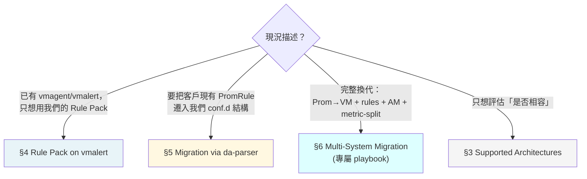

# VictoriaMetrics 整合指南

> 本文件是**集中式入口**——把散落在 [`cli-reference.md`](../cli-reference.md)、[`byo-prometheus-integration.md`](byo-prometheus-integration.md)、[`scenarios/multi-system-migration-playbook.md`](../scenarios/multi-system-migration-playbook.md)、[`design/roadmap-future.md`](../design/roadmap-future.md) 的 VM 相關內容統合成一條清晰路徑。**不重複既有 doc 的內容**；只提供 navigation + VM-specific gotchas + 對齊 anti-vendor-lock-in 承諾。

---

## 1. 你是哪一型 VM 客戶？（Decision Tree）



**最常見路徑**：B（rule migration）和 C（multi-system）。A 是「我已有 VM stack，想用你們的 Rule Pack」相對少見但簡單。

---

## 2. 為什麼這份文件存在

VictoriaMetrics 是真實客戶 timeline 的需求（v2.8.0 落地）。但 VM 整合資訊歷史上散在 6+ 份檔案，客戶 onboarding 時得自己拼湊。本文件是**索引**，不複製內容；每節都連回 source-of-truth doc。

---

## 3. Supported Architectures

我們對 VM 生態的官方支援邊界：

| 元件 | 我們的對應 | 支援度 | 細節 |
|---|---|---|---|
| **vmagent** | scrape source；client 自管 | ✅ 完整 | 跟原生 Prom 一樣，threshold-exporter `/metrics` endpoint 任何 scraper 都能讀 |
| **vmsingle / vmcluster (vmstorage + vmselect + vminsert)** | metric storage backend；threshold-exporter remote_write 對象 | ✅ 完整 | 本平台**不替換**你的 VM；非侵入式整合（[`byo-prometheus-integration.md`](byo-prometheus-integration.md) §1 設計原則對 VM 同樣適用）|
| **vmalert** | rule evaluator；可 load 我們的 Rule Pack | ✅ 完整 | 本平台 Rule Pack 純標準 PromQL，vmalert 直接 evaluate（[`byo-prometheus-integration.md` L358](byo-prometheus-integration.md)）。**⚠️ range 函數 cold-start 語義與 Prom 有偏差，見下方 §3.1。** |
| **vmauth** | auth proxy；多 tenant 隔離前線 | ⚠️ 文件薄 | tenant-federation ADR（[issue #380](https://github.com/vencil/Dynamic-Alerting-Integrations/issues/380)）會用到 vmauth 做 forced label injection；目前 federation 範圍以 platform-internal 為主 |
| **MetricsQL extensions** | non-portable function 偵測 | ✅ 完整 | `da-parser` `vm_only_functions.yaml` allowlist + freshness CI gate（細節見 [`cli-reference.md`](../cli-reference.md) §MetricsQL-as-Superset PromRule parser） |

### 3.1 MetricsQL 已知限制：range-fn cold-start

「vmalert 直接 evaluate」對**穩態**成立。但 MetricsQL 在 **range 函數（`rate` / `increase` / `changes` / `delta` …）的 series cold-start**——評估窗仍延伸到該 series 第一個樣本「之前」時——刻意不外推、改用實際資料跨度，故與 Prometheus 分歧。觸發時機 = **新 series / exporter 或 kube-state-metrics 重啟 / counter reset / 大於窗長的 scrape gap** 之後的首個窗內；穩態（warm series）兩引擎一致。

- **雙向**：以 `rate(X) > 閾值` 為條件的告警在 cold-start 會**過度 fire**（VM 的 rate 偏高、先越閾值）；以 `changes(X[w]) == 0` 為 gate 的告警會**晚 fire／漏 fire**（VM 把 series 出生算成一次 change）。
- **已實證例**：`TenantHAReplicasDegraded`（rule-pack-kubernetes）在新 series 後**約晚 10 分鐘**才發（穩態正常）。
- **Soak 對帳期望值（Splunk→VM 遷移 pack）**：`rate() > 閾值`型告警（如 `OracleHighWaitTime`、`DB2HighDeadlockRate`）在 cold-start 情境的**首發時間 VM 早於 Prometheus**——幅度 ≈ 窗長 ×（閾值 ÷ 穩態 rate）、上限一個窗長（這兩條為 5m 窗）；**warm series 的流量尖峰無此差**（兩引擎讀同一個全滿窗）。雙活 soak 看到 VM 先發、Prom 晚一到數分鐘跟上＝**預期引擎數學差、非 false positive**，對帳時引用本節解釋。firing fixture（`rule-pack-oracle_test.yaml` / `rule-pack-db2_test.yaml`）的斷言刻意放在全滿窗（9m）驗穩態 parity——**非掩蓋**此首發差；該差由本節 + deviation catalog 負責解釋。
- **治理（codified）**：每個已接受的偏差登記於 [`vm_deviation_catalog.yaml`](https://github.com/vencil/Dynamic-Alerting-Integrations/blob/main/tests/rulepacks/vm_deviation_catalog.yaml)，由 [`test_vm_alert_parity.py`](https://github.com/vencil/Dynamic-Alerting-Integrations/blob/main/tests/rulepacks/test_vm_alert_parity.py)（用 `vmalert-tool` MetricsQL 引擎跑全部 rule-pack fixture）enforce——**未登記的新偏差會讓 CI fail**。
- VM 官方立場：MetricsQL 為 PromQL superset，但**刻意不追求 100% 相容**；此為設計差異，非 bug。

### 3.2 儲存層 staleness / scrape-gap 時序（`vmalert -replay` 刻畫）

§3.1 是 rule **evaluator**（引擎數學）層；另有一條**儲存層**偏差：series 在**真實 gap 後何時被視為「消失」**——MetricsQL **由樣本間隔動態推導**（≈1–2 個 scrape interval，故**耦合於採樣頻率**），Prometheus 用固定 5m lookback。這條軸決定 (a) firing 值告警在 gap 後**何時 resolve**、(b) `absent()` 類 sentinel 在 gap 後**何時 fire**；`vmalert-tool unittest`（§3.1 的 gate A）與 dense-fixture anchor **都模型不出**（皆用密集固定序列，刻意避開此軸）。

- **TC2 Staleness（值告警 resolve + `absent()` fire）**：某 metric 報完即停。VM 在最後樣本後**約 1–2 個 scrape interval**就 resolve 值告警並 fire `absent()`；Prometheus 撐約 5m。→ `absent()`-based sentinel（如 [ADR-025](../adr/025-alerting-plane-self-liveness.md) watchdog）在 VM 上比 Prom **早發**，soak 雙活會顯得「較吵」。
  - ⚠️ **提早量耦合於 scrape interval、非固定值**：實測 VM `absent()` 首次觸發（最後樣本 +300s 後）**15s→+330、30s→+345、60s→+375**——採樣越密、比 Prom 早越多。以 **30s 為基準約早 240–300s**，但客戶實際提早量隨其採樣頻率**動態變化**，**別當成固定「早 4–5 分鐘」對客戶宣稱**。
  - ✅ **Mitigation（給嫌吵的客戶）**：要在 VM 上**完美複製 Prometheus 的 5m 跨-gap 容忍**，把 `absent(X)` 改寫為 **`absent_over_time(X[5m])`**——實測在 VM 上 ~+600s 才觸發（＝Prom 時序）；只需改**告警語法**、不必改引擎或忍受噪音。這是 VM 官方建議 idiom；bench 有對照 assertion（`ProbeAbsentOT`）釘住此行為。
- **TC1 Threshold+Gap（`for:`-gated 值告警跨漏 scrape）**：值持續超標但中間漏了幾次 scrape。VM 序列 stale → `for:` 計時器 **reset** → 晚 fire（實測 ~+480s）；Prometheus 把最後值沿用 5m 跨過 gap → `for:` 持續累積 → ~+180s fire。→ **VM 晚 ~300s（under-fire）**：跨 gap 的 `for:`-gated 告警在 VM 上較晚觸發。
- **不是 parity 問題**：兩引擎跨 gap 的 staleness **設計上就不同**，強求對齊是錯門檻。此刻畫的用途 = **soak 雙活對帳的機器可讀解釋依據**——雙活時 VM 會與 Prom 差幾分鐘 fire/resolve staleness-driven 告警，這裡量出「差多少、哪個方向」。
- **治理（codified）**：[`test_vm_replay_staleness.py`](https://github.com/vencil/Dynamic-Alerting-Integrations/blob/main/tests/rulepacks/test_vm_replay_staleness.py) 用 materialization-parity（同一邏輯歷史 → vmsingle import + promtool fixture 同步生成）把上述 VM 時序 **pin 住**、對 promtool（Prometheus 5m 參考）比對；**on-demand**（skip-if-no-VM、`VM_REPLAY_REQUIRE=1` 強制），非 per-PR。VM staleness 時序漂移（如引擎升版）即 fail。基建與跑法見 [`backend-compat-baseline.md`](../internal/backend-compat-baseline.md)。
- **範圍界線**：`rate()` / `increase()` cold-start 是**引擎數學**（§3.1），在 `vmalert-tool` 與真 vmsingle 上**一致**（實測都 3.333 vs Prom 1.667、storage-path 不變），已由 gate A 涵蓋，replay bench 不重複覆蓋。

---

## 4. Rule Pack on vmalert（簡單情境）

如果客戶只是想用我們的 Rule Pack，不換現有 VM stack：

```bash
# vmalert 配置範例
vmalert \
  -datasource.url=http://vmstorage:8481/select/0/prometheus \
  -notifier.url=http://alertmanager:9093 \
  -remoteWrite.url=http://vminsert:8480/insert/0/prometheus \
  -rule=https://raw.githubusercontent.com/vencil/Dynamic-Alerting-Integrations/main/rule-packs/...
```

關鍵點：
- 我們 Rule Pack 純標準 PromQL → vmalert 不需任何相容層
- 閾值 metric `user_threshold{...}` 由我們 threshold-exporter 發出 → vmagent scrape 進 VM 即可
- **`-remoteWrite.url` 必填**：缺它 vmalert 仍會 fire alert 到 AM，但 `ALERTS{}` / `ALERTS_FOR_STATE{}` 時序資料**不會寫回 VM Storage**。後果：(1) Grafana 畫不出告警狀態 panel；(2) 未來 `multi-system-migration-playbook.md` Phase 0 Tier B「對 Prom/VM 跑 ALERTS{} live snapshot」會抓不到資料、機制失效。
- **不需要 da-parser**——da-parser 是 customer rule **入站**轉換，不是 outbound

詳情：[`byo-prometheus-integration.md` §進階：與 Thanos / VictoriaMetrics 整合](byo-prometheus-integration.md)。

---

## 5. Migration via da-parser（規則遷移）

把客戶**既有的 PromRule corpus** 遷入我們 `conf.d/` 結構：

### 5.1 工具鏈

```
customer PromRule YAML
    ↓ da-parser import
ParsedRule JSON（含 dialect / vm_only / prom_portable 標註）
    ↓ da-tools profile build  
Cluster + Profile-as-Directory-Default
    ↓ da-batchpr apply
Hierarchy-aware Batch PRs
    ↓ da-guard
Dangling Defaults Guard 4 層檢查
    ↓
conf.d/ 樹（GitOps merge）
```

### 5.2 MetricsQL handling 與 anti-vendor-lock-in

- **dialect detection**：`da-parser import` per rule 標 `prom` / `metricsql` / `ambiguous`
- **`prom_portable: bool` 旗標**：標識「也能在 vanilla Prom 跑」的子集
- **`vm_only_functions.yaml` allowlist**：列出 metricsql 獨有函數（如 `histogram_quantile_bucket`、`increase_prometheus`），與 [VM `metricsql` package](https://docs.victoriametrics.com/MetricsQL/) 對齊
- **CI freshness gate**：`vm_only_functions_freshness_test.go` 在 metricsql 升版時自動偵測新函數，避免 silent miss

詳細 CLI + JSON ParseResult schema：[`cli-reference.md` §MetricsQL-as-Superset PromRule parser](../cli-reference.md)（L2320-2397）。

### 5.3 Anti-vendor-lock-in 承諾

當 `da-parser import --fail-on-non-portable` 對某個 corpus 跑完全綠 → 該 corpus 在 vanilla Prometheus **也**能 evaluate。客戶不會被我們 lock 在 VM 上。

---

## 6. Multi-System Migration（VM + rules + AM 同時換）

如果客戶情境是「**完整換代**」——換 storage backend (Prom→VM) **加上**換規則層 **加上**換 AM routing **加上**啟用 `_defaults.yaml` metric-split——這超出本指南範圍：

→ 走 [`scenarios/multi-system-migration-playbook.md`](../scenarios/multi-system-migration-playbook.md) 的 5-Phase 模型。

該 playbook 假設「mature multi-system ops」，含 Phase 0 三層 tier discovery、Plan A/B Git layout 取捨、5 Gate invariants、Rollback 三層可逆界線。**Decision tree 在 playbook 開頭再分流一次**——你會被 routing 到適當段落。

---

## 7. 已知 gap / Future Work

| 項目 | 現況 | 路線圖 |
|---|---|---|
| **MetricsQL → PromQL 自動轉換工具** | 不存在 | 目前只做 dialect detection + portability 標識；轉換需手動。若客戶要求 v2.9 backlog 評估 |
| **Tenant federation（拉自己的 metrics 回租戶側）** | ✅ 已交付（v2.9.0）| 見 [`tenant-federation.md`](tenant-federation.md) / [ADR-020](../adr/020-tenant-federation.md)。採 **prom-label-proxy** label-injection + 4h TTL RS256 token（非 vmauth —— vmauth 是 auth router、不注入 label，理由見 ADR §為什麼不用其他方案）；VM 單機走 prom-label-proxy，VM cluster 由 gateway URL-rewrite 到 `/select/<accountID>/` 路徑 |
| **vmalert-specific shadow monitoring** | 用 [`shadow-monitoring-sop.md`](../shadow-monitoring-sop.md) 的 `migration_status: shadow` label 機制即可 | vmalert 對 `migration_status` matcher 同樣支援 → 無 vm-specific 文件需求 |
| **VM-optimized rule pack variants** | 不存在 | 我們 Rule Pack 純 PromQL；理論上若需 metricsql performance optimization（如 `histogram_quantile_bucket`）可開新 pack；目前無此 customer signal |
| **儲存層 staleness/gap 時序 parity** | ✅ 已刻畫（on-demand replay bench）| `vmalert -replay` 對真 vmsingle 跑 synthetic gap 歷史、pin VM staleness 時序並對 promtool 比對（見 §3.2 / [`test_vm_replay_staleness.py`](https://github.com/vencil/Dynamic-Alerting-Integrations/blob/main/tests/rulepacks/test_vm_replay_staleness.py)）。剩餘：promote→required 待 ≥2 週 soak 零未解釋分歧 OR 首 VM 客戶切換（[#947](https://github.com/vencil/Dynamic-Alerting-Integrations/issues/947)）|

---

## 8. Cross-references

| 主題 | 文件 |
|---|---|
| **設計理念**：non-invasive、Rule Pack 純 PromQL | [`byo-prometheus-integration.md` §1](byo-prometheus-integration.md) |
| **vmalert load Rule Pack**：實作細節 | [`byo-prometheus-integration.md` §進階](byo-prometheus-integration.md) |
| **da-parser MetricsQL handling**：CLI + JSON spec | [`cli-reference.md` §MetricsQL-as-Superset](../cli-reference.md) |
| **多系統遷移**（Prom→VM + rules + AM 同時）| [`multi-system-migration-playbook.md`](../scenarios/multi-system-migration-playbook.md) |
| **Federation 設計**（platform-internal 多 cluster）| [`federation-integration.md`](federation-integration.md) |
| **Tenant federation**（拉 metric 回客戶側） | [issue #380](https://github.com/vencil/Dynamic-Alerting-Integrations/issues/380)（v2.9 epic） |
| **MetricsQL spec** | [VictoriaMetrics 官方文件](https://docs.victoriametrics.com/MetricsQL/) |

---

## 9. Quick Start checklist

依 §1 decision tree 找到你的路徑後：

<details>
<summary>📋 Path A — Rule Pack on existing vmalert（最簡）</summary>

- [ ] 確認 vmalert 配置可載入 GitHub raw URL 或本地 mount Rule Pack YAML
- [ ] 部署 threshold-exporter（[helm/threshold-exporter/](https://github.com/vencil/Dynamic-Alerting-Integrations/tree/main/helm/threshold-exporter)）
- [ ] 確認 vmagent scrape threshold-exporter `/metrics`
- [ ] 觀察 `user_threshold{...}` metric 出現在 VM
- [ ] vmalert 啟動後檢查 alert 觸發

</details>

<details>
<summary>📋 Path B — Migration via da-parser</summary>

- [ ] 跑 `da-parser import` 對 customer PromRule corpus
- [ ] 檢查 dialect 分布 + non-portable 比例
- [ ] 跑 `da-tools profile build` 萃取 cluster + Profile-as-Directory-Default
- [ ] 跑 `da-batchpr apply` 開出 Base + tenant chunk PRs
- [ ] 跑 `da-guard` 過 4-layer schema/routing/cardinality/redundant-override 檢查
- [ ] 詳情 → [Migration Toolkit Installation](../migration-toolkit-installation.md)

</details>

<details>
<summary>📋 Path C — Multi-System Migration</summary>

→ 直接走 [`multi-system-migration-playbook.md`](../scenarios/multi-system-migration-playbook.md)，不在本指南重複。

</details>
