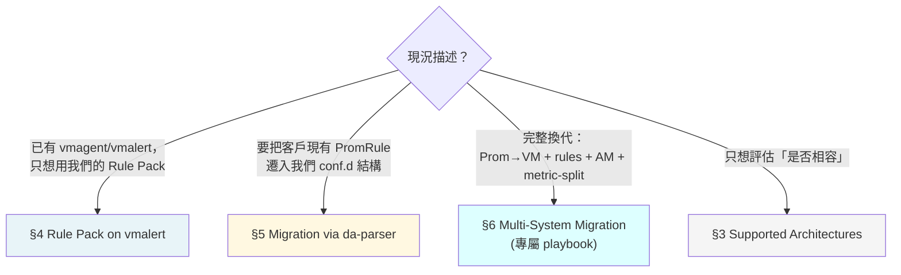

# VictoriaMetrics 整合指南

> 本文件是**集中式入口**——把散落在 [`cli-reference.md`](../cli-reference.md)、[`byo-prometheus-integration.md`](byo-prometheus-integration.md)、[`scenarios/multi-system-migration-playbook.md`](../scenarios/multi-system-migration-playbook.md)、[`design/roadmap-future.md`](../design/roadmap-future.md) 的 VM 相關內容統合成一條清晰路徑。**不重複既有 doc 的內容**；只提供 navigation + VM-specific gotchas + 對齊 anti-vendor-lock-in 承諾。

---

## 1. 你是哪一型 VM 客戶？（Decision Tree）



**最常見路徑**：B（rule migration）和 C（multi-system）。A 是「我已有 VM stack，想用你們的 Rule Pack」相對少見但簡單。

---

## 2. 為什麼這份文件存在

VictoriaMetrics 是真實客戶 timeline 的需求（v2.8.0 落地）。但 VM 整合資訊歷史上散在 6+ 份檔案，客戶 onboarding 時得自己拼湊。本文件是**索引**，不複製內容；每節都連回 source-of-truth doc。

---

## 3. Supported Architectures

我們對 VM 生態的官方支援邊界：

| 元件 | 我們的對應 | 支援度 | 細節 |
|---|---|---|---|
| **vmagent** | scrape source；client 自管 | ✅ 完整 | 跟原生 Prom 一樣，threshold-exporter `/metrics` endpoint 任何 scraper 都能讀 |
| **vmsingle / vmcluster (vmstorage + vmselect + vminsert)** | metric storage backend；threshold-exporter remote_write 對象 | ✅ 完整 | 本平台**不替換**你的 VM；非侵入式整合（[`byo-prometheus-integration.md`](byo-prometheus-integration.md) §1 設計原則對 VM 同樣適用）|
| **vmalert** | rule evaluator；可 load 我們的 Rule Pack | ✅ 完整 | 本平台 Rule Pack 純標準 PromQL，vmalert 直接 evaluate（[`byo-prometheus-integration.md` L358](byo-prometheus-integration.md)）|
| **vmauth** | auth proxy；多 tenant 隔離前線 | ⚠️ 文件薄 | tenant-federation ADR（[issue #380](https://github.com/vencil/Dynamic-Alerting-Integrations/issues/380)）會用到 vmauth 做 forced label injection；目前 federation 範圍以 platform-internal 為主 |
| **MetricsQL extensions** | non-portable function 偵測 | ✅ 完整 | `da-parser` `vm_only_functions.yaml` allowlist + freshness CI gate（細節見 [`cli-reference.md`](../cli-reference.md) §MetricsQL-as-Superset PromRule parser） |

---

## 4. Rule Pack on vmalert（簡單情境）

如果客戶只是想用我們的 Rule Pack，不換現有 VM stack：

```bash
# vmalert 配置範例
vmalert \
  -datasource.url=http://vmstorage:8481/select/0/prometheus \
  -notifier.url=http://alertmanager:9093 \
  -remoteWrite.url=http://vminsert:8480/insert/0/prometheus \
  -rule=https://raw.githubusercontent.com/vencil/Dynamic-Alerting-Integrations/main/rule-packs/...
```

關鍵點：
- 我們 Rule Pack 純標準 PromQL → vmalert 不需任何相容層
- 閾值 metric `user_threshold{...}` 由我們 threshold-exporter 發出 → vmagent scrape 進 VM 即可
- **`-remoteWrite.url` 必填**：缺它 vmalert 仍會 fire alert 到 AM，但 `ALERTS{}` / `ALERTS_FOR_STATE{}` 時序資料**不會寫回 VM Storage**。後果：(1) Grafana 畫不出告警狀態 panel；(2) 未來 `multi-system-migration-playbook.md` Phase 0 Tier B「對 Prom/VM 跑 ALERTS{} live snapshot」會抓不到資料、機制失效。
- **不需要 da-parser**——da-parser 是 customer rule **入站**轉換，不是 outbound

詳情：[`byo-prometheus-integration.md` §進階：與 Thanos / VictoriaMetrics 整合](byo-prometheus-integration.md)。

---

## 5. Migration via da-parser（規則遷移）

把客戶**既有的 PromRule corpus** 遷入我們 `conf.d/` 結構：

### 5.1 工具鏈

```
customer PromRule YAML
    ↓ da-parser import
ParsedRule JSON（含 dialect / vm_only / prom_portable 標註）
    ↓ da-tools profile build  
Cluster + Profile-as-Directory-Default
    ↓ da-batchpr apply
Hierarchy-aware Batch PRs
    ↓ da-guard
Dangling Defaults Guard 4 層檢查
    ↓
conf.d/ 樹（GitOps merge）
```

### 5.2 MetricsQL handling 與 anti-vendor-lock-in

- **dialect detection**：`da-parser import` per rule 標 `prom` / `metricsql` / `ambiguous`
- **`prom_portable: bool` 旗標**：標識「也能在 vanilla Prom 跑」的子集
- **`vm_only_functions.yaml` allowlist**：列出 metricsql 獨有函數（如 `histogram_quantile_bucket`、`increase_prometheus`），與 [VM `metricsql` package](https://docs.victoriametrics.com/MetricsQL/) 對齊
- **CI freshness gate**：`vm_only_functions_freshness_test.go` 在 metricsql 升版時自動偵測新函數，避免 silent miss

詳細 CLI + JSON ParseResult schema：[`cli-reference.md` §MetricsQL-as-Superset PromRule parser](../cli-reference.md)（L2320-2397）。

### 5.3 Anti-vendor-lock-in 承諾

當 `da-parser import --fail-on-non-portable` 對某個 corpus 跑完全綠 → 該 corpus 在 vanilla Prometheus **也**能 evaluate。客戶不會被我們 lock 在 VM 上。

---

## 6. Multi-System Migration（VM + rules + AM 同時換）

如果客戶情境是「**完整換代**」——換 storage backend (Prom→VM) **加上**換規則層 **加上**換 AM routing **加上**啟用 `_defaults.yaml` metric-split——這超出本指南範圍：

→ 走 [`scenarios/multi-system-migration-playbook.md`](../scenarios/multi-system-migration-playbook.md) 的 5-Phase 模型。

該 playbook 假設「mature multi-system ops」，含 Phase 0 三層 tier discovery、Plan A/B Git layout 取捨、5 Gate invariants、Rollback 三層可逆界線。**Decision tree 在 playbook 開頭再分流一次**——你會被 routing 到適當段落。

---

## 7. 已知 gap / Future Work

| 項目 | 現況 | 路線圖 |
|---|---|---|
| **MetricsQL → PromQL 自動轉換工具** | 不存在 | 目前只做 dialect detection + portability 標識；轉換需手動。若客戶要求 v2.9 backlog 評估 |
| **Tenant federation（拉自己的 metrics 回租戶側）** | ✅ 已交付（v2.9.0）| 見 [`tenant-federation.md`](tenant-federation.md) / [ADR-020](../adr/020-tenant-federation.md)。採 **prom-label-proxy** label-injection + 4h TTL RS256 token（非 vmauth —— vmauth 是 auth router、不注入 label，理由見 ADR §為什麼不用其他方案）；VM 單機走 prom-label-proxy，VM cluster 由 gateway URL-rewrite 到 `/select/<accountID>/` 路徑 |
| **vmalert-specific shadow monitoring** | 用 [`shadow-monitoring-sop.md`](../shadow-monitoring-sop.md) 的 `migration_status: shadow` label 機制即可 | vmalert 對 `migration_status` matcher 同樣支援 → 無 vm-specific 文件需求 |
| **VM-optimized rule pack variants** | 不存在 | 我們 Rule Pack 純 PromQL；理論上若需 metricsql performance optimization（如 `histogram_quantile_bucket`）可開新 pack；目前無此 customer signal |

---

## 8. Cross-references

| 主題 | 文件 |
|---|---|
| **設計理念**：non-invasive、Rule Pack 純 PromQL | [`byo-prometheus-integration.md` §1](byo-prometheus-integration.md) |
| **vmalert load Rule Pack**：實作細節 | [`byo-prometheus-integration.md` §進階](byo-prometheus-integration.md) |
| **da-parser MetricsQL handling**：CLI + JSON spec | [`cli-reference.md` §MetricsQL-as-Superset](../cli-reference.md) |
| **多系統遷移**（Prom→VM + rules + AM 同時）| [`multi-system-migration-playbook.md`](../scenarios/multi-system-migration-playbook.md) |
| **Federation 設計**（platform-internal 多 cluster）| [`federation-integration.md`](federation-integration.md) |
| **Tenant federation**（拉 metric 回客戶側） | [issue #380](https://github.com/vencil/Dynamic-Alerting-Integrations/issues/380)（v2.9 epic） |
| **MetricsQL spec** | [VictoriaMetrics 官方文件](https://docs.victoriametrics.com/MetricsQL/) |

---

## 9. Quick Start checklist

依 §1 decision tree 找到你的路徑後：

<details>
<summary>📋 Path A — Rule Pack on existing vmalert（最簡）</summary>

- [ ] 確認 vmalert 配置可載入 GitHub raw URL 或本地 mount Rule Pack YAML
- [ ] 部署 threshold-exporter（[helm/threshold-exporter/](https://github.com/vencil/Dynamic-Alerting-Integrations/tree/main/helm/threshold-exporter)）
- [ ] 確認 vmagent scrape threshold-exporter `/metrics`
- [ ] 觀察 `user_threshold{...}` metric 出現在 VM
- [ ] vmalert 啟動後檢查 alert 觸發

</details>

<details>
<summary>📋 Path B — Migration via da-parser</summary>

- [ ] 跑 `da-parser import` 對 customer PromRule corpus
- [ ] 檢查 dialect 分布 + non-portable 比例
- [ ] 跑 `da-tools profile build` 萃取 cluster + Profile-as-Directory-Default
- [ ] 跑 `da-batchpr apply` 開出 Base + tenant chunk PRs
- [ ] 跑 `da-guard` 過 4-layer schema/routing/cardinality/redundant-override 檢查
- [ ] 詳情 → [Migration Toolkit Installation](../migration-toolkit-installation.md)

</details>

<details>
<summary>📋 Path C — Multi-System Migration</summary>

→ 直接走 [`multi-system-migration-playbook.md`](../scenarios/multi-system-migration-playbook.md)，不在本指南重複。

</details>
