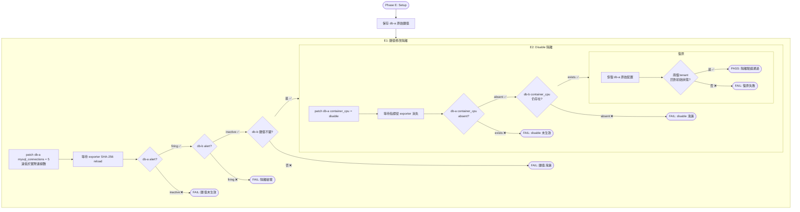
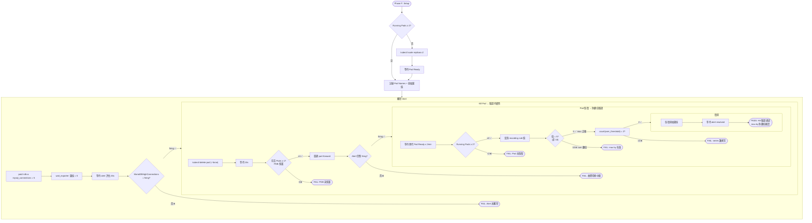

# 測試覆蓋矩陣

> **Language / 語言：** | **中文（當前）**

> **內部 QA 紀錄**：本文件為維護者用的測試清單、數量、CI 指令與 benchmark 對照。**對外的場景行為說明、設計證明與生命週期時序圖見公開 [驗證場景與平台行為](../scenarios/verified-scenarios.md)**。
>
> 相關文件：[Testing Playbook](testing-playbook.md) · [Test Map](test-map.md) · [Benchmark Playbook](benchmark-playbook.md)

---

## 企業級測試覆蓋矩陣 (Enterprise Test Coverage Matrix)

測試體系分為兩層：**E2E Scenario Tests**（K8s 叢集內端到端驗證）和 **Unit/Integration Tests**（pytest + go test，2,002+ 測試案例）。場景 A–F 的對外行為說明見公開 [驗證場景](../scenarios/verified-scenarios.md)；本表為執行用的指令與斷言參考。

### E2E Scenario Tests（`make test-scenario-*`）

| 場景 | 企業防護需求 | 測試方式 | 核心斷言 | 指令 |
|------|-------------|----------|----------|------|
| **A — 動態閾值** | 租戶自訂閾值即時生效，無需重啟 | 修改閾值 → 等待 exporter reload → 驗證 alert 觸發 | `user_threshold` 值更新；alert 狀態變為 firing | `make test-scenario-a` |
| **B — 弱環節偵測** | 多指標中最差的自動觸發告警 | 注入 CPU 壓力 → 驗證 `pod_weakest_cpu_percent` 歸一化 | recording rule 產出正確的最差值；alert 正確觸發 | `make test-scenario-b` |
| **C — 三態比對** | 指標可被 custom / default / disable 三態控制 | 切換三態 → 驗證 exporter 指標存在/消失 | custom: 值=自訂; default: 值=全域預設; disable: 指標消失 | scenario-a 內含 |
| **D — 維護模式** | 計劃性維護期間自動靜音所有告警 | 啟用 `_state_maintenance` → 驗證 alert 被 `unless` 抑制 | 所有 alert 保持 inactive；解除後恢復正常 | scenario-a 內含 |
| **E — 多租戶隔離** | 修改 Tenant A 不影響 Tenant B | 壓低 A 閾值/disable A 指標 → 驗證 B 不變 | A alert fires, B alert inactive; A 指標消失, B 指標存在 | `make test-scenario-e` |
| **F — HA 故障切換** | Pod 被刪除後服務不中斷、閾值不翻倍 | Kill 1 Pod → 驗證 alert 持續 → 新 Pod 啟動 → 驗證 `max by` | 存活 Pod ≥1 (PDB); alert 無中斷; recording rule 值=原值 (非 2×) | `make test-scenario-f` |
| **demo-full** | 端到端展演完整生命週期 | Composite load → alert 觸發 → cleanup → alert 恢復 | 6 步驟全部成功; alert firing → inactive 完整週期 | `make demo-full` |

### Unit/Integration Tests（`make test` / `pytest`）

v1.7.0–v2.0.0 新增大量企業功能，其測試覆蓋集中在 unit/integration 層：

| 功能域 | 企業防護需求 | 覆蓋範圍 | 測試數 |
|--------|-------------|----------|--------|
| **Silent Mode** | 靜音通知但保留 TSDB 紀錄 | sentinel metric emit、inhibit rule 產出、三態交互 | ~20 |
| **Severity Dedup** | warning/critical 去重 | per-tenant inhibit rules、metric_group 配對、sentinel metric | ~15 |
| **Config-driven Routing** | 6 種 receiver + guardrails | receiver 結構驗證、timing clamp、domain allowlist | ~40 |
| **Per-rule Overrides** | 特定 alert 走不同 receiver | expand_routing_overrides、子路由產出、驗證互斥 | ~15 |
| **Platform Enforced Routing** | NOC 必收 + tenant 也收 | `_routing_enforced` 合併、`continue: true` 插入 | ~10 |
| **Expires Auto-expiry** | 防止 silent/maintenance 忘記關 | `time.Now().After(expires)` 邏輯、`da_config_event` emit | ~15 |
| **Cardinality Guard** | 防止 tenant 配置爆炸 | `max_metrics_per_tenant` truncate、ERROR log | ~10 |
| **Schema Validation** | 偵測 typo/unknown key | Go + Python 雙端一致、warning 回報 | ~20 |
| **Onboard/Migration** | 企業無縫遷移 | AST engine、triage CSV、shadow mapping、prefix injection | ~50 |
| **N:1 Namespace Mapping** | 多 NS → 單 tenant | relabel snippet 產出、`_namespaces` 元資料 | ~10 |
| **Shadow Monitoring Cutover** | 一鍵自動化切換 | readiness 消費、5 步驟執行、dry-run、timeout 處理 | ~25 |
| **Blind Spot Discovery** | 叢集盲區偵測 | targets 解析、segment 匹配、wrapped YAML 格式 | ~25 |
| **Config Diff** | 配置差異 blast radius | wrapped/flat 格式載入、變更分類、Markdown 產出 | ~20 |
| **AM GitOps ConfigMap** | 完整 ConfigMap 產出 | base-config 載入、互斥驗證、YAML 結構 | ~30 |
| **Recurring Maintenance** | 排程式維護窗口自動化 | parse_duration（含 `d`）、is_in_window cron 判定、silence CRUD + extend、Pushgateway 指標推送 | ~55 |
| **Alert Quality Scoring** | 告警品質四維評估 | noise/stale/latency/suppression 四指標計算、三級評分、tenant 報告、Markdown 產出 | 57 |
| **Policy-as-Code** | 配置策略引擎 | 10 運算子驗證、when 條件篩選、tenant 排除、severity 分級、違規報告 | 106 |
| **Cardinality Forecasting** | 基數趨勢預測 | 線性回歸、風險分級、觸頂天數計算、Markdown/JSON 報告 | 61 |
| **SAST Compliance** | 靜態安全分析合規 | Go G112、Python CWE-276、B602、encoding 規範、全倉庫掃描 | 189 |
| **Migration Engine v3** | AST 遷移引擎 | PromQL 解析、prefix injection、triage 分類、shadow mapping | 67 |
| **Offboard & Deprecate** | 租戶下架與規則下架 | 清理流程、審計日誌、deprecation 標記 | 34 |

> 完整測試套件：`make test`（Go）+ `pytest tests/`（Python, 2,002+ passed）。CI pipeline `.github/workflows/validate.yaml` 在每次 PR 自動執行。完整測試架構導覽見 [Test Map](test-map.md)。

### Tier 2 — Performance Benchmarks（`go test -bench`）

Performance benchmarks 與 unit tests 分離記錄。Tier 2 量測 production hot-path 在不同 tenant 規模下的延遲、記憶體與 goroutine 行為，為 SLO 與 sharding 決策提供 empirical 依據（**非 unit-level 正確性驗證**）。完整方法論與基線數據見 [Benchmark Playbook](benchmark-playbook.md)。

#### Phase .b 1000+ tenant hierarchical baseline (B-1 Phase 1 + B-8, v2.8.0)

新增於 PR #59，檔案 `components/threshold-exporter/app/config_hierarchy_bench_test.go`。覆蓋 post-A-10 production hot path：`WatchLoop → scanDirHierarchical → diffAndReload`。

| Benchmark | Tier | 量測對象（Coverage Target） | Last Verified |
|-----------|------|---------------------------|---------------|
| `BenchmarkScanDirHierarchical_1000` | 2 | `scanDirHierarchical`：directory walk + per-file SHA-256 hash + parent graph build (1000 tenants) | v2.8.0 |
| `BenchmarkScanDirHierarchical_2000` | 2 | 同上，2000 tenants（scaling characterization） | v2.8.0 |
| `BenchmarkScanDirHierarchical_5000` | 2 | 同上，5000 tenants（scaling characterization） | v2.8.0 |
| `BenchmarkFullDirLoad_Hierarchical_1000` | 2 | `fullDirLoad`：cold-load YAML parse + L0/L1/L2/L3 hierarchical merge (1000 tenants) | v2.8.0 |
| `BenchmarkFullDirLoad_Hierarchical_2000` | 2 | 同上，2000 tenants | v2.8.0 |
| `BenchmarkFullDirLoad_Hierarchical_5000` | 2 | 同上，5000 tenants | v2.8.0 |
| `BenchmarkDiffAndReload_Hierarchical_1000_NoChange` | 2 | `diffAndReload` steady-state WatchLoop tick：hash diff → no-op fast path (1000 tenants) | v2.8.0 |
| `BenchmarkDiffAndReload_Hierarchical_2000_NoChange` | 2 | 同上，2000 tenants | v2.8.0 |
| `BenchmarkDiffAndReload_Hierarchical_5000_NoChange` | 2 | 同上，5000 tenants | v2.8.0 |
| `BenchmarkDiffAndReload_Hierarchical_1000_OneTenantChanged` | 2 | `diffAndReload` 單一 tenant YAML 變更 → diff + targeted reload tail（fresh-dir variant） | v2.8.0 |
| `BenchmarkBlastRadius_DefaultsChange_Hierarchical_1000` | 2 | B-8：region-level `_defaults.yaml` 變更 → affected-tenants count via `b.ReportMetric` (1000 tenants) | v2.8.0 |
| `BenchmarkBlastRadius_DefaultsChange_Hierarchical_2000` | 2 | 同上，2000 tenants | v2.8.0 |
| `BenchmarkBlastRadius_DefaultsChange_Hierarchical_5000` | 2 | 同上，5000 tenants | v2.8.0 |

**共用 helpers**（同檔案，非獨立 benchmark）：

- `buildDirConfigHierarchical(b, N)` — Pure Go fixture writer，鏡射 `generate_tenant_fixture.py` 結構（8 domains × 6 regions × 3 envs + L0/L1/L2/L3 `_defaults.yaml`）；`sync.Once` cached for read-only benchmarks，fresh-dir variant for mutating benchmarks
- `reportResourceMetrics(b)` — `runtime.GC()` ×2 reap finalizers 後 emit `MB-heap-after-gc` / `MB-sys` / `goroutines` via `b.ReportMetric`
- 共享驅動函式 `benchScanDirHierarchicalAtSize` / `benchFullDirLoadAtSize` / `benchDiffAndReloadHierarchicalAtSizeNoChange` / `benchBlastRadiusDefaultsChangeAtSize` — 由各 size variant 呼叫，DRY 化 1000/2000/5000 三組量測

**執行方式**：完整 `bench_wrapper.sh` 重跑指令見 [Benchmark Playbook §重跑本 baseline 指令](benchmark-playbook.md#重跑本-baseline-指令)；快速跑全 Go bench 用 `make go-bench` 或 `make go-bench-clean`（後者經 `bench_wrapper.sh` 過濾 stdout）。

> **Phase 1 baseline disclaimer**：以上 benchmarks 量測 synthetic fixture，**非 definitive SLO 承諾**。Customer anonymized sample 校準排定於 Phase 2（B-2，blocked on customer data per planning §11.1）。下游文件引用須附「Phase 1 synthetic baseline」前綴。

### 斷言細節補充

**Scenario E 的兩個隔離維度：**

- **E1 — 閾值修改隔離**：將 db-a 的 `mysql_connections` 壓低至 5 → db-a 觸發 `MariaDBHighConnections`，db-b 的閾值和 alert 狀態完全不受影響
- **E2 — Disable 隔離**：將 db-a 的 `container_cpu` 設為 `disable` → db-a 該指標從 exporter 消失，db-b 的 `container_cpu` 仍正常產出

**Scenario F 的 `max by(tenant)` 證明：**

兩個 threshold-exporter Pod 各自吐出相同的 `user_threshold{tenant="db-a", metric="connections"} = 5`。Recording rule 使用 `max by(tenant)` 聚合：`max(5, 5) = 5`（正確）；若用 `sum` 則 `5 + 5 = 10`（翻倍，錯誤）。測試在 Kill 一個 Pod 後驗證值仍為 5，且新 Pod 啟動後 series 數回到 2 但聚合值仍為 5。對外的設計證明敘述見公開 [驗證場景 §max by](../scenarios/verified-scenarios.md#關鍵設計驗證max-bytenant-防-ha-翻倍)。

## Scenario E：多租戶隔離驗證（測試流程）

驗證修改 Tenant A 的配置絕對不影響 Tenant B。流程分為兩個隔離維度：

## Scenario F：HA 故障切換（測試流程）

驗證 threshold-exporter HA ×2 在 Pod 被刪除後服務不中斷，且 `max by(tenant)` 聚合不會因 Pod 數量變化而翻倍：

---

> 本文件從 [`architecture-and-design.md`](../architecture-and-design.md) 獨立拆分（v2.6.0 doc-quality-improvement Phase 2）。v2.9.0 起對外場景行為再拆出公開 [驗證場景](../scenarios/verified-scenarios.md)，本文件聚焦內部測試清單。

## 相關資源

| 資源 | 相關性 |
|------|--------|
| [驗證場景與平台行為（公開）](../scenarios/verified-scenarios.md) | ⭐⭐⭐ |
| [Testing Playbook](testing-playbook.md) | ⭐⭐⭐ |
| [Test Map](test-map.md) | ⭐⭐⭐ |
| [Benchmark Playbook](benchmark-playbook.md) | ⭐⭐ |
| [性能分析與基準測試](../benchmarks.md) | ⭐⭐ |
