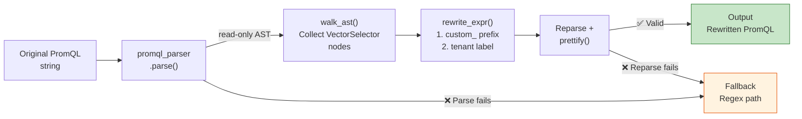

# AST Migration Engine Architecture

> **Language / 語言：** **English (Current)** | [中文](migration-engine.md)

> Related docs: [Migration Guide](migration-guide.md) · [Architecture](architecture-and-design.en.md)

---

## Architecture: AST-Informed String Surgery

**Why not full AST rewrite?** The `promql-parser` (Rust PyO3, v0.7.0) AST is read-only — node attributes cannot be modified and re-serialized. The string surgery approach is safer (preserves original expression structure), simpler (no custom PromQL serializer needed), and verifiable (reparse confirms correctness).

## Core Capabilities

| Capability | Description |
|------------|-------------|
| `extract_metrics_ast()` | Precise AST-based metric name identification, replacing regex + blacklist approach |
| `extract_label_matchers_ast()` | Extracts all label matchers (including `=~` regex matchers) |
| `rewrite_expr_prefix()` | `custom_` prefix injection using word-boundary regex to prevent substring false matches |
| `rewrite_expr_tenant_label()` | `tenant=~".+"` label injection, ensuring tenant isolation |
| `detect_semantic_break_ast()` | Detects `absent()` / `predict_linear()` and other semantic-breaking functions |

## Graceful Degradation

The migration engine employs a progressive degradation strategy:

1. **AST path** (default): Used when `promql-parser` is available and the expression parses successfully
2. **Regex path** (fallback): Automatically activated when `promql-parser` is not installed or a specific expression fails to parse
3. **Forced regex**: CLI `--no-ast` flag bypasses AST for debugging or comparison

Degradation does not affect output format — both paths produce the same three-piece suite (recording rules + threshold normalization + alert rules).

## Enterprise Migration Workflow

The complete migration path integrates the AST engine, Shadow Monitoring, and Triage mode:

1. **Triage**: `migrate_rule.py --triage` produces a CSV inventory, categorizing each rule's migration strategy (direct / prefix / skip)
2. **Migration execution**: AST engine handles prefix injection and tenant label injection
3. **Shadow Monitoring**: `validate_migration.py` verifies numerical consistency before and after migration (tolerance ≤ 5%)
4. **Go-live**: `scaffold_tenant.py` generates the complete tenant configuration package

> **Why 5% tolerance?** PromQL query results before and after migration cannot be perfectly identical due to three inherent sources of variance: (1) **Evaluation timing offset** — old and new rules are evaluated in different cycles, causing sampling differences for time-sensitive functions like `rate()` / `irate()`; (2) **Aggregation path change** — migrating from inline PromQL to recording rule references introduces an additional evaluation cycle of temporal offset; (3) **Floating-point precision** — different expression paths may produce minor differences in trailing decimal places. The 5% threshold is designed to be "tolerant enough to absorb these natural fluctuations, yet strict enough to detect semantic errors" (e.g., missing label filters or incorrect aggregation). If a specific scenario requires tighter or looser tolerance, use the `--tolerance` flag to adjust.

---

> This document was extracted from [`architecture-and-design.en.md`](architecture-and-design.en.md).

## Related Resources

| Resource | Relevance |
|----------|-----------|
| ["AST 遷移引擎架構"](./migration-engine.md) | ⭐⭐⭐ |
| ["Migration Guide — From Traditional Monitoring to Dynamic Alerting Platform"] | ⭐⭐ |
| ["Shadow Monitoring SRE SOP"] | ⭐⭐ |
| ["da-tools CLI Reference"] | ⭐⭐ |
| ["GitOps Deployment Guide"] | ⭐⭐ |
| ["Grafana Dashboard Guide"] | ⭐⭐ |
