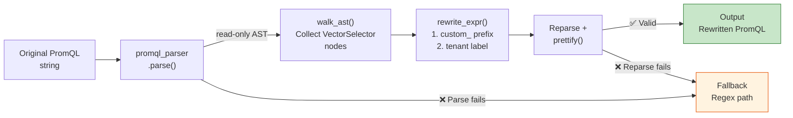

# AST 遷移引擎架構

> **Language / 語言：** | **中文（當前）**

> 相關文件：[Migration Guide](migration-guide.md) · [Architecture](architecture-and-design.md)

---

## 架構：AST-Informed String Surgery

**為什麼不做完整 AST 重寫？** `promql-parser` (Rust PyO3, v0.7.0) 的 AST 是唯讀的——無法修改節點屬性後重新序列化。String surgery 方法更安全（保留原始表達式結構）、更簡單（無需自建 PromQL 序列化器）、且可驗證（reparse 確認結果正確性）。

## 核心功能

| 功能 | 說明 |
|------|------|
| `extract_metrics_ast()` | AST 精準辨識 metric name，取代 regex + blacklist 方式 |
| `extract_label_matchers_ast()` | 提取所有 label matcher（含 `=~` regex matcher） |
| `rewrite_expr_prefix()` | `custom_` 前綴注入，使用 word-boundary regex 防止子字串誤替換 |
| `rewrite_expr_tenant_label()` | `tenant=~".+"` label 注入，確保租戶隔離 |
| `detect_semantic_break_ast()` | 偵測 `absent()` / `predict_linear()` 等語意中斷函式 |

## Graceful Degradation

遷移引擎採用漸進式降級策略：

1. **AST 路徑**（預設）：`promql-parser` 可用且表達式可解析時，使用 AST 精確辨識
2. **Regex 路徑**（降級）：`promql-parser` 未安裝或特定表達式解析失敗時，自動回到 regex 路徑
3. **強制 Regex**：CLI `--no-ast` 旗標可跳過 AST，用於除錯或比較

降級不影響輸出格式——兩條路徑產出相同的三件式套件（recording rules + threshold normalization + alert rules）。

## 企業遷移工作流

完整遷移路徑整合 AST 引擎、Shadow Monitoring 與 Triage 模式：

1. **Triage**：`migrate_rule.py --triage` 產出 CSV 清單，分類每條規則的遷移策略（direct / prefix / skip）
2. **遷移執行**：AST 引擎處理 prefix 注入與 tenant label 注入
3. **Shadow Monitoring**：`validate_migration.py` 驗證遷移前後的數值一致性（預設容差 `--tolerance 0.001`）
4. **上線**：透過 `scaffold_tenant.py` 產出完整的租戶配置包

> **為什麼需要容差？** 遷移前後的 PromQL 查詢結果不可能完全一致，因為存在三個天然誤差來源：(1) **時間窗口偏移**——新舊規則在不同 evaluation cycle 被評估，對 `rate()` / `irate()` 等時間敏感函數會產生取樣偏差；(2) **聚合路徑改變**——從嵌入式 PromQL 改為 recording rule 引用，多一層 evaluation cycle 的時序延遲；(3) **浮點精度**——不同 expression 路徑的浮點運算可能在末位小數產生差異。預設容差 0.001（0.1%）「嚴格到能偵測語義錯誤（漏 label filter、聚合方式錯誤），又寬鬆到容納浮點抖動」。可透過 `--tolerance` 參數調整。

---

> 本文件從 [`architecture-and-design.md`](architecture-and-design.md) 獨立拆分。

## 相關資源

| 資源 | 相關性 |
|------|--------|
| ["AST Migration Engine Architecture"] | ⭐⭐⭐ |
| ["Migration Guide — 遷移指南"](./migration-guide.md) | ⭐⭐ |
| ["Shadow Monitoring SRE SOP"](./shadow-monitoring-sop.md) | ⭐⭐ |
| ["da-tools CLI Reference"](./cli-reference.md) | ⭐⭐ |
| ["GitOps 部署指南"](integration/gitops-deployment.md) | ⭐⭐ |
| ["Grafana Dashboard 導覽"](./grafana-dashboards.md) | ⭐⭐ |
