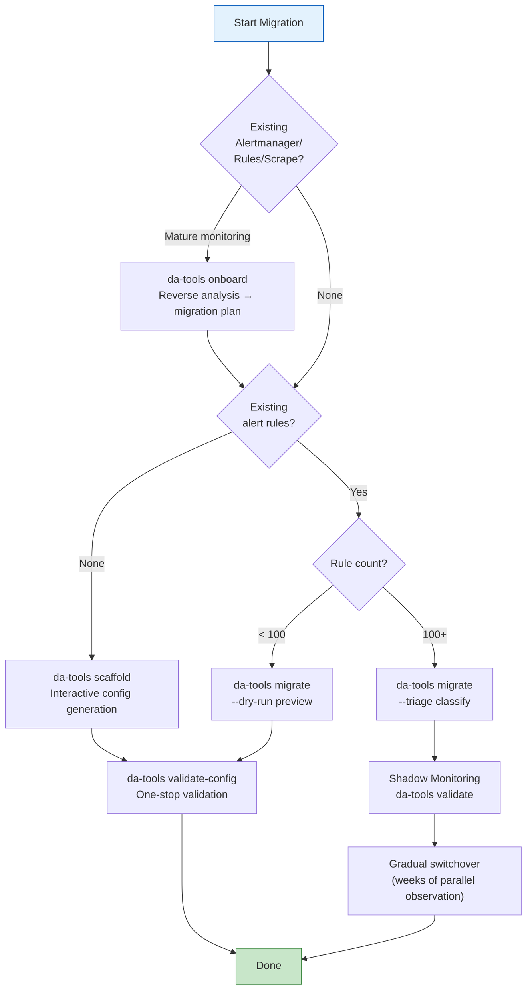

# Migration Guide — From Traditional Monitoring to Dynamic Alerting Platform

> **Language / 語言：** **English (Current)** | [中文](migration-guide.md)

> A **task-routing hub** for migrating from traditional Prometheus alerting to the dynamic multi-tenant threshold architecture. This document uses a decision table + 5-step high-level flow to route readers to the correct detail spoke; tool-level command depth lives in [cli-reference.md](cli-reference.md), and the end-to-end zero-downtime path lives in the [Incremental Migration Playbook](scenarios/incremental-migration-playbook.en.md).
>
> **First time migrating?** Start with the [Incremental Migration Playbook](scenarios/incremental-migration-playbook.en.md); multi-system simultaneous swaps (Prom→VM + rules + AM) follow the [Multi-System Migration Playbook](scenarios/multi-system-migration-playbook.en.md).
>
> **⚠️ Migration Safety Guarantee:** The flow is **incremental and rollback-friendly**. The `custom_` prefix isolates new rules from legacy ones; Projected Volume's `optional: true` lets you unmount any rule pack at any time without affecting Prometheus.
>
> **Tip:** All `da-tools` commands can run directly via Docker (`docker run --rm --network=host ghcr.io/vencil/da-tools:v2.8.0 <cmd>`); examples below use the shorthand `da-tools <cmd>`.

## Install the Migration Toolkit (v2.8.0+)

Install the toolkit before starting. Three delivery paths (Docker / static binary 6-arch / air-gapped tar) — pick any one:

```bash
# Path A: Docker pull from ghcr.io (simplest)
docker pull ghcr.io/vencil/da-tools:v2.8.0

# Path B: Download a static binary to PATH
curl -fsSLo da-guard.tar.gz https://github.com/vencil/Dynamic-Alerting-Integrations/releases/download/tools/v2.8.0/da-guard-linux-amd64.tar.gz
tar xzf da-guard.tar.gz && sudo install -m 0755 da-guard-linux-amd64 /usr/local/bin/da-guard
```

Full command set, hash verification, air-gapped flow, cosign keyless verification: see [`migration-toolkit-installation.md`](migration-toolkit-installation.en.md).

## Where Are You? (你在哪個階段？)

| Your Scenario | Recommended Path | Tool (`da-tools` command) | Estimated Time |
|---------------|------------------|---------------------------|----------------|
| **Brand-new tenant** — first onboarding | Interactive tenant-config generation | `da-tools scaffold` | ~5 min |
| **Existing mature monitoring** — enterprise reverse analysis | Auto-generate migration plan | `da-tools onboard` | ~10 min |
| **Have legacy alert rules** — need to migrate | Auto-convert to the three-piece set | `da-tools migrate` | ~15 min |
| **Large tenant (1000+ rules)** — enterprise migration | Triage → Shadow → switchover | `da-tools migrate --triage` + `da-tools validate` | ~1-2 weeks |
| **3-system simultaneous swap** (storage backend Prom→VM **plus** rules **plus** AM routing) | 5-Phase invariants-driven model | Follow the [Multi-System Migration Playbook](scenarios/multi-system-migration-playbook.en.md) | 13-week estimate (typically ~27 weeks in practice) |
| **Post-cutover rule evolution** (`custom_*` → golden, Rule Pack upgrades) | Lifecycle pattern, not a one-time event | Follow the [Staged Adoption Lifecycle](scenarios/staged-adoption-guide.en.md) | Ongoing |
| **Unsupported DB type** — need extension | Manually create Recording + Alert Rules | See [§9](#9-advanced-extending-unsupported-db-types) | ~30 min |
| **Offboarding a tenant/metric** | Safe removal | `da-tools offboard` / `da-tools deprecate` | ~5 min |
| **Migration trouble** | Symptom-keyed runbook | → [Migration Troubleshooting Checklist](integration/troubleshooting-checklist.en.md) | — |



## Zero-Friction Onboarding

The platform preloads **15 Rule Pack ConfigMaps** (MariaDB, PostgreSQL, Kubernetes, Redis, MongoDB, Elasticsearch, Oracle, DB2, ClickHouse, Kafka, RabbitMQ, JVM, Nginx, Operational, Platform self-monitoring) and distributes them via **Projected Volume**. Each Rule Pack ships the three-piece set: Normalization Recording Rules + Threshold Normalization + Alert Rules. **Rule Packs without a deployed exporter produce no metrics and trigger no false alerts.** After adding an exporter, you only configure `_defaults.yaml` + tenant YAML. See [design/rule-packs.en.md](design/rule-packs.en.md).

## 5-Step High-Level Flow

The standard path from zero to cutover. Each step only lists the trigger commands; click the anchor to drop into the matching section / spoke for parameter details.

| Step | Action | Primary Tool | Details |
|------|--------|--------------|---------|
| **Step 1** | Install Toolkit | `docker pull ghcr.io/vencil/da-tools:v2.8.0` or static binary | [`migration-toolkit-installation.md`](migration-toolkit-installation.en.md) |
| **Step 2** | Reverse-analyze existing monitoring (if any) → produce migration plan | `da-tools onboard --alertmanager-config ... --rule-files ...` | [§0](#0-enterprise-grade-reverse-analysis-da-tools-onboard) · [cli-reference §onboard](cli-reference.md#onboard) |
| **Step 3** | Generate / convert tenant config + the rule three-piece set | `da-tools scaffold` (greenfield) / `da-tools migrate` (existing rules) | [§1](#1-new-tenant-quick-onboarding-da-tools-scaffold) · [§2](#2-existing-rule-migration-da-tools-migrate) · [cli-reference §scaffold](cli-reference.md#scaffold) · [§migrate](cli-reference.md#migrate) |
| **Step 4** | Deploy threshold-exporter + one-stop validation | `helm upgrade ... oci://...` + `da-tools validate-config` + `da-tools diagnose <tenant>` | [§3](#3-deploy-threshold-exporter) · [§6](#6-post-migration-verification) · [tenant-lifecycle onboarding stage](scenarios/tenant-lifecycle.en.md#phase-12-onboarding-day-0) |
| **Step 5** | Shadow Monitoring → cutover → convergence (required when ≥100 rules) | `da-tools validate --watch --auto-detect-convergence` → `da-tools cutover --readiness-json` | [§11](#11-enterprise-grade-migration-large-tenant-1000-rules) · [Shadow Monitoring SOP](shadow-monitoring-sop.en.md) · [Incremental Migration Playbook](scenarios/incremental-migration-playbook.en.md) |

> **Unsure which path to take?** The [§Where Are You?](#where-are-you-你在哪個階段) decision table + mermaid above is the routing entry point. Multi-system swap invariants and the 13-week timeline: [Multi-System Migration Playbook](scenarios/multi-system-migration-playbook.en.md).

---

## 0. Enterprise-Grade Reverse Analysis — da-tools onboard

For enterprises with mature monitoring stacks, `da-tools onboard` **reverse-analyzes** Alertmanager / Prometheus rules / scrape config and produces a migration plan:

- Outputs `extracted-tenants.yaml` (auto-identified tenants + receiver mapping)
- Outputs `migration-plan.csv` (rule buckets: `auto` / `review` / `skip` / `use_golden`)
- Outputs `relabel-config-suggestions.txt` (scrape relabel for Tenant-NS mapping)

Complete flag matrix + scrape-config parser details: [`cli-reference.md#onboard`](cli-reference.md#onboard). The output files can feed directly into `scaffold` / `migrate`, accelerating enterprise onboarding.

---

## 1. New Tenant Quick Onboarding — da-tools scaffold

For brand-new tenants, the interactive generator completes setup in 30 seconds:

```bash
da-tools scaffold --tenant redis-prod --db redis,mariadb --non-interactive -o /data
```

Outputs: `_defaults.yaml` + `<tenant>.yaml` + `scaffold-report.txt` (+ `relabel-config-snippet.yaml` when `--namespaces` is specified). Full flag set, `--routing-receiver`, `--catalog`, `--from-onboard <hints>` pipeline: [`cli-reference.md#scaffold`](cli-reference.md#scaffold).

The three ConfigMap injection paths (Helm / kubectl / GitOps): [threshold-exporter README — K8s Deployment](https://github.com/vencil/Dynamic-Alerting-Integrations/blob/main/components/threshold-exporter/README.md#k8s-部署與配置管理).

---

## 2. Existing Rule Migration — da-tools migrate

Teams with legacy Prometheus alert rules use the auto-conversion tool (v4 — dual AST + regex engine; falls back to regex when PromQL AST parsing fails):

```bash
da-tools migrate /data/legacy-rules.yml --dry-run            # Preview
da-tools migrate /data/legacy-rules.yml -o /data/output      # Production conversion
da-tools migrate /data/legacy-rules.yml --triage -o /data/output  # Large-tenant bucketing
```

The tool automatically handles:

- **Three input scenarios**: `✅ clean parse` / `⚠️ complex expression (with warning box)` / `🚨 unparseable (emits LLM Prompt)`
- **Three-piece output**: `tenant-config.yaml` + `platform-recording-rules.yaml` + `platform-alert-rules.yaml` + `migration-report.txt`
- **Auto-Suppression**: warning + critical pairs for the same metric are auto-matched, and the warning alert gets a second-tier `unless` clause injected
- **Aggregation-mode heuristic**: 6 heuristic rules guess `sum` / `max` automatically and emit an ASCII warning box asking the user to confirm

AST engine depth (why `promql-parser` beats regex) + the full heuristic rule set + Auto-Suppression pairing logic: [`migration-engine.en.md`](migration-engine.en.md). CLI flag matrix: [`cli-reference.md#migrate`](cli-reference.md#migrate). Three-piece-set deployment locations (ConfigMap merge vs independent mount): [threshold-exporter README](https://github.com/vencil/Dynamic-Alerting-Integrations/blob/main/components/threshold-exporter/README.md#k8s-部署與配置管理).

---

## 3. Deploy threshold-exporter

> **Config separation principle**: Neither the Helm chart nor the Docker image ships **test tenant data**. `values.yaml`'s `thresholdConfig.tenants` defaults to empty; you inject your own settings via values-override / GitOps. Development uses `environments/local/threshold-exporter.yaml` (already includes db-a / db-b samples).

Three deployment options:

- **Option A (Recommended)**: OCI Registry — `helm upgrade --install threshold-exporter oci://ghcr.io/vencil/charts/threshold-exporter --version 2.8.0 -n monitoring -f values-override.yaml`
- **Option B**: Local build — `docker build` + `kind load` + `make component-deploy`
- **Option C**: Operator CRD path — `da-tools operator-generate`, replacing ConfigMap mounting (suitable when kube-prometheus-stack is already installed)

Comparison and decision guidance for the two paths: [Deployment Decision Matrix](getting-started/decision-matrix.en.md). Full Helm values, Operator CRD migration, and "Use da-tools in K8s Cluster" mode: [threshold-exporter README](https://github.com/vencil/Dynamic-Alerting-Integrations/blob/main/components/threshold-exporter/README.md#k8s-部署與配置管理) · [Operator integration guides](integration/operator-prometheus-integration.en.md).

Deployment verification:

```bash
kubectl get pods -n monitoring -l app=threshold-exporter
curl -s http://localhost:8080/metrics | grep user_threshold
curl -s http://localhost:8080/api/v1/config | python3 -m json.tool
```

---

## 4. Real-World Examples: Five Migration Scenarios

Using Percona MariaDB Alert Rules as the template, 5 common migration patterns are showcased. Each scenario applies the same three-piece template — only the metric name and Tenant Config key change. The platform-side Alert Rule structure is always `(metric_recording) > on(tenant) group_left (threshold) unless on(tenant) (maintenance == 1)`.

### 4.1 Basic Numeric Comparison (Connections)

**Legacy:**

```yaml
- alert: MySQLTooManyConnections
  expr: mysql_global_status_threads_connected > 100
  for: 5m
  labels: { severity: warning }
```

**Migrated three-piece set:**

```yaml
# 1. Recording Rule (platform)
- record: tenant:mysql_threads_connected:max
  expr: max by(tenant) (mysql_global_status_threads_connected)

# 2. Alert Rule (platform) — group_left + unless maintenance
- alert: MariaDBHighConnections
  expr: |
    (
      tenant:mysql_threads_connected:max
      > on(tenant) group_left
      tenant:alert_threshold:mysql_connections
    )
    unless on(tenant) (user_state_filter{filter="maintenance"} == 1)
  for: 5m
  labels: { severity: warning }

# 3. Tenant Config (tenant)
tenants:
  db-a:
    mysql_connections: "100"
```

### 4.2-4.5 Other Common Patterns — Quick Reference

| Scenario | Source Metric | Recording Rule | Tenant Config Example | Notes |
|----------|---------------|----------------|----------------------|-------|
| **4.2 Multi-tier severity** | `mysql_global_status_threads_connected` | `max by(tenant) (...)` | `mysql_connections: "100"` + `mysql_connections_critical: "150"` | Alert Rule handles `_critical` downgrade logic automatically |
| **4.3 Replication Lag** | `mysql_slave_status_seconds_behind_master` | `max by(tenant) (...)` | `mysql_slave_lag: "30"` or `"disable"` | Max captures the "weakest link" (slowest slave) |
| **4.4 Rate metric** | `rate(mysql_global_status_slow_queries[5m])` | `sum by(tenant) (rate(...))` | `mysql_slow_queries: "0.1"` | Sum reflects cluster-wide load |
| **4.5 Percentage** | `buffer_pool_pages_data / buffer_pool_pages_total * 100` | `max by(...) (...) / max by(...) (...) * 100` | `mysql_innodb_buffer_pool: "95"` | Percentage computed in the Recording Rule |

> 4.2-4.5 reuse the 4.1 three-piece template — only the metric name and Tenant Config key change; the platform-side Alert Rule structure is always identical. Rule Pack design + three-piece contract: [design/rule-packs.en.md](design/rule-packs.en.md). Actual golden alert listings: [Rule Packs ALERT-REFERENCE](rule-packs/ALERT-REFERENCE.md).

---

## 5. Alertmanager Routing Migration

Migrating from "instance-based dispatch" to "tenant-based dispatch": use `tenant` as the first-dimension group_by, with nested routes for severity tiering.

**Config-Driven Routing**: tenants set `_routing` in their own YAML, and the platform tooling auto-generates Alertmanager route + receiver config. Six receiver types: `webhook` / `email` / `slack` / `teams` / `rocketchat` / `pagerduty`.

```bash
da-tools generate-routes --config-dir conf.d/ --validate \
                         --policy .github/custom-rule-policy.yaml
da-tools generate-routes --config-dir conf.d/ -o alertmanager-routes.yaml
da-tools generate-routes --config-dir conf.d/ --apply --yes
```

The platform enforces guardrails on timing parameters (`group_wait` 5s–5m, `group_interval` 5s–5m, `repeat_interval` 1m–72h); out-of-range values are auto-clamped.

Full receiver-type schema, Go template customization, Per-rule Routing Overrides, Silent / Maintenance Mode, Platform Enforced Routing: [BYO Alertmanager Integration Guide](integration/byo-alertmanager-integration.en.md). `_routing` schema and routing-profile hierarchy: [Architecture & Design §Design Concepts Overview](architecture-and-design.en.md) → Alert Routing.

> **v1.3.0 Breaking Change**: `receiver` changed from a plain URL string to a structured object (with a `type` field). The v1.2.0 format is no longer compatible.

---

## 6. Post-Migration Verification

```bash
da-tools validate-config --config-dir /data/conf.d         # One-stop
da-tools check-alert MariaDBHighConnections db-a           # Alert status
da-tools diagnose db-a                                     # Tenant health overview
```

Full verification checklist (YAML validation, alert state, three-state testing, routing, operational_mode, blind-spot scan): [Tenant Lifecycle §Onboarding Stage](scenarios/tenant-lifecycle.en.md#phase-12-onboarding-day-0).

**Post-migration tenant self-service scope**: three-state thresholds, `_critical` suffix, `_routing` (+ overrides), `_silent_mode`, `_state_maintenance`, `_severity_dedup`. Platform Team controls `_routing_defaults` and `_routing_enforced` in `_defaults.yaml`. Details: [GitOps Deployment Guide §7](integration/gitops-deployment.en.md#7-tenant-self-service-configuration-scope).

---

## 7. Dimensional Labels — Multi-DB Type Support

When the platform supports Redis / ES / MongoDB, the same metric can have different thresholds per "dimension". YAML keys containing `{` must be wrapped in double quotes:

```yaml
tenants:
  redis-prod:
    redis_queue_length: "1000"                                # Global default
    "redis_queue_length{queue=\"order-processing\"}": "100"   # Strict
    "redis_queue_length{queue=\"analytics\"}": "5000"         # Loose
    "redis_queue_length{queue=\"temp\"}": "disable"           # Disabled
    # Multiple labels:
    "mongodb_collection_count{database=\"orders\",collection=\"transactions\"}": "10000000"
```

**Design constraints**:

| Constraint | Note |
|------------|------|
| YAML quoting required | Keys containing `{` must be wrapped in double quotes |
| No `_critical` suffix | Use `"value:severity"` syntax instead, e.g. `"500:critical"` |
| Tenant-only | Dimension keys do not inherit from `defaults`; allowed only in tenant config |
| Three-state still applies | Value=Custom, omitted=Default (basic key only), `"disable"`=Disabled |

**Platform-team PromQL adaptation**: the dimension label must appear in both the Recording Rule's `by()` and the Alert Rule's `on()`. Three-piece contract + `tenant:<metric>:<agg>` naming convention: [design/rule-packs.en.md](design/rule-packs.en.md). Redis / ES / MongoDB dimension examples live under `components/threshold-exporter/config/conf.d/examples/`.

---

## 8. LLM-Assisted Manual Conversion

When `da-tools migrate` hits an unparseable rule (e.g. `absent()` / `predict_linear()`), `migration-report.txt` emits a System Prompt template you can hand straight to an LLM. The template guides the LLM to extract thresholds, produce a Recording Rule (with `sum` / `max` rationale), produce an Alert Rule (with `group_left` + `unless maintenance`), and flag items that need platform-side handling. Full prompt structure and post-processing rules: [`migration-engine.en.md`](migration-engine.en.md).

---

## 9. Advanced: Extending Unsupported DB Types

The preloaded 15 Rule Packs already cover mainstream DBs / middleware (MariaDB / PostgreSQL / Redis / MongoDB / Elasticsearch / Oracle / DB2 / ClickHouse / Kafka / RabbitMQ / JVM / Nginx / Kubernetes / Operational / Platform self-monitoring). Adding a new rule pack requires a manual normalization layer.

**Normalization naming**: `tenant:<component>_<metric>:<aggregation_function>`

**Aggregation mode** — Ask: "If one node breaches and others are fine, is that a problem?" Yes → `max by(tenant)` (weakest link); No → `sum by(tenant)` (cluster total).

**Build steps**: Recording Rule → Threshold Normalization Rule → Alert Rule (with `group_left` + `unless maintenance`) → standalone ConfigMap → add source in projected volume → add default in `_defaults.yaml` → produce tenant config via `da-tools scaffold`.

Full Rule Pack structure (three-piece set patterns, bilingual annotation conventions, `alert_threshold:*` naming): [rule-packs/README.md](rule-packs/README.md) · [design/rule-packs.en.md](design/rule-packs.en.md).

---

## 10. FAQ

### Q: How long after editing threshold-config does the change take effect?

The exporter reloads every 30 seconds; K8s ConfigMap propagation takes ~1-2 minutes. Expect 1-3 minutes total.

### Q: What needs to change to add a new metric?

Supported DB types (with a Rule Pack): only add the default in `_defaults.yaml` + the threshold in tenant YAML. Unsupported DBs: also need a Recording Rule + Alert Rule + ConfigMap (see [§9](#9-advanced-extending-unsupported-db-types)).

### Q: Can the old and new alerts coexist during the migration window?

Yes. New-architecture alerts use different alertname values and don't collide. Recommended: deploy the new alerts first, observe, confirm behavioral equivalence, then remove the old rules.

### Q: Can dimension keys be set under defaults?

No. Dimension keys are a tenant-only feature, because each tenant's queue / index / database differs — a global default has no useful meaning.

### Q: How do you mark a dimension key as critical?

Use the `"value:severity"` syntax: `"redis_queue_length{queue=\"orders\"}": "500:critical"`.

### Q: How do you confirm hot-reload succeeded?

```bash
kubectl logs -n monitoring -l app=threshold-exporter --tail=20
# Expected: "Config loaded (directory): X defaults, Y state_filters, Z tenants, ..."
```

---

## 11. Enterprise-Grade Migration — Large Tenant (1000+ rules)

Large tenants with 1000+ rules adopt a three-phase strategy: **Phase A Triage Analysis** (~1 day) → **Phase B Shadow Monitoring** (~1-2 weeks) → **Phase C Switchover & Convergence** (~1 day).

```bash
# Phase A: Triage bucketing (auto / review / skip / use_golden)
da-tools migrate /data/legacy-rules.yml --triage -o /data/triage_output/

# Phase B: deploy shadow rules + continuous comparison (often wrapped as a K8s Job running 1-2 weeks)
da-tools migrate /data/legacy-rules.yml -o /data/migration_output/
da-tools validate --mapping /data/prefix-mapping.yaml \
                  --tolerance 0.001 --watch --interval 60 --rounds 1440 \
                  --auto-detect-convergence --stability-window 5

# Phase C: one-command cutover after convergence
da-tools cutover --readiness-json /data/cutover-readiness.json --tenant db-a --dry-run
da-tools cutover --readiness-json /data/cutover-readiness.json --tenant db-a
da-tools batch-diagnose && da-tools blind-spot --config-dir /data/conf.d
```

Full SOP (shadow route interception, `migration_status` label, K8s Job sample, the `shadow-verify all` shortcut, convergence detection, `prefix-mapping.yaml`, Metric Dictionary golden-standard match, plus `backtest` / `config-diff` / `patch-config` and other automation tools): [Shadow Monitoring SRE SOP](shadow-monitoring-sop.en.md) · [Incremental Migration Playbook](scenarios/incremental-migration-playbook.en.md). CLI deep dive: [`cli-reference.md`](cli-reference.md) under the matching command anchor.

---

## 12. Rule Pack Dynamic Toggle

All 15 Rule Pack projected-volume entries use `optional: true`, allowing on-demand unmount / re-enable:

```bash
# Unmount (e.g. when you bring your own MariaDB rules and want the golden pack off)
kubectl delete cm prometheus-rules-mariadb -n monitoring

# Re-enable
kubectl create configmap prometheus-rules-mariadb \
  --from-file=rule-pack-mariadb.yaml=rule-packs/rule-pack-mariadb.yaml \
  -n monitoring
```

Prometheus handles this on the next reload — no pod restart needed. Typical customer-scenario decision matrix (keep all / partial unmount / fully BYO → platform self-monitoring only): [design/rule-packs.en.md](design/rule-packs.en.md). Projected Volume `optional` design rationale: [ADR-005](adr/005-projected-volume-for-rule-packs.en.md).

---

## 13. Offboarding Process — Tenant and Rule/Metric

```bash
da-tools offboard db-a              # Pre-check (no external dependency)
da-tools offboard db-a --execute    # Execute after confirmation

da-tools deprecate mysql_slave_lag             # Preview
da-tools deprecate mysql_slave_lag --execute   # Apply changes
da-tools deprecate mysql_slave_lag mysql_innodb_buffer_pool --execute  # Batch
```

Offboarding effects: threshold-exporter clears thresholds on next reload (30s) → Prometheus drops the vector on next scrape → related alerts resolve automatically. Pre-check details and the three-step automation (set `"disable"` in `_defaults.yaml` → sweep tenant config residue → emit ConfigMap cleanup guidance): [`cli-reference.md#offboard`](cli-reference.md#offboard) · [`#deprecate`](cli-reference.md#deprecate).

---

## Related Resources

| Resource | Relevance |
|----------|-----------|
| **Advanced migration scenarios (not covered in this guide)** | |
| [Multi-System Migration Playbook](scenarios/multi-system-migration-playbook.en.md) (3-system: Prom→VM + rules + AM simultaneous swap) | ⭐⭐⭐ |
| [Incremental Migration Playbook](scenarios/incremental-migration-playbook.en.md) (four-phase zero-downtime runbook) | ⭐⭐⭐ |
| [Staged Adoption Lifecycle](scenarios/staged-adoption-guide.en.md) (post-cutover `custom_*` → golden progression) | ⭐⭐⭐ |
| [Migration Troubleshooting Checklist](integration/troubleshooting-checklist.en.md) (symptom-keyed runbook for the migration process) | ⭐⭐⭐ |
| [Shadow Monitoring SRE SOP](./shadow-monitoring-sop.en.md) | ⭐⭐⭐ |
| **Tool & Engine Reference** | |
| [`migration-toolkit-installation.md`](migration-toolkit-installation.en.md) (three delivery paths + cosign keyless verification) | ⭐⭐⭐ |
| [`cli-reference.md`](./cli-reference.md) (all `da-tools` commands + flag matrix) | ⭐⭐⭐ |
| [AST Migration Engine Architecture](./migration-engine.en.md) (promql-parser + heuristics + Auto-Suppression) | ⭐⭐ |
| [VictoriaMetrics Integration](integration/victoriametrics-integration.en.md) (VM stack integration walkthrough) | ⭐⭐ |
| **Role Quick Starts** | |
| [Tenant Quick Start](getting-started/for-tenants.en.md) | ⭐⭐ |
| [Domain Expert (DBA) Quick Start](getting-started/for-domain-experts.en.md) | ⭐⭐ |
| [Platform Engineer Quick Start](getting-started/for-platform-engineers.en.md) | ⭐⭐ |
| [Deployment Decision Matrix](getting-started/decision-matrix.en.md) (ConfigMap vs Operator CRD) | ⭐⭐ |
