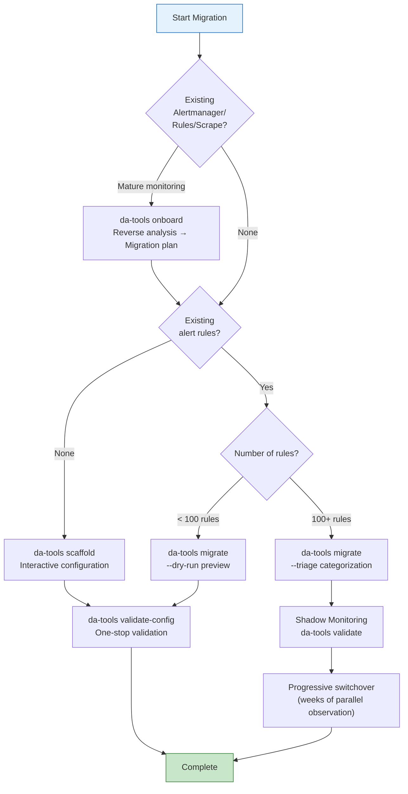

# Migration Guide — From Traditional Monitoring to Dynamic Alerting Platform

> **Language / 語言：** **English (Current)** | [中文](migration-guide.md)

> Migrate from traditional Prometheus alerting to the dynamic multi-tenant threshold architecture.
> **Other Documents:** [README](index.md) (Overview) · [Architecture & Design](architecture-and-design.md) (Technical Depth) · [Rule Packs](rule-packs/README.md) (Rule Pack Directory)

> **⚠️ Migration Safety Guarantee:** The migration process on this platform is designed to be **progressive and reversible**. Your legacy rules don't need to be switched all at once—new rules via the `custom_` prefix are completely isolated from existing rules and can be validated in parallel through Shadow Monitoring for weeks before deciding to switch. Any stage can be safely rolled back: the Projected Volume's `optional: true` mechanism ensures that deleting any rule pack will not affect Prometheus operation.
>
> **Tip:** All `da-tools` commands can be executed directly via Docker (`docker run --rm --network=host ghcr.io/vencil/da-tools:v2.1.0 <cmd>`). The examples below use the simplified `da-tools <cmd>` notation.

## Where Are You? (你在哪個階段？)

| Your Situation | Recommended Path | Tool (`da-tools` command) | Estimated Time |
|----------|----------|------|---------|
| **New Tenant** — First time onboarding | Interactive configuration generation | `da-tools scaffold` | ~5 min |
| **Existing Mature Monitoring System** — Enterprise reverse analysis | Auto-generate migration plan | `da-tools onboard` | ~10 min |
| **Existing Traditional Alert Rules** — Need migration | Auto-convert to three-piece set | `da-tools migrate` | ~15 min |
| **Large Tenant (1000+ rules)** — Enterprise-grade migration | Triage → Shadow → Switchover | `da-tools migrate --triage` + `da-tools validate` | ~1-2 weeks |
| **Unsupported DB Type** — Need extension | Manual Recording + Alert Rules creation | See [§9](#9-advanced-extending-unsupported-db-types) | ~30 min |
| **Offboarding Tenant/Metrics** | Safe removal | `da-tools offboard` / `da-tools deprecate` | ~5 min |



## Zero-Friction Onboarding

This platform comes pre-loaded with **15 Rule Pack ConfigMaps** (MariaDB, PostgreSQL, Kubernetes, Redis, MongoDB, Elasticsearch, Oracle, DB2, ClickHouse, Kafka, RabbitMQ, JVM, Nginx, Operational, and Platform self-monitoring), distributed across independent ConfigMaps via Kubernetes **Projected Volume** architecture. Each Rule Pack contains a complete three-piece set: Normalization Recording Rules + Threshold Normalization + Alert Rules.

**Rule Packs without deployed exporters won't generate metrics, and alerts won't fire incorrectly (near-zero cost)**. After adding a new exporter, you only need to configure `_defaults.yaml` + tenant YAML without modifying Prometheus configuration.

---

## 0. Enterprise-Grade Reverse Analysis — da-tools onboard

For enterprises with mature monitoring systems, `onboard_platform.py` supports **reverse analysis** of existing configurations to automatically generate migration plans:

```bash
# Analyze existing Alertmanager configuration
da-tools onboard --alertmanager-config /data/alertmanager.yml -o /data/migration-plan/

# Analyze existing Prometheus rules
da-tools onboard --rule-files '/data/rules/*.yml' -o /data/migration-plan/

# Analyze scrape config (for Tenant-NS mapping)
da-tools onboard --scrape-config /data/prometheus.yml -o /data/migration-plan/ --tenant-label cluster

# Analyze everything at once (three phases combined)
da-tools onboard --alertmanager-config /data/alertmanager.yml \
                  --rule-files '/data/rules/*.yml' \
                  --scrape-config /data/prometheus.yml \
                  --tenant-label cluster -o /data/migration-plan/
```

### Tool Output

| File | Description |
|------|------|
| `extracted-tenants.yaml` | Auto-identified tenant list with Alertmanager receiver mapping |
| `migration-plan.csv` | Rule bucketing list (auto/review/skip/use_golden) + mapping recommendations |
| `relabel-config-suggestions.txt` | Prometheus scrape config relabel snippet (for Tenant-NS mapping) |

After reverse analysis completes, you can directly use `extracted-tenants.yaml` as input to `scaffold` and `migrate` to accelerate enterprise migration onboarding.

---

## 1. New Tenant Quick Onboarding — da-tools scaffold

For brand-new tenants, use the interactive generator to complete setup in 30 seconds:

```bash
# CLI mode — one-liner
da-tools scaffold --tenant redis-prod --db redis,mariadb --non-interactive -o /data

# With N:1 namespace-tenant mapping
da-tools scaffold --tenant redis-prod --db redis,mariadb --namespaces ns1,ns2,ns3 \
                  --non-interactive -o /data

# With routing configuration — output includes complete routing config
da-tools scaffold --tenant redis-prod --db redis,mariadb \
                  --routing-receiver "https://hooks.slack.com/services/T../B../xxx" \
                  --routing-receiver-type slack --non-interactive -o /data

# View supported DB types and metrics
da-tools scaffold --catalog
```

### Tool Output

| File | Description |
|------|------|
| `_defaults.yaml` | Platform global defaults (contains all selected DB metrics) |
| `<tenant>.yaml` | Tenant override configuration (contains three-state examples + `_routing` + `_severity_dedup`) |
| `scaffold-report.txt` | Deployment steps and Rule Pack status summary |
| `relabel-config-snippet.yaml` | Prometheus relabel_configs snippet (only output when `--namespaces` is used) |

All core Rule Packs (including self-monitoring) are pre-loaded via Projected Volume on the platform. Output configs can be directly copied to `conf.d/` for use without additional mounting.

### Injection into K8s Cluster

The files produced by scaffold need to be injected into the `threshold-config` ConfigMap so that threshold-exporter can read them:

```bash
# Method A (recommended): Helm values override — OCI registry
#   Merge the output tenant config into values-override.yaml, then helm upgrade
helm upgrade threshold-exporter \
  oci://ghcr.io/vencil/charts/threshold-exporter --version 2.1.0 \
  -n monitoring -f values-override.yaml

# Method B: Direct ConfigMap reconstruction (suitable for non-Helm environments)
kubectl create configmap threshold-config \
  --from-file=conf.d/ \
  -n monitoring --dry-run=client -o yaml | kubectl apply -f -
```

After ConfigMap changes, exporter will auto hot-reload within 1-3 minutes (K8s propagation + SHA-256 watcher) without needing to restart Pods.

> For detailed three injection methods (Helm / kubectl / GitOps), see [threshold-exporter README — K8s Deployment and Configuration Management](https://github.com/vencil/Dynamic-Alerting-Integrations/blob/main/components/threshold-exporter/README.md#k8s-deployment-and-configuration-management).

---

## 2. Existing Rule Migration — da-tools migrate

Teams with existing traditional Prometheus alert rules can use the auto-conversion tool (v4 — AST + regex dual-engine):

```bash
# Preview mode — no file output, only analysis results
da-tools migrate /data/legacy-rules.yml --dry-run

# Formal conversion — output to output/
da-tools migrate /data/legacy-rules.yml -o /data/output

# Triage + Dry Run (recommended for enterprise migration)
da-tools migrate /data/legacy-rules.yml -o /data/output --dry-run --triage

# Force regex mode (don't use AST engine)
da-tools migrate /data/legacy-rules.yml --no-ast
```

> The tool uses the PromQL AST engine (`promql-parser`) by default to precisely identify metric names and automatically inject the `custom_` prefix and `tenant` label. When AST parsing fails, it automatically falls back to regex, ensuring backward compatibility.

### Three Processing Scenarios

| Scenario | Trigger Condition | Tool Behavior |
|------|----------|----------|
| ✅ **Perfect Parse** | Simple `metric > value` | Auto-produce complete three-piece set |
| ⚠️ **Complex Expression** | Contains `rate()`, `[5m]`, math operations | Produce three-piece set + ASCII warning box requesting aggregation mode confirmation |
| 🚨 **Cannot Parse** | `absent()`, `predict_linear()`, etc. | Don't produce, instead provide Prompt suitable for LLM |

### The Tool Output "Three-Piece Set"

Conversion produces 4 files:

| File | Description |
|------|------|
| `tenant-config.yaml` | YAML snippet that tenant needs to fill into `db-*.yaml` |
| `platform-recording-rules.yaml` | Platform team's normalized Recording Rules (valid YAML, includes `groups:` boilerplate) |
| `platform-alert-rules.yaml` | Alert Rules including `group_left` + `unless maintenance` + Auto-Suppression |
| `migration-report.txt` | Conversion summary and LLM Prompt for unparsed rules |

### Deploy to K8s Cluster

The converted three-piece set needs to be deployed to different locations:

```bash
# 1. tenant-config.yaml → merge into threshold-config ConfigMap
#    Merge tenant-config.yaml content into conf.d/<tenant>.yaml, then update ConfigMap
kubectl create configmap threshold-config \
  --from-file=conf.d/ \
  -n monitoring --dry-run=client -o yaml | kubectl apply -f -

# 2. Recording Rules + Alert Rules → create as independent ConfigMap, mounted to Prometheus
kubectl create configmap prometheus-rules-custom \
  --from-file=platform-recording-rules.yaml \
  --from-file=platform-alert-rules.yaml \
  -n monitoring --dry-run=client -o yaml | kubectl apply -f -

# 3. Ensure Prometheus Projected Volume includes this ConfigMap
#    If using Helm, add new source in values.yaml;
#    If already have custom rule pack slot, ConfigMap auto-mounts after creation
```

> **Helm users**: You can also integrate recording/alert rules into Helm chart values for centralized management. See [threshold-exporter README](https://github.com/vencil/Dynamic-Alerting-Integrations/blob/main/components/threshold-exporter/README.md#k8s-deployment-and-configuration-management).

### Aggregation Mode Intelligent Guessing

For complex expressions, the tool automatically guesses `sum` or `max` based on 6 heuristic rules. Guessed recording rules carry a prominent ASCII warning box, reminding users to confirm the aggregation mode (`sum`=cluster total, `max`=single point bottleneck) before copy-pasting. If unsure, re-run with `--interactive` mode.

### Auto-Suppression

When input rules include both warning and critical versions (same base metric key), the tool automatically pairs them and injects a second-layer `unless` clause (Auto-Suppression) into the warning alert, ensuring that when critical fires, warning is suppressed. Pairing logic: warning key `custom_X` pairs with critical key `custom_X_critical`. If only single severity exists, no injection occurs.

---

## 3. Deploy threshold-exporter

> **Config Separation Principle**: Both Helm chart and Docker image **do not include test tenant data**. The `thresholdConfig.tenants` in `values.yaml` defaults to empty. You need to inject your own tenant configuration through values-override or GitOps (see [§1 Injection into K8s Cluster](#injection-into-k8s-cluster)). Development/test environments use `environments/local/threshold-exporter.yaml`, which already includes db-a and db-b example tenants.

### Option A (Recommended): OCI Registry

```bash
# Production deployment — install chart from OCI registry with custom values-override to inject tenant config
helm upgrade --install threshold-exporter \
  oci://ghcr.io/vencil/charts/threshold-exporter --version 2.1.0 \
  -n monitoring --create-namespace \
  -f values-override.yaml
```

> No need to clone the repo or specify image tag—the chart already has the corresponding image version bound.

### Option B: Local Build

```bash
cd components/threshold-exporter/app
docker build -t threshold-exporter:dev .
kind load docker-image threshold-exporter:dev --name dynamic-alerting-cluster
make component-deploy COMP=threshold-exporter ENV=local
```

### Verify Deployment

```bash
kubectl get pods -n monitoring -l app=threshold-exporter
curl -s http://localhost:8080/metrics | grep user_threshold
curl -s http://localhost:8080/api/v1/config | python3 -m json.tool
```

### Use da-tools in K8s Cluster

da-tools can also run directly as K8s Job (`image: ghcr.io/vencil/da-tools:v2.1.0`), eliminating port-forward setup. In-cluster da-tools can directly access Prometheus through K8s Service (`http://prometheus.monitoring.svc.cluster.local:9090`), suitable for commands like `check-alert`, `validate`, `baseline` that need Prometheus API.

> Job output can be retrieved via `kubectl cp`, then injected into `threshold-config` ConfigMap. For long-running Shadow Monitoring Job examples, see [§11 Enterprise-Grade Migration Phase B](#phase-b-conversion-shadow-monitoring).

---

## 4. Real-World Examples: Five Migration Scenarios

Using Percona MariaDB Alert Rules as template, demonstrate complete migration path.

### 4.1 Basic Value Comparison (Connection Count)

**Traditional approach**:
```yaml
- alert: MySQLTooManyConnections
  expr: mysql_global_status_threads_connected > 100
  for: 5m
  labels: { severity: warning }
```

**Migration three-piece set**:
```yaml
# 1. Recording Rule (Platform)
- record: tenant:mysql_threads_connected:max
  expr: max by(tenant) (mysql_global_status_threads_connected)

# 2. Alert Rule (Platform) — group_left + unless maintenance
- alert: MariaDBHighConnections
  expr: |
    (
      tenant:mysql_threads_connected:max
      > on(tenant) group_left
      tenant:alert_threshold:connections
    )
    unless on(tenant) (user_state_filter{filter="maintenance"} == 1)
  for: 5m
  labels: { severity: warning }

# 3. Tenant Config (Tenant)
tenants:
  db-a:
    mysql_connections: "100"
```

### 4.2-4.5 Other Common Patterns — Quick Reference Table

The three-piece set structure demonstrated in 4.1 above applies to all scenarios. The table below lists key differences for common metrics:

| Scenario | Original Metric | Recording Rule | Tenant Config Example | Special Notes |
|----------|---------|----------------|-------------------|---------|
| **4.2 Multi-layer Severity** | `mysql_global_status_threads_connected` | `max by(tenant) (...)` | `mysql_connections: "100"` + `mysql_connections_critical: "150"` | Alert Rule automatically handles `_critical` degradation logic |
| **4.3 Replication Lag** | `mysql_slave_status_seconds_behind_master` | `max by(tenant) (...)` | `mysql_slave_lag: "30"` or `"disable"` | Max for "weakest link" (most lagging slave) |
| **4.4 Rate Metric** | `rate(mysql_global_status_slow_queries[5m])` | `sum by(tenant) (rate(...))` | `mysql_slow_queries: "0.1"` | Sum for "cluster total" (slow queries overall) |
| **4.5 Percentage Calculation** | `buffer_pool_pages_data / buffer_pool_pages_total * 100` | `max by(...) (...) / max by(...) (...) * 100` | `mysql_innodb_buffer_pool: "95"` | Percentage calculation completes in Recording Rule |

> **Summary:** Sections 4.2-4.5 simply apply the 4.1 three-piece template by changing the metric name and tenant config key. Platform-side alert rule structure remains consistent. See [Rule Packs ALERT-REFERENCE](rule-packs/ALERT-REFERENCE.md) for actual rules.

---

## 5. Alertmanager Routing Migration

### Traditional (based on instance)

```yaml
route:
  group_by: ['alertname', 'instance']
  routes:
    - matchers: [instance=~"db-a-.*"]
      receiver: "team-a-slack"
```

### After Migration (based on tenant)

```yaml
route:
  group_by: ['tenant', 'alertname']
  routes:
    - matchers: [tenant="db-a"]
      receiver: "team-a-slack"
      routes:
        - matchers: [severity="critical"]
          receiver: "team-a-pagerduty"
```

Route first by `tenant` dimension, supporting nested routing for severity layering.

### Config-Driven Routing 

Tenants can configure the `_routing` section in their own YAML, with the platform tool auto-producing Alertmanager route + receiver config.

> **v1.3.0 Breaking Change**: `receiver` changed from pure URL string to structured object (with `type` field). format is no longer compatible.

Six receiver types supported: `webhook`, `email`, `slack`, `teams`, `rocketchat`, `pagerduty`.

```yaml
# tenant YAML (conf.d/db-a.yaml)
tenants:
  db-a:
    mysql_connections: "70"
    _routing:
      receiver:
        type: "webhook"
        url: "https://hooks.slack.com/services/T00/B00/xxx"
      group_by: ["alertname", "severity"]
      group_wait: "30s"
      repeat_interval: "4h"
```

```bash
# Validate config legality (including webhook domain allowlist check)
da-tools generate-routes --config-dir conf.d/ --validate --policy .github/custom-rule-policy.yaml

# Produce Alertmanager fragment
da-tools generate-routes --config-dir conf.d/ -o alertmanager-routes.yaml

# One-stop merge into Alertmanager ConfigMap + reload 
da-tools generate-routes --config-dir conf.d/ --apply --yes
```

Platform has guardrails for timing parameters (group_wait 5s–5m, group_interval 5s–5m, repeat_interval 1m–72h), with out-of-range values automatically clamped. Complete receiver type examples and Go template message customization details see [BYO Alertmanager Integration Guide §5](byo-alertmanager-integration.md#5-receiver-類型).

### Advanced Routing Features

| Feature | Description | Details |
|---------|-------------|---------|
| Per-rule Routing Overrides | `_routing.overrides[]` specify different receiver for specific alertname/metric_group | [BYO Alertmanager §7](byo-alertmanager-integration.md#7-per-rule-routing-overrides) |
| Silent / Maintenance Mode | `_silent_mode` / `_state_maintenance` + `expires` auto-expiry | [Architecture §2.7](architecture-and-design.md) |
| Platform Enforced Routing | `_routing_enforced` ensures NOC receives all alerts (dual-channel) | [BYO Alertmanager §8](byo-alertmanager-integration.md#8-platform-enforced-routing) |

---

## 6. Post-Migration Verification

```bash
# 0. One-stop config validation (recommended to run before deployment, v1.7.0)
da-tools validate-config --config-dir /data/conf.d

# 1. Confirm thresholds output correctly
curl -s http://localhost:8080/metrics | grep 'user_threshold{.*connections'

# 2. Confirm Alert status
da-tools check-alert MariaDBHighConnections db-a

# 3. Tenant health check (includes operational_mode, threshold parsing, alert status)
da-tools diagnose db-a
```

### Complete Verification Checklist

See [Tenant Lifecycle — Onboarding Phase](scenarios/tenant-lifecycle.md#階段-12上線day-0) for the complete verification checklist, covering YAML validation, alert status, three-state testing, routing, operational_mode confirmation, and blind spot scanning.

### Post-Migration: Tenant Self-Management

After migration completes, Tenants can self-manage the following in their own YAML (via PR → CI → GitOps workflow, without Platform Team intervention):

| Configuration | Description | Example |
|------|------|------|
| Threshold three-state | Custom value / omit for default / `"disable"` to disable | `mysql_connections: "70"` |
| `_critical` suffix | Multi-layer severity | `mysql_connections_critical: "95"` |
| `_routing` | Notification routing (6 receiver types) | `receiver: {type: "slack", ...}` |
| `_routing.overrides[]` | Specific alert uses different receiver | `alertname: "..."` + `receiver: {...}` |
| `_silent_mode` | Silent mode (TSDB has record but no notification) | `{target: "all", expires: "..."}` |
| `_state_maintenance` | Maintenance mode (completely no firing) | Same as above, supports `expires` auto-expiry |
| `_severity_dedup` | Severity deduplication | `enabled: true` |

Platform Team controlled settings (in `_defaults.yaml`) include global defaults, `_routing_defaults`, `_routing_enforced`. See [GitOps Deployment Guide §7](gitops-deployment.en.md#7-tenant-self-service-configuration-scope).

---

## 7. Dimensional Labels — Multi-DB Type Support

When the platform supports multiple DB types like Redis, ES, MongoDB, the same metric can set different thresholds by "dimension".

### Syntax

```yaml
tenants:
  redis-prod:
    redis_queue_length: "1000"                              # global default
    "redis_queue_length{queue=\"order-processing\"}": "100"  # strict
    "redis_queue_length{queue=\"analytics\"}": "5000"        # loose
    "redis_queue_length{queue=\"temp\"}": "disable"          # disabled
```

Multiple labels:
```yaml
    "mongodb_collection_count{database=\"orders\",collection=\"transactions\"}": "10000000"
```

### Design Constraints

| Constraint | Description |
|------|------|
| **YAML needs quotes** | Keys containing `{` must be wrapped in double quotes |
| **`_critical` suffix not supported** | Use `"value:severity"` syntax instead, e.g., `"500:critical"` |
| **Tenant-only** | Dimensional keys don't inherit from `defaults`, only allowed in tenant config |
| **Three-state still applies** | Value=Custom, omit=Default (basic key only), `"disable"`=Disabled |

### Platform Team PromQL Adaptation (Important)

Dimensional labels must appear in Recording Rule's `by()` and Alert Rule's `on()`:

```yaml
# Recording Rule — must by(tenant, queue)
- record: tenant:redis_queue_length:max
  expr: max by(tenant, queue) (redis_queue_length)

# Threshold Normalization — must by(tenant, queue)
- record: tenant:alert_threshold:redis_queue_length
  expr: max by(tenant, queue) (user_threshold{metric="redis_queue_length"})

# Alert Rule — must on(tenant, queue) group_left
- alert: RedisQueueTooLong
  expr: |
    (
      tenant:redis_queue_length:max
      > on(tenant, queue) group_left
      tenant:alert_threshold:redis_queue_length
    )
    unless on(tenant) (user_state_filter{filter="maintenance"} == 1)
```

### Reference Templates

In `components/threshold-exporter/config/conf.d/examples/` directory:

| File | DB Type | Dimension Example |
|------|---------|----------|
| `redis-tenant.yaml` | Redis | queue, db |
| `elasticsearch-tenant.yaml` | Elasticsearch | index, node |
| `mongodb-tenant.yaml` | MongoDB | database, collection |
| `_defaults-multidb.yaml` | Multi-DB global default | (no dimensions) |

---

## 8. LLM-Assisted Manual Conversion

When `da-tools migrate` encounters unparseable rules, it produces a Prompt suitable for direct LLM input. The `migration-report.txt` includes a ready-to-use LLM System Prompt template that guides the LLM to extract thresholds, produce Recording Rules (with sum/max reasoning), Alert Rules (with `group_left` + `unless maintenance`), and flag items needing platform extra handling.

---

## 9. Advanced: Extending Unsupported DB Types

v1.8.0 pre-loads 13 Rule Pack ConfigMaps covering MariaDB, PostgreSQL, Redis, MongoDB, Elasticsearch, Oracle, DB2, ClickHouse, Kafka, RabbitMQ, Kubernetes, Operational, and Platform self-monitoring. To support DB types without Rule Packs, you need to manually create a normalization layer.

### Normalization Naming Convention

```
tenant:<component>_<metric>:<aggregation_function>
```

| Raw Metric | After Normalization | Description |
|----------|----------|------|
| `mysql_global_status_threads_connected` | `tenant:mysql_threads_connected:max` | Single-point ceiling, take max |
| `rate(mysql_global_status_slow_queries[5m])` | `tenant:mysql_slow_queries:rate5m` | Cluster summed rate |

### Aggregation Mode Selection — Max vs. Sum

Decision matrix:
```
Ask yourself: "If one node exceeds threshold and others are normal, is there a problem?"
  ├── Yes → max by(tenant) (weakest link)
  └── No → sum by(tenant) (cluster total)
```

**max by(tenant)** — resources with "single-point physical limits" (connection limit, disk space, replication lag).

**sum by(tenant)** — assess "overall system load" (slow queries, traffic, CPU usage).

### Creation Steps

1. Create Recording Rule (normalization layer)
2. Create Threshold Normalization Rule
3. Create Alert Rule (includes `group_left` + `unless maintenance`)
4. Create independent ConfigMap (`configmap-rules-<db>.yaml`)
5. Add new source to projected volume in `deployment-prometheus.yaml`
6. Add default threshold to `_defaults.yaml`
7. Use `da-tools scaffold` to generate tenant config

Complete Rule Pack structure see [rule-packs/README.md](rule-packs/README.md).

---

## 10. FAQ

### Q: How long does threshold-config take to take effect after modification?

Exporter reloads every 30 seconds, K8s ConfigMap propagation is about 1-2 minutes. Expected 1-3 minutes total.

### Q: What needs to be changed when adding a new metric?

For supported DB types (with Rule Pack): only add default value to `_defaults.yaml` + add threshold to tenant YAML. For unsupported DB: need to additionally create Recording Rule + Alert Rule + ConfigMap.

### Q: Can old and new coexist during migration transition?

Yes. The new architecture's alerts use different alertnames, no conflict. Recommend deploying new alerts first to observe, then remove old rules after confirming behavior matches.

### Q: Can dimensional keys be configured in defaults?

No. Dimensional keys are tenant-only because each tenant's queues/indices/databases are different, global defaults make no sense.

### Q: How to specify critical for dimensional key?

Use `"value:severity"` syntax: `"redis_queue_length{queue=\"orders\"}": "500:critical"`.

### Q: How to confirm hot-reload succeeded?

```bash
kubectl logs -n monitoring -l app=threshold-exporter --tail=20
# Expected: "Config loaded (directory): X defaults, Y state_filters, Z tenants, N resolved thresholds, M resolved state filters"
```

---

## 11. Enterprise-Grade Migration — Large Tenant (1000+ rules)

For large tenants with 1600+ rules, the following three-phase migration strategy is recommended:

```
Phase A              Phase B                    Phase C
Triage Analysis      Shadow Monitoring          Switchover & Convergence
(~1 day)             (~1-2 weeks)               (~1 day)
┌──────────┐     ┌──────────────────────┐    ┌──────────────┐
│ migrate   │     │ validate --watch     │    │ Remove old   │
│ --triage  │────►│ --tolerance 0.001    │───►│ Enable golden│
│ CSV bucket│     │ Continuous comparison│    │ diagnose     │
└──────────┘     └──────────────────────┘    └──────────────┘
```

### Phase A: Triage Analysis

```bash
# Produce CSV bucketing report — batch decision in Excel
da-tools migrate /data/legacy-rules.yml --triage -o /data/triage_output/
```

Tool automatically buckets rules into four categories:

| Triage Action | Description | Recommended Handling |
|---------------|------|----------|
| `auto` | Simple expression, auto-convertible | Directly adopt |
| `review` | Complex expression, aggregation mode guessed | Confirm in CSV |
| `skip` | Cannot auto-convert | Pass to LLM or manual handling |
| `use_golden` | Dictionary matched to golden standard | Use `da-tools scaffold` to set threshold directly |

### Phase B: Conversion + Shadow Monitoring

```bash
# 1. Formal conversion (auto add custom_ prefix)
da-tools migrate /data/legacy-rules.yml -o /data/migration_output/

# 2. Deploy new rules (with shadow label, don't trigger notifications)
kubectl apply -f migration_output/platform-recording-rules.yaml
kubectl apply -f migration_output/platform-alert-rules.yaml

# 3. Intercept shadow alerts in Alertmanager
# Configure route: matchers: [migration_status="shadow"] → null receiver

# 4. Continuously compare old and new Recording Rule values (in cluster)
da-tools validate --mapping /data/prefix-mapping.yaml \
                  --tolerance 0.001 --watch --interval 60 --rounds 1440

# Or local dev: first port-forward, then execute above command
kubectl port-forward svc/prometheus 9090:9090 -n monitoring &
```

**Long-term Shadow Monitoring (K8s Job)**: Large customers should package `da-tools validate --watch` as a K8s Job running in-cluster for 1-2 weeks (e.g., `--interval 300 --rounds 4032` = every 5 minutes × 14 days). For K8s Job pattern, see [§3 Use da-tools in K8s Cluster](#use-da-tools-in-k8s-cluster).

### Phase C: Switchover & Convergence

After running 1-2 weeks with `da-tools validate` continuously comparing all rule pair outputs, confirm all mismatches have been investigated and resolved:

**Automated Switchover **:

```bash
# Dry run preview
da-tools cutover --readiness-json /data/cutover-readiness.json --tenant db-a --dry-run

# Execute switchover (auto completes: stop Job → remove old rules → remove label → remove shadow route → verify)
da-tools cutover --readiness-json /data/cutover-readiness.json --tenant db-a
```

`cutover-readiness.json` is auto-produced by `validate --auto-detect-convergence` when convergence criteria are met. If manually confirming convergence (no readiness JSON), use `--force` to skip readiness check. See [Shadow Monitoring SOP §7](shadow-monitoring-sop.md#7-退出-shadow-monitoring).

> **Tip**: Before switchover, use `da-tools shadow-verify all` for a one-command full readiness check (preflight + runtime + convergence), replacing manual step-by-step verification.

**Manual Switchover Steps** (if not using automated tool):

1. Remove old rules
2. Remove `migration_status: shadow` label from new rules
3. Progressively enable golden Rule Packs to replace `custom_` rules
4. Reference `prefix-mapping.yaml` for convergence tracking

**Post-Switchover Verification**:

```bash
# Batch health check
da-tools batch-diagnose

# Monitor blind spot scan — confirm all cluster DB instances have corresponding tenant config
da-tools blind-spot --config-dir /data/conf.d
```

`blind-spot` lists instances in cluster running exporters but not covered by tenant config (blind spots). After migration, recommend running regularly (e.g., when adding new exporters) to ensure all DB instances are protected by threshold monitoring.

### Metric Dictionary Auto-Matching

`da-tools migrate` (v4) has built-in heuristic dictionary (`metric-dictionary.yaml`) to auto-match traditional metrics to golden standards:

```
📖 MySQLTooManyConnections: recommend using golden standard MariaDBHighConnections (da-tools scaffold)
```

Platform Team can directly edit `scripts/tools/metric-dictionary.yaml` to expand dictionary without code changes.

### Migration Automation Tools

The following tools reduce manual intervention in large migrations:

| Tool | Usage | Effect |
|------|------|------|
| **Onboard→Scaffold pipeline** | `onboard` → `scaffold --from-onboard <hints>` | One-click migration prep  |
| **Auto-convergence detection** | `validate --auto-detect-convergence --stability-window 5` | Auto-produce `cutover-readiness.json` after N consecutive matches  |
| **One-command cutover** | `cutover --readiness-json <path> --tenant <t>` | Single command completes full Shadow Monitoring switchover  |
| **Post-cutover health report** | `batch-diagnose` | Auto-discover tenants → parallel `diagnose` → health score  |
| **Blind spot discovery** | `blind-spot --config-dir <dir>` | Scan cluster targets vs tenant config for blind spots  |
| **Rule Pack gap analysis** | `analyze-gaps --config <path>` | Three-layer matching analyze `custom_` rules to official Rule Packs  |
| **Threshold backtest** | `backtest --git-diff --prometheus <url>` | PR threshold changes 7-day history backtest + risk level  |
| **Config diff** | `config-diff --old-dir <old> --new-dir <new>` | Directory-level config diff blast radius report  |
| **Config patch preview** | `patch-config --diff <tenant> <metric> <value>` | Single metric live before/after comparison  |

---

## 12. Rule Pack Dynamic Toggle

All 15 Rule Pack ConfigMaps have `optional: true` in Projected Volume, allowing selective unloading.

### Unload Unnecessary Rule Packs

```bash
# Large customer has own MariaDB rules, disable golden standard to avoid conflicts
kubectl delete cm prometheus-rules-mariadb -n monitoring

# Prometheus will gracefully ignore missing ConfigMap on next reload
# No Prometheus restart needed
```

### Re-enable

```bash
# Recreate ConfigMap from rule-packs/ directory
kubectl create configmap prometheus-rules-mariadb \
  --from-file=rule-pack-mariadb.yaml=rule-packs/rule-pack-mariadb.yaml \
  -n monitoring
```

### Typical Scenarios

| Customer Type | Recommended Rule Pack Setting |
|----------|---------------------|
| New tenant | Keep all (default) |
| Self-supplied MariaDB rules | Disable `prometheus-rules-mariadb` |
| Redis only | Disable MariaDB, MongoDB, Elasticsearch |
| All self-supplied | Keep only `prometheus-rules-platform` (self-monitoring) |

---

## 13. Offboarding Process — Tenant and Rule/Metric

### Tenant Offboarding

```bash
# Pre-check mode — confirm no external dependencies
da-tools offboard db-a

# Execute after confirmation
da-tools offboard db-a --execute
```

Pre-check items: config file existence, cross-file reference scanning, configured metrics list.

After offboarding effects:
- threshold-exporter auto-clears thresholds on next reload (30s)
- Prometheus vectors disappear on next scrape
- All related Alerts auto-resolve
- **Does not affect other Tenants**

### Rule/Metric Offboarding

```bash
# Preview mode
da-tools deprecate mysql_slave_lag

# Execute (modify files)
da-tools deprecate mysql_slave_lag --execute

# Batch processing
da-tools deprecate mysql_slave_lag mysql_innodb_buffer_pool --execute
```

Three-step automation:
1. Set to `"disable"` in `_defaults.yaml`
2. Scan and clean residuals in all tenant configs
3. Produce ConfigMap cleanup guidance (manual execution in next Release Cycle)

## Related Resources

| Resource | Relevance |
|----------|-----------|
| ["Migration Guide — 遷移指南"](./migration-guide.md) | ⭐⭐⭐ |
| ["Tenant Quick Start Guide"](getting-started/for-tenants.en.md) | ⭐⭐ |
| ["AST Migration Engine Architecture"] | ⭐⭐ |
| ["da-tools CLI Reference"] | ⭐⭐ |
| ["Domain Expert (DBA) Quick Start Guide"](getting-started/for-domain-experts.en.md) | ⭐⭐ |
| ["Platform Engineer Quick Start Guide"](getting-started/for-platform-engineers.en.md) | ⭐⭐ |
| ["Shadow Monitoring SRE SOP"] | ⭐⭐ |
