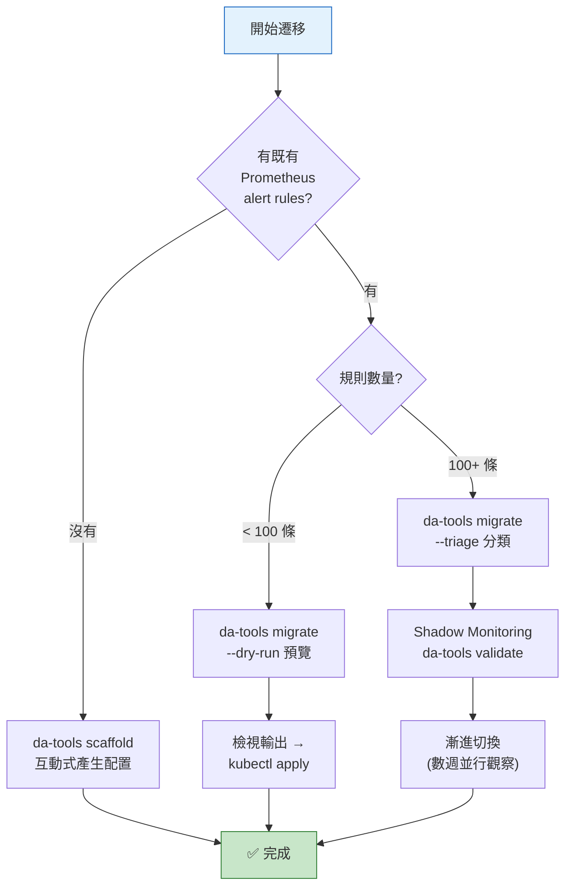

# Migration Guide — 遷移指南

> 從傳統 Prometheus 警報遷移至動態多租戶閾值架構。
> **其他文件：** [README](../README.md) (概覽) · [Architecture & Design](architecture-and-design.md) (技術深度) · [Rule Packs](../rule-packs/README.md) (規則包目錄)

> **⚠️ 遷移安全保證：** 本平台的遷移流程設計為**漸進式且可回退**。你的舊規則不需要一次性切換 — 新規則透過 `custom_` Prefix 與現有規則完全隔離，可在 Shadow Monitoring 並行驗證數週後再決定切換。任何階段都可以安全退回：Projected Volume 的 `optional: true` 機制確保刪除任何規則包不會影響 Prometheus 運行。

## 你在哪個階段？(Where Are You?)

| 你的情境 | 推薦路徑 | 工具 (`da-tools` 命令) | 預估時間 |
|----------|----------|------|---------|
| **全新租戶** — 首次接入 | 互動式產生 tenant config | `da-tools scaffold` | ~5 min |
| **已有傳統 alert rules** — 要遷移 | 自動轉換為三件套 | `da-tools migrate` | ~15 min |
| **大型租戶 (1000+ 條)** — 企業級遷移 | Triage → Shadow → 切換 | `da-tools migrate --triage` + `da-tools validate` | ~1-2 週 |
| **不支援的 DB 類型** — 需擴展 | 手動建立 Recording + Alert Rules | 參見 [§9](#9-進階擴展不支援的-db-類型) | ~30 min |
| **下架租戶/指標** | 安全移除 | `da-tools offboard` / `da-tools deprecate` | ~5 min |



## Zero-Friction 導入

本平台已預載 **9 個核心 Rule Pack** (MariaDB、Kubernetes、Redis、MongoDB、Elasticsearch、Oracle、DB2、ClickHouse、Platform 自我監控)，透過 Kubernetes **Projected Volume** 架構分散於獨立 ConfigMap 中。每個 Rule Pack 包含完整的三件套：Normalization Recording Rules + Threshold Normalization + Alert Rules。

**未部署 exporter 的 Rule Pack 不會產生 metrics，alert 也不會誤觸發 (near-zero cost)**。新增 exporter 後，只需配置 `_defaults.yaml` + tenant YAML，不需修改 Prometheus 設定。

---

## 目錄

1. [新租戶快速接入 — da-tools scaffold](#1-新租戶快速接入--da-tools-scaffold)
2. [既有規則遷移 — da-tools migrate](#2-既有規則遷移--da-tools-migrate)
3. [部署 threshold-exporter](#3-部署-threshold-exporter)
4. [實戰範例：五種遷移場景](#4-實戰範例五種遷移場景)
5. [Alertmanager 路由遷移](#5-alertmanager-路由遷移)
6. [遷移後驗證](#6-遷移後驗證)
7. [維度標籤 — 多 DB 類型支援](#7-維度標籤--多-db-類型支援)
8. [LLM 輔助手動轉換](#8-llm-輔助手動轉換)
9. [進階：擴展不支援的 DB 類型](#9-進階擴展不支援的-db-類型)
10. [FAQ](#10-faq)
11. [企業級遷移 — 大型租戶 (1000+ 條規則)](#11-企業級遷移--大型租戶-1000-條規則)
12. [Rule Pack 動態開關](#12-rule-pack-動態開關)
13. [下架流程 — Tenant 與 Rule/Metric](#13-下架流程--tenant-與-rulemetric)

---

## 1. 新租戶快速接入 — da-tools scaffold

對於全新租戶，使用互動式產生器即可在 30 秒內完成設定：

```bash
# CLI 模式 — 一行搞定
docker run --rm -v $(pwd)/output:/data ghcr.io/vencil/da-tools:1.0.0 \
  scaffold --tenant redis-prod --db redis,mariadb --non-interactive -o /data

# 查看支援的 DB 類型與指標
docker run --rm ghcr.io/vencil/da-tools:1.0.0 scaffold --catalog
```

> **已 clone 專案？** 也可直接執行 Python 腳本：
> ```bash
> python3 scripts/tools/scaffold_tenant.py --tenant redis-prod --db redis,mariadb -o output/
> python3 scripts/tools/scaffold_tenant.py --catalog
> # 互動模式（僅限本地執行）
> python3 scripts/tools/scaffold_tenant.py
> ```

### 工具產出

| 檔案 | 說明 |
|------|------|
| `_defaults.yaml` | 平台全域預設值 (含所有選擇的 DB 指標) |
| `<tenant>.yaml` | 租戶覆寫設定 (含三態範例) |
| `scaffold-report.txt` | 部署步驟與 Rule Pack 狀態摘要 |

所有核心 Rule Packs (包含自我監控) 已透過 Projected Volume 預載於平台，產出的 config 直接複製至 `conf.d/` 即可使用，無需額外掛載。

### 注入 K8s 叢集

scaffold 產出的檔案需注入 `threshold-config` ConfigMap，threshold-exporter 才能讀取：

```bash
# 方式 A (推薦): Helm values 覆寫 — OCI registry
#   將產出的 tenant config 合併至 values-override.yaml，再 helm upgrade
helm upgrade threshold-exporter \
  oci://ghcr.io/vencil/charts/threshold-exporter --version 1.0.1 \
  -n monitoring -f values-override.yaml

# 方式 B: 直接重建 ConfigMap (適合非 Helm 環境)
kubectl create configmap threshold-config \
  --from-file=conf.d/ \
  -n monitoring --dry-run=client -o yaml | kubectl apply -f -
```

ConfigMap 變更後，exporter 會在 1-3 分鐘內自動 hot-reload（K8s propagation + SHA-256 watcher），不需重啟 Pod。

> 詳細的三種注入方式（Helm / kubectl / GitOps）參見 [threshold-exporter README — K8s 部署與配置管理](../components/threshold-exporter/README.md#k8s-部署與配置管理)。

---

## 2. 既有規則遷移 — da-tools migrate

已有傳統 Prometheus alert rules 的團隊，使用自動轉換工具（v4 — AST + regex 雙引擎）：

```bash
# 預覽模式 — 不產出檔案，只顯示分析結果
docker run --rm -v $(pwd):/data ghcr.io/vencil/da-tools:1.0.0 \
  migrate /data/legacy-rules.yml --dry-run

# 正式轉換 — 輸出至 output/
docker run --rm -v $(pwd):/data ghcr.io/vencil/da-tools:1.0.0 \
  migrate /data/legacy-rules.yml -o /data/output

# Triage + Dry Run（企業級遷移推薦）
docker run --rm -v $(pwd):/data ghcr.io/vencil/da-tools:1.0.0 \
  migrate /data/legacy-rules.yml -o /data/output --dry-run --triage

# 強制使用 regex 模式 (不使用 AST 引擎)
docker run --rm -v $(pwd):/data ghcr.io/vencil/da-tools:1.0.0 \
  migrate /data/legacy-rules.yml --no-ast
```

> 工具預設使用 PromQL AST 引擎 (`promql-parser`) 精準辨識 metric name，自動注入 `custom_` 前綴與 `tenant` label。AST 解析失敗時自動降級至 regex 路徑，確保向後相容。

> **已 clone 專案？** 也可直接執行 Python 腳本，並支援互動模式：
> ```bash
> python3 scripts/tools/migrate_rule.py <legacy-rules.yml> --dry-run
> python3 scripts/tools/migrate_rule.py <legacy-rules.yml> -o my-output/
> # 互動模式 — 手動確認每個聚合模式（僅限本地執行）
> python3 scripts/tools/migrate_rule.py <legacy-rules.yml> --interactive
> ```

### 三種處理情境

| 情境 | 觸發條件 | 工具行為 |
|------|----------|----------|
| ✅ **完美解析** | 簡單的 `指標 > 數值` | 自動產出完整三件套 |
| ⚠️ **複雜表達式** | 含 `rate()`, `[5m]`, 數學運算 | 產出三件套 + ASCII 警告方塊提醒確認聚合模式 |
| 🚨 **無法解析** | `absent()`, `predict_linear()` 等 | 不產出，改給可交 LLM 的 Prompt |

### 工具輸出的「三件套」

轉換後產出 4 個檔案：

| 檔案 | 說明 |
|------|------|
| `tenant-config.yaml` | 租戶需填入 `db-*.yaml` 的 YAML 片段 |
| `platform-recording-rules.yaml` | 平台團隊的正規化 Recording Rules (合法 YAML，含 `groups:` boilerplate) |
| `platform-alert-rules.yaml` | 包含 `group_left` + `unless maintenance` + Auto-Suppression 的 Alert Rules |
| `migration-report.txt` | 轉換摘要與未解析規則的 LLM Prompt |

### 部署至 K8s 叢集

轉換後的三件套需分別部署至不同位置：

```bash
# 1. tenant-config.yaml → 合併至 threshold-config ConfigMap
#    將 tenant-config.yaml 內容合併至 conf.d/<tenant>.yaml，再更新 ConfigMap
kubectl create configmap threshold-config \
  --from-file=conf.d/ \
  -n monitoring --dry-run=client -o yaml | kubectl apply -f -

# 2. Recording Rules + Alert Rules → 建立為獨立 ConfigMap，掛載至 Prometheus
kubectl create configmap prometheus-rules-custom \
  --from-file=platform-recording-rules.yaml \
  --from-file=platform-alert-rules.yaml \
  -n monitoring --dry-run=client -o yaml | kubectl apply -f -

# 3. 確認 Prometheus Projected Volume 已包含此 ConfigMap
#    若使用 Helm，在 values.yaml 中加入新 source；
#    若已有 custom rule pack slot，ConfigMap 建立後自動掛載
```

> **Helm 使用者**：也可將 recording/alert rules 整合至 Helm chart 的 values 中統一管理。詳見 [threshold-exporter README](../components/threshold-exporter/README.md#k8s-部署與配置管理)。

### 聚合模式智能猜測

對於複雜表達式，工具會依據 6 條啟發規則自動猜測 `sum` 或 `max`。猜測的 recording rule 會帶有醒目的 ASCII 警告方塊：

```
# ============================================================
# 🚨🚨🚨 [AI 智能猜測注意] 🚨🚨🚨
# ============================================================
# 以下 recording rule 的聚合模式為 AI 自動猜測: sum
# ⚠️  請在複製貼上前確認:
#   - 聚合模式 sum 是否正確? (sum=叢集總量, max=單點瓶頸)
#   - 如不確定，請用 --interactive 模式重新執行
# ============================================================
```

### Auto-Suppression (自動抑制)

當輸入的規則同時包含 warning 和 critical 版本（相同 base metric key），工具會自動配對並為 warning alert 注入第二層 `unless` 子句。這確保 critical 觸發時抑制 warning，避免重複告警：

```yaml
# 轉換前 (兩條獨立傳統規則)
- alert: HighConnections       # severity: warning, expr: connections > 100
- alert: HighConnectionsCrit   # severity: critical, expr: connections > 200

# 轉換後 (warning 自動帶 auto-suppression)
- alert: CustomHighConnections
  expr: |
    ( tenant:custom_connections:max > on(tenant) group_left tenant:alert_threshold:custom_connections )
    unless on(tenant) (user_state_filter{filter="maintenance"} == 1)
    unless on(tenant)                           # ← Auto-Suppression
    ( tenant:custom_connections:max > on(tenant) group_left tenant:alert_threshold:custom_connections_critical )
```

配對邏輯：以 tenant_config 的 metric key 為基礎，warning key `custom_X` 對應 critical key `custom_X_critical`。若只有單一嚴重度則不注入。

---

## 3. 部署 threshold-exporter

> **Config 分離原則**：Helm chart 和 Docker image **均不包含測試租戶資料**。`values.yaml` 的 `thresholdConfig.tenants` 預設為空。你需要透過 values-override 或 GitOps 注入自身的租戶設定（參見 [§1 注入 K8s 叢集](#注入-k8s-叢集)）。開發測試環境使用 `environments/local/threshold-exporter.yaml`，其中已包含 db-a、db-b 範例租戶。

### 選項 A (推薦): OCI Registry

```bash
# 生產部署 — 從 OCI registry 安裝 chart，搭配自訂 values-override 注入租戶設定
helm upgrade --install threshold-exporter \
  oci://ghcr.io/vencil/charts/threshold-exporter --version 1.0.1 \
  -n monitoring --create-namespace \
  -f values-override.yaml
```

> 不需要 clone repo 或指定 image tag——chart 內已綁定對應版本的 image。

### 選項 B: 本地建置

```bash
cd components/threshold-exporter/app
docker build -t threshold-exporter:dev .
kind load docker-image threshold-exporter:dev --name dynamic-alerting-cluster
make component-deploy COMP=threshold-exporter ENV=local
```

### 驗證部署

```bash
kubectl get pods -n monitoring -l app=threshold-exporter
curl -s http://localhost:8080/metrics | grep user_threshold
curl -s http://localhost:8080/api/v1/config | python3 -m json.tool
```

### 在 K8s 叢集內使用 da-tools

當 threshold-exporter 部署在客戶的 K8s 環境中，da-tools 也可以直接作為 K8s Job 運行，省去 port-forward 和本地 Docker 環境的設定：

```yaml
apiVersion: batch/v1
kind: Job
metadata:
  name: da-tools-scaffold
  namespace: monitoring
spec:
  template:
    spec:
      containers:
        - name: da-tools
          image: ghcr.io/vencil/da-tools:1.0.0
          args:
            - scaffold
            - --tenant
            - db-c
            - --db
            - mariadb,redis
            - --non-interactive
            - -o
            - /output
          volumeMounts:
            - name: output
              mountPath: /output
      volumes:
        - name: output
          emptyDir: {}
      restartPolicy: Never
  backoffLimit: 0
```

```bash
# 取回 Job 產出
kubectl cp monitoring/da-tools-scaffold-<pod>:/output ./scaffold-output/

# 將產出注入 threshold-config ConfigMap
kubectl create configmap threshold-config \
  --from-file=conf.d/ \
  -n monitoring --dry-run=client -o yaml | kubectl apply -f -
```

叢集內 da-tools 可透過 K8s Service 直接存取 Prometheus，適合 `check-alert`、`validate`、`baseline` 等需要 Prometheus API 的命令：

```bash
# 環境變數設定 Prometheus 端點
env:
  - name: PROMETHEUS_URL
    value: "http://prometheus.monitoring.svc.cluster.local:9090"
```

> 長期運行的 Shadow Monitoring Job 範例參見 [§11 企業級遷移 Phase B](#11-企業級遷移--大型租戶-1000-條規則)。

---

## 4. 實戰範例：五種遷移場景

以 Percona MariaDB Alert Rules 為範本，示範完整遷移路徑。

### 4.1 基本數值比較 (連線數)

**傳統寫法**：
```yaml
- alert: MySQLTooManyConnections
  expr: mysql_global_status_threads_connected > 100
  for: 5m
  labels: { severity: warning }
```

**遷移三件套**：
```yaml
# 1. Recording Rule (平台)
- record: tenant:mysql_threads_connected:max
  expr: max by(tenant) (mysql_global_status_threads_connected)

# 2. Alert Rule (平台) — group_left + unless maintenance
- alert: MariaDBHighConnections
  expr: |
    (
      tenant:mysql_threads_connected:max
      > on(tenant) group_left
      tenant:alert_threshold:connections
    )
    unless on(tenant) (user_state_filter{filter="maintenance"} == 1)
  for: 5m
  labels: { severity: warning }

# 3. Tenant Config (租戶)
tenants:
  db-a:
    mysql_connections: "100"
```

### 4.2 多層嚴重度 (Warning + Critical)

**傳統寫法 (兩條規則)**：
```yaml
- alert: MySQLTooManyConnections
  expr: mysql_global_status_threads_connected > 100
  labels: { severity: warning }
- alert: MySQLTooManyConnectionsCritical
  expr: mysql_global_status_threads_connected > 150
  labels: { severity: critical }
```

**遷移後 — 租戶只需**：
```yaml
tenants:
  db-a:
    mysql_connections: "100"            # warning 閾值
    mysql_connections_critical: "150"   # _critical → 自動產生 critical alert
```

平台 alert rule 自動處理降級邏輯：critical 觸發時 warning 被 `unless` 抑制。

### 4.3 Replication Lag (最弱環節)

**傳統寫法**：
```yaml
- alert: MySQLSlaveReplicationLag
  expr: mysql_slave_status_seconds_behind_master > 30
  for: 5m
  labels: { severity: warning }
```

**遷移三件套**：
```yaml
# Recording Rule — max (最弱環節：最落後的 slave)
- record: tenant:mysql_slave_lag:max
  expr: max by(tenant) (mysql_slave_status_seconds_behind_master)

# Alert Rule
- alert: MariaDBSlaveLag
  expr: |
    (
      tenant:mysql_slave_lag:max
      > on(tenant) group_left
      tenant:alert_threshold:slave_lag
    )
    unless on(tenant) (user_state_filter{filter="maintenance"} == 1)
  for: 5m

# Tenant Config — 三態示範
tenants:
  db-a:
    mysql_slave_lag: "30"
  db-b:
    mysql_slave_lag: "disable"   # db-b 沒有 replica，停用
```

### 4.4 Rate 類指標 (慢查詢)

**傳統寫法**：
```yaml
- alert: MySQLHighSlowQueries
  expr: rate(mysql_global_status_slow_queries[5m]) > 0.1
  for: 5m
  labels: { severity: warning }
```

**遷移三件套**：
```yaml
# Recording Rule — sum (叢集總量：慢查詢看整體)
- record: tenant:mysql_slow_queries:rate5m
  expr: sum by(tenant) (rate(mysql_global_status_slow_queries[5m]))

# Alert Rule
- alert: MariaDBHighSlowQueries
  expr: |
    (
      tenant:mysql_slow_queries:rate5m
      > on(tenant) group_left
      tenant:alert_threshold:slow_queries
    )
    unless on(tenant) (user_state_filter{filter="maintenance"} == 1)
  for: 5m

# Tenant Config
tenants:
  db-a:
    mysql_slow_queries: "0.1"
```

### 4.5 百分比計算類 (Buffer Pool)

**傳統寫法**：
```yaml
- alert: MySQLInnoDBBufferPoolFull
  expr: |
    mysql_global_status_innodb_buffer_pool_pages_data
    / mysql_global_status_innodb_buffer_pool_pages_total * 100 > 95
  for: 10m
  labels: { severity: warning }
```

**遷移三件套**：
```yaml
# Recording Rule — 百分比計算在此完成，上層只比純數字
- record: tenant:mysql_innodb_buffer_pool:percent
  expr: |
    max by(tenant) (mysql_global_status_innodb_buffer_pool_pages_data)
    /
    max by(tenant) (mysql_global_status_innodb_buffer_pool_pages_total)
    * 100

# Alert Rule
- alert: MariaDBInnoDBBufferPoolHigh
  expr: |
    (
      tenant:mysql_innodb_buffer_pool:percent
      > on(tenant) group_left
      tenant:alert_threshold:innodb_buffer_pool
    )
    unless on(tenant) (user_state_filter{filter="maintenance"} == 1)
  for: 10m

# Tenant Config
tenants:
  db-a:
    mysql_innodb_buffer_pool: "95"
```

---

## 5. Alertmanager 路由遷移

### 傳統 (基於 instance)

```yaml
route:
  group_by: ['alertname', 'instance']
  routes:
    - matchers: [instance=~"db-a-.*"]
      receiver: "team-a-slack"
```

### 遷移後 (基於 tenant)

```yaml
route:
  group_by: ['tenant', 'alertname']
  routes:
    - matchers: [tenant="db-a"]
      receiver: "team-a-slack"
      routes:
        - matchers: [severity="critical"]
          receiver: "team-a-pagerduty"
```

以 `tenant` 為第一維度分派，支援嵌套路由實現嚴重度分層。

---

## 6. 遷移後驗證

```bash
# 確認閾值正確輸出
curl -s http://localhost:8080/metrics | grep 'user_threshold{.*connections'

# 確認 Alert 狀態
docker run --rm --network=host ghcr.io/vencil/da-tools:1.0.0 \
  check-alert MariaDBHighConnections db-a

# 租戶健康總檢（需叢集存取，僅限本地 Python 執行）
python3 scripts/tools/diagnose.py db-a
```

> **已 clone 專案？** `check_alert.py` 也可直接執行：
> ```bash
> python3 scripts/tools/check_alert.py MariaDBHighConnections db-a
> ```

### Checklist

- [ ] 每個遷移的 alert 在正常負載下為 `inactive`
- [ ] 刻意觸發至少一條 alert，確認 `firing` → Alertmanager → 通知管道正常
- [ ] 測試三態：修改閾值 → hot-reload 生效 → 設 `disable` → alert 消失
- [ ] 確認 `_critical` 多層嚴重度的降級邏輯
- [ ] Alertmanager routing 以 `tenant` 標籤正確分派

---

## 7. 維度標籤 — 多 DB 類型支援

當平台支援 Redis、ES、MongoDB 等多種 DB 時，同一指標可依「維度」設定不同閾值。

### 語法

```yaml
tenants:
  redis-prod:
    redis_queue_length: "1000"                              # 全域預設
    "redis_queue_length{queue=\"order-processing\"}": "100"  # 嚴格
    "redis_queue_length{queue=\"analytics\"}": "5000"        # 寬鬆
    "redis_queue_length{queue=\"temp\"}": "disable"          # 停用
```

多重 label：
```yaml
    "mongodb_collection_count{database=\"orders\",collection=\"transactions\"}": "10000000"
```

### 設計約束

| 約束 | 說明 |
|------|------|
| **YAML 需加引號** | 含 `{` 的 key 必須用雙引號包裹 |
| **不支援 `_critical` 後綴** | 改用 `"value:severity"` 語法，如 `"500:critical"` |
| **Tenant-only** | 維度 key 不繼承 `defaults`，僅允許在租戶設定中 |
| **三態仍適用** | 數值=Custom, 省略=Default (僅基本 key), `"disable"`=停用 |

### 平台團隊 PromQL 適配 (重要)

維度 label 必須出現在 Recording Rule 的 `by()` 和 Alert Rule 的 `on()` 中：

```yaml
# Recording Rule — 必須 by(tenant, queue)
- record: tenant:redis_queue_length:max
  expr: max by(tenant, queue) (redis_queue_length)

# Threshold Normalization — 必須 by(tenant, queue)
- record: tenant:alert_threshold:redis_queue_length
  expr: max by(tenant, queue) (user_threshold{metric="redis_queue_length"})

# Alert Rule — 必須 on(tenant, queue) group_left
- alert: RedisQueueTooLong
  expr: |
    (
      tenant:redis_queue_length:max
      > on(tenant, queue) group_left
      tenant:alert_threshold:redis_queue_length
    )
    unless on(tenant) (user_state_filter{filter="maintenance"} == 1)
```

### 參考範本

`components/threshold-exporter/config/conf.d/examples/` 目錄：

| 檔案 | DB 類型 | 維度範例 |
|------|---------|----------|
| `redis-tenant.yaml` | Redis | queue, db |
| `elasticsearch-tenant.yaml` | Elasticsearch | index, node |
| `mongodb-tenant.yaml` | MongoDB | database, collection |
| `_defaults-multidb.yaml` | 多 DB 全域預設 | (無維度) |

---

## 8. LLM 輔助手動轉換

當 `da-tools migrate` 遇到無法解析的規則，它會產出可直接交 LLM 的 Prompt。你也可以用以下 System Prompt 批量轉換：

```
你是一位 SRE 專家，負責將傳統 Prometheus Alert Rules 遷移到「動態多租戶閾值架構」。

在新架構中：
- 所有寫死的門檻值必須抽離成 YAML 鍵值對
- Metric key 格式：<component>_<metric>（如 mysql_connections）
- 多層嚴重度：用 _critical 後綴（如 mysql_connections_critical: "150"）
- 停用：值設為 "disable"

請完成以下工作：
1. 抽取閾值 → threshold-config.yaml 格式
2. 提供正規化 Recording Rule（標註 sum/max 選擇理由）
3. 提供包含 group_left + unless maintenance 的 Alert Rule
4. 標記需要平台額外處理的項目（rate, predict_linear 等）
```

---

## 9. 進階：擴展不支援的 DB 類型

v1.0.0 已預載 9 個 Rule Pack，涵蓋 MariaDB、Kubernetes、Redis、MongoDB、Elasticsearch、Oracle、DB2、ClickHouse 及 Platform 自我監控。若需支援尚無 Rule Pack 的 DB 類型，需手動建立正規化層。

### 正規化命名規範

```
tenant:<component>_<metric>:<aggregation_function>
```

| 原始指標 | 正規化後 | 說明 |
|----------|----------|------|
| `mysql_global_status_threads_connected` | `tenant:mysql_threads_connected:max` | 單點上限，取 max |
| `rate(mysql_global_status_slow_queries[5m])` | `tenant:mysql_slow_queries:rate5m` | 叢集加總 rate |

### 聚合模式選擇 — Max vs. Sum

決策矩陣：
```
問自己：「一個節點超標，其他節點正常，是否代表有問題？」
  ├── 是 → max by(tenant) (最弱環節)
  └── 否 → sum by(tenant) (叢集總量)
```

**max by(tenant)** — 有「單點物理上限」的資源 (連線數上限、磁碟空間、replication lag)。

**sum by(tenant)** — 評估「整體系統負載」(慢查詢、流量、CPU 使用)。

### 建立步驟

1. 建立 Recording Rule (正規化層)
2. 建立 Threshold Normalization Rule
3. 建立 Alert Rule (含 `group_left` + `unless maintenance`)
4. 建立獨立 ConfigMap (`configmap-rules-<db>.yaml`)
5. 在 `deployment-prometheus.yaml` 的 projected volume 中加入新 source
6. 在 `_defaults.yaml` 加入預設閾值
7. 用 `da-tools scaffold` 產生 tenant config

完整 Rule Pack 結構參見 [rule-packs/README.md](../rule-packs/README.md)。

---

## 10. FAQ

### Q: 修改 threshold-config 後多久生效？

Exporter 每 30 秒 reload 一次，K8s ConfigMap propagation 約 1-2 分鐘。預期 1-3 分鐘。

### Q: 新增一種指標需要改哪些東西？

已支援的 DB 類型 (有 Rule Pack)：只需在 `_defaults.yaml` 加預設值 + 租戶 YAML 加閾值。不支援的 DB：需額外建立 Recording Rule + Alert Rule + ConfigMap。

### Q: 遷移過渡期可以新舊並存嗎？

可以。新架構的 alert 使用不同 alertname，不會衝突。建議先部署新 alert 觀察，確認行為一致後再移除舊 rules。

### Q: 維度 key 可以設定在 defaults 裡嗎？

不行。維度 key 是 tenant-only 功能，因為每個租戶的 queue/index/database 都不同，全域預設沒有意義。

### Q: 維度 key 怎麼指定 critical？

使用 `"value:severity"` 語法：`"redis_queue_length{queue=\"orders\"}": "500:critical"`。

### Q: 如何確認 hot-reload 成功？

```bash
kubectl logs -n monitoring -l app=threshold-exporter --tail=20
# 預期: "Config loaded (directory): X defaults, Y state_filters, Z tenants, N resolved thresholds, M resolved state filters"
```

---

## 11. 企業級遷移 — 大型租戶 (1000+ 條規則)

對於擁有 1600+ 條規則的大型租戶，建議採用以下三階段遷移策略：

### Phase A: Triage 分析

```bash
# 產出 CSV 分桶報告 — 在 Excel 中批次決策
docker run --rm -v $(pwd):/data ghcr.io/vencil/da-tools:1.0.0 \
  migrate /data/legacy-rules.yml --triage -o /data/triage_output/
```

工具自動將規則分為四桶：

| Triage Action | 說明 | 建議處理 |
|---------------|------|----------|
| `auto` | 簡單表達式，可自動轉換 | 直接採用 |
| `review` | 複雜表達式，已猜測聚合模式 | 在 CSV 中確認 |
| `skip` | 無法自動轉換 | 交 LLM 或手動處理 |
| `use_golden` | 字典比對到黃金標準 | 直接用 `da-tools scaffold` 設定閾值 |

### Phase B: 轉換 + Shadow Monitoring

```bash
# 1. 正式轉換 (自動帶 custom_ 前綴)
docker run --rm -v $(pwd):/data ghcr.io/vencil/da-tools:1.0.0 \
  migrate /data/legacy-rules.yml -o /data/migration_output/

# 2. 部署新規則 (帶 shadow label，不觸發通知)
kubectl apply -f migration_output/platform-recording-rules.yaml
kubectl apply -f migration_output/platform-alert-rules.yaml

# 3. 在 Alertmanager 攔截 shadow 警報
# 設定 route: matchers: [migration_status="shadow"] → null receiver

# 4. 持續比對新舊 Recording Rule 數值
#    叢集內 (推薦): 透過 K8s Service 存取 Prometheus
docker run --rm --network=host \
  -v $(pwd)/migration_output:/data \
  -e PROMETHEUS_URL=http://prometheus.monitoring.svc.cluster.local:9090 \
  ghcr.io/vencil/da-tools:1.0.0 \
  validate --mapping /data/prefix-mapping.yaml \
  --watch --interval 60 --rounds 1440

#    本地開發: 透過 port-forward
kubectl port-forward svc/prometheus 9090:9090 -n monitoring &
docker run --rm --network=host \
  -v $(pwd)/migration_output:/data \
  ghcr.io/vencil/da-tools:1.0.0 \
  validate --mapping /data/prefix-mapping.yaml \
  --watch --interval 60 --rounds 1440
```

> **已 clone 專案？** 也可直接用 Python 腳本：
> ```bash
> python3 scripts/tools/migrate_rule.py legacy-rules.yml -o migration_output/
> python3 scripts/tools/validate_migration.py \
>   --mapping migration_output/prefix-mapping.yaml \
>   --prometheus http://localhost:9090 --watch --interval 60 --rounds 1440
> ```

**長期 Shadow Monitoring (K8s Job)**：大型客戶建議將驗證腳本包成 Job，在叢集內持續運行 1-2 週：

```yaml
apiVersion: batch/v1
kind: Job
metadata:
  name: migration-validator
  namespace: monitoring
spec:
  template:
    spec:
      containers:
        - name: validator
          image: ghcr.io/vencil/da-tools:1.0.0
          command:
            - da-tools
            - validate
            - --mapping
            - /config/prefix-mapping.yaml
            - --watch
            - --interval
            - "300"
            - --rounds
            - "4032"    # 每 5 分鐘一次，共 14 天
            - -o
            - /output/
          env:
            - name: PROMETHEUS_URL
              value: http://prometheus.monitoring.svc.cluster.local:9090
          volumeMounts:
            - name: config
              mountPath: /config
            - name: output
              mountPath: /output
      volumes:
        - name: config
          configMap:
            name: migration-config
        - name: output
          emptyDir: {}
      restartPolicy: Never
```

### Phase C: 切換與收斂

運行 1-2 週，`da-tools validate` 持續比對所有規則對的數值輸出。確認所有 mismatch 均已調查並排除後：

1. 移除舊規則
2. 拿掉新規則的 `migration_status: shadow` label
3. 逐步啟用黃金標準 Rule Pack，替代 `custom_` 規則
4. 參考 `prefix-mapping.yaml` 對照收斂

### Metric Dictionary 自動比對

`da-tools migrate` (v4) 內建啟發式字典 (`metric-dictionary.yaml`)，自動比對傳統指標與黃金標準：

```
📖 MySQLTooManyConnections: 建議改用黃金標準 MariaDBHighConnections (da-tools scaffold)
```

平台團隊可直接編輯 `scripts/tools/metric-dictionary.yaml` 擴充字典，不需改 Python code。

---

## 12. Rule Pack 動態開關

所有 9 個 Rule Pack ConfigMap 在 Projected Volume 中設定了 `optional: true`，允許選擇性卸載。

### 卸載不需要的 Rule Pack

```bash
# 大型客戶自帶 MariaDB 規則，關閉黃金標準避免衝突
kubectl delete cm prometheus-rules-mariadb -n monitoring

# Prometheus 下次 reload 時會優雅地忽略缺少的 ConfigMap
# 不需要重啟 Prometheus
```

### 重新啟用

```bash
# 從 rule-packs/ 目錄重新建立 ConfigMap
kubectl create configmap prometheus-rules-mariadb \
  --from-file=rule-pack-mariadb.yaml=rule-packs/rule-pack-mariadb.yaml \
  -n monitoring
```

### 典型場景

| 客戶類型 | 建議 Rule Pack 設定 |
|----------|---------------------|
| 全新租戶 | 全部保留 (預設) |
| 自帶 MariaDB 規則 | 關閉 `prometheus-rules-mariadb` |
| 只用 Redis | 關閉 MariaDB, MongoDB, Elasticsearch |
| 全部自帶 | 只保留 `prometheus-rules-platform` (自我監控) |

---

## 13. 下架流程 — Tenant 與 Rule/Metric

### Tenant 下架

```bash
# 預檢模式 — 確認無外部依賴
docker run --rm -v $(pwd)/conf.d:/data/conf.d ghcr.io/vencil/da-tools:1.0.0 \
  offboard db-a

# 確認後執行
docker run --rm -v $(pwd)/conf.d:/data/conf.d ghcr.io/vencil/da-tools:1.0.0 \
  offboard db-a --execute
```

Pre-check 項目：設定檔存在性、跨檔案引用掃描、已設定指標清單。

下架後效果：
- threshold-exporter 下次 reload (30s) 自動清除閾值
- Prometheus 下次 scrape 時向量消失
- 所有相關 Alert 自動解除
- **不影響其他 Tenant**

### Rule/Metric 下架

```bash
# 預覽模式
docker run --rm -v $(pwd)/conf.d:/data/conf.d ghcr.io/vencil/da-tools:1.0.0 \
  deprecate mysql_slave_lag

# 執行 (修改檔案)
docker run --rm -v $(pwd)/conf.d:/data/conf.d ghcr.io/vencil/da-tools:1.0.0 \
  deprecate mysql_slave_lag --execute

# 批次處理
docker run --rm -v $(pwd)/conf.d:/data/conf.d ghcr.io/vencil/da-tools:1.0.0 \
  deprecate mysql_slave_lag mysql_innodb_buffer_pool --execute
```

> **已 clone 專案？** 也可直接用 Python 腳本：
> ```bash
> python3 scripts/tools/offboard_tenant.py db-a [--execute]
> python3 scripts/tools/deprecate_rule.py mysql_slave_lag [--execute]
> ```

三步自動化：
1. `_defaults.yaml` 中設為 `"disable"`
2. 掃描清除所有 tenant config 中的殘留
3. 產出 ConfigMap 清理指引 (下個 Release Cycle 手動執行)
