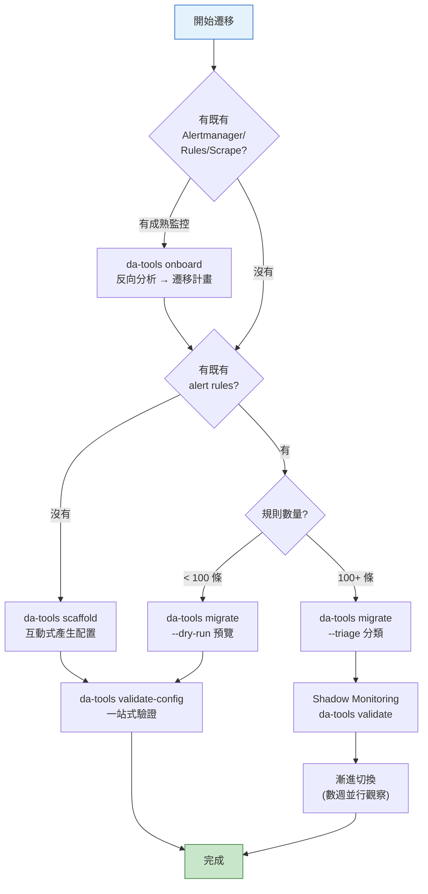

# Migration Guide — 遷移指南

> **Language / 語言：** **中文 (Current)** | [English](./migration-guide.en.md)

> 從傳統 Prometheus 警報遷移至動態多租戶閾值架構的**任務分流 hub**。本文件用決策表把你導到正確路徑，工具級指令深度見 [cli-reference.md](cli-reference.md)，端到端零停機方案見 [漸進式遷移 Playbook](scenarios/incremental-migration-playbook.md)。
>
> **第一次遷移？** 先讀 [漸進式遷移 Playbook](scenarios/incremental-migration-playbook.md)；多系統同步換（Prom→VM + 規則 + AM）走 [Multi-System Migration Playbook](scenarios/multi-system-migration-playbook.md)。
>
> **⚠️ 遷移安全保證：** 流程**漸進式且可回退**。`custom_` Prefix 與舊規則完全隔離；Projected Volume `optional: true` 允許隨時卸載任何規則包不影響 Prometheus 運行。
>
> **提示：** 所有 `da-tools` 指令可透過 Docker 直接執行（`docker run --rm --network=host ghcr.io/vencil/da-tools:v2.9.0 <cmd>`），以下範例用簡寫 `da-tools <cmd>`。

> **受眾**：租戶技術窗口、Platform Engineer / DevOps / SRE、Domain Expert（DBA）

**如何讀**（讀者隨時可切換，且常多人同看一份）：

| 你是… | 先看 | 想深入再看 |
|---|---|---|
| 租戶技術窗口 | [你在哪個階段](#你在哪個階段where-are-you)、[§3 產生設定](#3-產生租戶設定da-tools-scaffold)、[§9 維度標籤](#9-維度標籤-多-db-類型支援) | [§7 驗證](#7-遷移後驗證)、[§12 FAQ](#12-faq) |
| Platform / DevOps | 核心流程 [§1–§7](#核心遷移流程照順序做)（照順序） | 參考帶、進階帶 |
| 企業 / SRE（大型遷移） | [§2 反向分析](#2-反向分析既有監控da-tools-onboard)、[§13 企業級遷移](#13-企業級遷移-大型租戶1000-條規則) | [Shadow Monitoring SOP](shadow-monitoring-sop.md) |
| Domain Expert（DBA） | [§8 範例](#8-五種遷移場景範例)、[§9 維度](#9-維度標籤-多-db-類型支援)、[§11 擴展](#11-擴展不支援的-db-類型) | [§4 轉換](#4-轉換既有規則da-tools-migrate) |

> **多人同看**：先共享「你在哪個階段」決策表定位，再各自走自己的帶。本文件分三帶——**核心流程（照順序做）/ 參考（按需查）/ 進階與營運**。

## 你在哪個階段？(Where Are You?)

| 你的情境 | 推薦路徑 | 工具 (`da-tools` 命令) | 預估時間 |
|----------|----------|------|---------|
| **全新租戶** — 首次接入 | 互動式產生 tenant config | `da-tools scaffold` | ~5 min |
| **既有成熟監控體系** — 企業反向分析 | 自動生成遷移計畫 | `da-tools onboard` | ~10 min |
| **已有傳統 alert rules** — 要遷移 | 自動轉換為三件套 | `da-tools migrate` | ~15 min |
| **大型租戶 (1000+ 條)** — 企業級遷移 | Triage → Shadow → 切換 | `da-tools migrate --triage` + `da-tools validate` | ~1-2 週 |
| **3-system 同時換**（換 storage backend Prom→VM **加上** 規則 **加上** AM routing） | 5-Phase invariants-driven model | 走 [Multi-System Migration Playbook](scenarios/multi-system-migration-playbook.md) | 13 週估算（真實常 ~27 週） |
| **Cutover 後規則演化**（`custom_*` → golden、Rule Pack 升版） | Lifecycle pattern，不是一次性事件 | 走 [Staged Adoption Lifecycle](scenarios/staged-adoption-guide.md) | 持續 |
| **不支援的 DB 類型** — 需擴展 | 手動建立 Recording + Alert Rules | 參見 [§11](#11-擴展不支援的-db-類型) | ~30 min |
| **下架租戶/指標** | 安全移除 | `da-tools offboard` / `da-tools deprecate` | ~5 min |
| **遷移過程出狀況** | symptom-keyed runbook | → [Migration Troubleshooting Checklist](integration/troubleshooting-checklist.md) | — |


```mermaid
flowchart TD
    Start["開始遷移"] --> Q0{"有既有<br/>Alertmanager/<br/>Rules/Scrape?"}
    Q0 -->|"有成熟監控"| S0["da-tools onboard<br/>反向分析 → 遷移計畫"]
    Q0 -->|"沒有"| Q1{"有既有<br/>alert rules?"}
    S0 --> Q1
    Q1 -->|"沒有"| S1["da-tools scaffold<br/>互動式產生配置"]
    Q1 -->|"有"| Q2{"規則數量?"}
    Q2 -->|"< 100 條"| S2["da-tools migrate<br/>--dry-run 預覽"]
    Q2 -->|"100+ 條"| S3["da-tools migrate<br/>--triage 分類"]
    S2 --> V["da-tools validate-config<br/>一站式驗證"]
    S3 --> S4["Shadow Monitoring<br/>da-tools validate"]
    S4 --> S5["漸進切換<br/>(數週並行觀察)"]
    S1 --> V
    V --> Done["完成"]
    S5 --> Done

    style Done fill:#c8e6c9,stroke:#2e7d32
    style Start fill:#e3f2fd,stroke:#1565c0
```

> **3-system 同步換？** 場景 invariants 與 13 週時序見 [Multi-System Migration Playbook](scenarios/multi-system-migration-playbook.md)。

---

## 核心遷移流程（照順序做）

從零到 cutover 的標準路徑：**安裝 → 反向分析（如有）→ 產生 / 轉換設定 → 部署 → 路由 → 驗證**。

> **為何低摩擦**：平台已預載 **16 個 Rule Pack ConfigMap**（MariaDB、PostgreSQL、Kubernetes、Redis、MongoDB、Elasticsearch、Oracle、DB2、ClickHouse、Kafka、RabbitMQ、JVM、Nginx、Operational、Platform 自我監控），透過 **Projected Volume** 分散管理。**未部署 exporter 的 Rule Pack 不會產生 metrics、alert 也不會誤觸發**——你只需配置 `_defaults.yaml` + tenant YAML。詳見 [design/rule-packs.md](design/rule-packs.md)。

### 1. 安裝 Migration Toolkit

開始遷移前先安裝工具集。三條交付路徑（Docker / static binary 6-arch / air-gapped tar）任選一條：

```bash
# 路徑 A：Docker pull from ghcr.io（最簡單）
docker pull ghcr.io/vencil/da-tools:v2.9.0

# 路徑 B：下載靜態 binary 到 PATH
curl -fsSLo da-guard.tar.gz https://github.com/vencil/Dynamic-Alerting-Integrations/releases/download/tools/v2.9.0/da-guard-linux-amd64.tar.gz
tar xzf da-guard.tar.gz && sudo install -m 0755 da-guard-linux-amd64 /usr/local/bin/da-guard
```

完整指令、hash 驗證、air-gapped 流程、cosign keyless 驗章：見 [`migration-toolkit-installation.md`](migration-toolkit-installation.md)。

### 2. 反向分析既有監控（da-tools onboard）

對於已有成熟監控體系的企業，`da-tools onboard` **反向分析** Alertmanager / Prometheus rules / scrape config，自動產出遷移計畫（沒有既有監控可跳過此步）：

- 輸出 `extracted-tenants.yaml`（自動識別租戶 + receiver 映射）
- 輸出 `migration-plan.csv`（規則分桶：`auto` / `review` / `skip` / `use_golden`）
- 輸出 `relabel-config-suggestions.txt`（Tenant-NS mapping 用的 scrape relabel）

完整 flag 矩陣 + scrape config 解析細節：[`cli-reference.md#onboard`](cli-reference.md#onboard)。產出檔可直接餵 `scaffold` / `migrate`，加速企業級上線。

### 3. 產生租戶設定（da-tools scaffold）

全新租戶用互動式產生器 30 秒完成設定：

```bash
da-tools scaffold --tenant redis-prod --db redis,mariadb --non-interactive -o /data
```

輸出：`_defaults.yaml` + `<tenant>.yaml` + `scaffold-report.txt`（+ `relabel-config-snippet.yaml` 當 `--namespaces` 指定時）。完整 flag、`--routing-receiver`、`--catalog`、`--from-onboard <hints>` pipeline：[`cli-reference.md#scaffold`](cli-reference.md#scaffold)。

注入 ConfigMap 的三種方式（Helm / kubectl / GitOps）：[threshold-exporter README — K8s 部署](https://github.com/vencil/Dynamic-Alerting-Integrations/blob/main/components/threshold-exporter/README.md#6-部署)。

### 4. 轉換既有規則（da-tools migrate）

已有傳統 Prometheus alert rules 的團隊，用自動轉換工具（v4 — AST + regex 雙引擎，PromQL AST 解析失敗時降級至 regex）：

```bash
da-tools migrate /data/legacy-rules.yml --dry-run            # 預覽
da-tools migrate /data/legacy-rules.yml -o /data/output      # 正式轉換
da-tools migrate /data/legacy-rules.yml --triage -o /data/output  # 大型租戶分桶
```

工具自動處理：

- **三種輸入情境**：`✅ 完美解析` / `⚠️ 複雜表達式 (含警告方塊)` / `🚨 無法解析 (產出 LLM Prompt)`
- **三件套輸出**：`tenant-config.yaml` + `platform-recording-rules.yaml` + `platform-alert-rules.yaml` + `migration-report.txt`
- **Auto-Suppression**：同 metric 的 warning + critical 自動配對，warning alert 注入第二層 `unless` 子句
- **聚合模式智能猜測**：6 條啟發規則自動猜 `sum` / `max`，帶 ASCII 警告方塊提示確認

AST 引擎深度（為什麼 `promql-parser` 比 regex 準）+ 完整啟發規則 + Auto-Suppression 配對邏輯：[`migration-engine.md`](migration-engine.md)。CLI flag 矩陣：[`cli-reference.md#migrate`](cli-reference.md#migrate)。三件套部署位置（ConfigMap 合併 vs 獨立掛載）：[threshold-exporter README](https://github.com/vencil/Dynamic-Alerting-Integrations/blob/main/components/threshold-exporter/README.md#6-部署)。

### 5. 部署 threshold-exporter

> **Config 分離原則**：Helm chart 與 Docker image **均不含測試租戶資料**。`values.yaml` 的 `thresholdConfig.tenants` 預設為空，需透過 values-override / GitOps 注入自身設定。開發測試用 `environments/local/threshold-exporter.yaml`（已含 db-a / db-b 範例）。

三種部署選項：

- **選項 A（推薦）**：OCI Registry — `helm upgrade --install threshold-exporter oci://ghcr.io/vencil/charts/threshold-exporter --version 2.9.0 -n monitoring -f values-override.yaml`
- **選項 B**：本地建置 — `docker build` + `kind load` + `make component-deploy`
- **選項 C**：Operator CRD 路徑 — `da-tools operator-generate`，取代 ConfigMap 掛載（已安裝 kube-prometheus-stack 環境適用）

兩種路徑的詳細比較與決策指引見 [Deployment Decision Matrix](getting-started/decision-matrix.md)。完整 Helm values、Operator CRD migration、Use da-tools in K8s Cluster 模式：[threshold-exporter README](https://github.com/vencil/Dynamic-Alerting-Integrations/blob/main/components/threshold-exporter/README.md#6-部署) · [Operator integration guides](integration/operator-prometheus-integration.md)。

部署驗證：

```bash
kubectl get pods -n monitoring -l app=threshold-exporter
curl -s http://localhost:8080/metrics | grep user_threshold
curl -s http://localhost:8080/api/v1/config | python3 -m json.tool
```

### 6. Alertmanager 路由遷移

從「基於 instance 分派」遷移到「基於 tenant 分派」：以 `tenant` 為第一維度 group_by，支援嵌套路由實現嚴重度分層。

**Config-Driven Routing**：Tenant 可在自己的 YAML 中設定 `_routing` section，由平台工具自動產出 Alertmanager route + receiver config。支援六種 receiver 類型（`webhook` / `email` / `slack` / `teams` / `rocketchat` / `pagerduty`）。

```bash
da-tools generate-routes --config-dir conf.d/ --validate \
                         --policy .github/custom-rule-policy.yaml
da-tools generate-routes --config-dir conf.d/ -o alertmanager-routes.yaml
da-tools generate-routes --config-dir conf.d/ --apply --yes
```

平台對時序參數設 guardrails（`group_wait` 5s–5m、`group_interval` 5s–5m、`repeat_interval` 1m–72h），超限值自動 clamp。

完整 receiver type schema、Go template 訊息客製化、Per-rule Routing Overrides、Silent / Maintenance Mode、Platform Enforced Routing：[BYO Alertmanager 整合指南](integration/byo-alertmanager-integration.md)。`_routing` schema 與 routing profile 階層：[Architecture & Design §設計概念總覽](architecture-and-design.md#設計概念總覽) → Alert Routing。

> **v1.3.0 Breaking Change**：`receiver` 從純 URL 字串改為結構化物件（含 `type` 欄位）。v1.2.0 格式不再相容。

### 7. 遷移後驗證

```bash
da-tools validate-config --config-dir /data/conf.d         # 一站式
da-tools check-alert MariaDBHighConnections db-a           # alert 狀態
da-tools diagnose db-a                                     # 租戶健康總檢
```

完整驗證清單（YAML 驗證、alert 狀態、三態測試、routing、operational_mode、盲區掃描）：[Tenant 生命週期 §上線階段](scenarios/tenant-lifecycle.md#階段-12上線day-0)。

**遷移完成後 Tenant 自助管理範圍**：閾值三態、`_critical` 後綴、`_routing`（+ overrides）、`_silent_mode`、`_state_maintenance`、`_severity_dedup`。Platform Team 控制 `_defaults.yaml` 的 `_routing_defaults` 與 `_routing_enforced`。詳見 [GitOps 部署指南 §7](integration/gitops-deployment.md#7-tenant-自助設定範圍)。

---

## 參考（按需查）

### 8. 五種遷移場景範例

以 Percona MariaDB Alert Rules 為範本展示 5 種常見遷移模式。每種場景套用同一個三件套模板，只改指標名稱與 Tenant Config 的 key；平台側 Alert Rule 結構始終為 `(metric_recording) > on(tenant) group_left (threshold) unless on(tenant) (maintenance == 1)`。

**場景 1：基本數值比較（連線數）**

傳統寫法：

```yaml
- alert: MySQLTooManyConnections
  expr: mysql_global_status_threads_connected > 100
  for: 5m
  labels: { severity: warning }
```

遷移三件套：

```yaml
# 1. Recording Rule (平台)
- record: tenant:mysql_threads_connected:max
  expr: max by(tenant) (mysql_global_status_threads_connected)

# 2. Alert Rule (平台) — group_left + unless maintenance
- alert: MariaDBHighConnections
  expr: |
    (
      tenant:mysql_threads_connected:max
      > on(tenant) group_left
      tenant:alert_threshold:mysql_connections
    )
    unless on(tenant) (user_state_filter{filter="maintenance"} == 1)
  for: 5m
  labels: { severity: warning }

# 3. Tenant Config (租戶)
tenants:
  db-a:
    mysql_connections: "100"
```

**場景 2–5：其他常見模式（快速參考表）**

| 場景 | 原始指標 | Recording Rule | Tenant Config 範例 | 特殊說明 |
|------|---------|----------------|-------------------|---------|
| **多層嚴重度** | `mysql_global_status_threads_connected` | `max by(tenant) (...)` | `mysql_connections: "100"` + `mysql_connections_critical: "150"` | Alert Rule 自動處理 `_critical` 降級邏輯 |
| **Replication Lag** | `mysql_slave_status_seconds_behind_master` | `max by(tenant) (...)` | `mysql_slave_lag: "30"` 或 `"disable"` | Max 用於「最弱環節」(最落後的 slave) |
| **Rate 指標** | `rate(mysql_global_status_slow_queries[5m])` | `sum by(tenant) (rate(...))` | `mysql_slow_queries: "0.1"` | Sum 用於「叢集總量」 |
| **百分比計算** | `buffer_pool_pages_data / buffer_pool_pages_total * 100` | `max by(...) (...) / max by(...) (...) * 100` | `mysql_innodb_buffer_pool: "95"` | 百分比計算在 Recording Rule 完成 |

> 場景 2–5 只需套用場景 1 的三件套模板，改指標名與 Tenant Config 的 key；平台側 Alert Rule 結構始終如一。Rule Pack 設計與三件套契約：[design/rule-packs.md](design/rule-packs.md)。實際黃金規則告警列表：[Rule Packs ALERT-REFERENCE](rule-packs/ALERT-REFERENCE.md)。

### 9. 維度標籤 — 多 DB 類型支援

當平台支援 Redis / ES / MongoDB 等多 DB 時，同一指標可依「維度」設不同閾值。YAML 中含 `{` 的 key 必須用雙引號包裹：

```yaml
tenants:
  redis-prod:
    redis_queue_length: "1000"                                # 全域預設
    "redis_queue_length{queue=\"order-processing\"}": "100"   # 嚴格
    "redis_queue_length{queue=\"analytics\"}": "5000"         # 寬鬆
    "redis_queue_length{queue=\"temp\"}": "disable"           # 停用
    # 多重 label：
    "mongodb_collection_count{database=\"orders\",collection=\"transactions\"}": "10000000"
```

**設計約束**：

| 約束 | 說明 |
|------|------|
| YAML 需加引號 | 含 `{` 的 key 必須用雙引號包裹 |
| 不支援 `_critical` 後綴 | 改用 `"value:severity"` 語法，如 `"500:critical"` |
| Tenant-only | 維度 key 不繼承 `defaults`，僅允許在租戶設定中 |
| 三態仍適用 | 數值=Custom, 省略=Default (僅基本 key), `"disable"`=停用 |

**平台團隊 PromQL 適配**：維度 label 必須同時出現在 Recording Rule 的 `by()` 與 Alert Rule 的 `on()` 中。三件套契約與 `tenant:<metric>:<agg>` 命名規範：[design/rule-packs.md](design/rule-packs.md)。Redis / ES / MongoDB 維度範例：`components/threshold-exporter/config/conf.d/examples/`。

### 10. LLM 輔助手動轉換

當 `da-tools migrate` 遇到無法解析的規則（如 `absent()` / `predict_linear()` 等），會在 `migration-report.txt` 產出可直接交 LLM 的 System Prompt 模板。模板指導 LLM 抽取閾值、產出 Recording Rule（含 `sum` / `max` 選擇理由）、Alert Rule（含 `group_left` + `unless maintenance`），並標記需要平台額外處理的項目。完整 prompt 結構與後處理規則：[`migration-engine.md`](migration-engine.md)。

### 11. 擴展不支援的 DB 類型

平台預載 16 個 Rule Pack 已涵蓋主流 DB / 中介軟體（MariaDB / PostgreSQL / Redis / MongoDB / Elasticsearch / Oracle / DB2 / ClickHouse / Kafka / RabbitMQ / JVM / Nginx / Kubernetes / Operational / Platform 自我監控）。要新增規則包，需手動建立正規化層。

**正規化命名**：`tenant:<component>_<metric>:<aggregation_function>`

**聚合模式選擇** — 問「一個節點超標、其他節點正常，是否代表有問題？」是 → `max by(tenant)`（最弱環節）；否 → `sum by(tenant)`（叢集總量）。

**建立步驟**：Recording Rule → Threshold Normalization Rule → Alert Rule（含 `group_left` + `unless maintenance`）→ 獨立 ConfigMap → projected volume 加 source → `_defaults.yaml` 加預設 → `da-tools scaffold` 產 tenant config。

完整 Rule Pack 結構（三件套寫法、bilingual annotation 約定、`alert_threshold:*` 命名規範）：[rule-packs/README.md](rule-packs/README.md) · [design/rule-packs.md](design/rule-packs.md)。

### 12. FAQ

**Q: 修改 threshold-config 後多久生效？**

Exporter 每 30 秒 reload 一次，K8s ConfigMap propagation 約 1-2 分鐘。預期 1-3 分鐘。

**Q: 新增一種指標需要改哪些東西？**

已支援的 DB 類型 (有 Rule Pack)：只需在 `_defaults.yaml` 加預設值 + 租戶 YAML 加閾值。不支援的 DB：需額外建立 Recording Rule + Alert Rule + ConfigMap（見 [§11](#11-擴展不支援的-db-類型)）。

**Q: 遷移過渡期可以新舊並存嗎？**

可以。新架構的 alert 使用不同 alertname，不會衝突。建議先部署新 alert 觀察，確認行為一致後再移除舊 rules。

**Q: 維度 key 可以設定在 defaults 裡嗎？**

不行。維度 key 是 tenant-only 功能，因為每個租戶的 queue / index / database 都不同，全域預設沒有意義。

**Q: 維度 key 怎麼指定 critical？**

使用 `"value:severity"` 語法：`"redis_queue_length{queue=\"orders\"}": "500:critical"`。

**Q: 如何確認 hot-reload 成功？**

```bash
kubectl logs -n monitoring -l app=threshold-exporter --tail=20
# 預期: "Config loaded (directory): X defaults, Y state_filters, Z tenants, ..."
```

---

## 進階與營運

### 13. 企業級遷移 — 大型租戶（1000+ 條規則）

擁有 1000+ 條規則的大型租戶採三階段策略：**Phase A Triage 分析** (~1 天) → **Phase B Shadow Monitoring** (~1-2 週) → **Phase C 切換與收斂** (~1 天)。

```bash
# Phase A: Triage 分桶（auto / review / skip / use_golden）
da-tools migrate /data/legacy-rules.yml --triage -o /data/triage_output/

# Phase B: 部署 shadow 規則 + 持續比對（可包成 K8s Job 跑 1-2 週）
da-tools migrate /data/legacy-rules.yml -o /data/migration_output/
da-tools validate --mapping /data/prefix-mapping.yaml \
                  --tolerance 0.001 --watch --interval 60 --rounds 1440 \
                  --auto-detect-convergence --stability-window 5

# Phase C: 收斂後一鍵切換
da-tools cutover --readiness-json /data/cutover-readiness.json --tenant db-a --dry-run
da-tools cutover --readiness-json /data/cutover-readiness.json --tenant db-a
da-tools batch-diagnose && da-tools blind-spot --config-dir /data/conf.d
```

完整 SOP（shadow route 攔截、`migration_status` label、K8s Job 範例、`shadow-verify all` 替代步驟、收斂判斷、`prefix-mapping.yaml`、Metric Dictionary 黃金標準比對、`backtest` / `config-diff` / `patch-config` 等遷移自動化工具）：[Shadow Monitoring SRE SOP](shadow-monitoring-sop.md) · [漸進式遷移 Playbook](scenarios/incremental-migration-playbook.md)。CLI 詳解：[`cli-reference.md`](cli-reference.md) 對應命令 anchor。

### 14. Rule Pack 動態開關

16 個 Rule Pack 的 Projected Volume 都設 `optional: true`，允許隨時卸載 / 啟用：

```bash
# 卸載（如自帶 MariaDB 規則想關掉黃金標準）
kubectl delete cm prometheus-rules-mariadb -n monitoring

# 重新啟用
kubectl create configmap prometheus-rules-mariadb \
  --from-file=rule-pack-mariadb.yaml=rule-packs/rule-pack-mariadb.yaml \
  -n monitoring
```

Prometheus 下次 reload 自動處理；不需重啟 Pod。典型客戶情境決策矩陣（全保留 / 部分關閉 / 全部自帶 → 只留 platform 自我監控）：[design/rule-packs.md](design/rule-packs.md)。Projected Volume `optional` 機制設計：[ADR-005](adr/005-projected-volume-for-rule-packs.md)。

### 15. 下架流程 — Tenant 與 Rule/Metric

```bash
da-tools offboard db-a              # 預檢（無外部依賴）
da-tools offboard db-a --execute    # 確認後執行

da-tools deprecate mysql_slave_lag             # 預覽
da-tools deprecate mysql_slave_lag --execute   # 修改檔案
da-tools deprecate mysql_slave_lag mysql_innodb_buffer_pool --execute  # 批次
```

下架效果：threshold-exporter 下次 reload (30s) 自動清除閾值 → Prometheus 下次 scrape 向量消失 → 相關 alert 自動解除。Pre-check / 三步自動化（`_defaults.yaml` 設 `"disable"` → 掃描清除 tenant config 殘留 → 產出 ConfigMap 清理指引）細節：[`cli-reference.md#offboard`](cli-reference.md#offboard) · [`#deprecate`](cli-reference.md#deprecate)。

---

## 相關資源

| 資源 | 相關性 |
|------|--------|
| **進階遷移情境（本指南未涵蓋）** | |
| [Multi-System Migration Playbook](scenarios/multi-system-migration-playbook.md)（3-system：Prom→VM + 規則 + AM 同時換）| ⭐⭐⭐ |
| [漸進式遷移 Playbook](scenarios/incremental-migration-playbook.md)（四階段零停機行動手冊）| ⭐⭐⭐ |
| [Staged Adoption Lifecycle](scenarios/staged-adoption-guide.md)（cutover 後 `custom_*` → golden 漸進）| ⭐⭐⭐ |
| [Migration Troubleshooting Checklist](integration/troubleshooting-checklist.md)（遷移過程 symptom-keyed runbook）| ⭐⭐⭐ |
| [Shadow Monitoring SRE SOP](./shadow-monitoring-sop.md) | ⭐⭐⭐ |
| **工具與引擎參考** | |
| [`migration-toolkit-installation.md`](migration-toolkit-installation.md)（三條交付路徑 + cosign keyless 驗章）| ⭐⭐⭐ |
| [`cli-reference.md`](./cli-reference.md)（所有 `da-tools` 命令 + flag 矩陣）| ⭐⭐⭐ |
| [AST 遷移引擎架構](./migration-engine.md)（promql-parser + 啟發規則 + Auto-Suppression）| ⭐⭐ |
| [VictoriaMetrics Integration](integration/victoriametrics-integration.md)（VM stack 整合導覽）| ⭐⭐ |
| **角色快速入門** | |
| [Tenant 快速入門指南](getting-started/for-tenants.md) | ⭐⭐ |
| [Domain Expert (DBA) 快速入門指南](getting-started/for-domain-experts.md) | ⭐⭐ |
| [Platform Engineer 快速入門指南](getting-started/for-platform-engineers.md) | ⭐⭐ |
| [Deployment Decision Matrix](getting-started/decision-matrix.md)（ConfigMap vs Operator CRD）| ⭐⭐ |
