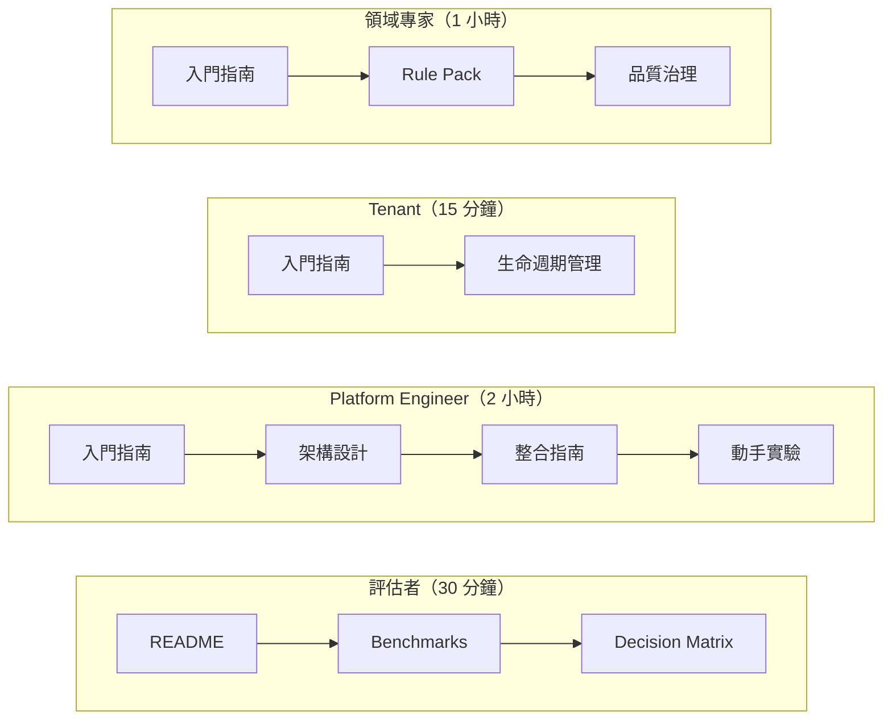

# 場景指南導覽

> **Language / 語言：** **中文（當前）**

每個場景都是獨立可讀的端到端指南，包含背景、步驟、驗證命令。依你的目的選讀。

## 學習路徑

## 首次導入

| 場景 | 適用角色 | 摘要 |
|------|---------|------|
| [動手實驗：從零到生產告警](hands-on-lab.md) | Platform Engineer, Tenant | 互動式教程，從 scaffold 到 alert 驗證的完整流程 |
| [租戶完整生命週期管理](tenant-lifecycle.md) | All | Onboard → 配置 → 維護 → Offboard 全週期 |
| [漸進式遷移 Playbook](incremental-migration-playbook.md) | Platform Engineer, SRE | 四階段零停機遷移（評估 → Shadow → 切換 → 收尾） |

## 進階運維

| 場景 | 適用角色 | 摘要 |
|------|---------|------|
| [Alert Routing 雙視角通知](alert-routing-split.md) | Platform Engineer | Platform/NOC vs Tenant 同一 Alert 不同語義的路由拆分 |
| [Shadow Monitoring — 評估到切換](shadow-monitoring-cutover.md) | Platform Engineer, SRE | Phase 0 告警健康評估 → 雙軌驗證 → 全自動切換 |

## 架構與 CI/CD

| 場景 | 適用角色 | 摘要 |
|------|---------|------|
| [多叢集聯邦架構](multi-cluster-federation.md) | Platform Engineer | 中央閾值 + 邊緣指標的 Federation 部署 |
| [GitOps CI/CD 整合](gitops-ci-integration.md) | Platform Engineer | ArgoCD/Flux 工作流、CI Pipeline 配置、PR 驗證 |

## 測試矩陣

| 場景 | 適用角色 | 摘要 |
|------|---------|------|
| [測試覆蓋矩陣](../internal/test-coverage-matrix.md) | Platform Engineer, SRE | 企業級 E2E + Unit/Integration 測試矩陣、三態模式驗證、HA 故障切換驗證 |

## 相關資源

| 資源 | 說明 |
|------|------|
| [Getting Started](../getting-started/) | 依角色的快速入門指南 |
| [Migration Guide](../migration-guide.md) | 遷移流程完整參考 |
| [Shadow Monitoring SOP](../shadow-monitoring-sop.md) | Shadow Mode 運營 SOP |
| [Architecture & Design](../architecture-and-design.md) | 核心架構設計 |
