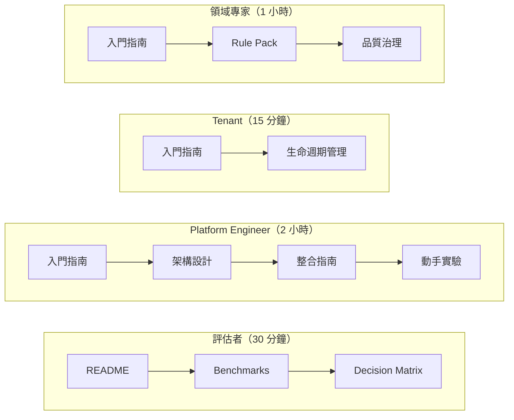

# 場景指南導覽

> **Language / 語言：** **中文（當前）**

每個場景都是獨立可讀的端到端指南，包含背景、步驟、驗證命令。依你的目的選讀。

## 學習路徑

```mermaid
flowchart LR
    subgraph path1["評估者（30 分鐘）"]
        direction LR
        P1A["README"] --> P1B["Benchmarks"] --> P1C["Decision Matrix"]
    end
    subgraph path2["Platform Engineer（2 小時）"]
        direction LR
        P2A["入門指南"] --> P2B["架構設計"] --> P2C["整合指南"] --> P2D["動手實驗"]
    end
    subgraph path3["Tenant（15 分鐘）"]
        direction LR
        P3A["入門指南"] --> P3B["生命週期管理"]
    end
    subgraph path4["領域專家（1 小時）"]
        direction LR
        P4A["入門指南"] --> P4B["Rule Pack"] --> P4C["品質治理"]
    end
```

## 首次導入

| 場景 | 適用角色 | 摘要 |
|------|---------|------|
| [動手實驗：從零到生產告警](hands-on-lab.md) | Platform Engineer, Tenant | 互動式教程，從 scaffold 到 alert 驗證的完整流程 |
| [租戶完整生命週期管理](tenant-lifecycle.md) | All | Onboard → 配置 → 維護 → Offboard 全週期 |
| [漸進式遷移 Playbook](incremental-migration-playbook.md) | Platform Engineer, SRE | 四階段零停機遷移（評估 → Shadow → 切換 → 收尾） |
| [多系統遷移 Playbook](multi-system-migration-playbook.md) | Platform Engineer, SRE | 同時換 storage backend（Prom→VM）、規則層與 AM routing 的遷移，逐 Phase 的步驟與 failure mode catalog |

## 進階運維

| 場景 | 適用角色 | 摘要 |
|------|---------|------|
| [Alert Routing 雙視角通知](alert-routing-split.md) | Platform Engineer | Platform/NOC vs Tenant 同一 Alert 不同語義的路由拆分 |
| [Shadow Monitoring — 評估到切換](shadow-monitoring-cutover.md) | Platform Engineer, SRE | Phase 0 告警健康評估 → 雙軌驗證 → 全自動切換（原 [Shadow Audit](shadow-audit.md) 已併入本頁） |
| [千租戶規模管理](manage-at-scale.md) | Platform Engineer | Blast radius 預估、批次查詢與篩選、繼承鏈追蹤 |
| [Staged Rule Adoption Lifecycle](staged-adoption-guide.md) | Platform Engineer, SRE, Tenant | 規則先以 `custom_*` 導入、再漸進收編為 golden 規則；適用初次遷移、新租戶上線與 Rule Pack 升級 |
| [版本感知閾值](version-aware-thresholds.md) | Tenant, Platform Engineer, SRE | 滾動升版時為新舊版本設不同閾值，升版完成後自動 cutover |

## 架構與 CI/CD

| 場景 | 適用角色 | 摘要 |
|------|---------|------|
| [多叢集聯邦架構](multi-cluster-federation.md) | Platform Engineer | 中央閾值 + 邊緣指標的 Federation 部署 |
| [GitOps CI/CD 整合](gitops-ci-integration.md) | Platform Engineer | ArgoCD/Flux 工作流、CI Pipeline 配置、PR 驗證 |
| [多域名階層式配置](multi-domain-conf-layout.md) | Platform Engineer | 租戶數成長後，把平面的 `conf.d/` 重構成多域名階層結構 |
| [扁平 `tenants/` → `conf.d/` 遷移決策](flat-to-conf-d-cutover-decision.md) | Platform Engineer, SRE | 決定是否、何時從扁平 `tenants/` 遷到階層 `conf.d/`；逐步操作見漸進式遷移 Playbook |

## 測試矩陣

| 場景 | 適用角色 | 摘要 |
|------|---------|------|
| [驗證場景與平台行為](verified-scenarios.md) | Platform Engineer, SRE | 核心場景 A–F 各由哪個測試或 lint 守、覆蓋缺口、`max by` 防 HA 翻倍 |

## 相關資源

| 資源 | 說明 |
|------|------|
| [Getting Started](../getting-started/) | 依角色的快速入門指南 |
| [Migration Guide](../migration-guide.md) | 遷移流程完整參考 |
| [Shadow Monitoring SOP](../shadow-monitoring-sop.md) | Shadow Mode 運營 SOP |
| [Architecture & Design](../architecture-and-design.md) | 核心架構設計 |
