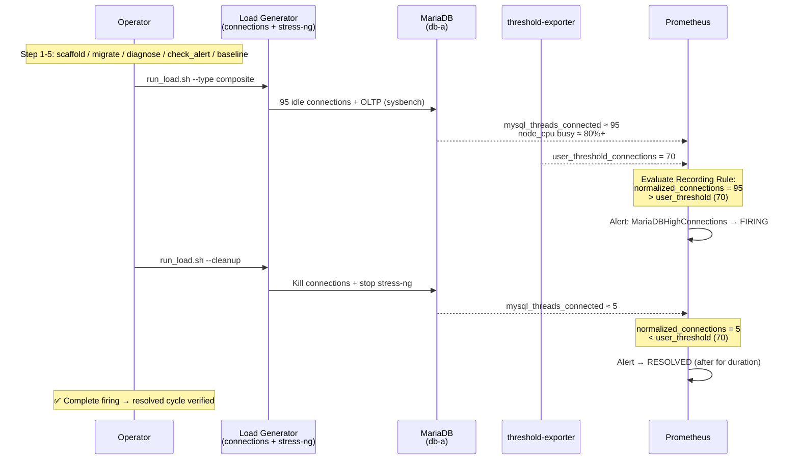

# Advanced Scenarios & Test Coverage

> **Language / 語言：** **English (Current)** | [中文](advanced-scenarios.md)

> Related docs: [Architecture] · [Testing Playbook](../internal/testing-playbook.md) · [Alert Routing Split](alert-routing-split.en.md)

---

## Maintenance Mode and Composite Alerts

All Alert Rules have built-in `unless maintenance` logic, tenants can mute with one state_filter switch:

```yaml
# _defaults.yaml
state_filters:
  maintenance:
    reasons: []
    severity: "info"
    default_state: "disable"   # Disabled by default

# Tenant enables maintenance mode:
tenants:
  db-a:
    _state_maintenance: "enable"  # All alerts suppressed by unless
```

Composite alerts (AND logic) and multi-tier severity (Critical auto-suppresses Warning) are also fully implemented.

## Enterprise Test Coverage Matrix

The test system is organized into two layers: **E2E Scenario Tests** (end-to-end verification within the K8s cluster) and **Unit/Integration Tests** (pytest + go test, 2,002+ test cases).

| Scenario | Enterprise Protection | Test Method | Core Assertions | Command |
|----------|----------------------|-------------|-----------------|---------|
| **A — Dynamic Threshold** | Tenant-defined thresholds take effect immediately, no restart needed | Modify threshold → wait for exporter reload → verify alert fires | `user_threshold` value updated; alert state becomes firing | `make test-scenario-a` |
| **B — Weakest Link Detection** | Worst metric among multiple automatically triggers alert | Inject CPU stress → verify `pod_weakest_cpu_percent` normalization | Recording rule produces correct worst value; alert fires correctly | `make test-scenario-b` |
| **C — Three-State Comparison** | Metrics controlled by custom / default / disable states | Toggle three states → verify exporter metric presence/absence | custom: value=custom; default: value=global default; disable: metric disappears | Included in scenario-a |
| **D — Maintenance Mode** | Automatic alert silencing during planned maintenance | Enable `_state_maintenance` → verify alert suppressed by `unless` | All alerts remain inactive; resume normal after disabling | Included in scenario-a |
| **E — Multi-Tenant Isolation** | Modifying Tenant A never affects Tenant B | Lower A threshold/disable A metric → verify B unchanged | A alert fires, B alert inactive; A metric absent, B metric present | `make test-scenario-e` |
| **F — HA Failover** | Service continues after Pod deletion, thresholds don't double | Kill 1 Pod → verify alert continues → new Pod starts → verify `max by` | Surviving Pods ≥1 (PDB); alert uninterrupted; recording rule value = original (not 2×) | `make test-scenario-f` |
| **demo-full** | End-to-end lifecycle demonstration | Composite load → alert fires → cleanup → alert resolves | All 6 steps succeed; complete firing → inactive cycle | `make demo-full` |

### Unit/Integration Tests (`make test` / `pytest`)

v1.7.0–v2.0.0 introduced numerous enterprise features; their test coverage is concentrated at the unit/integration layer:

| Feature Domain | Enterprise Protection | Coverage Scope | Test Count |
|---------------|----------------------|----------------|------------|
| **Silent Mode** | Mute notifications while preserving TSDB records | Sentinel metric emit, inhibit rule generation, three-state interaction | ~20 |
| **Severity Dedup** | Warning/critical deduplication | Per-tenant inhibit rules, metric_group pairing, sentinel metric | ~15 |
| **Config-driven Routing** | 6 receiver types + guardrails | Receiver structure validation, timing clamp, domain allowlist | ~40 |
| **Per-rule Overrides** | Specific alerts routed to different receivers | expand_routing_overrides, sub-route generation, mutual exclusion verification | ~15 |
| **Platform Enforced Routing** | NOC always receives + tenant also receives | `_routing_enforced` merge, `continue: true` insertion | ~10 |
| **Expires Auto-expiry** | Prevent forgotten silent/maintenance states | `time.Now().After(expires)` logic, `da_config_event` emit | ~15 |
| **Cardinality Guard** | Prevent tenant config explosion | `max_metrics_per_tenant` truncate, ERROR log | ~10 |
| **Schema Validation** | Detect typos/unknown keys | Go + Python dual-end consistency, warning reporting | ~20 |
| **Onboard/Migration** | Seamless enterprise migration | AST engine, triage CSV, shadow mapping, prefix injection | ~50 |
| **N:1 Namespace Mapping** | Multiple NS → single tenant | Relabel snippet generation, `_namespaces` metadata | ~10 |
| **Shadow Monitoring Cutover** | One-click automated cutover | Readiness consumption, 5-step execution, dry-run, timeout handling | ~25 |
| **Blind Spot Discovery** | Cluster blind spot detection | Targets parsing, segment matching, wrapped YAML format | ~25 |
| **Config Diff** | Configuration change blast radius | Wrapped/flat format loading, change classification, Markdown output | ~20 |
| **AM GitOps ConfigMap** | Complete ConfigMap generation | Base-config loading, mutual exclusion verification, YAML structure | ~30 |
| **Recurring Maintenance** | Scheduled maintenance window automation | parse_duration (incl. `d`), is_in_window cron evaluation, silence CRUD + extend, Pushgateway metric push | ~55 |
| **Alert Quality Scoring** | Four-dimension alert quality assessment | Noise/stale/latency/suppression scoring, three-tier grading, tenant reports, Markdown output | 57 |
| **Policy-as-Code** | Configuration policy engine | 10 operator validations, when condition filtering, tenant exclusion, severity grading, violation reports | 106 |
| **Cardinality Forecasting** | Cardinality trend prediction | Linear regression, risk grading, days-to-limit calculation, Markdown/JSON reports | 61 |
| **SAST Compliance** | Static security analysis compliance | Go G112, Python CWE-276, B602, encoding standards, full-repo scan | 189 |
| **Migration Engine v3** | AST migration engine | PromQL parsing, prefix injection, triage classification, shadow mapping | 67 |
| **Offboard & Deprecate** | Tenant offboarding and rule deprecation | Cleanup process, audit logs, deprecation markers | 34 |

> Full test suite: `make test` (Go) + `pytest tests/` (Python, 2,002+ passed). CI pipeline `.github/workflows/validate.yaml` runs automatically on every PR. Full test architecture guide: [Test Map](../internal/test-map.md).

### Assertion Details

**Scenario E — Two Isolation Dimensions:**

- **E1 — Threshold Modification Isolation**: Set db-a's `mysql_connections` to 5 → db-a triggers `MariaDBHighConnections`, db-b's threshold and alert state remain completely unaffected
- **E2 — Disable Isolation**: Set db-a's `container_cpu` to `disable` → db-a's metric disappears from exporter, db-b's `container_cpu` continues to be exported normally

**Scenario F — `max by(tenant)` Proof:**

Two threshold-exporter Pods each emit identical `user_threshold{tenant="db-a", metric="connections"} = 5`. The recording rule uses `max by(tenant)` aggregation:

- ✅ `max(5, 5) = 5` (correct)
- ❌ If using `sum by(tenant)`: `5 + 5 = 10` (doubled, incorrect)

The test verifies the value remains 5 after killing one Pod, and after the new Pod starts, the series count returns to 2 but the aggregated value is still 5.

## demo-full: End-to-End Lifecycle Flowchart

`make demo-full` demonstrates the complete flow from tool verification to real load. The sequence diagram below describes the core path of Step 6 (Live Load):



## Scenario E: Multi-Tenant Isolation Verification

Verifies that modifying Tenant A's configuration never affects Tenant B. The flow is divided into two isolation dimensions:


## Scenario F: HA Failover and Anti-Doubling

Verifies that threshold-exporter HA ×2 continues operating after Pod deletion and that `max by(tenant)` aggregation does not double when Pod count changes:


> **Key Proof**: Scenario F's Phase F4 is the critical verification for the entire HA design — it directly proves the correctness of `max by(tenant)` aggregation when Pod count changes. This is the technical rationale for choosing `max` over `sum`. See §5 High Availability Design for details.

---

> This document was extracted from [`architecture-and-design.en.md`](../architecture-and-design.en.md).

## Interactive Tools

> Interactive tools — the following can be tested directly at the [Interactive Tools Hub](https://vencil.github.io/Dynamic-Alerting-Integrations/):
>
> - [PromQL Tester](https://vencil.github.io/Dynamic-Alerting-Integrations/assets/jsx-loader.html?component=../interactive/tools/promql-tester.jsx) — Test alert rule PromQL expressions
> - [Rule Pack Matrix](https://vencil.github.io/Dynamic-Alerting-Integrations/assets/jsx-loader.html?component=../interactive/tools/rule-pack-matrix.jsx) — View existing Rule Pack coverage
> - [Config Lint](https://vencil.github.io/Dynamic-Alerting-Integrations/assets/jsx-loader.html?component=../interactive/tools/config-lint.jsx) — Validate advanced scenario configurations

## Related Resources

| Resource | Relevance |
|----------|-----------|
| ["Advanced Scenarios & Test Coverage"](advanced-scenarios.en.md) | ⭐⭐⭐ |
| ["Scenario: Same Alert, Different Semantics — Platform/NOC vs Tenant Dual-Perspective Notifications"](alert-routing-split.en.md) | ⭐⭐ |
| ["Scenario: Multi-Cluster Federation Architecture — Central Thresholds + Edge Metrics"](multi-cluster-federation.en.md) | ⭐⭐ |
| ["Scenario: Automated Shadow Monitoring Cutover Workflow"](shadow-monitoring-cutover.en.md) | ⭐⭐ |
| [Threshold Exporter API Reference](../api/README.en.md) | ⭐⭐ |
| ["Performance Analysis & Benchmarks"](../benchmarks.en.md) | ⭐⭐ |
| ["BYO Alertmanager Integration Guide"](../byo-alertmanager-integration.en.md) | ⭐⭐ |
| ["Bring Your Own Prometheus (BYOP) — Existing Monitoring Infrastructure Integration Guide"](../byo-prometheus-integration.en.md) | ⭐⭐ |
