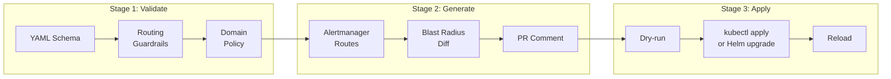

# Scenario: GitOps CI/CD Integration Guide

> **v2.6.0** | Related: [`architecture-and-design.md`](../architecture-and-design.md), [`for-platform-engineers.md`](../getting-started/for-platform-engineers.md), [`cli-reference.md`](../cli-reference.md) · Interactive: [CI/CD Setup Wizard](../assets/jsx-loader.html?component=../interactive/tools/cicd-setup-wizard.jsx)

## Overview

This guide explains how to integrate the Dynamic Alerting platform into your existing CI/CD workflow. Covers the complete path from zero:

- **Quick init**: `da-tools init` generates all integration files in one command
- **Three-stage pipeline**: Validate → Generate → Apply
- **Four deployment modes**: Kustomize, Helm, ArgoCD, GitOps Native (git-sync sidecar)
- **Two CI platforms**: GitHub Actions, GitLab CI

## Prerequisites

- A Git repository for your threshold YAML configurations
- CI environment that can pull `ghcr.io/vencil/da-tools` Docker image
- Target Kubernetes cluster with Prometheus + Alertmanager deployed
- (Recommended) threshold-exporter deployed via [Helm chart](https://github.com/vencil/Dynamic-Alerting-Integrations/tree/main/components/threshold-exporter)

## 1. Quick Init

### 1.1 Using da-tools init

The fastest path is running `da-tools init`, which scaffolds the complete integration skeleton in your repo.

**Interactive mode (recommended):**

```bash
# Run via Docker (no install required)
docker run --rm -it \
  -v $(pwd):/workspace -w /workspace \
  ghcr.io/vencil/da-tools:latest \
  init
```

The CLI guides you through: CI/CD platform, deployment method, Rule Pack selection, tenant names.

**Non-interactive mode (CI-friendly):**

```bash
da-tools init \
  --ci both \
  --tenants prod-mariadb,prod-redis \
  --rule-packs mariadb,redis,kubernetes \
  --deploy kustomize \
  --non-interactive
```

### 1.2 Generated File Structure

```
your-repo/
├── conf.d/
│   ├── _defaults.yaml           # Platform global default thresholds
│   ├── prod-mariadb.yaml        # Tenant A overrides
│   └── prod-redis.yaml          # Tenant B overrides
├── .github/workflows/
│   └── dynamic-alerting.yaml    # GitHub Actions pipeline
├── .gitlab-ci.d/
│   └── dynamic-alerting.yml     # GitLab CI pipeline
├── kustomize/
│   ├── base/
│   │   └── kustomization.yaml   # ConfigMap generator
│   └── overlays/
│       ├── dev/
│       └── prod/
├── .pre-commit-config.da.yaml   # Pre-commit hooks snippet
└── .da-init.yaml                # Init marker (for upgrade detection)
```

## 2. Three-Stage CI/CD Pipeline

### 2.1 Architecture



### 2.2 Stage 1: Validate

Runs automatically on every PR and push. Checks:

| Check | Tool | Description |
|-------|------|-------------|
| YAML Schema | `da-tools validate-config` | Tenant key validity, three-state value format |
| Routing Guardrails | `da-tools validate-config` | group_wait 5s–5m, repeat_interval 1m–72h |
| Domain Policy | `da-tools evaluate-policy` | Business domain constraints (e.g., finance forbids Slack) |
| Custom Rule Lint | `da-tools lint` | Custom rules deny-list check |

```bash
# Local validation (same checks as CI)
da-tools validate-config --config-dir conf.d/ --ci
```

### 2.3 Stage 2: Generate

Runs only on PRs. Generates Alertmanager config fragments and computes blast radius.

```bash
# Generate Alertmanager routes/receivers/inhibit_rules
da-tools generate-routes --config-dir conf.d/ \
  -o .output/alertmanager-routes.yaml --validate

# Compute blast radius (which tenants, which metrics affected)
# In CI, first checkout base branch's conf.d/ to conf.d.base/
da-tools config-diff --old-dir conf.d.base/ --new-dir conf.d/ \
  --format markdown > .output/blast-radius.md
```

The blast-radius.md is automatically posted as a PR comment for quick reviewer assessment.

### 2.4 Stage 3: Apply

Manually triggered (`workflow_dispatch`), requires `production` environment approval. See §3 for deployment-specific steps.

## 3. Four Deployment Modes

### 3.1 Kustomize (Recommended for Getting Started)

Best for: teams already managing K8s resources with Kustomize.

**Concept**: `configMapGenerator` creates the `threshold-config` ConfigMap from `conf.d/` files. Kubernetes mounts it into the threshold-exporter Pod, which auto-reloads on SHA-256 change detection.

**Link conf.d/ to kustomize/base/:**

```bash
cd kustomize/base/
ln -s ../../conf.d/_defaults.yaml .
ln -s ../../conf.d/prod-mariadb.yaml .
ln -s ../../conf.d/prod-redis.yaml .
```

**CI apply:**

```bash
kustomize build kustomize/overlays/prod > /tmp/manifests.yaml
kubectl apply --dry-run=server -f /tmp/manifests.yaml
kubectl apply -f /tmp/manifests.yaml
```

### 3.2 Helm

Best for: teams already using the threshold-exporter Helm chart.

**Concept**: Embed `conf.d/` thresholds in Helm values. Helm upgrade automatically updates the ConfigMap.

```yaml
# environments/prod/values.yaml
thresholdConfig:
  defaults:
    mysql_connections: 80
    container_cpu: 80
  tenants:
    prod-mariadb:
      mysql_connections: "70"
      _routing:
        receiver:
          type: webhook
          url: "https://webhook.prod.example.com/alerts"
```

```bash
helm upgrade --install threshold-exporter \
  oci://ghcr.io/vencil/charts/threshold-exporter \
  -f environments/prod/values.yaml \
  -n monitoring --wait
```

### 3.3 ArgoCD

Best for: teams with existing ArgoCD GitOps workflows.

**Concept**: ArgoCD Application points to your repo, auto-syncs on `conf.d/` changes.

```yaml
# argocd/dynamic-alerting.yaml
apiVersion: argoproj.io/v1alpha1
kind: Application
metadata:
  name: dynamic-alerting
  namespace: argocd
spec:
  source:
    repoURL: https://github.com/your-org/your-repo.git
    targetRevision: main
    path: kustomize/overlays/prod
  destination:
    server: https://kubernetes.default.svc
    namespace: monitoring
  syncPolicy:
    automated:
      prune: true
      selfHeal: true
```

### 3.4 GitOps Native Mode (git-sync sidecar)

Best for: Teams that want to eliminate the ConfigMap middle layer and have threshold-exporter read config directly from Git.

**Concept**: A git-sync sidecar periodically pulls the Git repo to an emptyDir shared volume. threshold-exporter's Directory Scanner reads config from the shared volume. The existing SHA-256 hot-reload mechanism works seamlessly — the sidecar only handles Git → filesystem sync; the exporter doesn't need to know the config comes from Git.

**Initialize:**

```bash
da-tools init \
  --ci github \
  --deploy kustomize \
  --config-source git \
  --git-repo git@github.com:your-org/configs.git \
  --git-branch main \
  --git-path conf.d \
  --tenants prod-mariadb,prod-redis \
  --non-interactive
```

This generates an additional `kustomize/overlays/gitops/` directory with the git-sync sidecar Deployment patch.

**Pre-deployment setup:**

```bash
# Create Git auth Secret (SSH key or HTTPS token)
kubectl create secret generic git-sync-credentials \
  --from-file=ssh-key=$HOME/.ssh/id_ed25519 \
  -n monitoring

# Deploy
kubectl apply -k kustomize/overlays/gitops/

# Validate readiness
da-tools gitops-check sidecar --namespace monitoring
da-tools gitops-check local --dir /data/config/conf.d
```

**Architecture**: An initContainer runs `--one-time` to complete the initial clone (ensuring config exists before the exporter starts), while the sidecar continuously polls with `--period` for ongoing updates.

**Advantage**: Git push → sidecar auto-pull → exporter hot-reload, end-to-end automation with no CI/CD `kubectl apply` step needed.

**Advanced options:**

- **Adjust sync interval**: `--git-period 30` reduces the polling interval from the default 60s to 30s
- **Webhook trigger** (sub-second latency): Add `--webhook-url=http://localhost:8888` and `--webhook-port=8888` to git-sync-patch.yaml, then configure a GitHub/GitLab Webhook to push change notifications. Requires additional Service + Ingress to route the webhook to the git-sync container
- **HTTPS authentication**: Replace `--from-file=ssh-key` with `--from-literal=username=... --from-literal=password=<token>`

## 4. Shift-Left: Pre-commit Hooks

`da-tools init` generates `.pre-commit-config.da.yaml` to push validation to developer machines.

**Merge into your `.pre-commit-config.yaml`:**

```yaml
repos:
  - repo: local
    hooks:
      - id: da-validate-config
        name: Validate Dynamic Alerting config
        entry: >-
          docker run --rm
          -v ${PWD}/conf.d:/data/conf.d:ro
          ghcr.io/vencil/da-tools:latest
          validate-config --config-dir /data/conf.d --ci
        language: system
        files: ^conf\.d/.*\.ya?ml$
        pass_filenames: false
```

Every commit touching `conf.d/` files automatically validates locally.

## 5. End-to-End Workflow Example

Complete GitOps flow for a tenant threshold change:

```bash
# 1. Edit tenant config
vi conf.d/prod-mariadb.yaml
# Change mysql_connections from 80 to 70

# 2. Local validation
da-tools validate-config --config-dir conf.d/

# 3. Commit (pre-commit hook auto-validates)
git add conf.d/prod-mariadb.yaml
git commit -m "feat(db-a): lower connection threshold to 70"

# 4. Push + open PR
git push origin feature/lower-connections
# → CI Stage 1 (Validate) runs automatically
# → CI Stage 2 (Generate) computes blast radius, posts PR comment

# 5. Reviewer checks blast radius → Approve → Merge

# 6. Manually trigger Apply (or ArgoCD auto-syncs)
# → ConfigMap updated → threshold-exporter hot-reloads → Prometheus uses new thresholds
```

## 6. Multi-Team Sharded Mode

In large organizations, different teams may maintain their own `conf.d/` directories. `assemble_config_dir.py` merges multiple sources:

```bash
# Merge multi-team conf.d/ into unified output
python3 scripts/tools/ops/assemble_config_dir.py \
  --sources team-dba/conf.d,team-app/conf.d,team-infra/conf.d \
  --output build/merged-config-dir \
  --validate
```

With CI pipeline integration, each team only modifies their own conf.d/. The merge stage auto-detects conflicts (same tenant in multiple sources).

## 7. Troubleshooting

| Issue | Diagnosis | Solution |
|-------|-----------|----------|
| CI validate fails | `da-tools validate-config --config-dir conf.d/ --verbose` | Fix YAML per error message |
| ConfigMap updated but exporter unresponsive | Check `reloadInterval` setting, exporter logs | `kubectl logs -l app=threshold-exporter -n monitoring` |
| Alertmanager routes not effective | `da-tools explain-route --tenant <name> --config-dir conf.d/` | Check four-layer merge order |
| Kustomize build fails | Verify symlinks point to correct conf.d/ files | `ls -la kustomize/base/` |

## Related Documents

- [Architecture & Design](../architecture-and-design.md) — Core concepts deep dive
- [CLI Reference](../cli-reference.md) — All da-tools commands
- [BYO Prometheus Integration](../integration/byo-prometheus-integration.md) — Bring your existing Prometheus
- [BYO Alertmanager Integration](../integration/byo-alertmanager-integration.md) — Bring your existing Alertmanager
- [Tenant Lifecycle](tenant-lifecycle.en.md) — Full onboarding to offboarding flow

---

**Document version:** v2.2.0 — 2026-03-17
**Maintainer:** Platform Engineering Team
