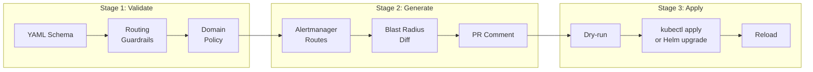

# Scenario: GitOps CI/CD Integration Guide

> **Language / 語言：** **English (Current)** | [中文](./gitops-ci-integration.md)

> **v2.9.0** | Related: [`architecture-and-design.md`](../architecture-and-design.md), [`for-platform-engineers.md`](../getting-started/for-platform-engineers.md), [`cli-reference.md`](../cli-reference.md) · Interactive: [CI/CD Setup Wizard](../assets/jsx-loader.html?component=../interactive/tools/cicd-setup-wizard.jsx)

## Overview

This guide explains how to integrate the Dynamic Alerting platform into your existing CI/CD workflow. Covers the complete path from zero:

- **Quick init**: `da-tools init` generates all integration files in one command
- **Three-stage pipeline**: Validate → Generate → Apply (GitHub Actions; the GitLab artifact has two stages, Validate → Apply — see §1)
- **Four deployment modes**: Kustomize, Helm, ArgoCD, GitOps Native (git-sync sidecar)
- **Two CI platforms**: GitHub Actions, GitLab CI

## Prerequisites

- A Git repository for your threshold YAML configurations
- CI environment that can pull `ghcr.io/vencil/da-tools` Docker image
- Target Kubernetes cluster with Prometheus + Alertmanager deployed
- (Recommended) threshold-exporter deployed via [Helm chart](https://github.com/vencil/Dynamic-Alerting-Integrations/tree/main/components/threshold-exporter)

## Docker Usage Pattern

--8<-- "docs/includes/docker-usage-pattern.en.md"

> Subsequent examples omit this prefix and show only `da-tools <command>` form.
> **`da-tools` is not an executable you can install onto `$PATH`** — it is an
> entry point inside the image, so copying a bare `da-tools ...` line gets you
> `bash: da-tools: command not found`. For how to obtain the image (including
> air-gapped `docker load`), see the
> [Migration Toolkit installation guide](../migration-toolkit-installation.en.md).

⚠️ **A problem the mount does not explain, and changing the mount
does not fix**: the §2.3 shape `generate-routes ... -o .output/xxx.yaml
--validate` prints `OK: all configs valid` and exits 0 while the file named by
`-o` never appears — `--validate` finishes before `-o` is used; drop
`--validate` and it fails because the tool does not create `.output/` — **from
v2.10.0 that is exit 2 with a line naming `-o`**, where it used to be an
uncaught `FileNotFoundError` traceback at exit 1
([#1617](https://github.com/vencil/Dynamic-Alerting-Integrations/issues/1617)).
⚠️ If your CI greps the log for `FileNotFoundError` to detect this case, that
string no longer appears. The tool still does not create the directory: to
actually get the file, `mkdir -p .output` first and do not pass `--validate` in
the same run. Tracked as
[#1423](https://github.com/vencil/Dynamic-Alerting-Integrations/issues/1423).

## 1. Quick Init

### 1.1 Using da-tools init

The fastest path is running `da-tools init`, which scaffolds the complete integration skeleton in your repo.

**Interactive mode (recommended):**

```bash
# Run via Docker (no install required)
docker run --rm -it \
  --user $(id -u):$(id -g) \
  -v $(pwd):/workspace -w /workspace \
  ghcr.io/vencil/da-tools:latest \
  init
```

The CLI guides you through: CI/CD platform, deployment method, Rule Pack selection, tenant names.

**Non-interactive mode (CI-friendly):**

```bash
da-tools init \
  --ci both \
  --tenants prod-mariadb,prod-redis \
  --rule-packs mariadb,redis,kubernetes \
  --deploy kustomize \
  --non-interactive
```

### 1.2 Generated File Structure

```
your-repo/
├── conf.d/
│   ├── _defaults.yaml           # Platform global default thresholds
│   ├── prod-mariadb.yaml        # Tenant A overrides
│   └── prod-redis.yaml          # Tenant B overrides
├── .github/workflows/
│   └── dynamic-alerting.yaml    # GitHub Actions pipeline
├── .gitlab-ci.d/
│   └── dynamic-alerting.yml     # GitLab CI pipeline (the real stages / jobs)
├── .gitlab-ci.yml               # GitLab root pipeline shell (one include line)
├── kustomize/
│   ├── base/
│   │   └── kustomization.yaml   # ConfigMap generator
│   └── overlays/
│       ├── dev/
│       └── prod/
├── .pre-commit-config.da.yaml   # Pre-commit hooks snippet
└── .da-init.yaml                # Init marker (for upgrade detection)
```

#### Why GitLab gets two files

GitHub Actions auto-loads **every** workflow under `.github/workflows/`, so
dropping that one file in place is enough. GitLab does not: a project auto-loads
exactly one path, the repository-root `.gitlab-ci.yml`. A pipeline file anywhere
else does not run until something `include:`s it — and it fails silently, because
as far as GitLab is concerned it is just a file.

So `da-tools init` also writes a root shell whose entire body is:

```yaml
# .gitlab-ci.yml
include:
  - local: .gitlab-ci.d/dynamic-alerting.yml
```

`stages:` and `variables:` from the included file are merged into this pipeline,
so the shell restates nothing. The real pipeline stays in `.gitlab-ci.d/`, which
keeps it separable from your own CI config and replaceable wholesale on upgrade.

**If your repo already has a root `.gitlab-ci.yml`**, `da-tools init` does **not**
touch it — overwriting would delete every job you run, and appending to a YAML
document the tool never parsed is no safer. It prints what to paste in its closing
summary; paste it into your existing `.gitlab-ci.yml` yourself.
Until you do, the generated pipeline is perfectly valid YAML that never runs once.

⚠️ **Follow what the tool actually prints, not the example below.** This shows
the END STATE your file should reach; it is not a snippet to paste:

```yaml
include:
  - local: .gitlab-ci.d/security.yml           # ← yours, already there
  - local: .gitlab-ci.d/dynamic-alerting.yml   # ← this line is the new one
```

An existing file comes in more than one shape, and the safe edit differs per
shape. `include:` is a top-level key, so a second one is a duplicate key and
YAML keeps only one of them — pasting the whole block would **silently delete
your own includes**. But `include:` also accepts a scalar (`include: 'a.yml'`),
a flow sequence (`include: ['a.yml']`) and a single mapping, and under those
three **adding a list item is a syntax error that stops your entire root
pipeline from loading** — strictly worse than not wiring it at all.

`da-tools init` tells these shapes apart (including "has an `include:` we
cannot safely append to" and "the file does not parse") and prints the
instruction that fits your file: a ready-made block when appending is provably
safe, and otherwise the end-state example above for you to fit to your own
document. The one thing it will not do is hand you paste-ready text for a file
it has not inspected.

#### The GitLab leg has no blast-radius step

The GitHub artifact has a third stage (config-diff computes the blast radius and
posts it as a PR comment). This one deliberately does not, and the reason is the
image rather than your repository: GitLab runs `script:` **inside**
`$DA_TOOLS_IMAGE`, and that image carries no `git`, so the baseline
(`git archive <base>`) cannot be taken on this platform at all. A baseline that
cannot be read does not look like "no changes" — it looks like "every tenant is
new". Rather than ship a report nobody should trust, we ship none: a missing
check is visible, a confidently wrong one is not. Tracked in
[#1358](https://github.com/vencil/Dynamic-Alerting-Integrations/issues/1358); the plan to
restore it is [#1444](https://github.com/vencil/Dynamic-Alerting-Integrations/issues/1444).

## 2. Three-Stage CI/CD Pipeline

### 2.1 Architecture


```mermaid
graph LR
    subgraph "Stage 1: Validate"
        V1["YAML Schema"]
        V2["Routing<br/>Guardrails"]
        V3["Domain<br/>Policy"]
    end
    subgraph "Stage 2: Generate"
        G1["Alertmanager<br/>Routes"]
        G2["Blast Radius<br/>Diff"]
        G3["PR Comment"]
    end
    subgraph "Stage 3: Apply"
        A1["Dry-run"]
        A2["kubectl apply<br/>or Helm upgrade"]
        A3["Reload"]
    end
    V1 --> V2 --> V3 --> G1 --> G2 --> G3 --> A1 --> A2 --> A3
```

> ℹ️ The diagram shows the **GitHub Actions** artifact. **The GitLab artifact has
> no Stage 2** — its image carries no `git`, so the comparison baseline cannot be
> taken (see "The GitLab leg has no blast-radius step" in §1). It has two stages:
> Validate and Apply.

### 2.2 Stage 1: Validate

Runs automatically on every PR and push. Checks:

| Check | Tool | Description | Does a violation block? |
|-------|------|-------------|-------------|
| YAML Schema | `da-tools validate-config` | Tenant key validity | **WARN only** (an unknown key reports `unknown key ... not in defaults`, exit 0). ⛔ **Values** are not validated at all — `mysql_connections: 'not-a-number'`, or a negative number, is a clean 5 pass / 0 warn |
| Routing Guardrails | `da-tools validate-config` | group_wait 5s–5m, group_interval 5s–5m, repeat_interval 1m–72h | **WARN only**, and the value is **emitted anyway** (3 parameters x above-max / below-min / unparseable = all 9 cases exit 0). ⚠️ The substitute is not one thing but two: above-max and below-min are **clamped to the bound**, while an **unparseable** value (e.g. `repeat_interval: banana`) takes the **platform default** instead (`validate_and_clamp` in `_lib_validation.py`). ⚠️ **Do not add `--strict` on the strength of this row**: the flag landed in `validate-config` after v2.9.0 and **the image you have rejects it** — measured `rc=2`, `unrecognized arguments: --strict`, zero bytes on stdout. Once an image ships with it this row is unchanged anyway: `--strict` governs domain policy, and these 9 cases still exit 0 (measured on source) |
| Domain Policy | `da-tools evaluate-policy` | Business domain constraints (e.g., finance forbids Slack) | ⚠️ **Neither the pre-commit hooks nor the CI that `da-tools init` generates ever calls this command.** The same engine is embedded in `validate-config` as `policy_dsl`, but it needs a `_policies:` section in `_defaults.yaml` and the one `init` writes has none ⇒ a fresh repo prints `No _policies defined — skipped` |
| Custom Rule Lint | `da-tools lint` | Custom rules deny-list check | ⚠️ Not in the pre-commit hooks. The generated GitHub workflow has the step, but it is wrapped in `if [ -d "rule-packs/custom" ]` and `init` **does not create `rule-packs/`** ⇒ a no-op in a fresh repo until you create that directory yourself |

⛔ **This table says who is looking, not what gets stopped.** Of the four rows,
only syntax errors and a few structural ones (an unsupported receiver type, say)
make validation FAIL; everything else is a WARN, and **WARN does not affect the
exit code**. A clamped threshold, a misspelled tenant key, a threshold written as
a string — all of those pass commit and CI silently.

```bash
# Local validation (same command the pre-commit hooks run; the second one is generate-routes, in §2.3)
# ⚠️ Only a FAIL makes the exit code non-zero. Everything marked "WARN only"
#    above exits 0 — and pre-commit prints a hook's output only when that hook
#    fails, so at `git commit` time you see none of those warnings. Run it
#    yourself to see them:
da-tools validate-config --config-dir conf.d/
```

### 2.3 Stage 2: Generate

Runs only on PRs. Generates Alertmanager config fragments and computes blast radius.

```bash
# Generate Alertmanager routes/receivers/inhibit_rules
mkdir -p .output
da-tools generate-routes --config-dir conf.d/ \
  -o .output/alertmanager-routes.yaml
# ⛔ Do not add --validate to the same call: it returns before -o is used, so
# it prints OK and writes nothing (#1423). Validate in a separate run:
da-tools generate-routes --config-dir conf.d/ --dry-run --validate

# Compute blast radius (which tenants, which metrics affected)
# In CI, first extract the base branch's conf.d/ into conf.d.base/
#
# ⚠️ config-diff reports whether anything changed through its EXIT CODE:
#    0 = no changes, 1 = changes detected, 2 = error. So a bare call fails the
#    step precisely when the command is **working** (it really found changes) —
#    and a job like this usually only triggers when conf.d changed, so it fails
#    every time.
set +e
da-tools config-diff --old-dir conf.d.base/ --new-dir conf.d/ \
  --format markdown > .output/blast-radius.md
rc=$?
set -e
if [ "$rc" -gt 1 ]; then
  echo "config-diff exited $rc (expected 0 or 1)" >&2
  exit "$rc"
fi
```

Once the step finishes successfully (`rc` of 0 or 1), blast-radius.md is posted
as a PR comment for quick reviewer assessment.

⚠️ **Whether the workflow `da-tools init` produces already carries this handling
depends on the image you ran.** `init` pulls `ghcr.io/vencil/da-tools:latest` by
default, and that tag only moves when the `tools/v*` line is released — this
page updates the moment it merges, the image does not. **Do not go by a version
number; look at the artifact**: check whether the `Config diff (blast radius)`
step in the generated `.github/workflows/dynamic-alerting.yaml` contains
`set +e` / `rc=$?`. If it does not, add the handling above yourself.

For the full exit-code contract, see
[GitOps deployment integration](../integration/gitops-deployment.en.md).

### 2.4 Stage 3: Apply

Manually triggered (`workflow_dispatch`), requires `production` environment approval. See §3 for deployment-specific steps.

## 3. Four Deployment Modes

### 3.1 Kustomize (Recommended for Getting Started)

Best for: teams already managing K8s resources with Kustomize.

**Concept**: `configMapGenerator` creates the `threshold-config` ConfigMap from `conf.d/` files. Kubernetes mounts it into the threshold-exporter Pod, which auto-reloads on SHA-256 change detection.

**Link conf.d/ to kustomize/base/:**

```bash
cd kustomize/base/
ln -s ../../conf.d/_defaults.yaml .
ln -s ../../conf.d/prod-mariadb.yaml .
ln -s ../../conf.d/prod-redis.yaml .
```

⛔ **Those symlinks point outside `kustomize/base/`, so `kustomize build` needs `--load-restrictor LoadRestrictionsNone`** — without it, the build fails with:

```text
security; file '.../kustomize/base/_defaults.yaml' is not in or below '.../kustomize/base'
```

That is kustomize's default load restrictor doing its job, not a broken link. The workflow `da-tools init` generates already passes the flag. If your deployment tool cannot pass it (some ArgoCD setups need `kustomize.buildOptions` configured cluster-side), copy the files in instead of linking them — at the cost of re-copying whenever `conf.d/` changes.

**CI apply:**

```bash
kustomize build --load-restrictor LoadRestrictionsNone kustomize/overlays/prod > /tmp/manifests.yaml
kubectl apply --dry-run=server -f /tmp/manifests.yaml
kubectl apply -f /tmp/manifests.yaml
```

### 3.2 Helm

Best for: teams already using the threshold-exporter Helm chart.

**Concept**: Embed `conf.d/` thresholds in Helm values. Helm upgrade automatically updates the ConfigMap.

```yaml
# environments/prod/values.yaml
thresholdConfig:
  defaults:
    mysql_connections: 80
    container_cpu: 80
  tenants:
    prod-mariadb:
      mysql_connections: "70"
      _routing:
        receiver:
          type: webhook
          url: "https://webhook.prod.example.com/alerts"
```

```bash
helm upgrade --install threshold-exporter \
  oci://ghcr.io/vencil/charts/threshold-exporter \
  -f environments/prod/values.yaml \
  -n monitoring --wait
```

### 3.3 ArgoCD

Best for: teams with existing ArgoCD GitOps workflows.

**Concept**: ArgoCD Application points to your repo, auto-syncs on `conf.d/` changes.

```yaml
# argocd/dynamic-alerting.yaml
apiVersion: argoproj.io/v1alpha1
kind: Application
metadata:
  name: dynamic-alerting
  namespace: argocd
spec:
  source:
    repoURL: https://github.com/your-org/your-repo.git
    targetRevision: main
    path: kustomize/overlays/prod
  destination:
    server: https://kubernetes.default.svc
    namespace: monitoring
  syncPolicy:
    automated:
      prune: true
      selfHeal: true
```

### 3.4 GitOps Native Mode (git-sync sidecar)

Best for: Teams that want to eliminate the ConfigMap middle layer and have threshold-exporter read config directly from Git.

**Concept**: A git-sync sidecar periodically pulls the Git repo to an emptyDir shared volume. threshold-exporter's Directory Scanner reads config from the shared volume. The existing SHA-256 hot-reload mechanism works seamlessly — the sidecar only handles Git → filesystem sync; the exporter doesn't need to know the config comes from Git.

**Initialize:**

```bash
da-tools init \
  --ci github \
  --deploy kustomize \
  --config-source git \
  --git-repo git@github.com:your-org/configs.git \
  --git-branch main \
  --git-path conf.d \
  --tenants prod-mariadb,prod-redis \
  --non-interactive
```

This generates an additional `kustomize/overlays/gitops/` directory with the git-sync sidecar Deployment patch.

**Pre-deployment setup:**

```bash
# Create Git auth Secret (SSH key or HTTPS token)
kubectl create secret generic git-sync-credentials \
  --from-file=ssh-key=$HOME/.ssh/id_ed25519 \
  -n monitoring

# Deploy
kubectl apply -k kustomize/overlays/gitops/

# Validate readiness
da-tools gitops-check sidecar --namespace monitoring
da-tools gitops-check local --dir /data/config/conf.d
```

**Architecture**: An initContainer runs `--one-time` to complete the initial clone (ensuring config exists before the exporter starts), while the sidecar continuously polls with `--period` for ongoing updates.

**Advantage**: Git push → sidecar auto-pull → exporter hot-reload, end-to-end automation with no CI/CD `kubectl apply` step needed.

**Advanced options:**

- **Adjust sync interval**: `--git-period 30` reduces the polling interval from the default 60s to 30s
- **Webhook trigger** (sub-second latency): Add `--webhook-url=http://localhost:8888` and `--webhook-port=8888` to git-sync-patch.yaml, then configure a GitHub/GitLab Webhook to push change notifications. Requires additional Service + Ingress to route the webhook to the git-sync container
- **HTTPS authentication**: Replace `--from-file=ssh-key` with `--from-literal=username=... --from-literal=password=<token>`

## 4. Shift-Left: Pre-commit Hooks

`da-tools init` generates `.pre-commit-config.da.yaml` to push validation to developer machines.

**Merge into your `.pre-commit-config.yaml`:**

⛔ **"Merge" means copying the `- repo: local` item below INTO the `repos:` list of your existing `.pre-commit-config.yaml`.** The block below is a complete file — its first line is `repos:` — so **appending it whole leaves two top-level `repos:` keys, and YAML keeps only the last one, silently**: measured, `pre-commit validate-config` still exits 0 while every hook you had is gone. Take the block as a whole file only if you do not have a `.pre-commit-config.yaml` yet.

⚠️ The block below is what `init` writes with the **default image** (`ghcr.io/vencil/da-tools:latest`). If you passed `--da-tools-image`, the first token of both `entry` values is the image you named — **go by the `.pre-commit-config.da.yaml` in your own repo root**, not by the image printed below.

<!-- mirrors-artifact: .pre-commit-config.da.yaml -->
<!-- merge-mode: merge-items -->
<!-- ⛔ The line above is machine-read. tests/ops/test_generated_ci_artifacts.py
     takes the file `da-tools init` actually writes and compares it against the
     block below in full, reading BOTH sides from artifacts. Do not hand-edit
     here — change scripts/tools/ops/init_project.py's _gen_precommit_snippet()
     and this block will be required to follow. -->

```yaml
repos:
  - repo: local
    hooks:
      - id: da-validate-config
        name: Validate Dynamic Alerting config
        entry: >-
          ghcr.io/vencil/da-tools:latest
          validate-config --config-dir /src/conf.d
        language: docker_image
        files: ^conf\.d/.*\.ya?ml$
        pass_filenames: false

      - id: da-generate-routes
        name: Generate Alertmanager routes (dry-run)
        entry: >-
          ghcr.io/vencil/da-tools:latest
          generate-routes --config-dir /src/conf.d --dry-run --validate
        language: docker_image
        files: ^conf\.d/.*\.ya?ml$
        pass_filenames: false
```

⚠️ **`language: docker_image` and the `/src`-relative paths go together — do not split them.** pre-commit splits `entry` with `shlex` and then execs it **without a shell**, so the `language: system` + `docker run -v ${PWD}/conf.d:...` form hands docker the literal string `${PWD}` and fails on every commit that touches `conf.d/`. `docker_image` makes pre-commit build the `docker run` itself and mount your work tree at `/src` (`-v <cwd>:/src:rw,Z --workdir /src`) — which is why `--config-dir` must be `/src`-relative.

Trade-off, stated: that mount is the **whole repo, read-write** — wider than the read-only `conf.d` mount the hand-written form asked for. It is pre-commit's own mechanism, and a hook that cannot run protects nothing.

Every commit touching `conf.d/` files runs local validation (`da-validate-config`) plus a routing dry-run (`da-generate-routes`).

## 5. End-to-End Workflow Example

Complete GitOps flow for a tenant threshold change:

```bash
# 1. Edit tenant config
vi conf.d/prod-mariadb.yaml
# Change mysql_connections from 80 to 70

# 2. Local validation
da-tools validate-config --config-dir conf.d/

# 3. Commit (pre-commit hook auto-validates)
git add conf.d/prod-mariadb.yaml
git commit -m "feat(db-a): lower connection threshold to 70"

# 4. Push + open PR
git push origin feature/lower-connections
# → CI Stage 1 (Validate) runs automatically
# → CI Stage 2 (Generate) computes blast radius, posts PR comment

# 5. Reviewer checks blast radius → Approve → Merge

# 6. Manually trigger Apply (or ArgoCD auto-syncs)
# → ConfigMap updated → threshold-exporter hot-reloads → Prometheus uses new thresholds
```

> ⚠️ **The validate step above will not tell you what you failed to set.** The platform declares a group of keys it recognises but asserts no value for (the `optional_overrides:` list in `_defaults.yaml`): leave one unset and its alert never fires, while validation and CI stay green with **no error message of any kind** — that is the design, not a missing default (these thresholds can only be calibrated against your own baseline). To see what a tenant is currently missing:
>
> ```bash
> da-tools diagnose <tenant> --config-dir conf.d/ --show-inheritance
> ```
>
> The `declared` section is the list of protections that tenant is going without. ⚠️ **The image you have (v2.9.0) does not print that section** — measured, its output holds only `chain` / `resolved` / `profile_name`, and it exits 0 without saying anything is missing. It arrives with the next image. Full three-group breakdown in the [Tenant Quick Start Guide](../getting-started/for-tenants.en.md).

## 6. Multi-Team Sharded Mode

In large organizations, different teams may maintain their own `conf.d/` directories. Merging multiple sources is done with `assemble_config_dir.py`:

```bash
# Merge multi-team conf.d/ into unified output
python3 scripts/tools/ops/assemble_config_dir.py \
  --sources team-dba/conf.d,team-app/conf.d,team-infra/conf.d \
  --output build/merged-config-dir \
  --validate
```

With CI pipeline integration, each team only modifies their own conf.d/. The merge stage auto-detects conflicts (same tenant in multiple sources).

⛔ **This section is currently reachable only by maintainers of this project.**
Unlike every other command on this page, `assemble_config_dir.py` has **no
`da-tools` subcommand** and is not packaged into the `ghcr.io/vencil/da-tools`
image — the line above needs a source checkout of this repository, which the
[prerequisites](#prerequisites) do not ask you for. If you need this capability,
please open an issue. Until then the workable substitute is to copy each team's
`conf.d/` into one directory in your own CI and run `da-tools validate-config`
over it (what you lose is the conflict detection).

## 7. Troubleshooting

| Issue | Diagnosis | Solution |
|-------|-----------|----------|
| `da-tools: command not found` (rc 127) | `da-tools` is not an installable executable, only an entry point inside the image | Add the `docker run` prefix or define an alias — see [Docker Usage Pattern](#docker-usage-pattern) on this page; to obtain the image see the [Migration Toolkit installation guide](../migration-toolkit-installation.en.md) |
| CI validate fails | `da-tools validate-config --config-dir conf.d/` | Every non-PASS check prints `-> Suggested action:` and `-> See:`; add `--json` for the machine-readable form of the same thing. ⚠️ **The image you have (v2.9.0)** raises a Python traceback instead of a report (in both modes, with zero bytes on stdout) whenever `conf.d/` holds **any file it cannot get through**. ⛔ **Do not try to read the filename off the traceback**: only the YAML-syntax one ends with a file and line. The others (saved as something other than UTF-8, a top level that is not a mapping, a `tenants:` block whose entries are all commented out, …) end with a codec, a byte offset, or **a path inside our image** — this list is deliberately not exhaustive, because there has been an Nth kind every time. Bisect instead: split `conf.d/` in half, run each half, repeat down to one file. [#1448](https://github.com/vencil/Dynamic-Alerting-Integrations/issues/1448) fixes this: **from the next image onward** the report is printed as usual and the `yaml_syntax` row names the files it could not read |
| The report says "Remove unknown keys" for keys I am still using | the `schema` row of `da-tools validate-config --config-dir conf.d/` | ⛔ **Do not delete them.** If your `_defaults.yaml` has **no `defaults:` block**, has `defaults: {}`, **or the tree has no `_defaults.yaml` at all** (that last shape is the common one in practice), then the platform declares no keys at all and **every** tenant override is reported as an `unknown key` — the gap is on the platform side, not a typo in your tenant files. ⚠️ The three shapes above do **not** include a bare `defaults:` key (null value): on the image you have that raises `AttributeError`, rc=1, zero bytes on stdout — it takes the row above and prints no advice at all. (Nor is it the only shape that misses this row: a `_defaults.yaml` saved as non-UTF-8, or with a non-mapping top level, also ends up there.) It is **the three shapes above** that reach this row, and **the advice the image you have (v2.9.0) prints for those three is wrong** (following it deletes thresholds that are in force, and the run exits 0 while doing so). The fix is to add a `defaults:` block — **create `_defaults.yaml` if the tree has none**; "restore" only applies to the case where one was emptied. From the next image onward this row prints "⛔ Do NOT remove the keys named above" instead ([#1448](https://github.com/vencil/Dynamic-Alerting-Integrations/issues/1448)) |
| Everything PASSes but your change had no effect | `da-tools validate-config --config-dir conf.d/` (run it yourself — do not rely on the green tick at commit time) | Most problems produce only a **WARN**, which does not affect the exit code and is not shown during `git commit` (pre-commit prints a hook's output only when that hook fails). Walk the "Does a violation block?" column in §2.2 |
| ConfigMap updated but exporter unresponsive | Check `reloadInterval` setting, exporter logs | `kubectl logs -l app=threshold-exporter -n monitoring` |
| Alertmanager routes not effective | `da-tools explain-route --tenant <name> --config-dir conf.d/` | Check four-layer merge order |
| Kustomize build fails with `is not in or below` | **Not a broken symlink** — the conf.d files live outside `kustomize/base/` and the default load restrictor refuses them. Re-run with the flag (see §3.1) | `kustomize build --load-restrictor LoadRestrictionsNone kustomize/overlays/prod` |
| Kustomize build fails with `no such file` | That one IS the link — e.g. pointing at a tenant file that does not exist | `ls -la kustomize/base/` |
| Config is green but an alert never fires | `da-tools diagnose <tenant> --config-dir conf.d/ --show-inheritance` | If the key appears in the `declared` section the platform recognises it but asserts no value (⚠️ the v2.9.0 image does not print that section — see §5) — **unset means silent, with no error message**. Supply a value calibrated against your own baseline |

## Related Documents

- [Architecture & Design](../architecture-and-design.md) — Core concepts deep dive
- [CLI Reference](../cli-reference.md) — All da-tools commands
- [BYO Prometheus Integration](../integration/byo-prometheus-integration.md) — Bring your existing Prometheus
- [BYO Alertmanager Integration](../integration/byo-alertmanager-integration.md) — Bring your existing Alertmanager
- [Tenant Lifecycle](tenant-lifecycle.en.md) — Full onboarding to offboarding flow

---

**Document version:** v2.9.0
**Maintainer:** Platform Engineering Team
