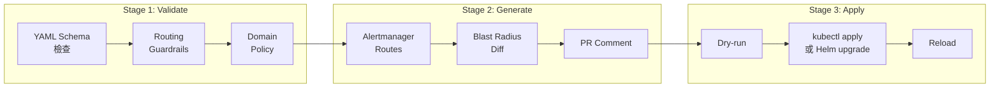

# 場景：GitOps CI/CD 整合指南

> **v2.4.0** | 相關文件：[`architecture-and-design.md`](../architecture-and-design.md)、[`for-platform-engineers.md`](../getting-started/for-platform-engineers.md)、[`cli-reference.md`](../cli-reference.md) · 互動工具：[CI/CD Setup Wizard](../assets/jsx-loader.html?component=../interactive/tools/cicd-setup-wizard.jsx)

## 概述

本指南說明如何將 Dynamic Alerting 平台整合到你的既有 CI/CD 流程中。涵蓋從零開始的完整路徑：

- **快速初始化**：`da-tools init` 一鍵產生所有整合檔案
- **三階段 Pipeline**：Validate → Generate → Apply
- **四種部署模式**：Kustomize、Helm、ArgoCD、GitOps Native（git-sync sidecar）
- **兩大 CI 平台**：GitHub Actions、GitLab CI

## 前置條件

- 一個可以放 threshold YAML 配置的 Git 倉庫
- 可以拉取 `ghcr.io/vencil/da-tools` Docker image 的 CI 環境
- 目標 Kubernetes 叢集中已部署 Prometheus + Alertmanager
- （推薦）已部署 threshold-exporter（[Helm chart](https://github.com/vencil/Dynamic-Alerting-Integrations/tree/main/components/threshold-exporter)）

## 1. 快速初始化

### 1.1 使用 da-tools init

最快的方式是執行 `da-tools init`，它會在你的 repo 中自動產生完整的整合骨架。

**互動模式（推薦）：**

```bash
# 使用 Docker 執行（無需安裝）
docker run --rm -it \
  -v $(pwd):/workspace -w /workspace \
  ghcr.io/vencil/da-tools:latest \
  init
```

CLI 會引導你選擇：CI/CD 平台、部署方式、Rule Pack 組合、租戶名稱。

**非互動模式（CI 友好）：**

```bash
da-tools init \
  --ci both \
  --tenants prod-mariadb,prod-redis \
  --rule-packs mariadb,redis,kubernetes \
  --deploy kustomize \
  --non-interactive
```

### 1.2 產出的檔案結構

```
your-repo/
├── conf.d/
│   ├── _defaults.yaml           # 平台全域預設閾值
│   ├── prod-mariadb.yaml        # 租戶 A 覆寫
│   └── prod-redis.yaml          # 租戶 B 覆寫
├── .github/workflows/
│   └── dynamic-alerting.yaml    # GitHub Actions pipeline
├── .gitlab-ci.d/
│   └── dynamic-alerting.yml     # GitLab CI pipeline
├── kustomize/
│   ├── base/
│   │   └── kustomization.yaml   # ConfigMap generator
│   └── overlays/
│       ├── dev/
│       └── prod/
├── .pre-commit-config.da.yaml   # Pre-commit hooks 片段
└── .da-init.yaml                # 初始化標記（升級偵測用）
```

## 2. 三階段 CI/CD Pipeline

### 2.1 架構概覽



### 2.2 Stage 1: Validate

在每個 PR 和 push 時自動執行。驗證項目：

| 檢查 | 工具 | 說明 |
|------|------|------|
| YAML Schema | `da-tools validate-config` | 租戶 key 合法性、三態值格式 |
| Routing Guardrails | `da-tools validate-config` | group_wait 5s–5m、repeat_interval 1m–72h |
| Domain Policy | `da-tools evaluate-policy` | 業務域約束（如金融禁止 Slack） |
| Custom Rule Lint | `da-tools lint` | 自訂規則禁止列表檢查 |

```bash
# 本地驗證（與 CI 完全相同的檢查）
da-tools validate-config --config-dir conf.d/ --ci
```

### 2.3 Stage 2: Generate

僅在 PR 時執行。產出 Alertmanager 配置片段並計算變更影響範圍。

```bash
# 產出 Alertmanager routes/receivers/inhibit_rules
da-tools generate-routes --config-dir conf.d/ \
  -o .output/alertmanager-routes.yaml --validate

# 計算 blast radius（影響哪些 tenant、哪些 metric）
# CI 中先 checkout base branch 的 conf.d/ 到 conf.d.base/
da-tools config-diff --old-dir conf.d.base/ --new-dir conf.d/ \
  --format markdown > .output/blast-radius.md
```

產出的 blast-radius.md 會自動貼到 PR comment，讓 reviewer 快速判斷影響範圍。

### 2.4 Stage 3: Apply

手動觸發（`workflow_dispatch`），需要 `production` environment 審批。三種部署路徑的具體操作見下方 §3。

## 3. 四種部署模式

### 3.1 Kustomize（推薦入門）

適合：已經使用 Kustomize 管理 K8s 資源的團隊。

**概念**：`configMapGenerator` 從 `conf.d/` 的 YAML 檔案自動產生 `threshold-config` ConfigMap，Kubernetes 掛載到 threshold-exporter Pod，exporter 偵測到 SHA-256 變化後自動 hot-reload。

**建立 conf.d/ 到 kustomize/base/ 的連結：**

```bash
cd kustomize/base/
ln -s ../../conf.d/_defaults.yaml .
ln -s ../../conf.d/prod-mariadb.yaml .
ln -s ../../conf.d/prod-redis.yaml .
```

**CI 中 apply：**

```bash
kustomize build kustomize/overlays/prod > /tmp/manifests.yaml
kubectl apply --dry-run=server -f /tmp/manifests.yaml
kubectl apply -f /tmp/manifests.yaml
```

### 3.2 Helm

適合：已經使用 threshold-exporter Helm chart 的團隊。

**概念**：將 `conf.d/` 的閾值寫進 Helm values，Helm upgrade 時自動更新 ConfigMap。

```yaml
# environments/prod/values.yaml
thresholdConfig:
  defaults:
    mysql_connections: 80
    container_cpu: 80
  tenants:
    prod-mariadb:
      mysql_connections: "70"
      _routing:
        receiver:
          type: webhook
          url: "https://webhook.prod.example.com/alerts"
```

```bash
helm upgrade --install threshold-exporter \
  oci://ghcr.io/vencil/charts/threshold-exporter \
  -f environments/prod/values.yaml \
  -n monitoring --wait
```

### 3.3 ArgoCD

適合：已經使用 ArgoCD 做 GitOps 的團隊。

**概念**：ArgoCD Application 指向你的 repo，偵測到 `conf.d/` 變更時自動 sync。

```yaml
# argocd/dynamic-alerting.yaml
apiVersion: argoproj.io/v1alpha1
kind: Application
metadata:
  name: dynamic-alerting
  namespace: argocd
spec:
  source:
    repoURL: https://github.com/your-org/your-repo.git
    targetRevision: main
    path: kustomize/overlays/prod
  destination:
    server: https://kubernetes.default.svc
    namespace: monitoring
  syncPolicy:
    automated:
      prune: true
      selfHeal: true
```

### 3.4 GitOps Native Mode（git-sync sidecar）

適合：想要消除 ConfigMap 中間層、讓 threshold-exporter 直接從 Git 讀取配置的團隊。

**概念**：git-sync sidecar 定期 pull Git 倉庫到 emptyDir shared volume，threshold-exporter 的 Directory Scanner 從 shared volume 讀取配置。既有的 SHA-256 hot-reload 機制無縫復用——sidecar 只負責 Git → filesystem 同步，exporter 不需要知道配置來自 Git。

**初始化：**

```bash
da-tools init \
  --ci github \
  --deploy kustomize \
  --config-source git \
  --git-repo git@github.com:your-org/configs.git \
  --git-branch main \
  --git-path conf.d \
  --tenants prod-mariadb,prod-redis \
  --non-interactive
```

這會額外產生 `kustomize/overlays/gitops/` 目錄，包含 git-sync sidecar Deployment patch。

**部署前準備：**

```bash
# 建立 Git 認證 Secret（SSH key 或 HTTPS token）
kubectl create secret generic git-sync-credentials \
  --from-file=ssh-key=$HOME/.ssh/id_ed25519 \
  -n monitoring

# 部署
kubectl apply -k kustomize/overlays/gitops/

# 驗證就緒度
da-tools gitops-check sidecar --namespace monitoring
da-tools gitops-check local --dir /data/config/conf.d
```

**架構**：initContainer 用 `--one-time` 模式先完成首次 clone（確保 exporter 啟動時已有配置），sidecar 持續 `--period` polling 同步後續變更。

**優勢**：Git push → sidecar 自動 pull → exporter hot-reload，端到端自動化，無需 CI/CD 管線的 `kubectl apply` 步驟。

**進階選項：**

- **調整同步間隔**：`--git-period 30` 可將 polling 間隔從預設 60 秒降為 30 秒
- **Webhook 觸發**（秒級延遲）：在 git-sync-patch.yaml 中加入 `--webhook-url=http://localhost:8888` 和 `--webhook-port=8888`，搭配 GitHub/GitLab Webhook 推送變更通知。需額外配置 Service + Ingress 將 webhook 路由到 git-sync container
- **HTTPS 認證**：將 `--from-file=ssh-key` 改為 `--from-literal=username=... --from-literal=password=<token>`

## 4. Shift-Left：Pre-commit Hooks

`da-tools init` 會產出 `.pre-commit-config.da.yaml`，將配置驗證推到開發者本機。

**合併到你的 `.pre-commit-config.yaml`：**

```yaml
repos:
  - repo: local
    hooks:
      - id: da-validate-config
        name: Validate Dynamic Alerting config
        entry: >-
          docker run --rm
          -v ${PWD}/conf.d:/data/conf.d:ro
          ghcr.io/vencil/da-tools:latest
          validate-config --config-dir /data/conf.d --ci
        language: system
        files: ^conf\.d/.*\.ya?ml$
        pass_filenames: false
```

每次 commit 修改 `conf.d/` 下的檔案時，自動在本機執行驗證。

## 5. 完整流程示例

以下展示一個租戶新增閾值覆寫的完整 GitOps 流程：

```bash
# 1. 編輯租戶配置
vi conf.d/prod-mariadb.yaml
# 將 mysql_connections 從 80 改為 70

# 2. 本機驗證
da-tools validate-config --config-dir conf.d/

# 3. Commit（pre-commit hook 自動驗證）
git add conf.d/prod-mariadb.yaml
git commit -m "feat(db-a): lower connection threshold to 70"

# 4. Push + 開 PR
git push origin feature/lower-connections
# → CI Stage 1 (Validate) 自動跑
# → CI Stage 2 (Generate) 自動算 blast radius、貼 PR comment

# 5. Reviewer 審核 blast radius → Approve → Merge

# 6. 手動觸發 Apply（或 ArgoCD 自動 sync）
# → ConfigMap 更新 → threshold-exporter hot-reload → Prometheus 使用新閾值
```

## 6. 多團隊 Sharded 模式

大型組織中，不同團隊可能各自維護自己的 `conf.d/` 目錄。`assemble_config_dir.py` 可以合併多個來源：

```bash
# 合併多團隊的 conf.d/ 到統一輸出
python3 scripts/tools/ops/assemble_config_dir.py \
  --sources team-dba/conf.d,team-app/conf.d,team-infra/conf.d \
  --output build/merged-config-dir \
  --validate
```

搭配 CI pipeline，各團隊只修改自己的 conf.d/，合併階段自動偵測衝突（如同一 tenant 出現在多個來源）。

## 7. 故障排查

| 問題 | 診斷 | 解法 |
|------|------|------|
| CI validate 失敗 | `da-tools validate-config --config-dir conf.d/ --verbose` | 根據錯誤訊息修改 YAML |
| ConfigMap 更新後 exporter 沒反應 | 確認 `reloadInterval` 設定、檢查 exporter logs | `kubectl logs -l app=threshold-exporter -n monitoring` |
| Alertmanager 路由不生效 | `da-tools explain-route --tenant <name> --config-dir conf.d/` | 檢查四層合併順序 |
| Kustomize build 失敗 | 確認 symlink 指向正確的 conf.d/ 檔案 | `ls -la kustomize/base/` |

## 相關文件

- [架構與設計](../architecture-and-design.md) — 核心概念深入
- [CLI 參考](../cli-reference.md) — 所有 da-tools 命令
- [BYO Prometheus 整合](../byo-prometheus-integration.md) — 帶入既有 Prometheus
- [BYO Alertmanager 整合](../byo-alertmanager-integration.md) — 帶入既有 Alertmanager
- [租戶生命週期](tenant-lifecycle.md) — 上線到下架完整流程

---

**文件版本：** v2.2.0 — 2026-03-17
**維護者：** Platform Engineering Team
