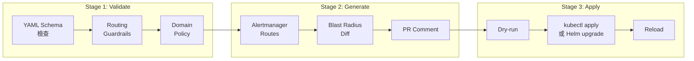

# 場景：GitOps CI/CD 整合指南

> **Language / 語言：** **中文 (Current)** | [English](./gitops-ci-integration.en.md)

> **v2.9.0** | 相關文件：[`architecture-and-design.md`](../architecture-and-design.md)、[`for-platform-engineers.md`](../getting-started/for-platform-engineers.md)、[`cli-reference.md`](../cli-reference.md) · 互動工具：[CI/CD Setup Wizard](../assets/jsx-loader.html?component=../interactive/tools/cicd-setup-wizard.jsx)

## 概述

本指南說明如何將 Dynamic Alerting 平台整合到你的既有 CI/CD 流程中。涵蓋從零開始的完整路徑：

- **快速初始化**：`da-tools init` 一鍵產生所有整合檔案
- **三階段 Pipeline**：Validate → Generate → Apply（GitHub Actions；GitLab 為 Validate → Apply 兩階段，見 §1）
- **四種部署模式**：Kustomize、Helm、ArgoCD、GitOps Native（git-sync sidecar）
- **兩大 CI 平台**：GitHub Actions、GitLab CI

## 前置條件

- 一個可以放 threshold YAML 配置的 Git 倉庫
- 可以拉取 `ghcr.io/vencil/da-tools` Docker image 的 CI 環境
- 目標 Kubernetes 叢集中已部署 Prometheus + Alertmanager
- （推薦）已部署 threshold-exporter（[Helm chart](https://github.com/vencil/Dynamic-Alerting-Integrations/tree/main/components/threshold-exporter)）

## 1. 快速初始化

### 1.1 Using da-tools init

最快的方式是執行 `da-tools init`，它會在你的 repo 中自動產生完整的整合骨架。

**互動模式（推薦）：**

```bash
# 使用 Docker 執行（無需安裝）
docker run --rm -it \
  -v $(pwd):/workspace -w /workspace \
  ghcr.io/vencil/da-tools:latest \
  init
```

CLI 會引導你選擇：CI/CD 平台、部署方式、Rule Pack 組合、租戶名稱。

**非互動模式（CI 友好）：**

```bash
da-tools init \
  --ci both \
  --tenants prod-mariadb,prod-redis \
  --rule-packs mariadb,redis,kubernetes \
  --deploy kustomize \
  --non-interactive
```

### 1.2 產出的檔案結構

```
your-repo/
├── conf.d/
│   ├── _defaults.yaml           # 平台全域預設閾值
│   ├── prod-mariadb.yaml        # 租戶 A 覆寫
│   └── prod-redis.yaml          # 租戶 B 覆寫
├── .github/workflows/
│   └── dynamic-alerting.yaml    # GitHub Actions pipeline
├── .gitlab-ci.d/
│   └── dynamic-alerting.yml     # GitLab CI pipeline（真正的 stages / jobs）
├── .gitlab-ci.yml               # GitLab 根 pipeline 外殼（只有一行 include）
├── kustomize/
│   ├── base/
│   │   └── kustomization.yaml   # ConfigMap generator
│   └── overlays/
│       ├── dev/
│       └── prod/
├── .pre-commit-config.da.yaml   # Pre-commit hooks 片段
└── .da-init.yaml                # 初始化標記（升級偵測用）
```

#### GitLab 為什麼是兩個檔案

GitHub Actions 會自動載入 `.github/workflows/` 底下**所有** workflow，所以那一份
檔案放好就會跑。GitLab 不是：一個專案只會自動載入**根目錄的 `.gitlab-ci.yml`**
這一個路徑，其他位置的 pipeline 檔案在被 `include:` 之前完全不會執行——而且不會
有任何錯誤訊息，因為對 GitLab 來說那只是一個普通檔案。

所以 `da-tools init` 會多產生一份根目錄外殼，內容就只有這樣：

```yaml
# .gitlab-ci.yml
include:
  - local: .gitlab-ci.d/dynamic-alerting.yml
```

被 `include:` 進來的檔案裡的 `stages:` 與 `variables:` 會併入這條 pipeline，所以
外殼不需要重述任何東西。真正的 pipeline 仍然留在 `.gitlab-ci.d/`，方便你把它跟
自己的 CI 設定分開管理、也方便日後升級時整份覆蓋。

**如果你的 repo 已經有根目錄 `.gitlab-ci.yml`**：`da-tools init` **不會**改動它
（覆寫會刪掉你所有的 job，而在一份沒被解析過的 YAML 後面追加內容同樣不安全）。
它會在結束訊息裡把該貼的內容印出來，請自行貼進你既有的 `.gitlab-ci.yml`。
沒貼的話，產生出來的 pipeline 檔案語法完全正確，但一次也不會執行。

⚠️ **請照工具實際印出來的那一段做，不要照這裡的範例硬貼。** 下面是接好線之後
應該長成的**結果**，不是可以直接貼的片段：

```yaml
include:
  - local: .gitlab-ci.d/security.yml           # ← 你原本就有的
  - local: .gitlab-ci.d/dynamic-alerting.yml   # ← 這一行是新增的
```

理由是既有檔案的形狀不只一種，而每一種的安全編輯方式都不同。`include:` 是
top-level key，再寫第二個是重複 key、YAML 只保留其中一個，所以**整段貼上會靜默
刪掉你原本的 include**；但反過來，`include:` 也接受純量（`include: 'a.yml'`）、
flow 序列（`include: ['a.yml']`）與單一 mapping，在這三種底下**加一個清單項目
是語法錯誤，會讓你整份 root pipeline 停止載入**——比沒接線更糟。

`da-tools init` 會分辨這些形狀（含「有 `include:` 但無法安全附加」與「檔案解析
不了」），並針對你的檔案印出對應的指示：能安全附加時給現成區塊，其餘一律給上面
這種**端狀態範例**，請你自己對照著改。工具唯一不會做的事，是在沒看過你的檔案時
遞給你一段「貼上就好」的內容。

#### GitLab 腿沒有 blast-radius 那一步

GitHub 那一份有第三個階段（config-diff 算爆炸半徑、貼成 PR comment），GitLab
這一份**刻意沒有**，原因在映像而不在你的 repo：GitLab 是在 `$DA_TOOLS_IMAGE`
**裡面**跑 `script:`，而那顆映像沒有 `git`，所以比較基準（`git archive <base>`）
在這個平台根本取不到。取不到的基準不會表現成「沒有變更」，而是表現成「每一個
租戶都是新增的」。與其出貨一份不能信的報告，不如先不出貨——缺少的檢查看得見，
錯誤的檢查看不見。追蹤在 [#1358](https://github.com/vencil/Dynamic-Alerting-Integrations/issues/1358)，補回的作法見 [#1444](https://github.com/vencil/Dynamic-Alerting-Integrations/issues/1444)。

## 2. 三階段 CI/CD Pipeline

### 2.1 架構概覽


```mermaid
graph LR
    subgraph "Stage 1: Validate"
        V1["YAML Schema<br/>檢查"]
        V2["Routing<br/>Guardrails"]
        V3["Domain<br/>Policy"]
    end
    subgraph "Stage 2: Generate"
        G1["Alertmanager<br/>Routes"]
        G2["Blast Radius<br/>Diff"]
        G3["PR Comment"]
    end
    subgraph "Stage 3: Apply"
        A1["Dry-run"]
        A2["kubectl apply<br/>或 Helm upgrade"]
        A3["Reload"]
    end
    V1 --> V2 --> V3 --> G1 --> G2 --> G3 --> A1 --> A2 --> A3
```

> ℹ️ 上圖是 **GitHub Actions** 那一份的形狀。**GitLab 那一份沒有 Stage 2**
> （映像裡沒有 `git`，比較基準取不到——理由見 §1「GitLab 腿沒有 blast-radius
> 那一步」），只有 Validate 與 Apply 兩個 stage。

### 2.2 Stage 1: Validate

在每個 PR 和 push 時自動執行。驗證項目：

| 檢查 | 工具 | 說明 |
|------|------|------|
| YAML Schema | `da-tools validate-config` | 租戶 key 合法性、三態值格式 |
| Routing Guardrails | `da-tools validate-config` | group_wait 5s–5m、repeat_interval 1m–72h |
| Domain Policy | `da-tools evaluate-policy` | 業務域約束（如金融禁止 Slack） |
| Custom Rule Lint | `da-tools lint` | 自訂規則禁止列表檢查 |

```bash
# 本地驗證（與 CI 完全相同的檢查）
# 驗證有 FAIL 時 exit code 非零，本身就能當 CI 的成敗判準——不需要額外旗標
da-tools validate-config --config-dir conf.d/
```

### 2.3 Stage 2: Generate

僅在 PR 時執行。產出 Alertmanager 配置片段並計算變更影響範圍。

```bash
# 產出 Alertmanager routes/receivers/inhibit_rules
da-tools generate-routes --config-dir conf.d/ \
  -o .output/alertmanager-routes.yaml --validate

# 計算 blast radius（影響哪些 tenant、哪些 metric）
# CI 中先把 base branch 的 conf.d/ 取出到 conf.d.base/
#
# ⚠️ config-diff 用「結束碼」回報有沒有變更：0=無變更、1=偵測到變更、2=錯誤。
#    所以裸呼叫會在它**正常運作**（真的找到變更）的時候讓這個步驟失敗——
#    而這種 job 通常只在 conf.d 有變更時才觸發，等於每次都失敗。
set +e
da-tools config-diff --old-dir conf.d.base/ --new-dir conf.d/ \
  --format markdown > .output/blast-radius.md
rc=$?
set -e
if [ "$rc" -gt 1 ]; then
  echo "config-diff 以 $rc 結束（預期 0 或 1）" >&2
  exit "$rc"
fi
```

步驟成功結束（`rc` 為 0 或 1）之後，產出的 blast-radius.md 才會被貼成 PR comment，
讓 reviewer 快速判斷影響範圍。

⚠️ **`da-tools init` 產生的 GitHub workflow 是否已帶這段處理，取決於你用的映像。**
`init` 預設拉 `ghcr.io/vencil/da-tools:latest`，而那個 tag 只在 `tools/v*` 線發版時
移動——本文件會在 merge 當下更新，映像則不會。**判斷方式不要看版號，直接看產物**：
產出的 `.github/workflows/dynamic-alerting.yaml` 裡 `Config diff (blast radius)`
那一步有沒有 `set +e` / `rc=$?`。沒有就照上面自己補。

完整的結束碼契約見 [GitOps 部署整合](../integration/gitops-deployment.md)。

### 2.4 Stage 3: Apply

手動觸發（`workflow_dispatch`），需要 `production` environment 審批。三種部署路徑的具體操作見下方 §3。

## 3. 四種部署模式

### 3.1 Kustomize（推薦入門）

適合：已經使用 Kustomize 管理 K8s 資源的團隊。

**概念**：`configMapGenerator` 從 `conf.d/` 的 YAML 檔案自動產生 `threshold-config` ConfigMap，Kubernetes 掛載到 threshold-exporter Pod，exporter 偵測到 SHA-256 變化後自動 hot-reload。

**建立 conf.d/ 到 kustomize/base/ 的連結：**

```bash
cd kustomize/base/
ln -s ../../conf.d/_defaults.yaml .
ln -s ../../conf.d/prod-mariadb.yaml .
ln -s ../../conf.d/prod-redis.yaml .
```

⛔ **上面那些 symlink 指向 `kustomize/base/` 之外，所以 `kustomize build` 必須帶 `--load-restrictor LoadRestrictionsNone`**，否則會失敗於：

```text
security; file '.../kustomize/base/_defaults.yaml' is not in or below '.../kustomize/base'
```

那是 kustomize 預設 load-restrictor 的既定行為，不是連結壞掉。`da-tools init` 產出的 workflow 已經帶了這個旗標。若你的部署工具無法傳旗標（部分 ArgoCD 需要在叢集側設 `kustomize.buildOptions`），改用 `cp` 複製檔案而非連結——代價是 `conf.d/` 每次變更都要重新複製。

**CI 中 apply：**

```bash
kustomize build --load-restrictor LoadRestrictionsNone kustomize/overlays/prod > /tmp/manifests.yaml
kubectl apply --dry-run=server -f /tmp/manifests.yaml
kubectl apply -f /tmp/manifests.yaml
```

### 3.2 Helm

適合：已經使用 threshold-exporter Helm chart 的團隊。

**概念**：將 `conf.d/` 的閾值寫進 Helm values，Helm upgrade 時自動更新 ConfigMap。

```yaml
# environments/prod/values.yaml
thresholdConfig:
  defaults:
    mysql_connections: 80
    container_cpu: 80
  tenants:
    prod-mariadb:
      mysql_connections: "70"
      _routing:
        receiver:
          type: webhook
          url: "https://webhook.prod.example.com/alerts"
```

```bash
helm upgrade --install threshold-exporter \
  oci://ghcr.io/vencil/charts/threshold-exporter \
  -f environments/prod/values.yaml \
  -n monitoring --wait
```

### 3.3 ArgoCD

適合：已經使用 ArgoCD 做 GitOps 的團隊。

**概念**：ArgoCD Application 指向你的 repo，偵測到 `conf.d/` 變更時自動 sync。

```yaml
# argocd/dynamic-alerting.yaml
apiVersion: argoproj.io/v1alpha1
kind: Application
metadata:
  name: dynamic-alerting
  namespace: argocd
spec:
  source:
    repoURL: https://github.com/your-org/your-repo.git
    targetRevision: main
    path: kustomize/overlays/prod
  destination:
    server: https://kubernetes.default.svc
    namespace: monitoring
  syncPolicy:
    automated:
      prune: true
      selfHeal: true
```

### 3.4 GitOps Native Mode（git-sync sidecar）

適合：想要消除 ConfigMap 中間層、讓 threshold-exporter 直接從 Git 讀取配置的團隊。

**概念**：git-sync sidecar 定期 pull Git 倉庫到 emptyDir shared volume，threshold-exporter 的 Directory Scanner 從 shared volume 讀取配置。既有的 SHA-256 hot-reload 機制無縫復用——sidecar 只負責 Git → filesystem 同步，exporter 不需要知道配置來自 Git。

**初始化：**

```bash
da-tools init \
  --ci github \
  --deploy kustomize \
  --config-source git \
  --git-repo git@github.com:your-org/configs.git \
  --git-branch main \
  --git-path conf.d \
  --tenants prod-mariadb,prod-redis \
  --non-interactive
```

這會額外產生 `kustomize/overlays/gitops/` 目錄，包含 git-sync sidecar Deployment patch。

**部署前準備：**

```bash
# 建立 Git 認證 Secret（SSH key 或 HTTPS token）
kubectl create secret generic git-sync-credentials \
  --from-file=ssh-key=$HOME/.ssh/id_ed25519 \
  -n monitoring

# 部署
kubectl apply -k kustomize/overlays/gitops/

# 驗證就緒度
da-tools gitops-check sidecar --namespace monitoring
da-tools gitops-check local --dir /data/config/conf.d
```

**架構**：initContainer 用 `--one-time` 模式先完成首次 clone（確保 exporter 啟動時已有配置），sidecar 持續 `--period` polling 同步後續變更。

**優勢**：Git push → sidecar 自動 pull → exporter hot-reload，端到端自動化，無需 CI/CD 管線的 `kubectl apply` 步驟。

**進階選項：**

- **調整同步間隔**：`--git-period 30` 可將 polling 間隔從預設 60 秒降為 30 秒
- **Webhook 觸發**（秒級延遲）：在 git-sync-patch.yaml 中加入 `--webhook-url=http://localhost:8888` 和 `--webhook-port=8888`，搭配 GitHub/GitLab Webhook 推送變更通知。需額外配置 Service + Ingress 將 webhook 路由到 git-sync container
- **HTTPS 認證**：將 `--from-file=ssh-key` 改為 `--from-literal=username=... --from-literal=password=<token>`

## 4. Shift-Left：Pre-commit Hooks

`da-tools init` 會產出 `.pre-commit-config.da.yaml`，將配置驗證推到開發者本機。

**合併到你的 `.pre-commit-config.yaml`：**

⛔ **「合併」是指把下面的 `- repo: local` 這一項，接進你既有 `.pre-commit-config.yaml` 的 `repos:` 清單底下。** 下面整段是一份完整檔案（第一行就是 `repos:`），**整份附加在既有設定後面會多出第二個頂層 `repos:` 鍵，YAML 只留最後一個、而且不報錯**——實測 `pre-commit validate-config` 仍回 exit 0，你原本的 hook 全數消失。你若還沒有 `.pre-commit-config.yaml`，才可以整份採用。

⚠️ 下面這段是**預設 image**（`ghcr.io/vencil/da-tools:latest`）下的產出內容。你若跑 `init` 時帶了 `--da-tools-image`，兩個 `entry` 的第一個 token 會是你指定的那顆——**以你 repo 根目錄那份 `.pre-commit-config.da.yaml` 為準**，不要照抄下面的 image。

<!-- mirrors-artifact: .pre-commit-config.da.yaml -->
<!-- merge-mode: merge-items -->
<!-- ⛔ 上面那一行是機器讀的。tests/ops/test_generated_ci_artifacts.py 會拿
     `da-tools init` 真的寫出來的那個檔，與下面這個區塊做整份結構比對（兩側都讀產物）。
     不要手改這裡——要改請改 scripts/tools/ops/init_project.py 的
     _gen_precommit_snippet()，這一段會跟著被要求同步。 -->

```yaml
repos:
  - repo: local
    hooks:
      - id: da-validate-config
        name: Validate Dynamic Alerting config
        entry: >-
          ghcr.io/vencil/da-tools:latest
          validate-config --config-dir /src/conf.d
        language: docker_image
        files: ^conf\.d/.*\.ya?ml$
        pass_filenames: false

      - id: da-generate-routes
        name: Generate Alertmanager routes (dry-run)
        entry: >-
          ghcr.io/vencil/da-tools:latest
          generate-routes --config-dir /src/conf.d --dry-run --validate
        language: docker_image
        files: ^conf\.d/.*\.ya?ml$
        pass_filenames: false
```

⚠️ **`language: docker_image` 與 `/src` 開頭的路徑是綁在一起的，不要拆開改。** pre-commit 用 `shlex` 切開 `entry` 之後**不經 shell** 直接 exec，所以寫成 `language: system` + `docker run -v ${PWD}/conf.d:...` 的形式會把字面字串 `${PWD}` 交給 docker，每一個動到 `conf.d/` 的 commit 都失敗。`docker_image` 讓 pre-commit 自己組 `docker run`，並把你的工作樹掛在 `/src`（`-v <cwd>:/src:rw,Z --workdir /src`）——所以 `--config-dir` 必須是 `/src` 相對路徑。

代價講明白：那個掛載是**整個 repo 可讀寫**，比手寫的唯讀 `conf.d` 掛載寬。這是 pre-commit 自己的機制，而跑不起來的 hook 保護不了任何東西。

每次 commit 修改 `conf.d/` 下的檔案時，自動在本機執行驗證（`da-validate-config`）並對路由做一次 dry-run（`da-generate-routes`）。

## 5. 完整流程示例

以下展示一個租戶新增閾值覆寫的完整 GitOps 流程：

```bash
# 1. 編輯租戶配置
vi conf.d/prod-mariadb.yaml
# 將 mysql_connections 從 80 改為 70

# 2. 本機驗證
da-tools validate-config --config-dir conf.d/

# 3. Commit（pre-commit hook 自動驗證）
git add conf.d/prod-mariadb.yaml
git commit -m "feat(db-a): lower connection threshold to 70"

# 4. Push + 開 PR
git push origin feature/lower-connections
# → CI Stage 1 (Validate) 自動跑
# → CI Stage 2 (Generate) 自動算 blast radius、貼 PR comment

# 5. Reviewer 審核 blast radius → Approve → Merge

# 6. 手動觸發 Apply（或 ArgoCD 自動 sync）
# → ConfigMap 更新 → threshold-exporter hot-reload → Prometheus 使用新閾值
```

> ⚠️ **上面第 2 步的 validate 不會提醒你「漏設了什麼」。** 平台有一批 key 是**認得但不主張值**的（`_defaults.yaml` 的 `optional_overrides:` 清單）：你不填，對應告警就永遠不會觸發，而且**驗證與 CI 全程綠燈、不會有任何錯誤訊息**——那是設計，不是漏掉的預設值（這些閾值只有你自己的 baseline 校準得出來）。要看某個 tenant 目前漏了哪些，跑：
>
> ```bash
> python3 scripts/tools/ops/diagnose.py <tenant> \
>   --config-dir conf.d/ --show-inheritance
> ```
>
> 輸出的 `declared` 段就是「你目前放棄了哪些保護」。完整的三類 key 判讀見[租戶快速入門指南](../getting-started/for-tenants.md)。

## 6. 多團隊 Sharded 模式

大型組織中，不同團隊可能各自維護自己的 `conf.d/` 目錄。`assemble_config_dir.py` 可以合併多個來源：

```bash
# 合併多團隊的 conf.d/ 到統一輸出
python3 scripts/tools/ops/assemble_config_dir.py \
  --sources team-dba/conf.d,team-app/conf.d,team-infra/conf.d \
  --output build/merged-config-dir \
  --validate
```

搭配 CI pipeline，各團隊只修改自己的 conf.d/，合併階段自動偵測衝突（如同一 tenant 出現在多個來源）。

## 7. 故障排查

| 問題 | 診斷 | 解法 |
|------|------|------|
| CI validate 失敗 | `da-tools validate-config --config-dir conf.d/` | 每個非 PASS 的檢查會附 `-> Suggested action:` 與 `-> See:`；加 `--json` 可得同樣資訊的機器可讀版。⚠️ 若 `conf.d/` 裡有 **YAML 語法錯**，本工具目前是丟出 Python traceback 而不是報告（兩種模式皆然），此時直接看 traceback 末尾指的檔名與行號 |
| ConfigMap 更新後 exporter 沒反應 | 確認 `reloadInterval` 設定、檢查 exporter logs | `kubectl logs -l app=threshold-exporter -n monitoring` |
| Alertmanager 路由不生效 | `da-tools explain-route --tenant <name> --config-dir conf.d/` | 檢查四層合併順序 |
| Kustomize build 失敗，訊息含 `is not in or below` | **不是 symlink 壞掉**——conf.d 的檔案在 `kustomize/base/` 之外，預設 load-restrictor 拒收。加旗標重跑（見 §3.1） | `kustomize build --load-restrictor LoadRestrictionsNone kustomize/overlays/prod` |
| Kustomize build 失敗，訊息含 `no such file` | 這才是連結本身的問題（例如指向不存在的租戶檔） | `ls -la kustomize/base/` |
| 配置全綠、告警卻從來不觸發 | `diagnose.py <tenant> --config-dir conf.d/ --show-inheritance` | 該 key 若出現在 `declared` 段，代表平台認得它但不主張值——**你不填就是靜默且無錯誤訊息**，填上你自己 baseline 校準出的值即可 |

## 相關文件

- [架構與設計](../architecture-and-design.md) — 核心概念深入
- [CLI 參考](../cli-reference.md) — 所有 da-tools 命令
- [BYO Prometheus 整合](../integration/byo-prometheus-integration.md) — 帶入既有 Prometheus
- [BYO Alertmanager 整合](../integration/byo-alertmanager-integration.md) — 帶入既有 Alertmanager
- [租戶生命週期](tenant-lifecycle.md) — 上線到下架完整流程

---

**文件版本：** v2.9.0
**維護者：** Platform Engineering Team
