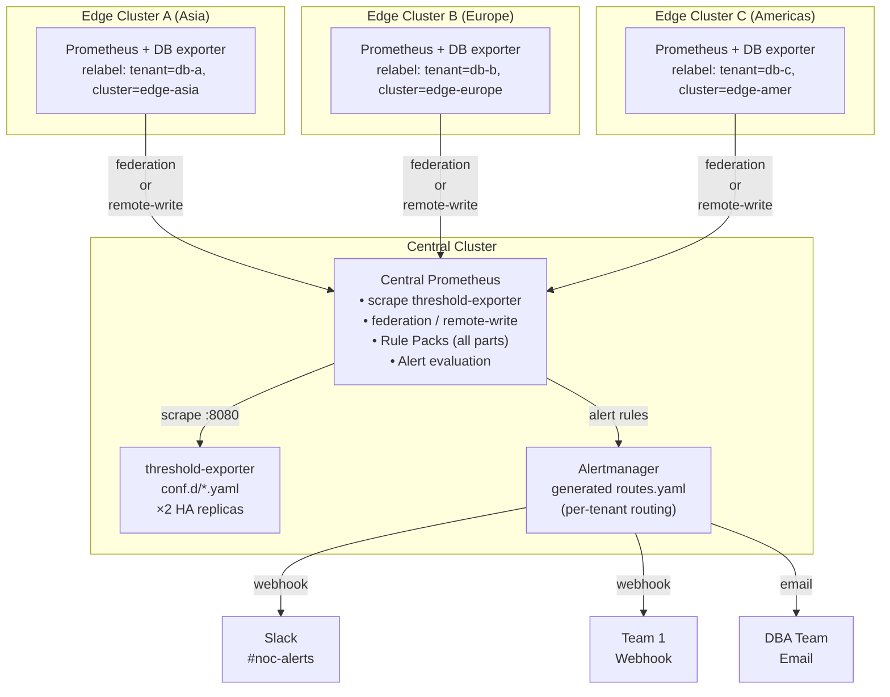

# Scenario: Multi-Cluster Federation Architecture — Central Thresholds + Edge Metrics

> **v2.4.0** | Related docs: [`federation-integration.md`](../federation-integration.md), [`architecture-and-design.md` §2.1](../architecture-and-design.md)

## Problem

Organizations operating multiple Kubernetes clusters (distributed across regions/branches/availability zones) face:

- **Threshold fragmentation**: Each cluster may have its own alerting rules; maintenance is costly and inconsistent
- **Monitoring silos**: Central SRE/NOC lacks unified view across all clusters
- **Configuration duplication**: Same threshold-exporter and Rule Pack deployed in every edge cluster
- **Notification routing chaos**: Multiple Alertmanager configurations to manage
- **Metric explosion**: Edge Prometheus instances cannot share metrics; cardinality grows linearly

## Solution: Scenario A Architecture (Central Evaluation)

Adopt a **central threshold-exporter + edge raw metrics** federation architecture:

- **Central cluster**: Single deployment of threshold-exporter (HA ×2), complete Rule Pack set, unified Alertmanager
- **Edge clusters**: Each deploys DB exporters (PostgreSQL, MySQL, Redis, etc.), producing raw metrics
- **Data flow**: Edge Prometheus instances send raw metrics to central via federation or remote-write
- **Rule evaluation**: All at central Prometheus for logic consistency
- **Unified notifications**: Central Alertmanager dispatches to NOC/teams per tenant routing rules

### Why Scenario A?

| Aspect | Scenario A (Central) | Scenario B (Edge) |
|--------|---------------------|-------------------|
| **threshold-exporter location** | Central ×2 HA | Each edge |
| **Rule evaluation** | Central Prometheus | Edge Prometheus |
| **Data transfer** | Raw metrics | Recording rule outputs |
| **Latency** | ~60–90s | ~5–15s |
| **Complexity** | Low | High (Rule Pack splitting) |
| **Suitable scale** | < 20 edges | 20+ edges or high-latency cross-region |

For most organizations, Scenario A provides the best simplicity-to-capability ratio. Scenario B's Rule Pack stratification will be pursued when Scenario A stabilizes and explicit customer demand arises.

## Architecture Diagram



## Deployment Steps

### Step 1: Edge Cluster Configuration (execute once per edge cluster)

#### 1.1 Set external_labels

Add unique `external_labels` to each edge Prometheus in `prometheus.yml`:

```yaml
global:
  scrape_interval: 15s
  evaluation_interval: 15s
  external_labels:
    cluster: "edge-asia-prod"     # Unique identifier, no duplicates
    environment: "production"      # Optional
    region: "asia-southeast"       # Optional
```

#### 1.2 Tenant Label Injection

Edge Prometheus adds `tenant` labels to exporter metrics. Choose one pattern:

**Pattern 1: Namespace-to-Tenant 1:1 Mapping** (Clean namespace isolation)

```yaml
scrape_configs:
  - job_name: "mariadb-exporter"
    kubernetes_sd_configs:
      - role: endpoints
        namespaces:
          names: ["db-a", "db-b", "db-c"]  # One tenant per namespace
    relabel_configs:
      - source_labels: [__meta_kubernetes_namespace]
        target_label: tenant
        # db-a namespace → tenant=db-a
```

**Pattern 2: Pod Label-to-Tenant Mapping** (Dynamic or mixed deployments)

```yaml
scrape_configs:
  - job_name: "db-exporters"
    kubernetes_sd_configs:
      - role: pod
    relabel_configs:
      - source_labels: [__meta_kubernetes_pod_label_tenant]
        target_label: tenant
      - source_labels: [tenant]
        regex: ""
        action: drop  # Drop pods without tenant label
```

**Pattern 3: N:1 Multi-Namespace to Single Tenant** (Multi-environment)

```yaml
relabel_configs:
  # Collect namespace and pod label first
  - source_labels: [__meta_kubernetes_namespace, __meta_kubernetes_pod_label_env]
    separator: "-"
    target_label: tenant_candidate

  # Map: prod-ns or staging-ns → db-a
  - source_labels: [tenant_candidate]
    regex: "(prod|staging)-.+"
    replacement: "db-a"
    target_label: tenant
```

Auto-generate with tooling:

```bash
python3 scripts/tools/ops/scaffold_tenant.py \
  --tenant db-a \
  --db postgresql \
  --namespaces prod-ns,staging-ns,canary-ns \
  --output relabel-snippet.yaml
# Outputs relabel_configs snippet suitable for pasting into scrape_configs
```

#### 1.3 Deploy DB Exporters

Deploy necessary exporters per database type (no threshold-exporter needed). Common exporter images:

| Database | Exporter | Metric prefix |
|----------|----------|---------------|
| PostgreSQL | `prometheuscommunity/postgres-exporter` | `pg_*` |
| MariaDB/MySQL | `prometheuscommunity/mysqld-exporter` | `mysql_*` |
| Redis | `prometheuscommunity/redis-exporter` | `redis_*` |
| MongoDB | `prometheuscommunity/mongodb-exporter` | `mongodb_*` |

Deployment uses standard K8s Deployment + Service; ensure exporter Service has `prometheus.io/scrape: "true"` annotation.

#### 1.4 Verify Edge Cluster Configuration

```bash
# Automated verification (recommended)
da-tools federation-check edge --prometheus http://edge-prometheus:9090

# Manual verification of core items
curl -s "http://edge-prometheus:9090/api/v1/query?query=pg_up" | \
  jq '.data.result[0].metric | {tenant, cluster}'
# Expected: {"tenant":"db-a","cluster":"edge-asia-prod"}
```

### Step 2: Central Cluster Configuration (one-time deployment)

#### 2.1 Choose Data Transfer Method

**Option A: Prometheus Federation** (Recommended: < 10 edge clusters)

Pros: Minimal edge changes, no TLS certificates; Cons: ~60–90s latency

```yaml
# prometheus.yml (central)
scrape_configs:
  # 1. Scrape local threshold-exporter
  - job_name: "threshold-exporter"
    static_configs:
      - targets: ["localhost:8080"]

  # 2. Federation from Asia edge
  - job_name: "federation-edge-asia"
    honor_labels: true
    metrics_path: "/federate"
    params:
      "match[]":
        - '{tenant!=""}'  # Only fetch tenant-labeled metrics
    static_configs:
      - targets: ["prometheus-edge-asia.prod.example.com:9090"]
        labels:
          federated_from: "asia"
    scrape_interval: 30s
    scrape_timeout: 25s

  # 3. Federation from Europe edge
  - job_name: "federation-edge-europe"
    honor_labels: true
    metrics_path: "/federate"
    params:
      "match[]":
        - '{tenant!=""}'
    static_configs:
      - targets: ["prometheus-edge-europe.prod.example.com:9090"]
        labels:
          federated_from: "europe"
    scrape_interval: 30s
    scrape_timeout: 25s
```

**Option B: Remote Write** (Suitable: 10+ edge clusters or high-latency regions)

Pros: Edge push, low latency (5–15s); Cons: Requires TLS certificates, central must enable receiver

**Edge configuration:**

```yaml
# prometheus.yml (edge)
remote_write:
  - url: "https://central-prometheus.prod.example.com/api/v1/write"
    write_relabel_configs:
      - source_labels: [tenant]
        regex: ".+"
        action: keep  # Only push tenant-labeled metrics
    queue_config:
      max_samples_per_send: 5000
      batch_send_deadline: 5s
    tls_config:
      cert_file: /etc/certs/client.crt
      key_file: /etc/certs/client.key
      ca_file: /etc/certs/ca.crt
```

**Central configuration:**

```yaml
# Prometheus startup args
prometheus --web.enable-remote-write-receiver \
  --config.file=prometheus.yml
```

#### 2.2 Deploy threshold-exporter HA

```bash
helm upgrade --install threshold-exporter \
  oci://ghcr.io/vencil/charts/threshold-exporter --version 2.4.0 \
  -n monitoring --create-namespace \
  -f values-override.yaml   # replicaCount: 2 for HA
```

Verify ×2 replicas running: `kubectl get pods -n monitoring -l app=threshold-exporter`

#### 2.3 Configure Global Tenant Thresholds

Create tenant configs in central cluster's `conf.d/` (same as single-cluster deployment):

```yaml
# conf.d/_defaults.yaml
defaults:
  pg_connections: "80"
  pg_replication_lag: "30"
  mysql_connections: "80"
  mysql_cpu: "80"

# conf.d/db-a.yaml (Asia tenant)
tenants:
  db-a:
    _namespaces: ["prod-ns", "staging-ns"]  # Mapped namespaces on edge
    _cluster: "edge-asia-prod"               # Edge cluster identifier
    pg_connections: "70"
    pg_connections_critical: "90"
    _routing:
      receiver:
        type: "webhook"
        url: "https://noc.example.com/api/asia/db-alerts"
        channel: "#db-a-alerts"

# conf.d/db-b.yaml (Europe tenant)
tenants:
  db-b:
    _namespaces: ["prod-eu"]
    _cluster: "edge-europe-prod"
    mysql_connections: "60"
    _routing:
      receiver:
        type: "slack"
        api_url: "https://hooks.slack.com/services/xxx"
        channel: "#dba-eu"
```

#### 2.4 Deploy Rule Pack

Mount complete Rule Pack set to central Prometheus (same as single-cluster):

```bash
# Helm values.yaml
prometheus:
  prometheusSpec:
    additionalPrometheusRules:
      - name: threshold-rules
        data:
          rule-pack-mariadb.yaml: |
            # Content...
          rule-pack-postgresql.yaml: |
            # Content...
```

Or via ConfigMap mount:

```bash
kubectl create configmap rule-packs \
  --from-file=rule-packs/ \
  -n monitoring

# prometheus.yaml
global:
  rule_files:
    - '/etc/prometheus/rules/*.yaml'

volumes:
  - name: rule-packs
    configMap:
      name: rule-packs
```

#### 2.5 Verify Central Cluster Configuration

```bash
# Automated verification (recommended)
da-tools federation-check central --prometheus http://central-prometheus:9090

# JSON output (suitable for CI)
da-tools federation-check central --prometheus http://central-prometheus:9090 --json
```

Tool automatically checks: edge metrics received, threshold-exporter scrape, recording rules output, alert rules loaded.

## End-to-End Verification

```bash
# One-command end-to-end verification (edge + central + cross-cluster vector matching)
da-tools federation-check e2e \
  --prometheus http://central-prometheus:9090 \
  --edge-urls http://edge-asia:9090,http://edge-europe:9090

# Tenant-level verification
da-tools diagnose db-a --prometheus http://central-prometheus:9090
da-tools diagnose db-b --prometheus http://central-prometheus:9090
```

Verification items: cross-cluster metric visibility, alert evaluation and routing, notification routing correctness.

## Deployment Architecture Variants

- **Variant 1: All-K8s (Recommended)**: All components run in Kubernetes (threshold-exporter ×2 + Prometheus + Alertmanager + Grafana).
- **Variant 2: K8s Edges + VM Central**: Edge K8s clusters push via remote-write to central Prometheus on VM (suitable for large data center transition architecture).

## Performance and Capacity Planning

### Cardinality Growth

Each new edge cluster increases central Prometheus cardinality linearly.

**Estimation formula**:

```
Total Cardinality = Base + (Edges × Metrics per Edge)

Base ≈ threshold-exporter metrics (1000–2000)
Metrics per Edge ≈ DB exporter metrics (500–2000)

Example: 3 edges, 1000 metrics each
    = 1500 (base) + 3 × 1000 = 4500 series
```

**Mitigation strategies**:

1. **Federation match[] narrowing**: Only fetch `{tenant!=""}`
2. **Remote-write filtering**: Edge `write_relabel_configs` pushes only necessary metrics
3. **Cardinality monitoring**:

```bash
# Track cardinality trends
curl -s http://central-prometheus:9090/api/v1/query?query='prometheus_tsdb_head_series' | \
  jq '.data.result[].value'

# If exceeding 1M series, consider:
# - Reducing edge-pushed metrics
# - Upgrading central Prometheus resources
# - Evaluating Scenario B (edge evaluation) architecture
```

### Latency Characteristics

| Method | Worst-case latency | Components |
|--------|-------------------|------------|
| **Federation** | ~90s | Edge scrape (15s) + Federate scrape (30s) + Recording rule (15s) + Alert for (30s) |
| **Remote-write** | ~30s | Edge scrape (15s) + Queue + Recording rule (15s) |

For sub-second response scenarios, prefer remote-write; for latency-tolerant scenarios, federation is simpler.

## Troubleshooting

```bash
# Automated diagnostics (recommended)
da-tools federation-check e2e \
  --prometheus http://central:9090 \
  --edge-urls http://edge-asia:9090,http://edge-europe:9090
```

### Common Issues

| Symptom | Diagnosis direction | Common causes |
|---------|-------------------|---------------|
| Edge metrics not reaching central | `federation-check edge` → check tenant label + federate endpoint | tenant label not injected, federation match[] too strict, network unreachable |
| Alerts not firing | `federation-check central` → check alert rules + AM routing | tenant in silent/maintenance, routing missing tenant matcher, notification channel invalid |
| Recording rule no output | `federation-check central` → check rule evaluation errors | Rule Pack not mounted, metric naming mismatch |

## Checklist

**Edge clusters**:

- [ ] external_labels set (cluster value unique)
- [ ] Tenant label relabel_config correct
- [ ] DB exporter running
- [ ] Federation or remote-write enabled
- [ ] Metrics verified reaching central

**Central cluster**:

- [ ] threshold-exporter × 2 HA running
- [ ] Rule Pack complete
- [ ] Alertmanager tenant routing configured
- [ ] All edge metrics visible
- [ ] Recording rules evaluating
- [ ] Alert rules firing correctly

**End-to-end**:

- [ ] Cross-edge metric queries work
- [ ] Alerts routed to correct notification channels per tenant
- [ ] Grafana dashboard shows global view
- [ ] No cardinality limit warnings

## Related Resources

| Resource | Relevance |
|----------|-----------|
| ["Scenario: Multi-Cluster Federation Architecture — Central Thresholds + Edge Metrics"](multi-cluster-federation.en.md) | ⭐⭐⭐ |
| ["Federation Integration Guide"](../federation-integration.en.md) | ⭐⭐⭐ |
| ["Advanced Scenarios & Test Coverage"](advanced-scenarios.en.md) | ⭐⭐ |
| ["Scenario: Same Alert, Different Semantics — Platform/NOC vs Tenant Dual-Perspective Notifications"](alert-routing-split.en.md) | ⭐⭐ |
| ["Scenario: Automated Shadow Monitoring Cutover Workflow"](shadow-monitoring-cutover.en.md) | ⭐⭐ |
| ["Scenario: Complete Tenant Lifecycle Management"](tenant-lifecycle.en.md) | ⭐⭐ |
