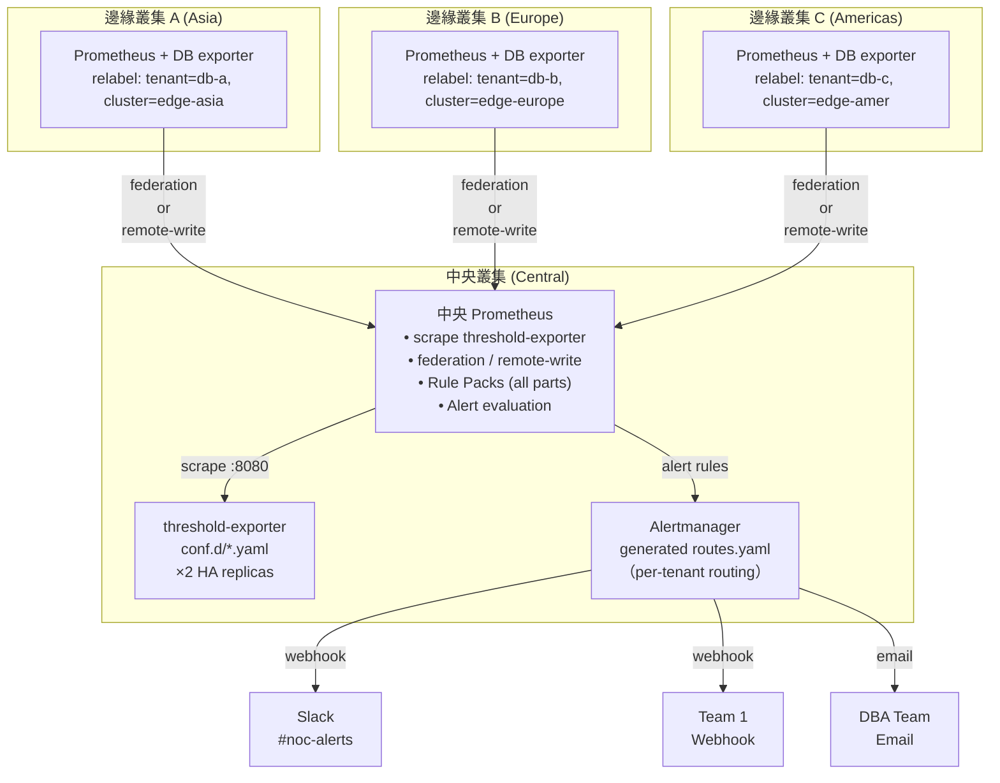

# 場景：多叢集聯邦架構 — 中央閾值 + 邊緣指標

> **v2.0.0-preview** | 相關文件：[`federation-integration.md`](../federation-integration.md)、[`architecture-and-design.md` §2.1](../architecture-and-design.md)

## 問題

組織運營多個 Kubernetes 叢集（分佈在不同地域/分支/區域），面臨：

- **閾值離散**：每個叢集可能有自己的告警規則，維護成本高且規則不一致
- **監控孤島**：中央 SRE/NOC 無法統一視圖管理全域告警
- **重複配置**：同一個 threshold-exporter 和 Rule Pack 部署在每個邊緣叢集
- **通知路由混亂**：多套不同的 Alertmanager 配置
- **資料爆炸**：邊緣 Prometheus 之間無法共享指標，cardinality 成線性增長

## 解決方案：場景 A 架構（中央評估）

採用**中央 threshold-exporter + 邊緣原始指標**的聯邦架構：

- **中央叢集**：統一部署 threshold-exporter（HA ×2）、Rule Pack（完整集合）、Alertmanager（全域路由）
- **邊緣叢集**：各自部署 DB exporter（PostgreSQL、MySQL、Redis 等），產出原始指標
- **資料流向**：邊緣 Prometheus 透過 federation 或 remote-write 將原始指標推至中央
- **規則評估**：全部在中央 Prometheus 進行，保證邏輯一致性
- **統一通知**：中央 Alertmanager 根據 tenant 配置分派通知至各自的 NOC/團隊

### 為什麼選場景 A？

| 場景 | threshold-exporter | Rule 評估位置 | 資料傳輸 | 延遲 | 複雜度 | 適用規模 |
|------|-------------------|--------------|--------|------|--------|---------|
| **A（本方案）** | 中央 ×2 HA | 中央 Prometheus | 原始指標 | ~60–90s | 低 | < 20 邊緣 |
| B（邊緣評估） | 各邊緣 | 邊緣 Prometheus | Recording rule | ~5–15s | 高 | 20+ 邊緣或跨區高延遲 |

對大多數組織，場景 A 提供最好的簡單性和可維護性權衡。場景 B 的 Rule Pack 分層待場景 A 穩定且有明確客戶需求後推進。

## 架構圖



## 部署步驟

### 步驟 1：邊緣叢集配置（每個邊緣叢集執行一次）

#### 1.1 設定 external_labels

在每個邊緣 Prometheus 的 `prometheus.yml` 中添加唯一的 `external_labels`：

```yaml
global:
  scrape_interval: 15s
  evaluation_interval: 15s
  external_labels:
    cluster: "edge-asia-prod"     # 唯一識別，不重複
    environment: "production"      # 選填
    region: "asia-southeast"       # 選填
```

#### 1.2 Tenant 標籤注入

邊緣 Prometheus 負責將 exporter 指標打上 `tenant` 標籤。選擇一種模式：

**模式 1：Namespace-to-Tenant 1:1 映射**（適合清晰的命名空間隔離）

```yaml
scrape_configs:
  - job_name: "mariadb-exporter"
    kubernetes_sd_configs:
      - role: endpoints
        namespaces:
          names: ["db-a", "db-b", "db-c"]  # 每個 NS 一個 tenant
    relabel_configs:
      - source_labels: [__meta_kubernetes_namespace]
        target_label: tenant
        # db-a namespace → tenant=db-a
```

**模式 2：Pod Label-to-Tenant 映射**（適合動態或混合部署）

```yaml
scrape_configs:
  - job_name: "db-exporters"
    kubernetes_sd_configs:
      - role: pod
    relabel_configs:
      - source_labels: [__meta_kubernetes_pod_label_tenant]
        target_label: tenant
      - source_labels: [tenant]
        regex: ""
        action: drop  # 丟棄沒有 tenant label 的 pod
```

**模式 3：N:1 多命名空間到單 Tenant 映射**（適合多環境）

```yaml
relabel_configs:
  # 先取 namespace 和 pod label
  - source_labels: [__meta_kubernetes_namespace, __meta_kubernetes_pod_label_env]
    separator: "-"
    target_label: tenant_candidate

  # 映射邏輯：prod-ns 或 staging-ns → db-a
  - source_labels: [tenant_candidate]
    regex: "(prod|staging)-.+"
    replacement: "db-a"
    target_label: tenant
```

使用工具自動產出：

```bash
python3 scripts/tools/scaffold_tenant.py \
  --tenant db-a \
  --db postgresql \
  --namespaces prod-ns,staging-ns,canary-ns \
  --output relabel-snippet.yaml
# 產出可貼入 scrape_configs 的 relabel_configs 段落
```

#### 1.3 部署 DB Exporter

邊緣叢集根據需要部署相應的 exporter（不需要 threshold-exporter）。常見 exporter 映像：

| 資料庫 | Exporter | 指標前綴 |
|------|----------|--------|
| PostgreSQL | `prometheuscommunity/postgres-exporter` | `pg_*` |
| MariaDB/MySQL | `prometheuscommunity/mysqld-exporter` | `mysql_*` |
| Redis | `prometheuscommunity/redis-exporter` | `redis_*` |
| MongoDB | `prometheuscommunity/mongodb-exporter` | `mongodb_*` |

部署方式為標準 K8s Deployment + Service，確保 exporter Service 帶有 `prometheus.io/scrape: "true"` annotation。

#### 1.4 驗證邊緣叢集配置

```bash
# 自動化驗證（推薦）
da-tools federation-check edge --prometheus http://edge-prometheus:9090

# 手動驗證核心項目
curl -s "http://edge-prometheus:9090/api/v1/query?query=pg_up" | \
  jq '.data.result[0].metric | {tenant, cluster}'
# 預期：{"tenant":"db-a","cluster":"edge-asia-prod"}
```

### 步驟 2：中央叢集配置（一次性部署）

#### 2.1 選擇資料流傳輸方案

**方案 A：Prometheus Federation**（推薦：< 10 邊緣叢集）

優點：邊緣 Prometheus 變更少，無需 TLS 證書；缺點：延遲約 60–90 秒

```yaml
# prometheus.yml (central)
scrape_configs:
  # 1. Scrape local threshold-exporter
  - job_name: "threshold-exporter"
    static_configs:
      - targets: ["localhost:8080"]

  # 2. Federation from Asia edge
  - job_name: "federation-edge-asia"
    honor_labels: true
    metrics_path: "/federate"
    params:
      "match[]":
        - '{tenant!=""}'  # 只拉取帶 tenant label 的指標
    static_configs:
      - targets: ["prometheus-edge-asia.prod.example.com:9090"]
        labels:
          federated_from: "asia"
    scrape_interval: 30s
    scrape_timeout: 25s

  # 3. Federation from Europe edge
  - job_name: "federation-edge-europe"
    honor_labels: true
    metrics_path: "/federate"
    params:
      "match[]":
        - '{tenant!=""}'
    static_configs:
      - targets: ["prometheus-edge-europe.prod.example.com:9090"]
        labels:
          federated_from: "europe"
    scrape_interval: 30s
    scrape_timeout: 25s
```

**方案 B：Remote Write**（適合：10+ 邊緣叢集或高延遲環境）

優點：邊緣推送，低延遲（5–15s）；缺點：需要 TLS 證書、中央 Prometheus 需啟用 receiver

**邊緣配置：**

```yaml
# prometheus.yml (edge)
remote_write:
  - url: "https://central-prometheus.prod.example.com/api/v1/write"
    write_relabel_configs:
      - source_labels: [tenant]
        regex: ".+"
        action: keep  # 只推送帶 tenant 的指標
    queue_config:
      max_samples_per_send: 5000
      batch_send_deadline: 5s
    tls_config:
      cert_file: /etc/certs/client.crt
      key_file: /etc/certs/client.key
      ca_file: /etc/certs/ca.crt
```

**中央配置：**

```yaml
# prometheus 啟動參數
prometheus --web.enable-remote-write-receiver \
  --config.file=prometheus.yml
```

#### 2.2 部署 threshold-exporter HA

```bash
helm upgrade --install threshold-exporter \
  oci://ghcr.io/vencil/charts/threshold-exporter --version 1.9.0 \
  -n monitoring --create-namespace \
  -f values-override.yaml   # replicaCount: 2 for HA
```

確認 ×2 副本運行：`kubectl get pods -n monitoring -l app=threshold-exporter`

#### 2.3 配置全域租戶閾值

在中央叢集的 `conf.d/` 中建立租戶配置（與單叢集部署相同）：

```yaml
# conf.d/_defaults.yaml
defaults:
  pg_connections: "80"
  pg_replication_lag: "30"
  mysql_connections: "80"
  mysql_cpu: "80"

# conf.d/db-a.yaml (Asia tenant)
tenants:
  db-a:
    _namespaces: ["prod-ns", "staging-ns"]  # 邊緣對應的 NS
    _cluster: "edge-asia-prod"               # 邊緣叢集識別
    pg_connections: "70"
    pg_connections_critical: "90"
    _routing:
      receiver:
        type: "webhook"
        url: "https://noc.example.com/api/asia/db-alerts"
        channel: "#db-a-alerts"

# conf.d/db-b.yaml (Europe tenant)
tenants:
  db-b:
    _namespaces: ["prod-eu"]
    _cluster: "edge-europe-prod"
    mysql_connections: "60"
    _routing:
      receiver:
        type: "slack"
        api_url: "https://hooks.slack.com/services/xxx"
        channel: "#dba-eu"
```

#### 2.4 部署 Rule Pack

中央 Prometheus 掛載完整的 Rule Pack 集合（與單叢集相同）：

```bash
# Helm values.yaml
prometheus:
  prometheusSpec:
    additionalPrometheusRules:
      - name: threshold-rules
        data:
          rule-pack-mariadb.yaml: |
            # 內容...
          rule-pack-postgresql.yaml: |
            # 內容...
```

或直接掛載 ConfigMap：

```bash
kubectl create configmap rule-packs \
  --from-file=rule-packs/ \
  -n monitoring

# prometheus.yaml
global:
  rule_files:
    - '/etc/prometheus/rules/*.yaml'

volumes:
  - name: rule-packs
    configMap:
      name: rule-packs
```

#### 2.5 驗證中央叢集配置

```bash
# 自動化驗證（推薦）
da-tools federation-check central --prometheus http://central-prometheus:9090

# JSON 輸出（適合 CI）
da-tools federation-check central --prometheus http://central-prometheus:9090 --json
```

工具自動檢查：邊緣指標接收、threshold-exporter scrape、recording rules 產出、alert rules 載入。

## 端到端驗證

```bash
# 一鍵端到端驗證（edge + central + 跨叢集向量匹配）
da-tools federation-check e2e \
  --prometheus http://central-prometheus:9090 \
  --edge-urls http://edge-asia:9090,http://edge-europe:9090

# 租戶級別驗證
da-tools diagnose db-a --prometheus http://central-prometheus:9090
da-tools diagnose db-b --prometheus http://central-prometheus:9090
```

驗證項目：跨叢集指標可見性、告警評估和路由、通知路由正確性。

## 部署架構變種

- **變種 1：全 K8s（推薦）**：所有組件在 Kubernetes 中運行（threshold-exporter ×2 + Prometheus + Alertmanager + Grafana）。
- **變種 2：K8s 邊緣 + VM 中央**：邊緣 K8s 透過 remote-write 推送至中央虛擬機上的 Prometheus（適合大規模數據中心過渡架構）。

## 性能和容量規劃

### Cardinality 增長

每新增一個邊緣叢集，中央 Prometheus 的 cardinality 成線性增長。

**估算公式**：

```
Total Cardinality = Base + (Edges × Metrics per Edge)

Base ≈ threshold-exporter metrics (1000–2000)
Metrics per Edge ≈ DB exporter metrics (500–2000)

例：3 個邊緣，每個邊緣 1000 metrics
    = 1500（base）+ 3 × 1000 = 4500 series
```

**緩解措施**：

1. **Federation match[] 限縮**：只拉取 `{tenant!=""}`
2. **Remote-write 過濾**：邊緣 `write_relabel_configs` 只推送必要指標
3. **Cardinality 監控**：

```bash
# 追蹤 cardinality 趨勢
curl -s http://central-prometheus:9090/api/v1/query?query='prometheus_tsdb_head_series' | \
  jq '.data.result[].value'

# 若超過 100 萬 series，考慮：
# - 縮減邊緣推送的指標數
# - 升級中央 Prometheus 資源
# - 評估場景 B（邊緣評估）架構
```

### 延遲特徵

| 方案 | 最壞延遲 | 組成成分 |
|------|---------|--------|
| **Federation** | ~90s | Edge scrape (15s) + Federate scrape (30s) + Recording rule (15s) + Alert for (30s) |
| **Remote-write** | ~30s | Edge scrape (15s) + Queue + Recording rule (15s) |

對需要秒級回應的場景，優先 remote-write；對延遲容忍度高的場景，federation 更簡單。

## 故障排查

```bash
# 自動化診斷（推薦）
da-tools federation-check e2e \
  --prometheus http://central:9090 \
  --edge-urls http://edge-asia:9090,http://edge-europe:9090
```

### 常見問題

| 症狀 | 診斷方向 | 常見原因 |
|------|----------|----------|
| 邊緣指標未到達中央 | `federation-check edge` → 檢查 tenant label + federate 端點 | tenant label 未注入、federation match[] 過嚴、網路不可達 |
| 告警未觸發 | `federation-check central` → 檢查 alert rules + AM 路由 | tenant 處於 silent/maintenance、路由缺少 tenant matcher、通知通道無效 |
| Recording rule 無輸出 | `federation-check central` → 檢查 rule evaluation errors | Rule Pack 未掛載、指標命名不匹配 |

## 檢查清單

**邊緣叢集**：

- [ ] external_labels 已設置（cluster 值唯一）
- [ ] Tenant label relabel_config 正確
- [ ] DB exporter 正常運行
- [ ] Federation 或 remote-write 已啟用
- [ ] 驗證指標到達中央

**中央叢集**：

- [ ] threshold-exporter × 2 HA 運行
- [ ] Rule Pack 完整部署
- [ ] Alertmanager 已配置租戶路由
- [ ] 所有邊緣指標可見
- [ ] Recording rule 正常評估
- [ ] 告警規則正常觸發

**端到端**：

- [ ] 跨邊緣的指標查詢正確
- [ ] 告警按照租戶路由到正確的通知通道
- [ ] Grafana 儀表板顯示全域視圖
- [ ] 無 cardinality 超限警告

## 互動工具

> 💡 **互動工具** — 下列工具可直接在 [Interactive Tools Hub](https://vencil.github.io/Dynamic-Alerting-Integrations/) 中測試：
>
> - [Rule Pack Selector](https://vencil.github.io/Dynamic-Alerting-Integrations/assets/jsx-loader.html?component=../tool-file.jsx) — 選擇適用於聯邦架構的 Rule Pack
> - [Dependency Graph](https://vencil.github.io/Dynamic-Alerting-Integrations/assets/jsx-loader.html?component=../tool-file.jsx) — 視覺化 Rule Pack 的依賴關係
> - [Capacity Planner](https://vencil.github.io/Dynamic-Alerting-Integrations/assets/jsx-loader.html?component=../tool-file.jsx) — 估算多叢集部署的資源需求

## 相關資源

| 資源 | 相關性 |
|------|--------|
| ["場景：多叢集聯邦架構 — 中央閾值 + 邊緣指標"](scenarios/multi-cluster-federation.md) | ⭐⭐⭐ |
| ["Federation Integration Guide"](./federation-integration.md) | ⭐⭐⭐ |
| ["進階場景與測試覆蓋"](scenarios/advanced-scenarios.md) | ⭐⭐ |
| ["場景：同一 Alert、不同語義 — Platform/NOC vs Tenant 雙視角通知"](scenarios/alert-routing-split.md) | ⭐⭐ |
| ["場景：Shadow Monitoring 全自動切換工作流"](scenarios/shadow-monitoring-cutover.md) | ⭐⭐ |
| ["場景：租戶完整生命週期管理"](scenarios/tenant-lifecycle.md) | ⭐⭐ |
