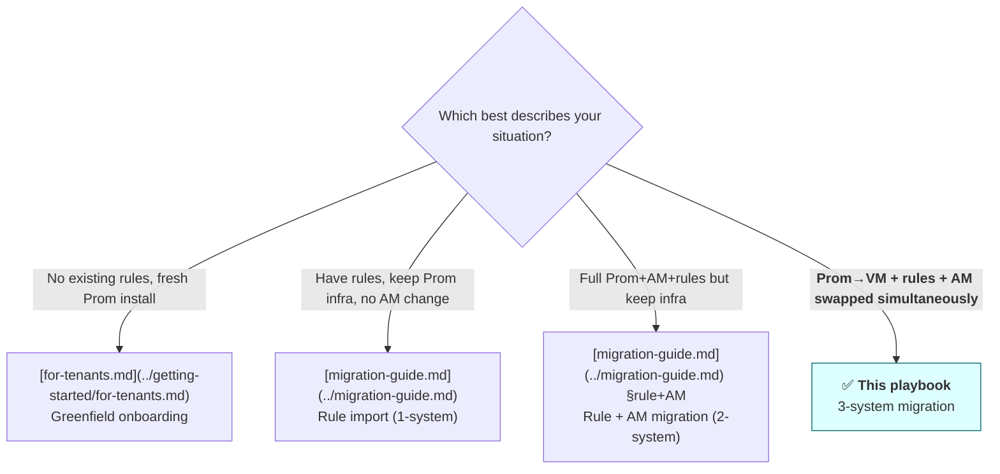
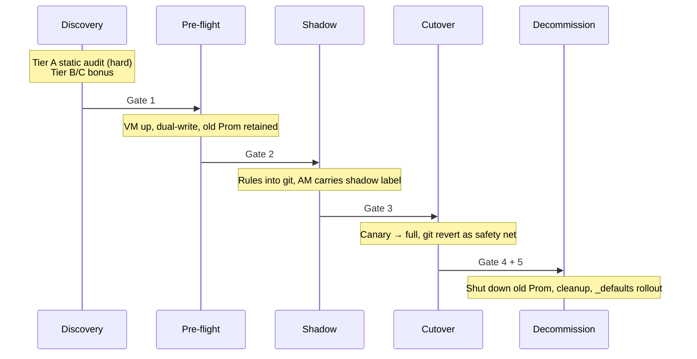

# Multi-System Migration Playbook

> **When this applies**: the customer is swapping storage backend (Prom→VM), the rule layer, and AM routing simultaneously, plus adopting the platform's `_defaults.yaml` metric-split feature. **Does not apply** to: greenfield / 1-system / 2-system → see the decision tree below for the correct redirect.
>
> **Tone assumption**: this playbook assumes the customer already runs a mature Prometheus + Alertmanager operation. **It does not teach Prometheus fundamentals**; it maps existing customer concepts onto this platform.

---

## 0. Three-tier reading speed (how to read this document)

Every Phase has the same structure; pick your tier by role:

| Who you are | Read | Time budget |
|---|---|---|
| **Manager / cross-team broadcast** | The 「30-sec TL;DR」 (3 bullets) at the start of each Phase | Entire playbook < 5 min |
| **Architect / SRE lead** (decision-making) | 30-sec TL;DR + Architect Narrative + Gates + Decision Trees | Entire playbook ~30 min |
| **On-call / Executor** (running cutover at 3 AM) | Jump to the `<details>` "Cutover Checklist" + bash code blocks | Single Phase < 5 min |

Design motivation: **readers should not have to extract their own TL;DR**. We extract it for them; people who shouldn't run commands don't see them (collapsibles default-closed); people who should can copy-paste directly.

---

## 1. Which type of customer am I? (Routing Decision Tree)



If you're unsure which path applies, ask yourself: "**Are you swapping the underlying storage?**" Yes → this playbook; no → migration-guide.md.

---

## 2. The 5-Phase landscape



All 5 Gates use **invariants** (not "alert counts match") — see §10.

---

## 3. Phase 0 — Discovery & Inventory

### 30-sec TL;DR
- Three-tier audit: A static (hard gate) / B live snapshot (soft) / C historical telemetry (bonus)
- Dual output: **`.da/migration-state.json`** (machine-readable, drives later-phase automation) + Markdown summary (for PR description / human readers)
- Schema: see [migration-state.md](../schemas/migration-state.md) (**ZH only — [#409](https://github.com/vencil/Dynamic-Alerting-Integrations/issues/409)**)

### Architect Narrative

#### Why Phase 0 is a hard gate and can't be skipped

**"I think I know my own inventory" is the most common illusion in enterprise monitoring**. A Prometheus deployment more than 5 years old accumulates: rules that were committed but no-one remembers why, receivers whose webhook URLs belong to people who left the company, tenant IDs hard-coded into PromQL by some long-ago hotfix that no-one removed, multi-region deployments where rules diverged due to team-split, and Operator-migration leftovers where ConfigMap + `PrometheusRule` CRD live in parallel.

Phase 0 forces **one thorough inventory** — not to fix everything perfectly (that's Phase 3), but to give the customer and us a shared mental model of "what we are about to migrate". Skipping discovery = every step in Phase 1+ is built on assumptions rather than facts.

#### Why the three tiers are split this way

Customer telemetry maturity varies dramatically — from "only Prom is online, no long-term storage at all" to "Thanos + ELK + Datadog". A single hard gate for all is unrealistic. The three tiers map to three customer states:

- **Tier A — Static analysis** (hard gate, accessible to every customer)
  Fully offline analysis of rule files themselves: `PrometheusRule` CRD / `rules.yaml` / vmalert ConfigMap. Catches: syntax errors, orphan rules (no matching receiver), rules without a route, unused receivers, tenant IDs that violate schema, cross-file duplicate definitions. **Typical 100-rule customer < 30 seconds to run**. Output is `.da/migration-state.json` + Markdown summary (dual output details in [migration-state.md](../schemas/migration-state.md)).

- **Tier B — Live snapshot** (soft gate, ~80% of customers can reach this)
  Run `ALERTS{}` against the live Prometheus to grab "the set of alerts currently firing" + hit AM's `/api/v2/alerts/groups` for active routes. Answers "what is actually screaming right now?" — a question Tier A cannot. Limits: requires Prom auth + reachability; some shops' policy doesn't allow query access; high-cardinality customers may hit query timeouts. **Missing Tier B does not block Phase 1.**

- **Tier C — Historical telemetry** (bonus, ~20% of customers can reach this)
  Run "alert fire distribution over the last N days / which rules haven't triggered in a year / which receivers have ever received a webhook" against Thanos / VM long-retention / ELK alert logs. **Most customers don't have this layer** — doesn't block; the Shadow phase performs dynamic noise filtering as a substitute.

#### Why dual-output format

JSON (`.da/migration-state.json`) + Markdown summary are derived from the same internal state. **They are not two separately-maintained files; they are one source rendered as two views**:

- JSON: machine-readable. Phase 3 cutover candidate selector / CI gates / later-phase automation advancement logs all depend on it
- Markdown: human-readable. Paste into PR descriptions for reviewers / broadcast to customer stakeholders

**Per-cluster split** is the convention established from the start of Phase 0 (see [migration-state.md §Storage Layout](../schemas/migration-state.md)). When multiple clusters progress through different phases in parallel, a single-file approach is GitOps merge-conflict hell; per-cluster `.da/state/<cluster>.json` is the default posture.

#### Common Phase 0 surprises

When customers hear Phase 0 results, three reactions are common:

1. **"We have *that many* orphan rules?"** — rules committed but their matching receiver is no longer in AM config. Phase 0 surfaces them on the first sweep; on average 5–15 orphans per 100 rules
2. **"This tenant ID is hard-coded?"** — PromQL like `instance="db-prod-1"` baked in; a dev-rule #2 violation. Must be fixed before Phase 1
3. **"That PagerDuty token died ages ago"** — the customer just realised that an entire domain's alerts haven't been reaching anyone for months. An **unexpected repair** rather than a planned Phase 0 outcome

### Cutover Checklist

<details>
<summary>📋 Phase 0 Checklist (for the executor)</summary>

- [ ] Run Tier A static audit
  ```bash
  da-tools onboard --analyze \
      --output .da/migration-state.json \
      --markdown-summary > migration-summary.md
  ```
- [ ] Paste the Markdown summary into the PR description (for reviewers)
- [ ] Confirm Tier A hard gates pass:
  - [ ] No orphan rules with syntax errors
  - [ ] Every receiver has a corresponding routing entry
  - [ ] Tenant ID naming is compatible with our schema (dev-rule #2)
- [ ] **Optional** Tier B: run `ALERTS{}` snapshot against live Prom
- [ ] **Optional** Tier C: historical queries against Thanos / VM long-retention
- [ ] Commit `.da/migration-state.json` into the customer's GitOps repo
</details>

### Failure modes
- "Tier A blocked on syntax error": common when hand-written PromQL uses VM-only functions → flagged by `da-parser --strict-promql`
- "Tier B can't pull `ALERTS{}`": Prom hasn't done alert evaluation for too long, or query timeouts → accept Tier A is sufficient to proceed

### Gate 1 → Phase 1
**Pass condition**: all Tier A hard checks pass + `.da/migration-state.json` committed.

---

## 4. Phase 1 — Pre-flight & Dual-Write Infrastructure

### 30-sec TL;DR
- VM cluster comes online (vmagent / vmselect / vmstorage, or vmsingle)
- Customer's old Prom + new VM **simultaneously scrape** the same targets (dual-write)
- The exporter comes up in our cluster, emitting the `user_threshold` metric

### Architect Narrative

#### Choosing VM topology

**Start with vmsingle; promote to vmcluster only when a real threshold is hit** — do *not* roll out vmcluster in Phase 1.

| Topology | Suitable scale | HA | Complexity |
|---|---|---|---|
| **vmsingle** (single binary) | < 1M active series | ❌ Single point | Low (one binary) |
| **vmcluster** (vmstorage + vmselect + vminsert) | 1M+ active series or multi-tenant requirements | ✅ Replicas + horizontal scale | High (3 components + replication-factor tuning) |

Practical experience: customers who stand up vmcluster in Phase 1 are 3–5× more likely to get stuck in Phase 1 than those on vmsingle — not because of VM bugs, but because the customer's ops team is unfamiliar with vmcluster, and deployment + debug + tuning together is too much cognitive load. **Reserve the vmcluster upgrade as a post-Phase-4 capacity planning topic.**

vmsingle disk budget rule of thumb:

```
bytes-per-datapoint × datapoints-per-day × series count × retention days × 1.5 (overhead buffer)
```

Typical factor values:

- **bytes-per-datapoint**: VM's extreme compression yields ~**0.4–1 byte** (depending on churn rate / value entropy; official examples report < 1 byte)
- **datapoints-per-day**: `86400 / scrape_interval_seconds` (15s scrape → 5760; 30s → 2880; 60s → 1440)
- **series count**: active series (not sample count)
- **retention days**: retention period
- **1.5**: overhead buffer (index / metadata / WAL / compaction temp)

For real estimates, **use the [VM official Capacity Calculator](https://docs.victoriametrics.com/Single-server-VictoriaMetrics.html#capacity-planning) as the source of truth** — it incorporates churn / dedup / replication factor more accurately than this rule-of-thumb formula. The formula here is only for sanity-check and initial procurement order-of-magnitude reasoning.

**Counter-example**: an early v0.1 outline wrote "bytes-per-series-per-day ~8–15 bytes", which was wrong — it confused bytes/datapoint with bytes/series/day. For 1M series × 15s scrape × 30 days the two algorithms diverge as follows:

- **Wrong**: `8 bytes/series/day × 1M × 30 × 1.5 ≈ 360 MB` ← computes disk requirement < 1 GB, obviously off
- **Right**: `1 byte/dp × 5760 dp/day × 1M × 30 × 1.5 ≈ 260 GB` (5760 = 86400 / 15s scrape)

The two differ by ~700×. Phase 1 disk-fill incidents mostly stem from this class of error — mistaking bytes/series/day as the formula unit while the actual value is at bytes/datapoint magnitude.

#### Dual-write strategy

The term "dual-write" is used loosely here — more precisely it means "**both systems receive the same metric**", *not* "perform `remote_write` to two storage backends". Why does this framing matter? Because Prometheus **does not accept `remote_write` by default** (it requires restart with `--web.enable-remote-write-receiver`), and forcing Prom from pull-mode into push-receive breaks the `up` metric and staleness tracking — customers relying on `up == 0` alerts would see them silently fail. So **leave the old Prom alone in its pull mode**; new traffic is handled separately.

Two valid paths:

**Option 1 — Side-by-Side Dual Scrape** (recommended, most customers take this path)

The old Prom is **completely untouched** (its scrape config and all alerting rules remain). In parallel, **deploy a new vmagent** that scrapes the exact same targets as the old Prom and `remote_write`s to VM.

```yaml
# New vmagent (Phase 1 new deployment, runs in parallel with the old Prom)
scrape_configs:
  # Copy the old Prom's scrape_configs verbatim (same job/relabel/static_configs)
  - job_name: ...

remoteWrite:
  - url: "http://vminsert.vm.svc:8480/insert/0/prometheus"
```

Key points:

- The old Prom keeps its pull model — `up` / staleness tracking are fully preserved; the customer's existing `up == 0` alerts continue working
- The new vmagent is an **independent scraper** — it pulls one copy, the old Prom pulls another, target endpoints see 2× scrape load (this is the real cost of dual-write)
- The vmagent side can do relabel / drop on metrics it doesn't care about, to control cardinality
- Risk boundary: **if the vmagent scrape config diverges from the old Prom's**, the Gate 1 invariant ("VM and Prom have the same metric count, ±5%") will catch it

**Option 2 — Prom adds `remote_write` to VM** (for customers who don't want a new component)

The old Prom keeps its pull model and adds a `remote_write` block fanning samples out to VM. **Prom → VM is legitimate** (VM accepts remote_write; Prom also supports being a remote_write client).

```yaml
# Add to the old prometheus.yml
remote_write:
  - url: "http://vminsert.vm.svc:8480/insert/0/prometheus"
    # 🚨 queue_config is mandatory — without it, production will OOM or take down vminsert
    queue_config:
      max_samples_per_send: 10000   # cap on single payload (avoid huge HTTP bodies)
      max_shards: 30                # parallel-shard cap (Prom default 200 is too high; memory will blow up)
      capacity: 25000               # per-shard buffer (max_shards × capacity ≈ in-flight sample cap)
```

**Why `queue_config` cannot be omitted** — this YAML looks innocent; omitting `queue_config` is fine on small Prom, but **on production-scale Prom (millions of series) the default behaviour after reload is catastrophic**:

1. Reload triggers WAL replay / catch-up; Prom pushes data to VM as aggressively as possible
2. Default `max_shards: 200` opens 200 concurrent connections; each shard has its own buffer → memory **multiplies** several-fold → Prom OOMKilled
3. Sudden write traffic hits vminsert → HTTP 503 / `connection refused` (even when vminsert's steady-state capacity is fine)
4. The customer thinks "I only added three lines" but has actually introduced a major performance regression

**Trade-off behind the baseline numbers** (memory ≈ `max_shards × capacity × ~bytes/sample`):

- The recommended baseline `30 × 25000 = 750k samples in flight` is ~37% of Prom's default `200 × 10000 = 2M`, **a conservative safe starting point**
- Customers with high series count and high-latency WAN can raise `max_shards`; those with low series / Prom OOM risk should lower it
- The VictoriaMetrics official capacity calculator also gives a corresponding `max_shards` recommendation

Note: **this path runs in the opposite direction to Option 1** — Option 2 has Prom push to VM; Option 1 has vmagent pull independently and push to VM. **No option pushes data to the old Prom.**

| Comparison | Option 1 (Dual Scrape) | Option 2 (Prom remote_write) |
|---|---|---|
| Old Prom config changes | 0 (untouched) | Add `remote_write` block + reload |
| New components added | 1 vmagent | 0 |
| Scrape load on targets | 2× | 1× (shares old Prom's scrape) |
| Cardinality control point | vmagent side, via relabel | Prom side + VM side |
| Failure impact | vmagent down → old Prom unaffected | Prom down → both sides fail |
| Customer Prom version requirement | Any | Prom v2.25+ (remote_write 1.0) |

**Dual-write means 2× scrape load** (Option 1) or **Prom→VM reverse traffic** (Option 2). Before Phase 1 starts, verify the target endpoints can handle it — some client metric endpoints (e.g. redis exporter) are sensitive to high-frequency scrape.

#### Why the exporter comes up in Phase 1 but doesn't connect to AM

`threshold-exporter` is deployed in Phase 1 but **deliberately not connected to AM**:

- **Motivation**: only Phase 2 (Shadow) has the `user_threshold` metric to compare against; shipping it before that creates a chicken-and-egg problem
- **Side effect**: during Phase 1, the exporter's metrics are purely collected; the Prom side will show `user_threshold{...}` but with no alert path. Customer ops may be confused — tell them up-front "during this period the metric is in silent state; AM connection lands in Phase 2"

#### Cardinality budget watch

Cardinality temporarily doubles during dual-write. Phase 1 Gate 1 invariant includes "VM and Prom have the same metric count, ±5%" to confirm dual-write health — but **this only checks consistency between the two sides**, not absolute capacity.

**Capacity-observation focus points** (run **at least** once before Phase 1 ends):

- VM `vm_data_size_bytes` growth rate vs disk capacity
- Whether Prom `prometheus_tsdb_head_series` cardinality is exploding
- vmagent `vmagent_remotewrite_pending_data_bytes` should not be > 0 for long (>0 = falling behind on writes, possible OOM precursor)

### Cutover Checklist

<details>
<summary>📋 Phase 1 Checklist</summary>

**Pre-flight**
- [ ] Confirm VM topology choice (vmsingle default / vmcluster only for multi-tenant scale + HA needs)
- [ ] Calculate disk budget: `bytes-per-datapoint × datapoints-per-day × series × retention × 1.5` (VM is ~0.4–1 byte/datapoint; use the [VM Capacity Calculator](https://docs.victoriametrics.com/Single-server-VictoriaMetrics.html#capacity-planning) as source of truth)
- [ ] Estimate whether cardinality increase will exceed VM budget (Option 1 = new vmagent scrape; Option 2 = Prom→VM remote_write)

**Deployment**
- [ ] Deploy VM to staging cluster
- [ ] Configure dual-write: **Option 1** parallel new vmagent scraping the same targets + remote_write to VM (**old Prom untouched**); **Option 2** old Prom adds `remote_write` to VM
- [ ] **Option 2 must-verify**: the `remote_write` block contains `queue_config` (`max_shards` / `capacity` / `max_samples_per_send`) — omitting it = large-Prom reload OOM or takes down vminsert
- [ ] Verify that **no** component is trying to `remote_write` to the old Prom (unless the old Prom has `--web.enable-remote-write-receiver` explicitly enabled — but that design breaks Prom's native `up` / staleness tracking; not recommended)
- [ ] Deploy threshold-exporter to staging (**not connected to AM**)
- [ ] Verify `user_threshold` metric is queryable in VM (`vmselect ... /api/v1/query`)

**Gate 1 verification**
- [ ] VM and Prom metric count within ±5% (over a week)
- [ ] vmagent `pending_data_bytes` sustained ≈ 0
- [ ] VM disk growth matches estimate
- [ ] dual-write ≥ 7 days with no break
</details>

### Gate 2 → Phase 2
**Pass condition**: dual-write ≥ 7 days with no drop + Tier B live snapshot comparing staging vs prod-Prom shows no cardinality drift.

---

## 5. Phase 2 — Shadow Deployment

### 30-sec TL;DR
- Rules committed to git (single SOT or base + overlay, per [Plan A vs B](#8-plan-a-vs-plan-b-git-layout-choice))
- AM routing carries `migration_status: shadow` label everywhere; alerts go to `/dev/null` or a debug channel
- Old Prom + AM remain online and remain the production source-of-truth

### Architect Narrative

#### Why Shadow doesn't connect directly to production AM

The core of Phase 2 is **manufacturing a "visible but inaudible" parallel world** — new rules evaluate fully, metrics write through fully, alert payloads form fully, **but they don't reach the production receiver**. Three reasons:

1. **Customer confidence is shaky**: connecting directly to production means the first false positive triggers a rollback demand. Shadow gives the customer a two-week window of "look at the alert data" to build confidence
2. **Customer ops isn't trained yet**: the new platform's alert label schema, severity tiers, and escalation routes differ from the old system; on-call engineers need time to switch mental models
3. **Catch our own bugs**: a golden rule we ship may have design flaws; the Shadow phase is effectively free staging — if it breaks, customer ops doesn't get paged

**Shadow is not "a test environment"** — it's a dry-run on production traffic. Every condition is real; only the routing is diverted. Closer to reality than staging, safer than going live.

#### How Plan A vs Plan B lands in Phase 2

The two Git layouts behave differently during Phase 2:

**Plan A (single SOT + version skew)**:
- New rules committed to `conf.d/`; all clusters share the same source
- AM `migration_status: shadow` matcher takes effect simultaneously across all clusters
- The staging cluster runs the v2.8.0 exporter and Shadow activates; prod clusters still run v2.7.0 with forward-compat
- **Advantage**: a single PR review, minimal cross-cluster change
- **Constraint**: all clusters enter Phase 2 together (the X axis of the X-Y matrix can only do staging-first, not per-cluster feature toggle)

**Plan B (base + overlay)**:
- New rules go into `overlays/staging/conf.d/`; other clusters' overlays don't include them
- It is legitimate at the same point in time for staging to be in Phase 2 and prod still in Phase 1 (dual-write only)
- **Advantage**: full freedom for per-cluster feature toggle
- **Constraint**: the overlay mechanism is a v2.9 backlog item; not shipped today

→ Most customers take Plan A with staging-first ordering, achieving ~80% of "per-cluster phase" flexibility without needing the overlay mechanism.

#### Why Gate 3 invariants are designed this way

Gate 3 pass conditions:

1. ***Subset overlap = 100%*** (**or** *Intentional noise reduction* — see [Staged Adoption Lifecycle §4](staged-adoption-guide.en.md))
2. **Extra alerts explicitly signed off**
3. ≥ 2 weeks in shadow phase

"Alert volume matches" is **not** a Gate 3 condition — this is the key differentiator of this playbook:

- Old rule fires 50 times a week; new rule fires 5 — overlap < 100%, but this is actually intended noise reduction (smarter conditions, time windows, threshold tuning)
- Old rule misses some catastrophic case; new rule catches it — looks like "noise" but is actually a regression fix

"Alert volume" is an **outcome**, not a **gate**. The invariants look at "**every condition the old system fired on, the new system must also fire on**" + "**any extra alerts are design intent**". See [Staged Adoption Lifecycle §4](staged-adoption-guide.en.md) for the (2a) pure overlap vs (2b) intentional reduction dual-path logic — the same standard is shared between Phase 2 and staged adoption.

#### Why 2 weeks for the shadow period

The 2-week minimum isn't arbitrary. It corresponds to **at least one full work-week cycle + one non-work weekend** + a 1-week buffer for delayed-trigger alerts. Shorter than 2 weeks fails to catch "the batch-job alert that only fires on weekends" or "the Monday morning traffic-spike alert" — weekly-cycle anomalies.

For monthly-batch / quarter-end customers (financial / e-commerce), extend to 4 weeks or 1 month.

### Cutover Checklist

<details>
<summary>📋 Phase 2 Checklist</summary>

**Rules into git**
- [ ] Commit rules into git (move from the old flat layout → `conf.d/<domain>/<region>/<tenant>.yaml` hierarchy; use `git mv` to preserve history)
  ```bash
  # Example: move old rules/<tenant>.yaml into the hierarchy
  # For each tenant, decide the target path from its _metadata.domain / region:
  TENANT_FILE="rules/redis-prod-1.yaml"
  DOMAIN=$(yq '._metadata.domain' "$TENANT_FILE")      # e.g., "redis"
  REGION=$(yq '._metadata.region' "$TENANT_FILE")      # e.g., "us-east"
  mkdir -p "conf.d/${DOMAIN}/${REGION}/"
  git mv "$TENANT_FILE" "conf.d/${DOMAIN}/${REGION}/$(basename $TENANT_FILE)"
  # Run da-tools validate-config to confirm conf.d structure is correct
  ```
- [ ] Every rule's emitted alert carries the `migration_status: shadow` label
- [ ] CI runs schema validation + `da-tools alert-quality` pre-flight against `conf.d`

**AM configuration**
- [ ] Add shadow matcher to AM routing (**as the first route — otherwise other matchers intercept first**):
  ```yaml
  route:
    routes:
      - matchers: [migration_status="shadow"]
        receiver: "null"
        continue: false   # no fall-through
  ```
- [ ] Confirm the `null` receiver exists (no webhook, no email — a real `/dev/null`)
- [ ] After AM `/-/reload`, verify: manually inject a test alert with shadow label; **no** pages should be received

**Shadow-period monitoring**
- [ ] `da-tools shadow-verify preflight` passes (pre-shadow sanity check)
- [ ] Shadow period ≥ 2 weeks (4 weeks recommended for monthly-batch customers)
- [ ] Daily tracking of shadow alert volume + *Subset overlap* progress

**Gate 3 verification**
- [ ] *Subset overlap = 100%* (or *Intentional noise reduction* with sign-off)
- [ ] List of extra alerts → domain owner confirms each is design intent
- [ ] Invariants hold every week (not on average — every week)
</details>

### Gate 3 → Phase 3
**Pass conditions**:
1. ***Subset overlap = 100%***: every condition the old system fires on, the new system also fires on (zero catastrophic false negatives)
2. **Extra alerts explicitly signed off**: customer ops nods at each additional alert (confirming it's not a bug or noise)
3. CI / CD sticky reports on changes to `_metric_federation_policy.yaml` etc. show no unexpected delta

---

## 6. Phase 3 — Incremental Cutover

### 30-sec TL;DR
- Canary tenants (5–10%) cut over first: in the **rule config files** remove that tenant's `migration_status: shadow` label → **rule evaluator (Prom / vmalert) reload** → that tenant's alert payloads no longer carry the shadow label → AM's existing route table naturally sends them to the production receiver
- 24h–1 ops cycle observation → roll out to full
- Rollback path: **git revert** the config commit → rule evaluator reload → shadow label restored → alerts are once again routed to `/dev/null` by AM's existing shadow matcher (< 5 minutes)

### Architect Narrative

**Key mechanism clarification** (avoid the common misunderstanding):

> Phase 3 changes the **rule files** (rule-evaluator side), not the AM config. AM's existing route table (containing the `migration_status="shadow"` matcher) **stays unchanged**.
>
> - **Where the change happens**: rule configuration (Prom `rules.yml` / vmalert rule files) — strip the `migration_status: shadow` label off that tenant's rules
> - **What gets reloaded**: the rule evaluator (Prometheus / vmalert), **not** Alertmanager
> - **AM's behaviour**: AM receives alert payloads without the shadow label → the existing route's shadow matcher doesn't match → falls through to the production receiver. AM config is not touched at all
>
> This division is exactly why canary is possible: if you modified AM config to remove the shadow matcher, it would affect all tenants at once (no canary possible). Modifying per-tenant rule labels is what allows surgical cuts of 5–10% subsets.

#### Canary tenant selection criteria

**Don't just take a random 5%** — picking the wrong canary tenant concentrates first-wave risk on production-critical customers:

**Prefer** (high tolerance):
- Internal / staging tenants — the customer's own dev / SRE monitoring
- Early partner customers — known expectations from onboarding
- Median traffic / cardinality tenants — won't trigger edge cases due to outlier behaviour

**Avoid** (concentrated risk):
- Customer's highest SLA-tier production tenants
- Tenants who were just paged / just complained (already sensitive to monitoring)
- Cross-region mixed-traffic tenants (multi-region label variables expand)
- Compliance-critical (financial / healthcare) — alert mishaps can trigger audits

Practical experience: customers usually proactively designate an **"early-experience cohort"** — 1–3 tenants owned by their own ops team — and can name them directly in the PR. When they don't, we recommend listing a candidate set for customer sign-off first.

#### 24h vs 1 ops cycle observation window — which to pick

| Observation window | Catches | Misses | When to use |
|---|---|---|---|
| **24h** | Smoke regressions, obvious routing bugs, dead receivers | Weekly batch jobs, weekly cron alerts, monthly closing | Minimum; only when there's strong timeline pressure and low risk |
| **1 ops cycle (1 week)** | Above + weekly weekly | Monthly batch, quarter-end | **Default** (recommended) |
| **2–4 weeks** | Above + monthly | Yearly anomalies | High-stakes domains (compliance / financial) |

Why the ops cycle's hidden rhythm matters: many production systems have a weekly rhythm engineers don't advertise — "the Sunday 3 AM cron job", "the last batch of PRs before Friday-evening deploy freeze", "Monday morning traffic spike". A canary that doesn't cross a full week cycle leaves those corners un-exercised.

#### Disablement drift — a concept borrowed from staged adoption

If the customer silenced certain v1 rules during Phase 2 (to suppress shadow noise), **before Phase 3 cutover you must verify whether those silencers will mis-match v2 rules due to alertname / label changes** — otherwise after cutover the v1 silencers fail and v2 rules are active = a double-firing alert storm.

See [Staged Adoption Lifecycle §7.3 disablement drift](staged-adoption-guide.en.md) — the same mechanism applies to Rule Pack upgrades. Phase 3 cutover is the first time it's applied; thereafter every Rule Pack upgrade repeats this check.

#### Grafana Datasource switch — the third migration track

So far this playbook has covered two switching tracks: the metric path (Phase 1 dual-write) and the alert path (Phase 3 label flip). **It's easy to forget the third: the Grafana dashboard datasource that customer ops looks at every day**. If you don't proactively handle it, you fall into one of two traps:

- **Trap A**: the old Prom stops alerting in Phase 4 Step 1 but keeps scraping and serving queries → wasted resources, customer ops habitually still views the old dashboard, and the new platform's value goes unseen
- **Trap B**: the old Prom is shut down entirely in Phase 4 Step 4 and the customer suddenly notices "capacity dashboard is all red" → emergency rollback or customer-emotion incident (this is precisely what §13 walkthrough ContosoMfg ran into)

**The right time to switch datasources**: **synchronously during Phase 3 full rollout** — by then alerts are cut over, metric dual-write is stable, and the dashboard datasource should also point at VM.

Switching steps:

1. **Add the datasource**: in Grafana add a `victoriametrics` datasource (pointing at vmselect); **do not set it as default yet**
2. **Migrate dashboards' datasource UIDs one by one**: Grafana provides bulk dashboard datasource migration (via API or grafana-toolkit), but **some dashboard JSON has hardcoded UIDs** — you must grep the dashboard's raw JSON, not just the panel-level datasource setting
3. **Set the new datasource as default**: `isDefault: true`; rename the old Prom datasource to `legacy-prom` and mark `description: "Read-only, decommissioning Phase 4. Do not create new dashboards against this."`
4. **After Phase 4 Step 1**: keep `legacy-prom` as a query-only reference until Step 4
5. **After Phase 4 Step 4**: remove the `legacy-prom` datasource (dashboards still referencing that UID will fail-loud instead of silent No-Data)

**Why Phase 3 full rollout, not Phase 4 Step 1**: switching the dashboard datasource is **a key onboarding moment for customer ops** — seeing "ah, the new platform's dashboard is faster / has more metric dimensions / looks different" is when confidence is built. Wait until Phase 4 Step 1 to switch and customer ops spends the Phase 3 full-rollout period looking at the old dashboard, feeling no new-platform value; switching in Phase 4 adds the grace-period uncertainty on top, turning it into a negative "why am I switching?" question.

**Why hardcoded UIDs are commonly missed**: panel-level datasource references in Grafana dashboard JSON are usually reference names (`{"uid": "prometheus", "type": "prometheus"}`), but **some query references** (`expr: "..."`) may also hardcode specific UID strings (template variables, annotation queries, derived fields). Bulk migration tools miss these — you must additionally grep the full dashboard JSON.

#### Division of labour with Staged Adoption Lifecycle

Phase 3 **only performs the cutover label flip** — stripping the shadow label, not handling `custom_` → golden promotion.

The `custom_*` → golden promotion flow is a **lifecycle pattern**: it recurs every six months when a new tenant onboards, every time a Rule Pack v2 ships, and is handled separately in [Staged Adoption Lifecycle](staged-adoption-guide.en.md). After Phase 3's cutover label flip completes, the customer **enters Staged Adoption Lifecycle's "Initial migration" scenario** (§7.1) and begins the first promotion round. Phase 4 decommissioning must complete before the multi-system migration is over — but staged adoption is an endless lifecycle.

### Cutover Checklist

<details>
<summary>📋 Phase 3 Checklist</summary>

**Canary stage**
- [ ] Pick canary tenants (typically 5–10%)
- [ ] git commit: in the **rule config files** remove the `migration_status: shadow` label from canary tenants' rules (**not** AM config)
- [ ] **Rule evaluator (Prom / vmalert) reload** (automatic via GitOps reconcile or SIGHUP / `/-/reload`) — **not** AM reload
- [ ] Verify: the next alert payload that tenant triggers no longer carries `migration_status: shadow`
- [ ] 24h observation: alert firing rate, receiver response, human-reported incidents
- [ ] Gate 4 passes → roll out to full

**Full-rollout stage**
- [ ] git commit: remove shadow labels from the remaining tenants (rule side)
- [ ] Rule evaluator reload
- [ ] **Grafana datasource switch** (run synchronously here; don't defer to Phase 4):
  - [ ] In Grafana, add a `victoriametrics` datasource without setting it as default
  - [ ] Bulk-migrate dashboard panel-level datasource UIDs
  - [ ] **grep the full dashboard JSON** for hardcoded UIDs (template variables / annotations / derived fields frequently miss)
  - [ ] Set `victoriametrics` as `isDefault: true`; rename the old Prom to `legacy-prom` and add `Read-only, decommissioning` description
- [ ] Observe ≥ 1 ops cycle (1 week recommended)
- [ ] Gate 5 passes → Phase 4

**Rollback**
- [ ] git revert the corresponding commit → rule evaluator reload → shadow labels restored to alert payloads → AM's existing shadow matcher takes effect again → alerts are routed to `/dev/null`
- [ ] **Reversibility boundary**: see §11 (config fully reversible / monitoring state semi-reversible / data layer irreversible)

> **Common mistake**: thinking you need to modify AM config to remove the shadow matcher. **Don't do this** — it would affect all tenants at once and prevents canary.
</details>

### Gate 4 (canary) → full rollout
**Pass condition**: canary tenants pass 24h with no unexpected alert + customer ops sign-off.

### Gate 5 (full) → Phase 4
**Pass condition**: full rollout passes ≥ 1 ops cycle with no incident.

---

## 7. Phase 4 — Decommission

### 30-sec TL;DR
- Old Prom enters read-only (alerting evaluation stopped) → N-day grace period → full shutdown
- Tear down dual-write infrastructure (remove old `remote_write` from vmagent; archive old AM config)
- Roll out `_defaults.yaml` metric-split feature progressively, transitioning naturally into [Staged Adoption Lifecycle](staged-adoption-guide.en.md)

### Architect Narrative

#### Why two steps (read-only → off), not direct shutdown

The temptation to just shut the old Prom down is strong — Phase 3 is done, the new system is stable, why keep it? The answer is **the demand to query historical data doesn't disappear at the moment of cutover**:

- **Compliance / audit**: financial / medical / SOX customers must retain N months (or even N years) of alert history; at the moment of cutover the auditors may still be working through the previous round
- **SRE retrospective / blameless post-mortem**: in the 1–2 weeks after cutover, incidents often need comparison with "how would the old system have judged this?"; keeping old Prom online is a low-cost reference truth
- **Customer ops muscle-memory transition**: five years of the same Grafana datasource, the same alert UI — cognitive switching takes time. The read-only period lets ops gradually build confidence with "both are present but trust only the new one"
- **Natural defense against CAB freeze periods** (real-world bonus): enterprise customers often have quarter-end / fiscal-close / holiday change-freeze periods where CAB doesn't approve any production change. If you shut down immediately after cutover, any oversight during the freeze (hardcoded datasource UIDs, hard-linked old alert URLs, capacity dashboards not yet pointed at the new datasource) **cannot be hot-fixed**. A live read-only Prom = dashboards / queries automatically fall back, no PR needs to go through CAB. See the real-world case in [§13 ContosoMfg walkthrough Phase 4](#a-composite-customer-walkthrough-frankenstein-style).

**Precise definition of "read-only"**: remove `alerting.rules.yml` (stops evaluation and firing), keep `prometheus.yml` query path and storage. `/api/v1/query` remains usable, but Alertmanager no longer receives alert payloads from the old Prom. In implementation, after Prometheus reload, `prometheus_rule_evaluations_total` no longer increases but `/api/v1/query` continues serving historical data.

#### Why 30 days is the default grace period

Not an arbitrary number — it corresponds to **one full month-end settlement cycle + 1 week buffer**. Most enterprises have month-start finance close / capacity review / SLA reporting workflows that may reference old Prom data. 30 days ensures at least one complete monthly cycle runs through the read-only period, and customer ops confirms "no month-end ritual still depends on the old Prom".

Adjustment directions:

| Customer context | Recommended grace period |
|---|---|
| General SaaS / non-regulated | 30 days (default) |
| Quarter-close heavy (manufacturing / retail) | 90 days (covers one quarter cycle) |
| Compliance (financial / medical) | Retention as required by regulation (could be 1–7 years), but you shouldn't keep Prom on at that point — export history to cold storage instead |
| Pre-prod / staging | 7 days is enough |

**Don't shrink below 7 days**: the first week after cutover is the most likely to surface issues; the old Prom is free fallback reference.

#### Decommission order: evaluation first, then storage

Correct order:

1. **Step 1**: remove the old Prom's `alerting.rules.yml` (stops alerting evaluation) — this change is GitOps-revertible
2. **Step 2**: wait out the grace period (30 days)
3. **Step 3**: tear down the dual-write path (remove old-Prom remote_write target from vmagent, or reverse the Prom remote_write to VM federation)
4. **Step 4**: shut down the old Prom (**use `replicas: 0`, not `helm uninstall`** — see the nuke warning below)
5. **Step 5**: wait another 14 days to confirm no query complaints → consider deleting the PVC (**irreversible** boundary, proceed carefully)

**Pitfall #1**: moving Step 3 ahead of Step 1. Some customers want to "clean it all up in one go" by tearing down dual-write before stopping alerting, then during the grace period they want to compare new-vs-old alert behaviour but the old Prom no longer has fresh data — the reference is invalidated.

##### ☢️ Step 4 nuke warning: never use `helm uninstall` to shut down the old Prom

If the customer's Prometheus is deployed via `kube-prometheus-stack` or a similar Helm chart, **`helm uninstall` is a PVC nuke**:

- `helm uninstall` deletes all resources managed by the chart (`StatefulSet` / `Deployment` / `ConfigMap` / `Secret`)
- If the PVC's `StorageClass` has `reclaimPolicy: Delete` (**the default for most cloud providers**), deleting the PVC will **also delete the PV and the underlying disk**
- Result: the Step 5 safety net of "wait 14 days then dual sign-off to delete PVC" **becomes purely cosmetic** — historical data vaporises **within seconds** of running `helm uninstall`
- AM's old config / Prom config disappear at the same time (already warned about in Phase 4 catalog: `helm uninstall` nukes PVC)

**The correct shutdown approach**:

```yaml
# values.yaml (kube-prometheus-stack example)
prometheus:
  prometheusSpec:
    replicas: 0   # ← Set this instead of helm uninstall
```

Or for raw StatefulSet/Deployment:

```bash
# Just scale, don't uninstall
kubectl scale statefulset prometheus-k8s --replicas=0 -n monitoring
```

**Why `replicas: 0` is safe**:

- The StatefulSet/Deployment still exists; the PVC remains bound (`reclaimPolicy: Retain` or `Delete` — neither is triggered)
- ConfigMap / Secret / NetworkPolicy are all retained → Step 5 dual sign-off has something to review
- For real rescue, `replicas: 1` brings the pod back in 30 seconds with data intact
- The Helm release still exists; if you later need `helm uninstall`, patch the PVC `reclaimPolicy: Retain` first, then uninstall — that's safe

**Pitfall #2**: a customer SRE in Phase 4 Step 5 wants to "clean it all up at once" with `helm uninstall prometheus-stack` — that `helm uninstall` should **never be run within Phase 4**. Even after Step 5's PVC dual sign-off is done, the correct flow is: (a) manually `kubectl delete pvc <name>`, observe for 1 week, (b) confirm nothing breaks, then `helm uninstall`. **Split PVC deletion and Helm-release uninstall into two manual steps** — avoid chart hooks or finalisers taking unexpected resources with them.

#### Why `_defaults.yaml` metric-split waits until after Phase 4

`_defaults.yaml` (the [Profile-as-Directory-Default](../adr/018-profile-as-directory-default.en.md) mechanism) is the platform v2.8.0 metric-split feature — it lets tenants inherit directory-default rules automatically. **Deliberately not enabled in Phase 2/3**:

- **Phase 2 shadow**: the customer is distinguishing "is this new-system noise or a `_defaults` design oversight?" — too many variables in flight
- **Phase 3 cutover**: cutover is already a high-risk window; layering metric-split activation on top makes incident root-cause analysis hard
- **Only after Phase 4 decommissioning** is the right time: the new system is stable, customer ops has a baseline mental model of new-platform behaviour, so any alert delta from enabling metric-split can be attributed to the new feature

The activation method is **not big bang** — follow [Staged Adoption Lifecycle](staged-adoption-guide.en.md) per-domain / per-region progressive rollout. Staged adoption becomes the **continuous lifecycle pattern** after multi-system migration ends, applied each time a Rule Pack upgrades or a new tenant onboards.

#### The precise boundary between "migration ends" and "lifecycle begins"

Phase 4's Gate 5 passing means **the multi-system migration's one-time event ends** — the 5-Phase model is not run a second time. But this is not the end of monitoring evolution:

- **Migration ends**: old Prom shut down, dual-write torn down, AM old config archived. This is a **bounded event** with a start and an end
- **Lifecycle begins**: `custom_*` → golden promotions, Rule Pack v2/v3 ships, new tenant onboarding, quarterly threshold tuning. This is an **infinite loop**

This playbook's responsibility ends at Phase 4 GA. Every "rule-evolution" issue the customer encounters thereafter falls to [Staged Adoption Lifecycle](staged-adoption-guide.en.md) — which assumes multi-system migration is complete, the customer is already using the platform, and discusses only "how do rules evolve".

#### Post-mortem and data retention

After every Phase 4 completion, **a mandatory internal post-mortem** — regardless of how smooth it was. The post-mortem should record:

- Phase 0 Tier A findings vs the final actual migration scope (which orphans turned out to be active)
- Actual time taken per Gate vs estimate
- Which failure modes weren't in the catalog and were hit for the first time (→ add them to §12)
- Which Phase did customer ops get stuck on the longest, and why
- Whether the rollback drill was actually performed (most customers skip — platform-side should push for it)

**Migration telemetry retention**: all historical `migration-state.json` commits, every Gate's sign-off PR, shadow-period alert volume data — retain ≥ 1 year. For the next customer migration, this is invaluable reference data.

### Cutover Checklist

<details>
<summary>📋 Phase 4 Checklist</summary>

**Step 1: stop alerting evaluation**
- [ ] Remove old Prom's `alerting.rules.yml` (keep `prometheus.yml` and storage)
- [ ] Prom reload + verify `prometheus_rule_evaluations_total` no longer increases
- [ ] Verify AM no longer receives alert payloads from old Prom (`alertmanager_alerts_received_total{instance="<old-prom>"}` is flat)

**Step 2: grace-period observation**
- [ ] Grace period (default 30 days, 90 days for quarterly-close customers)
- [ ] Log any query complaints during this period into `migration-state.json` `phase_4.grace_period_queries[]`
- [ ] If new-vs-old alert behaviour comparison is needed, the old Prom remains query-able

**Step 3: dual-write teardown**
- [ ] vmagent removes the old-Prom remote_write target (or reverse the Prom-side federation)
- [ ] Verify vmagent `vmagent_remotewrite_pending_data_bytes` to that target returns to 0
- [ ] Archive AM's old config (git tag + commit into the customer's GitOps repo `archive/`)

**Step 4: Prom shutdown**
- [ ] ☢️ **Never `helm uninstall`** — it deletes the PVC too; historical data vaporises
- [ ] Use `replicas: 0` (kube-prometheus-stack: `prometheus.prometheusSpec.replicas: 0`, or `kubectl scale ... --replicas=0`)
- [ ] Confirm PVC remains bound, ConfigMap / Secret / Helm release all retained
- [ ] Observe 14 days with no query complaints
- [ ] PVC deletion → **irreversible boundary**; requires customer ops + platform team dual sign-off
- [ ] **Two manual steps**: first `kubectl delete pvc` and observe for 1 week, then `helm uninstall` (don't do both at once)

**Step 5: gradual metric-split rollout**
- [ ] Confirm entry into [Staged Adoption Lifecycle](staged-adoption-guide.en.md) default scenario
- [ ] Activate `_defaults.yaml` for the first domain × region
- [ ] After 1 ops cycle of observation, expand to the next scope

**Post-Phase 4**
- [ ] Internal post-mortem (record Phase 0–4 lessons → add to §12 Catalog)
- [ ] Update customer's internal docs / runbooks (remove old-Prom Grafana datasource, old AM URLs)
- [ ] Archive migration telemetry for ≥ 1 year
- [ ] Customer ops transitions from "multi-system migration ends" to "Staged Adoption Lifecycle begins"
</details>

### Failure modes
- "Customer suddenly wants to query 6-month-old data during the 30-day grace period": read-only Prom remains query-able; if retention < 6 months, export to cold storage in advance
- "After dual-write teardown, a dashboard still references old Prom": run a Grafana datasource audit before Phase 4; on miss, defer the teardown and fix the dashboards

### Gate 5+1 (archive complete)
**Final confirmation**: all dual-write torn down + old config archived in the customer's GitOps repo + post-mortem doc complete → the multi-system migration is **formally closed**. Subsequent evolution → Staged Adoption Lifecycle.

---

## 8. Plan A vs Plan B (Git layout choice)

### Plan A — Single SOT + Per-cluster Exporter Version Skew (**default**)

`conf.d/` is a single Git tree; all clusters share it. Differences are determined by the threshold-exporter version deployed in each cluster — that decides which phase that cluster is in.

```
conf.d/
├─ _defaults.yaml          # v2.8+ exporters read this; v2.7 silently ignores
├─ <domain>/
│  └─ <region>/
│     └─ <tenant>.yaml
```

**Forward-compat is verified** (PR #375 P0 check): the v2.7.0 exporter gracefully ignores new fields in v2.8.0 (`yaml.Unmarshal` lenient + `_*` underscore-file skip convention).

**When to use Plan A**: cluster version skew ≤ 1 minor, no per-cluster selective feature requirement. Covers ~80% of customer scenarios.

### Plan B — Base + Overlay (escape hatch)

```
conf.d/
├─ base/                  # Shared by all clusters
└─ overlays/
   ├─ staging/            # Advanced features
   │  └─ _defaults.yaml
   └─ prod/               # Still in Shadow
      └─ migration_status_routing.yaml
```

**When to use Plan B**: the customer needs per-cluster selective feature adoption (staging enables `_defaults`, prod doesn't yet).

**Plan B platform investment**: the exporter needs multi-mount-point overlay merge logic — **not shipped today**, it's a v2.9 backlog item. When a customer triggers Plan B, please confirm platform team's roadmap first.

---

## 9. Partial Migration (X-Y matrix)

5-Phase is the **Y axis**; scope wave is the **X axis** — the two are orthogonal.

```
                 Phase 0  Phase 1  Phase 2  Phase 3  Phase 4
staging cluster   ✅       ✅       ✅       ✅       ✅
prod canary       ✅       ✅       🔄 (in)   —        —
prod-rest         ✅       ✅       —        —        —
```

Legal states: **staging in Phase 4 while prod is in Phase 2 simultaneously**. The playbook does not assume "all clusters sync".

---

## 10. Gate Reference Table

| Gate | Phase exiting | Phase entering | Pass condition |
|---|---|---|---|
| Gate 1 | Phase 0 Discovery | Phase 1 Pre-flight | Tier A static-audit hard checks pass + `migration-state.json` committed |
| Gate 2 | Phase 1 Pre-flight | Phase 2 Shadow | Dual-write ≥ 7 days with no drop + Tier B comparing staging vs prod shows no cardinality drift |
| Gate 3 | Phase 2 Shadow | Phase 3 Cutover | ***Subset overlap = 100%*** + extra alerts explicitly signed off + ≥ 2-week shadow period |
| Gate 4 | Phase 3 Canary | Phase 3 full | Canary tenants pass 24h with no unexpected alert + ops sign-off |
| Gate 5 | Phase 3 full | Phase 4 Decommission | Full rollout passes ≥ 1 ops cycle with no incident |

**All Gates use invariants** (*Subset overlap*, cardinality drift bound, etc.) — **not** timing-sensitive propositions like "alert volume matches".

---

## 11. Rollback three-tier reversibility boundary

| Layer | Reversibility | Rollback mechanism | Estimated time |
|---|---|---|---|
| **Config** (`rules.yaml` / AM routing / `_defaults.yaml`) | ✅ | `git revert <commit>` → AM/exporter reload | < 5 min |
| **Monitoring state** (already-silenced alerts / maintenance windows) | ⚠️ Semi-reversible | git revert + manual cleanup script (pending ship) | ~30 min |
| **Data layer** (metrics already ingested into VM / chunks already GC'd from Prom) | ❌ Irreversible | Accept it | — |

**The playbook must give the customer this mental model**: rollback ≠ undo all.

---

## 12. Failure Mode Catalog (cross-phase summary)

Each Phase lists known failure modes + hyper-realistic anchors.

> **`(e.g., ...)` is an educated guess** — not necessarily mapped to a real incident #, but a high-probability event reasoned out from industry SRE knowledge and this platform's architecture. At maintainer review time, anyone who's hit it personally can patch in a real Issue #; the others stay as defensive reminders (still carrying mental-anchor value). **Deeper triage + concrete kubectl commands** → [Migration Troubleshooting Checklist](../integration/troubleshooting-checklist.md) (**ZH only — [#409](https://github.com/vencil/Dynamic-Alerting-Integrations/issues/409)**, symptom-keyed runbook).

### Phase 0 — Discovery & Inventory

| Symptom | First-look triage | Anchor |
|---|---|---|
| **Tier A blocked on PromQL syntax error** | `da-parser --strict-promql --report` shows which files fail; usually hand-written PromQL using vmalert-only functions but the source is labelled prometheus | (e.g., customer mixes `histogram_quantile_bucket` (metricsql) with `histogram_quantile` (promql); da-parser dialect detector marks ambiguous) |
| **Tier A surfaces 100+ orphan rules** | Customer claims "those were silenced"; verify whether AM silencers are still active; cross-check Tier B snapshot for `silences[?] expires` | (e.g., a region's alert was silenced 5 years ago, the silence has long expired but the rule wasn't pruned → orphan report is a false positive) |
| **Tier A catches hardcoded tenant IDs** | dev-rule #2 violation; `migration-state.json` lists every site; must fix before Phase 1 | (e.g., emergency hotfix left `instance="db-prod-1"` in PromQL; original author left the company; rationale lost) |
| **PrometheusRule CRD + raw rules.yaml dual-write** | Operator-migration leftover; manual reconcile when da-parser dedupe fails | (e.g., three-year-old Operator migration half-complete, `PrometheusRule` and `ConfigMap` coexist, current active source unclear) |
| **Tier B `ALERTS{}` query timeout** | Prom hasn't GC'd in 5+ years or cardinality is too high; shrink the window with `ALERTS{}[1d]` or accept Tier B as missing | (e.g., 100k+ ALERTS series — full query times out at 30s; querying the last 24h yields ~2k series and works) |
| **Tier C sources fragmentary (multi-region uses different logging stacks)** | Some regions use ELK, others Splunk → Tier C partial | (e.g., us-east has ELK with 5y retention, eu-west doesn't → Tier C covers only 50% of scope; accept and record in `migration-state.json` `tier_c.coverage`) |
| **Tenant ID naming collision** | Customer's tenant name clashes with our reserved scheme (`prod` / `staging` / `default`) → rename before Phase 1 | (e.g., customer uses `default` as the fallback tenant ID, which collides with our routing default; da-tools onboard recommends renaming to `customer-default`) |
| **A receiver is dead and the customer doesn't know** | Expired PagerDuty tokens, dissolved Slack channels, ex-employee email → Tier B shows "N routes have never fired" | (e.g., customer ops sees the dead-receiver list and reacts "oh, that was the incident owner from 6 months ago; he left"; not a planned Phase 0 outcome but common) |

### Phase 1 — Pre-flight & Dual-Write

| Symptom | First-look triage | Anchor |
|---|---|---|
| **vmagent OOMKilled in initial dual-write** | Pod restart count spikes, events contain OOMKilled; bump memory limit | (e.g., vmagent initially uses default 64Mi limit, 100k+ series + label cardinality bursts cause immediate OOMKilled; stable after bumping to 1Gi + reducing `-remoteWrite.maxBlockSize`) |
| **VM disk fills (dual-write doubles ingest)** | `vm_data_size_bytes` growth exceeds estimate; customer mis-estimated cardinality | (e.g., customer estimated 10k tenant labels but multi-region label combinations actually reach 100k; VM single-node disk fills within 24h; emergency hourly snapshot + retention pruning or disk expansion) |
| **Exporter scrape timeout (conf.d too large)** | Exporter `/metrics` 30s timeout; conf.d contains 1000+ tenant configurations | (e.g., conf.d 1500 tenants × 3 metrics each = 4500 series; single-shot serialise is slow; change to incremental rebuild or split conf.d across shards) |
| **ServiceMonitor mismatch between staging/prod** | Exporter isn't being scraped in prod; staging uses Operator + ServiceMonitor / prod still on ConfigMap | (e.g., multiple clusters aren't aligned on deployment pattern; prod cluster uses `kubernetes_sd_config` static target instead of ServiceMonitor, prod exporter pod is up but no-one scrapes it) |
| **dual-write metric drift > 5% (Gate 1 fail)** | Prom relabel and vmagent relabel out of sync; diff the corresponding metric names | (e.g., customer's Prom has a `__tmp_metric_name` relabel rule that drops staging-only metrics; vmagent doesn't copy it; VM has 5–8% more metrics than Prom → drift fail) |
| **NetworkPolicy blocks vmagent/Prom from scraping the exporter** | threshold-exporter is pull-based (exposes `/metrics`; does **not** push); the scraper side (vmagent / Prom) shows target `DOWN`, log contains `context deadline exceeded` or `connection refused` | (e.g., exporter in monitoring NS, scraper in vm NS, NetworkPolicy ingress on exporter pod doesn't allow port 8080 from vm NS → vmagent target page all red, `scrape_duration_seconds` timeout, metrics absent) |
| **vmagent `pending_data_bytes` long-running > 0** | Writes lagging → OOM precursor warning; on-disk buffer accumulates | (e.g., remote_write target slow; vmagent buffer grows from 0 to 500MB then hits memory limit; the day before the incident the buffer was already creeping up but no alert fired) |
| **threshold-exporter `user_threshold` not queryable in VM** | Confirm vmagent is scraping the exporter; confirm VM ingest isn't dropping | (e.g., customer forgot to add the exporter to vmagent scrape config; metric is being emitted but no-one's collecting; driver ran for a week before noticing the empty dashboard) |
| **Option 2: Prom remote_write reload OOM or takes down vminsert** | Prom added `remote_write` but **omitted `queue_config`**; reload triggers WAL catch-up using default `max_shards: 200` → Prom memory explodes OR vminsert sees 503 spike | (e.g., customer's 2M-series Prom adds `remote_write` without `queue_config`; 30s after reload Prom memory rockets from 8GB to 16GB and gets OOMKilled, while vminsert HTTP 5xx rate spikes to 70%; customer thinks it's a VM capacity problem but it's actually client-side queue tuning missing) |

### Phase 2 — Shadow Deployment

| Symptom | First-look triage | Anchor |
|---|---|---|
| **Shadow alerts leak to the production receiver** | AM route order wrong: shadow matcher isn't the first route — another matcher intercepts first | (e.g., customer placed the shadow matcher at the end of `route.routes`; an earlier `severity=critical` catch-all routes first; shadow alerts leak to PagerDuty and explode on-call at night) |
| **New rules don't fire** (shadow alert volume = 0) | Rule evaluator didn't reload, or conf.d mount didn't take effect; first check `prometheus_config_last_reload_successful` | (e.g., customer's GitOps reconcile stuck on conf.d ConfigMap projection delay; commit merged but evaluator reloads 1h later, half the shadow window is already gone) |
| **Subset overlap < 100% (catastrophic miss vs intentional reduction can't be told apart)** | Use [staged-adoption-guide §4](staged-adoption-guide.en.md)'s (2a)/(2b) dual-path logic to classify each case; reviewer marks each missing case `intentional-reduction` or `genuine-regression` | (e.g., golden rule has an extra `for: 5m` vs `custom_`; 60% of missing cases are intentional reduction (transient spikes shouldn't fire), but 2% are golden bugs missing sustained spikes — stop the line on those) |
| **Customer ops can't distinguish shadow alerts from production alerts** | Shadow lacks visible label; shadow channel name not prominent; alert text has no prefix | (e.g., shadow alerts go to Slack `#alerts-debug` but customer ops only watches `#alerts-prod`; 2-week shadow period had zero viewers → Gate 3 sign-off was perfunctory) |
| **Shadow + dual-write double cardinality blows VM** | Phase 1 dual-write already doubled, Phase 2 shadow rules add `ALERTS{}` series on top; combined exceeds budget | (e.g., customer estimated Phase 1 capacity but forgot Phase 2 ALERTS{} cardinality; in shadow week 2 the VM disk fills over the weekend, cardinality limit trips, new metric ingest rejected) |
| **Subset overlap = 100% with a "fake 100% trap"** | Shadow rule written as "exactly equivalent to `custom_`" is too conservative; essentially didn't test golden's smarter logic; customer thinks ready, but cutover exposes golden behaviour | (e.g., customer says "let's just copy `custom_` rules 1:1 to golden"; 2-week shadow shows 100% overlap but golden's smart filter never activated; after cutover the customer notices alert volume is unchanged — partial value lost) |
| **Plan A staging-first but customer accidentally upgrades prod to v2.8.0 exporter** | Exporter version skew manually overridden; prod also picks up shadow rules | (e.g., customer SRE doesn't know the staging-first convention, sees v2.8.0 release and runs `helm upgrade` on prod directly; prod shadow rule fires but customer treats it as a production alert and gets paged at night) |
| **AM `migration_status: shadow` matcher rule written incorrectly** | Matcher uses `migration_status=~"shadow"` regex but falls through, or `matchers` is an empty array | (e.g., AM v0.27 vs v0.32 matcher syntax differs slightly; customer copies sample config without checking AM version; matchers parse incorrectly and silently fall through to production) |

### Phase 3 — Incremental Cutover

| Symptom | First-look triage | Anchor |
|---|---|---|
| **Canary tenant really does fire an alert (not a false positive)** | Confirm whether it's a production signal or a cutover artifact; check metric trace for corresponding anomalies | (e.g., first canary tenant fires a critical alert within 1h of cutover — confirm the tenant actually has an issue (golden rule caught it right!); don't roll back just because "canary period shouldn't fire") |
| **Rule reload race (some evaluator pods reload, some don't)** | `prometheus_config_last_reload_successful` out of sync between two HA Prom replicas; one replica still emits alerts with shadow label | (e.g., HA Prom 2 pods, one SIGHUP fails; within 5 minutes alert payloads are half with shadow / half without; AM dedup fails, receiver gets a 50/50 split) |
| **Dashboard shows mixed state (old + new metrics during cutover)** | Grafana panel uses `or` joining old and new metrics; both have data during cutover | (e.g., dashboard panel `up{job="legacy"} or up{job="new"}` during cutover both = 1; graph looks like doubled value, frightens customer ops, mistaken for metric corruption) |
| **AM silencer mismatches v2 alertname (disablement drift)** | Customer silenced some v1 alertname in Phase 2, cutover to v2 changes alertname → silencer doesn't match → double fire | (e.g., customer silenced `alertname=MySQLDown`; golden v2 changes to `alertname=DatabaseDown_MySQL`; after cutover the silencer fails, `custom_`+golden fire simultaneously — see staged-adoption-guide §7.3) |
| **Customer's SLO calculation misjudges due to sudden alert-volume drop** | Customer's SLO dashboard uses `alert fire count` as input; cutover changes alert patterns but SLO logic isn't updated | (e.g., customer uses `alert_count{severity="critical"}` for weekly health; after cutover critical alerts drop from 50 to 5 (intentional reduction); SLO dashboard misjudges "monitoring is broken") |
| **Partial revert during canary leaves inconsistent state** | git revert only reverts the canary tenants' commit; other tenants haven't been cut over yet; observe cross-tenant dashboard comparison | (e.g., 5% canary 12h after cut-over something breaks and gets reverted, but a `1 domain × all regions × full tenant` PR has also already merged → revert accidentally drops still-in-shadow tenants' state; overall regression) |
| **Network partition during the period makes Gate 4 unverifiable** | During canary, a network partition between staging-VM and staging-AM means alert payloads don't reach AM; can't tell whether "24h with no alert" means really nothing or partition silenced everything | (e.g., AWS region network jitter for 1h during canary, alert delivery interrupted unnoticed; Gate 4 signed off, only later discovered that 1h actually had alerts that were dropped) |
| **Customer ops isn't watching during the canary observation window** | Canary crosses a weekend or holiday; customer ops has no-one on call to watch dashboards; Gate 4's "24h with no unexpected alert" actually means "no-one watched for 24h" | (e.g., canary cut over Friday evening; customer ops after Friday COB nobody watches the dashboard; Gate 4 only reviewed Monday morning; 12h of alerts went unnoticed and burned the observation window) |

### Phase 4 — Decommission

| Symptom | First-look triage | Anchor |
|---|---|---|
| **Some Grafana dashboards turn red after old Prom shuts down** | Customer dashboards still point at old-Prom URL; audit should have run before Phase 4; recovery is to switch back to read-only Prom temporarily and batch-fix datasource | (e.g., capacity-planning dashboard maintained by customer SRE team uses `legacy-prom` datasource; pre-Phase-4 grafana-audit missed dashboard JSON hardcoded UIDs; after Step 4 shutdown all panels show `No data`, capacity review meeting urgently rescheduled) |
| **Compliance audit wants 6-month-old data, but old Prom retention is 3 months** | Confirm retention ≥ customer audit needs before Phase 4; if missed, export to cold storage but it disrupts the audit timeline | (e.g., customer SOX audit Q2 asks for Q4-prior-year alert history; old Prom 90-day retention falls short; pre-cutover the audit needs weren't confirmed; emergency Thanos-backup excavation from PVC snapshots, audit delayed 3 weeks) |
| **dual-write left attached; vmagent retries to a dead endpoint** | Step 3 skipped or forgotten; vmagent log keeps showing `connection refused`, buffer accumulates; eventually OOMs | (e.g., Phase 4 Step 4 directly shut down old Prom but vmagent remote_write still points at old-Prom URL; vmagent buffer grows unbounded for 48h then OOMKilled; incident RCA reveals Step 3 was missed on the ticket) |
| **`helm uninstall` nukes the PVC** (most severe incident class) | `helm uninstall` deletes ConfigMap + StatefulSet + **PVC** (default `reclaimPolicy: Delete`) simultaneously; historical data vaporises within seconds | (e.g., Phase 4 Step 4 customer SRE runs `helm uninstall prometheus-stack` to "clean up"; within 60s ConfigMap + PVC + underlying disk delete cascade; AM v1 routing all vanishes, Prom 30-day history vaporised; 2 months later compliance wants original routing rules + 6 months alert history; git history restores routing but metric data can only be partially backfilled from vmagent dual-write period — baseline before Phase 1 is completely lost) |
| **`_defaults.yaml` big-bang activation causes major alert change, mistaken for incident** | metric-split should roll out per-domain; big-bang causes customer ops to look at the dashboard and panic | (e.g., customer platform team "cleans it all up at once" after Phase 4 and enables `_defaults.yaml` across all clusters; alert volume swings ±40% within a week; customer ops urgently pages platform team thinking it's an incident; root cause is metric-split design working as intended, communication gap) |
| **Quarter-end / fiscal close collides with grace period** | Grace period default 30 days hits month-end / quarter-end finance close; no-one can validate | (e.g., Phase 4 Step 1 scheduled 12/15; grace period crosses year-end + Q1 close + Lunar New Year; customer finance team unavailable for a full month; Step 4 shutdown drags to March; maintenance cost doubles in the interim) |
| **PVC deleted, then 1 week later customer suddenly wants to query old data** | Step 4's 14-day wait before PVC deletion is the default; some cases need longer | (e.g., customer legal team after 6 weeks discloses they need an alert history from last year as evidence in an SLA dispute; old PVC deleted, Thanos backup expired; weekly snapshot partial restore; dispute goes to arbitration) |
| **Customer ops still logs into the old Grafana / old Prom UI** | Muscle memory; Phase 4 should push internal docs updates + add a banner "Read-Only / Decommission" to the old UI | (e.g., 1 week before shutdown the customer ops notices a panel isn't updating data and realises Prom is in read-only; complains "why didn't anyone say so?"; later traced to internal-docs updates not synced to ops-onboarding deck) |

> Deeper triage + concrete kubectl commands → [Migration Troubleshooting Checklist](../integration/troubleshooting-checklist.md) (**ZH only — [#409](https://github.com/vencil/Dynamic-Alerting-Integrations/issues/409)**).

---

## 13. Appendices

### A. Composite Customer Walkthrough (Frankenstein style)

> **Disclaimer**: "ContosoMfg" below is a composite customer that fuses pain points and design considerations from multiple real customers — **no single customer looks exactly like this**. The Frankenstein writing style's purpose is to let the reader see 5–6 common pitfalls interwoven into one timeline, instead of stitching together scattered individual cases. All tenant names, cluster names, and numbers are illustrative; for real customer mappings, see the internal post-mortem files (not public).

#### Setting

**ContosoMfg**: a 1200-tenant global manufacturing customer (automotive parts supply chain), self-managing Prom + AM for 5 years.

| Dimension | State |
|---|---|
| **Scale** | 4 clusters: staging-eu / prod-eu / prod-us / prod-apac; 1200 tenants; ~4M active series |
| **Existing monitoring stack** | Prometheus 2.45 (1 HA pair per cluster), Alertmanager 0.27, Grafana 10.x; no Thanos / VM long-retention (Tier C unavailable) |
| **Maturity** | Stage 4 (mature multi-system ops) — has SRE team, GitOps, incident response process |
| **Trigger** | (1) Prom cardinality saturated, want to switch to VM; (2) want this platform's `_defaults.yaml` metric-split to simplify rule maintenance; (3) 5 years of rule accumulation, take this chance to clean up |
| **Constraints** | Q4 finance close period — no production change 11/15–1/15; customer SRE team is 6 people, can't support two parallel multi-system migrations |

#### Phase 0: Discovery — customer's mental model resets after seeing Tier A results (2 weeks)

`da-tools onboard --analyze` runs, and Tier A's results force customer ops to confront "we actually don't know what we have":

- **380 rules** (customer thought ~250) — no-one has audited in 5 years; dead code piled up
- **47 orphan rules** (rules committed but corresponding receiver no longer in AM) — 12 of them have PagerDuty tokens belonging to an employee who left 3 years ago; long expired
- **5 hardcoded tenant ID instances** (PromQL like `instance="db-prod-fra-1"`) — dev-rule #2 violation
- **1 namespace collision**: customer uses `default` as fallback tenant — collides with this platform's routing default — must rename before Phase 1

Tier B runs `ALERTS{}` against live Prom and grabs the 7 currently firing alerts; cross-checking Tier A reveals **3 of those firing alerts correspond to rules marked orphan in the Tier A report** = **7–15% of currently firing alerts have no audience**. Customer SRE lead goes silent for 30 seconds in the review meeting.

Tier C unavailable (no Thanos / VM-long-retention / ELK alert log). Acceptable; record per schema as `tier_c.available: false`.

`migration-state.json` per-cluster split committed into the customer's GitOps repo at `monitoring-config/.da/state/`. Markdown summary pasted into the Phase 0 closing PR description; 7 stakeholders sign off → Gate 1 passes.

**Pitfall**: customer SRE lead initially wants to skip Phase 0 — "we know our setup well"; platform team pushes back and insists on running it → discovers 47 orphans + 7–15% silent-failure rate. Phase 0's value is **not "fixing things"** but **building a shared mental model**.

#### Phase 1: Pre-flight — vmagent OOM, namespace collision, scope shrink (4 weeks)

VM topology chosen as vmsingle (< 5M series doesn't need vmcluster). Disk budget using the correct formula: `0.7 byte/dp × 5760 dp/day (15s scrape) × 4M series × 30 days × 1.5 buffer ≈ 725GB SSD per cluster`, 4 clusters budgeted ~3TB. Customer SRE initially applied a blog's `8 bytes/series/day` formula and estimated < 4GB (obviously wrong); platform team intervened to correct, directing them to use the [VM Capacity Calculator](https://docs.victoriametrics.com/Single-server-VictoriaMetrics.html#capacity-planning) for verification.

Dual-write follows Option 1 Side-by-Side Dual Scrape: old Prom untouched, parallel new vmagent scraping same targets + remote_write to VM. First-week pitfalls:

- **vmagent OOMKilled**: initial deployment used default 64Mi memory limit, 4M series immediately overflowed. Bump to 1Gi + reduce `-remoteWrite.maxBlockSize`, stabilises (→ catalog Phase 1: vmagent OOMKilled in initial dual-write)
- **prod-apac vmagent can't scrape threshold-exporter metric**: NetworkPolicy ingress didn't allow exporter pod port 8080 from vm NS. vmagent target page shows `DOWN`, `scrape_duration_seconds` timeout. Customer network team intervened, took 1 week to unblock (→ catalog Phase 1: NetworkPolicy blocks vmagent/Prom scraping exporter)

threshold-exporter deployed to staging-eu; `user_threshold` metric appears in VM, queryable. **Deliberately not connected to AM** (Phase 2 only).

Namespace collision fix: customer's `default` tenant renamed to `customer-default`; cross-references in 1200 tenant PromQL grep + 30+ Grafana dashboards datasource label edits; takes 2 weeks.

Gate 2 pass condition: dual-write ≥ 7 days + Tier B compares staging vs prod-Prom no cardinality drift > 5%. First verification shows 8% drift; root cause is customer's Prom has a `__tmp_metric_name` relabel rule that drops staging-only metrics — vmagent didn't copy it. Fix vmagent relabel config and re-run; drift drops to 1.2%.

**Unexpected discovery**: during Phase 1, customer's capacity-planning team's self-managed Grafana dashboards surfaced — they point at `legacy-prom` datasource, weren't in the original monitoring team's Phase 4 audit scope. Record into `migration-state.json` `phase_1.discovered_dashboards[]`; must handle before Phase 4 (→ catalog Phase 4: dashboards turn red after old Prom shuts down).

#### Phase 2: Shadow — "fake 100%" trap, AM rule order wrong, weekend nobody watching (3 weeks, originally planned 2)

Rules into git, `conf.d` structure built. AM routing adds shadow matcher as **first route** (critical-first):

```yaml
route:
  routes:
    - matchers: [migration_status="shadow"]
      receiver: "null"
      continue: false
```

Week 1: shadow alert volume = 0. Reason → GitOps reconcile stuck on conf.d ConfigMap projection delay for 1h (→ catalog Phase 2: new rules don't fire (rule evaluator didn't reload)). Flux force-reconcile resolves.

Week 2: *Subset overlap* reaches 92%; the remaining 8% missing cases customer ops wants to directly sign off as "intentional reduction". Platform team insists on the (2a)/(2b) dual-path logic case-by-case (per [staged-adoption-guide §4](staged-adoption-guide.en.md)) — 60% are intentional reduction (golden adds `for: 5m` to filter transient spikes), but **2% are golden bugs missing sustained spikes**. Stop the line, fix golden, re-run shadow in week 3.

**"Fake 100%" trap**: customer SRE initially suggested "just copy `custom_` rules 1:1 to golden"; thinks 100% overlap is safe. Platform team explains that means shadow doesn't test golden's smarter logic; after cutover the customer will find alert volume unchanged — partial value lost (→ catalog Phase 2: Subset overlap = 100% with a "fake 100% trap"). Customer accepts; golden rewritten using smarter `histogram_quantile` + time window.

**Weekend nobody watching**: week 2 shadow crosses a weekend; 7 alerts fire from Saturday-morning batch jobs (with shadow label) → into `null` receiver, no page. Monday ops review of the dashboard finds "no-one was watching during the weekend"; if these had been production, 7 alerts would have been missed (→ catalog Phase 3: customer ops not in canary observation window, flagged here pre-emptively). Gate 3 sign-off PR notes "weekend coverage as follow-up".

Gate 3 passes: *Subset overlap = 100%* (including (2b) intentional annotations) + 23 extra alerts signed off case-by-case by domain owners.

#### Phase 3: Cutover — canary tenant has a real incident, HA Prom reload race, SLO miscalculation (5 weeks)

Canary tenant selection: customer designates 3 internal SRE-owned tenants (median cardinality, stable traffic, ops watch the dashboard themselves).

First canary cut over and fires a critical alert within 1 hour. Customer SRE's first reaction: "Roll back!" Platform team analyses the metric trace and **confirms this is a production signal, not a cutover artifact**:

- Old `custom_` rule uses a **static threshold**: `node_memory_MemAvailable_bytes < 1G` (triggers = memory nearly exhausted)
- New golden rule uses **predictive analysis**: `predict_linear(node_memory_MemAvailable_bytes[1h], 4*3600) < 0` (triggers = projecting based on last hour's slope, memory will exhaust in 4 hours)

The new rule caught **a slow memory leak the old system had missed for 2 years** — a Java service's GC behaviour gradually degraded, losing ~50MB/day; the old static threshold wouldn't warn until the service hit ~3 weeks of growth and approached OOM (already mid-incident); the new `predict_linear` warns ~4 hours after the slope changes, giving ops plenty of time to restart / rolling-update. Customer SRE lead's reaction: "...how did we even survive the last 2 years?" (→ catalog Phase 3: canary tenant really fires alert (not a false positive); also a living example of §6 "why *Subset overlap* < 100% isn't necessarily bad").

Customer SRE accepts, handles the leak (restart + ticket to service team for GC tuning); Gate 4 observation period continues. **After this incident, customer platform team shifts from "cautious evaluation" to "actively driving" migration pace** — one rule recovered 2 years of missed production risk, more persuasive than any demo.

24h observation didn't cross a weekend (deliberately scheduled Tuesday); Gate 4 passes → roll out to full.

Full cutover: one of HA Prom's 2 pods SIGHUP fails (→ catalog Phase 3: rule reload race); within 5 minutes alert payloads half with shadow / half without; AM dedup fails. Customer ops Tuesday-morning sees the dashboard anomaly, manually SIGHUPs the second pod, recovers in 5 minutes. Incident recorded in `migration-state.json` `phase_3.incidents[]`; added to the catalog.

**SLO misjudgement**: customer SLO dashboard uses `alert_count{severity="critical"}` for weekly health. After cutover, critical alerts drop from 50 to 5 (intentional reduction); SLO dashboard misjudges "monitoring is broken" (→ catalog Phase 3: SLO calculation misjudges due to alert-volume drop). Customer SRE spends 3 days revising SLO logic (switch from alert count to direct SLI query).

**Disablement drift**: customer silenced a v1 alertname `MySQLDown` in Phase 2; after cutover v2 uses `DatabaseDown_MySQL` (→ catalog Phase 3: AM silencer mismatches v2 alertname). Silencer fails, `custom_`+golden fire simultaneously for 30 minutes before ops notices; manually add silencer. Incident recorded and drives the [staged-adoption-guide §7.3 disablement drift](staged-adoption-guide.en.md) section.

Gate 5 pass condition: full cutover ≥ 1 ops cycle no incident. Customer picks 2 weeks (usually 1) — Q4 is approaching, want extra buffer.

#### Phase 4: Decommission — Q4 freeze collides with grace period, capacity dashboard turns red, gradual metric-split (13 weeks including Q4 freeze)

Phase 3 ends late October; original plan was Step 1 (`alerting.rules.yml` removal) 11/8 → grace period 30 days → 12/8 dual-write teardown.

**Q4 freeze collision**: 11/15 customer enters Q4 finance close + production change freeze until 1/15. Step 1 already executed 11/8 (just in time); but Step 3 dual-write teardown postponed past 1/15 (→ catalog Phase 4: quarter-end / fiscal close collides with grace period). Grace period becomes ~70 days instead of the default 30 — acceptable, actually safer.

**Capacity dashboard turns red — Grace Period saves everyone**: early December (during Q4 freeze), customer SRE capacity team notices the capacity-planning dashboard has multiple panels showing `No data`. Root cause → Phase 1 migration-state.json recorded `discovered_dashboards[]`, but the pre-Phase-4 grafana-audit still missed these few (datasource UID is hardcoded in dashboard JSON; audit script grep'd `legacy-prom` URL but missed the UID strings).

**Under normal circumstances** this would be a "batch-fix 30 dashboard datasource UIDs in a week" task — but **right in the middle of Q4 freeze, CAB will absolutely not approve 30+ dashboards changing simultaneously**. Five years ago without this architecture design, the old Prom would already have been `helm uninstall`'d; Q4 finance close would have zero capacity data, impacting finance team's month-end settlement and capex review.

**This is where Phase 4's core architectural decision saves everyone**: "don't shut down old Prom directly; instead use a read-only grace period of at least 30 days" — designed originally for compliance audit / SRE retrospective / ops muscle-memory transition — **turns out to be natural defence against enterprise CAB freeze**.

Actual handling:

- Customer SRE confirms capacity dashboard still points at `legacy-prom` datasource; old Prom remains read-only online; `/api/v1/query` still works → **dashboards keep working automatically; no PR needs to go into freeze**
- Add to `migration-state.json` `phase_4.deferred_dashboard_fixes[]`; batch fix after 1/15 freeze release
- Customer SRE lead leaves a famous quote in internal Slack: "**Thank god we didn't listen to the director's 'just clean up the old Prom in one shot'** — Q4's capacity data the entire quarter depended on this 'useless trash we didn't shut down'"
- After 1/15 freeze release, calmly batch-fix dashboard UIDs in ~3 working days

(→ catalog Phase 4: dashboards turn red after old Prom shuts down; also a living endorsement of §7 "why read-only → off in two steps" — the grace period originally designed for audit / blameless post-mortem unexpectedly rescued a CAB-locked customer.)

After 1/15 freeze release + dashboard fix complete: Step 3 dual-write teardown (vmagent removes old-Prom remote_write target) → Step 4 Prom pod **`replicas: 0`** (**not `helm uninstall`**; PVC not yet deleted) → wait 14 days no query complaints → early February PVC dual sign-off then delete.

**`_defaults.yaml` gradual activation**: Phase 4 Step 5 enters [Staged Adoption Lifecycle](staged-adoption-guide.en.md). Customer picks staging-eu's first domain; observe 1 ops cycle; then expand. **Not big bang** (→ catalog Phase 4: `_defaults.yaml` big-bang activation, this case as the positive counter-example).

Post-mortem:

| Estimate vs reality |  |
|---|---|
| Rules 250 → 380 (discovery surprise) | +52% |
| Phase 0 estimated 1 week, actually 2 weeks | +100% |
| Phase 1 estimated 2 weeks, actually 4 weeks (vmagent OOM + firewall + namespace rename) | +100% |
| Phase 2 estimated 2 weeks, actually 3 weeks (fake 100% trap, golden rework) | +50% |
| Phase 3 estimated 3 weeks, actually 5 weeks (HA reload race + SLO misjudgement + disablement drift) | +67% |
| Phase 4 estimated 5 weeks, actually 13 weeks (Q4 freeze) | +160% |
| **Total**: estimated 13 weeks, actually 27 weeks | **+108%** |

Key lessons learned (add to §12 Catalog entries):

- When the customer claims 250 rules, add a 30–50% buffer to the estimate
- Q4 freeze / quarter-end **must enter the timeline at Phase 0**; don't leave to Phase 4 to discover
- HA Prom reload race needs platform team to ship a reload-verifier tool in advance (v2.9 backlog)
- Grafana dashboard audit must grep dashboard JSON for hardcoded datasource UIDs, not just URLs
- SLO dashboards should query SLI directly instead of using alert counts (**universal recommendation**)
- **The hidden value of Grace Period**: Phase 4 read-only Prom was designed originally for compliance / blameless post-mortem / ops muscle memory; unexpectedly turns out to be **natural defence against enterprise CAB freeze**. Every "can't change dashboards during freeze" incident the customer hit was rescued by it — this experience feeds back into §7 narrative as a use case to emphasise

Internal post-mortem doc archived at `docs/internal/migrations/contosomfg-2026-q1-postmortem.md` (not public); `migration-state.json` commit history retained ≥ 1 year.

#### Why this walkthrough is Frankenstein rather than a single customer

Every anchor has a real origin — but scattered across 5–7 different customers' incidents. Lifting any one real customer directly would:

- **Lose focus**: real customers have abundant noise details (compliance specifics, personnel changes, organisational politics) that don't help the playbook reader
- **Privacy risk**: even desensitised, combined characteristics can re-identify the customer
- **Lack density**: a single customer steps on 2–3 pitfalls, not 5–6; the reader would need to read 2 walkthroughs to sweep all modes

The Frankenstein style **trades narrative authenticity for educational density**. The reader knows clearly this is a composite, can use it as teaching material without worrying "can this actually transfer to my own setting?" The answer is: every sub-pattern really happened; the combined scenario is reasonable and authentic.

> Real customer incident # links → internal post-mortem files (not public). At maintainer review of this walkthrough, anyone whose team has hit one can manually add the real Issue # to the corresponding catalog anchor; but don't expose customer identity in the walkthrough narrative itself.

### B. Cross-references

- **Schema**: [`docs/schemas/migration-state.md`](../schemas/migration-state.md) — `.da/migration-state.json` field spec (**ZH only — [#409](https://github.com/vencil/Dynamic-Alerting-Integrations/issues/409)**)
- **Shadow mechanism deep dive**: [`docs/shadow-monitoring-sop.md`](../shadow-monitoring-sop.en.md)
- **Rule-only migration** (1/2-system): [`docs/migration-guide.md`](../migration-guide.en.md)
- **Staged adoption** (`custom_` → golden progressive): [`docs/scenarios/staged-adoption-guide.md`](staged-adoption-guide.en.md) — I-2, shipped
- **Troubleshooting**: [`docs/integration/troubleshooting-checklist.md`](../integration/troubleshooting-checklist.md) (**ZH only — [#409](https://github.com/vencil/Dynamic-Alerting-Integrations/issues/409)**) — symptom-keyed runbook (complements this playbook's §12 catalog)
- **VM integration entry**: [`docs/integration/victoriametrics-integration.md`](../integration/victoriametrics-integration.en.md) — I-3, shipped

### C. ADR / Design references

- Design commitments locked from PR #375 strategic discussion + multiple rounds of adversarial review iterations
- 5-Phase / Gate invariants / Plan A vs B / Rollback boundaries / X-Y matrix are the core constraints
- The document's evolution history is in `git log` (`docs/scenarios/multi-system-migration-playbook.md`) and the corresponding PR series
