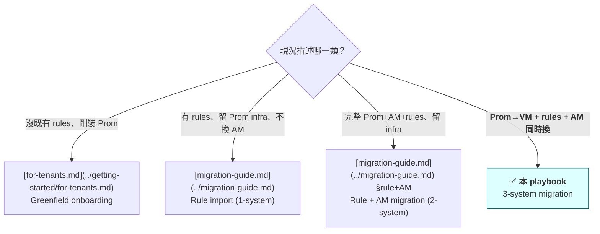
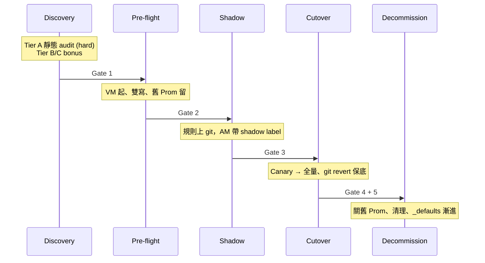

# Multi-System Migration Playbook

> **Status**: 🟡 Outline（v0.1，2026-05-10）— 5-Phase 結構、決策樹、Gate 模型、Schema 都已 locked from PR #375-#388 strategic discussion；本檔提供 ToC + 每段 design intent + checklist 骨架。Phase-by-phase 內文在後續 PR 補完。
>
> **適用情境**：客戶同時換 storage backend (Prom→VM)、規則層、AM routing，並追加平台的 `_defaults.yaml` metric-split feature。**不適合**：greenfield / 1-system / 2-system → 走決策樹下方對應 redirect。
>
> **語氣假設**：本 playbook 假設客戶已有成熟 Prometheus + Alertmanager 運維。**不教 Prometheus 基礎**；映射客戶既有概念到本平台。

---

## 0. 三層 reading speed（怎麼讀本文）

每個 Phase 同樣結構，依角色挑層次：

| 你是誰 | 讀哪段 | 預估 |
|---|---|---|
| **Manager / 跨團隊溝通**（broadcast 用）| 每 Phase 開頭的 「30 秒 TL;DR」（3 bullets） | 整 playbook < 5 分鐘 |
| **Architect / SRE Lead**（決策用）| 30 秒 TL;DR + Architect Narrative + Gates + Decision Trees | 整 playbook ~30 分鐘 |
| **On-call / Executor**（凌晨 cutover 用）| 跳到「Cutover Checklist」`<details>` + bash code blocks | 單 Phase < 5 分鐘 |

設計動機：**讀者不該抽自己的 TL;DR**。我們先抽好；不該跑命令的人不會看到命令（折疊預設關）；該執行的人 copy-paste 即可。

---

## 1. 我是哪一型客戶？（Routing Decision Tree）



如果你不確定該走哪一條，問自己：「**底層 storage 換不換？**」 換 → 本 playbook；不換 → migration-guide.md。

---

## 2. 5-Phase 全景



5 個 Gate 全部用 **invariants**（不是「告警量一致」）—— 詳見 §10。

---

## 3. Phase 0 — Discovery & Inventory

### 30 秒 TL;DR
- 三層 tier audit：A 靜態（hard gate）/ B live snapshot（soft）/ C 歷史 telemetry（bonus）
- 產出 dual：**`.da/migration-state.json`**（機器讀，後續 phase 自動化用）+ Markdown summary（給 PR description / 給人類）
- Schema 詳見 [migration-state.md](../schemas/migration-state.md)

### Architect Narrative（待寫，目標 1.5 頁）

**這 Phase 在解什麼問題**：客戶通常不知道自己 inventory 全貌——孤兒規則、死掉的 receiver、一年沒 fire 的 alert 都常見。Phase 0 強制盤點。

**三層 tier 設計理由**：客戶 telemetry 成熟度差異大。Tier A 完全靜態分析（任何客戶都能跑）；Tier B 需要當下 Prom 在線；Tier C 需要 long-retention 或 ELK。**Tier C 不可得不該擋住**——讓 Shadow phase 替代做 dynamic noise filtering。

**Output 用途**：JSON 給後續 phase 的自動化讀（Phase 3 自動產生 cutover candidate list）；Markdown 給 PR review + 客戶 stakeholders 看。

### Cutover Checklist

<details>
<summary>📋 Phase 0 Checklist（給 executor）</summary>

- [ ] 跑 Tier A 靜態 audit
  ```bash
  da-tools onboard --analyze \
      --output .da/migration-state.json \
      --markdown-summary > migration-summary.md
  ```
- [ ] 把 Markdown summary 貼進 PR description（給 reviewer）
- [ ] 確認 Tier A hard gates 通過：
  - [ ] 沒 syntax error 的孤兒 rule
  - [ ] 每個 receiver 都有對應 routing entry
  - [ ] tenant id 命名與我們的 schema 相容（dev-rule #2）
- [ ] **可選** Tier B：對活的 Prom 跑 `ALERTS{}` snapshot
- [ ] **可選** Tier C：對 Thanos / VM-long-retention 跑歷史查詢
- [ ] commit `.da/migration-state.json` 進 customer GitOps repo
</details>

### Failure modes
- 「Tier A 卡在 syntax error」：常見於手寫 PromQL 用 VM-only 函數 → `da-parser --strict-promql` 標出
- 「Tier B 拉不到 ALERTS{}」：Prom 太久沒 alert 評估 / 或 query timeout → 接受 Tier A 即可推進

### Gate 1 → Phase 1
**通過條件**：Tier A 全 hard checks pass + `.da/migration-state.json` 已 commit。

---

## 4. Phase 1 — Pre-flight & Dual-Write Infrastructure

### 30 秒 TL;DR
- VM cluster 起來（vmagent / vmselect / vmstorage 或 vmsingle）
- 客戶舊 Prom + 新 VM **同時 scrape** 相同 targets（dual-write）
- exporter 在我們的 cluster 起、發 `user_threshold` metric

### Architect Narrative（待寫）
- VM topology 選擇（vmsingle vs vmcluster）依規模 + HA 需求
- Dual-write 策略：vmagent remote_write fan-out 或客戶在 Prom 端 federate
- 我們的 exporter 此階段已上線但 AM 沒接（metric 純 collect）

### Cutover Checklist

<details>
<summary>📋 Phase 1 Checklist</summary>

- [ ] 部署 VM 至 staging cluster
- [ ] 配 vmagent fan-out（舊 Prom + 新 VM 雙端）
- [ ] 跑 Gate 1 invariant：VM 與 Prom 同 metric 數量 ±5%
- [ ] 部署我們 exporter 到 staging
- [ ] 驗證 `user_threshold` metric 在 VM 可查
</details>

### Gate 2 → Phase 2
**通過條件**：dual-write ≥ 7 天無掉點 + Tier B live snapshot 比對 staging vs prod-Prom 無 cardinality drift。

---

## 5. Phase 2 — Shadow Deployment

### 30 秒 TL;DR
- 規則 commit 到 git（單一 SOT 或 base + overlay，依 [Plan A vs B](#8-plan-a-vs-plan-bgit-layout-選擇)）
- AM routing 全部帶 `migration_status: shadow` label，告警導 /dev/null 或 debug channel
- 既有舊 Prom + AM 仍在線、仍是 production source-of-truth

### Architect Narrative（待寫）
- 為什麼 shadow 不直接接 production AM：信心不足 / 客戶 ops 還沒培訓
- Plan A vs B 此 phase 落地差異
- Gate 2 invariants 由來：**subset overlap = 100%**（既有等價規則必觸發）+ **新增 alert 顯式 sign-off**（避免 noise 被當回歸）

### Cutover Checklist

<details>
<summary>📋 Phase 2 Checklist</summary>

- [ ] 規則 commit 進 git（用 [migrate-conf-d](../cli-reference.md) 從舊規則轉換）
- [ ] AM routing 加 shadow matcher：
  ```yaml
  route:
    routes:
      - matchers: [migration_status="shadow"]
        receiver: "null"
        continue: false
  ```
- [ ] `da-tools shadow-verify preflight` 通過
- [ ] Shadow 期 ≥ 2 週（Gate 3 前置）
- [ ] 任一週內 invariants 都 hold
</details>

### Gate 3 → Phase 3
**通過條件**：
1. **Subset overlap = 100%**：舊系統有觸發的條件，新系統必觸發（catastrophic 假陰性 0）
2. **新增 alert 顯式 sign-off**：客戶 ops 對每條額外 alert 點頭（確認不是 bug 雜訊）
3. CI / CD 對 `_metric_federation_policy.yaml` 等變動 sticky 報告無 unexpected delta

---

## 6. Phase 3 — Incremental Cutover

### 30 秒 TL;DR
- Canary tenant（5-10%）先切：在 **rule 配置檔**移除該 tenant 的 `migration_status: shadow` label → **rule evaluator (Prom / vmalert) reload** → 該 tenant 觸發的告警 payload 不再帶 shadow label → AM 既有 route table 自然把它送進 production receiver
- 24h-1 ops cycle 觀察 → 推全量
- Rollback path：**git revert** config commit → rule evaluator reload → shadow label 恢復 → 告警重新被 AM 既有 shadow matcher 路由到 /dev/null（< 5 分鐘）

### Architect Narrative（待寫）

**關鍵機制澄清**（避免常見誤解）：

> Phase 3 改的是**規則檔**（rule evaluator 端），不是 AM config。AM 既有的 route table（含 `migration_status="shadow"` matcher）**完全不變**。
>
> - **改動處**：rule 配置（Prom rules.yml / vmalert rule files）—— 拔除該 tenant 規則上的 `migration_status: shadow` label
> - **觸發 reload 的對象**：rule evaluator (Prometheus / vmalert)，**不是** Alertmanager
> - **AM 端的行為**：AM 收到不帶 shadow label 的 alert payload → 既有 route 的 shadow matcher 不 match → fall through 到 production receiver。AM config 完全沒動
>
> 這個分工是 Canary 之所以可行的原因：如果改 AM config 移除 shadow matcher，會一次影響所有 tenants（無法 canary）。改 per-tenant rule label 才能精準切 5-10% 子集。

**其他**：
- Canary 比例 + 觀察窗：5% × 24h 是 minimum；推薦 **跨 1 個 ops cycle (typically 1 week)** 抓 weekly / monthly alerts
- Connect：**staged adoption**（custom_ → golden）由獨立 [Staged Adoption Lifecycle](staged-adoption-guide.md) 處理；**本 Phase 不重複那段內容**，只做 cutover 的 label flip

### Cutover Checklist

<details>
<summary>📋 Phase 3 Checklist</summary>

**Canary 階段**
- [ ] 選擇 canary tenants（典型 5-10%）
- [ ] git commit：在 **rule 配置檔** 移除 canary tenants 的 `migration_status: shadow` label（**不是** AM config）
- [ ] **Rule evaluator (Prom / vmalert) reload**（自動 — 透過 GitOps reconcile 或 SIGHUP / `/-/reload`）—— **不是** AM reload
- [ ] 驗證：該 tenant 觸發的下一個 alert payload 不再帶 `migration_status: shadow`
- [ ] 24h 觀察期：alert 觸發率、receiver 響應、人為 incidents
- [ ] Gate 4 通過 → 推全量

**全量階段**
- [ ] git commit：移除剩餘 tenants 的 shadow label（rule 端）
- [ ] Rule evaluator reload
- [ ] 觀察 ≥ 1 ops cycle（推薦 1 week）
- [ ] Gate 5 通過 → Phase 4

**Rollback**
- [ ] git revert 對應 commit → rule evaluator reload → shadow label 恢復在 alert payload → AM 既有 shadow matcher 重新生效 → 告警再次路由到 /dev/null
- [ ] **可逆性界線**：見 §11（config 全可逆 / 監控狀態半可逆 / 資料層不可逆）

> **常見錯誤**：以為要改 AM config 移除 shadow matcher。**不要這麼做** —— 那會一次影響所有 tenants 無法 canary。
</details>

### Gate 4（canary）→ 全量
**通過條件**：Canary tenants 跨 24h 無 unexpected alert + 客戶 ops sign-off。

### Gate 5（全量）→ Phase 4
**通過條件**：全量切換 ≥ 1 ops cycle 無 incident。

---

## 7. Phase 4 — Decommission

### 30 秒 TL;DR
- 舊 Prom 進入 read-only（停 alerting evaluation）
- N 天 grace period 後關 Prom
- 漸進啟用 `_defaults.yaml` metric-split feature（連 [Staged Adoption Lifecycle](staged-adoption-guide.md)）

### Architect Narrative（待寫）
- 為什麼分 read-only → off 兩步：歷史 query 需求（compliance / SRE 回顧）
- Decommission 後才能啟用 metric-split：避免 Phase 3 期 noise 被歸因到新功能

### Cutover Checklist

<details>
<summary>📋 Phase 4 Checklist</summary>

- [ ] 舊 Prom 移除 alert.rules.yml（純 read-only，仍可 query）
- [ ] Grace period（建議 30 天）
- [ ] Prom shutdown
- [ ] 按 [Staged Adoption Lifecycle](staged-adoption-guide.md) 漸進啟用 `_defaults.yaml`
- [ ] 更新客戶 internal docs / runbooks
</details>

---

## 8. Plan A vs Plan B（Git layout 選擇）

### Plan A — Single SOT + Per-cluster Exporter Version Skew（**預設**）

`conf.d/` 是單一 Git 樹，所有 cluster 共用。差異透過該 cluster 部署的 threshold-exporter 版本決定該 cluster 在哪個 phase。

```
conf.d/
├─ _defaults.yaml          # v2.8+ exporter 讀；v2.7 silently ignore
├─ <domain>/
│  └─ <region>/
│     └─ <tenant>.yaml
```

**Forward-compat 已驗證**（PR #375 P0 check）：v2.7.0 exporter 對 v2.8.0 新欄位 graceful ignore（`yaml.Unmarshal` lenient + `_*` 底線檔案跳過慣例）。

**何時用 Plan A**：cluster 間版本差距 ≤ 1 minor、無 per-cluster selective feature 需求。Cover ~80% 客戶情境。

### Plan B — Base + Overlay（escape hatch）

```
conf.d/
├─ base/                  # 所有 cluster 共用
└─ overlays/
   ├─ staging/            # 進階 feature
   │  └─ _defaults.yaml
   └─ prod/               # 還在 Shadow
      └─ migration_status_routing.yaml
```

**何時用 Plan B**：客戶要 per-cluster selective feature adoption（staging 啟用 _defaults、prod 暫不啟用）。

**Plan B platform investment**：exporter 需要 multi-mount-point overlay merge 邏輯——**目前未 ship**，是 v2.9 backlog 項。客戶觸發 Plan B 時請先確認 platform team 排期。

---

## 9. Partial Migration（X-Y matrix）

5-Phase 是 **Y 軸**；scope wave 是 **X 軸**——兩者正交。

```
                 Phase 0  Phase 1  Phase 2  Phase 3  Phase 4
staging cluster   ✅       ✅       ✅       ✅       ✅
prod canary       ✅       ✅       🔄 (in)   —        —
prod-rest         ✅       ✅       —        —        —
```

合法狀態：**staging 在 Phase 4 + prod 在 Phase 2 同時發生**。playbook 不要假設「全 cluster 同步」。

---

## 10. Gate Reference Table

| Gate | Phase 出 | Phase 入 | 通過條件 |
|---|---|---|---|
| Gate 1 | Phase 0 Discovery | Phase 1 Pre-flight | Tier A 靜態 audit hard checks pass + migration-state.json committed |
| Gate 2 | Phase 1 Pre-flight | Phase 2 Shadow | Dual-write ≥ 7 天無掉點 + Tier B 比對 staging vs prod 無 cardinality drift |
| Gate 3 | Phase 2 Shadow | Phase 3 Cutover | **Subset overlap = 100%** + 新增 alert 顯式 sign-off + ≥ 2 週 shadow 期 |
| Gate 4 | Phase 3 Canary | Phase 3 全量 | Canary tenants 跨 24h 無 unexpected alert + ops sign-off |
| Gate 5 | Phase 3 全量 | Phase 4 Decommission | 全量切換 ≥ 1 ops cycle 無 incident |

**所有 Gate 用 invariants**（subset overlap、cardinality drift bound 等），**不是**「告警量一致」這類 timing-sensitive 命題。

---

## 11. Rollback 三層可逆界線

| Layer | 可逆性 | Rollback 機制 | 預估時間 |
|---|---|---|---|
| **Config**（rules.yaml / AM routing / `_defaults.yaml`）| ✅ | `git revert <commit>` → AM/exporter reload | < 5 分鐘 |
| **監控狀態**（已 silenced alert / maintenance window） | ⚠️ 半可逆 | git revert + manual cleanup script（待 ship） | ~30 分鐘 |
| **資料層**（VM 已 ingest 的 metric / Prom 已 GC 的 chunk） | ❌ 不可逆 | 接受 | — |

**playbook 必須讓客戶建立 mental model**：rollback ≠ undo all.

---

## 12. Failure Mode Catalog（cross-phase summary）

[待寫，預計 1 頁；深入排查連 **Troubleshooting Checklist** (`docs/integration/troubleshooting-checklist.md`，I-4 待 ship)]

| 階段 | 症狀 | 第一手排查 | 深入文件 |
|---|---|---|---|
| Phase 1 dual-write | VM 比 Prom 少 metric | vmagent error log | troubleshooting-checklist §1 |
| Phase 2 shadow | shadow alerts 漏到 production receiver | AM route 順序 + matcher | shadow-monitoring-sop.md |
| ... | ... | ... | ... |

---

## 13. Appendices

### A. Customer-anon scenario walkthrough（待寫，~1.5 頁）

**Setting**：1000 tenant 製造業客戶，原本自管 Prom + AM 5 年，無 telemetry pipeline。Stage 4 maturity（mature multi-system）。要換 VM + 加 metric-split。

[walkthrough 帶讀者過完 Phase 0-4，每 phase 1 段]

### B. Cross-references

- **Schema**：[`docs/schemas/migration-state.md`](../schemas/migration-state.md) — `.da/migration-state.json` 欄位 spec
- **Shadow 機制深入**：[`docs/shadow-monitoring-sop.md`](../shadow-monitoring-sop.md)
- **Rule-only migration**（1/2-system）：[`docs/migration-guide.md`](../migration-guide.md)
- **Staged adoption**（custom_ → golden 漸進）：[`docs/scenarios/staged-adoption-guide.md`](staged-adoption-guide.md) — I-2，已 ship
- **Troubleshooting**：`docs/integration/troubleshooting-checklist.md` — I-4，待 ship
- **VM integration entry**：`docs/integration/victoriametrics-integration.md` — I-3，待 ship

### C. ADR / Design references

- 設計 commitments lock from PR #375 strategic discussion + 3 輪 Gemini adversarial review
- 5-Phase / Gate invariants / Plan A vs B / Rollback 邊界 / X-Y matrix 全 locked
- 內文寫作會在後續 PR 補進每 Phase 的 narrative + checklist 詳細

---

## Outline Status

| 段 | 狀態 |
|---|---|
| §0-2 frame + decision tree + 5-Phase overview | ✅ outline ready |
| §3-7 各 Phase 30-sec TL;DR + checklist 骨架 | ✅ outline ready |
| §3-7 各 Phase Architect Narrative | 🟡 待補（內文 PR）|
| §8 Plan A vs B Git layout | ✅ outline ready |
| §9 X-Y matrix | ✅ outline ready |
| §10 Gate Reference Table | ✅ outline ready |
| §11 Rollback 三層 | ✅ outline ready |
| §12 Failure Mode Catalog | 🟡 待補 |
| §13 Customer-anon walkthrough | 🟡 待補 |
| §13 Cross-refs | ✅ outline ready |

**下一步**：本 outline 進 PR review（owner + Gemini）→ 通過後動內文 PR（補 Architect Narrative 段 + Failure Mode Catalog + Walkthrough）。預計內文 ~8-12h，分 1-2 PR ship。
