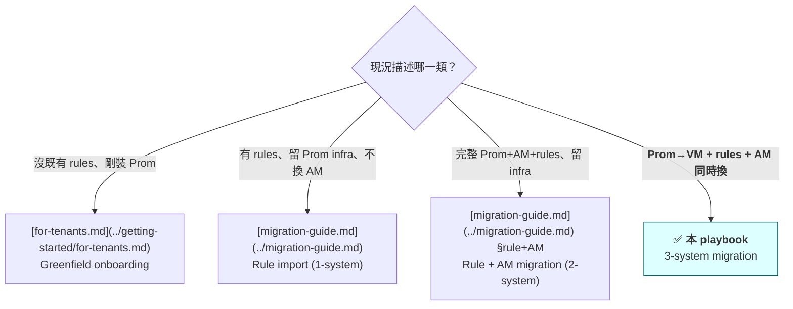
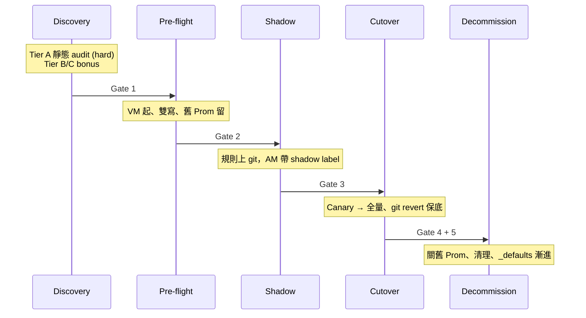

# Multi-System Migration Playbook

> **適用情境**：客戶同時換 storage backend (Prom→VM)、規則層、AM routing，並追加平台的 `_defaults.yaml` metric-split feature。**不適合**：greenfield / 1-system / 2-system → 走決策樹下方對應 redirect。
>
> **語氣假設**：本 playbook 假設客戶已有成熟 Prometheus + Alertmanager 運維。**不教 Prometheus 基礎**；映射客戶既有概念到本平台。

---

## 0. 三層 reading speed（怎麼讀本文）

每個 Phase 同樣結構，依角色挑層次：

| 你是誰 | 讀哪段 | 預估 |
|---|---|---|
| **Manager / 跨團隊溝通**（broadcast 用）| 每 Phase 開頭的 「30 秒 TL;DR」（3 bullets） | 整 playbook < 5 分鐘 |
| **Architect / SRE Lead**（決策用）| 30 秒 TL;DR + Architect Narrative + Gates + Decision Trees | 整 playbook ~30 分鐘 |
| **On-call / Executor**（凌晨 cutover 用）| 跳到「Cutover Checklist」`<details>` + bash code blocks | 單 Phase < 5 分鐘 |

設計動機：**讀者不該抽自己的 TL;DR**。我們先抽好；不該跑命令的人不會看到命令（折疊預設關）；該執行的人 copy-paste 即可。

---

## 1. 我是哪一型客戶？（Routing Decision Tree）



如果你不確定該走哪一條，問自己：「**底層 storage 換不換？**」 換 → 本 playbook；不換 → migration-guide.md。

---

## 2. 5-Phase 全景



5 個 Gate 全部用 **invariants**（不是「告警量一致」）—— 詳見 §10。

---

## 3. Phase 0 — Discovery & Inventory

### 30 秒 TL;DR
- 三層 tier audit：A 靜態（hard gate）/ B live snapshot（soft）/ C 歷史 telemetry（bonus）
- 產出 dual：**`.da/migration-state.json`**（機器讀，後續 phase 自動化用）+ Markdown summary（給 PR description / 給人類）
- Schema 詳見 [migration-state.md](../schemas/migration-state.md)

### Architect Narrative

#### 為什麼 Phase 0 是 hard gate，不能跳

**「我以為我懂自己的 inventory」是企業 monitoring 最常見的錯覺**。5 年以上的 Prometheus deployment 累積：規則被 commit 但沒人記得目的、receiver 用的 webhook URL 對應的人離職了、tenant id 在某次 hotfix 直接 hardcode 進 PromQL 沒人移除、multi-region 部署規則因為團隊分工各自演化、Operator 遷移過程留下 ConfigMap + PrometheusRule CRD 雙寫遺跡。

Phase 0 強制做**一次徹底的盤點**——不是為了完美修復（那要 Phase 3 才做），而是為了讓客戶與我們對「即將遷移什麼」有共同 mental model。Discovery 跳過 = Phase 1+ 每一步都基於假設不基於事實。

#### 三層 Tier 為什麼這樣切分

客戶 telemetry 成熟度差異極大——從「只有 Prom 在線、無任何長期儲存」到「Thanos + ELK + Datadog」都有。一個 hard gate fits all 是不切實際。三層 tier 對應三種客戶現況：

- **Tier A — 靜態分析**（hard gate，所有客戶都能過）
  完全脫機分析 PromRule CRD / rules.yaml / vmalert ConfigMap 等規則檔本身。Catches: syntax errors、orphan rules（無對應 receiver）、rules without route、receivers unused、tenant id 違反 schema、跨檔重複定義。**典型 100 規則客戶 < 30 秒跑完**。output 為 `.da/migration-state.json` + Markdown summary（dual output 詳見 [migration-state.md](../schemas/migration-state.md)）。

- **Tier B — Live snapshot**（soft gate，~80% 客戶可達）
  對活著的 Prometheus 跑 `ALERTS{}` 抓「現在 firing 的告警集合」+ 對 AM 跑 `/api/v2/alerts/groups` 抓 active routes。回答「現在實際在叫的東西是什麼？」這個 Tier A 沒法回答的問題。Limits: 需要 Prom auth + reachable；某些 shops policy 不開查詢權；高 cardinality 客戶查詢可能 timeout。**Tier B 缺席不擋 Phase 1**。

- **Tier C — 歷史 telemetry**（bonus，~20% 客戶可達）
  對 Thanos / VM long-retention / ELK alert logs 跑「過去 N 天 alert fire 分布」「哪些規則一年沒觸發過」「哪些 receiver 收過 webhook」。**多數客戶沒這層 telemetry**——不擋；Shadow phase 會做 dynamic noise filtering 替代。

#### Output dual format 的由來

JSON (`.da/migration-state.json`) + Markdown summary 來自同一個 internal state。**不是兩份檔案分別維護，是一個 derive 兩種視圖**：

- JSON：機器讀。Phase 3 cutover candidate selector / CI gate / 後續 phase 自動 advance log 都依賴它
- Markdown：人類讀。貼進 PR description 給 reviewer / 客戶 stakeholder broadcast

**Per-cluster split** 是 Phase 0 起手就建立的慣例（見 [migration-state.md §Storage Layout](../schemas/migration-state.md)）。多 cluster 並行推進不同 phase 時，single-file 會 GitOps merge conflict 地獄；per-cluster `.da/state/<cluster>.json` 是預設姿勢。

#### Phase 0 通常的 surprise

客戶聽到 Phase 0 結果常見三種反應：

1. **「我們有那麼多 orphan rules？」** — 規則被 commit 但對應 receiver 已不在 AM config，Phase 0 一掃就出來，平均每 100 規則有 5-15 條 orphan
2. **「這個 tenant id 是 hardcode 的？」** — `instance="db-prod-1"` 之類的 PromQL 直接寫死，dev-rule #2 violation。Phase 1 之前必須改
3. **「receiver 那個 PagerDuty token 早不能用了」** — 客戶才發現好幾個月來某域 alert 根本沒人收到。屬於 Phase 0 額外的**意外修復**而非預期成果

### Cutover Checklist

<details>
<summary>📋 Phase 0 Checklist（給 executor）</summary>

- [ ] 跑 Tier A 靜態 audit
  ```bash
  da-tools onboard --analyze \
      --output .da/migration-state.json \
      --markdown-summary > migration-summary.md
  ```
- [ ] 把 Markdown summary 貼進 PR description（給 reviewer）
- [ ] 確認 Tier A hard gates 通過：
  - [ ] 沒 syntax error 的孤兒 rule
  - [ ] 每個 receiver 都有對應 routing entry
  - [ ] tenant id 命名與我們的 schema 相容（dev-rule #2）
- [ ] **可選** Tier B：對活的 Prom 跑 `ALERTS{}` snapshot
- [ ] **可選** Tier C：對 Thanos / VM-long-retention 跑歷史查詢
- [ ] commit `.da/migration-state.json` 進 customer GitOps repo
</details>

### Failure modes
- 「Tier A 卡在 syntax error」：常見於手寫 PromQL 用 VM-only 函數 → `da-parser --strict-promql` 標出
- 「Tier B 拉不到 ALERTS{}」：Prom 太久沒 alert 評估 / 或 query timeout → 接受 Tier A 即可推進

### Gate 1 → Phase 1
**通過條件**：Tier A 全 hard checks pass + `.da/migration-state.json` 已 commit。

---

## 4. Phase 1 — Pre-flight & Dual-Write Infrastructure

### 30 秒 TL;DR
- VM cluster 起來（vmagent / vmselect / vmstorage 或 vmsingle）
- 客戶舊 Prom + 新 VM **同時 scrape** 相同 targets（dual-write）
- exporter 在我們的 cluster 起、發 `user_threshold` metric

### Architect Narrative

#### VM topology 選擇

**起跑用 vmsingle，達某水位再升 vmcluster**——不要在 Phase 1 就上 cluster。

| Topology | 適用規模 | HA | 複雜度 |
|---|---|---|---|
| **vmsingle**（單 binary）| < 1M active series | ❌ 單點 | 低（單一 binary） |
| **vmcluster**（vmstorage + vmselect + vminsert）| 1M+ active series 或 multi-tenant 需求 | ✅ replica + horizontal scale | 高（3 component 部署 + replication factor 調校） |

實務經驗：客戶在 Phase 1 上 vmcluster 的，Phase 1 stuck 機率比 vmsingle 高 3-5 倍——原因不是 VM bug，而是客戶 ops 對 vmcluster 不熟悉，部署 + debug + tuning 認知負擔過大。**保留 vmcluster 升級為 Phase 4 後的 capacity planning 議題**。

vmsingle disk budget rule of thumb：

```
bytes-per-datapoint × datapoints-per-day × series count × retention days × 1.5 (overhead buffer)
```

各因子典型值：

- **bytes-per-datapoint**：VM 極致壓縮下約 **0.4–1 byte**（依 churn rate / value entropy 而定；官方範例 < 1 byte）
- **datapoints-per-day**：`86400 / scrape_interval_seconds`（15s scrape → 5760；30s scrape → 2880；60s → 1440）
- **series count**：active series（不是 sample count）
- **retention days**：保留期
- **1.5**：overhead buffer（index / metadata / WAL / compaction temp）

實際估算**請以 [VM 官方 Capacity Calculator](https://docs.victoriametrics.com/Single-server-VictoriaMetrics.html#capacity-planning) 為準**——它會把 churn / dedup / replication factor 一起納入，比 rule-of-thumb 公式精確。本公式只供 sanity check 與初次採購估算的數量級判斷。

**反例**：早期 v0.1 outline 寫過「bytes-per-series-per-day ~8-15 bytes」是錯的——把 bytes/datapoint 與 bytes/series/day 混淆。1M series × 15s scrape × 30 days 兩種算法的差異：

- **錯**：`8 bytes/series/day × 1M × 30 × 1.5 ≈ 360 MB` ←算出 disk 需求 < 1GB，明顯有問題
- **對**：`1 byte/dp × 5760 dp/day × 1M × 30 × 1.5 ≈ 260 GB`（5760 = 86400/15s scrape）

兩者差 ~700 倍。Phase 1 disk 撐爆的事故多半出自這類算錯——把 bytes/series/day 誤當公式單位、實際數值卻在 bytes/datapoint 量級。

#### Dual-write 策略

「Dual-write」一詞在這裡用得寬鬆——精確說是「**讓兩個系統都拿到一份相同 metric**」，而不是「對兩個 storage `remote_write`」。為什麼這個 framing 重要？因為 Prometheus 預設**不接收 `remote_write`**（要重啟並加 `--web.enable-remote-write-receiver`），且把 Prom 從 pull 模型強推成 push 接收端會破壞 `up` 與 staleness 追蹤——客戶仰賴 `up == 0` 的告警會集體失效。所以**舊 Prom 一律保持原樣自己 pull**，新流量另外處理。

兩條合理 path：

**Option 1 — Side-by-Side Dual Scrape**（推薦，多數客戶走這條）

舊 Prom **完全不動**（保留原 scrape config 與所有 alerting 規則）。並行**新部署一組 vmagent**，讓它 scrape 與舊 Prom 一模一樣的 targets，然後 `remote_write` 給 VM。

```yaml
# 新 vmagent（Phase 1 新部署，與舊 Prom 並行不互相依賴）
scrape_configs:
  # 抄舊 Prom 的 scrape_configs（一模一樣的 job/relabel/static_configs）
  - job_name: ...

remoteWrite:
  - url: "http://vminsert.vm.svc:8480/insert/0/prometheus"
```

關鍵點：

- 舊 Prom 維持 pull 模型——`up` / staleness 追蹤完整保留、客戶既有 `up == 0` 告警照常運作
- 新 vmagent 是**獨立的 scraper**——它 pull 一份、舊 Prom pull 一份，targets 對外是 2x scrape load（這是 dual-write 真實成本）
- vmagent 端可以做 relabel / drop 不關心的 metric 控制 cardinality
- 風險邊界：**vmagent scrape config 若與舊 Prom 不一致**，Gate 1 invariant「VM 與 Prom 同 metric 數量 ±5%」會抓出來

**Option 2 — Prom 加 `remote_write` 給 VM**（適合不想加新 component 的客戶）

舊 Prom 維持 pull、加一個 `remote_write` block 把 sample fan-out 到 VM。**Prom → VM 是合法的**（VM 接受 remote_write，Prom 也支援當 remote_write client）。

```yaml
# 舊 prometheus.yml 加這段
remote_write:
  - url: "http://vminsert.vm.svc:8480/insert/0/prometheus"
    # 🚨 必須加 queue_config 否則生產環境會 OOM 或打趴 vminsert
    queue_config:
      max_samples_per_send: 10000   # 單次 payload 上限（避免 HTTP body 過大）
      max_shards: 30                # 並發 shard 上限（Prom 預設 200 太高，記憶體會炸）
      capacity: 25000               # 每 shard buffer 大小（max_shards × capacity ≈ 在飛 sample 上限）
```

**為什麼 `queue_config` 不可省略**——這段 YAML 看起來很無辜，省略 `queue_config` 在小 Prom 上不會出事，但**有規模的 Prom（百萬 series 級）reload 後 Prom 預設行為會災難**：

1. Reload 觸發 WAL replay / catch-up，Prom 用最激進方式追送資料給 VM
2. 預設 `max_shards: 200` 同時開 200 條並發連接，每 shard 各自 buffer → 記憶體**幾倍** spike → Prom OOMKilled
3. 突發寫入流量直接打 vminsert → HTTP 503 / connection refused（即使 vminsert 平時撐得住穩態流量）
4. 客戶以為「我只加了三行」實際引入了一個重大效能 regression

**baseline 數值的取捨**（記憶體 ≈ `max_shards × capacity × ~bytes/sample`）：

- Gemini 推薦的 `30 × 25000 = 750k samples in flight` 是預設 `200 × 10000 = 2M` 的 ~37%，是個**保守的安全起點**
- 客戶 series 量大、WAN 高 latency 時，可往上調 `max_shards`；series 少 / Prom OOM 風險高時往下調
- VictoriaMetrics 官方 capacity calculator 也會給出對應 `max_shards` 建議

注意：**這條路與 Option 1 的方向相反**——Option 2 是 Prom push 給 VM；Option 1 是 vmagent 獨立 pull 後 push 給 VM。**沒有任何 option 是把資料 push 給舊 Prom**。

| 比較項 | Option 1 (Dual Scrape) | Option 2 (Prom remote_write) |
|---|---|---|
| 舊 Prom 設定變動 | 0（完全不動） | 加 `remote_write` block + reload |
| 新增 component | 1 個 vmagent | 0 |
| Scrape load on targets | 2× | 1×（共享舊 Prom 的 scrape） |
| Cardinality 控制點 | vmagent 端可 relabel | Prom 端 + VM 端 |
| 失敗影響 | vmagent 掛掉舊 Prom 不受影響 | Prom 掛掉雙邊都失效 |
| 客戶 Prom 版本要求 | 不限 | Prom v2.25+（remote_write 1.0） |

**雙寫意味雙倍 scrape load**（Option 1）或 Prom→VM 反向流量（Option 2）。Phase 1 開始前確認 target endpoints 撐得住——某些 client metric endpoint（如 redis exporter）對高頻 scrape 敏感。

#### 為什麼 exporter 在 Phase 1 起、AM 不接

threshold-exporter 在 Phase 1 部署，但**故意不接 AM**：

- **動機**：Phase 2 shadow 才有 `user_threshold` metric 可比對；不在 Phase 1 預先 ship 會 chicken-and-egg
- **副作用**：Phase 1 期 exporter 的 metric 純 collect，Prom 那邊 `user_threshold{...}` 會出現但無 alert 路徑。客戶 ops 看到時可能困惑——預先告知「此期間 metric 是 silent state，AM 接線在 Phase 2」

#### Cardinality budget watch

Dual-write 期間 cardinality 會臨時 doubling。Phase 1 Gate 1 invariant 包含「VM 與 Prom 同 metric 數量 ±5%」確認 dual-write 健康——但**這只檢查兩邊一致性**，不檢查容量上限。

**容量觀察重點**（Phase 1 結束前**至少**過一次）：

- VM `vm_data_size_bytes` 增速 vs disk capacity
- Prom `prometheus_tsdb_head_series` cardinality 是否爆量
- vmagent `vmagent_remotewrite_pending_data_bytes` 不該長期 > 0（>0 = 寫不完，可能 OOM 預兆）

### Cutover Checklist

<details>
<summary>📋 Phase 1 Checklist</summary>

**Pre-flight**
- [ ] 確認 VM topology 選擇（vmsingle 預設 / vmcluster 僅 multi-tenant 規模 + HA 需求）
- [ ] 計算 disk budget：`bytes-per-datapoint × datapoints-per-day × series × retention × 1.5`（VM 約 0.4-1 byte/datapoint；用 [VM Capacity Calculator](https://docs.victoriametrics.com/Single-server-VictoriaMetrics.html#capacity-planning) 為準）
- [ ] 預估 cardinality 增量在 VM 是否超 budget（Option 1 是新增 vmagent scrape；Option 2 是 Prom→VM remote_write）

**部署**
- [ ] 部署 VM 至 staging cluster
- [ ] 配置 dual-write：**Option 1** 並行新 vmagent scrape 同 targets + remote_write 給 VM（**舊 Prom 不動**）；**Option 2** 舊 Prom 加 `remote_write` 給 VM
- [ ] **Option 2 必檢**：`remote_write` block 含 `queue_config`（`max_shards` / `capacity` / `max_samples_per_send`）—— 省略 = 大 Prom reload 時 OOM 或打趴 vminsert
- [ ] 驗證**沒有**任何 component 嘗試 `remote_write` 給舊 Prom（除非舊 Prom 已開 `--web.enable-remote-write-receiver`，但此設計會破壞 Prom 原生 `up`/staleness 追蹤、不建議）
- [ ] 部署 threshold-exporter 到 staging（**不接 AM**）
- [ ] 驗證 `user_threshold` metric 在 VM 可查（`vmselect ... /api/v1/query`）

**Gate 1 verification**
- [ ] VM 與 Prom 同 metric 數量 ±5% 內（跑一週）
- [ ] vmagent `pending_data_bytes` 持續 ≈ 0
- [ ] VM disk 增速符合估算
- [ ] dual-write ≥ 7 天無斷點
</details>

### Gate 2 → Phase 2
**通過條件**：dual-write ≥ 7 天無掉點 + Tier B live snapshot 比對 staging vs prod-Prom 無 cardinality drift。

---

## 5. Phase 2 — Shadow Deployment

### 30 秒 TL;DR
- 規則 commit 到 git（單一 SOT 或 base + overlay，依 [Plan A vs B](#8-plan-a-vs-plan-bgit-layout-選擇)）
- AM routing 全部帶 `migration_status: shadow` label，告警導 /dev/null 或 debug channel
- 既有舊 Prom + AM 仍在線、仍是 production source-of-truth

### Architect Narrative

#### 為什麼 Shadow 不直接接 production AM

Phase 2 的核心是**製造一個「看得見、聽不見」的並行世界**——新規則完全 evaluate、metric 完全寫入、alert payload 完全產生，**但不抵達 production receiver**。原因有三：

1. **客戶信心不足**：直接接 production，第一個 false positive 就讓客戶要求 rollback；Shadow 給客戶兩週「看 alert 數據」的窗口建立信心
2. **客戶 ops 還沒培訓**：新平台的 alert label schema、severity 分級、escalation route 跟舊系統不同；on-call 工程師需要 mental model 切換時間
3. **catch own bugs**：我們自己 ship 的 golden rule 可能有設計失誤；Shadow 期等於免費 staging — 出問題客戶 ops 不會 paged

**Shadow 不是「測試環境」**——它是 production traffic 上的 dry-run，所有條件都是真的，只有 routing 改道。比 staging 更接近真實，比直切更安全。

#### Plan A vs Plan B 在 Phase 2 的具體落地

兩種 Git layout 在 Phase 2 期表現不同：

**Plan A（單 SOT + version skew）**：
- 新規則 commit 到 conf.d/，所有 cluster 共用同一份 source
- AM `migration_status: shadow` matcher 在所有 cluster 同步生效
- staging cluster 升 v2.8.0 exporter 即啟用 shadow；prod cluster 仍跑 v2.7.0 仍 forward-compat
- **優點**：單一 PR review，跨 cluster 變動最小
- **限制**：所有 cluster 一起進 Phase 2（X-Y matrix 的 X 軸只能 staging-first 不能 per-cluster feature toggle）

**Plan B（base + overlay）**：
- 新規則進 `overlays/staging/conf.d/`，其他 cluster overlay 不含
- 同一個時間點 staging 在 Phase 2、prod 仍在 Phase 1（dual-write only）合法
- **優點**：per-cluster feature toggle 完整自由
- **限制**：overlay 機制是 v2.9 backlog，目前未 ship

→ 多數客戶走 Plan A 配 staging-first ordering，達到 80% 「per-cluster phase」彈性而不需要 overlay 機制。

#### Gate 3 invariants 為什麼這樣設計

Gate 3 通過條件：

1. **Subset overlap = 100%**（**或** intentional noise reduction，見 [Staged Adoption Lifecycle §4](staged-adoption-guide.md)）
2. **新增 alert 顯式 sign-off**
3. ≥ 2 週 shadow 期

「告警量一致」**不是** Gate 3 條件——這是這套 playbook 的關鍵差異點：

- 舊規則一週叫 50 次、新規則一週叫 5 次 — overlap < 100% 但其實是 intended noise reduction（更聰明的條件、time window、threshold tuning）
- 舊規則漏抓某個 catastrophic case、新規則抓到 — 看起來像「noise」但其實是 regression 修復

「告警量」是 **outcome**，不是 **gate**。invariants 看「**舊有的能觸發的條件，新規則必觸發**」+「**多出的 alert 是 design intent**」。詳見 [Staged Adoption Lifecycle §4](staged-adoption-guide.md) 對 (2a) 純 overlap vs (2b) intentional reduction 的二擇一邏輯——同套標準在 Phase 2 與 staged adoption 共用。

#### Shadow 期長度為什麼 2 週

2 週 minimum 不是任意數字。它對應**至少跨 1 個完整工作週循環 + 1 個非工作週末** + 預留 1 週 buffer 給延遲觸發 alert。短於 2 週抓不到「週末才會 fire 的 batch job alert」「週一早晨 traffic spike alert」這類 weekly-cycle 異常。

對 monthly batch / quarter-end 客戶（金融 / e-commerce），可拉長到 4 週或 1 個月。

### Cutover Checklist

<details>
<summary>📋 Phase 2 Checklist</summary>

**規則上 git**
- [ ] 規則 commit 進 git（從舊扁平結構 → `conf.d/<domain>/<region>/<tenant>.yaml` 階層；用 `git mv` 保留 history）
  ```bash
  # 範例：把舊 rules/<tenant>.yaml 移到階層結構
  # 對每個 tenant，依其 _metadata.domain / region 決定目標路徑：
  TENANT_FILE="rules/redis-prod-1.yaml"
  DOMAIN=$(yq '._metadata.domain' "$TENANT_FILE")      # e.g., "redis"
  REGION=$(yq '._metadata.region' "$TENANT_FILE")      # e.g., "us-east"
  mkdir -p "conf.d/${DOMAIN}/${REGION}/"
  git mv "$TENANT_FILE" "conf.d/${DOMAIN}/${REGION}/$(basename $TENANT_FILE)"
  # 跑 da-tools validate-config 確認 conf.d 結構正確
  ```
- [ ] 所有規則 emit 的 alert 都帶 `migration_status: shadow` label
- [ ] CI 對 conf.d 跑 schema validation + `da-tools alert-quality` 預檢

**AM 配置**
- [ ] AM routing 加 shadow matcher（**第一個 route，避免被其他 matcher 截走**）：
  ```yaml
  route:
    routes:
      - matchers: [migration_status="shadow"]
        receiver: "null"
        continue: false   # 不再 fall through
  ```
- [ ] 確認 `null` receiver 存在（無 webhook、無 email — 真的 /dev/null）
- [ ] AM `/-/reload` 後驗證：人工 inject test alert with shadow label，**不應**收到任何 page

**Shadow 期 monitoring**
- [ ] `da-tools shadow-verify preflight` 通過（pre-shadow sanity check）
- [ ] Shadow 期 ≥ 2 週（monthly batch 客戶建議 4 週）
- [ ] 每天追蹤 shadow alert volume + subset overlap progress

**Gate 3 verification**
- [ ] Subset overlap = 100%（或 intentional noise reduction with sign-off）
- [ ] 新增 alert 列表 → domain owner 逐筆確認 design intent
- [ ] 任一週內 invariants 都 hold（不是平均，是 every week）
</details>

### Gate 3 → Phase 3
**通過條件**：
1. **Subset overlap = 100%**：舊系統有觸發的條件，新系統必觸發（catastrophic 假陰性 0）
2. **新增 alert 顯式 sign-off**：客戶 ops 對每條額外 alert 點頭（確認不是 bug 雜訊）
3. CI / CD 對 `_metric_federation_policy.yaml` 等變動 sticky 報告無 unexpected delta

---

## 6. Phase 3 — Incremental Cutover

### 30 秒 TL;DR
- Canary tenant（5-10%）先切：在 **rule 配置檔**移除該 tenant 的 `migration_status: shadow` label → **rule evaluator (Prom / vmalert) reload** → 該 tenant 觸發的告警 payload 不再帶 shadow label → AM 既有 route table 自然把它送進 production receiver
- 24h-1 ops cycle 觀察 → 推全量
- Rollback path：**git revert** config commit → rule evaluator reload → shadow label 恢復 → 告警重新被 AM 既有 shadow matcher 路由到 /dev/null（< 5 分鐘）

### Architect Narrative（待寫）

**關鍵機制澄清**（避免常見誤解）：

> Phase 3 改的是**規則檔**（rule evaluator 端），不是 AM config。AM 既有的 route table（含 `migration_status="shadow"` matcher）**完全不變**。
>
> - **改動處**：rule 配置（Prom rules.yml / vmalert rule files）—— 拔除該 tenant 規則上的 `migration_status: shadow` label
> - **觸發 reload 的對象**：rule evaluator (Prometheus / vmalert)，**不是** Alertmanager
> - **AM 端的行為**：AM 收到不帶 shadow label 的 alert payload → 既有 route 的 shadow matcher 不 match → fall through 到 production receiver。AM config 完全沒動
>
> 這個分工是 Canary 之所以可行的原因：如果改 AM config 移除 shadow matcher，會一次影響所有 tenants（無法 canary）。改 per-tenant rule label 才能精準切 5-10% 子集。

#### Canary tenant 選擇標準

**不是隨機抽 5%**——選錯 canary tenant 等於把第一波風險集中到 production-critical 客戶身上：

**優先**（容忍度高）：
- 內部 / staging tenant — 客戶自家 dev / SRE 用的監控
- 早期合作客戶 — onboarding 期已知 expectations
- 流量 / cardinality 中位數 tenant — 不會因為 outlier 行為觸發 edge case

**避免**（風險集中）：
- 客戶 SLA tier 最高的 production tenant
- 剛 paged / 剛抱怨過的 tenant（已對監控敏感）
- 跨 region 流量混合 tenant（多 region label 變因擴大）
- compliance-critical（financial / healthcare）— alert mishap 可能觸發 audit

實務經驗：客戶通常會主動指定 **「先行體驗組」** —— 1-3 個 tenants 由客戶 ops 自己 owner，可在 PR 直接指名。沒指名時我們建議先列 candidate list 給客戶 sign-off。

#### 24h vs 1 ops cycle 觀察期 — 該選哪個

| 觀察期 | 抓得到 | 抓不到 | 適用 |
|---|---|---|---|
| **24h** | smoke regression、明顯 routing bug、receiver 不通 | weekly batch jobs、weekly cron alerts、monthly closing | minimum；只在客戶有強烈 timeline 壓力且風險低時 |
| **1 ops cycle (1 week)** | 上述 + weekly weekly | monthly batch、quarter-end | **預設**（推薦） |
| **2-4 weeks** | 上述 + monthly | yearly anomalies | 高 stakes domain（compliance / financial） |

為什麼 ops cycle 的隱性週期重要：很多 production system 有不對外說但工程師都知道的 weekly rhythm —— 「週日 3am cron job」「週五傍晚 deploy freeze 前的最後一批 PR」「週一上班 traffic spike」—— canary 沒跨完整週循環，這些角落不會被 exercise。

#### Disablement drift — 從 staged adoption 借的概念

如果客戶在 Phase 2 期間 silenced 某些 v1 rules（避免 shadow noise），**Phase 3 cutover 前必須驗證 silencer 是否會因 alertname / label 變動 mismatch v2 rules**——否則 cutover 後 v1 silencer 失效 + v2 rules active = double-firing alert storm。

詳見 [Staged Adoption Lifecycle §7.3 disablement drift](staged-adoption-guide.md) — 同套機制應用在 Rule Pack 升級。Phase 3 cutover 是首次套用、之後每次 Rule Pack 升級都重複此檢查。

#### Grafana Datasource 切換——第三條切換軌道

playbook 至此講了兩條切換軌道：metric 路徑（Phase 1 dual-write）與 alert 路徑（Phase 3 label flip）。**很容易遺漏第三條：客戶 ops 每天看的 Grafana dashboard datasource**。如果不主動處理，會掉進兩個陷阱之一：

- **陷阱 A**：舊 Prom 在 Phase 4 Step 1 停 alerting 但仍繼續 scrape 等 query → 浪費資源、客戶 ops 仍習慣性看舊 dashboard、新平台的價值看不到
- **陷阱 B**：舊 Prom 在 Phase 4 Step 4 整個 shutdown 後客戶才發現「咦，capacity dashboard 全紅」→ 緊急回滾或客戶情緒事故（這是 §13 walkthrough ContosoMfg 真實踩到的）

**正確的 datasource 切換時點**：**Phase 3 全量階段同步進行**——alert 切完、metric dual-write 已穩定，dashboard datasource 也該指向 VM。

切換步驟：

1. **新增 datasource**：Grafana 加 `victoriametrics` datasource（指向 vmselect），**不要先設為 default**
2. **逐 dashboard 改 datasource UID**：Grafana 提供 bulk dashboard datasource migration（API 或 grafana-toolkit），但**有些 dashboard JSON 內 hardcoded UID**——必須 grep dashboard 原始 JSON，不只 grep panel-level datasource setting
3. **將新 datasource 設 default**：`isDefault: true`，舊 Prom datasource 改名為 `legacy-prom` 並標記為 `description: "Read-only, decommissioning Phase 4. Do not create new dashboards against this."`
4. **Phase 4 Step 1 完成後**：保留 `legacy-prom` 為 query-only reference 直到 Step 4
5. **Phase 4 Step 4 後**：移除 `legacy-prom` datasource（dashboard 仍 reference 該 UID 會 fail-loud 而不是 silent No-Data）

**為什麼是 Phase 3 全量、不是 Phase 4 Step 1**：dashboard datasource 切換是**客戶 ops 體驗的關鍵 onboarding moment**——他們看到「啊新平台的 dashboard 比舊的快 / metric 維度多 / 顏色不一樣」是建立信心的時機。等到 Phase 4 Step 1 才切，客戶 ops 在 Phase 3 全量期看的是舊 dashboard、感受不到新平台價值，Phase 4 才切又疊加 grace period 的不確定感、變成「我為什麼要換」的負向問題。

**hardcoded UID 為什麼是常見漏抓**：Grafana dashboard JSON 內 panel-level datasource 通常是 reference name (`{"uid": "prometheus", "type": "prometheus"}`)，但**某些 query 引用** (`expr: "..."`) 內也可能 hardcoded reference 特定 UID 字串（template variable、annotation query、derived field）。bulk migration tool 抓不到這些，必須額外 grep dashboard JSON 全文。

#### 與 Staged Adoption Lifecycle 的分工

Phase 3 **只做 cutover 的 label flip**——把 shadow label 拔掉，不處理 custom_ → golden 升級。

`custom_*` → golden 升級流程是 **lifecycle pattern**，半年後新 tenant 上線、Rule Pack v2 ship 都重複走，由 [Staged Adoption Lifecycle](staged-adoption-guide.md) 獨立處理。Phase 3 的 cutover label flip 完成後，客戶**進入 Staged Adoption Lifecycle 的「Initial migration」情境**（§7.1），開始首輪 promotion。Phase 4 decommission 完成才算整個 multi-system migration 結束，但 staged adoption 是無止盡的 lifecycle。

### Cutover Checklist

<details>
<summary>📋 Phase 3 Checklist</summary>

**Canary 階段**
- [ ] 選擇 canary tenants（典型 5-10%）
- [ ] git commit：在 **rule 配置檔** 移除 canary tenants 的 `migration_status: shadow` label（**不是** AM config）
- [ ] **Rule evaluator (Prom / vmalert) reload**（自動 — 透過 GitOps reconcile 或 SIGHUP / `/-/reload`）—— **不是** AM reload
- [ ] 驗證：該 tenant 觸發的下一個 alert payload 不再帶 `migration_status: shadow`
- [ ] 24h 觀察期：alert 觸發率、receiver 響應、人為 incidents
- [ ] Gate 4 通過 → 推全量

**全量階段**
- [ ] git commit：移除剩餘 tenants 的 shadow label（rule 端）
- [ ] Rule evaluator reload
- [ ] **Grafana datasource 切換**（同步進行，不留到 Phase 4）：
  - [ ] Grafana 加 `victoriametrics` datasource、暫不設 default
  - [ ] Bulk migrate dashboard panel-level datasource UID
  - [ ] **grep dashboard JSON 全文** 抓 hardcoded UID（template variable / annotation / derived field 內常漏抓）
  - [ ] `victoriametrics` 設為 `isDefault: true`、舊 Prom 改名 `legacy-prom` 並加 `Read-only, decommissioning` 描述
- [ ] 觀察 ≥ 1 ops cycle（推薦 1 week）
- [ ] Gate 5 通過 → Phase 4

**Rollback**
- [ ] git revert 對應 commit → rule evaluator reload → shadow label 恢復在 alert payload → AM 既有 shadow matcher 重新生效 → 告警再次路由到 /dev/null
- [ ] **可逆性界線**：見 §11（config 全可逆 / 監控狀態半可逆 / 資料層不可逆）

> **常見錯誤**：以為要改 AM config 移除 shadow matcher。**不要這麼做** —— 那會一次影響所有 tenants 無法 canary。
</details>

### Gate 4（canary）→ 全量
**通過條件**：Canary tenants 跨 24h 無 unexpected alert + 客戶 ops sign-off。

### Gate 5（全量）→ Phase 4
**通過條件**：全量切換 ≥ 1 ops cycle 無 incident。

---

## 7. Phase 4 — Decommission

### 30 秒 TL;DR
- 舊 Prom 進入 read-only（停 alerting evaluation）→ N 天 grace period → 完全關閉
- 拆除 dual-write infrastructure（vmagent 移除舊 remote_write、AM 舊 config 歸檔）
- 漸進啟用 `_defaults.yaml` metric-split feature，自然進入 [Staged Adoption Lifecycle](staged-adoption-guide.md)

### Architect Narrative

#### 為什麼分 read-only → off 兩步、不直接關

直接關舊 Prom 的誘惑很大——Phase 3 切完、新系統穩了、為什麼還留？答案是**舊資料的 query 需求不會在 cutover 那一刻消失**：

- **Compliance / audit**：金融 / 醫療 / SOX 客戶需要保留 N 個月（甚至 N 年）告警歷史可查；切換當下審計人員可能還沒看完上一輪資料
- **SRE 回顧 / blameless post-mortem**：cutover 後 1-2 週內常有 incident 需要對比「舊系統當時會怎麼判斷」，舊 Prom 在線是低成本的 reference truth
- **客戶 ops 肌肉記憶過渡期**：5 年用同一個 Grafana datasource、同一個 alert UI，認知切換需要時間。read-only 期讓客戶 ops 用「兩個都在但只信新的」漸進建立信心
- **CAB freeze 期的天然防禦**（real-world bonus）：enterprise 客戶常有 quarter-end / fiscal-close / holiday 變更凍結期，期間 CAB 不放行任何生產變動——若 cutover 後立刻 shutdown，freeze 期間任何遺漏（hardcoded datasource UID、舊 alert URL hard-link、capacity dashboard 沒切 datasource）都**沒辦法緊急修復**。read-only Prom 還活著 = dashboard / query 自動 fallback、不需任何 PR 進 CAB。詳見 [§13 ContosoMfg walkthrough Phase 4](#13-appendices) 的真實案例。

**read-only 的精確定義**：移除 `alerting.rules.yml`（停 evaluation 與 fire），保留 `prometheus.yml` 中的 query path 與儲存。`/api/v1/query` 仍可用，但 Alertmanager 端不再收到舊 Prom 的 alert payload。實作上是 Prometheus reload 後 `prometheus_rule_evaluations_total` 不再增長，但 `/api/v1/query` 持續服務歷史資料。

#### 30 天 grace period 為什麼是預設

不是任意數字——對應**1 個完整月份結算週期 + 1 週 buffer**。多數 enterprise 月初有 finance close / capacity review / SLA reporting 流程，這些流程可能 reference 舊 Prom 資料。30 天讓至少 1 次完整月循環在 read-only 期跑過、客戶 ops 確認「沒有任何月底 ritual 還在依賴舊 Prom」。

調整方向：

| 客戶情境 | 建議 grace period |
|---|---|
| 一般 SaaS / non-regulated | 30 天（預設） |
| 季度 close 重的（manufacturing / retail）| 90 天（涵蓋 1 個 quarter cycle） |
| Compliance（金融 / 醫療）| 法規要求 retention 期（可能 1-7 年），但這時不該關 Prom，改 export 歷史到 cold storage） |
| Pre-prod / staging | 7 天即可 |

**不該縮到 < 7 天**：cutover 後第一週是最容易踩坑的，舊 Prom 是免費的 fallback reference。

#### Decommission 順序：先 evaluation、後 storage

正確順序：

1. **Step 1**：移除舊 Prom `alerting.rules.yml`（停 alerting evaluation）— 這個改動 GitOps revert 即可逆
2. **Step 2**：等 grace period（30 天）
3. **Step 3**：拆除 dual-write 路徑（vmagent 移除舊 Prom remote_write target，或 Prom remote_write 對 VM 的 federation 反向）
4. **Step 4**：舊 Prom shutdown（**用 `replicas: 0` 而非 `helm uninstall`**——見下方核彈警告）
5. **Step 5**：再等 14 天確認無 query 投訴 → 可考慮刪 PVC（**不可逆**邊界，謹慎）

**踩坑點 #1**：把 Step 3 提到 Step 1 之前。某些客戶想「一次清完」，先拆 dual-write 再停 alerting，結果 grace period 內想對比新舊 alert 行為時舊 Prom 已沒最新資料、reference 失效。

##### ☢️ Step 4 核彈警告：絕對不要用 `helm uninstall` 關舊 Prom

如果客戶用的是 `kube-prometheus-stack` 或類似 Helm chart 部署的 Prometheus，**`helm uninstall` 是 PVC 核彈**：

- Helm uninstall 會刪掉所有 chart 管理的 resources（StatefulSet / Deployment / ConfigMap / Secret）
- 如果 PVC 的 `StorageClass` 設 `reclaimPolicy: Delete`（**多數雲廠商預設**），刪除 PVC 會**連帶刪除 PV 與底層 disk**
- 結果：Step 5「等 14 天才刪 PVC 雙人 sign-off」的安全網**形同虛設**——歷史資料在 `helm uninstall` 執行後**秒級內灰飛煙滅**
- AM 舊 config / Prom config 同時消失（前面 Phase 4 catalog: `helm uninstall` 連 PVC 一起核平 已警告）

**正確的 shutdown 方式**：

```yaml
# values.yaml（kube-prometheus-stack 範例）
prometheus:
  prometheusSpec:
    replicas: 0   # ← 不用 helm uninstall，改設這個
```

或對 raw StatefulSet/Deployment：

```bash
# 直接 scale，不 uninstall
kubectl scale statefulset prometheus-k8s --replicas=0 -n monitoring
```

**為什麼 `replicas: 0` 安全**：

- StatefulSet/Deployment 還在、PVC 還 bound（`reclaimPolicy: Retain` 或 `Delete` 都不觸發）
- ConfigMap / Secret / NetworkPolicy 全部保留 → Step 5 雙人 sign-off 才有東西 review
- 真要救援時 `replicas: 1` 30 秒內 Pod 起回來、資料完整
- Helm release 仍存在、後續若需 `helm uninstall` 也是先把 PVC `reclaimPolicy: Retain` patch 掉再 uninstall 才安全

**踩坑點 #2**：客戶 SRE 在 Phase 4 Step 5 想「一次清乾淨」跑 `helm uninstall prometheus-stack`——這個 `helm uninstall` 應該**永遠不要在 Phase 4 內執行**。即便 Step 5 PVC 雙人 sign-off 過了，正確流程是：(a) 手動 `kubectl delete pvc <name>` 觀察 1 週、(b) 確認沒事再 `helm uninstall`。把 PVC 刪除與 Helm release 卸載**手動拆成兩步**，避免 chart hooks 或 finalizer 把預期外的 resource 一起帶走。

#### `_defaults.yaml` metric-split 為什麼留到 Phase 4 之後

`_defaults.yaml`（[Profile-as-Directory-Default](../adr/019-profile-as-directory-default.md) 機制）是平台 v2.8.0 的 metric-split feature——讓 tenant 用目錄繼承的 default 規則自動套用。**故意不在 Phase 2/3 啟用**：

- **Phase 2 shadow** 期間：客戶在分辨「是新系統 noise 還是 _defaults 設計疏漏」，雙重變因不可控
- **Phase 3 cutover** 期間：cutover 已是高風險窗口，再疊加 metric-split 啟用會讓 incident root cause 難判
- **Phase 4 decommission 後** 才是合理時機：新系統已穩定、客戶 ops 對新平台行為有 baseline，此時開 metric-split 引入的任何 alert delta 都歸因得到新 feature

啟用方式**不是 big bang**，按 [Staged Adoption Lifecycle](staged-adoption-guide.md) 走 per-domain / per-region 漸進——staged adoption 變成 multi-system migration 結束後的**永續 lifecycle pattern**，每次 Rule Pack 升版、新 tenant 上線都重複套用。

#### 「migration 結束」與「lifecycle 開始」的精確分界

Phase 4 的 Gate 5 通過代表 **multi-system migration 一次性事件結束**——5-Phase 不會再走第二輪。但這不等於監控演進結束：

- **migration 結束**：舊 Prom 關了、dual-write 拆了、AM 舊 config 歸檔。這是**有限事件**，有開始有終點
- **lifecycle 開始**：`custom_*` → golden 升級、Rule Pack v2/v3 ship、新 tenant onboarding、quarterly threshold tuning。這是**無限循環**

playbook 的責任到 Phase 4 GA 為止。之後客戶持續使用平台時遇到的所有「規則演化」議題都改由 [Staged Adoption Lifecycle](staged-adoption-guide.md) 接手——它假設 multi-system migration 已完成、客戶已在使用平台、只討論「規則如何演進」。

#### Post-mortem 與資料保留

每個 Phase 4 完成後**強制做一次 internal post-mortem**——不論順利與否。Post-mortem 應記錄：

- Phase 0 Tier A 結果與最終實際遷移範圍的差異（哪些 orphan 後來其實是 active）
- 每個 Gate 通過花的實際時間 vs 估算
- 哪些 failure mode 是 catalog 沒列、第一次踩到的（→ 補進 §12）
- 客戶 ops 在哪個 Phase 卡最久、為什麼
- Rollback drill 是否真的有跑（多數客戶會省略，這是平台側該推動的）

**遷移 telemetry 保留**：`.da/migration-state.json` 全部歷史 commit、每個 Gate 的 sign-off PR、shadow 期 alert volume 數據——保留至少 1 年。下一個客戶遷移時這些是寶貴的 reference data。

### Cutover Checklist

<details>
<summary>📋 Phase 4 Checklist</summary>

**Step 1：alerting evaluation 關閉**
- [ ] 舊 Prom 移除 `alerting.rules.yml`（保留 `prometheus.yml` 與儲存）
- [ ] Prom reload + 驗證 `prometheus_rule_evaluations_total` 不再增長
- [ ] 驗證 AM 不再收到舊 Prom 來源的 alert payload（`alertmanager_alerts_received_total{instance="<old-prom>"}` 持平）

**Step 2：grace period 觀察**
- [ ] grace period（預設 30 天，季度結算客戶 90 天）
- [ ] 期間任何 query 投訴記錄到 migration-state.json `phase_4.grace_period_queries[]`
- [ ] 期間若需對比新舊 alert 行為，舊 Prom 仍 query-able

**Step 3：dual-write 拆除**
- [ ] vmagent 移除舊 Prom remote_write target（或 Prom 端 federation 反向移除）
- [ ] 驗證 vmagent `vmagent_remotewrite_pending_data_bytes` 對該 target 歸 0
- [ ] AM 舊 config 歸檔（git tag + commit 進客戶 GitOps repo `archive/`）

**Step 4：Prom shutdown**
- [ ] ☢️ **絕對不要 `helm uninstall`**——會連 PVC 一起刪、歷史資料瞬間蒸發
- [ ] 用 `replicas: 0`（kube-prometheus-stack: `prometheus.prometheusSpec.replicas: 0`，或 `kubectl scale ... --replicas=0`）
- [ ] 確認 PVC 仍 bound、ConfigMap / Secret / Helm release 全部保留
- [ ] 觀察 14 天無 query 投訴
- [ ] PVC 刪除 → **不可逆界線**，需客戶 ops + platform team 雙人 sign-off
- [ ] **手動拆兩步**：先 `kubectl delete pvc` 觀察 1 週、再 `helm uninstall`（不要一步到位）

**Step 5：metric-split 漸進啟用**
- [ ] 確認進入 [Staged Adoption Lifecycle](staged-adoption-guide.md) 預設情境
- [ ] 第一個 domain × region 啟用 `_defaults.yaml`
- [ ] 觀察 1 ops cycle 後擴展下一個 scope

**Post-Phase 4**
- [ ] Internal post-mortem（記錄 Phase 0-4 lessons → 補進 §12 Catalog）
- [ ] 更新客戶 internal docs / runbooks（移除舊 Prom Grafana datasource、舊 AM URL）
- [ ] migration telemetry 歸檔保留 ≥ 1 年
- [ ] 客戶 ops 從 multi-system migration 結束 → Staged Adoption Lifecycle 開始
</details>

### Failure modes
- 「30 天 grace 期客戶突然要查 6 個月前資料」：read-only Prom 仍可 query；若 retention < 6 個月，需事先 export 到 cold storage
- 「dual-write 拆除後發現某 dashboard 還在 reference 舊 Prom」：Phase 4 之前應跑 Grafana datasource audit；遺漏時可暫緩拆除、回頭修 dashboard

### Gate 5+1（archive complete）
**最終確認**：所有 dual-write 拆除 + 舊 config 歸檔 commit 在 customer GitOps repo + post-mortem doc 完成 → multi-system migration formally closed。後續演化 → Staged Adoption Lifecycle。

---

## 8. Plan A vs Plan B（Git layout 選擇）

### Plan A — Single SOT + Per-cluster Exporter Version Skew（**預設**）

`conf.d/` 是單一 Git 樹，所有 cluster 共用。差異透過該 cluster 部署的 threshold-exporter 版本決定該 cluster 在哪個 phase。

```
conf.d/
├─ _defaults.yaml          # v2.8+ exporter 讀；v2.7 silently ignore
├─ <domain>/
│  └─ <region>/
│     └─ <tenant>.yaml
```

**Forward-compat 已驗證**（PR #375 P0 check）：v2.7.0 exporter 對 v2.8.0 新欄位 graceful ignore（`yaml.Unmarshal` lenient + `_*` 底線檔案跳過慣例）。

**何時用 Plan A**：cluster 間版本差距 ≤ 1 minor、無 per-cluster selective feature 需求。Cover ~80% 客戶情境。

### Plan B — Base + Overlay（escape hatch）

```
conf.d/
├─ base/                  # 所有 cluster 共用
└─ overlays/
   ├─ staging/            # 進階 feature
   │  └─ _defaults.yaml
   └─ prod/               # 還在 Shadow
      └─ migration_status_routing.yaml
```

**何時用 Plan B**：客戶要 per-cluster selective feature adoption（staging 啟用 _defaults、prod 暫不啟用）。

**Plan B platform investment**：exporter 需要 multi-mount-point overlay merge 邏輯——**目前未 ship**，是 v2.9 backlog 項。客戶觸發 Plan B 時請先確認 platform team 排期。

---

## 9. Partial Migration（X-Y matrix）

5-Phase 是 **Y 軸**；scope wave 是 **X 軸**——兩者正交。

```
                 Phase 0  Phase 1  Phase 2  Phase 3  Phase 4
staging cluster   ✅       ✅       ✅       ✅       ✅
prod canary       ✅       ✅       🔄 (in)   —        —
prod-rest         ✅       ✅       —        —        —
```

合法狀態：**staging 在 Phase 4 + prod 在 Phase 2 同時發生**。playbook 不要假設「全 cluster 同步」。

---

## 10. Gate Reference Table

| Gate | Phase 出 | Phase 入 | 通過條件 |
|---|---|---|---|
| Gate 1 | Phase 0 Discovery | Phase 1 Pre-flight | Tier A 靜態 audit hard checks pass + migration-state.json committed |
| Gate 2 | Phase 1 Pre-flight | Phase 2 Shadow | Dual-write ≥ 7 天無掉點 + Tier B 比對 staging vs prod 無 cardinality drift |
| Gate 3 | Phase 2 Shadow | Phase 3 Cutover | **Subset overlap = 100%** + 新增 alert 顯式 sign-off + ≥ 2 週 shadow 期 |
| Gate 4 | Phase 3 Canary | Phase 3 全量 | Canary tenants 跨 24h 無 unexpected alert + ops sign-off |
| Gate 5 | Phase 3 全量 | Phase 4 Decommission | 全量切換 ≥ 1 ops cycle 無 incident |

**所有 Gate 用 invariants**（subset overlap、cardinality drift bound 等），**不是**「告警量一致」這類 timing-sensitive 命題。

---

## 11. Rollback 三層可逆界線

| Layer | 可逆性 | Rollback 機制 | 預估時間 |
|---|---|---|---|
| **Config**（rules.yaml / AM routing / `_defaults.yaml`）| ✅ | `git revert <commit>` → AM/exporter reload | < 5 分鐘 |
| **監控狀態**（已 silenced alert / maintenance window） | ⚠️ 半可逆 | git revert + manual cleanup script（待 ship） | ~30 分鐘 |
| **資料層**（VM 已 ingest 的 metric / Prom 已 GC 的 chunk） | ❌ 不可逆 | 接受 | — |

**playbook 必須讓客戶建立 mental model**：rollback ≠ undo all.

---

## 12. Failure Mode Catalog（cross-phase summary）

每 Phase 列已知 failure mode + hyper-realistic anchor。

> **`(e.g., ...)` 是 educated guess** — 不一定對應真實 incident #，但是基於業界 SRE 知識與本平台架構推斷的高機率事故。Maintainer review 時遇到團隊踩過的可順手補真 Issue #；沒踩過的保留作 defensive reminder（仍有 mental-anchor 價值）。**深入排查 + 具體 kubectl 命令** → [Migration Troubleshooting Checklist](../integration/troubleshooting-checklist.md)（symptom-keyed runbook）。

### Phase 0 — Discovery & Inventory

| 症狀 | 第一手排查 | Anchor |
|---|---|---|
| **Tier A 卡在 PromQL syntax error** | `da-parser --strict-promql --report` 看哪些檔案 fail；常見是手寫 PromQL 用了 vmalert-only 函數但 source 標 prometheus | (e.g., 客戶混用 `histogram_quantile_bucket` (metricsql) 與 `histogram_quantile` (promql)，da-parser dialect detector 標 ambiguous) |
| **Tier A 撈到 100+ orphan rules** | 客戶聲稱「那些是 silenced」；驗證 AM silencer 是否仍 active；Tier B snapshot 比對 `silences[?] expires` | (e.g., 5 年前 silenced 一個 region 的 alert，silence 早 expire 但 rule 沒 prune → orphan 結果 = false positive) |
| **Tier A 抓到 hardcoded tenant id** | dev-rule #2 違反；migration-state.json 列出每處；Phase 1 之前必須 fix | (e.g., 急救 hotfix 留下 `instance="db-prod-1"` PromQL，原作者離職、rationale 失傳) |
| **PromRule CRD + 原始 rules.yaml 雙寫** | Operator 遷移過程留遺跡；da-parser dedupe 失敗時手動 reconcile | (e.g., 三年前 Operator 遷移半完成，PromRule 與 ConfigMap 並存，當前 active source 不明) |
| **Tier B `ALERTS{}` 查詢 timeout** | Prom 5+ 年沒 GC 或 cardinality 過高；改縮窗口 `ALERTS{}[1d]` 或接受 Tier B 缺失 | (e.g., 100k+ ALERTS series 全量查 30s timeout，改近 24h 約 2k series 可查) |
| **Tier C 來源不齊全（multi-region 各用不同 logging stack）** | 部分 region 用 ELK 部分用 Splunk → Tier C partial | (e.g., us-east 有 ELK 5y retention、eu-west 沒 → Tier C 只覆蓋 50% scope；接受並記入 migration-state.json `tier_c.coverage`) |
| **Tenant id naming collision** | 客戶 tenant 命名碰我們 reserved scheme（`prod` / `staging` / `default`）→ Phase 1 之前 rename | (e.g., 客戶用 `default` 作 fallback tenant id，與我們 routing default 衝突；da-tools onboard 建議改名 `customer-default`) |
| **Receiver 已死但客戶不知道** | 過期的 PagerDuty token、解散的 Slack channel、離職員工 email → Tier B 顯示「N 個 routes 從未 fire」 | (e.g., 客戶 ops 看到 dead receiver 列表反應「啊那個是 6 個月前的事故 owner，他離職了」；非 Phase 0 預期成果但常見） |

### Phase 1 — Pre-flight & Dual-Write

| 症狀 | 第一手排查 | Anchor |
|---|---|---|
| **vmagent OOMKilled in 初次 dual-write** | Pod restart count 飆升、events 含 OOMKilled；bump memory limit | (e.g., vmagent 初次 dual-write 用預設 64Mi limit、100k+ series + label cardinality bursts 直接 OOMKilled。bump 到 1Gi + reduce `-remoteWrite.maxBlockSize` 後穩定) |
| **VM disk 撐爆（dual-write 加倍 ingest）** | `vm_data_size_bytes` 增速超估算；client 估錯 cardinality | (e.g., 客戶估 10k tenant labels 但實際因 multi-region label combination 達 100k，VM single-node 24h 內 disk full；緊急上 hourly snapshot 撤 retention 或加 disk) |
| **exporter scrape timeout（conf.d 過大）** | exporter `/metrics` 30s timeout；conf.d 含 1000+ tenant 配置 | (e.g., conf.d 1500 tenants × 3 metrics each = 4500 series，single-shot serialize 慢；改 incremental rebuild 或 split conf.d 跨 shard) |
| **ServiceMonitor mismatch staging/prod** | exporter 在 prod 沒被 scrape；staging 用 Operator + ServiceMonitor / prod 還在 ConfigMap | (e.g., 多 cluster 不對齊部署模式，prod cluster 用 `kubernetes_sd_config` static target 而不是 ServiceMonitor，prod exporter pod 起來但無人 scrape) |
| **dual-write metric drift > 5%（Gate 1 fail）** | Prom relabel 與 vmagent relabel 不同步；diff 對應 metric 名 | (e.g., 客戶 Prom 有 `__tmp_metric_name` 拋棄 staging-only metrics 的 relabel rule，vmagent 沒抄；VM 比 Prom 多 5-8% metric → drift fail) |
| **NetworkPolicy 阻擋 vmagent/Prom scrape exporter** | threshold-exporter 是 pull-based（暴露 `/metrics`，**不**主動 push）；scraper 端（vmagent / Prom）顯示 target `DOWN`、log 含 `context deadline exceeded` 或 `connection refused` | (e.g., exporter 在 monitoring NS、scraper 在 vm NS，NetworkPolicy ingress 沒在 exporter pod 開來自 vm NS 的 8080 port → vmagent target page 整片紅、`scrape_duration_seconds` 顯示 timeout、metric 抓不到) |
| **vmagent `pending_data_bytes` 長期 > 0** | 寫不完 → 警告 OOM 預兆；磁碟 buffer 累積 | (e.g., remote_write target 響應慢，vmagent buffer 從 0 漲到 500MB 後 hit memory limit；事故前一天 buffer 已開始累積但無 alert) |
| **threshold-exporter `user_threshold` 在 VM 查不到** | 確認 vmagent 有 scrape exporter；確認 VM ingest 沒 drop | (e.g., 客戶忘了把 exporter 加進 vmagent scrape config，metric 起飛但無人收集；driver 跑了 1 週才注意到 dashboard 是空的) |
| **Option 2：Prom remote_write reload 後 OOM 或打趴 vminsert** | Prom 加 `remote_write` 但**省略 `queue_config`**；reload 觸發 WAL catch-up 用預設 `max_shards: 200` 並發 → Prom 記憶體暴漲 OR vminsert 收 503 spike | (e.g., 客戶 200 萬 series Prom 加 remote_write 沒設 queue_config，reload 後 30 秒內 Prom 記憶體從 8GB 暴衝 16GB OOMKilled、同時 vminsert HTTP 5xx rate spike 到 70%、客戶誤以為是 VM 容量問題、實際是 client 端 queue tuning 缺失) |

### Phase 2 — Shadow Deployment

| 症狀 | 第一手排查 | Anchor |
|---|---|---|
| **Shadow alert 漏到 production receiver** | AM route 順序錯：shadow matcher 不是第一個 route，被其他 matcher 先截走 | (e.g., 客戶把 shadow matcher 加在 `route.routes` 末段，前面有 `severity=critical` 全 catch route，shadow alerts 漏到 PagerDuty 半夜炸 on-call) |
| **新規則沒 fire**（shadow alert volume = 0） | rule evaluator 沒 reload 或 conf.d mount 沒生效；先驗 `prometheus_config_last_reload_successful` | (e.g., 客戶 GitOps reconcile 卡在 conf.d ConfigMap projection delay，commit 已 merge 但 evaluator 1 小時後才 reload，期間 shadow window 已過半) |
| **Subset overlap < 100%（catastrophic miss vs intentional reduction 分不清）** | 用 [staged-adoption-guide §4](staged-adoption-guide.md) 的 (2a)/(2b) 二擇一邏輯逐筆分類；reviewer 對每個 missing case 標 `intentional-reduction` 或 `genuine-regression` | (e.g., golden rule 比 custom_ 多 `for: 5m`，60% missing case 屬 intentional reduction（短暫 spike 不該 fire），但其中 2% 是 golden bug 漏抓 sustained spike — 後者 stop the line) |
| **客戶 ops 看不出 shadow alert vs production alert** | shadow 沒帶可視 label；shadow channel 名稱不顯眼；alert text 沒 prefix | (e.g., shadow alerts 收進 Slack `#alerts-debug` channel 但客戶 ops 只盯 `#alerts-prod`，shadow 期 2 週 0 人看 → Gate 3 sign-off 變成走過場) |
| **Shadow 期 + dual-write 雙重 cardinality 撐爆 VM** | Phase 1 dual-write 已 doubling、Phase 2 shadow rule 額外產生 `ALERTS{}` series；總和超 budget | (e.g., 客戶估 Phase 1 容量但忘 Phase 2 ALERTS{} cardinality，shadow week-2 VM disk 週末爆滿、cardinality limit 觸發、新 metric ingest 被拒) |
| **Subset overlap = 100% 但有「假 100%」陷阱** | shadow rule 寫成「與 custom_ 完全等價」太保守，本質沒測 golden 的 smarter logic；客戶以為 ready，實際 cutover 才暴露 golden 行為 | (e.g., 客戶「先抄 custom_ 規則一比一變 golden」，2 週 shadow overlap 100% 但 golden smart filter 沒生效；cutover 後客戶發現 alert volume 不變、partial value lost) |
| **Plan A staging-first 但客戶意外把 prod 升 v2.8.0 exporter** | exporter version skew 被 manual override；prod 也 picked up shadow rule | (e.g., 客戶 SRE 不知 staging-first 慣例、看到 v2.8.0 release 直接 helm upgrade prod，prod shadow rule 觸發但客戶以為是 production alert 半夜 paged) |
| **AM `migration_status: shadow` matcher 規則寫錯** | matcher 用 `migration_status=~"shadow"` regex 但被 fall-through；或 matchers 為空陣列 | (e.g., AM v0.27 vs v0.32 matcher 語法輕微差異，客戶複製 sample config 沒檢查 AM 版本，matchers 解析錯誤靜默 fall through 到 production) |

### Phase 3 — Incremental Cutover

| 症狀 | 第一手排查 | Anchor |
|---|---|---|
| **Canary tenant 真的 fire alert（不是 false positive）** | 確認是 production signal 還是 cutover artifact；查 metric trace 是否有對應 anomaly | (e.g., 第一個 canary tenant 切後 1h 內 fire critical alert — 確認是該 tenant 真的有 issue（goldenrule 抓對了！），不該因為「canary 期不該 fire」就 rollback) |
| **Rule reload race（部分 evaluator pod reload、部分沒）** | `prometheus_config_last_reload_successful` 在 HA Prom 兩個 replica 不同步；某 replica 仍發帶 shadow label 的 alert | (e.g., HA Prom 兩 pod 中一個 SIGHUP 失敗，5 分鐘內 alert payload 一半帶 shadow 一半不帶，AM dedup 失敗、receiver 收到 50/50 split) |
| **Dashboard 顯示 mixed state（cutover 中混雜舊+新 metric）** | Grafana panel 用了 `or` 接舊新 metric、cutover 期兩邊同時有資料 | (e.g., dashboard panel `up{job="legacy"} or up{job="new"}` 在 cutover 期兩個都 = 1，graph 看起來是 doubled value 嚇到客戶 ops、誤以為 metric 失真） |
| **AM silencer 對 v1 alertname mismatch v2（disablement drift）** | 客戶在 Phase 2 silenced 某 v1 alertname，cutover 後 v2 用新 alertname → silencer 沒命中 → double fire | (e.g., 客戶 silenced `alertname=MySQLDown`，golden v2 改 `alertname=DatabaseDown_MySQL`；cutover 後 silencer 失效、custom_+golden 同時 fire — 詳見 staged-adoption-guide §7.3) |
| **客戶 SLO calculation 因 alert volume 突降而誤判** | 客戶 SLO dashboard 用 `alert fire count` 為 input；cutover 期 alert pattern 改變但 SLO 邏輯沒更新 | (e.g., 客戶用 `alert_count{severity="critical"}` 算 weekly 健康度，cutover 後 critical alert 從 50 降到 5（intentional reduction），SLO dashboard 誤判「監控壞了」) |
| **Canary 期 partial revert 留下 inconsistent state** | git revert 只 revert canary tenants 的 commit、其他 tenants 還沒切；觀察 dashboard 跨 tenant 比對 | (e.g., 5% canary 切完 12h 出事 git revert，但同時 `1 domain × 全 region × full tenant` PR 也已合進 main → revert 同時誤撤了 still-in-shadow tenant 的東西、整體 state 倒退) |
| **網路 partition 期間 Gate 4 無法驗證** | canary 期 staging-VM 與 staging-AM 之間出現網路 partition，alert payload 送不到 AM；無法判斷「24h 無 alert」是真無事還是 partition 期間 silent | (e.g., AWS region 網路抖動 1h，canary 期間 alert delivery 中斷未察覺，Gate 4 sign-off 後才發現該 1h 真的有 alert 但都 dropped) |
| **客戶 ops 不在 canary 觀察窗** | canary 跨週末或假期，客戶 ops 沒人值班看 dashboard；Gate 4「24h 無 unexpected alert」實際是「沒人看了 24h」 | (e.g., 排定週五傍晚切 canary，客戶 ops Friday COB 後沒人看 dashboard，Gate 4 在週一上班才被檢視、期間 12h alert 未注意已 burn 掉觀察窗) |

### Phase 4 — Decommission

| 症狀 | 第一手排查 | Anchor |
|---|---|---|
| **舊 Prom 關閉後某 Grafana dashboard 全紅** | 客戶 dashboard datasource 仍指舊 Prom URL；audit 應在 Phase 4 之前；事後修法是切回 read-only Prom 暫救、再批次改 datasource | (e.g., 客戶 SRE team 自管的 capacity-planning dashboard 用 `legacy-prom` datasource，Phase 4 之前的 grafana-audit 漏抓 dashboard JSON 內 hardcoded UID，Step 4 shutdown 後該 dashboard 全 panel `No data`，capacity review meeting 緊急延期) |
| **Compliance audit 要 6 個月前資料、舊 Prom retention 只剩 3 個月** | Phase 4 之前應確認 retention ≥ 客戶 audit 需求；事後處理：cold storage export，但會 disrupt audit timeline | (e.g., 客戶 SOX audit Q2 開始問 Q4 前年的 alert 歷史，舊 Prom 90 天 retention 撐不到，cutover 前未確認 audit 需求，緊急從 PVC snapshot 刨 Thanos backup 補資料、audit 延 3 週) |
| **dual-write 忘了拆、vmagent 對死 endpoint 持續 retry** | Step 3 跳過或忘記；vmagent log 持續 `connection refused`、buffer 累積；最終 OOM | (e.g., Phase 4 Step 4 直接 shutdown 舊 Prom 但 vmagent remote_write 仍指舊 Prom URL，vmagent buffer 無限增長 48h 後 OOMKilled，事故 RCA 才發現 Step 3 在 ticket 上漏勾) |
| **`helm uninstall` 連 PVC 一起核平**（最嚴重事故類型）| `helm uninstall` 同時刪 ConfigMap + StatefulSet + **PVC**（`reclaimPolicy: Delete` 預設）；歷史資料在秒級內灰飛煙滅 | (e.g., Phase 4 Step 4 客戶 SRE 跑 `helm uninstall prometheus-stack` 圖清爽，60s 內 ConfigMap + PVC + 底層 disk 連環刪除，AM v1 routing 全消失、Prom 30 天歷史資料蒸發、2 個月後 compliance 要原始 routing 規則 + 6 個月 alert 歷史，git history 還原 routing 但 metric 資料只能從 vmagent dual-write 期 partial 回填——錯過 Phase 1 之前的 baseline 全失) |
| **`_defaults.yaml` big-bang 啟用造成 alert 大幅變動誤判為事故** | metric-split 應 per-domain 漸進；big-bang 啟用會讓客戶 ops 看 dashboard 嚇到 | (e.g., 客戶平台 team 想「一次清完」Phase 4 後直接全 cluster 啟用 `_defaults.yaml`，alert volume 一週內變動 ±40%、客戶 ops 緊急 page 平台 team 以為事故，溯源是 metric-split 設計符合預期、但 communication gap) |
| **Quarter-end / fiscal close 期撞上 grace period** | grace period 預設 30 天碰到月底 / 季底 finance close、無人能配合驗證 | (e.g., Phase 4 Step 1 排在 12/15、grace period 跨年底 + Q1 close + 春節，客戶 finance team 整月不可用、Step 4 shutdown 拖到 3 月才能執行，期間維護成本 doubling) |
| **PVC 刪除後 1 週客戶突然要查舊資料** | Step 4 後等 14 天才刪 PVC 是預設；某些 case 需更長 | (e.g., 客戶法務 6 週後才告知需要去年某 alert 歷史佐證 SLA 爭議，舊 PVC 已刪、Thanos backup 過期，從 weekly snapshot 還原 partial 資料、爭議走仲裁） |
| **客戶 ops 仍登入舊 Grafana / 舊 Prom UI** | 肌肉記憶；Phase 4 應推 internal docs 更新 + 舊 UI 加 banner 「Read-Only / Decommission」 | (e.g., shutdown 前 1 週客戶 ops 發現某 panel 不會更新數據才意識到 Prom 在 read-only、抱怨「為什麼沒人講」，事後追溯是 internal docs 改了但 ops onboarding deck 沒同步更新) |

> 深入排查 + 具體 kubectl 命令 → [Migration Troubleshooting Checklist](../integration/troubleshooting-checklist.md)。

---

## 13. Appendices

### A. Composite Customer Walkthrough（Frankenstein 寫法）

> **聲明**：以下「ContosoMfg」為 composite customer，融合多個真實客戶的踩坑點與設計思考——**沒有任何單一客戶長這樣**。Frankenstein 寫法的目的是讓讀者一次看到 5-6 個常見 pitfall 在同一個 timeline 上如何交織，而不需要拼湊散落的個案。所有 tenant 名、cluster 名、數字皆為示範值；對應真實客戶請看 internal post-mortem 檔案（不公開）。

#### Setting

**ContosoMfg**：1200 tenant 全球製造業客戶（汽車零組件供應鏈），原本自管 Prom + AM 共 5 年。

| 維度 | 現況 |
|---|---|
| **規模** | 4 cluster：staging-eu / prod-eu / prod-us / prod-apac，1200 tenant，~4M active series |
| **既有 monitoring 棧** | Prometheus 2.45（每 cluster 1 個 HA pair）、Alertmanager 0.27、Grafana 10.x、無 Thanos / VM long-retention（Tier C 不可用） |
| **Maturity** | Stage 4（mature multi-system ops）— 有 SRE team、有 GitOps、有 incident response process |
| **Trigger 動機** | (1) Prom cardinality 爆滿、想換 VM；(2) 想要本平台的 `_defaults.yaml` metric-split 簡化規則維護；(3) 規則 5 年累積、想藉換代清理 |
| **Constraints** | Q4 為 finance close，11/15-1/15 不准任何 production 變動；客戶 SRE team 6 人、無法支撐 2 個 multi-system migration 平行 |

#### Phase 0：Discovery — 客戶聽完 Tier A 結果腦袋先 reset 一次（2 週）

`da-tools onboard --analyze` 跑下去，Tier A 結果讓客戶 ops 第一次正視「我們其實不知道自己有什麼」：

- **380 條規則**（客戶以為 ~250）—— 5 年來沒人 audit，dead code 累積
- **47 條 orphan rule**（規則 commit 但對應 receiver 早不在 AM）—— 其中 12 條的 PagerDuty token 是 3 年前離職員工的個人 token，過期已久
- **5 處 hardcoded tenant id**（`instance="db-prod-fra-1"` 之類的 PromQL）—— 違反 dev-rule #2
- **1 個 namespace collision**：客戶用 `default` 作 fallback tenant，與本平台 routing default 衝突 —— Phase 1 之前必須 rename

Tier B 對活的 Prom 跑 `ALERTS{}` 抓 currently firing 的 7 條 alert，比對 Tier A → 發現 3 條 firing alert 對應的規則在 Tier A 報告中標 orphan，**= 7-15% 的 currently firing alert 沒人收**。客戶 SRE lead 在 review meeting 上沉默 30 秒。

Tier C 不可用（無 Thanos / VM-long-retention / ELK alert log）。可接受，按 schema 記入 `tier_c.available: false`。

`migration-state.json` per-cluster split commit 進客戶 GitOps repo `monitoring-config/.da/state/`。Markdown summary 貼進 Phase 0 closing PR description，跨 7 個 stakeholders sign-off → Gate 1 通過。

**踩坑點**：客戶 SRE lead 一開始想跳 Phase 0「我們很熟自己的 setup」，platform team push back 堅持跑 → 結果發現 47 條 orphan + 7-15% silent fail rate。Phase 0 的價值不是「修復」、是**建立共同 mental model**。

#### Phase 1：Pre-flight — vmagent OOM、namespace collision、scope 縮小（4 週）

VM topology 選 vmsingle（< 5M series 不需要 vmcluster）。disk budget 用對的公式：`0.7 byte/dp × 5760 dp/day (15s scrape) × 4M series × 30 days × 1.5 buffer ≈ 725GB SSD per cluster`，4 cluster 預算 ~3TB。客戶 SRE 一開始套用網路上某 blog 的 `8 bytes/series/day` 公式估出 < 4GB（顯然錯）；platform team 介入修正、引導用 [VM Capacity Calculator](https://docs.victoriametrics.com/Single-server-VictoriaMetrics.html#capacity-planning) 校驗。

dual-write 走 Option 1 Side-by-Side Dual Scrape：舊 Prom 完全不動、並行新部署一組 vmagent 抓同 targets + remote_write 給 VM。第一週踩坑：

- **vmagent OOMKilled**：初次部署用預設 64Mi memory limit、4M series 直接撐爆。bump 到 1Gi + reduce `-remoteWrite.maxBlockSize` 後穩定（→ catalog Phase 1: vmagent OOMKilled in 初次 dual-write）
- **prod-apac vmagent 抓不到 threshold-exporter metric**：NetworkPolicy ingress 沒開 exporter pod 8080 port 來自 vm NS 的流量。vmagent target page 顯示 `DOWN`、`scrape_duration_seconds` timeout。客戶 network team 介入 1 週才開通（→ catalog Phase 1: NetworkPolicy 阻擋 vmagent/Prom scrape exporter）

threshold-exporter 部署到 staging-eu，`user_threshold` metric 出現在 VM、確認可查。**故意不接 AM**（Phase 2 才接）。

namespace collision 修復：客戶 `default` tenant rename 為 `customer-default`，跨 1200 tenant 的 PromQL grep + 30+ Grafana dashboard 改 datasource label，花 2 週。

Gate 2 通過條件：dual-write ≥ 7 天 + Tier B 比對 staging vs prod-Prom 無 cardinality drift > 5%。第一次驗證有 8% drift，root cause 是客戶 Prom 端有 `__tmp_metric_name` 拋棄 staging-only metric 的 relabel rule，vmagent 沒抄。修 vmagent relabel config 後重跑、drift 降到 1.2%。

**意外發現**：Phase 1 期間客戶 capacity-planning team 自管的 Grafana dashboard 暴露——它們指 `legacy-prom` datasource、沒被原 monitoring team 列入 Phase 4 audit scope。先記入 migration-state.json `phase_1.discovered_dashboards[]`，Phase 4 之前須處理（→ catalog Phase 4: 舊 Prom 關閉後某 Grafana dashboard 全紅）。

#### Phase 2：Shadow — 「假 100%」陷阱、AM 規則順序錯、weekend 人不在（3 週，原計畫 2 週）

規則上 git，conf.d 結構建立。AM routing 加 shadow matcher 為**第一個 route**（critical-first）：

```yaml
route:
  routes:
    - matchers: [migration_status="shadow"]
      receiver: "null"
      continue: false
```

第一週：shadow alert volume 為 0。原因 → GitOps reconcile 卡住 conf.d ConfigMap projection 1 小時延遲（→ catalog Phase 2: 新規則沒 fire (rule evaluator 沒 reload)）。flux 強制 reconcile 後正常。

第二週：subset overlap 達 92%，剩 8% missing case 客戶 ops 想直接 sign-off「intentional reduction」。platform team 堅持逐筆走 (2a)/(2b) 二擇一邏輯（per [staged-adoption-guide §4](staged-adoption-guide.md)）—— 60% 屬 intentional reduction（golden 加了 `for: 5m` 過濾短暫 spike），但其中 **2% 是 golden bug 漏抓 sustained spike**。stop the line、回頭修 golden、第三週重跑 shadow。

**「假 100%」陷阱**：客戶 SRE 一開始建議「先抄 custom_ 規則一比一變 golden」、認為 100% overlap 才安全。platform team 解釋這樣 shadow 期等於沒測 golden 的 smarter logic、cutover 後客戶會發現 alert volume 不變、partial value lost（→ catalog Phase 2: Subset overlap = 100% 但有「假 100%」陷阱）。客戶接受、改寫 golden 用更聰明的 `histogram_quantile` + time window。

**Weekend 人不在**：第二週 shadow 跨週末，週六凌晨 batch job 觸發 7 條 alert（shadow label）→ 進 `null` receiver 沒 page。週一 ops review dashboard 才發現「shadow 期週末沒人盯」、若是 production 就漏了 7 條（→ catalog Phase 3: 客戶 ops 不在 canary 觀察窗，在此先警示）。Gate 3 sign-off PR 加註「週末覆蓋作 follow-up」。

Gate 3 通過：subset overlap 100%（含 (2b) intentional 標註）+ 新增 alert 23 條逐筆 domain owner sign-off。

#### Phase 3：Cutover — Canary tenant 真的有事、HA Prom reload race、SLO 計算誤判（5 週）

Canary tenant 選擇：客戶指定 3 個 internal SRE 自家 tenant（cardinality 中位數、流量穩定、ops 自家盯 dashboard）。

第一個 canary 切後 1 小時 fire critical alert。客戶 SRE 第一反應「rollback！」platform team 介入分析 metric trace，**confirm 這是 production signal、不是 cutover artifact**：

- 舊 custom_ rule 用**靜態閾值**：`node_memory_MemAvailable_bytes < 1G`（觸發=記憶體已快用完）
- 新 golden rule 用**預測性分析**：`predict_linear(node_memory_MemAvailable_bytes[1h], 4*3600) < 0`（觸發=以過去 1 小時斜率推 4 小時後會見底）

新規則抓到一個**舊系統漏抓 2 年的緩慢 memory leak**——某 Java service GC behavior 慢慢退化，每天記憶體少 ~50MB，舊靜態閾值要等到 service 撐 ~3 週快要 OOM 才警告（已是事故發生中）；新 predict_linear 在斜率改變後 ~4 小時內就警告，給 ops 充裕時間 restart / 滾動更新。客戶 SRE lead 的反應：「⋯⋯ 那我們 2 年來都怎麼活的？」（→ catalog Phase 3: Canary tenant 真的 fire alert（不是 false positive）；同時是 §6「為什麼 subset overlap < 100% 不見得是壞事」的活生生案例）。

客戶 SRE 接受、處理 leak（重啟 + 開 ticket 給 service team 做 GC tuning），Gate 4 觀察期繼續。**這個 incident 後客戶平台 team 直接從「審慎評估」改為「主動推動」遷移節奏**——一條規則救回 2 年漏抓的 production risk，比任何 demo 都有說服力。

24h 觀察期沒撞週末（特意排週二切）、Gate 4 通過 → 推全量。

全量切換期 HA Prom 兩 pod 中一個 SIGHUP 失敗（→ catalog Phase 3: Rule reload race），5 分鐘內 alert payload 一半帶 shadow / 一半不帶、AM dedup 失敗。客戶 ops 在週二上午看到 dashboard 異常、人工 SIGHUP 第二個 pod、5 分鐘後恢復。事故記入 migration-state.json `phase_3.incidents[]`、補進本 catalog。

**SLO 誤判**：客戶 SLO dashboard 用 `alert_count{severity="critical"}` 算 weekly 健康度。cutover 後 critical alert 從 50 降到 5（intentional reduction），SLO dashboard 誤判「監控壞了」（→ catalog Phase 3: 客戶 SLO calculation 因 alert volume 突降而誤判）。客戶 SRE 花 3 天改 SLO 計算邏輯（從 alert count 改用 SLI 直接 query）。

**Disablement drift**：客戶在 Phase 2 silenced 一條 v1 alertname `MySQLDown`，cutover 後 v2 用 `DatabaseDown_MySQL`（→ catalog Phase 3: AM silencer 對 v1 alertname mismatch v2）。silencer 失效、custom_+golden 同時 fire 30 分鐘才被 ops 發現、手動加 silencer。事故記入並驅動 [staged-adoption-guide §7.3 disablement drift](staged-adoption-guide.md) 的補充。

Gate 5 通過條件：全量切換 ≥ 1 ops cycle 無 incident。客戶選 2 週（一般是 1 週）—— 因 Q4 將至，想多 buffer。

#### Phase 4：Decommission — Q4 freeze 撞 grace period、capacity dashboard 全紅、metric-split 漸進（13 週，含 Q4 凍結）

Phase 3 結束在 10 月底、原計畫 Step 1（移 alerting.rules.yml）11/8 執行 → grace period 30 天 → 12/8 拆 dual-write。

**Q4 freeze 撞期**：11/15 客戶啟動 Q4 finance close + production change freeze 至 1/15。Step 1 已在 11/8 執行（剛好趕上），但 Step 3 dual-write 拆除卡到 1/15 之後（→ catalog Phase 4: Quarter-end / fiscal close 期撞上 grace period）。grace period 變成 ~70 天而非預設 30 天，可接受、實際更安全。

**Capacity dashboard 全紅 — Grace Period 救了所有人**：12 月初（Q4 freeze 期間）客戶 SRE capacity team 發現 capacity-planning dashboard 多個 panel `No data`。root cause → Phase 1 期 migration-state.json 已記錄 `discovered_dashboards[]`，但 Phase 4 之前的 grafana-audit 仍漏掉這幾個（datasource UID 是 hardcoded 在 dashboard JSON 內，audit script grep `legacy-prom` URL 漏抓）。

**正常情境下**這應該是「批次改 dashboard datasource UID 一週修完」的事——但**正在 Q4 freeze 期、CAB 絕對不會放行 30+ dashboard 同步變更**。換成五年前還沒這套架構設計時、舊 Prom 已經 helm uninstall 掉，Q4 finance close 期間 capacity 數據完全空白，影響 finance team 月底結算與 capex review。

**這時 Phase 4 的核心架構決策救了所有人**：「不直接 shutdown 舊 Prom、而是 read-only grace period 至少 30 天」這個設計本來是為 compliance audit / SRE 回顧 / ops 肌肉記憶過渡設想的——意外發現它**對 enterprise CAB freeze 也是天然防禦**。

實際處置：

- 客戶 SRE 確認 capacity dashboard 仍指 `legacy-prom` datasource、舊 Prom 仍 read-only 在線、`/api/v1/query` 仍工作 → **dashboard 自動維持運作，沒有任何 PR 需要送進 freeze**
- 補進 migration-state.json `phase_4.deferred_dashboard_fixes[]`，待 1/15 freeze 解除後再 batch fix
- 客戶 SRE lead 在內部 Slack 留下名言：「**還好當時沒有聽 director 的『一鍵清掉舊 Prom』**——Q4 整季的 capacity 數據都靠這個『沒關掉的廢物』撐著」
- 1/15 freeze 解除後才從容批次改 dashboard UID，~3 個工作天修完

（→ catalog Phase 4: 舊 Prom 關閉後某 Grafana dashboard 全紅；同時是 §7「為什麼分 read-only → off 兩步」的活生生背書——當初為 audit / blameless post-mortem 設計的 grace period，意外救了 CAB-locked 客戶一命。）

1/15 freeze 解除後 + dashboard fix 完成：Step 3 dual-write 拆除（vmagent 移除舊 Prom remote_write target）→ Step 4 Prom pod **`replicas: 0`**（**不是 helm uninstall**，先不刪 PVC）→ 等 14 天無 query 投訴 → 2 月初 PVC 雙人 sign-off 後刪除。

**`_defaults.yaml` 漸進啟用**：Phase 4 Step 5 開始進入 [Staged Adoption Lifecycle](staged-adoption-guide.md)。客戶選 staging-eu 一個 domain 先啟用、觀察 1 ops cycle、再擴展。**不是 big bang**（→ catalog Phase 4: `_defaults.yaml` big-bang 啟用造成 alert 大幅變動誤判為事故，本案是正面對比例子）。

Post-mortem：

| 預期 vs 實際 |  |
|---|---|
| 規則 250 → 380（discovery surprise） | +52% |
| Phase 0 估 1 週、實際 2 週 | +100% |
| Phase 1 估 2 週、實際 4 週（vmagent OOM + firewall + namespace rename）| +100% |
| Phase 2 估 2 週、實際 3 週（假 100% 陷阱回頭修 golden）| +50% |
| Phase 3 估 3 週、實際 5 週（HA reload race + SLO 誤判 + disablement drift）| +67% |
| Phase 4 估 5 週、實際 13 週（Q4 freeze）| +160% |
| **總計**：估 13 週、實際 27 週 | **+108%** |

關鍵 lessons learned（補進 §12 Catalog 的條目）：

- 客戶宣稱 250 規則時要加 30-50% buffer 估算
- Q4 freeze / quarter-end 必須 **Phase 0 就排進 timeline**，不能留到 Phase 4 才發現
- HA Prom reload race 要 platform team 預先 ship reload-verifier tool（v2.9 backlog）
- Grafana dashboard audit 要 grep dashboard JSON 內 hardcoded datasource UID，不只 grep URL
- SLO dashboard 改用 SLI 直接 query 而非 alert count（**universal recommendation**）
- **Grace Period 的隱藏價值**：Phase 4 read-only Prom 設計初衷是 compliance / blameless post-mortem / ops 肌肉記憶，意外發現它**對 enterprise CAB freeze 期是天然防禦**。客戶踩到的所有「freeze 期不能改 dashboard」事故都靠它救回——這條經驗逆向 feed 回 §7 narrative 強調此用途

Internal post-mortem doc 歸檔到 `docs/internal/migrations/contosomfg-2026-q1-postmortem.md`（不公開），migration-state.json 全部 commit 歷史保留 ≥ 1 年。

#### 為什麼這個 walkthrough 是 Frankenstein 而非單一客戶

每個 anchor 都有真實出處——但散落在 5-7 個不同客戶的 incident。直接搬任一個真實客戶會：

- **失焦**：真客戶有大量噪音細節（compliance 細節、人事變動、組織政治），對 playbook 讀者無幫助
- **隱私風險**：即使脫敏、組合特徵仍可識別客戶
- **缺乏密度**：單一客戶踩 2-3 坑、不會 5-6 個全踩；讀者讀 2 個 walkthrough 才能掃完所有 mode

Frankenstein 寫法**犧牲 narrative authenticity 換 educational density**。讀者明確知道這是 composite，可以放心當教材使用、不需懷疑「這真的能 transfer 到我自己的 setting？」答案是：每個 sub-pattern 都真的發生過、組合的場景也真實合理。

> 真實客戶 incident # 連結 → internal post-mortem 檔案（不公開）。Maintainer review 此 walkthrough 時遇到團隊踩過的可手動補真 Issue # 進對應 catalog anchor，但不在 walkthrough narrative 裡 expose 客戶身份。

### B. Cross-references

- **Schema**：[`docs/schemas/migration-state.md`](../schemas/migration-state.md) — `.da/migration-state.json` 欄位 spec
- **Shadow 機制深入**：[`docs/shadow-monitoring-sop.md`](../shadow-monitoring-sop.md)
- **Rule-only migration**（1/2-system）：[`docs/migration-guide.md`](../migration-guide.md)
- **Staged adoption**（custom_ → golden 漸進）：[`docs/scenarios/staged-adoption-guide.md`](staged-adoption-guide.md) — I-2，已 ship
- **Troubleshooting**：[`docs/integration/troubleshooting-checklist.md`](../integration/troubleshooting-checklist.md) — symptom-keyed runbook（與本 playbook §12 catalog 互補）
- **VM integration entry**：[`docs/integration/victoriametrics-integration.md`](../integration/victoriametrics-integration.md) — I-3，已 ship

### C. ADR / Design references

- 設計 commitments locked from PR #375 strategic discussion + 多輪 Gemini adversarial review
- 5-Phase / Gate invariants / Plan A vs B / Rollback 邊界 / X-Y matrix 為核心約束
- 文件演進歷程詳見 git log（`docs/scenarios/multi-system-migration-playbook.md`）與對應 PR series
