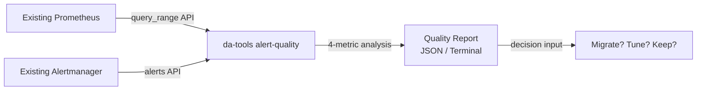

# Scenario: Shadow Audit — Evaluate Alert Health Without Migration

> **v2.0.0** | Related: [Migration Guide](../migration-guide.en.md), [Shadow Monitoring Cutover](shadow-monitoring-cutover.en.md), [CLI Reference](../cli-reference.en.md)

## Problem

Before evaluating the Dynamic Alerting platform, teams need to answer a fundamental question: **how healthy are our existing alert configurations?**

| Common Pain Point | Impact |
|-------------------|--------|
| Alert storms: same issue fires dozens of times in a row | On-call fatigue, notifications get ignored |
| Zombie alerts: thresholds haven't fired in months | Thresholds have lost relevance, but nobody dares to adjust |
| Flapping alerts: firing → resolved in < 5 minutes | Poor alert quality, triggers investigation with no actual issue |
| High suppression: >50% alerts eaten by silence/inhibit | Alert rules themselves may be poorly designed |

The traditional approach is to manually review PromQL rules one by one — labor-intensive and lacking quantitative evidence.

## Solution: `da-tools alert-quality`

The `alert-quality` tool **connects directly to your existing Prometheus / Alertmanager** — no Dynamic Alerting components need to be deployed — and produces an alert quality assessment report.

### How It Works



### Four Quality Metrics

| Metric | Measures | Threshold |
|--------|----------|-----------|
| **Noise Score** | Firings per period | >20 = BAD, >10 = WARN |
| **Stale Score** | Days since last fire | >14 days = WARN |
| **Resolution Latency** | Avg firing → resolved time | <5 min = flapping (BAD) |
| **Suppression Ratio** | Proportion inhibited/silenced | >50% = WARN |

Each alertname × tenant combination receives a GOOD / WARN / BAD grade. Tenant-level scores aggregate to a 0–100 composite score.

## Implementation Steps

### Step 1: Run the Quality Scan

```bash
# Scan all tenants, analyze past 30 days
docker run --rm --network host \
  ghcr.io/vencil/da-tools:v2.0.0 alert-quality \
  --prometheus http://localhost:9090 \
  --period 30d

# Single tenant + JSON output (for programmatic processing)
docker run --rm --network host \
  ghcr.io/vencil/da-tools:v2.0.0 alert-quality \
  --prometheus http://localhost:9090 \
  --period 30d \
  --tenant db-a \
  --json > audit-report.json
```

If Prometheus is not on localhost, substitute the reachable endpoint. **No additional components need to be installed.**

### Step 2: Read the Report

Terminal output example:

```
╔══════════════════════════════════════════════════════╗
║  Alert Quality Report — Period: 30d                  ║
╠══════════════════════════════════════════════════════╣
║  Tenant: db-a           Score: 72/100                ║
╠──────────────────────────────────────────────────────╣
║  Alert                    Noise  Stale  Flap  Supp   ║
║  MySQLHighConnections     WARN   GOOD   GOOD  GOOD   ║
║  MySQLSlowQueries         BAD    GOOD   BAD   GOOD   ║
║  RedisHighMemory          GOOD   WARN   GOOD  WARN   ║
╠──────────────────────────────────────────────────────╣
║  Summary: 1 GOOD, 1 WARN, 1 BAD                     ║
╚══════════════════════════════════════════════════════╝
```

### Step 3: Decide Based on Results

| Score Range | Recommended Action |
|-------------|-------------------|
| **80–100** | Existing alert quality is solid. Evaluate whether you need Dynamic Alerting's governance and multi-tenancy capabilities |
| **50–79** | Room for improvement. Consider gradually migrating WARN/BAD alerts to the platform for auto-suppression + scheduled thresholds |
| **0–49** | Alert quality needs systematic overhaul. Recommended to enter the full [Shadow Monitoring → Cutover](shadow-monitoring-cutover.en.md) flow |

### Step 4 (Optional): CI Integration

Incorporate quality scans into a recurring CI job to track alert quality trends:

```yaml
# .github/workflows/alert-audit.yaml
name: Weekly Alert Audit
on:
  schedule:
    - cron: "0 9 * * 1"  # Every Monday 09:00
jobs:
  audit:
    runs-on: ubuntu-latest
    steps:
      - name: Run alert quality audit
        run: |
          docker run --rm --network host \
            ghcr.io/vencil/da-tools:v2.0.0 alert-quality \
            --prometheus ${{ secrets.PROMETHEUS_URL }} \
            --period 7d --json > report.json
      - name: Upload report
        uses: actions/upload-artifact@v4
        with:
          name: alert-audit-${{ github.run_id }}
          path: report.json
```

## Next Steps

- Quality report reveals issues → [Shadow Monitoring & Cutover](shadow-monitoring-cutover.en.md) for incremental migration
- Need to understand the full migration flow → [Migration Guide](../migration-guide.en.md)
- Want to learn the platform architecture first → [Architecture & Design](../architecture-and-design.en.md)

## Related Resources

| Resource | Relevance |
|----------|-----------|
| ["Shadow Monitoring & Cutover"](shadow-monitoring-cutover.en.md) | ⭐⭐⭐ |
| ["Migration Guide"](../migration-guide.en.md) | ⭐⭐ |
| ["CLI Reference"](../cli-reference.en.md) | ⭐⭐ |
