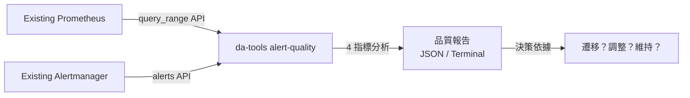

# 場景：Shadow Audit — 不遷移也能評估告警健康度

> **v2.1.0** | 相關文件：[Migration Guide](../migration-guide.md)、[Shadow Monitoring Cutover](shadow-monitoring-cutover.md)、[CLI Reference](../cli-reference.md)

## 問題

團隊在評估 Dynamic Alerting 平台之前，需要回答一個根本問題：**現有的告警設定品質如何？**

| 常見痛點 | 影響 |
|---------|------|
| 告警風暴：同一問題連續觸發數十次 | On-call 疲勞，開始忽略通知 |
| 殭屍告警：閾值設定半年未觸發 | 閾值已失去意義，但無人敢調整 |
| 快閃告警：firing → resolved < 5 分鐘 | 警報品質差，觸發調查但無實際問題 |
| 高壓制比：>50% 告警被 silence/inhibit 吃掉 | 告警規則本身可能設計有誤 |

傳統做法是手動逐一檢視 PromQL 規則，工作量大且缺乏量化依據。

## 解決方案：`da-tools alert-quality`

`alert-quality` 工具**直接連接現有的 Prometheus / Alertmanager**，不需要部署任何 Dynamic Alerting 元件，即可產出告警品質評估報告。

### 工作原理



### 四大品質指標

| 指標 | 衡量 | 判定標準 |
|------|------|---------|
| **Noise Score** | 單位時間 firing 次數 | >20 = BAD, >10 = WARN |
| **Stale Score** | 距離上次 fire 天數 | >14 天 = WARN |
| **Resolution Latency** | firing → resolved 平均時間 | <5 分鐘 = flapping（BAD） |
| **Suppression Ratio** | 被 inhibit/silence 壓制比例 | >50% = WARN |

每個 alertname × tenant 組合獲得 GOOD / WARN / BAD 評級，tenant 層級加總為 0–100 綜合分數。

## 實作步驟

### Step 1：執行品質掃描

```bash
# 掃描全部 tenant，分析過去 30 天
docker run --rm --network host \
  ghcr.io/vencil/da-tools:v2.3.0 alert-quality \
  --prometheus http://localhost:9090 \
  --period 30d

# 單一 tenant + JSON 輸出（供程式處理）
docker run --rm --network host \
  ghcr.io/vencil/da-tools:v2.3.0 alert-quality \
  --prometheus http://localhost:9090 \
  --period 30d \
  --tenant db-a \
  --json > audit-report.json
```

如果 Prometheus 不在 localhost，替換為可達的端點即可。**不需要安裝任何額外元件。**

### Step 2：閱讀報告

Terminal 輸出範例：

```
╔══════════════════════════════════════════════════════╗
║  Alert Quality Report — Period: 30d                  ║
╠══════════════════════════════════════════════════════╣
║  Tenant: db-a           Score: 72/100                ║
╠──────────────────────────────────────────────────────╣
║  Alert                    Noise  Stale  Flap  Supp   ║
║  MySQLHighConnections     WARN   GOOD   GOOD  GOOD   ║
║  MySQLSlowQueries         BAD    GOOD   BAD   GOOD   ║
║  RedisHighMemory          GOOD   WARN   GOOD  WARN   ║
╠──────────────────────────────────────────────────────╣
║  Summary: 1 GOOD, 1 WARN, 1 BAD                     ║
╚══════════════════════════════════════════════════════╝
```

### Step 3：根據結果決策

| 分數區間 | 建議行動 |
|---------|---------|
| **80–100** | 現有告警品質良好。可評估是否需要 Dynamic Alerting 的治理、多租戶能力 |
| **50–79** | 存在改善空間。建議逐步遷移 WARN/BAD 告警至平台，享受 auto-suppression + scheduled thresholds |
| **0–49** | 告警品質需要系統性改造。建議進入完整 [Shadow Monitoring → Cutover](shadow-monitoring-cutover.md) 流程 |

### Step 4（可選）：CI 整合

將品質掃描納入定期 CI job，追蹤告警品質趨勢：

```yaml
# .github/workflows/alert-audit.yaml
name: Weekly Alert Audit
on:
  schedule:
    - cron: "0 9 * * 1"  # 每週一 09:00
jobs:
  audit:
    runs-on: ubuntu-latest
    steps:
      - name: Run alert quality audit
        run: |
          docker run --rm --network host \
            ghcr.io/vencil/da-tools:v2.3.0 alert-quality \
            --prometheus ${{ secrets.PROMETHEUS_URL }} \
            --period 7d --json > report.json
      - name: Upload report
        uses: actions/upload-artifact@v4
        with:
          name: alert-audit-${{ github.run_id }}
          path: report.json
```

## 下一步

- 品質報告揭示問題 → [Shadow Monitoring & Cutover](shadow-monitoring-cutover.md) 進行漸進式遷移
- 需要了解完整遷移流程 → [Migration Guide](../migration-guide.md)
- 想先了解平台架構 → [Architecture & Design](../architecture-and-design.md)

## 相關資源

| 資源 | 相關性 |
|------|--------|
| ["Shadow Monitoring & Cutover"](shadow-monitoring-cutover.md) | ⭐⭐⭐ |
| ["Migration Guide"](../migration-guide.md) | ⭐⭐ |
| ["CLI Reference"](../cli-reference.md) | ⭐⭐ |
